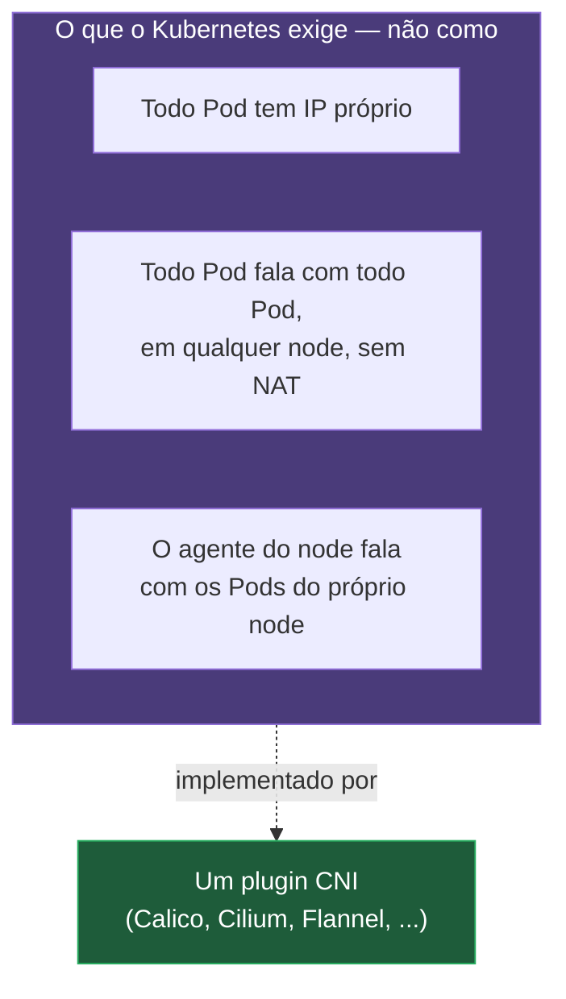
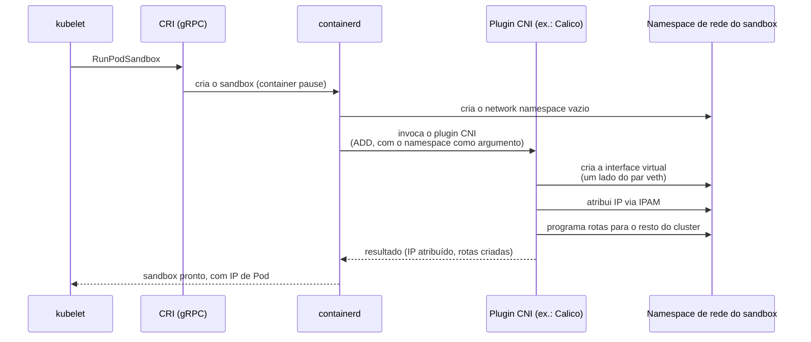
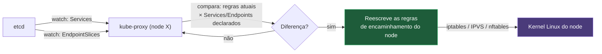
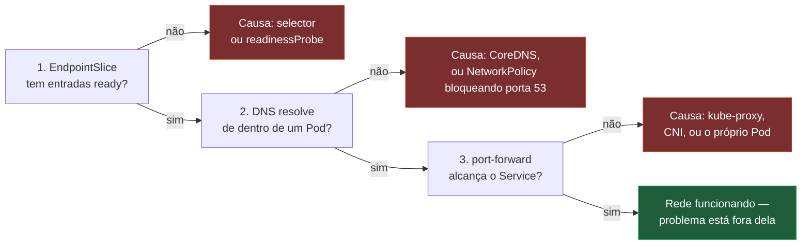
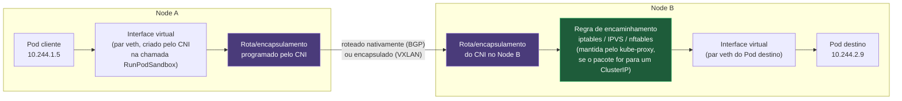

# Rede do cluster por dentro

> [!abstract] TL;DR
> Um Pod no node A abre uma conexão TCP para o IP de um Pod no node B — sem NAT, sem mapeamento de porta, sem nenhuma declaração explícita de rede — e o pacote chega. O Kubernetes não implementa essa rede plana: ele exige que ela exista, através de um contrato chamado CNI, e delega a implementação a um plugin (Calico, Cilium, Flannel) que cada cluster escolhe. Por cima dessa base, o `kube-proxy` faz o mesmo trabalho que a nota [[03-Dominios/Tecnologia/Infraestrutura/Kubernetes/05 - Service|Service]] deixou em aberto — traduzir o ClusterIP virtual de um Service numa lista real de Pods — só que agora visto de dentro: ele é, ele mesmo, um controller, observando Services e EndpointSlices via watch e reescrevendo, continuamente, as regras de encaminhamento do kernel de cada node para bater com o que foi declarado. Ninguém "configura a rede" de um cluster Kubernetes; alguém declara um Service, e um laço de reconciliação converge regras de `iptables`, de `IPVS` ou de `nftables`, em todo node, sem parar.

Volte à cena que fecha a nota [[03-Dominios/Tecnologia/Infraestrutura/Kubernetes/17 - O kubelet e o nó|O kubelet e o nó]]: um container existe, de fato, dentro de um sandbox de Pod cujo namespace de rede é dono do container `pause` — o processo mínimo que segura a interface `eth0`, o endereço IP e a tabela de rotas que todos os containers daquele Pod vão compartilhar. Essa nota parou exatamente ali, no instante em que o Pod tem um endereço IP próprio, roteável dentro do cluster. O que ela deliberadamente não abriu é a pergunta que esta nota responde: como esse IP, atribuído a um Pod específico num node específico, se torna alcançável a partir de qualquer outro Pod, em qualquer outro node, sem que ninguém precise configurar uma única rota manualmente? A resposta não é mágica de rede — é outro exemplo do mesmo padrão observar-comparar-agir que a nota [[03-Dominios/Tecnologia/Infraestrutura/Kubernetes/02 - O loop de reconciliação|O loop de reconciliação]] já estabeleceu para todo o resto do cluster, só que desta vez a diferença que se converge não é entre `spec.replicas` e `status.replicas` — é entre "quais Services e Pods existem agora" e "quais regras de kernel refletem isso em cada máquina".

Vale marcar o contraste com o galho anterior deste domínio, porque ele é a régua mais honesta para medir o que muda aqui. A nota [[03-Dominios/Tecnologia/Infraestrutura/Docker/07 - Rede no Docker|Rede no Docker]] descreveu um modelo inteiro contido numa única máquina: uma bridge de software, NAT de origem para sair para a internet, NAT de destino via `-p` para publicar uma porta, e um DNS embutido resolvendo nomes só dentro daquela mesma bridge local. Todo esse modelo pressupõe uma fronteira clara entre "dentro do host" e "fora do host", e resolve exatamente essa fronteira. O modelo de rede do Kubernetes existe porque essa fronteira deixa de fazer sentido: um cluster de produção comum tem dezenas ou centenas de nodes, e um Pod pode nascer em qualquer um deles a qualquer momento — o `kube-scheduler`, como a nota 12 deste galho já descreveu, decide o node sem nenhuma garantia de que dois Pods do mesmo Deployment fiquem próximos fisicamente. Se cada node fosse uma ilha isolada por NAT, como cada container é uma ilha isolada por bridge no Docker de máquina única, um Pod jamais conseguiria falar com um Service cujos backends estão espalhados por nodes diferentes sem uma camada extra de tradução em cada salto. O Kubernetes resolve isso ao contrário do Docker: em vez de aceitar NAT como padrão e publicar porta como exceção, ele exige rede plana como padrão — todo Pod fala com todo Pod, sem NAT, o tempo todo — e trata a fronteira do cluster inteiro, não do node individual, como o único lugar onde NAT de saída ainda faz sentido.

## O modelo que o Kubernetes exige, não implementa

Vale nomear com precisão os três requisitos que qualquer implementação de rede de um cluster Kubernetes precisa satisfazer, porque eles são, ao mesmo tempo, minimalistas e absolutos — o Kubernetes não pede uma topologia específica, só um comportamento observável, e não tolera exceção parcial a nenhum dos três.

Primeiro: **todo Pod tem um endereço IP próprio**, roteável dentro do cluster, atribuído no momento em que o sandbox nasce — o mesmo instante que a nota [[03-Dominios/Tecnologia/Infraestrutura/Kubernetes/17 - O kubelet e o nó|O kubelet e o nó]] já descreveu como `RunPodSandbox`, a chamada CRI que materializa o container `pause`. Não existe, no modelo do Kubernetes, um "IP de container" separado de um "IP de Pod" — todos os containers de um Pod compartilham o único IP atribuído ao sandbox, exatamente porque compartilham o mesmo namespace de rede.

Segundo: **todo Pod consegue falar com todo outro Pod, em qualquer node, sem NAT** — nem NAT de origem, nem NAT de destino, nem tradução de porta no meio do caminho. Um Pod no node A que abra uma conexão TCP contra o IP de um Pod no node B vê, do lado do destino, o IP real de origem do Pod cliente, não um IP traduzido de algum gateway intermediário. É essa ausência de tradução, especificamente, que separa o modelo do Kubernetes do modelo padrão de rede do Docker de máquina única, onde o NAT de origem para sair de uma bridge é a regra, não a exceção.

Terceiro: **o agente de cada node consegue falar com todo Pod que roda naquele node**, sem NAT — o requisito que garante que o próprio kubelet, e ferramentas de operação como `kubectl exec` e `kubectl logs`, consigam alcançar um container diretamente, sem depender da mesma camada de tradução que um cliente externo usaria.



Vale reter o que esses três requisitos deliberadamente **não** especificam: nenhuma palavra sobre como o roteamento acontece de verdade entre nodes, nenhuma exigência sobre topologia de rede física, nenhuma decisão sobre encapsulamento contra roteamento nativo. O Kubernetes define o contrato — o comportamento observável que qualquer aplicação rodando no cluster pode assumir como verdade — e delega inteiramente a implementação a um componente de fora do próprio projeto. É essa separação entre contrato e implementação, exatamente o mesmo padrão que a nota [[03-Dominios/Tecnologia/Infraestrutura/Kubernetes/17 - O kubelet e o nó|O kubelet e o nó]] já descreveu para CRI, entre o kubelet e o container runtime, que a próxima seção nomeia por inteiro.

## CNI: o contrato de plugin

**Container Network Interface (CNI)** é uma especificação, mantida por um projeto irmão do Kubernetes dentro da CNCF, que define como um runtime de container invoca um plugin de rede para configurar o namespace de rede de um sandbox recém-criado. Assim como CRI formaliza a fronteira entre o kubelet e o container runtime, CNI formaliza a fronteira entre o runtime e o plugin de rede — e as duas fronteiras, deliberadamente, se parecem: um contrato pequeno, versionado à parte do Kubernetes, que qualquer implementação pode satisfazer sem depender do código-fonte do projeto principal.

Quem invoca o plugin CNI não é o kubelet diretamente — é o **container runtime**, a pedido do kubelet, no exato instante em que ele processa a chamada `RunPodSandbox` que a nota anterior deste galho já descreveu. A sequência, encaixando a peça de rede na cadeia que a nota 17 já percorreu até `runc`, fica assim:



O que o plugin faz, concretamente, dentro dessa chamada, cobre três responsabilidades que qualquer implementação de CNI precisa assumir. A primeira é **criar a interface de rede** do Pod — tipicamente um dos lados de um par `veth`, o mesmo mecanismo de par de interfaces virtuais que a nota [[03-Dominios/Tecnologia/Infraestrutura/Docker/07 - Rede no Docker|Rede no Docker]] já descreveu para a bridge do Docker, só que aqui um lado fica dentro do namespace do Pod e o outro fica no namespace do node, conectado à topologia que o plugin específico decidiu montar. A segunda é o **IPAM** (*IP Address Management*) — decidir qual endereço, dentro da faixa reservada para aquele node ou para o cluster inteiro, esse Pod específico vai receber, e registrar essa alocação para não reutilizar o mesmo IP em dois Pods simultâneos. A terceira é **programar rotas** — garantir que um pacote saindo daquele Pod, endereçado a um IP de Pod em outro node, saiba por onde sair; é exatamente aqui que as diferentes implementações de CNI divergem de forma mais visível.

Implementações reais de CNI variam bastante em maturidade e em modelo de dados, mas três nomes aparecem com frequência em qualquer cluster de produção: **Calico**, que oferece tanto roteamento nativo via BGP quanto encapsulamento, com foco forte em NetworkPolicy avançada; **Cilium**, construído sobre eBPF, que a seção seguinte trata com mais profundidade justamente porque ele também substitui o `kube-proxy`; e **Flannel**, historicamente o mais simples dos três, tradicionalmente restrito a encapsulamento via VXLAN, sem as camadas avançadas de política que Calico e Cilium oferecem.

Vale nomear, com honestidade, as duas grandes famílias de abordagem que qualquer CNI escolhe entre si, porque o trade-off entre elas não é sutil e explica boa parte da escolha de produto em produção. **Roteamento nativo** — tipicamente via BGP, o mesmo protocolo que roteia a internet inteira entre provedores — trata cada node como um roteador de verdade, anunciando as faixas de IP dos Pods que ele hospeda para os outros nodes, e deixando a infraestrutura de rede subjacente encaminhar pacotes normalmente, sem envolver nenhuma camada extra por cima. Isso exige que a rede física ou virtual sobre a qual o cluster roda suporte BGP entre os nodes — um requisito que nem toda rede de nuvem satisfaz de graça, sobretudo em ambientes multi-tenant altamente restritos. **Encapsulamento** — via VXLAN ou IP-in-IP — resolve o mesmo problema sem exigir nada da rede subjacente: cada pacote destinado a outro node é embrulhado dentro de outro pacote, endereçado ao IP real daquele node na rede física, e desembrulhado do outro lado. Funciona em praticamente qualquer rede subjacente, inclusive as mais restritas, mas paga um custo real de desempenho — cada pacote carrega o overhead do cabeçalho de encapsulamento, e a CPU de cada node gasta ciclos embrulhando e desembrulhando pacotes que, com roteamento nativo, trafegariam sem essa camada extra.

| Abordagem | Como funciona | Vantagem | Custo |
| --- | --- | --- | --- |
| Roteamento nativo (BGP) | Cada node anuncia suas faixas de Pod IP; a rede encaminha normalmente | Desempenho próximo ao de rede física, sem overhead de encapsulamento | Exige suporte a BGP na rede subjacente, nem sempre disponível |
| Encapsulamento (VXLAN, IP-in-IP) | Pacotes embrulhados num túnel entre nodes | Funciona em qualquer rede subjacente, sem requisito especial | Overhead de CPU e de tamanho de pacote em cada salto entre nodes |

Vale ver a forma concreta desse contrato — o arquivo de configuração que o container runtime lê em `/etc/cni/net.d`, o mesmo diretório que a nota [[03-Dominios/Tecnologia/Infraestrutura/Kubernetes/17 - O kubelet e o nó|O kubelet e o nó]] deixou implícito ao descrever a fronteira CRI. Um plugin Calico configurado para roteamento nativo, por exemplo, publica algo como isto no disco de cada node:

```json
{
    "name": "k8s-pod-network",
    "cniVersion": "1.0.0",
    "plugins": [
        {
            "type": "calico",
            "log_level": "info",
            "datastore_type": "kubernetes",
            "mtu": 1500,
            "ipam": {
                "type": "calico-ipam"
            },
            "policy": {
                "type": "k8s"
            },
            "kubernetes": {
                "kubeconfig": "/etc/cni/net.d/calico-kubeconfig"
            }
        },
        {
            "type": "portmap",
            "capabilities": {"portMappings": true}
        }
    ]
}
```

Repare no campo `"type": "calico-ipam"` dentro de `ipam` — é literalmente a segunda responsabilidade que este parágrafo já nomeou, delegada por sua vez a um plugin auxiliar dedicado só a alocação de endereço, o mesmo padrão de composição de plugins pequenos que a especificação CNI incentiva desde a origem. O segundo plugin da lista, `portmap`, é o mesmo tipo de plugin auxiliar que a nota [[03-Dominios/Tecnologia/Infraestrutura/Docker/07 - Rede no Docker|Rede no Docker]] descreveu de forma equivalente para publicação de porta no Docker — só que aqui aplicado ao caso mais raro de um Pod que precise de `hostPort`, não ao caminho normal de tráfego entre Pods, que nunca depende de mapeamento de porta nenhum.

Nenhuma das duas abordagens é universalmente superior — a escolha depende de quanto controle existe sobre a rede subjacente. Um cluster rodando numa nuvem pública, sobre uma VPC que já suporta o roteamento necessário, tende a se beneficiar de roteamento nativo; um cluster bare-metal numa rede corporativa restrita, onde anunciar rotas BGP entre máquinas exige coordenação com o time de rede física, frequentemente começa com encapsulamento por simplicidade operacional, mesmo pagando o custo de desempenho.

> [!info] Baseline de versão
> A especificação CNI é versionada de forma independente do Kubernetes; o projeto Kubernetes exige, a partir de versões correntes, compatibilidade com a especificação CNI 0.4.0 ou superior, recomendando 1.0.0 ou superior para plugins novos. Desde a versão 1.24 do Kubernetes (a mesma versão que removeu o dockershim, já discutida na nota anterior deste galho), a responsabilidade de invocar plugins CNI saiu do escopo direto do kubelet e passou a ser do container runtime — o mesmo runtime que já fala CRI com o kubelet agora também carrega a responsabilidade de carregar e chamar os plugins CNI configurados no node.

## `kube-proxy` e como o Service vira regra

A nota [[03-Dominios/Tecnologia/Infraestrutura/Kubernetes/05 - Service|Service]] deixou uma promessa explícita em aberto: descreveu o ClusterIP como "uma entrada numa tabela de regras" mantida em todo node, sem abrir o formato exato dessa tabela nem o componente que a escreve. Esse componente é o **`kube-proxy`**, e ele é, ele mesmo, mais um controller do mesmo tipo que a nota 02 deste galho já ensinou a reconhecer — só que a `spec` que ele reconcilia não é um único objeto, é a combinação de todo Service e todo EndpointSlice do cluster, e o `status` que ele produz não é escrito de volta no etcd, é escrito diretamente no kernel de cada node, na forma de regras de encaminhamento de pacote.



Existem três modos de operação para o `kube-proxy` em nodes Linux, e cada um traduz o mesmo par Service/EndpointSlice numa estrutura de kernel diferente, com trade-offs próprios de desempenho e de forma de leitura.

**Modo `iptables`**, o mais antigo e ainda o padrão por compatibilidade, representa cada Service como uma cadeia de regras dentro do `netfilter` do kernel Linux. Vale ver isso com as próprias mãos — uma versão simplificada, mas realista, do que `iptables-save` mostra num node com um Service `myapp` de duas réplicas:

```
:KUBE-SERVICES - [0:0]
:KUBE-SVC-XPGD46QRK7WJZT7O - [0:0]
:KUBE-SEP-SXIVWICOYRO3J4NJ - [0:0]
:KUBE-SEP-UKSFD7AGPMPPLUXG - [0:0]

-A KUBE-SERVICES -d 10.96.14.22/32 -p tcp -m tcp --dport 80 -j KUBE-SVC-XPGD46QRK7WJZT7O

-A KUBE-SVC-XPGD46QRK7WJZT7O -m statistic --mode random --probability 0.50000000000 -j KUBE-SEP-SXIVWICOYRO3J4NJ
-A KUBE-SVC-XPGD46QRK7WJZT7O -j KUBE-SEP-UKSFD7AGPMPPLUXG

-A KUBE-SEP-SXIVWICOYRO3J4NJ -p tcp -m tcp -j DNAT --to-destination 10.244.1.5:8080
-A KUBE-SEP-UKSFD7AGPMPPLUXG -p tcp -m tcp -j DNAT --to-destination 10.244.2.9:8080
```

Vale ler essas quatro cadeias na ordem em que o pacote de fato as atravessa. A cadeia `KUBE-SERVICES` é o ponto de entrada único: qualquer pacote endereçado ao ClusterIP `10.96.14.22` na porta `80` é desviado para a cadeia específica daquele Service, `KUBE-SVC-XPGD46QRK7WJZT7O` — um nome opaco, derivado de um hash, porque `iptables` não trabalha com nomes legíveis de Service diretamente. Dentro dessa cadeia de Service, a seleção do backend acontece através do módulo `statistic` em modo `random`: a primeira regra tem `--probability 0.5`, ou seja, 50% de chance de o pacote ser desviado para o primeiro backend (`KUBE-SEP-SXIVWICOYRO3J4NJ`); se essa regra não "pegar" o pacote, ele cai na regra seguinte, sem condição de probabilidade — o segundo e último backend, que recebe o que sobrou. Com três backends, a primeira regra teria probabilidade 1/3, a segunda 1/2 (das que sobraram), a terceira nenhuma — o mesmo truque estatístico, generalizado. Cada cadeia `KUBE-SEP-*` (*service endpoint*) faz, por fim, o trabalho de tradução real: um `DNAT`, reescrevendo o destino do pacote do ClusterIP virtual para o IP e porta reais de um Pod específico.

O custo estrutural do modo `iptables` está exatamente nessa forma de cadeia sequencial: encontrar a regra certa para um pacote é, no pior caso, uma varredura linear por uma lista de condições, e o número de regras cresce proporcionalmente ao número de Services e de backends por Service. Um cluster com uma dúzia de Services mal percebe esse custo; um cluster com milhares de Services e dezenas de milhares de endpoints começa a pagar, de forma mensurável, tanto em latência de avaliação de pacote quanto no tempo que o próprio `kube-proxy` leva para recalcular e reaplicar a tabela inteira sempre que qualquer Service ou EndpointSlice muda — uma atualização de uma única entrada, nesse modo, historicamente exigia reescrever e recarregar a tabela de regras inteira, não só o trecho afetado.

**Modo `IPVS`** (*IP Virtual Server*), um subsistema do próprio kernel Linux desenhado especificamente para balanceamento de carga em nível de kernel, resolve exatamente esse gargalo de escala trocando a cadeia sequencial por uma **tabela de hash**: localizar o Service correspondente a um pacote deixa de ser uma varredura linear e passa a ser uma consulta de custo constante, independente de quantos Services existem no cluster. O IPVS também abre a porta para algoritmos de balanceamento mais ricos do que a escolha aleatória do modo `iptables` — round-robin, menor número de conexões ativas (*least connection*), hash de origem para afinidade de sessão sem depender de cookie de aplicação, entre outros — configuráveis por cluster. A troca não é de graça: o modo IPVS exige módulos de kernel específicos carregados no node, e a inspeção manual das regras não usa mais `iptables-save` — usa ferramentas próprias do IPVS, como `ipvsadm -Ln`, para listar os *virtual servers* e seus *real servers* associados:

```bash
sudo ipvsadm -Ln
```

```
IP Virtual Server version 1.2.1 (size=4096)
Prot LocalAddress:Port Scheduler Flags
  -> RemoteAddress:Port           Forward Weight ActiveConn InActConn
TCP  10.96.14.22:80 rr
  -> 10.244.1.5:8080              Masq    1      0          0
  -> 10.244.2.9:8080              Masq    1      0          0
```

O paralelo com a saída de `iptables-save` é direto: a linha `TCP 10.96.14.22:80 rr` é o equivalente ao par `KUBE-SERVICES`/`KUBE-SVC-*` — o ClusterIP e a porta, mais o algoritmo de escalonamento escolhido, aqui `rr` de *round-robin* — e cada linha `-> RemoteAddress:Port` é o equivalente a uma cadeia `KUBE-SEP-*`, um backend real com seu peso (`Weight`) e suas conexões ativas contadas em tempo real pelo próprio kernel, informação que o modo `iptables` simplesmente não expõe, porque `netfilter` não mantém esse tipo de contador por regra.

**Modo `nftables`** é o mais recente dos três, construído sobre o sucessor moderno do `iptables` dentro do próprio kernel Linux — o mesmo `nftables` que a nota [[03-Dominios/Tecnologia/Infraestrutura/Docker/07 - Rede no Docker|Rede no Docker]] já citou de passagem como alternativa a `iptables` para as regras de NAT do Docker. A vantagem estrutural do modo `nftables` sobre o modo `iptables` clássico é resolver o mesmo problema de escala do IPVS por outro caminho: em vez de uma cadeia sequencial de regras por Service, ele usa um único `verdict map` — uma estrutura de consulta direta, também de custo constante, que associa IP, protocolo e porta de destino diretamente à cadeia de tratamento correta, sem precisar percorrer uma lista de condições uma a uma.

Vale nomear ainda um detalhe operacional que reaparece em qualquer um dos três modos, porque conecta diretamente com o mecanismo de watch que a nota 02 deste galho já detalhou: o `kube-proxy` não recalcula as regras do zero a cada mudança isolada — ele agrega mudanças que chegam dentro de uma janela curta (configurável, tipicamente da ordem de um segundo) antes de reescrever as regras afetadas, evitando que uma rajada de eventos de EndpointSlice — um rollout inteiro substituindo dezenas de Pods de uma vez, por exemplo — dispare dezenas de reescritas de tabela em sequência. É o mesmo compromisso entre latência de convergência e custo de reconciliação que qualquer controller deste galho já precisou fazer, aplicado aqui à estrutura mais sensível a custo de reescrita entre as três.

> [!info] Baseline de versão
> O modo `nftables` do `kube-proxy` foi introduzido como funcionalidade alpha na versão 1.29 do Kubernetes, avançou para beta na 1.31, e alcançou disponibilidade geral (GA) na 1.33 — timeline confirmada pelo blog oficial do projeto e pelo KEP-3866. Mesmo com o modo em GA, o Kubernetes mantém `iptables` como modo padrão por compatibilidade: nenhum cluster migra automaticamente entre uma versão e outra, e adotar `nftables` exige configurar explicitamente `mode: "nftables"` na configuração do `kube-proxy`. O modo `IPVS`, por sua vez, foi **marcado como depreciado na versão 1.35** — ele continua funcionando nas versões correntes, mas deixou de ser o caminho recomendado, e quem hoje escolheria `IPVS` para escapar do custo linear do `iptables` deve olhar para `nftables` em vez dele. Depreciado não é removido: não há data de remoção anunciada, e migrar é decisão de planejamento, não emergência.

| Modo | Estrutura de kernel | Custo de consulta | Seleção de backend | Observação prática |
| --- | --- | --- | --- | --- |
| `iptables` | Cadeias sequenciais de regras | Linear, cresce com o nº de Services | Aleatória, via módulo `statistic` | Padrão histórico; gargalo visível só em clusters muito grandes |
| `IPVS` | Tabela de hash | Constante | Round-robin, menor conexão, hash de origem, entre outros | Exige módulos de kernel específicos; **depreciado desde a 1.35** |
| `nftables` | Verdict map | Constante | Segue a mesma lógica de seleção do IPVS/iptables, sobre estrutura mais eficiente | GA desde a 1.33; não é o padrão automaticamente |

## A alternativa sem `kube-proxy`: eBPF

Existe uma terceira via, mais radical do que trocar de modo dentro do `kube-proxy`: eliminar o `kube-proxy` inteiramente. Implementações de CNI baseadas em **eBPF** — a mais conhecida delas, Cilium — interceptam e redirecionam pacotes através de programas carregados diretamente no kernel, anexados a pontos específicos da pilha de rede (a interface de rede, o soquete, ou pontos ainda mais cedo no caminho do pacote), em vez de depender de tabelas de `netfilter` geridas por um processo de espaço de usuário observando o cluster via watch. O resultado observável, do ponto de vista de um Service, é o mesmo — um pacote endereçado a um ClusterIP chega a um Pod real — mas o caminho que o pacote percorre dentro do kernel é mais curto, porque a decisão de para onde encaminhar acontece num programa eBPF anexado bem cedo no processamento do pacote, sem precisar atravessar a mesma sequência de cadeias de `netfilter` que o modo `iptables` monta.

Esta nota não aprofunda o mecanismo interno de eBPF — programas verificados e carregados no kernel, mapas de dados compartilhados entre espaço de usuário e espaço de kernel, os pontos de anexo disponíveis — porque isso pertence a uma camada de conhecimento de kernel Linux fora do escopo deste galho. Vale reter só o argumento de escala que motiva a substituição: eliminar o `kube-proxy` como processo intermediário, e eliminar a necessidade de milhares de regras de `netfilter` por node, tende a produzir latência mais previsível e menor consumo de CPU à medida que o número de Services e de Pods cresce — o mesmo tipo de ganho que levou o modo `nftables` a existir, só que levado adiante ao ponto de dispensar a camada de `netfilter` por completo, não só otimizar como ela é usada.

> [!tip] Vídeo — a camada de kernel que esta nota decidiu não abrir, aberta com números
> [**Liberating Kubernetes From Kube-proxy and Iptables**](https://www.youtube.com/watch?v=bIRwSIwNHC0) (Martynas Pumputis, Cilium — KubeCon, canal oficial da CNCF, ~35 min, EN) é o complemento exato do parágrafo acima: ele percorre o caminho que um pacote faz dentro do kernel até chegar ao Pod — alocação do `skb`, *traffic control*, a travessia das cadeias de `iptables`, a decisão de roteamento, o par `veth` — e mostra o detalhe que torna o custo palpável: ao entrar no *network namespace* do Pod, o pacote **atravessa as cadeias de novo**, porque as cadeias são por namespace. Também abre, regra a regra, como o `kube-proxy` monta a cascata `KUBE-SERVICES` → `KUBE-SVC-<serviço>` e faz a seleção de endpoint por probabilidade antes do DNAT. O achado mais útil está nos benchmarks: a latência do modo `iptables` sobe conforme o número de Services cresce, exatamente como a cadeia sequencial descrita acima prevê — mas o `IPVS`, apesar da tabela de hash, **perde para o `iptables` quando há poucos Services**, o que qualifica a escolha entre os dois como uma questão de escala, não de superioridade absoluta. **O que ele não cobre:** o contrato CNI, NetworkPolicy, CoreDNS e o modo `nftables` — este último nem existia à época. Trecho de destaque [28:54]: *"another thing is that iptables actually outperforms the IPVS implementation when there's a relatively small number of services."*
>
> ⚠️ Palestra de 2019: o argumento de arquitetura e os caminhos de kernel continuam válidos, mas as versões citadas de Cilium e Kubernetes estão defasadas — o modo `nftables`, por exemplo, só chegou a GA na 1.33, como a ressalva de versão desta nota registra.
>
> 🎬 [Assistir no YouTube](https://www.youtube.com/watch?v=bIRwSIwNHC0)

Vale nomear, sem detalhar, como esse desligamento aparece na prática, porque é uma decisão explícita de instalação, não um comportamento automático. Um cluster instalado com Cilium precisa ativar deliberadamente o modo que substitui o `kube-proxy` — tipicamente uma flag como `kubeProxyReplacement: true` na configuração do próprio Cilium — e, quando essa opção está ativa, o `kube-proxy` sequer é implantado no cluster: nenhum `DaemonSet` correspondente aparece em `kube-system`, porque toda a responsabilidade de traduzir Service em backend real já foi assumida pelos programas eBPF que o próprio Cilium carrega em cada node. Um cluster que já roda `kube-proxy` normalmente e quer migrar para esse modo precisa, então, remover o `kube-proxy` existente como parte da migração — não é uma sobreposição de dois mecanismos concorrentes, é uma substituição completa de um pelo outro.

## DNS do cluster: CoreDNS e a armadilha do `ndots`

A nota [[03-Dominios/Tecnologia/Infraestrutura/Kubernetes/05 - Service|Service]] já descreveu o formato do nome que todo Service recebe — `<service>.<namespace>.svc.cluster.local` — e o fato de que um servidor DNS interno, tipicamente **CoreDNS**, mantém esses registros atualizados observando os Services do cluster. Esta seção completa esse mecanismo por dentro, porque o "como" da resolução esconde uma armadilha de desempenho real, não hipotética, que qualquer aplicação que fale com serviços externos ao cluster tende a encontrar mais cedo ou mais tarde.

Todo Pod recebe, injetado pelo kubelet no momento em que o sandbox é criado, um `/etc/resolv.conf` apontando para o serviço interno do CoreDNS, mais uma lista de domínios de busca (*search domains*) derivada do próprio namespace do Pod:

```
nameserver 10.96.0.10
search default.svc.cluster.local svc.cluster.local cluster.local
options ndots:5
```

O próprio CoreDNS, do lado do servidor, é configurado por um arquivo declarativo chamado `Corefile`, mantido como um ConfigMap no namespace `kube-system` — o mesmo padrão de configuração fora da imagem que qualquer objeto `ConfigMap` do cluster segue, aplicado aqui ao servidor de DNS em vez de a uma aplicação comum. Uma instalação padrão carrega algo próximo disto:

```
.:53 {
    errors
    health
    ready
    kubernetes cluster.local in-addr.arpa ip6.arpa {
        pods insecure
        fallthrough in-addr.arpa ip6.arpa
    }
    prometheus :9153
    forward . /etc/resolv.conf
    cache 30
    loop
    reload
    loadbalance
}
```

O plugin `kubernetes` é o coração dessa configuração: ele observa, via watch contra o api-server — o mesmo mecanismo de Informer que qualquer outro controller deste galho já usa —, todo Service do cluster, e responde consultas dentro dos domínios `cluster.local` a partir dessa observação, sem depender de nenhum arquivo de zona estático. A diretiva `forward . /etc/resolv.conf` é o que resolve a quarta tentativa do exemplo de `ndots` a seguir: qualquer nome que não caia dentro de `cluster.local` é encaminhado para o resolvedor upstream configurado no próprio node, tipicamente o DNS do provedor de nuvem ou da rede corporativa. E a diretiva `cache 30` — um cache de 30 segundos por padrão — é o que impede que uma rajada de consultas repetidas para o mesmo nome externo martele o resolvedor upstream a cada requisição, ainda que não elimine o custo das quatro tentativas na primeira consulta de um nome ainda não cacheado.

O campo `search`, nessa configuração, é o que sustenta a resolução curta que a nota 05 já mostrou funcionando — um Pod no namespace `default` que resolva só `myapp`, sem qualificar nada, tem esse nome curto expandido automaticamente contra cada domínio da lista de busca, na ordem, até um deles responder com sucesso. É exatamente essa expansão automática, porém, que produz o efeito colateral que a opção `ndots:5` controla: `ndots` define quantos pontos um nome precisa ter para ser tratado como já completo, tentado diretamente contra o DNS sem passar pelos domínios de busca primeiro. Com `ndots:5`, qualquer nome com **menos** de cinco pontos — o que cobre a esmagadora maioria dos nomes de domínio comuns da internet — é tratado como incompleto, e o resolvedor tenta, primeiro, cada combinação com os domínios de busca antes de tentar o nome como está.

Vale seguir esse comportamento com um exemplo concreto, porque é aqui que a armadilha aparece de verdade. Um Pod que precise resolver `api.exemplo.com` — um nome externo ao cluster, com só dois pontos, bem abaixo do limiar de cinco — dispara, na ordem, as seguintes tentativas antes de qualquer uma ter chance de funcionar:

```
1. api.exemplo.com.default.svc.cluster.local   → falha (não existe)
2. api.exemplo.com.svc.cluster.local            → falha (não existe)
3. api.exemplo.com.cluster.local                → falha (não existe)
4. api.exemplo.com                              → sucesso (consulta absoluta, finalmente)
```

Três consultas fracassadas, cada uma delas uma viagem de rede completa até o CoreDNS e, dependendo da configuração, até um resolvedor externo consultado por ele, antes da quarta tentativa — a correta — sequer começar. Numa aplicação que resolve esse nome uma vez e reutiliza a conexão, o custo é um punhado de milissegundos irrelevantes na inicialização. Numa aplicação que resolve o mesmo nome externo a cada requisição — um cliente HTTP mal configurado sem *connection pooling*, por exemplo — esse custo se multiplica pelo volume de tráfego inteiro, e o sintoma que aparece em produção não é "DNS lento" de forma óbvia, é latência de cauda alta, difícil de atribuir sem saber exatamente onde procurar, mais uma carga de consulta no CoreDNS proporcionalmente maior do que o número de nomes distintos resolvidos sugeriria à primeira vista — cada nome externo custa quatro consultas, não uma.

A correção mais comum, quando esse padrão aparece com volume relevante de tráfego externo, é qualificar o nome com um ponto final — `api.exemplo.com.`, com o ponto ao final — o que instrui o resolvedor a tratar o nome como absoluto e pular a expansão de domínios de busca inteiramente; a alternativa, mais estrutural, é ajustar a política de DNS do próprio Pod (`dnsConfig.options` no manifesto) para reduzir o `ndots` efetivo em cargas de trabalho que resolvem majoritariamente nomes externos. Nenhuma das duas correções é o padrão automático do cluster — as duas exigem reconhecer, primeiro, que o sintoma observado é essa armadilha específica, não lentidão de rede genérica.

## `externalTrafficPolicy`: `Cluster` contra `Local`

Um Service do tipo `NodePort` ou `LoadBalancer` — os dois tipos que a nota [[03-Dominios/Tecnologia/Infraestrutura/Kubernetes/05 - Service|Service]] já descreveu como capazes de receber tráfego de fora do cluster — carrega um campo, `externalTrafficPolicy`, que decide um comportamento fino, mas com consequências reais em produção: o que acontece quando o tráfego externo chega a um node que não tem, ele mesmo, nenhum Pod saudável daquele Service.

Com `externalTrafficPolicy: Cluster`, o padrão, o `kube-proxy` de qualquer node aceita o tráfego e o redireciona para qualquer Pod saudável do Service, esteja ele no mesmo node ou em outro — o mesmo comportamento de balanceamento uniforme entre todos os backends que as seções anteriores já descreveram. O preço dessa uniformidade é um salto de rede a mais quando o Pod escolhido não está no mesmo node que recebeu o pacote originalmente, e a perda do IP real do cliente: como o pacote pode precisar atravessar a rede entre nodes antes de chegar ao Pod, o `kube-proxy` reescreve o endereço de origem (*source NAT*) nesse salto extra, e o Pod que efetivamente atende a requisição vê o IP de um node do cluster como origem, não o IP real de quem fez a chamada.

Com `externalTrafficPolicy: Local`, o `kube-proxy` só encaminha tráfego para Pods que estão rodando no **mesmo node** que recebeu o pacote — nunca atravessa para outro node. Isso preserva o IP real do cliente, porque não há mais nenhum salto extra entre nodes exigindo *source NAT*, e é exatamente por isso que esse modo é a escolha certa sempre que a aplicação precisa do IP verdadeiro de quem chamou — para *rate limiting* por IP, para geolocalização, para auditoria. O custo é um desbalanceamento potencial: se um node só tem um Pod do Service e outro node tem quatro, o tráfego que chega no primeiro node concentra-se inteiro naquele único Pod, enquanto os quatro do segundo node dividem entre si o tráfego que chega ali — a distribuição deixa de ser por Pod e passa a ser por node, o que só é uniforme se a distribuição de réplicas entre nodes também for.

| Política | Preserva IP de origem? | Desbalanceamento possível? | Salto extra entre nodes? |
| --- | --- | --- | --- |
| `Cluster` (padrão) | Não — sofre *source NAT* | Não — balanceia entre todos os Pods saudáveis | Sim, quando o Pod escolhido está em outro node |
| `Local` | Sim | Sim — depende de quantos Pods rodam em cada node | Não — só usa Pods do próprio node |

A declaração, no manifesto, é uma única linha a mais dentro da `spec` já familiar de qualquer Service `LoadBalancer`:

```yaml
apiVersion: v1
kind: Service
metadata:
    name: myapp-lb
spec:
    selector:
        app: myapp
    ports:
        - port: 80
          targetPort: 8080
    type: LoadBalancer
    externalTrafficPolicy: Local   # preserva o IP real do cliente
```

Vale registrar o sinal que confirma, na prática, que essa política está em vigor: um Service com `externalTrafficPolicy: Local` ganha um campo adicional em `spec.healthCheckNodePort`, uma porta que o balanceador de nuvem externo (quando existe um, provisionado pelo cloud controller manager que a nota [[03-Dominios/Tecnologia/Infraestrutura/Kubernetes/05 - Service|Service]] já descreveu) consulta em cada node para saber se aquele node específico tem algum Pod saudável do Service — só assim o balanceador externo evita enviar tráfego para um node que, sob essa política, simplesmente descartaria o pacote por não ter nenhum Pod local para atendê-lo.

## NetworkPolicy de raspão

Vale nomear, sem aprofundar, um objeto que este galho deliberadamente não desenvolve por completo: **NetworkPolicy**, o firewall em nível de Pod do Kubernetes, declarado como qualquer outro objeto — `podSelector`, regras de `ingress` e `egress` — e reconciliado pelo mesmo padrão de sempre. O detalhe que importa para esta nota, especificamente, é onde essa política é de fato aplicada: **não existe nenhum controller central de NetworkPolicy no control plane**. Quem aplica a política é o próprio plugin CNI — o mesmo componente que já apareceu nesta nota criando interfaces e programando rotas — e isso significa que a existência de NetworkPolicy no manifesto de um cluster não garante, por si só, que ela está sendo respeitada.

```yaml
apiVersion: networking.k8s.io/v1
kind: NetworkPolicy
metadata:
    name: api-so-do-frontend
spec:
    podSelector:
        matchLabels:
            app: api
    policyTypes:
        - Ingress
    ingress:
        - from:
              - podSelector:
                    matchLabels:
                        app: frontend
          ports:
              - protocol: TCP
                port: 8080
```

Note que o `podSelector` desse manifesto reaproveita exatamente o mesmo mecanismo de correspondência por label que a nota [[03-Dominios/Tecnologia/Infraestrutura/Kubernetes/06 - Namespaces, labels e selectors|Namespaces, labels e selectors]] já descreveu para Service e ReplicaSet — o objeto não aponta para Pods específicos, aponta para um critério, e quem quer que satisfaça esse critério agora ou no futuro herda a política automaticamente. A leitura desse manifesto específico é: qualquer Pod com o label `app: api` só aceita tráfego de entrada vindo de Pods com o label `app: frontend`, na porta `8080` — todo o resto do tráfego de entrada, de qualquer outro Pod do cluster, é recusado, porque declarar `policyTypes: [Ingress]` com pelo menos uma regra já basta para o CNI passar a negar por padrão qualquer tráfego de entrada não coberto explicitamente.

> [!warning] Um plugin CNI que não suporta NetworkPolicy a ignora silenciosamente
> Aplicar uma NetworkPolicy contra um cluster cujo plugin CNI não implementa esse recurso — o Flannel, na sua forma mais simples, é o exemplo mais citado — não produz erro nenhum: o objeto é aceito pelo api-server, validado estruturalmente, gravado no etcd, e simplesmente nunca observado por nenhum controller capaz de agir sobre ele. O resultado observável é uma política que parece existir — `kubectl get networkpolicy` a lista normalmente — mas que não bloqueia tráfego nenhum, porque não há ninguém convergindo aquela `spec` em regra real de rede. Confirmar que o plugin CNI do cluster de fato suporta NetworkPolicy, antes de depender dela como controle de segurança, é um passo que a documentação de cada plugin específico cobre; o Kubernetes, por si só, não avisa sobre essa lacuna.

O outro comportamento que vale reter, porque contraria a intuição de "firewall" que o nome sugere: o padrão do Kubernetes, na ausência de qualquer NetworkPolicy, é **permitir tudo** — todo Pod fala com todo Pod, sem restrição nenhuma, exatamente como os três requisitos de rede plana já descreveram. NetworkPolicy só nega o que uma regra declarada explicitamente não permite; um cluster sem nenhuma NetworkPolicy criada não está protegido por padrão restritivo nenhum, está deliberadamente aberto, porque foi assim que os requisitos fundamentais de rede do Kubernetes foram desenhados desde o início.

A prática de política de rede em produção — a disciplina de "negar tudo por padrão, liberar explicitamente", a calibração de regras que não quebrem DNS por esquecimento, a integração com service mesh — é assunto de [[03-Dominios/Engenharia/Operação/3 - Rodar em produção/05 - Rede e borda em produção|Rede e borda em produção]], no domínio de [[03-Dominios/Engenharia/Operação/index|Engenharia/Operação]]; esta nota nomeia o mecanismo — o objeto existe, é aplicado pelo CNI, o padrão é permitir tudo — e para exatamente onde a política começa.

## Diagnóstico de rede

Fechando o mecanismo com a mesma disciplina prática que as notas anteriores deste galho já estabeleceram, vale nomear a sequência de verificação que separa "a rede está quebrada" de "o problema está em outro lugar", na ordem em que cada passo restringe a área de busca.

O primeiro passo é sempre o mesmo que a nota [[03-Dominios/Tecnologia/Infraestrutura/Kubernetes/05 - Service|Service]] já ensinou: verificar se o **EndpointSlice** do Service em questão tem entradas, e se elas estão marcadas como prontas.

```bash
kubectl get endpointslices -l kubernetes.io/service-name=myapp
kubectl get endpointslice myapp-a1b2c -o yaml
```

Um EndpointSlice vazio ou sem entradas `ready: true` já explica, sozinho, boa parte dos sintomas de "não consigo alcançar o Service" — e nenhuma investigação mais profunda de `kube-proxy`, CNI ou DNS resolve um problema cuja causa é um `selector` desalinhado, exatamente como a nota 05 já detalhou.

Confirmado que o EndpointSlice está saudável, o segundo passo é testar a resolução de DNS de dentro de um Pod real, isolando se o problema é de nome ou de rede:

```bash
kubectl run debug --rm -it --image=busybox:1.36 -- sh
# dentro do Pod efêmero:
nslookup myapp
nslookup myapp.outro-namespace.svc.cluster.local
```

`kubectl run --rm -it` cria um Pod efêmero, com uma imagem mínima carregada de ferramentas de rede — `busybox` ou, para um conjunto mais completo de utilitários, imagens dedicadas a depuração de rede — o mesmo espírito que a nota [[03-Dominios/Tecnologia/Infraestrutura/Docker/14 - Debugar um container|Debugar um container]] já descreveu para um container avulso, só que aqui o Pod nasce dentro do cluster, na mesma rede que qualquer outro Pod, com o mesmo `/etc/resolv.conf` injetado que qualquer aplicação real receberia. O `--rm` garante que o Pod não sobra no cluster depois da sessão de depuração terminar.

Vale um parênteses sobre a escolha da imagem desse Pod efêmero, porque `busybox` cobre o básico (`nslookup`, `ping`, `wget`) mas fica curto assim que o diagnóstico exige algo mais fino — inspecionar rotas, capturar pacotes, testar uma porta TCP específica sem depender de HTTP. Para esses casos, é comum substituir `busybox` por uma imagem dedicada de depuração de rede, carregada com um conjunto mais completo de ferramentas (`dig`, `tcpdump`, `curl`, `mtr`, `ss`), rodando com o mesmo padrão de Pod efêmero:

```bash
kubectl run debug --rm -it --image=nicolaka/netshoot -- bash
# dentro do Pod: dig, tcpdump, curl -v, ss -tlnp, mtr, e outras
# ferramentas de rede que raramente valem a pena embutir na
# imagem de produção de uma aplicação real
```

Um terceiro atalho, útil quando o objetivo não é diagnosticar a rede em si, mas simplesmente alcançar um Pod ou Service específico a partir da máquina local sem depender de nenhuma exposição externa configurada, é `kubectl port-forward`:

```bash
kubectl port-forward service/myapp 8080:80
# tráfego em localhost:8080, na máquina local, chega até o Service dentro do cluster
```

Esse comando abre um túnel autenticado, através do api-server, entre uma porta local e uma porta de um Pod ou Service dentro do cluster — sem exigir NodePort, LoadBalancer, nem Ingress algum. É a ferramenta certa para confirmar rapidamente "o Service, de fato, responde corretamente", isolando a pergunta de conectividade externa de borda, resolvida por outro conjunto de peças que a nota [[03-Dominios/Tecnologia/Infraestrutura/Kubernetes/15 - Ingress e a borda do cluster|Ingress e a borda do cluster]] já desenvolveu.



## O caminho completo, de Pod a Pod

Vale fechar o corpo técnico da nota juntando as três camadas que as seções anteriores trataram em separado — o par `veth` que o CNI cria, a regra de encaminhamento que o `kube-proxy` mantém, e o salto entre nodes que o próprio CNI resolve — num único diagrama, do Pod de origem ao Pod de destino, em outro node.



Repare que o `kube-proxy` só entra nesse caminho quando o pacote é endereçado a um ClusterIP virtual — um Pod que fale diretamente com o IP real de outro Pod, sem passar por um Service no meio, nunca toca nenhuma regra de `kube-proxy`, só a malha de rotas que o CNI já programou entre os nodes. É essa composição de duas camadas independentes — o CNI resolvendo "como um pacote chega de um node a outro", o `kube-proxy` resolvendo "para qual Pod real um ClusterIP deveria traduzir" — que faz o modelo inteiro funcionar sem que nenhum dos dois componentes precise saber os detalhes internos do outro.

## Um resumo de comandos para a caixa de ferramentas

Seguindo o mesmo padrão que as notas 02 e 17 deste galho já estabeleceram, vale reunir aqui os comandos que respondem às perguntas mais recorrentes sobre o estado da rede de um cluster:

| Pergunta | Comando |
| --- | --- |
| O EndpointSlice deste Service tem entradas prontas? | `kubectl get endpointslice -l kubernetes.io/service-name=<nome>` |
| Que regras o `kube-proxy` gravou para os Services deste node, no modo `iptables`? | `sudo iptables-save -t nat \| grep KUBE-SVC` |
| Que regras o `kube-proxy` gravou, no modo `IPVS`? | `sudo ipvsadm -Ln` |
| Este nome resolve corretamente de dentro do cluster? | `kubectl run debug --rm -it --image=busybox:1.36 -- nslookup <nome>` |
| Qual é a política de DNS efetiva injetada num Pod específico? | `kubectl exec <pod> -- cat /etc/resolv.conf` |
| Este plugin CNI de fato está aplicando NetworkPolicy? | Consultar a documentação do plugin específico — não há comando genérico do `kubectl` que responda isso |
| Consigo alcançar este Service sem publicar nada externamente? | `kubectl port-forward service/<nome> <porta-local>:<porta-service>` |
| Que containers de rede o CNI configurou para este Pod, visto do runtime? | `crictl inspectp <pod-sandbox-id>` (executado no próprio node) |

## Armadilhas comuns

> [!warning] Assumir que `ping` contra um ClusterIP testa a rede do cluster
> A nota [[03-Dominios/Tecnologia/Infraestrutura/Kubernetes/05 - Service|Service]] já registrou esse comportamento para o próprio Service; vale reforçar aqui, na camada de mecanismo: um ClusterIP não é um endereço real, é uma entrada de tabela que só regras específicas de TCP/UDP nas portas declaradas sabem atravessar. Um `ping` contra ele não passa por nenhuma cadeia `KUBE-SERVICES`, porque essas cadeias só interceptam o protocolo e a porta declarados no Service, nunca ICMP. Testar conectividade real exige uma requisição na porta certa — `curl`, `nc`, ou `kubectl port-forward` — nunca `ping`.

> [!warning] Confundir custo de `iptables` em escala com um bug de configuração
> Um cluster com milhares de Services e dezenas de milhares de endpoints, rodando `kube-proxy` no modo `iptables` padrão, pode apresentar latência de conexão perceptível e tempo de convergência lento depois de mudanças de Service — sintomas que soam como bug, mas são o comportamento esperado de uma estrutura de cadeias sequenciais crescendo linearmente com o tamanho do cluster. A correção não é depurar configuração linha a linha; é considerar migrar para o modo `nftables`, desenhado especificamente para esse cenário de escala — ou, num cluster que já rode `IPVS`, reconhecer que ele resolve o mesmo problema mas está depreciado desde a 1.35, e portanto não é para onde se migra hoje.

> [!warning] Confiar em NetworkPolicy sem confirmar que o CNI do cluster a implementa
> Como a seção sobre NetworkPolicy já detalhou, um plugin CNI que não suporta o recurso aceita o objeto normalmente e o ignora por completo, sem erro nenhum visível. Times que assumem proteção de rede a partir da existência de manifestos de NetworkPolicy no repositório, sem antes confirmar o suporte do plugin instalado, correm o risco de operar com uma falsa sensação de isolamento — o objeto existe, a proteção não.

> [!warning] Esquecer de liberar a porta 53 ao aplicar NetworkPolicy default-deny
> Uma política restritiva de egress, aplicada sem uma regra explícita liberando tráfego UDP e TCP na porta 53 para o namespace onde o CoreDNS roda, quebra a resolução de nomes de qualquer Pod afetado — inclusive a resolução do próprio Service que a aplicação tentava alcançar. O sintoma parece "o Service não responde"; a causa raiz é DNS bloqueado antes mesmo de a conexão de aplicação ser tentada.

> [!warning] Achar que `ndots:5` é bug do cluster, não comportamento padrão
> A cadeia de consultas fracassadas que a seção de DNS descreveu para um nome externo como `api.exemplo.com` não é falha de configuração de um cluster específico — é o comportamento padrão de qualquer Pod com o `resolv.conf` injetado do jeito usual. Times que descobrem esse padrão só ao investigar latência de cauda alta em produção, sem saber previamente que ele existe, tendem a suspeitar de rede física ou de provedor de nuvem antes de suspeitar do próprio `ndots` — a ordem certa de investigação é o contrário, sobretudo quando o sintoma envolve, especificamente, nomes externos ao cluster.

## Como explicar em inglês

| Português | English |
| --- | --- |
| O Kubernetes exige o modelo de rede plana, não o implementa | Kubernetes requires the flat network model, it doesn't implement it |
| CNI é o contrato entre o runtime e o plugin de rede | CNI is the contract between the runtime and the network plugin |
| O `kube-proxy` também é um controller — observa Services e Endpoints, reescreve regras | `kube-proxy` is itself a controller — it watches Services and Endpoints, and rewrites rules |
| O modo `iptables` varre cadeias; o modo `IPVS`/`nftables` consulta uma tabela de custo constante | `iptables` mode scans chains; `IPVS`/`nftables` mode does a constant-cost lookup |
| eBPF elimina o `kube-proxy`, não só otimiza seu modo de operação | eBPF removes `kube-proxy` entirely, it doesn't just optimize its mode |
| `ndots:5` faz um nome externo custar quatro consultas DNS, não uma | `ndots:5` makes an external name cost four DNS lookups, not one |
| `externalTrafficPolicy: Local` preserva o IP do cliente ao custo de desbalancear | `externalTrafficPolicy: Local` preserves the client IP at the cost of uneven balancing |
| NetworkPolicy sem suporte do CNI é ignorada silenciosamente, não rejeitada | A NetworkPolicy unsupported by the CNI is silently ignored, not rejected |
| O padrão de rede do Kubernetes é permitir tudo, não negar tudo | Kubernetes' default network posture is allow-all, not deny-all |
| `kubectl port-forward` testa o Service sem depender de exposição externa | `kubectl port-forward` tests the Service without relying on any external exposure |

## O que vem a seguir

Este galho terminou de explicar o mecanismo: do `kubectl apply` síncrono até o etcd, do controller que observa a diferença entre `spec` e `status`, do kubelet que materializa um processo real via CRI, até esta nota, onde um pacote atravessa um par `veth`, uma rota entre nodes, e uma regra de `kube-proxy` para chegar ao Pod certo. Falta uma peça, e é a mais prática de todas: o que fazer quando qualquer uma dessas camadas não se comporta como o esperado, e o sintoma observado — um Pod preso, um Service mudo, uma rede lenta — precisa ser rastreado até a causa raiz específica, entre todas as que este galho já descreveu. A nota [[03-Dominios/Tecnologia/Infraestrutura/Kubernetes/21 - Depurar um cluster|Depurar um cluster]] reúne esse método.

## Fontes

- [Kubernetes documentation — Cluster Networking](https://kubernetes.io/docs/concepts/cluster-administration/networking/)
- [Kubernetes documentation — Network Plugins (CNI)](https://kubernetes.io/docs/concepts/extend-kubernetes/compute-storage-net/network-plugins/)
- [Kubernetes documentation — Virtual IPs and Service Proxies](https://kubernetes.io/docs/reference/networking/virtual-ips/)
- [Kubernetes documentation — DNS for Services and Pods](https://kubernetes.io/docs/concepts/services-networking/dns-pod-service/)
- [Kubernetes documentation — Network Policies](https://kubernetes.io/docs/concepts/services-networking/network-policies/)
- [Kubernetes Blog — NFTables mode for kube-proxy](https://kubernetes.io/blog/2025/02/28/nftables-kube-proxy/)
- [Kubernetes Enhancement Proposal — nftables kube-proxy backend (KEP-3866)](https://github.com/kubernetes/enhancements/blob/master/keps/sig-network/3866-nftables-proxy/README.md)
- [Container Network Interface (CNI) specification](https://github.com/containernetworking/cni/blob/main/SPEC.md)
- [Cilium documentation — eBPF-based Networking, Security, and Observability](https://docs.cilium.io/en/stable/overview/intro/)
- [Kubernetes documentation — Debug Running Pods](https://kubernetes.io/docs/tasks/debug/debug-application/debug-running-pod/)
- [Kubernetes documentation — Use Port Forwarding to Access Applications in a Cluster](https://kubernetes.io/docs/tasks/access-application-cluster/port-forward-access-application-cluster/)
