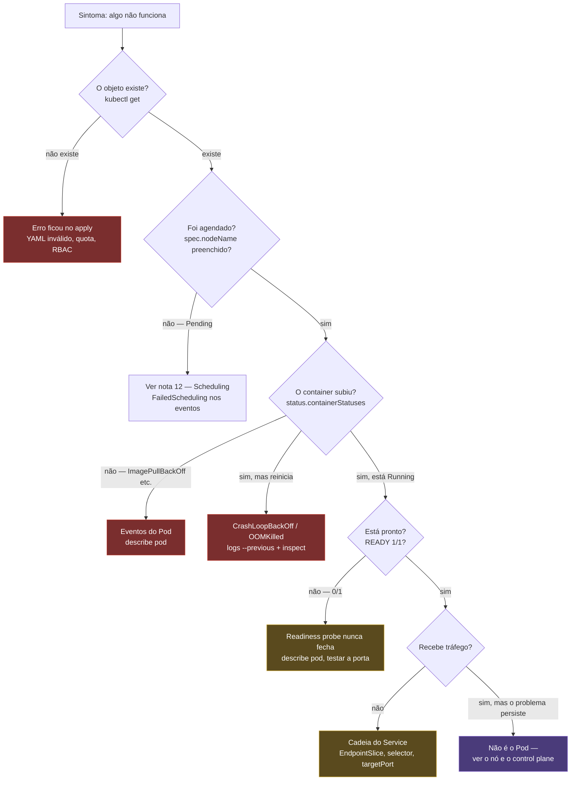
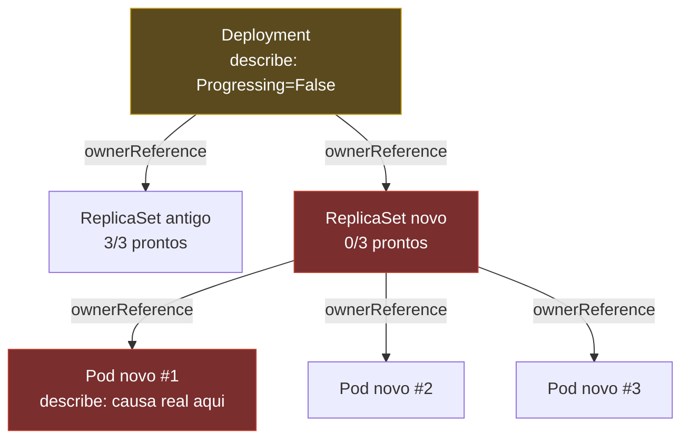
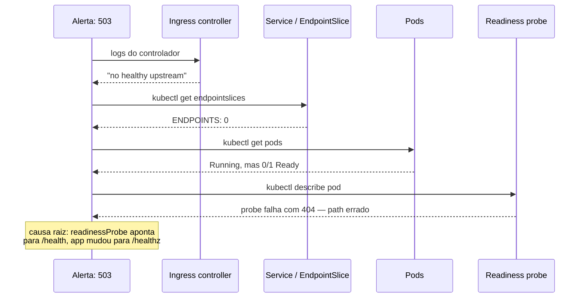

# Depurar um cluster

> [!abstract] TL;DR
> "Subi a aplicação e não funciona" é o alerta mais comum de todos, e o reflexo mais comum diante dele é `kubectl logs`. Esse reflexo está frequentemente errado: se o container nunca chegou a existir — Pod preso na fase de agendamento, imagem que nunca foi puxada, container que nunca iniciou —, não existe log nenhum para ler, porque não existe processo nenhum para tê-lo escrito. O método correto segue a mesma cadeia de convergência que a nota 02 deste galho já descreveu, só que de trás para frente: o objeto existe? O `status` e as `conditions` dizem o quê? Os eventos — que têm retenção curta, uma hora por padrão, e somem — registraram alguma falha? Só então, log. Só então, entrar no container. Só então, se o problema não for do Pod, olhar o nó e o control plane. Depurar Kubernetes é, quase sempre, a mesma pergunta de sempre: em que ponto exato a convergência parou, e o que essa parada específica diz sobre a causa.

Imagine a cena: alguém acabou de rodar um `helm upgrade` ou um `kubectl apply`, o pipeline de CI/CD reportou sucesso, e cinco minutos depois chega a mensagem — "o site está fora do ar". O reflexo de quem vem de depurar um processo numa máquina só, ou mesmo de depurar um único container isolado como a nota [[03-Dominios/Tecnologia/Infraestrutura/Docker/14 - Debugar um container|Debugar um container]] do galho de Docker já ensinou, é abrir um terminal e rodar `kubectl logs -f app`. Às vezes esse comando responde. Com frequência maior do que se imagina, ele não responde nada — porque não existe container `app` rodando em lugar nenhum para produzir log, e a pergunta que precisava ser feita primeiro nunca foi feita: **o objeto que eu declarei sequer chegou a existir de verdade?**

Essa é a diferença fundamental entre depurar um container Docker e depurar um objeto Kubernetes, e vale nomeá-la sem rodeio logo na abertura, porque ela organiza a nota inteira. A nota 14 do galho de Docker ensinou uma árvore de decisão de uma única máquina: o container existe (`docker ps -a`), está vivo ou morto, e a partir daí `logs`, `inspect`, `exec` respondem quase tudo. Aqui o problema tem uma dimensão a mais. Um Pod não é uma unidade isolada rodando numa máquina só — ele é o produto final de uma cadeia de decisões distribuídas, cada uma tomada por um processo diferente, em instantes diferentes, e cada etapa dessa cadeia tem exatamente um lugar onde a resposta aparece. `kubectl logs` só responde à última dessas etapas. Correr direto para ele é pular todas as anteriores — e é justamente nelas que a maioria dos incidentes reais se resolve.

## O método: seguir a cadeia de convergência, não adivinhar

A nota [[03-Dominios/Tecnologia/Infraestrutura/Kubernetes/02 - O loop de reconciliação|O loop de reconciliação]] já estabeleceu a arquitetura inteira que esta nota agora usa como instrumento de diagnóstico: `kubectl apply` grava uma intenção no etcd; um controller observa a diferença entre `spec` e `status` e cria o Pod; o `kube-scheduler`, como a nota [[03-Dominios/Tecnologia/Infraestrutura/Kubernetes/12 - Scheduling|Scheduling]] detalhou, atribui um node; o `kubelet` daquele node, como a nota [[03-Dominios/Tecnologia/Infraestrutura/Kubernetes/17 - O kubelet e o nó|O kubelet e o nó]] detalhou, materializa o container via CRI; e, se houver probes configuradas, o Pod só é considerado pronto depois que elas passam. Cada uma dessas etapas pode parar de convergir, e cada parada deixa um rastro específico, num lugar específico — nunca no terminal onde o `apply` foi rodado, porque, como a nota 02 já estabeleceu, o erro não volta no `apply`.

O método desta nota é, por isso, uma sequência fixa de perguntas, cada uma respondida por uma ferramenta diferente, na ordem em que a informação fica disponível — do mais barato e menos invasivo ao mais custoso e mais invasivo, o mesmo princípio de "esgotar o arquivo morto antes de escalar" que a nota 14 do galho de Docker já defendeu, agora aplicado a um sistema distribuído em vez de uma máquina só.



Vale nomear, em ordem, o que cada degrau dessa árvore de fato responde, porque a ordem não é arbitrária — ela segue exatamente a mesma disciplina de custo crescente que a nota 14 de Docker já ensinou: primeiro o que só lê estado já registrado, sem tocar em nada vivo; depois o que exige o objeto vivo e cooperando.

### Primeiro: o objeto existe, e o que diz o `status`

Antes de qualquer outra coisa, confirme que o objeto sequer existe e leia o `status` inteiro, não só a coluna resumida de `kubectl get`:

```bash
kubectl get deployment minha-api
kubectl get pods -l app=minha-api -o wide
kubectl get pod minha-api-7d8f9c6b5-pqrst -o yaml
```

A saída resumida de `kubectl get pods` já entrega a primeira pista, na coluna `STATUS`, mas é o `-o yaml` completo — especificamente a seção `status.conditions` — que expõe o retrato mais preciso do que o cluster observou. Um Pod carrega, entre outras, as condições `PodScheduled`, `Initialized`, `ContainersReady` e `Ready`, cada uma com seu próprio `status` (`True`/`False`/`Unknown`) e, quando `False`, uma `reason` explicando por quê. Ler essas condições em ordem é literalmente percorrer a mesma sequência que o kubelet segue ao materializar um Pod, descrita nota 17 — e é o primeiro lugar, ainda antes de qualquer evento, onde uma parada na convergência já aparece de forma estruturada.

### Segundo: eventos — e a advertência sobre retenção

Se o `status` não bastar para explicar o quê, os **eventos** costumam explicar o porquê. Todo controller e todo kubelet que agiu sobre um objeto — ou tentou agir e falhou — registra um objeto `Event` associado, e `kubectl describe` já agrega esses eventos junto com o resto do objeto:

```bash
kubectl describe pod minha-api-7d8f9c6b5-pqrst
kubectl get events --sort-by='.lastTimestamp'
kubectl get events --field-selector involvedObject.name=minha-api-7d8f9c6b5-pqrst
```

`kubectl get events --sort-by` é particularmente valioso quando o problema não está claramente localizado num objeto específico ainda: ele mostra, em ordem cronológica, tudo que aconteceu no namespace recentemente — um jeito de reconstruir uma sequência de causa e efeito, exatamente como `docker events` fazia no galho anterior, só que agora agregando eventos de todos os controllers do cluster, não só de um daemon local.

> [!warning] Eventos somem — e a janela é curta
> O `kube-apiserver` mantém eventos por um período limitado, controlado pela flag `--event-ttl`, cujo padrão é **uma hora**. Passado esse tempo, o evento é apagado do etcd e nenhum `kubectl get events` volta a mostrá-lo — não é uma questão de filtro ou de paginação, é ausência definitiva. Um incidente investigado horas depois de ter acontecido, sem ninguém ter capturado `kubectl get events` no calor do momento, frequentemente já perdeu a evidência mais direta da causa raiz. A prática correta, em qualquer resposta a incidente, é capturar `kubectl get events -A --sort-by='.lastTimestamp' > eventos.log` cedo, mesmo antes de entender o problema — o mesmo princípio que a nota 14 do galho de Docker já defendeu para `docker events`, aqui com uma janela ainda mais curta de retenção padrão.

### Terceiro: logs — a última parada, não a primeira

Só depois de confirmar, via `status` e eventos, que um container de fato chegou a existir e a rodar, `kubectl logs` volta a fazer sentido — e volta a ser exatamente tão útil quanto era no galho de Docker, porque, debaixo da abstração do Pod, um container Kubernetes escreve em stdout/stderr sob o mesmo contrato de log que a nota 03 do galho de Docker já estabeleceu.

```bash
kubectl logs minha-api-7d8f9c6b5-pqrst
kubectl logs -f --tail=100 minha-api-7d8f9c6b5-pqrst
kubectl logs minha-api-7d8f9c6b5-pqrst -c sidecar
kubectl logs minha-api-7d8f9c6b5-pqrst --previous
```

`--previous` é o flag que mais separa debug amador de debug sério neste degrau específico: um container que já reiniciou (por `CrashLoopBackOff`, por falha de liveness probe, por `OOMKilled`) tem seus logs do processo **atual** normalmente vazios ou curtos demais para explicar a falha — porque o processo atual acabou de nascer. `--previous` pede os logs da execução **anterior**, a que de fato morreu e motivou o reinício, exatamente onde a explicação costuma estar. Esquecer esse flag e concluir "não há nada nos logs" é o erro mais comum e mais barato de evitar deste degrau inteiro.

Multi-container também tem uma armadilha própria: `kubectl logs` sem `-c` funciona sem erro quando o Pod tem um único container, mas falha pedindo especificação quando há mais de um — e um Pod com sidecar (proxy, agente de log, container de inicialização de rede) frequentemente esconde o erro real no container errado, não no principal.

### Quarto: entrar no container, ou usar um efêmero quando não há shell

Quando `status`, eventos e logs juntos ainda não explicam o sintoma — um processo travado sem erro visível, uma conexão que não fecha, um estado interno que só um comando de dentro revela —, o próximo degrau é o mesmo `exec` que a nota 14 do galho de Docker já ensinou, só que endereçado por Pod em vez de por container de um host só:

```bash
kubectl exec -it minha-api-7d8f9c6b5-pqrst -- sh
kubectl exec -it minha-api-7d8f9c6b5-pqrst -c sidecar -- ps aux
```

E, exatamente como naquela nota, existe o mesmo caso difícil: uma imagem distroless ou `scratch` sem shell nenhum, onde `kubectl exec ... sh` falha com o mesmo "executable file not found" já visto no galho anterior. A resposta no Kubernetes é a evolução direta da técnica de container efêmero que aquela nota já ensinou — só que aqui formalizada como um recurso de primeira classe da própria API, o **container efêmero de debug**:

```bash
kubectl debug -it minha-api-7d8f9c6b5-pqrst --image=nicolaka/netshoot --target=api -- sh
kubectl debug minha-api-7d8f9c6b5-pqrst -it --copy-to=minha-api-debug --image=nicolaka/netshoot
```

A primeira forma adiciona um **container efêmero** ao Pod já existente — um novo container, injetado ao vivo num Pod já rodando, compartilhando os mesmos namespaces do Pod-alvo, sem reiniciar nem substituir nada; `--target` diz a esse container efêmero para compartilhar especificamente o namespace de processo do container `api`, tornando `ps aux` de dentro dele capaz de enxergar o processo da aplicação, o mesmo truque de namespaces compartilhados da nota 14 de Docker, agora nativo do `kubectl`. A segunda forma cria uma **cópia inteira do Pod**, com um container extra ou com imagem/comando trocado, deixando o Pod original intocado — útil quando o objetivo é reproduzir e alterar o comportamento sem arriscar o Pod de produção.

### Quinto: o nó, quando o problema não é do Pod

Se um Pod específico está saudável mas o sintoma persiste em qualquer Pod agendado num node específico, o problema deixou de ser do Pod e passou a ser do node. `kubectl debug node/<nó>` sobe um Pod de debug com acesso ao filesystem do host, sem precisar de SSH:

```bash
kubectl debug node/node-3 -it --image=nicolaka/netshoot
# dentro desse Pod de debug, o filesystem do host fica montado em /host
chroot /host
```

Esse é o mesmo espírito do `nsenter`/`/proc/<pid>/root` já ensinado no galho de Docker, só que expresso como um objeto Kubernetes de primeira classe — um Pod privilegiado, agendado deliberadamente naquele node, em vez de uma sessão SSH manual.

## Descendo a cadeia de propriedade: Deployment → ReplicaSet → Pod

Um sintoma comum, e sistematicamente mal investigado, é "o Deployment não atualiza" — alguém muda a imagem, roda `kubectl apply`, e nada parece acontecer. `kubectl describe deployment` mostra as condições do **Deployment**, não o erro do **Pod** — e confundir os dois níveis é a causa mais frequente de tempo perdido nesse cenário específico.

```bash
kubectl describe deployment minha-api
```

```
Conditions:
  Type           Status  Reason
  ----           ------  ------
  Available      True    MinimumReplicasAvailable
  Progressing    False   ProgressDeadlineExceeded
```

`Progressing: False` com `ProgressDeadlineExceeded` diz que o rollout está travado, mas não diz por quê — para isso é preciso descer um degrau na cadeia de posse. Todo Pod criado por um ReplicaSet carrega, no seu `metadata`, uma `ownerReferences` apontando de volta para aquele ReplicaSet, exatamente como a nota 02 já mostrou; e todo ReplicaSet criado por um Deployment carrega a sua própria `ownerReferences` apontando para o Deployment. Navegar essa cadeia é o método:

```bash
kubectl get replicaset -l app=minha-api
kubectl describe replicaset minha-api-7d8f9c6b5
kubectl get pod minha-api-7d8f9c6b5-pqrst -o jsonpath='{.metadata.ownerReferences[0].kind}/{.metadata.ownerReferences[0].name}{"\n"}'
```

Na maioria dos casos reais, `kubectl describe deployment` mostra o rollout travado, `kubectl get replicaset` revela um ReplicaSet **novo** com `0/3` réplicas prontas ao lado do ReplicaSet **antigo** ainda com `3/3` — o padrão exato de uma atualização gradual que nunca terminou de substituir o antigo pelo novo, descrito na nota [[03-Dominios/Tecnologia/Infraestrutura/Kubernetes/04 - Deployment e ReplicaSet|Deployment e ReplicaSet]] — e só `kubectl describe pod` contra um Pod daquele ReplicaSet novo específico revela o motivo real: imagem inexistente, probe que nunca passa, recurso insuficiente. O erro nunca está no Deployment; o Deployment só relata que algo, um degrau abaixo, não está convergindo.



## O catálogo de sintomas

Cada sintoma abaixo é a parte mais imediatamente aplicável desta nota: causa, como confirmar, como resolver. A ordem segue, aproximadamente, a frequência com que cada um aparece num cluster real.

### `ImagePullBackOff` / `ErrImagePull`

**Causa.** O `kubelet` não conseguiu puxar a imagem declarada: nome errado, tag que nunca foi publicada, registry privado sem `imagePullSecrets` configurado no Pod ou na `ServiceAccount`, ou limite de taxa do registry (comum em `docker.io` sem autenticação, com o limite de pulls anônimos por IP).

**Como confirmar.** Os eventos do Pod, exatamente como a nota 02 já mostrou, registram a tentativa e a falha com a mensagem exata do registry:

```bash
kubectl describe pod minha-api-7d8f9c6b5-pqrst
```

```
Warning  Failed   18s (x3 over 49s)  kubelet  Failed to pull image "minha-api:v7": not found
Warning  Failed   18s (x3 over 49s)  kubelet  Error: ErrImagePull
Normal   BackOff  3s (x5 over 48s)   kubelet  Back-off pulling image "minha-api:v7"
```

Um registry privado sem credenciais costuma responder com `401 Unauthorized` ou `403 Forbidden` na mesma mensagem, em vez de `not found` — a distinção entre os dois já aponta se o problema é a tag ou a autenticação.

**Como resolver.** Corrigir o nome/tag da imagem, ou anexar as credenciais corretas via `imagePullSecrets`, o mesmo mecanismo de segredo documentado na nota [[03-Dominios/Tecnologia/Infraestrutura/Kubernetes/08 - ConfigMap e Secret|ConfigMap e Secret]] — e, quando a causa for limite de taxa de um registry público, migrar para um mirror ou registry próprio, o assunto da nota [[03-Dominios/Tecnologia/Infraestrutura/Docker/12 - Registry|Registry]] do galho anterior.

### `CrashLoopBackOff`

**Causa.** O processo dentro do container termina — por erro de configuração, por dependência indisponível (banco, fila, outro serviço), ou por um bug de inicialização — e a `restartPolicy` do Pod manda o kubelet tentar de novo, como a nota 17 detalhou por inteiro.

**Como confirmar.** `--previous` é obrigatório aqui, porque o container atual mal teve tempo de escrever nada:

```bash
kubectl logs minha-api-7d8f9c6b5-pqrst --previous
kubectl describe pod minha-api-7d8f9c6b5-pqrst
```

```
Last State:     Terminated
  Reason:       Error
  Exit Code:    1
```

Vale a mesma leitura de código de saída já ensinada no galho de Docker: `0` é saída limpa mas inesperada; `1`-`127` costuma vir do próprio processo sinalizando um erro específico; `137` (`128 + SIGKILL`) aponta quase sempre para `OOMKilled`, tratado à parte adiante; `143` (`128 + SIGTERM`) é encerramento tratado, raramente a causa de um loop.

**Como resolver.** A distinção que mais importa aqui é entre **erro de configuração** — variável de ambiente ausente, `ConfigMap` mal montado, caminho de arquivo errado, tudo verificável em segundos via `--previous` e `kubectl describe pod` — e **falha de dependência** — o processo sobe corretamente mas não consegue conectar a um banco, uma fila, ou outro serviço, um erro que só aparece no log da própria aplicação, não em nenhum campo estruturado do Kubernetes. O primeiro caso se resolve editando o manifesto; o segundo exige investigar o serviço dependente, frequentemente fora do escopo deste cluster inteiro.

**Não confundir "travado" com "esperando".** Vale um ponto de leitura que costuma gerar reação precipitada: `State: Waiting` com `Reason: CrashLoopBackOff` não é o kubelet travado — é o kubelet aguardando, de propósito, um intervalo de backoff que cresce exponencialmente a cada falha, exatamente como a nota 17 já descreveu. Apagar e recriar o Pod manualmente, sob a impressão de que isso "destrava" alguma coisa, não muda nada na causa raiz e reseta o contador de tentativas à toa.

### `OOMKilled` (código 137)

**Causa.** O container ultrapassou o `limits.memory` declarado, e o kernel — não o kubelet, não nenhum controller do Kubernetes — invocou o OOM killer e matou o processo com `SIGKILL`, exatamente como a nota 17 já estabeleceu com precisão.

**Como confirmar.**

```bash
kubectl get pod minha-api-7d8f9c6b5-pqrst -o jsonpath='{.status.containerStatuses[0].lastState.terminated.reason}{"\n"}'
```

```
OOMKilled
```

**Por que não há log de erro.** Este é o detalhe que mais confunde quem chega vindo de erro de aplicação: `SIGKILL` não dá ao processo nenhuma chance de capturar o sinal, escrever uma última linha de log, ou fazer qualquer cleanup — o processo é interrompido no meio de qualquer instrução que estivesse executando, sem aviso. É por isso que `kubectl logs --previous` de um container `OOMKilled` costuma terminar em silêncio absoluto, sem stack trace nenhum: não existe stack trace possível para um processo que nunca teve chance de reagir à própria morte.

**Como resolver.** Comparar `limits.memory` contra o uso real ao longo do tempo — via `kubectl top pod`, ou métricas históricas se houver observabilidade instalada — e decidir entre aumentar o limite (se o uso real é legitimamente maior do que o declarado) ou investigar um vazamento de memória na aplicação (se o uso cresce sem parar até estourar). A disciplina de calibrar `requests`/`limits` corretamente pertence a [[03-Dominios/Engenharia/Operação/3 - Rodar em produção/02 - O contrato de produção do Kubernetes|O contrato de produção do Kubernetes]]; esta nota só ensina a reconhecer o sintoma e ler a causa.

### Pod pronto, mas sem tráfego

**Causa.** O Pod está `Running` e `1/1 Ready`, mas requisições não chegam a ele — o problema não está no Pod, está na cadeia que liga um Service a esse Pod: `selector` que não casa com nenhum label, `targetPort` que não corresponde à porta real do container, ou um `EndpointSlice` vazio por qualquer outro motivo.

**Como confirmar.** A nota [[03-Dominios/Tecnologia/Infraestrutura/Kubernetes/05 - Service|Service]] já ensinou o objeto certo a inspecionar: o `EndpointSlice`, não o Service em si, porque é ele quem carrega a lista observada de Pods que de fato casam com o `selector`.

```bash
kubectl get endpointslices -l kubernetes.io/service-name=minha-api
kubectl describe service minha-api
```

Um `EndpointSlice` sem nenhum endereço listado é o sintoma mais direto de todos: o `selector` do Service não está encontrando nenhum Pod, seja porque o Deployment usa um label diferente do esperado, seja porque um erro de digitação separou os dois. `kubectl get pods --show-labels` contra o `selector` declarado no Service, lado a lado, costuma revelar a divergência em segundos.

**Como resolver.** Se o `EndpointSlice` lista o Pod correto mas o tráfego ainda não chega, o suspeito seguinte é `targetPort`: `port` é a porta que o Service expõe, `targetPort` é a porta em que o container de fato escuta — os dois podem ser diferentes de propósito, e um `targetPort` errado produz exatamente este sintoma, conexão aceita pelo Service mas nunca entregue ao processo certo dentro do container.

### Readiness que nunca fecha

**Causa.** A `readinessProbe` declarada aponta para um caminho, porta, ou comando errado, e nunca passa — o Pod fica permanentemente `Running` mas `0/1`, e, por consequência direta do mecanismo já descrito na nota 05 e na nota 17, nunca entra no `EndpointSlice`, nunca recebe tráfego, mesmo que a aplicação dentro dele esteja perfeitamente saudável.

**Como confirmar.**

```bash
kubectl describe pod minha-api-7d8f9c6b5-pqrst
```

```
Warning  Unhealthy  10s (x12 over 2m)  kubelet  Readiness probe failed: Get "http://10.244.1.7:8081/health": dial tcp 10.244.1.7:8081: connect: connection refused
```

A mensagem costuma denunciar o erro sozinha: uma porta (`8081`) diferente da porta real de escuta (`8080`, por exemplo) é o erro de configuração mais comum deste sintoma específico — alguém declarou a probe contra a porta errada, ou a aplicação mudou de porta e ninguém atualizou o manifesto correspondente.

**Como resolver.** Testar a probe manualmente de dentro do próprio Pod, via `kubectl exec`, isola se o problema é a probe mal configurada ou a aplicação de fato não respondendo:

```bash
kubectl exec -it minha-api-7d8f9c6b5-pqrst -- wget -qO- http://localhost:8080/health
```

Se esse comando funciona mas a probe continua falhando, a probe está apontando para o alvo errado — porta, caminho, ou até o container errado num Pod com múltiplos containers. Se o comando também falha, o problema voltou a ser da aplicação, não da probe.

### Objeto preso em `Terminating`

**Causa.** `kubectl delete` foi rodado, o objeto ganhou um `metadata.deletionTimestamp`, mas nunca desaparece de verdade — e a causa quase sempre é um **finalizer** que ninguém remove. Um finalizer é uma string na lista `metadata.finalizers` de um objeto, escrita por algum controller (tipicamente um operator, como os descritos na nota [[03-Dominios/Tecnologia/Infraestrutura/Kubernetes/19 - Operators|Operators]]) para garantir que uma etapa de limpeza externa — desprovisionar um disco na nuvem, remover uma entrada de DNS, desregistrar um recurso externo — aconteça antes da remoção definitiva do objeto no etcd. Enquanto qualquer finalizer permanecer na lista, o api-server recusa completar a exclusão, mesmo que o `deletionTimestamp` já esteja preenchido há muito tempo.

**Como confirmar.**

```bash
kubectl get pod minha-api-7d8f9c6b5-pqrst -o jsonpath='{.metadata.finalizers}{"\n"}'
```

```
["example.com/cleanup-protection"]
```

O caso mais comum e mais didático: um **operator foi desinstalado antes dos objetos customizados que ele gerenciava**. O operator existia justamente para executar a lógica de limpeza referenciada pelo finalizer; sem ele rodando, não há mais nenhum processo no cluster capaz de remover aquele finalizer, e o objeto fica preso em `Terminating` indefinidamente — um caso direto de finalizer órfão, o mesmo tipo de problema que a nota sobre Operators trata em detalhe do lado de quem escreve o controller.

**Como resolver, e o risco de fazer errado.** É tecnicamente possível remover um finalizer à mão, via `kubectl patch`, forçando a exclusão a completar. Fazer isso é seguro **apenas** quando há certeza de que a limpeza que o finalizer protegia já não é mais necessária — porque o operator responsável já não existe mesmo, ou porque o recurso externo já foi removido por outro caminho. Fazer isso sem essa certeza é abrir mão, de propósito, exatamente da garantia que o finalizer existia para proteger: um disco de nuvem nunca desprovisionado, uma entrada de DNS órfã, um recurso externo pago indefinidamente sem ninguém saber que ele ainda existe. A correção correta é quase sempre restaurar o controller responsável e deixar ele terminar o trabalho — remover o finalizer manualmente é o último recurso, não o primeiro.

### `Pending`

A nota [[03-Dominios/Tecnologia/Infraestrutura/Kubernetes/12 - Scheduling|Scheduling]] já cobriu este sintoma por inteiro — o catálogo completo de motivos de `FailedScheduling`, e como ler a mensagem `0/N nodes are available` linha por linha. Vale só o lembrete de posição na árvore desta nota: `Pending` é sempre uma falha no segundo degrau, "foi agendado?", e a resposta nunca é adivinhação, é leitura direta do evento que o scheduler já escreveu.

### Nó `NotReady`

**Causa.** O `kubelet` daquele node parou de renovar o `Lease` — por ter parado de vez, por disco cheio impedindo qualquer operação nova, ou por pressão de recurso severa o bastante para travar o próprio kubelet — e o control plane, como a nota 17 já explicou, marca a condição `Ready` como falsa ou desconhecida depois que os batimentos param.

**Como confirmar.**

```bash
kubectl get nodes
kubectl describe node node-3
```

```
Conditions:
  Type             Status
  Ready            Unknown
  MemoryPressure   Unknown
  DiskPressure     Unknown
```

Todas as condições virando `Unknown` ao mesmo tempo, não só `Ready`, é o sinal de que o kubelet parou de reportar qualquer coisa — diferente de `DiskPressure: True` isolado, que indicaria o kubelet ainda vivo e relatando, só que sob pressão real.

**O efeito cascata.** Um node `NotReady` dispara os taints automáticos `node.kubernetes.io/not-ready`/`unreachable` com efeito `NoExecute` descritos na nota 12, e, passado o `tolerationSeconds` (o padrão do cluster, se nenhum Pod declarar o próprio), todos os Pods que rodavam ali são marcados para recriação em outro node. Isso significa que um único node doente pode, em minutos, se manifestar como uma onda de Pods reiniciando em vários lugares diferentes ao mesmo tempo — um sintoma que parece disperso, mas tem uma única causa raiz concentrada.

**Como resolver.** Acessar o node diretamente (SSH, ou `kubectl debug node/<nó>` quando SSH não está disponível) para checar o próprio `kubelet` via `journalctl -u kubelet`, espaço em disco livre, e se o processo do kubelet está de fato vivo.

### DNS que falha intermitentemente

**Causa.** Resolução de nome dentro do cluster (`nslookup meu-servico.meu-namespace.svc.cluster.local`) falhando de forma inconsistente — às vezes funciona, às vezes não — costuma apontar para o CoreDNS: réplicas insuficientes sob carga, um `Pod` de CoreDNS reiniciando, ou um problema de rede entre o Pod cliente e o Service de DNS.

**Como confirmar.** Testar de dentro de um Pod, nunca de fora do cluster, porque a resolução DNS interna e a externa passam por caminhos completamente diferentes:

```bash
kubectl exec -it minha-api-7d8f9c6b5-pqrst -- nslookup outro-servico.default.svc.cluster.local
kubectl get pods -n kube-system -l k8s-app=kube-dns
```

**Como resolver.** O mecanismo completo — como o CoreDNS resolve nomes, o papel do `kube-proxy`, os modos de operação da rede do cluster — pertence à nota [[03-Dominios/Tecnologia/Infraestrutura/Kubernetes/20 - Rede do cluster por dentro|Rede do cluster por dentro]]; esta nota só ensina o reflexo de diagnóstico: testar sempre de dentro, nunca assumir que um `curl` do laptop do desenvolvedor testa a mesma coisa que uma chamada Pod-a-Pod.

## Ferramentas e atalhos

Além dos comandos já usados ao longo desta nota, vale nomear o punhado de flags e comandos que economizam tempo real num incidente:

`kubectl get pods -o wide` acrescenta o node e o IP de cada Pod à listagem padrão — o primeiro passo para saber se um sintoma está concentrado num node específico. `kubectl get pods --show-labels` expõe todos os labels de cada Pod, essencial para comparar contra o `selector` de um Service ou de um ReplicaSet quando a suspeita é divergência de label. `kubectl get events --sort-by='.lastTimestamp'` já foi usado acima, mas vale repetir como reflexo: é sempre o primeiro comando a rodar quando o sintoma ainda não está localizado num objeto específico. `kubectl port-forward` testa um Pod ou Service sem expor nada externamente — útil para confirmar que o problema não é da borda do cluster (Ingress, LoadBalancer) antes de investigar mais fundo:

```bash
kubectl port-forward pod/minha-api-7d8f9c6b5-pqrst 8080:8080
curl localhost:8080/health
```

`kubectl top pod`/`kubectl top nodes` mostra consumo real de CPU e memória, o equivalente Kubernetes ao `docker stats` da nota 14 anterior, útil para confrontar contra `requests`/`limits` antes de concluir `OOMKilled` ou capacidade insuficiente. `kubectl auth can-i` responde diretamente à pergunta que qualquer erro `Forbidden` levanta:

```bash
kubectl auth can-i create pods --namespace producao
kubectl auth can-i list secrets --as=system:serviceaccount:producao:minha-api
```

O `--as` é o que transforma esse comando de "o que eu, humano, posso fazer" para "o que esta `ServiceAccount` específica pode fazer" — a pergunta certa quando o erro `Forbidden` vem de um Pod, não de um `kubectl` interativo, o assunto que a nota [[03-Dominios/Tecnologia/Infraestrutura/Kubernetes/13 - RBAC e ServiceAccount|RBAC e ServiceAccount]] desenvolve por inteiro. E `kubectl api-resources` responde à pergunta mais básica de todas quando o tipo de objeto certo não está claro — `kubectl api-resources | grep -i endpoint`, por exemplo, confirma o nome exato e o `apiVersion` de um recurso antes de tentar `kubectl get` contra ele.

## Uma investigação trabalhada: "o site retorna 503"

Vale amarrar boa parte desta nota num único cenário hipotético, seguido do começo ao fim, porque um catálogo de sintomas isolados não ensina a mesma coisa que uma descida metódica através de camadas reais.

O alerta diz: `minha-api.exemplo.com` está retornando `503 Service Unavailable` para todas as requisições, há cerca de dez minutos. Nenhum deploy recente conhecido.

**Primeiro passo — o Ingress.** Um `503` costuma se originar no controlador de Ingress, não na aplicação — é ele quem devolve esse código quando não encontra nenhum backend saudável para rotear.

```bash
kubectl get ingress minha-api
```

```
NAME       CLASS   HOSTS                    ADDRESS         PORTS   AGE
minha-api  nginx   minha-api.exemplo.com    203.0.113.10    80,443  40d
```

O Ingress existe, tem endereço atribuído, nada de estranho na configuração em si. O problema não está aqui — está num degrau abaixo.

**Segundo passo — o controlador do Ingress.** A nota [[03-Dominios/Tecnologia/Infraestrutura/Kubernetes/15 - Ingress e a borda do cluster|Ingress e a borda do cluster]] já estabeleceu que o objeto Ingress é só configuração; quem de fato roteia é o controlador, rodando como Pods próprios.

```bash
kubectl get pods -n ingress-nginx
kubectl logs -n ingress-nginx -l app.kubernetes.io/component=controller --tail=50
```

```
2026/08/04 14:12:03 [error] upstream connect error: no healthy upstream
```

`no healthy upstream` confirma a hipótese: o controlador está de pé e funcional, mas não encontra nenhum backend saudável para encaminhar a requisição. O problema desceu mais um degrau, para o Service que o Ingress referencia.

**Terceiro passo — o Service e o `EndpointSlice`.**

```bash
kubectl get endpointslices -l kubernetes.io/service-name=minha-api
```

```
NAME               ADDRESSTYPE   PORTS   ENDPOINTS   AGE
minha-api-a1b2c    IPv4          8080    0           40d
```

`ENDPOINTS 0` é a confirmação direta: o Service existe, mas não há nenhum Pod sendo roteado por ele — nenhum backend saudável, exatamente o que o log do controlador já tinha denunciado, só que agora com a causa localizada um degrau mais abaixo: o problema não é do Ingress nem do Service, é de quais Pods o Service consegue enxergar como prontos.

**Quarto passo — os Pods atrás do Service.**

```bash
kubectl get pods -l app=minha-api
```

```
NAME                        READY   STATUS    RESTARTS   AGE
minha-api-7d8f9c6b5-pqrst   0/1     Running   0          12m
minha-api-7d8f9c6b5-uvwxy   0/1     Running   0          11m
minha-api-7d8f9c6b5-zabcd   0/1     Running   0          11m
```

Todos os três Pods estão `Running`, mas nenhum está `Ready` — `0/1` em todos. O container subiu, o processo existe, mas algo impede o Pod de ser considerado pronto para tráfego. Isso já elimina `CrashLoopBackOff`, `OOMKilled` e `ImagePullBackOff` da lista de suspeitos — todos eles produziriam `RESTARTS` maior que zero ou um `STATUS` diferente de `Running`.

**Quinto passo — a readiness probe.**

```bash
kubectl describe pod minha-api-7d8f9c6b5-pqrst
```

```
Warning  Unhealthy  30s (x20 over 12m)  kubelet  Readiness probe failed: HTTP probe failed with statuscode: 404
```

`404`, não `connection refused` — a porta está certa, a conexão é aceita, mas o caminho que a probe consulta não existe. Confirmando de dentro do próprio Pod:

```bash
kubectl exec -it minha-api-7d8f9c6b5-pqrst -- wget -qO- http://localhost:8080/healthz
```

```
Not Found
```

**Causa raiz.** O deploy mais recente — silenciosamente não relacionado ao "nenhum deploy recente conhecido" do alerta inicial, porque ninguém tinha checado o histórico ainda — trocou o caminho de health check da aplicação de `/health` para `/healthz`, mas o manifesto do Deployment continuou declarando `readinessProbe.httpGet.path: /health`. A aplicação está perfeitamente saudável; a probe está perguntando pela porta errada. `kubectl rollout history deployment/minha-api` confirma um `apply` feito onze minutos antes do alerta — dentro da janela de tempo exata em que os três Pods entraram em `0/1`.

**Correção.** Ajustar `readinessProbe.httpGet.path` para `/healthz` no manifesto e reaplicar; segundos depois, os três Pods passam a `1/1`, o `EndpointSlice` volta a listar três endereços, e o `503` desaparece — sem reiniciar nada, sem escalar réplicas, sem tocar no Ingress. A cadeia inteira, do sintoma externo até a causa raiz, tinha exatamente cinco degraus, e cada um só foi resolvido lendo o que já estava registrado — nenhum passo dependeu de adivinhação.



## Tabela de diagnóstico rápido

| Sintoma | Primeiro comando | O que procurar |
|---|---|---|
| Pod não aparece em `kubectl get pods` | `kubectl get events --sort-by='.lastTimestamp'` | Rejeição no `apply` — quota, RBAC, YAML inválido |
| `Pending` | `kubectl describe pod` | Linha `0/N nodes are available` — ver nota 12 |
| `ImagePullBackOff` | `kubectl describe pod` | Mensagem exata do registry — tag, credencial, limite de taxa |
| `CrashLoopBackOff` | `kubectl logs --previous` | Código de saída e a última linha antes da morte |
| `OOMKilled` | `kubectl get pod -o jsonpath='{.status.containerStatuses[0].lastState.terminated.reason}'` | Comparar `limits.memory` contra uso real |
| `Running` mas `0/1` | `kubectl describe pod` | Mensagem de falha da `readinessProbe` |
| Deployment "não atualiza" | `kubectl get replicaset -l <label>` | ReplicaSet novo com réplicas não prontas |
| `EndpointSlice` vazio | `kubectl get pods --show-labels` | Divergência entre `selector` do Service e labels do Pod |
| Objeto preso em `Terminating` | `kubectl get <objeto> -o jsonpath='{.metadata.finalizers}'` | Finalizer sem controller vivo para removê-lo |
| Node `NotReady` | `kubectl describe node` | `Lease` parado de renovar; disco/memória sob pressão |
| DNS intermitente | `kubectl exec ... -- nslookup` | Testado de dentro; ver CoreDNS e nota 20 |
| `403 Forbidden` | `kubectl auth can-i ... --as=<serviceaccount>` | RBAC insuficiente para a identidade que fez a chamada |

## Quando o problema não é do Pod: o control plane

Se a cadeia inteira — objeto, agendamento, kubelet, readiness, Service — está saudável e o sintoma persiste, ou se o próprio mecanismo de reconciliação parece ter parado (Pods não sendo criados mesmo com `spec.replicas` divergente do `status`, por exemplo), o problema pode estar um degrau acima de tudo que esta nota cobriu: no próprio control plane. A nota [[03-Dominios/Tecnologia/Infraestrutura/Kubernetes/16 - O control plane por dentro|O control plane por dentro]] já ensinou onde procurar — os logs do `kube-apiserver`, do `kube-controller-manager` e do `kube-scheduler`, tipicamente acessíveis via `kubectl logs -n kube-system` num cluster gerenciado, ou via arquivo de log/`journalctl` no próprio node de control plane num cluster autogerido:

```bash
kubectl logs -n kube-system -l component=kube-controller-manager --tail=100
kubectl logs -n kube-system -l component=kube-scheduler --tail=100
```

Esse é o último recurso desta árvore de diagnóstico inteira, não o primeiro — na esmagadora maioria dos incidentes reais, a causa está em algum dos degraus anteriores, porque o control plane em si é o componente mais testado, mais monitorado e mais raramente a origem real de um sintoma de aplicação.

## Armadilhas comuns

> [!warning] Rodar `kubectl logs` como primeiro comando, sempre
> Se o container nunca chegou a existir — Pod `Pending`, `ImagePullBackOff`, ou qualquer falha anterior à criação do container —, `kubectl logs` retorna vazio ou um erro explícito de que não há logs disponíveis, e essa ausência não é informação nenhuma sobre a causa real. O primeiro comando deveria ser sempre `kubectl get`/`describe` para confirmar que o objeto existe e o que o `status` diz, não `logs`.

> [!warning] Investigar um incidente horas depois sem ter capturado eventos no calor do momento
> O `--event-ttl` padrão do `kube-apiserver` é uma hora; passado esse tempo, os eventos que explicariam a causa raiz simplesmente não existem mais, não importa quão bem formulado seja o `kubectl get events` rodado depois. Capturar `kubectl get events -A --sort-by='.lastTimestamp'` cedo, antes mesmo de entender o problema, é sempre melhor do que investigar depois sem essa evidência.

> [!warning] Esquecer `--previous` ao investigar `CrashLoopBackOff`
> O container atual, recém-reiniciado, raramente teve tempo de escrever qualquer coisa relevante em seu log; a explicação está quase sempre na execução anterior, a que de fato falhou. `kubectl logs <pod> --previous` é o comando que efetivamente responde à pergunta "por que ele morreu", não `kubectl logs` sozinho.

> [!warning] Remover um finalizer manualmente sem confirmar que a limpeza que ele protegia não é mais necessária
> Um finalizer existe para garantir que uma etapa de limpeza externa — desprovisionar um disco, remover um registro de DNS, liberar um recurso pago — aconteça antes da exclusão de fato. Remover o finalizer à força, via `kubectl patch`, sem essa garantia já ter sido satisfeita por outro caminho, deixa recursos órfãos para trás, silenciosamente, e é praticamente irreversível depois que o objeto some do etcd.

> [!warning] Confundir "o Deployment não atualiza" com "o Pod tem um erro"
> `kubectl describe deployment` mostra condições agregadas sobre o rollout como um todo — `Progressing`, `Available` — nunca o erro específico de um Pod individual. É preciso descer, via `ownerReferences`, até o ReplicaSet novo e depois até um Pod concreto daquele ReplicaSet para encontrar a causa real; parar no nível do Deployment sozinho é parar um degrau acima de onde a resposta está.

> [!warning] Testar DNS ou conectividade de fora do cluster e assumir que o resultado vale para dentro dele
> A resolução de nomes internos (`*.svc.cluster.local`) e o roteamento Pod-a-Pod passam por um caminho de rede completamente diferente do que qualquer teste feito do laptop do desenvolvedor percorre. Um `curl` funcionando de fora não prova nada sobre a conectividade interna, e vice-versa — o teste sempre precisa ser feito de dentro de um Pod, via `kubectl exec`.

## Como explicar em inglês

| Português | Inglês |
|---|---|
| O erro não volta no `apply` | The error doesn't come back on `apply` |
| Cadeia de propriedade (Deployment → ReplicaSet → Pod) | Ownership chain |
| Container efêmero de debug | Ephemeral debug container |
| Preso em `Terminating` por causa de um finalizer | Stuck `Terminating` because of a finalizer |
| A readiness probe nunca fecha | The readiness probe never passes |
| `EndpointSlice` vazio | Empty `EndpointSlice` |
| Testar de dentro do Pod, não de fora do cluster | Test from inside the Pod, not from outside the cluster |
| Retenção de eventos é curta — uma hora por padrão | Event retention is short — one hour by default |
| Não é o Pod, é o nó | It's not the Pod, it's the node |
| Descer a cadeia até a causa raiz | Walk the chain down to the root cause |

## O que vem a seguir

Esta nota fechou o conteúdo prático do galho inteiro: da declaração síncrona até a convergência assíncrona, do Pod ao Service, do scheduler ao kubelet, e agora o método de descobrir, em qualquer ponto dessa cadeia, onde exatamente a convergência parou. Falta uma coisa só — juntar tudo num caso único, trabalhado do zero, sem atalhos: provisionar um cluster, declarar os objetos, observar a convergência acontecer, e usar o método desta nota quando algo, de propósito, não convergir de primeira. É esse fechamento que a nota [[03-Dominios/Tecnologia/Infraestrutura/Kubernetes/index|Kubernetes]] reserva para o capstone do galho — 22, do zero ao cluster.

## Fontes

- [Kubernetes documentation — Troubleshoot Applications](https://kubernetes.io/docs/tasks/debug/debug-application/)
- [Kubernetes documentation — Debug Running Pods](https://kubernetes.io/docs/tasks/debug/debug-application/debug-running-pod/)
- [Kubernetes documentation — Troubleshoot Clusters](https://kubernetes.io/docs/tasks/debug/debug-cluster/)
- [Kubernetes documentation — Debugging Kubernetes Nodes With Kubectl](https://kubernetes.io/docs/tasks/debug/debug-cluster/kubectl-node-debug/)
- [Kubernetes documentation — Events in Kubernetes](https://kubernetes.io/docs/reference/kubernetes-api/cluster-resources/event-v1/)
- [Kubernetes documentation — kube-apiserver Reference (--event-ttl)](https://kubernetes.io/docs/reference/command-line-tools-reference/kube-apiserver/)
- [Kubernetes documentation — Garbage Collection (Owners and Finalizers)](https://kubernetes.io/docs/concepts/architecture/garbage-collection/)
- [Kubernetes documentation — Using Finalizers to Control Deletion](https://kubernetes.io/blog/2021/05/14/using-finalizers-to-control-deletion/)
- [Kubernetes documentation — Debug Services](https://kubernetes.io/docs/tasks/debug/debug-application/debug-service/)
- [Kubernetes documentation — Configure Liveness, Readiness and Startup Probes](https://kubernetes.io/docs/tasks/configure-pod-container/configure-liveness-readiness-startup-probes/)
- [Kubernetes documentation — kubectl auth can-i](https://kubernetes.io/docs/reference/kubectl/generated/kubectl_auth/)
- [Kubernetes documentation — kubectl Cheat Sheet](https://kubernetes.io/docs/reference/kubectl/cheatsheet/)
