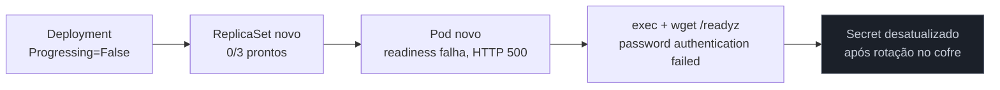
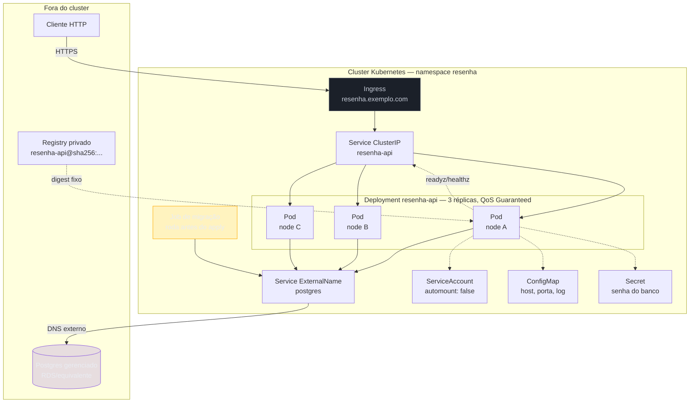

# Capstone: do zero ao cluster

> [!abstract] TL;DR
> Esta nota pega exatamente onde o capstone do galho de Docker parou — uma imagem `resenha-api` correta, versionada por digest, num registry privado — e a leva a um cluster Kubernetes, decisão por decisão, com um Postgres que ela consome. Não há nenhum manifesto ainda quando esta nota começa; há doze decisões reais a tomar, cada uma com opções concretas, uma escolha e um motivo, citando a nota do galho que sustenta essa escolha. A mais importante de todas não é técnica no sentido estrito: é onde o Postgres mora, e por que a resposta certa muda conforme o contexto muda. Ao final, o leitor leva um conjunto completo de manifestos e, mais importante, entende por que nenhuma das doze decisões foi "executar" alguma coisa — todas foram declarar um pedaço de estado desejado e deixar o loop de reconciliação convergir para ele.

## O ponto de partida

A situação retomada é a que o capstone do galho anterior deixou pronta: `resenha-api`, uma API HTTP em Node.js/TypeScript, Express nas rotas, `pg` falando com Postgres, empacotada num Dockerfile multi-stage sobre uma base distroless nonroot, publicada com uma tag rastreável e um digest imutável — [[03-Dominios/Tecnologia/Infraestrutura/Docker/18 - Capstone - empacotar uma app do zero|Capstone — empacotar uma app do zero]] construiu essa imagem linha por linha e a deixou em `registry.exemplo.com/resenha-api@sha256:7f3a9c1e...` (digest abreviado aqui por legibilidade). A aplicação expõe duas rotas de saúde que essa imagem já carrega, e que esta nota vai usar: `GET /healthz`, uma checagem em processo, sem tocar em nenhuma dependência externa; e `GET /readyz`, que executa um `SELECT 1` contra o pool de conexões do Postgres e só responde `200` se essa consulta tiver sucesso. Essa distinção entre as duas rotas não é acidente de implementação — é exatamente o contrato que a decisão 5 desta nota exige, e o motivo de existirem duas rotas em vez de uma só vai ficar claro lá.

O que não existe, no início desta nota, é qualquer manifesto Kubernetes. Nenhum Deployment, nenhum Service, nenhum Ingress, nenhum ConfigMap. Só a imagem, o digest, e a certeza de que ela sobe e responde quando alguém roda `docker run` na própria máquina — exatamente onde o galho anterior parou, e exatamente a lacuna que a nota [[03-Dominios/Tecnologia/Infraestrutura/Kubernetes/01 - O problema que orquestração resolve|01 — O problema que orquestração resolve]] nomeou como o ponto de partida deste galho inteiro: rodar em muitas máquinas, reagir a falha, descobrir serviço entre réplicas, atualizar sem downtime. As doze decisões a seguir constroem, uma de cada vez, o conjunto de manifestos que fecha essa lacuna para esta aplicação específica.

> [!tip] Vídeo — o outro "do zero": montando o cluster, não a aplicação
> [**Instalando Cluster Kubernetes do ZERO**](https://www.youtube.com/watch?v=TqMKBIinjew) (Full Cycle, ~18 min, **PT-BR**) é o complemento exato deste capstone, pela metade que ele deliberadamente não cobre. Aqui o "do zero" é da aplicação até o cluster; lá é **do sistema operacional até o cluster existir**: três máquinas, requisitos mínimos de CPU e memória, hostname, instalação do runtime de container, `kubeadm init` no nó de controle gerando o token, e os workers entrando com esse token. Ele também põe um balanceador na frente do control plane e — num momento honesto que vale mais que o acerto — descobre ao vivo que liberou a porta errada no grupo de segurança, **443 em vez de 6443**, que é a porta do api-server. Ver o cluster nascer nó a nó dá base concreta para tudo o que este galho tratou como dado: o que é o control plane, o que roda em cada nó, e por que o kubelet precisa se registrar. **O que ele não cobre:** nada das nove decisões deste capstone — nem workload, nem Service, nem probes, nem RBAC, nem migração de schema. É a camada de baixo.

## Decisão 1 — qual controller para a API

**Situação.** A imagem existe; falta decidir que tipo de objeto do Kubernetes vai gerenciar as réplicas do processo `resenha-api` em execução.

**Opções.** Um `Deployment`, que trata réplicas como intercambiáveis e sem identidade própria; um `StatefulSet`, que dá a cada réplica um nome ordinal estável e um disco próprio; ou um `DaemonSet`, que colocaria uma réplica em cada node do cluster, independente de quantas réplicas fazem sentido para a carga de tráfego.

**Decisão.** `Deployment`.

**Por quê.** `resenha-api` não guarda nenhum estado em disco entre requisições — cada requisição HTTP é atendida por qualquer réplica disponível, sem afinidade a uma réplica específica, e nenhuma réplica precisa "lembrar" de nada que a réplica ao lado não saiba. A nota [[03-Dominios/Tecnologia/Infraestrutura/Kubernetes/10 - StatefulSet|10 — StatefulSet]] é explícita sobre quando a identidade estável de um StatefulSet compensa o custo de complexidade que ele adiciona: quando a ordem de criação importa, quando cada réplica precisa do próprio disco persistente, quando o nome de rede de uma réplica específica precisa sobreviver a um reagendamento — nenhuma dessas três condições se aplica a uma API stateless. Um `DaemonSet` está descartado por um motivo diferente: ele amarra o número de réplicas ao número de nodes do cluster, quando o número certo de réplicas de `resenha-api` deveria ser uma função de tráfego esperado e orçamento de disponibilidade, não do tamanho físico do cluster — a nota [[03-Dominios/Tecnologia/Infraestrutura/Kubernetes/11 - Job, CronJob e DaemonSet|11 — Job, CronJob e DaemonSet]] reserva esse objeto para cargas como um agente de log ou um coletor de métricas, que de fato precisam de exatamente uma cópia por node. A cadeia de controllers que um Deployment produz — Deployment cria ReplicaSet, ReplicaSet cria Pods — e o que uma atualização de imagem de fato faz mecanicamente a essa cadeia é o assunto central da nota [[03-Dominios/Tecnologia/Infraestrutura/Kubernetes/04 - Deployment e ReplicaSet|04 — Deployment e ReplicaSet]], e é essa mesma mecânica que a decisão 11 desta nota vai usar ao mudar o digest da imagem.

## Decisão 2 — o Postgres

**Situação.** `resenha-api` precisa de um Postgres para conversar. Essa é, de longe, a decisão mais importante desta nota — não porque seja a mais complexa tecnicamente, mas porque é onde um revisor sênior mede se quem escreveu o manifesto entende o que está em jogo além da sintaxe do YAML.

**Opções, com o trade-off de cada uma sem meio-termo.** A primeira é um banco gerenciado pelo provedor de nuvem, vivendo fora do cluster — RDS, Cloud SQL, ou o Postgres gerenciado de um provedor menor. O provedor cuida de backup, failover, patching de versão menor e replicação; em troca, o time abre mão de controle fino sobre a configuração do banco, aceita uma latência de rede extra entre o cluster e o serviço gerenciado (tipicamente pequena, mas real, e nunca zero), e paga um prêmio sobre o custo bruto de computação e armazenamento. A segunda é um `StatefulSet` cru dentro do cluster, com `volumeClaimTemplates` provisionando um disco por réplica, como a nota [[03-Dominios/Tecnologia/Infraestrutura/Kubernetes/10 - StatefulSet|10 — StatefulSet]] descreve. O time ganha controle total e paga só pelo disco e computação nativos do cluster — e assume, sem intermediário nenhum, toda a disciplina operacional que um banco de produção exige: promoção de réplica em caso de falha do primário, backup e restore testados, upgrade de versão maior coordenado manualmente. A terceira é um operator de Postgres — um controller customizado que conhece o vocabulário específico de "cluster Postgres" via CRD, como a nota [[03-Dominios/Tecnologia/Infraestrutura/Kubernetes/19 - Operators|19 — Operators]] descreve em abstrato: CRD mais controller igual a conhecimento operacional codificado. Um operator de Postgres maduro sabe promover uma réplica automaticamente, agendar backup contínuo e executar recuperação a um ponto no tempo (PITR) — mas ele próprio é software, roda no cluster, precisa ser mantido atualizado, e tem sua própria superfície de bugs; adotar um operator para um único Postgres pequeno é adicionar uma peça móvel cujo benefício só aparece em escala ou em disciplina operacional que o time ainda não tem.

**Decisão.** Banco gerenciado, fora do cluster.

**Por quê.** `resenha-api`, como descrita, não tem nenhuma exigência de topologia exótica — não é multi-tenant com um banco por cliente, não precisa de réplicas de leitura geodistribuídas, não roda num ambiente air-gapped sem acesso a um provedor de nuvem. Para esse perfil comum, o custo operacional de manter Postgres saudável em produção — failover correto, backup testado de verdade (não só configurado), patching de segurança em dia — supera o prêmio de preço de um serviço gerenciado, e é exatamente esse cálculo que a nota 19 pede para ser feito antes de escrever qualquer CRD: só vale automatizar conhecimento operacional que o time de fato precisaria exercitar manualmente com frequência suficiente para justificar o investimento.

Duas circunstâncias, ditas com a mesma honestidade, levariam a uma escolha diferente. Se o cluster roda num ambiente sem acesso a um banco gerenciado — on-premises, air-gapped, ou uma nuvem sem esse serviço na região — a opção gerenciada simplesmente não existe, e a escolha vira StatefulSet cru (se o time já tem disciplina operacional de Postgres e prefere não adicionar uma peça de software a mais) ou operator (se o time precisa da automação de failover e backup, mas não tem, ou não quer construir, essa disciplina manualmente). E se o produto crescer a ponto de precisar de dezenas de bancos Postgres efêmeros — um por ambiente de revisão de pull request, um por tenant num SaaS multi-inquilino — o custo fixo de aprender e operar um operator se paga rápido, porque a alternativa seria reinventar, manualmente, para cada instância nova, exatamente o que o operator automatiza uma vez só.

## Decisão 3 — onde a configuração mora

**Situação.** `resenha-api` precisa de configuração — host e porta do Postgres, nome do banco, o nível de log — e de um segredo: a senha de conexão. Nenhum dos dois pode estar embutido na imagem, porque a mesma imagem, identificada pelo digest fixado no galho anterior, precisa servir a mais de um ambiente sem rebuild.

**Opções.** Colocar tudo em variável de ambiente; colocar tudo em volume montado; ou separar por sensibilidade — `ConfigMap` para o que não é segredo, `Secret` para o que é — e, dentro dessa separação, ainda escolher entre variável de ambiente e volume para cada um.

**Decisão.** `ConfigMap` para host, porta, nome do banco e nível de log; `Secret` para a senha de conexão; ambos injetados como variável de ambiente, não como volume montado.

**Por quê.** A nota [[03-Dominios/Tecnologia/Infraestrutura/Kubernetes/08 - ConfigMap e Secret|08 — ConfigMap e Secret]] estabelece a distinção que separa os dois objetos: `Secret` não é criptografia, é só uma convenção de codificação e de controle de acesso mais restrito por padrão via RBAC — a senha precisa, além disso, estar fora do escopo de qualquer ferramenta que liste ConfigMaps sem pedir permissão elevada. A escolha entre variável de ambiente e volume montado tem uma consequência prática que a mesma nota nomeia sem meio-termo: uma chave consumida como variável de ambiente é lida uma única vez, no momento em que o processo do container nasce, e nunca mais muda durante a vida daquele Pod — editar o ConfigMap ou o Secret depois não afeta um Pod já rodando. Um volume montado, ao contrário, é atualizado pelo kubelet em segundo plano conforme o objeto muda no cluster, com um atraso tipicamente de segundos, mas exige que a própria aplicação releia o arquivo periodicamente para perceber a mudança — algo que `resenha-api`, como qualquer API HTTP comum, não implementa. Diante dessa escolha, variável de ambiente é a opção mais simples e mais honesta para esta aplicação: nenhuma reconfiguração acontece sem um novo Pod nascer, e é exatamente esse comportamento — nunca silencioso, sempre visível como um rollout — que a decisão seguinte torna explícito.

A consequência de recarga que a nota 08 nomeia tem uma saída prática, e vale adotá-la aqui: uma annotation no `template` do Deployment carregando o hash do conteúdo do ConfigMap, recalculada a cada `kustomize build` ou a cada pipeline. Como a annotation faz parte de `spec.template`, mudar seu valor conta como mudança de spec do Pod aos olhos do ReplicaSet controller — e força exatamente o mesmo tipo de rollout gradual que uma troca de imagem forçaria, mesmo que a imagem em si não tenha mudado uma linha:

```yaml
template:
  metadata:
    annotations:
      checksum/config: "a3f9e1c7b8d2..."
```

Sem essa annotation, mudar só o ConfigMap não dispara rollout nenhum — os Pods já existentes continuam com as variáveis de ambiente antigas até serem recriados por qualquer outro motivo, o que costuma surpreender quem assume, por hábito de outras ferramentas, que "mudei a config" e "os Pods pegaram a config nova" são a mesma coisa.

## Decisão 4 — como expor

**Situação.** A API precisa de um endereço estável dentro do cluster para o Ingress alcançar, e o Ingress precisa de um ponto de entrada estável de fora do cluster. Separadamente, a API precisa de um jeito de achar o Postgres gerenciado escolhido na decisão 2, sem embutir o hostname do provedor direto no código.

**Opções, para a borda.** Um `Service` do tipo `LoadBalancer` dedicado à API, provisionando um balanceador de nuvem próprio; ou um `Service` `ClusterIP` interno, com um `Ingress` na frente concentrando o roteamento de borda.

**Decisão.** `ClusterIP` mais `Ingress`.

**Por quê.** Um `LoadBalancer` por serviço provisiona um balanceador de nuvem físico — com IP público próprio, custo próprio, cobrado por hora — para cada Service que pede esse tipo; num cluster que hospeda mais de uma aplicação, isso significa um balanceador por aplicação, a maior parte deles ociosos a maior parte do tempo, e nenhum ponto único de política de borda (TLS, rate limit, roteamento por host). A nota [[03-Dominios/Tecnologia/Infraestrutura/Kubernetes/05 - Service|05 — Service]] estabelece a hierarquia entre os quatro tipos — `ClusterIP` é a base, `NodePort` e `LoadBalancer` a estendem —, e a nota [[03-Dominios/Tecnologia/Infraestrutura/Kubernetes/15 - Ingress e a borda do cluster|15 — Ingress e a borda do cluster]] mostra por que um único `Ingress`, atendido por um único controlador (nginx, ou equivalente) que por sua vez usa um único `LoadBalancer` para todo o cluster, concentra o custo do balanceador de nuvem numa única instância compartilhada por todas as aplicações, em vez de multiplicá-lo por serviço.

Para o Postgres gerenciado: a nota 05 documenta um quarto tipo de Service, `ExternalName`, que não balanceia tráfego nenhum — só resolve um nome DNS interno do cluster para um hostname externo arbitrário, via um registro CNAME no CoreDNS do cluster. É esse tipo que fecha a decisão 2: um Service `ExternalName` chamado `postgres`, no mesmo namespace da API, mapeia o nome estável `postgres.resenha.svc.cluster.local` para o endpoint real do banco gerenciado. `resenha-api` conecta sempre a esse nome interno, nunca ao hostname do provedor diretamente — e se o endpoint do banco mudar (uma promoção de réplica, uma migração de instância), só o `ExternalName` precisa ser atualizado, sem tocar em nenhum manifesto ou variável de ambiente da aplicação.

```yaml
apiVersion: v1
kind: Service
metadata:
  name: postgres
  namespace: resenha
spec:
  type: ExternalName
  externalName: db-prod.abcdef123456.us-east-1.rds.amazonaws.com
```

## Decisão 5 — o contrato de saúde

**Situação.** O Kubernetes precisa de dois sinais distintos sobre `resenha-api`: quando reiniciar um Pod que travou, e quando parar de mandar tráfego para um Pod que ainda está vivo mas não está pronto para atender.

**Opções.** Uma única probe cobrindo os dois papéis; ou duas probes separadas, com critérios diferentes — e, dentro dessa segunda opção, a escolha de o que cada uma checa.

**Decisão.** `readinessProbe` contra `/readyz` (que valida a conexão real com o Postgres) e `livenessProbe` contra `/healthz` (que nunca toca em nenhuma dependência externa).

**Por quê.** [[03-Dominios/Engenharia/Operação/3 - Rodar em produção/02 - O contrato de produção do Kubernetes|O contrato de produção do Kubernetes]] é direta sobre a diferença de papel entre as duas: falhar a `livenessProbe` diz ao kubelet "mate este processo e comece de novo" — a ação mais drástica disponível para um único Pod, apropriada só quando o processo em si está travado de um jeito que só um reinício resolve. Falhar a `readinessProbe` diz algo bem mais barato: "não mande tráfego para cá agora" — o Pod continua vivo, continua sendo contado pelo Deployment, só sai do `EndpointSlice` que a nota [[03-Dominios/Tecnologia/Infraestrutura/Kubernetes/05 - Service|05 — Service]] já descreveu, e volta assim que a probe passar de novo.

A armadilha que essa nota nomeia sem rodeio — e que esta decisão evita de propósito — é colocar a checagem de uma dependência externa na `livenessProbe`. Se `/healthz` checasse o Postgres e o banco gerenciado oscilasse por trinta segundos (uma manutenção do provedor, um failover de réplica), toda réplica de `resenha-api` falharia a liveness ao mesmo tempo e o kubelet reiniciaria todas simultaneamente — trocando um problema de banco por um problema de aplicação inteira fora do ar, e pior: os Pods recém-reiniciados provavelmente falhariam a mesma checagem de novo, entrando num `CrashLoopBackOff` coletivo enquanto o banco ainda está indisponível, exatamente o tipo de reinício em cascata que a nota 21 cataloga como sintoma. Com a separação correta, a mesma oscilação do banco derruba só a `readinessProbe`: as réplicas saem do `EndpointSlice` — o tráfego para de chegar, o que é o efeito desejado — mas continuam vivas, sem reiniciar, prontas para voltar ao `EndpointSlice` no segundo em que o Postgres responder de novo, sem nenhum `CrashLoopBackOff` no meio do caminho.

```yaml
readinessProbe:
  httpGet:
    path: /readyz
    port: 3000
  periodSeconds: 5
  failureThreshold: 2
livenessProbe:
  httpGet:
    path: /healthz
    port: 3000
  periodSeconds: 10
  failureThreshold: 5
```

## Decisão 6 — recursos e a classe de QoS resultante

**Situação. ** Sem `requests` nem `limits` declarados, o `kube-scheduler` não sabe quanto espaço reservar para `resenha-api` em nenhum node, e o kubelet não tem nenhum critério para decidir quem despejar primeiro sob pressão de memória.

**Opções.** Não declarar nada; declarar só `requests`; ou declarar `requests` igual a `limits` para CPU e memória.

**Decisão.** `requests` igual a `limits`, para os dois recursos.

**Por quê.** O `kube-scheduler`, como a nota [[03-Dominios/Tecnologia/Infraestrutura/Kubernetes/12 - Scheduling|12 — Scheduling]] estabelece, olha só para `requests` na hora de decidir se um node tem capacidade livre para receber um Pod novo — `limits` nunca entra nessa conta, só na aplicação em runtime. E a combinação exata escolhida aqui — `requests` igual a `limits` em CPU e memória, para todo container do Pod — é, por definição da própria documentação do Kubernetes, o que produz a classe de QoS `Guaranteed`: a mais protegida das três contra despejo. Um Pod `BestEffort` (sem nenhum dos dois declarados) é despejado primeiro sob pressão de memória no node; um `Burstable` (com `requests` menor que `limits`, ou só um dos dois declarado) vem em seguida; um `Guaranteed` só é despejado depois que não sobrar nenhum candidato das outras duas classes — a ordem exata que a nota [[03-Dominios/Tecnologia/Infraestrutura/Kubernetes/17 - O kubelet e o nó|17 — O kubelet e o nó]] documenta.

Para uma API HTTP voltada ao público, com um orçamento de disponibilidade que não tolera reinício silencioso por falta de memória num node compartilhado, `Guaranteed` é a escolha defensável — ao custo de menos elasticidade: a réplica nunca pode consumir mais CPU do que o `limit` fixo, mesmo em momentos de pico, porque não há folga entre `requests` e `limits` para absorver. Esse é o trade-off nomeado, não escondido: previsibilidade contra elasticidade, e para esta aplicação a previsibilidade pesa mais.

```yaml
resources:
  requests:
    cpu: "250m"
    memory: "256Mi"
  limits:
    cpu: "250m"
    memory: "256Mi"
```

## Decisão 7 — permissões

**Situação.** Todo Pod recebe, por padrão, a `ServiceAccount` `default` do namespace, e um token dessa `ServiceAccount` é montado automaticamente dentro do container, pronto para autenticar contra o api-server.

**Opções.** Deixar o padrão como está; ou criar uma `ServiceAccount` própria para `resenha-api`, com o `automountServiceAccountToken` desligado.

**Decisão.** `ServiceAccount` própria, com `automountServiceAccountToken: false`.

**Por quê.** A nota [[03-Dominios/Tecnologia/Infraestrutura/Kubernetes/13 - RBAC e ServiceAccount|13 — RBAC e ServiceAccount]] trata o princípio de menor privilégio como regra, não exceção: `resenha-api` nunca precisa chamar o api-server do próprio Kubernetes — ela fala com o Postgres e responde a requisições HTTP, nada mais. Um token de `ServiceAccount` montado sem necessidade é, exatamente como o `root` desnecessário que o galho de Docker já rejeitou, superfície de ataque de graça: se a aplicação for comprometida por uma vulnerabilidade própria ou de dependência, esse token — mesmo sem nenhuma permissão RBAC atribuída além do mínimo do namespace — é uma credencial válida contra o cluster que não precisava existir dentro do container. A `ServiceAccount` própria, separada da `default` do namespace, também deixa claro na auditoria qual identidade pertence a qual carga de trabalho, sem depender de todo mundo no namespace compartilhar a mesma conta.

```yaml
apiVersion: v1
kind: ServiceAccount
metadata:
  name: resenha-api
  namespace: resenha
automountServiceAccountToken: false
```

## Decisão 8 — distribuição das réplicas

**Situação.** Com três réplicas declaradas na decisão 1, nada impede o `kube-scheduler` de colocar as três no mesmo node — o que tornaria a queda de um único node capaz de derrubar `resenha-api` inteira, mesmo com três réplicas rodando.

**Opções.** Não declarar nada e confiar na distribuição padrão do scheduler; usar `podAntiAffinity` explícita; ou usar `topologySpreadConstraints`.

**Decisão.** `topologySpreadConstraints`, com `maxSkew: 1` e `topologyKey: kubernetes.io/hostname`.

**Por quê.** A nota [[03-Dominios/Tecnologia/Infraestrutura/Kubernetes/12 - Scheduling|12 — Scheduling]] documenta que, desde a versão 1.24 do Kubernetes, o scheduler já aplica restrições de espalhamento suaves por padrão — mas esse padrão é uma rede de segurança geral, não uma garantia específica para esta aplicação. Declarar `topologySpreadConstraints` explicitamente, com `whenUnsatisfiable: DoNotSchedule`, transforma essa preferência em um requisito real: o scheduler recusa colocar uma quarta réplica de `resenha-api` num node que já tem uma, se isso deixar a diferença entre o node mais cheio e o mais vazio maior que `maxSkew: 1`, mesmo que isso signifique deixar o Pod `Pending` até um node livre aparecer. `podAntiAffinity` resolveria um problema parecido, mas com uma sintaxe mais pesada e uma semântica de tudo-ou-nada menos ajustável do que o `maxSkew` numérico — a nota 12 documenta os dois mecanismos e por que `topologySpreadConstraints` costuma ser a escolha mais simples de raciocinar para o caso comum de "espalhe estas réplicas o mais uniformemente possível".

```yaml
topologySpreadConstraints:
  - maxSkew: 1
    topologyKey: kubernetes.io/hostname
    whenUnsatisfiable: DoNotSchedule
    labelSelector:
      matchLabels:
        app: resenha-api
```

## Decisão 9 — a migração de schema

**Situação.** Uma atualização de `resenha-api` que precisa de uma coluna nova no banco tem um problema de ordem: se a versão nova do código começar a servir tráfego antes da migração rodar, ela vai falhar tentando ler uma coluna que ainda não existe; e durante um rolling update — a mecânica que a decisão 11 desta nota vai disparar — a versão antiga e a versão nova do código convivem, servindo tráfego ao mesmo tempo, contra o mesmo banco, por alguns minutos.

**Opções.** Rodar a migração dentro de um `initContainer` do próprio Pod, executando antes do container principal subir; rodar como um `Job` separado, disparado pelo pipeline de CI/CD antes de atualizar o Deployment; ou, se o empacotamento usasse Helm, um hook `pre-upgrade`, que garante execução antes de qualquer recurso do release ser atualizado.

**Decisão.** `Job` separado, disparado pelo pipeline, antes de qualquer `kubectl apply`/`kustomize build` que troque o digest da imagem do Deployment.

**Por quê.** Um `initContainer` roda uma vez por Pod — e um rolling update cria vários Pods novos, possivelmente em paralelo, dependendo de `maxSurge`; sem um mecanismo de exclusão mútua na própria migração (um advisory lock do Postgres, por exemplo), várias réplicas tentariam rodar a mesma migração ao mesmo tempo, e mesmo com lock, o desenho fica frágil: a migração vira acoplada ao ciclo de vida de cada Pod individual, disparando de novo sempre que qualquer Pod for recriado por qualquer motivo, não só por uma atualização de fato. Um hook do Helm resolveria o problema de execução única — ele roda antes do release inteiro ser tocado —, mas esta nota já decidiu, na decisão 10, empacotar com Kustomize, não Helm; a mecânica de hook simplesmente não está disponível na ferramenta escolhida. O `Job` separado, rodado pelo pipeline antes do `apply` do Deployment, dá controle explícito sobre exatamente uma execução, sincronizada de forma síncrona no pipeline — se o `Job` falhar, o pipeline nunca chega a aplicar o Deployment novo — sem amarrar a migração ao ciclo de vida de nenhum Pod individual.

A interação com o rolling update em si é o ponto mais fino da decisão, e [[03-Dominios/Engenharia/Operação/2 - Entrega e release/04 - Migrations de banco em produção|Migrations de banco em produção]] resolve exatamente esse problema com o padrão *expand and contract*: qualquer migração aplicada antes de um rolling update precisa ser compatível com a versão antiga do código, que ainda vai estar servindo tráfego durante toda a janela da atualização. Uma coluna nova entra como opcional (expand), as duas versões do código coexistem por uma janela, e só depois que a versão antiga tiver sido completamente substituída é que uma migração de contração — tornar a coluna obrigatória, remover a coluna antiga — pode rodar com segurança, como um segundo `Job`, num deploy seguinte. Pular essa disciplina e rodar uma migração que quebra a versão antiga do código no meio de um rolling update é o erro mais caro desta decisão inteira: por alguns minutos, metade do tráfego bate na versão que ainda não entende a mudança de schema.

```yaml
apiVersion: batch/v1
kind: Job
metadata:
  name: resenha-api-migrate-a1b2c3d
spec:
  backoffLimit: 2
  template:
    spec:
      restartPolicy: Never
      containers:
        - name: migrate
          image: registry.exemplo.com/resenha-api@sha256:7f3a9c1e...
          command: ["node", "dist/migrate.js"]
          envFrom: [{configMapRef: {name: resenha-api-config}}]
          env: [{name: DB_PASSWORD, valueFrom: {secretKeyRef: {name: resenha-api-db, key: password}}}]
```

## Decisão 10 — como empacotar para dois ambientes

**Situação.** O mesmo conjunto de manifestos precisa rodar em desenvolvimento (uma réplica, recursos menores, host de Ingress diferente) e em produção (três réplicas, os recursos da decisão 6, TLS, o host real). Duplicar o YAML inteiro por ambiente é a receita mais rápida de fazê-los divergir sem ninguém perceber.

**Opções.** Helm, com templates parametrizados por `values.yaml`; ou Kustomize, com uma base e overlays que aplicam patches sobre ela.

**Decisão.** Kustomize.

**Por quê.** A nota [[03-Dominios/Tecnologia/Infraestrutura/Kubernetes/14 - Helm e Kustomize|14 — Helm e Kustomize]] descreve as duas filosofias sem favorecer nenhuma por padrão: Helm gera YAML a partir de um template com lógica embutida, o que ganha poder de expressão à custa de um `values.yaml` que só faz sentido lido junto do template que ele parametriza; Kustomize parte de uma base que já é YAML válido e legível sozinho, e sobrepõe patches declarativos por ambiente, sem introduzir uma linguagem de template nova. Para um único serviço com duas variantes relativamente simples — número de réplicas, recursos, host de Ingress, uma variável de ambiente — a base já legível do Kustomize pesa mais do que o poder de parametrização do Helm, que se paga melhor em charts distribuídos para terceiros configurarem, um cenário que não é o de `resenha-api`.

A base reúne o Deployment, os dois Services, a ServiceAccount, o ConfigMap e o Ingress descritos nas decisões anteriores; cada overlay (`development/`, `production/`) traz só o `kustomization.yaml` e os patches específicos daquele ambiente — réplicas, recursos, e o digest de imagem corrente:

```yaml
# overlays/production/kustomization.yaml
resources:
  - ../../base
namespace: resenha
patches:
  - path: patch-replicas.yaml
  - path: patch-resources.yaml
images:
  - name: registry.exemplo.com/resenha-api
    digest: sha256:7f3a9c1e...
configMapGenerator:
  - name: resenha-api-config
    behavior: merge
    literals:
      - NODE_ENV=production
```

## Decisão 11 — a atualização

**Situação.** Uma versão nova de `resenha-api` foi construída, testada e publicada sob um digest novo. Falta decidir como esse digest chega ao cluster, e como confirmar que a mudança de fato convergiu.

**Opções.** Editar manualmente `spec.containers[0].image` no Deployment via `kubectl edit`; ou mudar o campo `images.digest` no `kustomization.yaml` do overlay e reaplicar via pipeline.

**Decisão.** Mudar o overlay e reaplicar via `kubectl apply -k overlays/production`, seguido de `kubectl rollout status`.

**Por quê.** A nota [[03-Dominios/Tecnologia/Infraestrutura/Kubernetes/02 - O loop de reconciliação|02 — O loop de reconciliação]] já estabeleceu, em abstrato, o que acontece mecanicamente quando `spec.template` muda: o api-server grava a nova spec no etcd, o ReplicaSet controller compara e cria um ReplicaSet novo, hashado a partir do template novo, e desloca réplicas do ReplicaSet antigo para o novo de forma gradual — a mecânica exata que a nota [[03-Dominios/Tecnologia/Infraestrutura/Kubernetes/04 - Deployment e ReplicaSet|04 — Deployment e ReplicaSet]] detalha. `kubectl apply` retornando sucesso, como a nota 02 também já deixou claro, não significa que a convergência terminou — significa só que a intenção foi gravada. `kubectl rollout status deployment/resenha-api` é o comando que de fato espera a convergência acontecer, bloqueando até `status.updatedReplicas` bater com `spec.replicas` e todas as réplicas novas passarem pela `readinessProbe` da decisão 5. Editar via `kubectl edit` funcionaria uma vez, mas é exatamente a armadilha que a nota 02 nomeia: a próxima aplicação do overlay via pipeline reverteria essa edição manual, porque o Kustomize não sabe que ela existe — a fonte da verdade é sempre o que está declarado em disco, nunca o que foi editado ao vivo.

```bash
kubectl apply -k overlays/production
kubectl rollout status deployment/resenha-api --namespace resenha --timeout=120s
```

## Decisão 12 — quando não sobe

**Situação.** O pipeline aplicou o overlay de produção com o digest novo. `kubectl rollout status` nunca retorna sucesso — trava, e depois de dois minutos imprime `error: timed out waiting for the condition`. O método da nota [[03-Dominios/Tecnologia/Infraestrutura/Kubernetes/21 - Depurar um cluster|21 — Depurar um cluster]] se aplica aqui exatamente como se aplicaria a qualquer outro rollout travado — a cadeia de convergência, seguida de trás para frente.

**Primeiro degrau — o Deployment.**

```bash
kubectl describe deployment resenha-api --namespace resenha
```

```
Conditions:
  Type           Status  Reason
  Available      True    MinimumReplicasAvailable
  Progressing    False   ProgressDeadlineExceeded
```

`Progressing: False` confirma que o rollout está travado, mas não diz por quê — exatamente a limitação que a nota 21 já nomeou: o Deployment relata o agregado, nunca a causa de um Pod específico.

**Segundo degrau — o ReplicaSet novo.**

```bash
kubectl get replicaset -l app=resenha-api --namespace resenha
```

```
NAME                     DESIRED   CURRENT   READY   AGE
resenha-api-7d9f6c8b5    3         3         3       40d
resenha-api-6b8e5a2c1    3         3         0       3m
```

O ReplicaSet antigo continua com as três réplicas saudáveis — o serviço não caiu, o rollout só não termina de substituí-las. O ReplicaSet novo tem três Pods criados, nenhum pronto.

**Terceiro degrau — um Pod do ReplicaSet novo, e testar a rota de dentro dele.** O container subiu — não é `ImagePullBackOff`, não é `CrashLoopBackOff` — mas o describe mostra a probe falhando de forma consistente, e o `exec` confirma a mensagem exata:

```bash
kubectl describe pod resenha-api-6b8e5a2c1-lmnop --namespace resenha
kubectl exec -it resenha-api-6b8e5a2c1-lmnop --namespace resenha -- wget -qO- http://localhost:3000/readyz
```

```
Warning  Unhealthy  30s (x18 over 3m)  kubelet  Readiness probe failed: HTTP probe failed with statuscode: 500
{"error":"password authentication failed for user \"resenha\""}
```

Como a decisão 5 desta nota já estabeleceu, `/readyz` só falha assim quando a checagem de conexão com o Postgres falha — e a mensagem exata, lida de dentro do próprio Pod, já aponta a causa: autenticação, não rede nem porta.

**Causa raiz.** O overlay de produção, na decisão 10, sobrepõe o `ConfigMap` via `configMapGenerator` com `behavior: merge` — mas o `Secret` com a senha do banco não passou pelo mesmo tratamento nesta atualização específica: alguém rotacionou a senha diretamente no cofre de segredos do provedor, atualizou o valor no `Secret` de produção, mas o pipeline que gera o `Secret` a partir desse cofre não rodou antes do `apply` do Deployment — o `Secret` em produção ainda carrega a senha antiga, enquanto o Postgres gerenciado já está com a nova. A versão antiga do código continua funcionando porque suas réplicas já tinham a conexão aberta antes da rotação; a versão nova, tentando abrir uma conexão do zero, é a primeira a de fato testar a credencial nova contra o banco — e falha.

**Correção.** Sincronizar o `Secret` com o valor atual do cofre e reaplicar; segundos depois, `/readyz` responde `200`, as três réplicas novas entram no `EndpointSlice`, `kubectl rollout status` retorna sucesso, e o ReplicaSet antigo é escalado a zero. Nada disso exigiu reiniciar nada manualmente — só corrigir o estado declarado e deixar o mesmo loop que travou o rollout convergir de novo.



## O conjunto final de manifestos

O conjunto abaixo é a base do Kustomize — os overlays de desenvolvimento e produção só sobrepõem réplicas, recursos, host de Ingress e a tag de ambiente sobre este esqueleto comum.

```yaml
# base/serviceaccount.yaml — decisão 7: identidade própria, sem token de API montado
apiVersion: v1
kind: ServiceAccount
metadata:
  name: resenha-api
  labels:
    app.kubernetes.io/name: resenha-api
automountServiceAccountToken: false
---
# base/configmap.yaml — decisão 3: o que não é segredo
apiVersion: v1
kind: ConfigMap
metadata:
  name: resenha-api-config
data:
  DB_HOST: "postgres.resenha.svc.cluster.local"
  DB_PORT: "5432"
  DB_NAME: "resenha"
  LOG_LEVEL: "info"
---
# base/service-postgres.yaml — decisão 4: nome DNS estável para o banco gerenciado
apiVersion: v1
kind: Service
metadata:
  name: postgres
spec:
  type: ExternalName
  externalName: db-prod.abcdef123456.us-east-1.rds.amazonaws.com
---
# base/deployment.yaml — decisões 1, 3, 5, 6, 7, 8 juntas
apiVersion: apps/v1
kind: Deployment
metadata:
  name: resenha-api
  labels:
    app.kubernetes.io/name: resenha-api
spec:
  replicas: 3
  selector:
    matchLabels:
      app: resenha-api
  template:
    metadata:
      labels:
        app: resenha-api
      annotations:
        checksum/config: "a3f9e1c7b8d2..."
    spec:
      serviceAccountName: resenha-api
      automountServiceAccountToken: false
      topologySpreadConstraints:
        - maxSkew: 1
          topologyKey: kubernetes.io/hostname
          whenUnsatisfiable: DoNotSchedule
          labelSelector:
            matchLabels:
              app: resenha-api
      containers:
        - name: api
          image: registry.exemplo.com/resenha-api@sha256:7f3a9c1e...
          ports:
            - containerPort: 3000
          envFrom:
            - configMapRef:
                name: resenha-api-config
          env:
            - name: DB_PASSWORD
              valueFrom:
                secretKeyRef:
                  name: resenha-api-db
                  key: password
          resources:
            requests:
              cpu: "250m"
              memory: "256Mi"
            limits:
              cpu: "250m"
              memory: "256Mi"
          readinessProbe:
            httpGet:
              path: /readyz
              port: 3000
            periodSeconds: 5
            failureThreshold: 2
          livenessProbe:
            httpGet:
              path: /healthz
              port: 3000
            periodSeconds: 10
            failureThreshold: 5
---
# base/service.yaml — decisão 4: endereço estável interno
apiVersion: v1
kind: Service
metadata:
  name: resenha-api
spec:
  type: ClusterIP
  selector:
    app: resenha-api
  ports:
    - port: 80
      targetPort: 3000
---
# base/ingress.yaml — decisão 4: a borda
apiVersion: networking.k8s.io/v1
kind: Ingress
metadata:
  name: resenha-api
  annotations:
    ingressClassName: nginx
spec:
  ingressClassName: nginx
  rules:
    - host: resenha.exemplo.com
      http:
        paths:
          - path: /
            pathType: Prefix
            backend:
              service:
                name: resenha-api
                port:
                  number: 80
```

O `Secret` com a senha do banco, deliberadamente, não entra neste bloco: sua criação é assunto do pipeline de CI/CD, lido do cofre de segredos do provedor, nunca gravado em texto claro em nenhum arquivo versionado — a fronteira que a seção seguinte nomeia com honestidade.

## Decisão → nota que a fundamenta

| Decisão | Nota |
|---|---|
| 1 — Deployment, não StatefulSet nem DaemonSet | [[03-Dominios/Tecnologia/Infraestrutura/Kubernetes/04 - Deployment e ReplicaSet\|Deployment e ReplicaSet]], [[03-Dominios/Tecnologia/Infraestrutura/Kubernetes/10 - StatefulSet\|StatefulSet]], [[03-Dominios/Tecnologia/Infraestrutura/Kubernetes/11 - Job, CronJob e DaemonSet\|Job, CronJob e DaemonSet]] |
| 2 — Postgres gerenciado, fora do cluster | [[03-Dominios/Tecnologia/Infraestrutura/Kubernetes/10 - StatefulSet\|StatefulSet]], [[03-Dominios/Tecnologia/Infraestrutura/Kubernetes/19 - Operators\|Operators]] |
| 3 — ConfigMap/Secret via variável de ambiente, hash de revisão | [[03-Dominios/Tecnologia/Infraestrutura/Kubernetes/08 - ConfigMap e Secret\|ConfigMap e Secret]] |
| 4 — ClusterIP + Ingress, ExternalName para o banco | [[03-Dominios/Tecnologia/Infraestrutura/Kubernetes/05 - Service\|Service]], [[03-Dominios/Tecnologia/Infraestrutura/Kubernetes/15 - Ingress e a borda do cluster\|Ingress e a borda do cluster]] |
| 5 — readiness contra o banco, liveness sem dependência | [[03-Dominios/Engenharia/Operação/3 - Rodar em produção/02 - O contrato de produção do Kubernetes\|O contrato de produção do Kubernetes]], [[03-Dominios/Tecnologia/Infraestrutura/Kubernetes/21 - Depurar um cluster\|Depurar um cluster]] |
| 6 — requests = limits, QoS Guaranteed | [[03-Dominios/Tecnologia/Infraestrutura/Kubernetes/12 - Scheduling\|Scheduling]], [[03-Dominios/Tecnologia/Infraestrutura/Kubernetes/17 - O kubelet e o nó\|O kubelet e o nó]] |
| 7 — ServiceAccount própria, sem automount | [[03-Dominios/Tecnologia/Infraestrutura/Kubernetes/13 - RBAC e ServiceAccount\|RBAC e ServiceAccount]] |
| 8 — topologySpreadConstraints | [[03-Dominios/Tecnologia/Infraestrutura/Kubernetes/12 - Scheduling\|Scheduling]] |
| 9 — Job de migração separado, expand/contract | [[03-Dominios/Engenharia/Operação/2 - Entrega e release/04 - Migrations de banco em produção\|Migrations de banco em produção]] |
| 10 — Kustomize, base + overlays | [[03-Dominios/Tecnologia/Infraestrutura/Kubernetes/14 - Helm e Kustomize\|Helm e Kustomize]] |
| 11 — digest novo + rollout status | [[03-Dominios/Tecnologia/Infraestrutura/Kubernetes/02 - O loop de reconciliação\|O loop de reconciliação]], [[03-Dominios/Tecnologia/Infraestrutura/Kubernetes/04 - Deployment e ReplicaSet\|Deployment e ReplicaSet]] |
| 12 — método de depuração até a causa raiz | [[03-Dominios/Tecnologia/Infraestrutura/Kubernetes/21 - Depurar um cluster\|Depurar um cluster]] |

## A arquitetura final, num diagrama só



## O que fica de fora e mora em Operação

Este conjunto de manifestos é um cluster correto. Não é, por si só, uma disciplina de produção completa — a mesma honestidade que o capstone do galho de Docker aplicou à imagem se aplica aqui ao cluster inteiro:

- **Estratégia de release e progressive delivery.** O rolling update padrão da decisão 11 substitui réplicas gradualmente, mas não faz canário, não desvia uma fração pequena de tráfego real antes de comprometer o resto, e não tem rollback automático baseado em métrica de erro — isso é [[03-Dominios/Engenharia/Operação/2 - Entrega e release/03 - Progressive delivery e rollback|Progressive delivery e rollback]].
- **Autoscaling.** As três réplicas fixas desta nota não reagem a pico de tráfego nem a ociosidade — HPA, VPA e as três camadas de escala pertencem a [[03-Dominios/Engenharia/Operação/3 - Rodar em produção/04 - Escala e capacidade|Escala e capacidade]], deliberadamente fora deste galho desde o índice.
- **Observabilidade e alertas.** `/readyz` e `/healthz` respondem a uma pergunta binária; métricas de latência, tracing distribuído e um alerta que dispara antes do cliente perceber pertencem a [[03-Dominios/Engenharia/Operação/4 - Observar e responder/index|Observar e responder]].
- **Política de rede.** Nenhum manifesto aqui restringe quem pode falar com quem dentro do cluster — `resenha-api` aceita tráfego de qualquer Pod que conheça o `ClusterIP`. `NetworkPolicy` e a rede de borda em produção são assunto de [[03-Dominios/Engenharia/Operação/3 - Rodar em produção/05 - Rede e borda em produção|Rede e borda em produção]].
- **Gestão de segredo em cofre.** O `Secret` do banco foi tratado nesta nota como um objeto já resolvido pelo pipeline; de onde ele vem, como é rotacionado sem downtime, e como se integra a um cofre externo é [[03-Dominios/Engenharia/Operação/2 - Entrega e release/06 - Secrets e configuração em produção|Secrets e configuração em produção]].
- **Capacidade e custo.** `requests` iguais a `limits` da decisão 6 garantem QoS `Guaranteed`, mas não respondem se o cluster tem nodes suficientes, nem quanto os três Pods custam ao mês — isso também é [[03-Dominios/Engenharia/Operação/3 - Rodar em produção/04 - Escala e capacidade|Escala e capacidade]].

## Armadilhas comuns

> [!warning] Tratar o Postgres gerenciado como decisão default, não como decisão
> A decisão 2 escolheu banco gerenciado para `resenha-api`, mas escolheu depois de comparar as três opções — não por reflexo de "é sempre a mais segura". Aplicar essa mesma escolha sem reavaliar o contexto (um cluster air-gapped, um SaaS multi-tenant com dezenas de bancos efêmeros) é copiar a conclusão sem copiar o raciocínio que levou até ela.

> [!warning] Confundir a annotation de hash do ConfigMap com atualização automática
> A técnica da decisão 3 força um rollout quando o ConfigMap muda, mas só se o pipeline de fato recalcular o hash e gravá-lo na annotation a cada `kustomize build`. Mudar o ConfigMap manualmente, sem tocar na annotation, deixa os Pods existentes com a configuração antiga indefinidamente — a técnica não é mágica automática, é disciplina de pipeline.

> [!warning] Colocar a checagem de dependência externa na liveness probe
> A decisão 5 existe exatamente para evitar este erro: se `/healthz` checasse o Postgres, uma oscilação breve do banco derrubaria todas as réplicas de `resenha-api` ao mesmo tempo, via reinício forçado pelo kubelet — trocando um problema de banco por uma indisponibilidade total da API, e arriscando um `CrashLoopBackOff` coletivo enquanto o banco ainda está se recuperando.

> [!warning] Rodar a migração de schema como initContainer sem pensar na concorrência do rolling update
> Um rolling update cria múltiplos Pods novos, possivelmente em paralelo. Um `initContainer` que roda uma migração não idempotente, sem lock, dispara a mesma migração várias vezes ao mesmo tempo — a decisão 9 evita esse risco escolhendo um `Job` único, executado antes do Deployment ser tocado, não acoplado ao ciclo de vida de nenhum Pod individual.

> [!warning] Assumir `requests` igual a `limits` como escolha universalmente certa
> A classe `Guaranteed` da decisão 6 é a escolha certa para esta API específica, com este orçamento de disponibilidade — não é a escolha certa para toda carga de trabalho. Uma carga com picos de uso legítimos e imprevisíveis se beneficia mais de `Burstable`, com `limits` acima de `requests`, aceitando o risco de despejo em troca de elasticidade real; aplicar `Guaranteed` cegamente a tudo desperdiça capacidade reservada que nunca é usada.

## Como explicar em inglês

*"Bringing `resenha-api` from a Docker image to a running cluster is twelve decisions, not one deployment. The controller choice is easy — it's stateless, so Deployment, not StatefulSet. The database is the decision that actually matters: I went with a managed Postgres outside the cluster for this workload, because the operational burden of running Postgres well — failover, tested backup, patching — outweighs the price premium for a single database with no unusual topology. I'd flip that answer for an air-gapped cluster or for a SaaS with dozens of ephemeral databases per tenant. Readiness checks the database, liveness never does — that split is what keeps a database blip from cascading into every replica restarting at once. And requests equal to limits buys Guaranteed QoS on purpose, trading elasticity for predictability, because this is a public-facing API I don't want silently evicted. None of this was 'running' anything — it's declaring desired state and trusting the same reconciliation loop the whole galho is built on to converge."*

| PT-BR | EN | Nuance de uso |
|---|---|---|
| Postgres gerenciado | Managed Postgres | Termo padrão; evitar "hosted Postgres", que soa mais genérico e menos preciso em contexto de nuvem |
| classe de QoS | QoS class | Sigla fixa em inglês mesmo em texto em português; nunca traduzida por extenso no jargão técnico |
| espalhamento topológico | topology spread | "Topology spread constraints" é o termo exato do campo da API; evitar "topological distribution", que não é o termo usado na documentação |
| migração de schema | schema migration | Direto, sem ambiguidade em nenhum dos dois idiomas |
| expandir e contrair | expand and contract | Termo fixo do padrão de Fowler; não traduzir literalmente como "expand and shrink" |
| reinício em cascata | cascading restarts | Descreve o efeito de confundir liveness com readiness; termo comum em discussões de confiabilidade |
| convergir | converge / converging | Preferir a "fixing", que sugere correção pontual em vez de processo contínuo |
| conjunto de manifestos | manifest set / manifests | "Manifests" no plural já é entendido como o conjunto; "manifest set" é mais explícito em contexto formal |
| menor privilégio | least privilege | Termo de segurança padrão, fixo nos dois idiomas |
| decisão default | default choice / default decision | Usado para nomear o erro de copiar uma conclusão sem copiar o raciocínio |

## O que vem a seguir

Este capstone fecha o galho [[03-Dominios/Tecnologia/Infraestrutura/Kubernetes/index|Kubernetes]] — 22 notas, três fases, uma lente única que atravessou todas elas: o Kubernetes não executa, converge. Cada uma das doze decisões desta nota foi, sem exceção, a mesma operação repetida — escrever um pedaço de `spec`, entregar ao api-server, e deixar um controller, em algum lugar, fechar a diferença entre o que foi declarado e o que existe. Nenhum `kubectl apply` desta nota "fez" nada acontecer no sentido imperativo da palavra; cada um só registrou uma intenção, e a convergência que se seguiu — Pods nascendo, réplicas se espalhando entre nodes, o ReplicaSet antigo cedendo lugar ao novo — foi sempre obra de outro processo, rodando depois, em outro instante, exatamente como a nota 2 deste galho descreveu antes de qualquer Deployment ter sido escrito.

O domínio [[03-Dominios/Tecnologia/Infraestrutura/index|Infraestrutura]] segue depois deste galho para Nginx e Linux — a camada de borda e o sistema operacional que sustentam tudo que os dois galhos já escritos, Docker e Kubernetes, pressupõem funcionando por baixo. E a continuação natural do que este capstone construiu não é mais um objeto do Kubernetes — é a disciplina de operar esse cluster com seriedade, que vive inteira em [[03-Dominios/Engenharia/Operação/index|Engenharia/Operação]], a casa que este galho citou, decisão após decisão, como quem sabe exatamente onde a própria fronteira termina.

## Fontes

- [Kubernetes Docs — Pod Topology Spread Constraints](https://kubernetes.io/docs/concepts/workloads/pods/pod-topology-spread-constraints/)
- [Kubernetes Docs — Pod Quality of Service Classes](https://kubernetes.io/docs/concepts/workloads/pods/pod-qos/)
- [Kubernetes Docs — Configure Liveness, Readiness and Startup Probes](https://kubernetes.io/docs/tasks/configure-pod-container/configure-liveness-readiness-startup-probes/)
- [Kubernetes Docs — Configure Service Accounts for Pods](https://kubernetes.io/docs/tasks/configure-pod-container/configure-service-account/)
- [Kubernetes Docs — Service: ExternalName](https://kubernetes.io/docs/concepts/services-networking/service/#externalname)
- [Kubernetes Docs — Declarative Management of Kubernetes Objects Using Kustomize](https://kubernetes.io/docs/tasks/manage-kubernetes-objects/kustomization/)
- [Kubernetes Docs — ConfigMaps](https://kubernetes.io/docs/tasks/configure-pod-container/configure-pod-configmap/)
- [Kubernetes Docs — Rolling Update Deployment](https://kubernetes.io/docs/concepts/workloads/controllers/deployment/#rolling-update-deployment)
- [Helm Docs — Chart Hooks](https://helm.sh/docs/topics/charts_hooks/)
- [Martin Fowler — Parallel Change (Danilo Sato, 2014)](https://martinfowler.com/bliki/ParallelChange.html)
