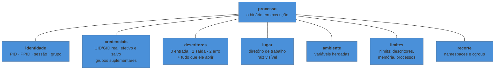

# O que o Linux entrega a um processo

> [!abstract] TL;DR
> Quando você executa um binário, o kernel não entrega só "a CPU". Ele entrega um **contrato**: um número de identificação e um pai, um conjunto de credenciais que decide o que pode ser tocado, três canais de entrada e saída já abertos, um diretório de trabalho, um bloco de variáveis de ambiente, uma tabela de limites e — em sistemas modernos — um recorte de visibilidade e um teto de consumo. Cada item desse contrato é observável em `/proc/<pid>/`, e cada nota deste galho detalha um deles. Se você entender o que compõe esse contrato, praticamente todo problema de "funciona aqui e não lá" vira uma pergunta respondível.

---

## O binário é o mesmo, e mesmo assim não roda

O executável foi copiado bit a bit. As duas máquinas rodam a mesma distribuição. E ainda assim: na sua estação ele sobe, no servidor ele morre em dois segundos com uma mensagem que não ajuda.

A resposta quase nunca está no binário. Está no que **cercava** o binário — e que ninguém copiou junto, porque não é arquivo.

O processo que rodou na sua máquina tinha um usuário com permissão de escrita naquele diretório, uma variável de ambiente apontando o caminho certo, um diretório de trabalho que fazia o caminho relativo funcionar, um terminal ligado na saída padrão, e um teto de descritores de arquivo folgado. O que rodou no servidor tinha outro conjunto — e é a diferença entre esses dois conjuntos que explica a falha.

Esse conjunto tem nome. É o **contexto de execução**, e ele é a matéria deste galho inteiro.

---

## O contrato, item por item



**Identidade.** Todo processo tem um **PID** e um **PPID** — o pai que o criou. Não existe processo órfão de fato: quando o pai morre antes, o processo é adotado (hoje, em geral, pelo `systemd` ou pelo `init` do container). Essa cadeia é o que permite falar em *árvore* de processos, e é o assunto da nota 05.

**Credenciais.** O que o processo pode tocar não depende de quem digitou o comando, e sim do **UID efetivo** com que ele está rodando, mais os grupos aos quais pertence. Existem três variantes de UID — real, efetivo e salvo — e a distinção entre elas é o que faz `sudo` e binários `setuid` funcionarem. É a nota 04.

**Descritores.** O processo nasce com três canais abertos: entrada padrão (0), saída padrão (1) e erro padrão (2). Quem os conectou — a um terminal, a um arquivo, a um pipe, ou a lugar nenhum — foi quem o iniciou. É a nota 03, e é a peça que mais gera confusão em serviço e em container.

**Lugar.** O processo tem um **diretório de trabalho**, que é o ponto a partir do qual todo caminho relativo é resolvido. Ele não é "onde o binário está" nem "de onde você chamou" — é o que estava valendo no momento em que o processo foi criado, e pode ser mudado depois.

**Ambiente.** Um bloco de pares `NOME=valor` copiado do pai no momento da criação. Copiado, não compartilhado: alterar a variável no shell depois não muda nada no processo que já está rodando.

**Limites.** Cada processo carrega uma tabela de tetos — quantos arquivos pode manter abertos, quanta memória pode endereçar, quantos processos o usuário pode criar. São os *rlimits*, e são a causa de uma classe inteira de falhas silenciosas. É a nota 14.

**Recorte.** Em sistemas modernos, o processo ainda tem um conjunto de **namespaces** (o que ele consegue enxergar) e um **cgroup** (quanto ele pode consumir). É o que torna container possível — e este galho trata dos dois pelo lado de quem administra a máquina, cedendo o mecanismo a [[03-Dominios/Ciência/Sistemas Operacionais/13 - Virtualização e containers|Ciência/SO 13]].

---

## Onde tudo isso é visível

O contrato não é abstração de livro: cada linha dele é um arquivo. Todo processo tem um diretório em `/proc/<pid>/`, e ele é legível com as ferramentas de sempre.

```bash
PID=$(pgrep -o nginx)          # pega um PID real para experimentar

cat /proc/$PID/cmdline | tr '\0' ' '   # a linha de comando exata
cat /proc/$PID/environ  | tr '\0' '\n' # as variáveis de ambiente REAIS do processo
ls -l /proc/$PID/cwd                   # o diretório de trabalho
ls -l /proc/$PID/exe                   # o binário, mesmo que tenha sido apagado
ls -l /proc/$PID/fd/                   # todos os descritores abertos
cat /proc/$PID/status                  # PPID, UIDs, GIDs, threads, memória
cat /proc/$PID/limits                  # a tabela de rlimits, legível
```

Vale correr os olhos por esses sete comandos com um processo de verdade agora, porque eles reaparecem em todas as notas seguintes.

> [!info] Por que `\0` e não quebra de linha
> `cmdline` e `environ` separam os campos com o byte nulo, não com `\n` — é assim que o kernel os guarda, e é por isso que ler direto com `cat` mostra tudo grudado. O `tr` no exemplo troca o separador só para exibição.

O `environ` merece destaque porque resolve discussão: ele mostra o ambiente **com que o processo foi criado**, não o do seu shell agora. Quando alguém jura que exportou a variável e a aplicação insiste que ela não existe, este arquivo encerra o assunto em um comando.

---

> [!tip] Vídeo — `/proc`, o lugar onde o contrato fica legível
> [**Linux Sysadmin Basics — 6.3 The /proc Filesystem**](https://www.youtube.com/watch?v=0XdjODvsRN8) (tutoriaLinux, ~10 min, EN) explora exatamente a seção acima: entra no diretório de um processo, abre os arquivos um a um e mostra que ali está o retrato do que aquele processo recebeu. O ponto que ele faz e que vale carregar adiante: **`ps`, `top` e `htop` não têm fonte de informação privilegiada** — eles leem e formatam esses mesmos arquivos. Isso reposiciona `/proc` de curiosidade para fonte primária: quando a saída de uma ferramenta parece estranha, dá para ir ao arquivo que ela leu. Ele termina apontando o `strace` como o passo seguinte, que é o percurso deste galho até a [[03-Dominios/Tecnologia/Infraestrutura/Linux/15 - Ver o que o processo pede ao kernel|nota 15]]. **O que ele não cobre:** o contrato como conceito organizador — identidade, credenciais, lugar, ambiente e limites como itens de uma mesma lista — e a herança na criação do processo filho.

## O que o filho herda

Quase todo processo nasce de outro, em duas etapas: o pai se duplica, e a cópia substitui a si mesma pelo programa novo. É por isso que herança é a regra e não a exceção.

| Item do contrato | O filho herda? |
|---|---|
| Descritores abertos | **sim** — é o que faz pipe e redirecionamento funcionarem |
| Diretório de trabalho | sim |
| Variáveis de ambiente | sim, como **cópia** |
| Credenciais (UID/GID) | sim, salvo binário `setuid` |
| Limites (rlimits) | sim |
| Namespaces e cgroup | sim, salvo pedido explícito de mudança |
| PID | **não** — sempre novo |
| Memória | não, na prática — é substituída pelo programa novo |

Essa tabela explica coisas que parecem mágicas. O pipe funciona porque o filho herda um descritor que o pai preparou. `cd` precisa ser embutido no shell porque, se fosse um programa externo, ele mudaria o próprio diretório e morreria em seguida, sem efeito no pai. E um serviço herda o ambiente de quem o iniciou — que é o `systemd`, não o seu terminal, e é a origem do "no meu terminal a variável existe" da nota 07.

---

## Um exemplo trabalhado: por que o serviço não acha o arquivo

A aplicação lê `config/app.yaml` e funciona quando você a executa à mão. Sob `systemd`, ela morre dizendo que o arquivo não existe. O arquivo está lá, com as permissões certas.

O contrato responde em três perguntas:

```bash
systemctl show -p MainPID minha-app     # descobre o PID
PID=<o pid>

ls -l /proc/$PID/cwd     # 1. o diretório de trabalho é o que você supõe?
cat /proc/$PID/environ | tr '\0' '\n' | grep -i config   # 2. a variável chegou?
grep -E 'Uid|Gid' /proc/$PID/status                      # 3. está rodando como quem?
```

Na esmagadora maioria dos casos a resposta é a primeira: o processo iniciado por `systemd` tem diretório de trabalho `/`, não a pasta do projeto, e o caminho relativo `config/app.yaml` resolve para `/config/app.yaml`, que de fato não existe. A correção é declarar `WorkingDirectory=` na unidade — assunto da nota 07 — ou usar caminho absoluto.

O que importa aqui é o método: **o problema não estava no programa nem no arquivo, estava numa linha do contrato**, e a linha era observável.

---

## Por que isto organiza o galho

Cada item do contrato vira uma nota, e a ordem do galho é a ordem em que eles costumam quebrar:

- **onde as coisas ficam** e como o próprio sistema se expõe como arquivo → nota 02
- **descritores e redirecionamento** → nota 03
- **credenciais e permissão** → nota 04
- **o processo, sinais e a árvore** → nota 05
- **quem cria os processos de sistema e com que contrato** → notas 06 e 07
- **para onde vai a saída deles** → nota 08
- **limites e o que acontece quando estouram** → nota 14

> **O galho em uma frase:** o Linux, para quem opera, é o conjunto de contratos que ele entrega a cada processo — e diagnosticar é descobrir qual linha do contrato está diferente do que você imaginava.

---

## Armadilhas comuns

> [!warning] Confundir o ambiente do seu shell com o ambiente do processo
> **O que acontece:** você roda `echo $DATABASE_URL`, vê o valor certo, e a aplicação continua reclamando que a variável está vazia. **Por quê:** o processo recebeu uma **cópia** do ambiente no instante em que foi criado. Exportar depois não alcança quem já está rodando, e um serviço iniciado pelo `systemd` nunca viu o seu shell. **Como evitar:** confira no processo, não no shell — `cat /proc/<pid>/environ | tr '\0' '\n'`. É a fonte da verdade.

> [!warning] Supor que o diretório de trabalho é onde o binário está
> **O que acontece:** caminhos relativos funcionam em teste e falham em produção. **Por quê:** o diretório de trabalho é herdado de quem iniciou o processo e não tem relação com a localização do executável. **Como evitar:** em serviço, declare o diretório explicitamente; em código, prefira caminho absoluto ou derive-o da localização do próprio binário.

> [!warning] Tratar PID como identificador estável
> **O que acontece:** um script guarda o PID, e mais tarde encerra o processo errado. **Por quê:** PIDs são reciclados. O número que era da sua aplicação pode, minutos depois, pertencer a outra coisa. **Como evitar:** deixe a supervisão para quem tem estado — `systemd` sabe qual PID é o serviço. Para scripts, confira o `exe` ou o `cmdline` antes de enviar sinal.

> [!warning] Achar que `/proc` é documentação
> **O que acontece:** a pessoa evita `/proc` por parecer coisa de kernel hacker e volta a adivinhar. **Por quê:** o nome assusta. **Como evitar:** `/proc` é a interface pública do kernel para quem administra a máquina. É onde `ps`, `top` e `lsof` buscam tudo o que mostram — e ler direto costuma ser mais rápido do que procurar a flag certa.

---

## Como explicar em inglês

"A process on Linux isn't just code running on a CPU — it inherits an execution context: a PID and a parent, real and effective user and group IDs, three open file descriptors, a working directory, a copy of the environment, a set of resource limits, and, on modern systems, a set of namespaces and a cgroup. Most 'it works on my machine' problems are a mismatch in one of those, not in the binary. The useful habit is to stop guessing and read `/proc/<pid>/` — `environ`, `cwd`, `fd/`, `status` and `limits` will tell you exactly what the process actually got."

| PT | EN |
|---|---|
| contexto de execução | execution context |
| processo pai / filho | parent / child process |
| credenciais efetivas | effective credentials |
| descritor de arquivo | file descriptor |
| diretório de trabalho | working directory |
| variável de ambiente | environment variable |
| limite de recurso | resource limit (rlimit) |
| herdar | to inherit |
| reciclagem de PID | PID reuse |

---

## O que vem a seguir

O contrato está descrito, mas dois itens dele — onde as coisas moram e como o próprio sistema se deixa observar — precisam de nota própria antes de qualquer outra coisa. A próxima trata do sistema de arquivos: primeiro a convenção que diz o que vai em cada diretório, e depois os dois sistemas de arquivos que não guardam arquivo nenhum e são, ainda assim, por onde tudo neste galho é lido.

- **02 — A hierarquia do sistema de arquivos** — FHS, e `/proc` e `/sys` como janelas do kernel.
- [[03-Dominios/Ciência/Sistemas Operacionais/03 - Processos|Ciência/SO 03 — Processos]] — o mecanismo por trás de PID, criação e estados, que esta nota usa e não reabre.

## Fontes

- **Michael Kerrisk** — [*credentials(7)*](https://man7.org/linux/man-pages/man7/credentials.7.html) — UID real, efetivo e salvo, grupos suplementares e o que é herdado na criação de um processo.
- **Michael Kerrisk** — [*proc(5)*](https://man7.org/linux/man-pages/man5/proc.5.html) — a referência de cada arquivo citado aqui: `cmdline`, `environ`, `status`, `limits`, `fd/`.
- **Michael Kerrisk** — *The Linux Programming Interface* (No Starch Press), cap. 6 e 9 — processo, ambiente e credenciais, com o detalhe de implementação.
- **Michael Kerrisk** — [*getrlimit(2)*](https://man7.org/linux/man-pages/man2/getrlimit.2.html) — a tabela de limites que a nota 14 desenvolve.
