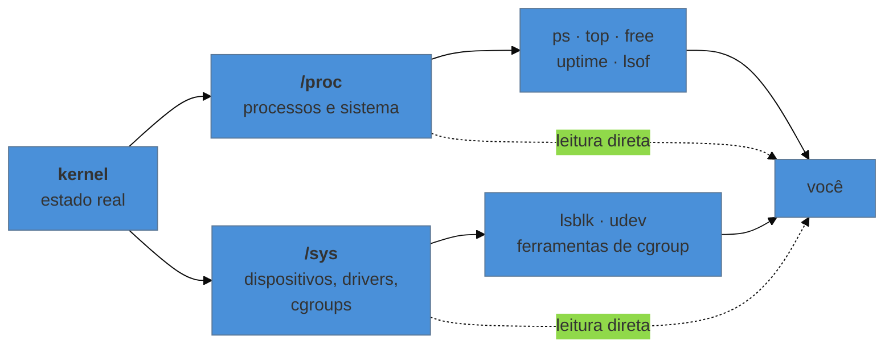

# A hierarquia do sistema de arquivos

> [!abstract] TL;DR
> O Linux tem uma **árvore única**: não existe "unidade C:", existe `/` e tudo pendurado nele, inclusive discos, pendrives e sistemas de arquivos remotos. A convenção que diz o que vai em cada diretório é a **FHS**, e ela é convenção mesmo — a distribuição pode divergir, e várias divergem. Mais importante para este galho: dois desses diretórios, `/proc` e `/sys`, **não contêm arquivo nenhum**. São interfaces do kernel disfarçadas de arquivo, geradas na hora da leitura, e é por elas que praticamente tudo o que este galho investiga é observado.

---

## O disco novo que não apareceu em lugar nenhum

Você conecta um disco na máquina. `lsblk` mostra que ele existe. E aí a pergunta que todo mundo vindo do Windows faz: **em que letra ele apareceu?**

Em nenhuma. No Linux, um dispositivo de armazenamento não vira uma raiz nova — ele precisa ser **montado** em algum ponto da árvore que já existe. Você escolhe onde: `/mnt/backup`, `/var/lib/dados`, `/home`. O disco passa a ser aquele pedaço da árvore.

Essa é a primeira ideia estrutural do sistema de arquivos do Linux, e ela tem uma consequência prática imediata: **o caminho não te diz em que disco a coisa está.** `/var/log` pode estar na mesma partição que `/`, ou num volume separado, ou num sistema de arquivos remoto. Descobrir em qual é uma pergunta que se faz ao sistema, não ao caminho:

```bash
df -h /var/log        # em qual sistema de arquivos este caminho está, e quanto sobra
findmnt /var/log      # o ponto de montagem, o dispositivo e as opções
lsblk                 # a topologia de discos e partições
```

Isso é a base de um diagnóstico comum: "o disco encheu" quase nunca é *o* disco — é **um** sistema de arquivos, e saber qual muda inteiramente o que fazer.

---

## A convenção: o que mora onde

A **Filesystem Hierarchy Standard** organiza a árvore por dois eixos que valem mais que a lista: o conteúdo é **estático ou variável**, e é **compartilhável ou local**.

| Diretório | O que é | Vale saber |
|---|---|---|
| `/etc` | configuração do sistema, **do host** | estático e local. É o primeiro lugar a olhar em qualquer investigação de comportamento |
| `/var` | dados que **variam** durante a operação | log, spool, cache, dados de banco. É o que costuma encher |
| `/usr` | programas e bibliotecas da distribuição | estático e compartilhável; hoje `/bin` e `/lib` são links para dentro dele |
| `/opt` | software de terceiros, autocontido | por pacote, fora do gerenciamento da distribuição |
| `/home` | dados dos usuários | quase sempre a candidata a partição própria |
| `/tmp` | temporário, **volátil** | limpo no boot, e em muitas distribuições é memória, não disco |
| `/run` | estado de execução desde o boot | PIDs, sockets. Em memória; `/var/run` é link para cá |
| `/boot` | kernel e initramfs | mexer aqui errado deixa a máquina sem subir |
| `/dev` | dispositivos como arquivos | preenchido dinamicamente |
| `/proc` | **interface do kernel** | não é arquivo; ver abaixo |
| `/sys` | **interface de dispositivos e drivers** | idem |

> [!info] O "merge do /usr" — por que `/bin` é um link
> Historicamente `/bin` guardava o essencial para subir a máquina e `/usr/bin` o resto, porque `/usr` podia estar num disco separado montado depois. Com initramfs, essa separação perdeu função, e as distribuições migraram para o **usr-merge**: `/bin`, `/sbin` e `/lib` viraram links simbólicos para `/usr/bin`, `/usr/sbin` e `/usr/lib`. Por isso `ls -l /bin` mostra uma seta, e por isso não faz mais sentido decorar a distinção antiga — ela sobrevive como compatibilidade.

Vale insistir num ponto: a FHS é **convenção**, não regra imposta pelo kernel. Distribuições divergem (o NixOS é o caso extremo, com quase tudo em `/nix/store`), e software de terceiro faz o que quer. A convenção é útil para saber **onde procurar primeiro**, não para presumir.

---

> [!tip] Vídeo — o passeio pela árvore, diretório a diretório
> [**Linux File System/Structure Explained!**](https://www.youtube.com/watch?v=HbgzrKJvDRw) (DorianDotSlash, ~16 min, EN) percorre a árvore inteira explicando para que serve cada diretório, e é o complemento certo para a tabela desta seção — onde a tabela resume, ele contextualiza. Dois pontos dele valem: a distinção histórica entre `/mnt` e `/media` (o primeiro para você montar à mão, o segundo para o que a área de trabalho monta sozinha, convenção que só apareceu depois), e a observação de que diretórios em `tmpfs` **rodam em RAM e perdem tudo no reinício** — o que é exatamente a armadilha de `/tmp` desta nota. Ele também é honesto sobre o limite da convenção: a FHS diz onde as coisas *deveriam* ficar, e mesmo assim você vai precisar procurar em outros lugares de vez em quando. **O que ele não cobre — e é a metade que dá nome a esta nota:** `/proc` e `/sys` como sistemas de arquivos sintéticos, e o enigma do arquivo apagado que não libera espaço.

## Os dois diretórios que não são arquivos

Aqui está a parte que muda o resto do galho.

```bash
$ ls -l /proc/uptime
-r--r--r-- 1 root root 0 ago 12 10:04 /proc/uptime

$ cat /proc/uptime
4823.17 18291.44
```

Tamanho **zero** — e mesmo assim tem conteúdo. Não há contradição: `/proc` é um sistema de arquivos **sintético**, montado pelo kernel, cujo conteúdo não está gravado em lugar nenhum. Ele é **gerado no instante da leitura**. Quando você executa `cat /proc/uptime`, o kernel formata o número naquele momento e entrega. Ler de novo devolve outro valor.

Isso explica por que quase toda ferramenta de diagnóstico do Linux é, no fundo, um leitor de `/proc` com formatação bonita. `ps`, `top`, `free`, `uptime`, `lsof` — todas buscam ali.



### O que vale conhecer em `/proc`

**Por processo**, em `/proc/<pid>/` — os arquivos da nota 01: `cmdline`, `environ`, `cwd`, `exe`, `fd/`, `status`, `limits`.

**Do sistema inteiro**, na raiz de `/proc`:

```bash
cat /proc/cpuinfo      # processadores como o kernel os vê
cat /proc/meminfo      # a fonte de tudo que free e top mostram
cat /proc/loadavg      # os três números de load average
cat /proc/mounts       # o que está montado agora (mais confiável que /etc/fstab)
cat /proc/version      # kernel e compilador
```

A distinção entre `/proc/mounts` e `/etc/fstab` é um bom exemplo do valor de saber isso: o `fstab` diz o que **deveria** ser montado no boot; `/proc/mounts` diz o que **está** montado agora. Quando os dois discordam, a discordância é o achado.

### `/sys` e o que ele acrescenta

Enquanto `/proc` cresceu historicamente e mistura processo com sistema, o `/sys` foi criado depois com organização mais rígida, expondo dispositivos, drivers e — o que mais importa para quem vem dos galhos de container — a hierarquia de **cgroups** em `/sys/fs/cgroup`. É lá que os limites de CPU e memória de um container aparecem como arquivos de texto comuns, assunto retomado na nota 14.

> [!warning] `/proc` e `/sys` aceitam escrita, e isso é sério
> Vários arquivos ali não são só leitura: escrever neles **muda o comportamento do kernel em tempo real**. `echo 1 > /proc/sys/net/ipv4/ip_forward` liga roteamento de pacotes na hora. É um mecanismo legítimo — é assim que `sysctl` funciona —, mas é também a forma mais rápida de mudar algo em produção sem deixar rastro nem persistência. Mudança que deve sobreviver ao boot vai em `/etc/sysctl.d/`, não num `echo`.

---

## Um exemplo trabalhado: "o disco encheu"

O alerta diz que o disco está em 100%. A investigação, em quatro passos, usa tudo desta nota:

```bash
# 1. QUAL sistema de arquivos encheu — quase nunca é "o disco"
df -h

# 2. onde, dentro dele, está o volume — sem atravessar para outros sistemas de arquivos
du -xh --max-depth=1 /var 2>/dev/null | sort -rh | head

# 3. suspeito número um em servidor: log
du -xh --max-depth=1 /var/log | sort -rh | head
```

E o passo que separa quem conhece o sistema de quem não conhece:

```bash
# 4. espaço que sumiu sem arquivo correspondente: arquivo apagado com processo ainda segurando
lsof +L1 2>/dev/null | head
```

O caso é clássico e desnorteia quem não o conhece: alguém apagou um log gigante, o `df` continua mostrando o disco cheio, e o `du` não acha nada. O motivo é que **apagar um arquivo remove o nome, não o conteúdo** — enquanto um processo mantiver o descritor aberto, o espaço continua ocupado. A prova está em `/proc/<pid>/fd/`, onde o descritor aparece apontando para um caminho marcado como `(deleted)`. A correção é reiniciar ou sinalizar o processo, não procurar mais arquivos.

Esse exemplo antecipa a nota 03: o elo entre "arquivo" e "descritor" é o que explica o comportamento.

---

## Armadilhas comuns

> [!warning] Presumir que caminho igual é disco igual
> **O que acontece:** você libera espaço apagando coisas em `/home` e `/var` continua cheio. **Por quê:** pontos de montagem diferentes são sistemas de arquivos independentes, com espaço independente. **Como evitar:** `df -h <caminho>` antes de agir. E use `du -x`, que não atravessa para outro sistema de arquivos — sem o `-x`, a soma engana.

> [!warning] Editar `/etc/fstab` sem testar e reiniciar
> **O que acontece:** a máquina não sobe, e em servidor remoto isso significa console de emergência do provedor. **Por quê:** entrada inválida no `fstab` pode parar o boot. **Como evitar:** depois de editar, `sudo mount -a` valida sem reiniciar. Se der erro ali, teria dado no boot.

> [!warning] Guardar em `/tmp` o que precisa sobreviver
> **O que acontece:** o arquivo some depois de um reinício — ou antes dele. **Por quê:** `/tmp` é limpo no boot e, em muitas distribuições, é `tmpfs`: mora em memória, não em disco. **Como evitar:** dado que precisa persistir vai em `/var` (ou no volume do container). Se `/tmp` é `tmpfs`, escrever muito lá também **consome memória** — o que já derrubou aplicação por motivo aparentemente inexplicável.

> [!warning] Achar que `df` e `du` deveriam bater
> **O que acontece:** `df` diz cheio, `du` diz vazio, e a pessoa duvida das duas ferramentas. **Por quê:** medem coisas diferentes — `df` pergunta ao sistema de arquivos quanto está alocado; `du` soma o que consegue **alcançar por nome**. Arquivo apagado com descritor aberto está alocado e não tem nome. **Como evitar:** `lsof +L1` é a ponte entre os dois números.

---

## Como explicar em inglês

"Linux has a single tree rooted at `/` — there are no drive letters. Any storage device has to be mounted somewhere in that tree, so a path tells you nothing about which disk it's on; `df` and `findmnt` do. The FHS is the convention for what belongs where, but it's a convention, not a kernel rule. The two directories that matter most for debugging aren't real files at all: `/proc` and `/sys` are synthetic filesystems generated by the kernel on read. That's why `/proc/uptime` reports zero bytes and still has content, and it's where `ps`, `top` and `free` get everything they show."

| PT | EN |
|---|---|
| ponto de montagem | mount point |
| montar / desmontar | to mount / unmount |
| sistema de arquivos sintético | synthetic (virtual) filesystem |
| espaço alocado | allocated space |
| arquivo apagado ainda aberto | deleted file held open |
| conteúdo volátil | volatile content |
| persistir | to persist |

---

## O que vem a seguir

O exemplo do disco cheio terminou numa peça que ainda não foi explicada: um arquivo apagado que continua ocupando espaço porque **um processo mantém um descritor aberto para ele**. Descritor de arquivo é o conceito que amarra arquivo, terminal, pipe e socket numa coisa só — e é o que explica redirecionamento, o que acontece com a saída de um serviço, e metade dos problemas de log em container.

- **03 — Tudo é arquivo: descritores e redirecionamento** — o que `2>&1` realmente faz, e por que a ordem importa.
- [[03-Dominios/Ciência/Sistemas Operacionais/11 - Sistemas de arquivos|Ciência/SO 11 — Sistemas de arquivos]] — inode, alocação e estrutura interna, que esta nota usa como dado.
- [[03-Dominios/Tecnologia/Infraestrutura/Linux/01 - O que o Linux entrega a um processo|01 — O que o Linux entrega a um processo]] — os arquivos de `/proc/<pid>/` que esta nota generaliza.

## Fontes

- **Linux Foundation** — [*Filesystem Hierarchy Standard 3.0*](https://refspecs.linuxfoundation.org/FHS_3.0/fhs/index.html) — a especificação, incluindo os eixos estático/variável e compartilhável/local.
- **Michael Kerrisk** — [*proc(5)*](https://man7.org/linux/man-pages/man5/proc.5.html) — o catálogo completo de `/proc`, por arquivo.
- **Kernel.org** — [*sysfs — The filesystem for exporting kernel objects*](https://www.kernel.org/doc/html/latest/filesystems/sysfs.html) — o que `/sys` expõe e por que ele existe além de `/proc`.
- **freedesktop.org** — [*The /usr merge*](https://www.freedesktop.org/wiki/Software/systemd/TheCaseForTheUsrMerge/) — a justificativa da unificação que transformou `/bin` e `/lib` em links.
