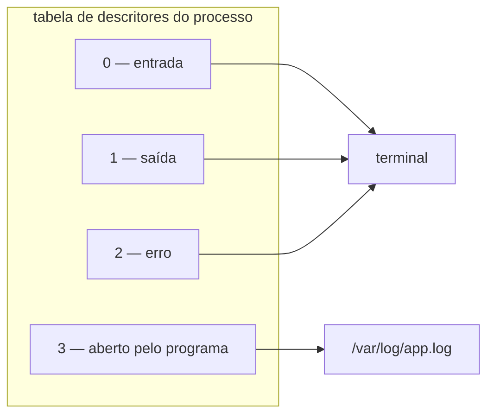

# Tudo é arquivo — descritores e redirecionamento

> [!abstract] TL;DR
> Um **descritor de arquivo** é só um número inteiro que o processo usa para se referir a algo aberto — e esse algo pode ser um arquivo, um terminal, um pipe, um socket ou um dispositivo. Todo processo nasce com três: `0` entrada, `1` saída, `2` erro. Redirecionar é **trocar para onde esse número aponta**, e é por isso que `2>&1` significa "faça o 2 apontar para onde o 1 aponta **agora**" — o que torna a ordem dos operadores decisiva. Entender isso resolve, de uma vez, redirecionamento no shell, log de serviço, log de container e o arquivo apagado que não libera espaço.

---

## O comando que joga fora justamente o que interessa

Você roda um script que falha e quer guardar a saída para analisar:

```bash
./deploy.sh > saida.log
```

O arquivo é criado, e está vazio — ou tem só as linhas de sucesso. A mensagem de erro, a única que importava, continuou aparecendo na tela e não foi para lugar nenhum.

Então você tenta o que lembra ter visto:

```bash
./deploy.sh 2>&1 > saida.log     # continua não capturando o erro
./deploy.sh > saida.log 2>&1     # agora sim
```

Os dois parecem a mesma coisa com as peças em ordem diferente, e não são. A diferença é exatamente o assunto desta nota, e ela é impossível de decorar com segurança — só de deduzir, uma vez que se entenda o que um descritor é.

---

## O que é, de fato, um descritor

Quando um processo abre alguma coisa, o kernel devolve **um número**. Esse número é um índice numa tabela que pertence àquele processo, e cada entrada aponta para um objeto aberto no kernel.

O ponto que faz o modelo valer a pena: **o processo não sabe, e não precisa saber, o que tem do outro lado**. Escrever no descritor 1 é a mesma operação, com a mesma chamada de sistema, quer ele esteja ligado a um terminal, a um arquivo em disco, a um pipe para outro processo ou a um socket de rede. É isso que a frase "tudo é arquivo" quer dizer: não que tudo *seja* arquivo, mas que tudo é **acessado pela mesma interface**.



Três descritores já vêm abertos por convenção, e o programa não os cria — ele os **herda** de quem o iniciou (nota 01):

| Nº | Nome | Uso |
|---|---|---|
| 0 | entrada padrão (`stdin`) | de onde o programa lê |
| 1 | saída padrão (`stdout`) | resultado do trabalho |
| 2 | erro padrão (`stderr`) | mensagens de diagnóstico |

A separação entre 1 e 2 não é decorativa: ela existe para que o **resultado** possa ser canalizado adiante enquanto as **mensagens** continuam visíveis. É o que permite `./programa | grep algo` continuar mostrando erros na tela em vez de enviá-los ao `grep`.

Para ver a tabela de um processo real:

```bash
ls -l /proc/<pid>/fd/
```

A saída mostra cada número apontando para o que está do outro lado — um caminho, um `socket:[...]`, um `pipe:[...]`, ou `/dev/pts/0` para terminal.

---

## Redirecionar é reapontar

Com isso, os operadores do shell deixam de ser sintaxe e viram operação:

| Operador | O que faz |
|---|---|
| `> arquivo` | faz o descritor **1** apontar para o arquivo, truncando-o |
| `>> arquivo` | idem, em modo de acréscimo |
| `2> arquivo` | faz o descritor **2** apontar para o arquivo |
| `< arquivo` | faz o descritor **0** ler do arquivo |
| `2>&1` | faz o **2** apontar para onde o **1** aponta **neste momento** |
| `&> arquivo` | atalho do Bash para 1 e 2 juntos |
| `\|` | conecta o 1 de um ao 0 do outro por um pipe |

A palavra decisiva é *neste momento*. O shell processa os redirecionamentos **da esquerda para a direita**, e cada um age sobre o estado que existe naquele ponto:

```bash
./cmd 2>&1 > saida.log
# 1. "2>&1" → o 2 passa a apontar para onde o 1 aponta agora: o TERMINAL
# 2. "> saida.log" → o 1 passa a apontar para o arquivo
# resultado: erro no terminal, saída no arquivo

./cmd > saida.log 2>&1
# 1. "> saida.log" → o 1 passa a apontar para o arquivo
# 2. "2>&1" → o 2 passa a apontar para onde o 1 aponta agora: o ARQUIVO
# resultado: os dois no arquivo
```

> [!question]- Então `2>&1` não significa "junte o erro com a saída"?
> Não. Significa **"copie para o descritor 2 o destino que o descritor 1 tem agora"**. É uma cópia de ponteiro, não uma fusão permanente: se o 1 for redirecionado depois, o 2 continua onde estava. Ler assim faz a ordem deixar de ser regra decorada e virar consequência.

Dois usos que aparecem o tempo todo e agora se explicam sozinhos:

```bash
comando 2>/dev/null            # descarta só o erro (dev/null aceita tudo e não guarda nada)
comando 2>&1 | grep erro       # manda TAMBÉM o erro para o pipe — sem isso, o grep só vê a saída
```

O segundo é o motivo de tanto `grep` "não achar" mensagem de erro: por padrão, o pipe conecta apenas o descritor 1.

---

> [!tip] Vídeo — o que `2>&1` faz por baixo, com o nome próprio
> [**What's behind a file descriptor in Linux? Also, I/O redirection with `dup2`**](https://www.youtube.com/watch?v=rW_NV6rf0rM) (Chris Kanich, ~20 min, EN) é uma aula de graduação, e vai um degrau abaixo desta nota — o que a torna a leitura certa para quem quer o mecanismo completo. Ele mostra que não há **uma** tabela, e sim três encadeadas: a tabela de descritores **do processo**, uma tabela global de arquivos abertos, e a de *v-nodes*, que representa o arquivo em si. Daí decorre o que esta nota afirma sem demonstrar: dois descritores podem apontar para o mesmo arquivo com **modos e posições diferentes**, e é isso que permite herança e compartilhamento sem interferência. Em [17:26] aparece a peça que fecha o assunto: a chamada **`dup2`**, que copia uma entrada da tabela de descritores para outro índice — é literalmente o que `2>&1` executa, e é também como o shell conecta as duas pontas de um pipe antes de trocar o programa. **O que ele não cobre:** o efeito prático no log de serviço e de container, a bufferização por tipo de destino, e o teto de descritores.

## Por que isso decide o log do seu serviço e do seu container

Aqui a nota deixa de ser sobre shell.

Um processo iniciado pelo `systemd` não tem terminal. Seus descritores 1 e 2 são conectados pelo próprio `systemd` ao `journald` — e é **por isso** que a saída da aplicação aparece em `journalctl` sem que ninguém tenha configurado biblioteca de log nenhuma. A aplicação continua apenas escrevendo no descritor 1; quem mudou foi o outro lado. É o assunto da nota 08.

Em container, a mesma mecânica explica a regra que o galho de Docker trata como contrato: **a aplicação deve escrever em `stdout`/`stderr`, não em arquivo**. O runtime conecta esses dois descritores a um coletor, e é dali que `docker logs` e o agregador do cluster leem. Uma aplicação que escreve num arquivo dentro do container está gravando numa camada efêmera que ninguém está lendo — o log existe e é invisível.

E explica também um sintoma que parece bug: **a saída não aparece, ou aparece atrasada em blocos**. A biblioteca padrão de C — e por herança várias linguagens — decide o modo de *buffering* observando **o que está do outro lado do descritor 1**: se for terminal, envia linha a linha; se for pipe ou arquivo, acumula em blocos de vários kilobytes. Rodando à mão você vê tudo na hora; sob `systemd` ou em container, a saída trava. A correção é dizer à aplicação para não bufferizar (`PYTHONUNBUFFERED=1` em Python, por exemplo) ou forçar por fora com `stdbuf -oL`.

---

## O arquivo apagado que não devolve o espaço

A nota 02 terminou neste enigma, e agora ele fecha.

Apagar um arquivo remove **o nome** que aponta para o conteúdo, não o conteúdo. Enquanto existir um descritor aberto para ele, o conteúdo permanece alocado — sem nome, invisível para `du`, e perfeitamente visível para `df`.

```bash
lsof +L1                        # arquivos abertos com zero links: os apagados ainda em uso
ls -l /proc/<pid>/fd/ | grep deleted
```

A liberação acontece quando o **último** descritor fecha — reiniciando o serviço, ou sinalizando-o para reabrir o log. É também por isso que a rotação de logs precisa avisar o processo: renomear o arquivo não faz o processo parar de escrever no descritor antigo.

> [!info] O mesmo mecanismo, usado de propósito
> Programas criam arquivos temporários abrindo e apagando imediatamente: o conteúdo continua acessível pelo descritor e **desaparece sozinho** quando o processo termina, aconteça o que acontecer. É limpeza garantida pelo kernel, sem depender de o programa lembrar de apagar.

---

## Limites: o teto de descritores

Como descritor é recurso, ele tem teto — e é um dos que mais derruba serviço em produção, porque o sintoma não menciona descritor nenhum.

```bash
ulimit -n                       # o teto do shell atual
cat /proc/<pid>/limits | grep -i "open files"   # o teto REAL do processo em questão
```

A mensagem que aparece é `Too many open files`, e a causa costuma ser uma de duas: o teto está baixo demais para a carga, ou a aplicação está **vazando** descritores — abrindo e não fechando. Distinguir é simples: acompanhe a contagem em `ls /proc/<pid>/fd | wc -l` ao longo do tempo. Se cresce e nunca cai, é vazamento, e subir o limite só adia.

Isso conversa diretamente com o galho de Nginx, cuja nota 13 trata `worker_rlimit_nofile` como metade da conta de capacidade — cada conexão é um descritor, e num proxy reverso cada requisição consome dois.

---

## Armadilhas comuns

> [!warning] Trocar a ordem de `> arquivo` e `2>&1`
> **O que acontece:** o erro continua na tela, ou não é capturado no log. **Por quê:** `2>&1` copia o destino que o `1` tem **naquele instante**. Antes do `>`, ele ainda é o terminal. **Como evitar:** `> arquivo 2>&1` — redirecione o 1 primeiro. Ou use `&> arquivo` no Bash, que não tem ordem para errar.

> [!warning] `grep` que não encontra a mensagem de erro
> **O que acontece:** `comando | grep falha` não devolve nada, embora a falha esteja visível na tela. **Por quê:** o pipe conecta apenas o descritor 1. O erro sai pelo 2 e passa ao largo. **Como evitar:** `comando 2>&1 | grep falha`.

> [!warning] Achar que `> arquivo` acrescenta
> **O que acontece:** o conteúdo anterior some, e em log isso é perda real. **Por quê:** `>` trunca o arquivo antes de escrever. **Como evitar:** `>>` para acrescentar. Em Bash, `set -o noclobber` faz `>` recusar sobrescrever arquivo existente — vale em sessões de operação.

> [!warning] Rotacionar log sem avisar o processo
> **O que acontece:** o arquivo novo fica vazio e o espaço não é liberado. **Por quê:** o processo continua escrevendo no **descritor**, que aponta para o arquivo antigo — agora sem nome. **Como evitar:** é o que a diretiva `postrotate` do `logrotate` existe para fazer: sinalizar o processo para reabrir. Alternativa mais robusta: `copytruncate`, com a ressalva de que ela pode perder as linhas escritas entre a cópia e o truncamento.

---

## Como explicar em inglês

"A file descriptor is just an integer that indexes into a per-process table of open things — a file, a terminal, a pipe, a socket. The process writes to descriptor 1 the same way regardless of what's on the other end; that's what 'everything is a file' actually means. Redirection re-points a descriptor, and `2>&1` copies wherever descriptor 1 points **at that moment**, which is why `> file 2>&1` works and `2>&1 > file` doesn't. The same model explains container logging: the runtime attaches stdout and stderr to a collector, so an app writing to a file inside the container is writing where nobody is reading."

| PT | EN |
|---|---|
| descritor de arquivo | file descriptor |
| entrada/saída/erro padrão | standard input/output/error |
| redirecionar | to redirect |
| truncar | to truncate |
| acrescentar | to append |
| encadear por pipe | to pipe |
| vazamento de descritores | file descriptor leak |
| bufferização por linha / por bloco | line / block buffering |

---

## O que vem a seguir

Descritor responde *por onde* o processo fala. Falta responder **o que ele tem direito de tocar** — e essa é uma pergunta de identidade, não de canal. A próxima nota trata do modelo de permissões: os três UIDs que a nota 01 mencionou, o significado real dos bits de permissão, e por que `sudo` é política e não prefixo.

- **04 — Identidade: usuários, grupos e permissão** — quem o processo é, e o que isso libera.
- [[03-Dominios/Tecnologia/Infraestrutura/Linux/02 - A hierarquia do sistema de arquivos|02 — A hierarquia do sistema de arquivos]] — onde o enigma do arquivo apagado foi aberto.
- [[03-Dominios/Ciência/Sistemas Operacionais/10 - I-O e o subsistema de entrada e saída|Ciência/SO 10 — I/O]] — o mecanismo por trás da tabela de descritores, que esta nota usa e não reabre.

## Fontes

- **Michael Kerrisk** — [*open(2)*](https://man7.org/linux/man-pages/man2/open.2.html) e [*dup(2)*](https://man7.org/linux/man-pages/man2/dup.2.html) — a criação e a duplicação de descritores, que é o que `2>&1` faz por baixo.
- **Michael Kerrisk** — *The Linux Programming Interface*, cap. 5 — descritores, herança e a relação entre tabela do processo e tabela do kernel.
- **GNU** — [*Bash Reference Manual — Redirections*](https://www.gnu.org/software/bash/manual/html_node/Redirections.html) — a ordem de avaliação dos operadores, que é a origem da armadilha central desta nota.
- **Michael Kerrisk** — [*setvbuf(3)*](https://man7.org/linux/man-pages/man3/setvbuf.3.html) — o critério de bufferização por tipo de destino, que explica a saída que "trava".
