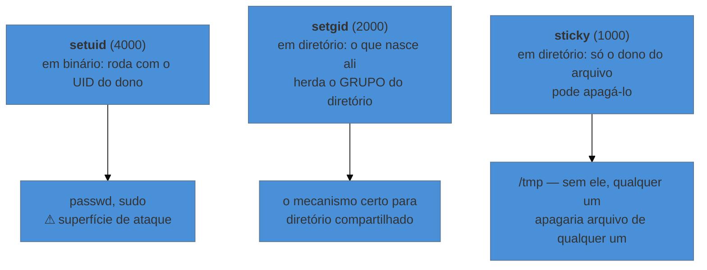

# Identidade — usuários, grupos e permissão

> [!abstract] TL;DR
> Para o kernel, "usuário" é um **número**. O nome existe só para humanos, num arquivo de texto. Cada processo carrega três variantes de UID — real, efetivo e salvo —, e é o **efetivo** que decide o que ele pode tocar; a existência dos outros dois é o que faz `sudo` e binários `setuid` funcionarem. Do lado do arquivo, os nove bits `rwx` significam coisas bem diferentes em arquivo e em diretório — e a surpresa que mais causa incidente é esta: **quem pode escrever num diretório pode apagar arquivos que não consegue nem ler**.

---

## O arquivo é seu, e mesmo assim não dá

A aplicação não consegue escrever no diretório de upload. Você confere e está tudo certo: o dono é o usuário da aplicação, a permissão é `rwx`. Ainda assim, permissão negada.

Ou o contrário, mais desconfortável: um usuário sem nenhuma permissão sobre um arquivo o apaga sem esforço, e ninguém entende como.

Os dois casos vêm da mesma origem — supor que permissão é uma propriedade do arquivo, quando ela é o resultado de um **encontro** entre a identidade do processo e os bits de dois objetos: o arquivo **e cada diretório do caminho até ele**.

---

## Para o kernel, você é um número

```bash
id
# uid=1000(josenaldo) gid=1000(josenaldo) grupos=1000(josenaldo),27(sudo),999(docker)
```

O kernel só enxerga os números. Os nomes vêm de arquivos de texto comuns, legíveis por qualquer um:

| Arquivo | Guarda |
|---|---|
| `/etc/passwd` | nome, UID, GID primário, diretório pessoal, shell |
| `/etc/group` | nome do grupo, GID e a lista de membros suplementares |
| `/etc/shadow` | o hash da senha, legível **só pelo root** |

Duas consequências práticas caem daí. A primeira: **o mesmo nome pode ser UIDs diferentes em máquinas diferentes**, e é por isso que copiar arquivos entre servidores preservando dono às vezes produz um dono numérico sem nome. A segunda, que aparece direto em container: montar um volume do host num container faz o kernel comparar **números**, não nomes — o `app` de dentro com UID 1000 casa com o `josenaldo` de fora com UID 1000, e é assim que arquivo criado no container aparece como seu na máquina.

> [!info] O shell `/usr/sbin/nologin` em `/etc/passwd`
> Contas de serviço não existem para alguém entrar — existem para **serem um UID** sob o qual um processo roda. Por isso o campo de shell delas aponta para um programa que recusa a sessão. Ver isso explica por que `su - www-data` não funciona, e por que isso é intencional.

---

## Os três UIDs, e por que eles existem

Cada processo carrega mais de uma identidade ao mesmo tempo:

| Variante | Papel |
|---|---|
| **real** (UID) | quem iniciou o processo |
| **efetivo** (EUID) | **quem o kernel considera na hora de verificar permissão** |
| **salvo** (SUID) | um lugar para guardar o efetivo e poder voltar a ele |

Fora de casos especiais, os três são iguais e a distinção não importa. Ela existe para permitir uma coisa: que um programa rode com privilégio **maior** que o de quem o chamou, de forma controlada.

O caso canônico é o `passwd`. Um usuário comum precisa alterar a própria senha, mas o arquivo que guarda o hash só é escrito pelo root. A solução é o bit **setuid** no binário: ao executá-lo, o processo recebe EUID do dono do arquivo — root — enquanto o UID real continua sendo o do usuário. O programa faz o pouco que precisa com privilégio, e sabe quem o chamou.

```bash
ls -l /usr/bin/passwd
# -rwsr-xr-x 1 root root ... /usr/bin/passwd
#    ↑ o 's' no lugar do 'x' do dono: setuid
grep -E 'Uid|Gid' /proc/<pid>/status   # os três (quatro, com o de filesystem), lado a lado
```

É também por isso que binário `setuid` é superfície de ataque clássica: um defeito nele vira escalonamento de privilégio. Achar os que existem na máquina é uma linha:

```bash
find / -perm -4000 -type f 2>/dev/null
```

---

## Os nove bits, e o que eles significam em cada caso

A parte que quase todo material trata como óbvia — e que é a origem dos dois enigmas da abertura.

| Bit | Em **arquivo** | Em **diretório** |
|---|---|---|
| `r` | ler o conteúdo | **listar** os nomes |
| `w` | alterar o conteúdo | **criar, renomear e apagar** entradas |
| `x` | executar | **atravessar** (entrar, acessar algo lá dentro) |

Três consequências que resolvem casos reais:

**Apagar não depende do arquivo.** Apagar é remover uma entrada do diretório, então quem decide é o `w` **do diretório**, não a permissão do arquivo. Por isso alguém sem leitura sobre um arquivo pode apagá-lo — e por isso `/tmp`, onde todo mundo escreve, precisa de proteção extra (o *sticky bit*, adiante).

**Sem `x` no diretório, o resto não vale.** Você pode ter `rwx` num arquivo e não alcançá-lo, porque falta travessia em algum diretório do caminho. É o caso da abertura: o diretório de upload estava certo, e o diretório-pai não. A verificação é do caminho inteiro:

```bash
namei -l /var/www/app/uploads/arquivo.txt   # permissão de cada componente do caminho
```

**`r` sem `x` num diretório é quase inútil:** você lê os nomes e não consegue saber nada sobre eles.

### Octal, sem decorar

Cada trio vira um número: `r=4`, `w=2`, `x=1`.

```bash
chmod 640 config.yaml    # dono rw- · grupo r-- · outros ---
chmod 755 script.sh      # dono rwx · grupo r-x · outros r-x
chmod u+x script.sh      # forma simbólica, quando só se quer acrescentar
chown app:app arquivo    # dono e grupo
```

E a regra de avaliação que quase ninguém aprende explicitamente: o kernel escolhe **um** trio e ignora os demais. Se você é o dono, valem os bits do dono — **mesmo que os do grupo sejam mais permissivos**. Não há soma de permissões.

### `umask`: por que o arquivo nasce como nasce

Arquivos novos não nascem com a permissão que o programa pede, e sim com ela **menos** a máscara do processo.

```bash
umask          # 0022 é o mais comum
# arquivo pedido 666 → 644 · diretório pedido 777 → 755
```

Isso explica por que arquivo criado por um serviço às vezes não é legível pelo grupo — e a correção certa costuma ser ajustar a `umask` do serviço, não sair fazendo `chmod` depois.

---

## Os três bits extras



O **setgid em diretório** é a peça mais útil e menos conhecida das três: ele é a forma correta de manter um diretório colaborativo, porque todo arquivo criado ali passa a pertencer ao grupo do diretório automaticamente — sem depender de cada pessoa lembrar de ajustar o grupo depois.

O **sticky** é o que faz `/tmp` funcionar: todos escrevem, e ninguém apaga o que é dos outros. É a resposta direta à regra de que apagar depende do diretório.

---

## Quando três trios não bastam: ACL

O modelo dono/grupo/outros resolve a maior parte dos casos e trava num pedido simples: *"este diretório é do time A, e uma pessoa do time B precisa de leitura"*. Com três trios não dá — a saída seria criar mais um grupo para cada combinação.

```bash
setfacl -m u:maria:rx /srv/projeto     # concede a um usuário específico
getfacl /srv/projeto                    # lê as regras estendidas
ls -l /srv/projeto                      # o '+' no fim das permissões indica que há ACL
```

O `+` no `ls -l` é o sinal que importa: sem ele, você lê nove bits e acha que sabe tudo; com ele, há regras que o `ls` não está mostrando.

---

## `sudo` é política, não prefixo

O erro conceitual comum é ler `sudo` como "rodar como root". Ele é um programa **setuid** que consulta uma política — em `/etc/sudoers` e `/etc/sudoers.d/` — e decide o que aquele usuário pode executar, como quem, e se precisa de senha.

```bash
sudo -l                       # o que EU posso fazer, segundo a política
sudo -u postgres psql         # rodar como outro usuário, não necessariamente root
```

A política permite recortes finos — um usuário autorizado a reiniciar **um** serviço específico e nada mais. Isso é o que separa administração de "dar root para resolver".

> [!warning] `NOPASSWD` amplo é privilégio permanente
> Conceder `ALL=(ALL) NOPASSWD: ALL` para conveniência transforma qualquer comprometimento daquela conta em comprometimento total da máquina, sem barreira. Se automação precisa de `sudo` sem senha, a regra deve nomear **os comandos exatos**, não `ALL`. E edite sempre com `visudo`, que valida a sintaxe antes de salvar — arquivo `sudoers` inválido pode trancar todo mundo para fora da administração.

Vale saber que existe um modelo mais fino que "root ou não root": as **capabilities** dividem o poder do root em pedaços (abrir porta baixa, alterar rede, ignorar permissão de arquivo), e são o que permite um processo escutar na porta 80 sem ser root. O mecanismo pertence a [[03-Dominios/Ciência/Sistemas Operacionais/13 - Virtualização e containers|Ciência/SO 13]] e aparece de novo, pelo lado prático, na nota 13 do galho de Docker.

---

## Armadilhas comuns

> [!warning] `chmod 777` como solução de permissão negada
> **O que acontece:** funciona, e por isso vira hábito. Depois, qualquer processo da máquina pode alterar o arquivo — inclusive um comprometido.
> **Por quê:** `777` não corrige o problema, ele o **remove**, junto com a proteção.
> **Como evitar:** diagnostique antes. `namei -l <caminho>` mostra onde a cadeia quebra, e quase sempre a resposta é `x` faltando num diretório-pai ou o dono errado — coisas que `chown` e um `chmod` cirúrgico resolvem.

> [!warning] `chmod -R 755` num diretório com arquivos
> **O que acontece:** todo arquivo de dado vira executável.
> **Por quê:** o mesmo `x` que significa "atravessar" em diretório significa "executar" em arquivo, e o `-R` não distingue.
> **Como evitar:** trate os dois separadamente — `find . -type d -exec chmod 755 {} +` e `find . -type f -exec chmod 644 {} +`. Ou use as maiúsculas do modo simbólico: `chmod -R a+rX .`, onde `X` só aplica `x` a diretórios e ao que já era executável.

> [!warning] Achar que grupo mais permissivo ajuda o dono
> **O que acontece:** arquivo `r--rw----`, o dono não consegue escrever, e ninguém entende.
> **Por quê:** o kernel avalia **um** trio. Sendo você o dono, valem os bits do dono, e acabou.
> **Como evitar:** ler a permissão pela ordem de avaliação, não como soma.

> [!warning] Rodar tudo como root porque "é mais simples"
> **O que acontece:** funciona sempre — inclusive quando não deveria. Um caminho errado apaga o que não devia; uma falha na aplicação vira controle da máquina.
> **Por quê:** root não passa por verificação.
> **Como evitar:** usuário de serviço por aplicação, com o mínimo. Em container vale o mesmo, e com um agravante: UID 0 dentro do container é UID 0 no kernel do host, salvo namespace de usuário — é a razão de o `USER` no Dockerfile importar.

---

## Como explicar em inglês

"Linux identity is numeric — names live in `/etc/passwd` for humans, the kernel only sees UIDs. Every process carries a real, an effective and a saved UID; the effective one is what permission checks use, and the other two are what make `sudo` and setuid binaries possible. On the file side, the `rwx` bits mean different things for files and directories: on a directory, `w` means you can create and **delete** entries, which is why someone can remove a file they can't even read, and `x` means traversal — so the whole path matters, not just the final file."

| PT | EN |
|---|---|
| UID efetivo | effective UID |
| grupos suplementares | supplementary groups |
| bits de permissão | permission bits |
| travessia de diretório | directory traversal |
| máscara de criação | umask |
| escalonamento de privilégio | privilege escalation |
| conta de serviço | service account |
| privilégio mínimo | least privilege |

---

## O que vem a seguir

Identidade responde o que o processo **pode tocar**. Falta o próprio processo: como ele nasce, por que às vezes aparece como zumbi, por que um `kill` não o mata, e por que ele morre quando você fecha o terminal — mesmo tendo sido colocado em segundo plano.

- **05 — O processo como objeto administrável** — a árvore, os estados e os sinais.
- [[03-Dominios/Tecnologia/Infraestrutura/Linux/03 - Tudo é arquivo - descritores e redirecionamento|03 — Tudo é arquivo]] — os descritores que este processo herda junto com as credenciais.

## Fontes

- **Michael Kerrisk** — [*credentials(7)*](https://man7.org/linux/man-pages/man7/credentials.7.html) — UID real, efetivo, salvo e de sistema de arquivos, e como cada um muda.
- **Michael Kerrisk** — [*path_resolution(7)*](https://man7.org/linux/man-pages/man7/path_resolution.7.html) — a verificação componente a componente do caminho, que é a origem do erro "o arquivo está certo e mesmo assim não abre".
- **Michael Kerrisk** — [*inode(7)*](https://man7.org/linux/man-pages/man7/inode.7.html) — os bits de modo, incluindo setuid, setgid e sticky.
- **Michael Kerrisk** — [*acl(5)*](https://man7.org/linux/man-pages/man5/acl.5.html) — o modelo estendido e sua interação com os bits clássicos.
- **sudo.ws** — [*sudoers(5)*](https://www.sudo.ws/docs/man/sudoers.man/) — a linguagem da política, incluindo o recorte por comando que a nota recomenda.
