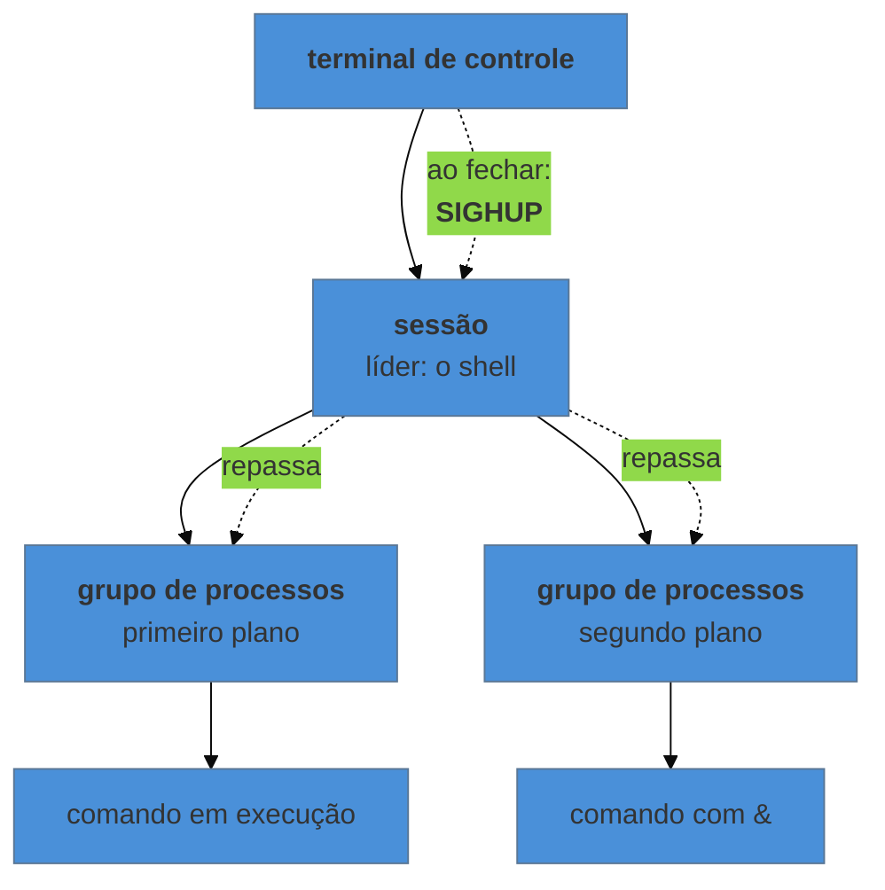

# O processo como objeto administrável

> [!abstract] TL;DR
> Processos formam uma **árvore**: cada um tem um pai, e quando o pai morre antes, o filho é adotado. Cada processo está num **estado**, e dois deles explicam quase toda confusão de diagnóstico — o **zumbi**, que já morreu e não some porque ninguém coletou seu código de saída, e o **D**, que está preso em I/O e por isso **não responde a nenhum sinal**, nem ao `-9`. Sinal é a interface de administração: `TERM` pede para encerrar, `KILL` não pede nada e não pode ser interceptado, `HUP` virou por convenção "releia sua configuração". E o processo morre ao fechar o terminal porque recebe `HUP` — o que também explica `nohup`, `disown` e por que o `tmux` resolve isso.

---

## Dois enigmas que aparecem no mesmo dia

Você encerra a aplicação, confere e ela continua na lista — marcada como `defunct`. Você manda `kill -9`, que supostamente mata qualquer coisa. Ela permanece.

Mais tarde, outro processo trava. Ele não consome CPU, não responde, e o `kill -9` também não faz efeito. Só que este não está morto: está em `D`.

São dois problemas opostos com a mesma aparência — "não morre" — e a diferença entre eles decide o que fazer. Um é inofensivo e some sozinho quando o pai coleta; o outro está preso no kernel e não sai enquanto a operação de disco ou rede não terminar.

---

## A árvore

Todo processo tem um pai, e o `PPID` guarda quem é. Isso monta uma árvore que começa no PID 1.

```bash
pstree -p          # a árvore com PIDs
ps -ef --forest    # a mesma ideia, em lista
ps -o pid,ppid,stat,etime,cmd -p <pid>
```

Quando um pai morre antes do filho, o filho não fica solto: é **adotado**. Em máquina moderna o adotante é o `systemd`; em container, é o que estiver rodando como PID 1 — que pode ser a sua aplicação, e é justamente aí que aparece o problema de zumbis em container, tratado na nota 08 do galho de Docker.

O PID 1 tem dois deveres que ninguém mais tem: **adotar órfãos** e **coletar** o código de saída deles. Uma aplicação que virou PID 1 sem saber disso não faz nem um nem outro.

---

## Os estados, e os dois que importam

```bash
ps -eo pid,stat,cmd
```

A coluna `STAT` é a que responde "o que este processo está fazendo agora":

| Código | Estado | Leitura prática |
|---|---|---|
| `R` | executando ou pronto | está usando CPU, ou esperando por ela |
| `S` | dormindo, interrompível | esperando algo — o estado normal da maioria |
| **`D`** | **dormindo, ininterrompível** | preso em I/O; **não responde a sinal** |
| **`Z`** | **zumbi** | já terminou; ninguém coletou o resultado |
| `T` | parado | recebeu `STOP`, ou está sob depurador |

E os sufixos que aparecem colados: `s` líder de sessão, `+` em primeiro plano, `l` multithread, `<` prioridade alta, `N` prioridade baixa.

### Zumbi: o que já morreu

Um processo que termina não desaparece na hora. Ele deixa para trás uma entrada mínima com o código de saída, à espera de que o **pai** a leia. Enquanto o pai não lê, a entrada permanece — é o zumbi.

Dois pontos que resolvem o enigma:

- **Zumbi não consome nada** além de uma entrada na tabela de processos. Ele não tem memória, não usa CPU, e não pode ser morto: já está morto. `kill -9` não faz nada porque não há o que matar.
- **O problema, quando existe, é do pai.** Um punhado de zumbis é normal e transitório. Centenas indicam um pai que não coleta — e a correção é agir sobre o **pai**: encerrá-lo faz os zumbis serem adotados pelo PID 1, que coleta na hora.

```bash
ps -eo stat,ppid,pid,cmd | awk '$1 ~ /^Z/ {print}'   # os zumbis e quem é o pai de cada um
```

### `D`: o que está preso

O estado ininterrompível existe para proteger a integridade de uma operação em curso no kernel — leitura de disco, acesso a sistema de arquivos remoto. Enquanto ela não termina, o processo **não recebe sinal nenhum**, e é isso que faz o `kill -9` parecer quebrado.

O que importa saber:

- É **normal** por instantes. É sintoma quando persiste.
- `D` persistente aponta para a camada de baixo, não para a aplicação: disco com defeito, NFS cuja outra ponta sumiu, volume de rede indisponível.
- **Ele entra na conta do load average**, e é por isso que uma máquina pode mostrar load altíssimo com CPU ociosa — o assunto da nota 12.

---

> [!tip] Vídeo — o repertório de processo, na mão
> [**KILL Linux processes (also manage them)**](https://www.youtube.com/watch?v=LfC6pv8VISk) (NetworkChuck, ~22 min, EN) cobre o ferramental desta nota com ritmo e demonstração: `ps` e o atalho que quase ninguém aprende primeiro — **`pgrep` para achar por nome** em vez de filtrar a saída do `ps` —, depois `top` e `htop`, o controle de jobs (`&`, `jobs`, `fg`), e o encerramento com `kill` e `pkill` por nome. É a melhor porta de entrada em vídeo para quem ainda não tem esse repertório na ponta dos dedos. **O que ele não cobre — e é o núcleo desta nota:** os estados, a distinção entre zumbi e `D`, por que `kill -9` não resolve nenhum dos dois, e a cadeia terminal → sessão → grupo que explica o `SIGHUP`.
>
> ⚠️ Ele usa `pkill -9` com naturalidade nas demonstrações. Para aprender o comando, tudo bem; como hábito, é exatamente o que a advertência acima desaconselha — `TERM` primeiro, `KILL` como último recurso.

## Sinais: a interface de administração

Sinal é a forma padrão de dizer algo a um processo em execução. Os que se usam:

| Sinal | Nº | O que significa | Interceptável? |
|---|---|---|---|
| `TERM` | 15 | "encerre" — o padrão do `kill` | **sim** |
| `INT` | 2 | o `Ctrl-C` | sim |
| `HUP` | 1 | terminal caiu — por convenção, "releia a configuração" | sim |
| `QUIT` | 3 | encerre e gere despejo de memória | sim |
| `KILL` | 9 | encerramento imediato pelo kernel | **não** |
| `STOP` / `CONT` | 19/18 | congela / retoma | **não** / sim |
| `USR1`/`USR2` | — | livres, definidos por cada aplicação | sim |

A distinção decisiva é entre `TERM` e `KILL`. `TERM` é um **pedido**: a aplicação pode interceptá-lo e fazer o certo — parar de aceitar trabalho novo, terminar o que está em andamento, gravar o que está em memória, fechar conexões. `KILL` não chega à aplicação: o kernel a remove. Nada é gravado, nada é fechado.

> [!warning] `kill -9` como primeira tentativa é o hábito mais caro desta nota
> Ele "funciona sempre" e por isso vira reflexo — inclusive quando o processo levaria dois segundos para sair de forma limpa. O custo aparece depois: transação pela metade, arquivo corrompido, cache não gravado, lock que sobrou. A ordem certa é `TERM`, esperar, e só então `KILL`. Se a aplicação **nunca** sai com `TERM`, isso é defeito dela — e é assunto de correção, não de contornar com `-9` para sempre.

```bash
kill <pid>                 # TERM, o padrão
kill -TERM <pid>
kill -HUP <pid>            # recarregar configuração, em quem suporta
kill -9 <pid>              # último recurso
pkill -f "padrao"          # por linha de comando — confira antes com pgrep -af
kill -l                    # a lista completa
```

E o hábito que evita acidente: **`pgrep -af "padrao"` antes de `pkill -f "padrao"`**. O primeiro mostra exatamente o que o segundo vai atingir. Padrão largo demais já derrubou o serviço errado muitas vezes.

---

## Por que o processo morre quando você fecha o terminal

Aqui fecha o terceiro enigma, e ele depende de três agrupamentos que existem acima do processo:



Quando a conexão cai ou você fecha a janela, o kernel envia **`SIGHUP`** ao líder da sessão — o shell —, e ele repassa aos seus grupos de processos. O padrão de `HUP` é terminar. Por isso o `&` sozinho não protege: colocar em segundo plano muda o grupo, não a sessão.

As saídas, em ordem de robustez:

```bash
nohup comando &            # ignora HUP; saída vai para nohup.out
comando & disown           # tira o processo da lista do shell, que deixa de repassar
setsid comando             # cria sessão nova, sem terminal de controle
```

E as duas que se usam de verdade em servidor: **multiplexador de terminal** (`tmux`, `zellij`) para trabalho interativo que precisa sobreviver à desconexão — assunto de [[03-Dominios/Tecnologia/Terminal/index|Terminal]] —, e **serviço de systemd** para qualquer coisa que deva rodar de verdade, que é o tema da próxima nota. A regra prática: se precisa sobreviver a você sair, não pertence à sua sessão.

---

## Um exemplo trabalhado: "o serviço não morre"

```bash
# 1. quem é, exatamente
pgrep -af minha-app

# 2. em que estado — isto decide todo o resto
ps -o pid,ppid,stat,etime,cmd -p <pid>
```

Três desfechos possíveis, e cada um pede uma coisa diferente:

- **`Z`** — está morto. O alvo é o **pai**: `ps -o ppid= -p <pid>` e trate quem não coletou.
- **`D`** — está preso em I/O. Sinal não resolve. Investigue a camada de baixo: `dmesg -T | tail` para erro de dispositivo, `cat /proc/<pid>/stack` (como root) para ver onde ele parou, e verifique montagens de rede.
- **`S` ou `R` ignorando `TERM`** — a aplicação está interceptando o sinal e não terminando. Aí o `-9` é legítimo, **e o achado é a aplicação**: um manipulador de `TERM` que não encerra é defeito, e a nota 07 mostra o lado do `systemd` dessa mesma discussão.

---

## Armadilhas comuns

> [!warning] Matar o pai esperando que os filhos morram
> **O que acontece:** o pai sai, os filhos continuam — agora adotados pelo PID 1, órfãos de supervisão. **Por quê:** sinal vai para quem você endereçou. Não há propagação automática pela árvore. **Como evitar:** sinalize o **grupo** com `kill -TERM -<PGID>` (o hífen antes do número), ou deixe a supervisão para o `systemd`, que encerra a unidade inteira por padrão — inclusive processos que a aplicação criou.

> [!warning] Caçar zumbi com `kill`
> **O que acontece:** nada, e a conclusão errada é de que o sistema está travado. **Por quê:** zumbi já terminou; não há processo para receber sinal. **Como evitar:** aja sobre o pai. E, se for em container, a causa raiz costuma ser a aplicação rodando como PID 1 sem cumprir o dever de coletar — resolvido com um init mínimo (`--init` no Docker).

> [!warning] `pkill -f` com padrão largo
> **O que acontece:** o padrão casa com mais do que você imaginava — inclusive com o seu próprio comando, ou com o editor que está com o arquivo aberto. **Por quê:** `-f` compara contra a linha de comando inteira. **Como evitar:** `pgrep -af` primeiro, sempre. Ler a lista custa três segundos.

> [!warning] Confundir prioridade com limite
> **O que acontece:** `nice` é usado esperando limitar consumo, e o processo continua consumindo tudo quando a máquina está ociosa. **Por quê:** `nice` altera **prioridade relativa** na disputa por CPU; ele não impõe teto. **Como evitar:** teto é cgroup, não prioridade — assunto da nota 14.

---

## Como explicar em inglês

"Processes form a tree, and when a parent dies first the child is reparented — to systemd on a normal host, or to whatever is PID 1 inside a container. Two states explain most confusion: a zombie has already exited and is only waiting for its parent to reap the exit status, so `kill -9` does nothing; and `D` state is uninterruptible sleep inside the kernel, so it doesn't receive signals at all — and it counts toward load average, which is why load can be high with idle CPU. `TERM` is a request the application can handle; `KILL` isn't delivered to the application at all, so nothing gets flushed or closed."

| PT | EN |
|---|---|
| árvore de processos | process tree |
| adoção / reparentagem | reparenting |
| coletar o código de saída | to reap the exit status |
| zumbi | zombie process |
| sono ininterrompível | uninterruptible sleep |
| encerramento gracioso | graceful shutdown |
| grupo de processos / sessão | process group / session |
| terminal de controle | controlling terminal |

---

## O que vem a seguir

A nota terminou numa conclusão que ela mesma não resolve: o que precisa sobreviver a você **não deve pertencer à sua sessão**. Falta então quem inicia processos no boot, quem os reinicia quando caem, quem lhes entrega ambiente e diretório de trabalho, e quem decide o que acontece quando o `TERM` não é respondido a tempo. Esse alguém é o sistema de init — e no Linux moderno ele é o `systemd`.

- **06 — systemd: o modelo de unidades** — quem cria e supervisiona os processos do sistema.
- [[03-Dominios/Ciência/Sistemas Operacionais/03 - Processos|Ciência/SO 03 — Processos]] — criação, estados e escalonamento como mecanismo, que esta nota usa e não reabre.
- [[03-Dominios/Tecnologia/Infraestrutura/Linux/01 - O que o Linux entrega a um processo|01 — O contrato]] — de onde vêm o PPID e as credenciais que esta nota manipula.

## Fontes

- **Michael Kerrisk** — [*signal(7)*](https://man7.org/linux/man-pages/man7/signal.7.html) — a tabela completa, o comportamento padrão de cada sinal e quais não podem ser interceptados.
- **Michael Kerrisk** — [*proc(5)*](https://man7.org/linux/man-pages/man5/proc.5.html) — os campos de estado em `/proc/<pid>/stat` e `status`.
- **Michael Kerrisk** — *The Linux Programming Interface*, cap. 26 e 34 — coleta de filhos, e a relação entre sessão, grupo de processos e terminal de controle.
- **Michael Kerrisk** — [*credentials(7)*](https://man7.org/linux/man-pages/man7/credentials.7.html) — sessão e grupo de processos, que são a base do comportamento de `SIGHUP`.
