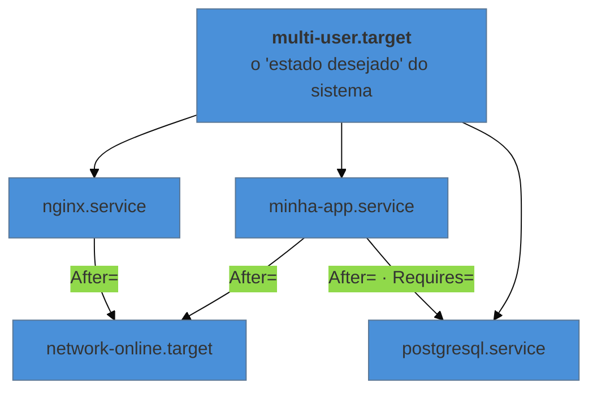

# systemd — o modelo de unidades

> [!abstract] TL;DR
> O `systemd` é o PID 1 da máquina, e a ideia central dele não é "iniciar programas na ordem": é **declarar objetos e deixar que ele resolva a ordem sozinho**. Esses objetos são as **unidades** — serviço, socket, timer, ponto de montagem, alvo —, e a relação entre elas é declarada, não sequenciada. Duas distinções resolvem a maior parte da confusão de quem vem do init antigo: `start` não é `enable` (uma age agora, a outra no próximo boot), e `Wants=` não é `After=` (uma é dependência, a outra é ordem — e elas são independentes).

---

## O serviço que sumiu depois do reboot

Você instala a aplicação, ajusta a configuração, sobe com `systemctl start minha-app` e confere: está no ar. Reinicia a máquina por outro motivo qualquer, e ela não volta.

Nada quebrou. Você só executou a metade que age **agora** e não executou a que age **no próximo boot**. São dois verbos diferentes para duas perguntas diferentes, e confundi-los é o erro número um de quem chega ao `systemd`:

```bash
systemctl start minha-app     # sobe agora, nesta sessão da máquina
systemctl enable minha-app    # passa a subir no boot, de agora em diante
systemctl enable --now minha-app   # as duas coisas
```

E o verbo que responde qual dos dois está valendo:

```bash
systemctl is-active minha-app    # está rodando agora?
systemctl is-enabled minha-app   # vai subir no próximo boot?
systemctl status minha-app       # as duas respostas, mais as últimas linhas de log
```

Essa separação não é capricho de sintaxe: ela existe porque as duas perguntas são de fato independentes. Um serviço pode estar rodando e não habilitado (subiu à mão, some no reboot), ou habilitado e parado (vai voltar sozinho no próximo boot, mesmo você o tendo derrubado agora).

---

## A virada: declarar em vez de sequenciar

O init tradicional era uma sequência de scripts numerados executados em ordem. Isso tem duas consequências ruins: nada roda em paralelo, e a ordem é uma decisão sua, gravada num nome de arquivo, que ninguém revisa.

O `systemd` inverte. Você **declara objetos** e as relações entre eles; ele calcula o grafo e executa o que puder ao mesmo tempo.



Quem já leu o galho de Kubernetes vai reconhecer a forma: **declara-se o estado desejado, e um supervisor o mantém**. É a mesma família de ideia do loop de reconciliação — em escala de uma máquina, e sem a parte distribuída.

### As unidades que importam

| Tipo | Para quê |
|---|---|
| `.service` | um processo supervisionado — o caso mais comum |
| `.socket` | uma porta ou socket que, ao receber conexão, **inicia** o serviço correspondente |
| `.timer` | agendamento — a alternativa moderna ao cron (nota 09) |
| `.mount` / `.automount` | pontos de montagem, gerados a partir do `/etc/fstab` |
| `.target` | um agrupamento, usado como marco de sincronização |
| `.path` | dispara algo quando um arquivo aparece ou muda |

O `.target` merece explicação porque não tem equivalente óbvio: ele não faz nada sozinho. É um **ponto de encontro** — dizer que seu serviço vem "depois de `network-online.target`" é mais robusto do que nomear um serviço de rede específico, porque a distribuição pode trocar a implementação sem quebrar a sua declaração.

E onde as unidades moram, em ordem de precedência:

| Lugar | Quem escreve |
|---|---|
| `/usr/lib/systemd/system/` | a distribuição e os pacotes — **não editar** |
| `/etc/systemd/system/` | **você**. Sobrepõe o de cima |
| `/run/systemd/system/` | tempo de execução, some no boot |

```bash
systemctl cat minha-app     # a unidade efetiva, com as sobreposições aplicadas
systemctl edit minha-app    # cria um override em /etc/, sem tocar no arquivo do pacote
```

O `systemctl edit` é a forma correta de ajustar uma unidade que veio de pacote: ele cria um arquivo de sobreposição, e a atualização do pacote não descarta a sua alteração. Editar direto o arquivo em `/usr/lib` funciona até o próximo `apt upgrade`.

---

> [!tip] Vídeo — o modelo e um arquivo de unidade real, lado a lado
> [**systemd on Linux 1: Intro and Unit Files**](https://www.youtube.com/watch?v=N1vgvhiyq0E) (tutoriaLinux, ~14 min, EN) cobre a mesma virada desta seção — o init que virou gerenciador de objetos declarados — e depois faz o que texto nenhum substitui: abre a unidade do **nginx numa máquina real** e a lê linha a linha. O trecho mais instrutivo está em [10:54], e explica um comportamento que confunde quem só leu a teoria: o nginx precisa de porta privilegiada (abaixo de 1024), o que exige root, então ele **inicia com privilégio, toma a porta, e cria processos filhos sem privilégio** — o que amarra esta nota tanto à nota 04 (identidade e privilégio) quanto ao galho de Nginx, cuja arquitetura mestre/trabalhador é exatamente isso. Ele também mostra que `Requires=` pode apontar para um **caminho de sistema de arquivos**, não só para outro serviço. **O que ele não cobre:** a distinção `Requires=` × `After=` com a profundidade desta nota, ativação por socket, e o `systemctl edit` como forma correta de sobrepor unidade de pacote.

## Dependência e ordem são coisas separadas

Esta é a segunda distinção que resolve confusão, e é sutil o bastante para escapar por anos.

| Diretiva | Significa |
|---|---|
| `Requires=` | **dependência forte** — se aquilo falhar ou parar, este também para |
| `Wants=` | **dependência fraca** — tente iniciar aquilo; se falhar, siga assim mesmo |
| `After=` | **ordem** — se os dois forem iniciar, este vem depois |
| `Before=` | ordem, no sentido inverso |
| `BindsTo=` | como `Requires=`, e ainda mais forte: acompanha o estado do outro |

O ponto que quase todo mundo erra: **`Requires=` não implica ordem**. Declarar apenas `Requires=postgresql.service` diz "o Postgres precisa estar ativo", e o `systemd` pode iniciar os dois **ao mesmo tempo** — sua aplicação sobe, tenta conectar, não encontra ninguém, e morre. A declaração correta quase sempre usa as duas diretivas juntas:

```ini
Requires=postgresql.service
After=postgresql.service
```

> [!warning] "Iniciado" não é "pronto"
> Mesmo com `After=`, o `systemd` só garante que a unidade anterior **chegou ao estado ativo** — não que a aplicação lá dentro terminou de subir e já aceita conexão. Para um banco, "ativo" pode significar "o processo existe", com a porta ainda fechada. É exatamente o mesmo problema que o `depends_on` do Compose tem, e a solução também é a mesma: ou a unidade declara `Type=notify` e a aplicação avisa quando de fato está pronta, ou a sua aplicação tem que **tolerar o banco indisponível e tentar de novo**. A segunda é mais robusta, porque vale também quando o banco cai depois de tudo já estar no ar.

Para ver o grafo resolvido, em vez de deduzi-lo do arquivo:

```bash
systemctl list-dependencies minha-app
systemctl list-dependencies --reverse minha-app   # quem depende de mim
systemd-analyze critical-chain minha-app          # a cadeia que determinou o tempo de boot
```

---

## Socket activation: a unidade que quase ninguém conhece

Vale conhecer o `.socket` porque ele resolve elegantemente o problema de ordem que a seção anterior descreve.

O `systemd` abre a porta **ele mesmo**, antes de o serviço existir. Quando a primeira conexão chega, ele inicia o serviço e entrega o descritor já aberto — e, pelo que a nota 03 estabeleceu, o processo simplesmente herda um descritor e não precisa saber quem o abriu.

Duas consequências práticas: o serviço pode subir **sob demanda**, em vez de ocupar memória o tempo todo; e a ordem de inicialização deixa de importar, porque o cliente que conectar antes do serviço estar pronto fica esperando na fila do socket em vez de receber conexão recusada. É assim que o `docker.socket` funciona na maioria das distribuições.

---

## O básico de operação, e o que cada verbo faz

```bash
systemctl start | stop | restart | reload | status <unidade>
systemctl reload-or-restart <unidade>     # recarrega se a unidade souber; senão reinicia
systemctl daemon-reload                   # releia os ARQUIVOS de unidade — depois de editá-los
systemctl list-units --type=service --state=running
systemctl list-unit-files --state=enabled
systemctl --failed                        # o primeiro comando ao chegar numa máquina com problema
```

Duas distinções que economizam tempo:

**`reload` não é `restart`.** O `reload` pede à aplicação que releia a configuração sem derrubar o processo — mantendo conexões abertas —, e só existe se a unidade declarar como fazê-lo. É o mesmo mecanismo que o galho de Nginx trata como recarga graciosa.

**`daemon-reload` é sobre o `systemd`, não sobre o seu serviço.** Ele faz o `systemd` reler os arquivos `.service` do disco. Editar a unidade e reiniciar o serviço sem `daemon-reload` reinicia com a definição **antiga** — e é a origem clássica do "eu mudei e não mudou nada".

> [!info] O usuário também tem um systemd
> Além do gerenciador do sistema, existe uma instância por usuário: `systemctl --user`, com unidades em `~/.config/systemd/user/`. É onde faz sentido colocar coisas pessoais que não precisam de privilégio — sincronização, agentes, tarefas de desenvolvimento. Uma pegadinha vale saber: por padrão, essas unidades param quando a sua última sessão encerra, salvo se você habilitar *lingering* (`loginctl enable-linger`).

---

## Armadilhas comuns

> [!warning] Editar o arquivo do pacote em `/usr/lib/systemd/system/`
> **O que acontece:** funciona, e some na próxima atualização do pacote. **Por quê:** aquele diretório pertence ao gerenciador de pacotes. **Como evitar:** `systemctl edit <unidade>` para sobrepor apenas o que muda, ou copie a unidade para `/etc/systemd/system/` se for substituir por inteiro. Confira o resultado com `systemctl cat`.

> [!warning] Editar a unidade e esquecer o `daemon-reload`
> **O que acontece:** o `restart` roda sem erro e o comportamento não muda. **Por quê:** o `systemd` está usando a definição que carregou antes. **Como evitar:** `daemon-reload` sempre depois de mexer em arquivo de unidade. O `status` avisa com uma linha sobre a unidade ter mudado no disco — vale ler.

> [!warning] Usar `Requires=` sem `After=`
> **O que acontece:** falha intermitente no boot, e só no boot: às vezes sobe, às vezes não. **Por quê:** dependência não impõe ordem, e o resultado passa a depender de quem ficou pronto primeiro. **Como evitar:** declare as duas. E lembre que nem `After=` garante *prontidão* — a aplicação precisa tolerar a indisponibilidade.

> [!warning] `enable` sem `start` (e vice-versa)
> **O que acontece:** o serviço não sobe agora, ou não volta depois do reboot. **Por quê:** são verbos independentes. **Como evitar:** `enable --now` quando você quer as duas coisas, que é o caso quase sempre. E confirme com `is-active` e `is-enabled`.

---

## Como explicar em inglês

"systemd is PID 1, and its core idea isn't running scripts in order — it's declaring units and letting it resolve the dependency graph, starting in parallel what it can. Two distinctions clear up most of the confusion: `start` affects the current boot while `enable` affects the next one, and `Requires=` expresses a dependency while `After=` expresses ordering — they're independent, so declaring one without the other is a classic source of boot-time race conditions. And even `After=` only guarantees the unit became active, not that the application inside is ready to accept connections."

| PT | EN |
|---|---|
| unidade | unit |
| habilitar / desabilitar | to enable / disable |
| dependência forte / fraca | hard / soft dependency |
| ordem de inicialização | startup ordering |
| sobreposição (override) | drop-in override |
| recarga graciosa | graceful reload |
| ativação por socket | socket activation |
| alvo (marco de sincronização) | target |

---

## O que vem a seguir

O modelo está posto, mas ainda não escrevemos uma unidade. E é ao escrevê-la que aparecem as decisões que decidem se o serviço se comporta bem: sob qual usuário ele roda, com qual diretório de trabalho e ambiente — os itens do contrato da nota 01 —, o que fazer quando ele cai, e o que acontece se ele ignorar o `SIGTERM`, que é a mesma discussão de PID 1 que o galho de Docker faz do lado do container.

- **07 — Escrever um serviço que se comporta** — a unidade comentada, campo a campo.
- [[03-Dominios/Tecnologia/Infraestrutura/Linux/05 - O processo como objeto administrável|05 — O processo como objeto administrável]] — de onde vem a conclusão de que o que precisa sobreviver a você não pertence à sua sessão.
- [[03-Dominios/Engenharia/Operação/index|Engenharia/Operação]] — o ofício de operar serviços em produção; aqui é o modelo da máquina, lá é a disciplina.

## Fontes

- **freedesktop.org** — [*systemd.unit(5)*](https://www.freedesktop.org/software/systemd/man/systemd.unit.html) — as diretivas comuns a todas as unidades, incluindo `Requires=`, `Wants=`, `After=` e a ordem de precedência dos diretórios.
- **freedesktop.org** — [*systemd.target(5)*](https://www.freedesktop.org/software/systemd/man/systemd.target.html) — o papel de alvo como marco de sincronização.
- **freedesktop.org** — [*systemd.socket(5)*](https://www.freedesktop.org/software/systemd/man/systemd.socket.html) — ativação por socket e a passagem de descritores ao serviço.
- **freedesktop.org** — [*systemctl(1)*](https://www.freedesktop.org/software/systemd/man/systemctl.html) — a diferença entre os verbos, incluindo `enable --now` e `daemon-reload`.
- **Lennart Poettering** — [*systemd for Administrators*](https://0pointer.de/blog/projects/systemd-for-admins-1.html) — a série do autor explicando as decisões de projeto, incluindo por que paralelizar e por que ativação por socket resolve ordenação.
