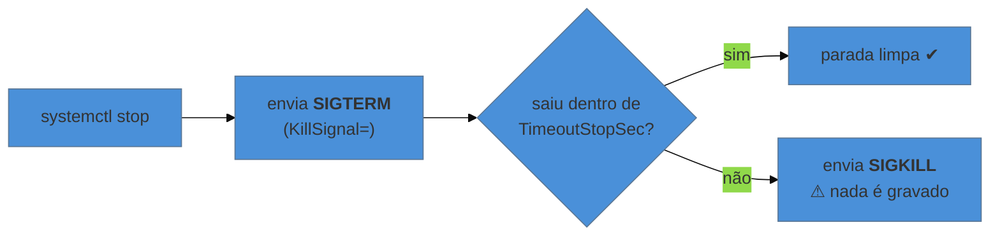

# Escrever um serviço que se comporta

> [!abstract] TL;DR
> Uma unidade `.service` é, na prática, a **declaração do contrato da nota 01**: sob qual identidade o processo roda, com qual diretório de trabalho, qual ambiente, quais limites — e, além disso, o que fazer quando ele cai. Os campos que separam um serviço que se comporta de um que dá trabalho são poucos: `Type=` (que decide quando o `systemd` considera a partida concluída), `Restart=` com sua janela de desistência, `User=`, `WorkingDirectory=`, e o par `TimeoutStopSec=` / `KillSignal=`, que é a mesma discussão de encerramento gracioso que o galho de Docker faz do lado do container — aqui do lado do host.

---

## Funciona no terminal, morre como serviço

Você roda o binário à mão e ele sobe. Escreve a unidade, dá `start`, e ele morre em dois segundos. O log diz pouco — ou diz que não achou um arquivo que está claramente lá.

A essa altura do galho, a causa é previsível: **o processo iniciado pelo `systemd` recebeu um contrato diferente** do que recebeu no seu terminal. Diretório de trabalho `/` em vez da pasta do projeto. Ambiente vazio, sem as variáveis que o seu shell exporta. Um usuário sem permissão no diretório de dados. E nenhum terminal ligado à saída.

Escrever a unidade é, portanto, **preencher o contrato explicitamente** em vez de herdá-lo por acidente.

---

## A unidade mínima, comentada

```ini
[Unit]
Description=API de pedidos
Documentation=https://wiki.interna/pedidos
After=network-online.target postgresql.service
Wants=network-online.target
Requires=postgresql.service

[Service]
Type=notify
User=pedidos
Group=pedidos
WorkingDirectory=/opt/pedidos
Environment=NODE_ENV=production
EnvironmentFile=-/etc/pedidos/env
ExecStart=/usr/bin/node /opt/pedidos/server.js
ExecReload=/bin/kill -HUP $MAINPID
Restart=on-failure
RestartSec=5s
TimeoutStopSec=30s

[Install]
WantedBy=multi-user.target
```

As três seções respondem perguntas distintas: **`[Unit]`** é metadado e relação com outras unidades; **`[Service]`** é como o processo roda; **`[Install]`** é o que acontece no `enable` — sem ela, `systemctl enable` não tem o que fazer, e é a causa de "habilitei e não subiu no boot".

Dois detalhes de sintaxe que economizam tempo: o **hífen** em `EnvironmentFile=-/etc/...` significa "se o arquivo não existir, siga em frente" — sem ele, a ausência do arquivo impede a partida. E `$MAINPID` é substituído pelo PID do processo principal, o que torna o `ExecReload` genérico.

---

## `Type=`: quando o systemd considera que subiu

É o campo mais mal compreendido, e ele decide quando as unidades que dependem desta podem começar.

| `Type=` | O `systemd` considera pronto quando… | Use quando |
|---|---|---|
| `simple` | o processo é **executado** (padrão) | o programa fica em primeiro plano e não avisa nada |
| `exec` | o `execve` foi bem-sucedido | como `simple`, com detecção melhor de falha imediata |
| `notify` | a **aplicação avisa** que está pronta | ela suporta o protocolo `sd_notify` — a melhor opção |
| `forking` | o processo pai **sai** | daemons à moda antiga, que se desanexam sozinhos |
| `oneshot` | o processo **termina** | tarefa que roda e acaba (migração, ajuste no boot) |

O default `simple` tem uma consequência que explica boa parte das corridas de inicialização: o `systemd` considera a unidade ativa **no instante em que executa o binário**, antes de a aplicação ter aberto porta ou conectado a nada. Quem declarou `After=` sobre ela ganha ordem, e não ganha prontidão — exatamente a ressalva da nota 06.

`Type=notify` é a resposta correta, quando disponível: a aplicação chama `sd_notify(READY=1)` quando de fato está servindo, e aí "ativo" passa a significar o que todo mundo supunha que significasse.

> [!warning] `Type=forking` sem `PIDFile=`
> **O que acontece:** o `systemd` supervisiona o processo errado, e o `stop` não derruba o serviço de verdade. **Por quê:** com `forking`, o processo que ele executou sai, e é preciso dizer a ele qual é o processo real. **Como evitar:** prefira que a aplicação **fique em primeiro plano** e use `simple`/`notify` — hoje é o modo recomendado, e desanexar virou legado. Se não houver escolha, declare `PIDFile=`.

---

> [!tip] Vídeo — a unidade escrita do zero, em sete minutos
> [**Creating systemd Service Files**](https://www.youtube.com/watch?v=fYQBvjYQ63U) (DevDungeon, ~7 min, EN) faz exatamente o percurso desta nota, sem rodeios: escreve o arquivo, ativa, confere com `systemctl status` — e mostra o que "ativo" parece na tela, com o círculo verde e o PID. Dois detalhes úteis aparecem: `RuntimeMaxSec=`, que encerra o serviço ao passar de um tempo máximo (a contraparte do `TimeoutStopSec` para trabalho que **não deveria** durar), e a explicação de por que a seção `[Install]` com `WantedBy=multi-user.target` é o que faz o `enable` ter efeito — a armadilha listada mais abaixo nesta nota. É a melhor porta de entrada para quem nunca escreveu uma unidade. **O que ele não cobre:** `Type=` e a diferença entre iniciado e pronto, a política de reinício com limite de tentativas, o contrato de parada, e as diretivas de endurecimento.

## `Restart=`: o supervisor, e a janela que faz ele desistir

```ini
Restart=on-failure     # reinicia se sair com erro ou sinal; NÃO reinicia se sair com 0
RestartSec=5s          # espera antes de tentar de novo
```

| Valor | Reinicia quando |
|---|---|
| `no` | nunca (padrão) |
| `on-failure` | saída diferente de zero, sinal, timeout — **o mais usado** |
| `on-abnormal` | sinal e timeout, mas não código de saída |
| `always` | sempre, inclusive após saída limpa |

A escolha entre `on-failure` e `always` diz o que você considera normal: com `on-failure`, um `exit 0` significa "terminei de propósito" e o `systemd` respeita; com `always`, nem isso interrompe o ciclo.

E o detalhe que surpreende na primeira vez: **existe um limite de tentativas**. Por padrão, cinco partidas em dez segundos fazem o `systemd` desistir e deixar a unidade em `failed`, para não entrar em laço infinito. Um serviço que morre instantaneamente atinge isso em segundos.

```ini
StartLimitIntervalSec=60
StartLimitBurst=5
```

```bash
systemctl reset-failed minha-app   # limpa o contador depois de corrigir a causa
```

Vale saber para não interpretar mal: **"parou de tentar" não é o mesmo que "o erro sumiu"**. É proteção, e o achado continua sendo por que ele caiu cinco vezes.

---

## Identidade, ambiente e limites: preenchendo o contrato

```ini
User=pedidos
Group=pedidos
WorkingDirectory=/opt/pedidos
Environment=NODE_ENV=production
EnvironmentFile=-/etc/pedidos/env
LimitNOFILE=65535
```

Cada linha aqui é um item da nota 01, agora declarado em vez de herdado:

- **`User=`** — o serviço não deve rodar como root. É a mesma regra do `USER` no Dockerfile.
- **`WorkingDirectory=`** — resolve o caso da nota 01, em que o caminho relativo apontava para `/`.
- **`Environment=` e `EnvironmentFile=`** — o serviço **não vê** o ambiente do seu shell. Tudo o que ele precisa tem de ser declarado. Segredo vai em arquivo com permissão restrita, nunca em `Environment=` na unidade, que é legível por qualquer um via `systemctl cat`.
- **`LimitNOFILE=`** — o teto de descritores da nota 03. Em serviço com muitas conexões, o padrão é baixo demais, e o sintoma é `Too many open files`.

E vale conhecer o endurecimento que o `systemd` oferece de graça, que é a diferença entre um serviço comum e um bem configurado:

```ini
NoNewPrivileges=true          # o processo não consegue ganhar privilégio (bloqueia setuid)
PrivateTmp=true               # /tmp próprio, isolado do resto da máquina
ProtectSystem=strict          # o sistema de arquivos fica somente-leitura para ele
ProtectHome=true              # /home invisível
ReadWritePaths=/var/lib/pedidos   # as exceções explícitas de escrita
```

```bash
systemd-analyze security minha-app   # nota de exposição da unidade, campo a campo
```

Esse último comando é o mais subestimado do galho: ele lista o que a unidade **não** está protegendo e sugere as diretivas. Vale rodar em qualquer serviço próprio.

---

## Parada: o mesmo contrato de sinal do container



```ini
KillSignal=SIGTERM        # o padrão
TimeoutStopSec=30s        # quanto esperar antes do SIGKILL
KillMode=control-group    # o padrão: encerra TODOS os processos da unidade
```

Três coisas a reter, e as três reaparecem no galho de Docker do outro lado da fronteira:

**A janela existe e é curta.** Se a aplicação leva mais que `TimeoutStopSec` para encerrar — drenar conexões, terminar requisições em voo, gravar estado —, ela é morta no meio. Serviço com trabalho longo precisa de janela maior **declarada**, não de esperança.

**`KillMode=control-group` é o padrão, e é o comportamento certo.** O `systemd` encerra o **cgroup inteiro** da unidade, o que resolve o problema que a nota 05 descreveu: processos filhos que sobreviveriam ao pai são encerrados junto. É supervisão de verdade, não sinal para um PID.

**Se a aplicação ignora `SIGTERM`, o achado é a aplicação.** Aumentar o timeout e aceitar o `SIGKILL` de todo `stop` é conviver com perda de dados a cada reinício. É a mesma conclusão da nota 08 do galho de Docker — e vale registrar que o problema é idêntico nos dois contextos porque o mecanismo é o mesmo: sinal e um prazo.

---

## Um exemplo trabalhado: da unidade que não sobe ao serviço estável

```bash
systemctl status minha-app          # 1. estado, PID, e as últimas linhas de log
journalctl -u minha-app -n 50 --no-pager    # 2. o log de verdade
journalctl -u minha-app -b          # 3. só desde o último boot
systemctl cat minha-app             # 4. a unidade EFETIVA, com sobreposições
systemd-analyze verify minha-app.service    # 5. erros de sintaxe e referências quebradas
```

E, quando o serviço sobe mas se comporta diferente do esperado, a verificação decisiva é comparar o contrato **real** com o que você achou que declarou:

```bash
systemctl show minha-app -p User -p WorkingDirectory -p Environment -p LimitNOFILE
MAINPID=$(systemctl show -p MainPID --value minha-app)
cat /proc/$MAINPID/environ | tr '\0' '\n'
ls -l /proc/$MAINPID/cwd
```

As duas últimas linhas são as da nota 01, e continuam sendo a fonte da verdade: `systemctl show` diz o que o `systemd` pretendia entregar; `/proc` diz o que o processo de fato recebeu.

---

## Armadilhas comuns

> [!warning] Esperar que o serviço enxergue o seu ambiente
> **O que acontece:** a variável funciona no terminal e "não existe" para o serviço. **Por quê:** o processo herda o ambiente de quem o criou, e quem o criou foi o `systemd`, não o seu shell. **Como evitar:** declare com `Environment=` ou `EnvironmentFile=`. Para conferir, leia `/proc/<pid>/environ`, não o seu shell.

> [!warning] Segredo em `Environment=` dentro da unidade
> **O que acontece:** a senha aparece para qualquer usuário via `systemctl cat` ou `systemctl show`. **Por quê:** o arquivo de unidade é legível por todos. **Como evitar:** `EnvironmentFile=` apontando para arquivo com dono do serviço e permissão `600`. Para segredo de verdade, gerenciador de segredos — a mesma conclusão da nota 25 do galho de Controle de Versão.

> [!warning] Omitir a seção `[Install]`
> **O que acontece:** `systemctl enable` reclama, ou não produz efeito, e o serviço não sobe no boot. **Por quê:** é `WantedBy=` que diz a que alvo a unidade se pendura ao ser habilitada. **Como evitar:** `WantedBy=multi-user.target` cobre o caso comum de serviço de servidor.

> [!warning] Aumentar `TimeoutStopSec` para contornar `SIGKILL`
> **O que acontece:** o `stop` fica lento e o problema continua — agora demorando mais para acontecer. **Por quê:** a causa é a aplicação não encerrar ao receber `SIGTERM`. **Como evitar:** trate `SIGTERM` na aplicação. Janela maior é legítima para trabalho longo declarado, não como remédio para sinal ignorado.

---

## Como explicar em inglês

"A `.service` unit is really a declaration of the process contract: which user it runs as, its working directory, its environment, its limits — plus what to do when it exits. The field people get wrong most often is `Type=`: with the default `simple`, systemd marks the unit active the moment it execs the binary, so anything ordered `After=` gets ordering but not readiness; `Type=notify` fixes that by letting the app signal when it's actually serving. And stopping is a contract too — SIGTERM, then a timeout, then SIGKILL — which is the same graceful shutdown discussion as containers, because the mechanism is identical."

| PT | EN |
|---|---|
| arquivo de unidade | unit file |
| política de reinício | restart policy |
| limite de tentativas | start rate limit |
| prontidão | readiness |
| encerramento gracioso | graceful shutdown |
| endurecimento (do serviço) | service hardening |
| variável de ambiente declarada | declared environment variable |

---

## O que vem a seguir

O serviço está declarado, supervisionado e encerra direito. Falta o que ele fala: os descritores 1 e 2 dele estão ligados ao `journald` desde a nota 03, e ninguém explicou ainda o que isso significa na prática — como consultar, o que é guardado, por quanto tempo, e por que o log do `systemd` é binário quando `/var/log` sempre foi texto.

- **08 — Logs: journald e o que veio antes** — consultar, filtrar, reter.
- [[03-Dominios/Tecnologia/Infraestrutura/Linux/06 - systemd - o modelo de unidades|06 — systemd: o modelo de unidades]] — o modelo que esta nota preenche.
- [[03-Dominios/Tecnologia/Infraestrutura/Linux/01 - O que o Linux entrega a um processo|01 — O contrato]] — cada campo de `[Service]` é um item dele.

## Fontes

- **freedesktop.org** — [*systemd.service(5)*](https://www.freedesktop.org/software/systemd/man/systemd.service.html) — `Type=`, `Restart=`, `ExecStart=` e o ciclo de parada com `TimeoutStopSec` e `KillMode`.
- **freedesktop.org** — [*systemd.exec(5)*](https://www.freedesktop.org/software/systemd/man/systemd.exec.html) — todo o contrato de execução: usuário, diretório, ambiente, limites e as diretivas de endurecimento.
- **freedesktop.org** — [*systemd.kill(5)*](https://www.freedesktop.org/software/systemd/man/systemd.kill.html) — `KillMode` e por que o padrão encerra o cgroup inteiro.
- **freedesktop.org** — [*sd_notify(3)*](https://www.freedesktop.org/software/systemd/man/sd_notify.html) — o protocolo de prontidão usado por `Type=notify`.
- **freedesktop.org** — [*systemd-analyze(1)*](https://www.freedesktop.org/software/systemd/man/systemd-analyze.html) — `verify`, `security` e `critical-chain`.
