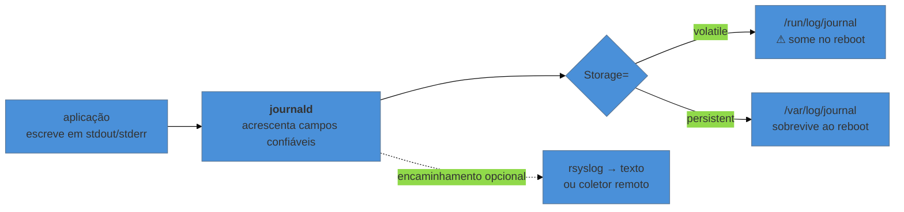

# Logs — journald e o que veio antes

> [!abstract] TL;DR
> A aplicação não "configura log" para aparecer no `journalctl`: ela escreve nos descritores 1 e 2, e o `systemd` conectou os dois ao `journald` — o mecanismo da nota 03, agora do lado do coletor. O journal é **binário** porque não guarda linhas e sim **registros com campos**: unidade, PID, UID, prioridade, identificador de boot. É isso que permite filtrar por unidade e por boot sem `grep`. E a armadilha que apaga histórico de incidente é de configuração padrão: em várias distribuições o journal é **volátil**, e some inteiro no reinício.

---

## O log que não existe mais justamente quando você precisa

A máquina reiniciou sozinha às três da manhã. Você chega, quer entender o que aconteceu antes do reinício, e roda o comando certo:

```bash
journalctl -b -1        # o boot anterior
# Failed to look up boot -1: Cannot assign requested address
```

Não há boot anterior. Não porque a máquina nunca reiniciou, mas porque **o journal daquela sessão foi apagado quando ela reiniciou**. Em várias distribuições o armazenamento padrão é volátil: o journal vive em `/run/log/journal`, que é memória.

A correção é uma linha, e ela precisa estar feita **antes** do incidente:

```bash
sudo mkdir -p /var/log/journal
sudo systemd-tmpfiles --create --prefix /var/log/journal
sudo systemctl restart systemd-journald
journalctl --list-boots      # a partir daqui, os boots anteriores ficam
```

Vale conferir isso em qualquer máquina que você assuma. É o tipo de coisa que só se descobre no dia em que faz falta.

---

## Por que binário, se `/var/log` sempre foi texto

A pergunta é justa, e a resposta é a única justificativa aceitável: o journal **não guarda linhas de texto** — guarda registros com campos.

```bash
journalctl -u nginx -n 1 -o verbose
```

A saída mostra, para uma única mensagem, algo assim:

```text
MESSAGE=connection refused upstream
PRIORITY=3
_SYSTEMD_UNIT=nginx.service
_PID=1432
_UID=33
_COMM=nginx
_BOOT_ID=9f2c...
_HOSTNAME=web-01
```

Os campos com sublinhado inicial são **confiáveis**: quem os preencheu foi o `journald`, a partir do que o kernel informou sobre quem enviou a mensagem — a aplicação não consegue forjá-los. Essa é a diferença estrutural em relação a um arquivo de texto, onde qualquer processo pode escrever qualquer coisa, inclusive se passando por outro.

E é o que torna as consultas do dia a dia baratas: filtrar por unidade não é procurar um padrão de texto, é comparar um campo indexado.

```bash
journalctl _PID=1432
journalctl _UID=33
journalctl -o json-pretty | head -40     # a estrutura completa, para levar a outro lugar
```

> [!info] Binário não significa proprietário
> O formato é documentado, e o próprio `journalctl` exporta para JSON, o que resolve a preocupação legítima de aprisionamento. O preço real do binário é outro: **é preciso a ferramenta para ler**. Num sistema quebrado, sem `journalctl` disponível, um arquivo de texto ainda seria legível com `cat`. Por isso máquinas críticas frequentemente mantêm também um `rsyslog` escrevendo texto — os dois convivem, e não é redundância inútil.

---

## Consultar de verdade

O comando é um só, e o que muda são os recortes. Estes cobrem quase tudo:

```bash
journalctl -u minha-app              # só uma unidade
journalctl -u minha-app -f           # acompanhar ao vivo
journalctl -u minha-app -n 100       # as últimas 100 linhas
journalctl -u minha-app -b           # só desde o último boot
journalctl -u minha-app -b -1        # o boot anterior
journalctl --since "2026-08-16 03:00" --until "03:30"
journalctl -p err -b                 # só erro e acima, neste boot
journalctl -k                        # mensagens do kernel (o antigo dmesg)
journalctl -u minha-app --no-pager   # sem paginador — para script e para pipe
```

Duas opções que economizam tempo e são pouco usadas:

```bash
journalctl -u minha-app -o short-precise   # timestamp com microssegundos
journalctl -u minha-app --utc              # em UTC, para correlacionar com outra máquina
```

A segunda importa mais do que parece: correlacionar log de duas máquinas em fusos diferentes durante um incidente é uma fonte silenciosa de conclusão errada.

### As prioridades

O campo `PRIORITY` segue a escala do syslog, de 0 a 7:

| Nº | Nome | Uso |
|---|---|---|
| 0-2 | emerg, alert, crit | sistema comprometido |
| 3 | **err** | erro — o filtro mais útil |
| 4 | warning | atenção |
| 5-6 | notice, info | operação normal |
| 7 | debug | detalhe |

`journalctl -p err -b` é o comando que se roda primeiro ao chegar numa máquina com problema, junto com `systemctl --failed`.

---

## O que continua em `/var/log`

O journal não substituiu tudo, e supor o contrário faz perder rastro:

| Ainda em texto | Por quê |
|---|---|
| `/var/log/nginx/access.log` | a aplicação escreve **no próprio arquivo**, não em stdout |
| `/var/log/dpkg.log`, `/var/log/apt/` | o gerenciador de pacotes tem log próprio |
| `/var/log/auth.log`, `/var/log/secure` | mantidos por `rsyslog`, quando instalado |
| `/var/log/wtmp`, `btmp` | registros de login, em formato binário próprio |

A regra prática: **o journal tem o que passou por `stdout`/`stderr` de uma unidade ou pelo syslog; o resto está em arquivo.** Quando o log procurado não aparece no `journalctl`, a pergunta certa não é "por que sumiu", é "quem escreve isso, e para onde".

E é aqui que a nota 03 fecha o círculo em duas direções. Primeiro: uma aplicação que grava em arquivo próprio não aparece no journal porque nunca escreveu no descritor 1. Segundo: se ela escreve no descritor 1 e **a saída aparece atrasada em blocos**, a causa é a bufferização — a biblioteca padrão detecta que do outro lado não há terminal e passa a acumular. A correção é a mesma: desligar o buffer na aplicação, ou `stdbuf -oL` na linha de `ExecStart=`.

---

## Retenção: o journal também enche o disco

```bash
journalctl --disk-usage
journalctl --vacuum-size=500M      # reduz agora, para este tamanho
journalctl --vacuum-time=30d       # descarta o que for mais antigo que isso
```

E a configuração persistente, em `/etc/systemd/journald.conf`:

```ini
[Journal]
Storage=persistent
SystemMaxUse=1G
MaxRetentionSec=30day
```



O padrão de tamanho é uma fração do sistema de arquivos, o que costuma bastar — mas em máquina com `/var` pequeno ou aplicação verborrágica, o journal vira parte do problema de disco cheio da nota 02. `journalctl --disk-usage` entra na investigação daquela nota.

---

## Armadilhas comuns

> [!warning] Descobrir que o journal era volátil depois do incidente
> **O que acontece:** a máquina reinicia, você quer o log de antes, e ele não existe.
> **Por quê:** sem `/var/log/journal`, o armazenamento é em memória.
> **Como evitar:** verifique com `journalctl --list-boots` em toda máquina que você assumir. Se listar só o boot atual, o journal é volátil — e o momento de corrigir é agora, não depois.

> [!warning] `journalctl | grep` sem `--no-pager` em script
> **O que acontece:** o comando trava esperando interação, ou o script pendura.
> **Por quê:** o `journalctl` abre paginador quando detecta terminal.
> **Como evitar:** `--no-pager` sempre em script. E prefira filtrar com as opções nativas — `-u`, `-p`, `--since` — que usam índice, em vez de despejar tudo no `grep`.

> [!warning] Concluir que a aplicação não loga
> **O que acontece:** `journalctl -u app` volta vazio, e a conclusão é que falta configurar log.
> **Por quê:** ou a aplicação escreve num arquivo próprio, ou está bufferizando e ainda não descarregou.
> **Como evitar:** confira para onde os descritores apontam — `ls -l /proc/<pid>/fd/1` — antes de mexer em configuração de log.

> [!warning] Confiar no relógio sem conferir o fuso
> **O que acontece:** você correlaciona o log de duas máquinas e conclui a ordem errada dos eventos.
> **Por quê:** o `journalctl` mostra no fuso local de cada máquina.
> **Como evitar:** `--utc` nos dois lados durante investigação. E confirme a sincronização de horário com `timedatectl` — relógio fora de hora torna todo log inútil.

---

## Como explicar em inglês

"An application doesn't configure anything to show up in `journalctl` — it writes to descriptors 1 and 2, and systemd wired those to journald. The journal is binary because it stores structured records, not lines: fields like the unit, PID, UID and boot ID are filled in by journald from what the kernel reports, so the sender can't forge them. That's what makes filtering by unit or by boot an indexed lookup instead of a grep. The one default worth checking on any machine you inherit is storage: if there's no `/var/log/journal`, logs are volatile and vanish on reboot."

| PT | EN |
|---|---|
| registro estruturado | structured record |
| campo confiável | trusted field |
| armazenamento volátil / persistente | volatile / persistent storage |
| retenção | retention |
| prioridade (nível de log) | log priority / severity |
| paginador | pager |
| bufferização | buffering |

---

## O que vem a seguir

O log resolve o que aconteceu **quando algo rodou**. Falta quem decide **quando as coisas rodam sem ninguém pedir**: backup, limpeza, sincronização, renovação de certificado. Historicamente isso é o cron; no sistema moderno, são os timers do `systemd` — que, entre outras vantagens, mandam a saída direto para o journal desta nota, resolvendo o problema mais antigo do cron, que é o log que não existe.

- **09 — Agendamento: cron e timers** — e por que o timer venceu.
- [[03-Dominios/Tecnologia/Infraestrutura/Linux/03 - Tudo é arquivo - descritores e redirecionamento|03 — Tudo é arquivo]] — o mecanismo que liga a aplicação ao journald.
- [[03-Dominios/Engenharia/Operação/index|Engenharia/Operação]] — observabilidade como disciplina: agregação, retenção e o que alertar. Aqui é a máquina; lá é a prática.

## Fontes

- **freedesktop.org** — [*journalctl(1)*](https://www.freedesktop.org/software/systemd/man/journalctl.html) — todos os recortes usados aqui, incluindo `--list-boots`, `-p` e os formatos de saída.
- **freedesktop.org** — [*systemd.journal-fields(7)*](https://www.freedesktop.org/software/systemd/man/systemd.journal-fields.html) — a distinção entre campos do usuário e campos confiáveis preenchidos pelo `journald`.
- **freedesktop.org** — [*journald.conf(5)*](https://www.freedesktop.org/software/systemd/man/journald.conf.html) — `Storage=`, `SystemMaxUse=` e a política de retenção.
- **IETF** — [*RFC 5424 — The Syslog Protocol*](https://datatracker.ietf.org/doc/html/rfc5424) — a escala de severidade de 0 a 7 que o journal reaproveita.
