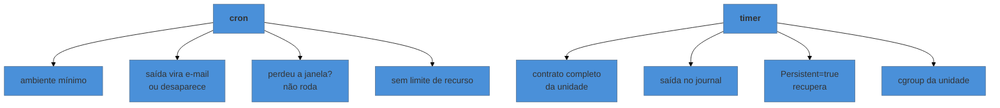

# Agendamento — cron e timers

> [!abstract] TL;DR
> O cron funciona há quarenta anos e falha sempre pelos mesmos três motivos: o **ambiente mínimo** que ele entrega (o script acha o binário no seu terminal e não acha lá), a **saída que vira e-mail que ninguém lê**, e o fato de que ele **não sabe que a máquina esteve desligada** na hora marcada. Os timers do `systemd` resolvem os três — a saída vai para o journal da nota 08, a execução é uma unidade com todo o contrato da nota 07, e `Persistent=true` recupera o que foi perdido. O preço é dois arquivos em vez de uma linha.

---

## O script que funciona quando você executa e falha às três da manhã

Você escreve o backup, testa à mão, funciona. Agenda no cron. No dia seguinte, nada foi feito — e não há erro em lugar nenhum.

```bash
0 3 * * * /opt/scripts/backup.sh
```

O script existe, tem permissão de execução, e o horário está certo. O que mudou foi o **contrato** com que ele rodou — de novo a nota 01, agora do lado do agendador.

Três diferenças explicam quase todos os casos:

**O `PATH` é mínimo.** O cron não carrega o seu `.bashrc` nem o `.profile`. O `PATH` que ele entrega costuma ser apenas `/usr/bin:/bin`. Se o script chama `docker`, `aws`, `node` ou qualquer coisa instalada fora disso, o comando "não existe".

**A saída não vai para lugar nenhum útil.** Por padrão, o que o job imprime é enviado por e-mail local ao dono da tarefa — em servidor sem MTA configurado, isso significa descartado. O erro aconteceu, foi relatado, e ninguém leu.

**O ambiente é praticamente vazio.** Sem `HOME` como você espera, sem variáveis de aplicação, sem as credenciais que o seu shell exporta.

A correção clássica é declarar tudo explicitamente e capturar a saída:

```bash
SHELL=/bin/bash
PATH=/usr/local/bin:/usr/bin:/bin
MAILTO=""

0 3 * * * /opt/scripts/backup.sh >> /var/log/backup.log 2>&1
```

Repare no `>> ... 2>&1`, na ordem que a nota 03 explicou — e note que isso é, no fundo, **reimplementar log à mão**, que é justamente o que a segunda metade desta nota torna desnecessário.

---

## Cron: o que ainda vale saber

```bash
crontab -e          # o crontab do seu usuário
crontab -l          # listar
sudo crontab -e -u www-data     # o de outro usuário
```

E os arquivos de sistema, que têm **um campo a mais** — o usuário sob o qual rodar:

```text
# /etc/cron.d/backup   (arquivo de sistema)
0 3 * * *  backup  /opt/scripts/backup.sh

# crontab de usuário: sem o campo de usuário
0 3 * * *  /opt/scripts/backup.sh
```

Confundir os dois formatos é erro comum: colar uma linha de sistema no crontab pessoal faz o cron interpretar o nome do usuário como o comando.

A sintaxe dos cinco campos:

```text
┌───── minuto (0-59)
│ ┌─── hora (0-23)
│ │ ┌─ dia do mês (1-31)
│ │ │ ┌─ mês (1-12)
│ │ │ │ ┌─ dia da semana (0-7, 0 e 7 = domingo)
* * * * *
```

`*/15` a cada quinze, `1-5` intervalo, `1,15` lista. E os atalhos `@daily`, `@hourly`, `@reboot`.

> [!warning] Dia do mês e dia da semana são um OU, não um E
> `0 3 1 * 1` **não** significa "no dia 1, se for segunda". Quando os dois campos estão preenchidos, o cron dispara se **qualquer um** casar — ou seja, todo dia 1 **e** toda segunda-feira. É contraintuitivo e está no comportamento padrão há décadas. Quando precisar da conjunção, deixe um dos campos como `*` e faça a verificação dentro do script.

---

## Timers: a mesma ideia como unidade

Um timer são dois arquivos: o que **faz** e o que **agenda**.

```ini
# /etc/systemd/system/backup.service
[Unit]
Description=Backup diário

[Service]
Type=oneshot
User=backup
WorkingDirectory=/opt/scripts
Environment=PATH=/usr/local/bin:/usr/bin:/bin
ExecStart=/opt/scripts/backup.sh
```

```ini
# /etc/systemd/system/backup.timer
[Unit]
Description=Dispara o backup diário

[Timer]
OnCalendar=*-*-* 03:00:00
Persistent=true
RandomizedDelaySec=5m

[Install]
WantedBy=timers.target
```

```bash
sudo systemctl daemon-reload
sudo systemctl enable --now backup.timer
systemctl list-timers                # próximas execuções, e quando foi a última
```

Repare no que veio de graça: o `.service` é uma unidade comum, então ele tem **todo o contrato da nota 07** — usuário, diretório de trabalho, ambiente, limites, endurecimento. O problema do `PATH` deixa de ser folclore e vira um campo declarado.

### As diretivas de agendamento

| Diretiva | Dispara |
|---|---|
| `OnCalendar=` | em horário absoluto — o equivalente ao cron |
| `OnBootSec=` | tanto tempo depois do boot |
| `OnUnitActiveSec=` | tanto tempo depois da última execução |
| `OnActiveSec=` | tanto tempo depois de o timer ser ativado |

E as três que resolvem problemas reais:

**`Persistent=true`** — se a máquina estava desligada na hora marcada, executa **assim que ligar**. É a resposta ao terceiro defeito do cron, e é decisiva em laptop e em máquina que não fica no ar o tempo todo.

**`RandomizedDelaySec=`** — espalha a execução dentro de uma janela. Quando cinquenta máquinas rodam o mesmo backup às três em ponto, elas batem no mesmo servidor no mesmo segundo; um atraso aleatório resolve sem coordenação.

**`AccuracySec=`** — a folga que o `systemd` pode usar para agrupar despertares e poupar energia. O padrão é um minuto, o que surpreende quem espera precisão de segundo; declare `AccuracySec=1s` se o horário exato importar.

A sintaxe do `OnCalendar` é mais legível que a do cron, e — melhor ainda — é **testável**:

```bash
systemd-analyze calendar "*-*-* 03:00:00"
systemd-analyze calendar "Mon *-*-* 09:00:00" --iterations=5
```

Isso mostra as próximas ocorrências. Não existe equivalente no cron, onde a única forma de conferir a expressão é esperar.

---

> [!tip] Vídeo — os dois arquivos, montados do zero
> [**Automate Your Tasks with systemd Timers**](https://www.youtube.com/watch?v=n6BuUgkZ5T0) (Learn Linux TV, ~33 min, EN) constrói o par `.service` + `.timer` do começo, com um exemplo pequeno e verificável. O ponto que ele demonstra e que mais confunde quem vem do cron aparece por volta de [19:39]: **o serviço fica desabilitado e parado de propósito** — quem se habilita é o **timer**, e é ele quem dispara o serviço na hora marcada. Ver `systemctl status` mostrando o serviço inativo enquanto o agendamento funciona é o que faz a separação entre "o que faz" e "o que agenda" parar de parecer burocracia. Ele também percorre a sintaxe do `OnCalendar` variando o mesmo exemplo — data absoluta, todo dia, de hora em hora — e menciona recursos que o cron não tem, como reexecutar trabalho perdido e ajustar prioridade. **O que ele não cobre:** `Persistent=true` com a ênfase que esta nota dá, `RandomizedDelaySec=`, `AccuracySec=`, e a comparação direta com o cron nos três defeitos.
>
> ⚠️ O vídeo tem **segmento patrocinado** no início (provedor de nuvem). O conteúdo técnico não depende disso, mas vale saber antes de recomendar a alguém.

## Por que o timer venceu



Vale destacar a segunda linha, porque é a que muda o dia a dia: a saída do job vai para o **journal**, com os campos confiáveis da nota 08. Investigar uma execução passada é `journalctl -u backup.service --since yesterday` — não é procurar um arquivo que talvez exista.

E há uma vantagem que só aparece na hora do aperto: **dá para executar o trabalho sem esperar o horário**, porque ele é uma unidade.

```bash
systemctl start backup.service      # roda agora, exatamente como rodaria às 3h
journalctl -u backup.service -n 50
```

Testar um job de cron significa reproduzir o ambiente dele à mão, o que quase ninguém faz corretamente — e é por isso que tantos jobs "funcionam no teste".

> [!info] Quando o cron ainda é a escolha certa
> Máquina sem `systemd` (Alpine, muitos containers, Unix não-Linux), contêiner enxuto onde subir `systemd` não faz sentido, e sistemas antigos que você não vai modernizar. Também há o caso simples e legítimo: uma tarefa pessoal, numa máquina só, onde uma linha resolve e dois arquivos seriam cerimônia. **Não é obsoleto — é a opção com menos recursos.** Em container, aliás, a resposta melhor costuma ser nenhum dos dois: é um `CronJob` do Kubernetes ou o agendador da plataforma, assunto da nota 11 do galho de Kubernetes.

---

## Um exemplo trabalhado: o job que roda duas vezes

O backup começa a demorar mais que o intervalo, e passam a existir duas execuções simultâneas — que corrompem o resultado.

**No cron, isso não é impedido.** O cron dispara no horário, sem saber se a execução anterior terminou. A solução é um bloqueio explícito:

```bash
0 * * * * flock -n /var/lock/backup.lock /opt/scripts/backup.sh
```

O `flock -n` desiste se o bloqueio já estiver tomado, o que é exatamente o desejado.

**No timer, o problema não existe da mesma forma.** Como o trabalho é uma unidade, o `systemd` não inicia uma segunda instância enquanto a primeira está ativa — a partida é ignorada e registrada. O comportamento padrão já é o correto.

Esse contraste é o melhor argumento único a favor do timer: **o estado da execução é conhecido**, porque a execução é um objeto do sistema, não um comando disparado no vazio.

---

## Armadilhas comuns

> [!warning] Supor o `PATH` do seu terminal
> **O que acontece:** "command not found" num script que funciona quando você o executa. **Por quê:** cron entrega ambiente mínimo, sem carregar seus arquivos de perfil. **Como evitar:** caminho absoluto para todo binário, ou `PATH=` declarado no topo do crontab — e, no timer, `Environment=PATH=...` na unidade.

> [!warning] Deixar a saída ir para o vazio
> **O que acontece:** o job falha por semanas e ninguém percebe. **Por quê:** sem MTA, o e-mail do cron é descartado; e sucesso silencioso é indistinguível de nunca ter rodado. **Como evitar:** no cron, redirecione para arquivo. No timer, já vai para o journal. Em qualquer um dos dois, o passo seguinte é **monitorar a ausência** — um job que deveria rodar e não rodou é um alerta, e isso é disciplina de [[03-Dominios/Engenharia/Operação/index|Operação]].

> [!warning] Testar só executando à mão
> **O que acontece:** funciona no teste e falha agendado, pelo ambiente. **Por quê:** você testou com o seu contrato, não com o do agendador. **Como evitar:** com timer, `systemctl start <unidade>.service` roda com o contrato real. Com cron, aproxime-se com `env -i /bin/bash --noprofile --norc -c '/opt/scripts/backup.sh'`.

> [!warning] Esquecer o `daemon-reload` ao criar timer
> **O que acontece:** `enable --now` reclama que a unidade não existe, ou usa uma versão antiga. **Por quê:** mesma regra da nota 06 — arquivo novo ou alterado exige `daemon-reload`. **Como evitar:** `daemon-reload` e depois `list-timers` para confirmar que a próxima execução está onde você espera.

---

## Como explicar em inglês

"Cron fails for the same three reasons it always has: a minimal environment, so the script can't find binaries that exist in your shell; output that goes to local mail nobody reads; and no memory of missed runs when the machine was off. systemd timers fix all three — the job is a regular unit, so it gets the full execution contract, its output lands in the journal, and `Persistent=true` catches up after downtime. You also get testability: `systemd-analyze calendar` shows the next occurrences, and you can trigger the service manually to run it exactly as it would run on schedule."

| PT | EN |
|---|---|
| tarefa agendada | scheduled job |
| janela perdida | missed run |
| execução sobreposta | overlapping run |
| bloqueio (lock) | lock |
| atraso aleatório | randomized delay |
| ambiente mínimo | minimal environment |

---

## O que vem a seguir

Boa parte das tarefas agendadas fala com o mundo: envia backup para um servidor remoto, busca atualização, renova certificado. Quando uma delas falha às três da manhã, a primeira bifurcação é sempre a mesma — foi o agendamento, foi a rede, ou foi a resolução de nomes? A próxima nota trata da máquina como participante de uma rede: quais interfaces existem, para onde as rotas apontam, o que está escutando, e por que a resolução de nomes é a origem de tanta falha intermitente.

- **10 — A máquina na rede** — interfaces, rotas, portas e nomes.
- [[03-Dominios/Tecnologia/Infraestrutura/Linux/08 - Logs - journald e o que veio antes|08 — Logs]] — para onde vai a saída do trabalho agendado.
- [[03-Dominios/Tecnologia/Infraestrutura/Linux/07 - Escrever um serviço que se comporta|07 — Escrever um serviço]] — o contrato que o `.service` do timer herda inteiro.

## Fontes

- **Michael Kerrisk** — [*crontab(5)*](https://man7.org/linux/man-pages/man5/crontab.5.html) — a sintaxe dos campos e o comportamento de OU entre dia do mês e dia da semana.
- **freedesktop.org** — [*systemd.timer(5)*](https://www.freedesktop.org/software/systemd/man/systemd.timer.html) — `OnCalendar=`, `Persistent=`, `RandomizedDelaySec=` e `AccuracySec=`.
- **freedesktop.org** — [*systemd.time(7)*](https://www.freedesktop.org/software/systemd/man/systemd.time.html) — a gramática das expressões de calendário, testável com `systemd-analyze calendar`.
- **util-linux** — [*flock(1)*](https://man7.org/linux/man-pages/man1/flock.1.html) — o bloqueio que evita execução sobreposta no cron.
