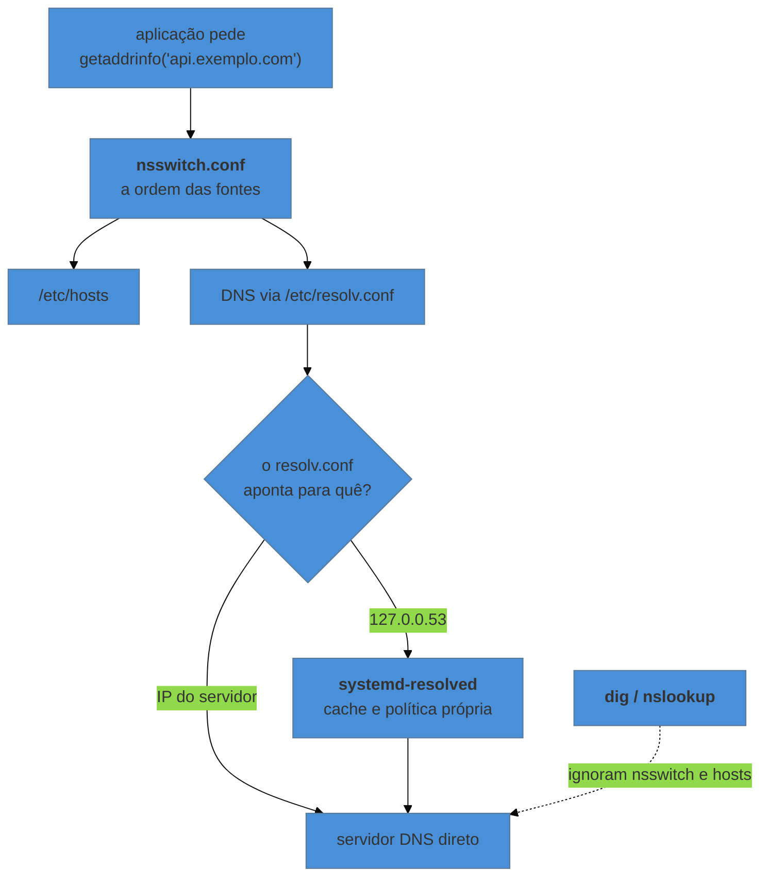

# A máquina na rede

> [!abstract] TL;DR
> Quatro perguntas cobrem quase toda investigação de rede **nesta máquina**: que endereços ela tem (`ip addr`), por onde o pacote sai (`ip route`), o que está escutando e **em qual endereço** (`ss -tlnp`), e como um nome vira endereço (`resolvectl`, `getent`). A resposta mais frequente para "o serviço não responde de fora" não é firewall: é o processo estar escutando em `127.0.0.1` em vez de `0.0.0.0`. E a segunda mais frequente é resolução de nomes — que falha de forma intermitente porque **o `ping` e a sua aplicação não resolvem nomes pelo mesmo caminho**.

---

## Sobe, responde localmente, e ninguém alcança

O serviço está no ar. Você confere de dentro da máquina e funciona:

```bash
curl http://localhost:8080/health
# {"status":"ok"}
```

De qualquer outro lugar, conexão recusada. O firewall foi conferido, a porta está liberada, o serviço está rodando.

O diagnóstico está numa coluna:

```bash
ss -tlnp
# State   Recv-Q  Send-Q   Local Address:Port    Process
# LISTEN  0       128        127.0.0.1:8080      users:(("node",pid=1432,fd=18))
```

`127.0.0.1:8080` significa que o processo aceita conexões **apenas pela interface de loopback** — ou seja, apenas de dentro da própria máquina. Não é firewall bloqueando: o pacote chega e não há nada escutando naquele endereço.

| Endereço de escuta | Aceita conexão de |
|---|---|
| `127.0.0.1` | só da própria máquina |
| `0.0.0.0` | qualquer interface (todas) |
| `192.168.1.10` | só por aquela interface específica |
| `[::]` | equivalente a `0.0.0.0` em IPv6 |

Isso é configuração **da aplicação**, não do sistema — e é a primeira coisa a verificar, antes de mexer em firewall. Em container o mesmo erro aparece com outra roupa: a aplicação escuta em `127.0.0.1` dentro do container, e o mapeamento de porta do Docker nunca alcança, porque o loopback do container não é o do host.

> [!info] `ss` e `ip` no lugar de `netstat` e `ifconfig`
> As ferramentas antigas vieram do pacote `net-tools`, que está sem manutenção ativa há anos e frequentemente **nem vem instalado** em servidor moderno ou em imagem de container. `ip` e `ss` são as atuais, vêm do `iproute2`, e mostram coisas que as antigas não mostram. Vale trocar o hábito — inclusive porque a saída de `ss -tlnp` traz o processo dono do socket, que é o que responde a pergunta acima.

---

## Endereços, interfaces e rotas

```bash
ip addr                    # endereços por interface (ip a)
ip link                    # as interfaces e seu estado físico/administrativo
ip route                   # a tabela de rotas
ip route get 8.8.8.8       # POR ONDE este destino específico sairia
ip neigh                   # a tabela ARP: quem é quem na rede local
```

O `ip route get` é o mais subestimado dos cinco: em vez de você interpretar a tabela, o kernel responde qual rota seria escolhida para aquele destino, com a interface e o endereço de origem. Numa máquina com VPN, várias interfaces ou rotas específicas, ele encerra a discussão.

Ler a tabela de rotas é simples com uma regra: **vence o prefixo mais específico**.

```text
default via 192.168.1.1 dev eth0        ← usada quando nada mais casa
10.8.0.0/24 dev tun0                    ← mais específica: 10.8.0.5 vai pela VPN
192.168.1.0/24 dev eth0 proto kernel
```

Um destino em `10.8.0.5` casa com a segunda e com a `default`; a segunda vence porque `/24` é mais específico que `/0`. É por isso que "a VPN quebrou meu acesso ao servidor" costuma ser uma rota mais específica capturando tráfego que antes ia pelo caminho comum.

E o estado da interface merece atenção, porque tem duas camadas:

```bash
ip link show eth0
# 2: eth0: <BROADCAST,MULTICAST,UP,LOWER_UP> ...
```

`UP` é administrativo — alguém a habilitou. `LOWER_UP` é físico — há link do outro lado. Interface `UP` sem `LOWER_UP` é cabo desconectado ou porta desabilitada no switch, e nenhuma configuração de IP resolve isso.

---

## Resolução de nomes: a origem da falha intermitente

Aqui está a parte que mais consome tempo em diagnóstico, e o motivo é que **existe mais de um caminho de resolução na mesma máquina**.



A seta pontilhada é a armadilha inteira: **`dig` e `nslookup` falam direto com o servidor DNS**, sem passar por `/etc/hosts` nem pelo `nsswitch.conf`. A sua aplicação, não — ela chama a função da biblioteca do sistema, que segue a ordem configurada.

Consequência prática: `dig api.exemplo.com` responder certo **não prova** que a aplicação vai resolver igual, e o contrário também vale. A ferramenta que percorre o mesmo caminho da aplicação é outra:

```bash
getent hosts api.exemplo.com      # resolve como a aplicação resolveria
resolvectl query api.exemplo.com  # com systemd-resolved: mostra a fonte e o cache
dig api.exemplo.com               # pergunta ao servidor, ignorando hosts e nsswitch
```

Use `getent` para saber o que a aplicação vê, e `dig` para saber o que o servidor responde. Quando os dois discordam, a diferença **é** o achado — quase sempre uma linha em `/etc/hosts` esquecida, ou cache.

### `/etc/resolv.conf` quase nunca é seu

```bash
cat /etc/resolv.conf
# nameserver 127.0.0.53
# options edns0 trust-ad
```

Esse `127.0.0.53` é o `systemd-resolved` rodando localmente. Editar o arquivo à mão nesse cenário produz o clássico "mudei e voltou sozinho": o arquivo é gerenciado — por `systemd-resolved`, `NetworkManager` ou pelo cliente de DHCP — e é reescrito. A configuração real fica em `/etc/systemd/resolved.conf` ou na definição da conexão.

```bash
resolvectl status          # qual servidor está sendo usado, por interface
resolvectl statistics      # cache: acertos e falhas
resolvectl flush-caches    # limpar o cache
```

O cache explica outra classe de intermitência: o registro mudou, a máquina ainda responde o endereço antigo, e "funciona para uns e não para outros" é só TTL em máquinas diferentes.

> [!info] O mecanismo do DNS mora em outro lugar
> Como o protocolo funciona — recursão, registros, TTL, propagação — é [[03-Dominios/Ciência/Redes e Protocolos/04 - DNS|Ciência/Redes 04]]. Aqui a pergunta é sempre a mesma e é local: **por qual caminho esta máquina resolve, e o que ela tem em cache.**

---

## Firewall: três camadas, e o erro é confundi-las

```bash
sudo nft list ruleset          # nftables — o mecanismo atual do kernel
sudo iptables -L -n -v         # a interface antiga (hoje um front-end para nftables)
sudo ufw status verbose        # Debian/Ubuntu
sudo firewall-cmd --list-all   # RHEL/Fedora
```

O que importa mais que a sintaxe é saber **quantas camadas podem estar bloqueando**, porque liberar na errada consome horas:

1. **A aplicação** — escutando em loopback, como na abertura. Não é bloqueio, é ausência.
2. **O firewall do host** — `nftables`, e as ferramentas amigáveis por cima dele.
3. **A rede antes da máquina** — grupo de segurança na nuvem, ACL, firewall corporativo. Fora do alcance de qualquer comando local.

A investigação eficiente vai de dentro para fora, e cada passo elimina uma camada:

```bash
curl http://127.0.0.1:8080/         # 1. a aplicação responde a si mesma?
curl http://<ip-da-maquina>:8080/   # 2. responde pela interface de rede?
# de outra máquina:
nc -vz <ip> 8080                    # 3. a porta é alcançável de fora?
```

Falhou no 1: problema da aplicação. Passou no 1 e falhou no 2: endereço de escuta. Passou no 2 e falhou no 3: firewall do host ou da rede — e aí `ss -tlnp` já provou que há alguém escutando, o que direciona a conversa com quem administra a rede.

> [!warning] `ping` funcionando não significa porta alcançável
> `ping` usa ICMP; sua aplicação usa TCP na porta X. É comum que ICMP passe e a porta esteja bloqueada — e também o inverso, com ICMP bloqueado e o serviço funcionando perfeitamente. **`ping` responde se o host está alcançável; ele não diz nada sobre a porta.** Para porta, use `nc -vz`, `curl`, ou `ss` do lado do servidor.

---

## SSH: o acesso, sem virar assunto próprio

O SSH aparece aqui como **ferramenta de acesso**, e o essencial cabe em pouco:

```bash
ssh -v usuario@host          # o -v mostra onde a negociação falha
ssh-copy-id usuario@host     # instala sua chave pública no destino
```

Duas coisas resolvem a maioria dos problemas: **permissão** — o servidor recusa chave se `~/.ssh` não for `700` e `authorized_keys` não for `600`, e a mensagem no cliente não diz isso — e o arquivo `~/.ssh/config`, que transforma parâmetros repetidos em um apelido:

```text
Host prod
    HostName 10.0.1.15
    User deploy
    IdentityFile ~/.ssh/id_prod
    ProxyJump bastiao
```

Configuração do lado servidor, política de chaves e endurecimento são segurança operacional, e não são assunto deste galho.

---

## Armadilhas comuns

> [!warning] Culpar o firewall antes de olhar o endereço de escuta
> **O que acontece:** horas mexendo em regra, e o problema era `127.0.0.1`. **Por quê:** o sintoma — conexão recusada de fora, funcionando dentro — é idêntico nos dois casos. **Como evitar:** `ss -tlnp` primeiro, sempre. A coluna de endereço local responde antes de qualquer regra.

> [!warning] Editar `/etc/resolv.conf` à mão
> **O que acontece:** funciona até o próximo boot, renovação de DHCP ou reinício do serviço de rede. **Por quê:** o arquivo é gerado por quem administra a rede na máquina. **Como evitar:** descubra o dono (`ls -l /etc/resolv.conf` costuma mostrar um link para `/run/systemd/resolve/...`) e configure na origem.

> [!warning] Confiar no `dig` para diagnosticar a aplicação
> **O que acontece:** `dig` responde certo, a aplicação continua sem resolver. **Por quê:** caminhos diferentes — `dig` ignora `/etc/hosts` e `nsswitch.conf`. **Como evitar:** `getent hosts <nome>` é o que reproduz o caminho da aplicação.

> [!warning] Usar `netstat` e `ifconfig` por hábito
> **O que acontece:** "comando não encontrado" no servidor ou no container, no meio de um incidente. **Por quê:** `net-tools` deixou de ser instalado por padrão. **Como evitar:** aprenda `ss` e `ip`. Como atalho de memória: `netstat -tlnp` → `ss -tlnp`; `ifconfig` → `ip addr`; `route -n` → `ip route`.

---

## Como explicar em inglês

"Four questions cover most network debugging on a host: which addresses it has, where packets leave from, what's listening and **on which address**, and how names resolve. The single most common cause of 'the service works locally but nobody can reach it' isn't the firewall — it's the process bound to 127.0.0.1 instead of 0.0.0.0, and `ss -tlnp` shows that in one line. The second most common is name resolution, and the trap there is that `dig` talks straight to the DNS server while your application goes through nsswitch and `/etc/hosts` — so `getent hosts` is what actually reproduces what the app sees."

| PT | EN |
|---|---|
| interface de rede | network interface |
| endereço de escuta | listening address |
| tabela de rotas | routing table |
| rota padrão | default route / gateway |
| prefixo mais específico | longest prefix match |
| resolução de nomes | name resolution |
| alcançável | reachable |

---

## O que vem a seguir

Diagnosticar rede leva, com frequência, a precisar instalar alguma coisa — o `ss` que falta, o cliente de banco, a versão nova que corrige o defeito. E aí aparece a pergunta que separa uma máquina administrável de uma máquina imprevisível: **de onde veio cada software que está aqui, e quem consegue atualizá-lo?**

- **11 — Software instalado** — o gerenciador de pacotes como banco de dados, e por que "instalar do site" é decisão.
- [[03-Dominios/Ciência/Redes e Protocolos/04 - DNS|Ciência/Redes 04 — DNS]] · [[03-Dominios/Ciência/Redes e Protocolos/02 - TCP|02 — TCP]] — o mecanismo dos protocolos, que esta nota usa e não reabre.
- [[03-Dominios/Tecnologia/Infraestrutura/Linux/03 - Tudo é arquivo - descritores e redirecionamento|03 — Tudo é arquivo]] — socket é descritor, e é por isso que `ss -tlnp` consegue mostrar o processo dono.

## Fontes

- **iproute2** — [*ip(8)*](https://man7.org/linux/man-pages/man8/ip.8.html) e [*ss(8)*](https://man7.org/linux/man-pages/man8/ss.8.html) — as ferramentas atuais, incluindo `ip route get` e as colunas de `ss`.
- **Michael Kerrisk** — [*nsswitch.conf(5)*](https://man7.org/linux/man-pages/man5/nsswitch.conf.5.html) — a ordem das fontes de resolução, que é a origem da divergência entre `dig` e a aplicação.
- **freedesktop.org** — [*systemd-resolved.service(8)*](https://www.freedesktop.org/software/systemd/man/systemd-resolved.service.html) — o stub em `127.0.0.53`, o cache e por que `/etc/resolv.conf` é gerenciado.
- **netfilter.org** — [*nftables wiki*](https://wiki.nftables.org/) — o mecanismo atual de filtragem, do qual `iptables` hoje é interface.
