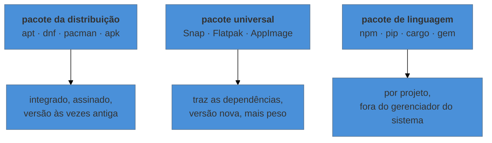

# Software instalado

> [!abstract] TL;DR
> O gerenciador de pacotes não é um instalador: é um **banco de dados** do que existe na máquina. Ele sabe quais arquivos pertencem a qual pacote, de onde cada um veio, e como desfazer. Tudo o que entra por fora dele — `curl | sh`, binário baixado do site, `sudo pip install` — deixa a máquina com uma parte que ninguém consegue inventariar, atualizar ou remover. A pergunta que organiza esta nota não é "como instalo", é: **daqui a dois anos, alguém vai conseguir descobrir de onde isto veio e como atualizá-lo?**

---

## O binário que ninguém sabe explicar

Você assume um servidor. Em `/usr/local/bin` há um binário chamado `deploy-tool`. Ele é essencial — o pipeline depende dele.

E aí as perguntas que não têm resposta: qual versão é essa? De onde veio? Tem atualização de segurança pendente? Se eu removê-lo e algo quebrar, como o reinstalo?

```bash
dpkg -S /usr/local/bin/deploy-tool     # Debian/Ubuntu
# dpkg-query: no path found matching pattern /usr/local/bin/deploy-tool

rpm -qf /usr/local/bin/deploy-tool     # RHEL/Fedora
# arquivo /usr/local/bin/deploy-tool não pertence a nenhum pacote
```

"Não pertence a nenhum pacote" é a resposta que transforma um servidor em caixa-preta. Não há versão registrada, não há origem, não há caminho de atualização, e não há remoção limpa. Alguém rodou um comando há três anos e foi embora.

O papel do gerenciador de pacotes é justamente impedir que isso aconteça — e é por isso que instalar por fora dele é uma **decisão**, com custo, e não um atalho neutro.

---

## O gerenciador como banco de dados

A parte que quase todo tutorial ignora: as consultas.

```bash
# Debian / Ubuntu
dpkg -l                      # tudo que está instalado, com versão
dpkg -L nginx                # quais arquivos este pacote instalou
dpkg -S /etc/nginx/nginx.conf   # a que pacote este arquivo pertence
apt policy nginx             # versão instalada, candidata, e de qual repositório
apt-cache depends nginx      # do que ele depende
apt list --upgradable        # o que tem atualização

# RHEL / Fedora
rpm -qa · rpm -ql nginx · rpm -qf <arquivo> · dnf info nginx · dnf repoquery --requires nginx
```

Três dessas resolvem problemas reais com frequência:

**`dpkg -S <arquivo>`** responde "quem colocou isto aqui" — o começo de qualquer investigação sobre configuração inesperada.

**`dpkg -L <pacote>`** responde "onde este pacote pôs as coisas" — útil quando a documentação diz que o arquivo fica num lugar e a distribuição decidiu outro.

**`apt policy <pacote>`** responde "de onde veio esta versão", e é o comando que revela repositório de terceiro que alguém adicionou e esqueceu.

| | Debian/Ubuntu | RHEL/Fedora | Arch | Alpine |
|---|---|---|---|---|
| instalar | `apt install` | `dnf install` | `pacman -S` | `apk add` |
| remover | `apt remove` / `purge` | `dnf remove` | `pacman -R` | `apk del` |
| atualizar índice | `apt update` | (automático) | `pacman -Sy` | `apk update` |
| atualizar sistema | `apt upgrade` | `dnf upgrade` | `pacman -Syu` | `apk upgrade` |
| buscar | `apt search` | `dnf search` | `pacman -Ss` | `apk search` |
| dono do arquivo | `dpkg -S` | `rpm -qf` | `pacman -Qo` | `apk info -W` |

> [!warning] `apt update` não atualiza nada
> Ele atualiza o **índice** — a lista do que existe nos repositórios. Quem atualiza software é `apt upgrade`. A confusão faz gente rodar `apt update` sozinho por meses achando que está mantendo a máquina em dia. E há um par correlato: `apt upgrade` não instala nem remove pacotes para resolver dependência; quando a atualização exige isso, ela é **retida**, e o comando avisa em uma linha fácil de ignorar. `apt full-upgrade` é o que aceita a mudança — e por isso merece leitura atenta do que ele propõe.

---

## Repositório e assinatura: por que `curl | sh` é uma decisão

Um repositório entrega mais que arquivos: entrega **procedência**. Os pacotes são assinados, o gerenciador verifica a assinatura contra as chaves que a máquina confia, e recusa o que não confere. É por isso que `apt install nginx` é seguro de um jeito que baixar um `.deb` de um link não é.

```bash
apt policy                          # quais repositórios estão configurados
ls /etc/apt/sources.list.d/         # os de terceiros, um arquivo cada
ls /etc/apt/keyrings/               # as chaves confiadas
```

Quando você roda `curl https://algum.site/install.sh | sudo bash`, três coisas acontecem de uma vez: um script arbitrário executa como root sem você ter lido; o que ele instalar não entra no banco de dados de pacotes; e não existe caminho de atualização nem de remoção — a menos que o próprio script tenha criado um, e você confie nele.

Isso **não** significa que nunca se faça. Significa que é uma decisão consciente, e que existe uma alternativa quase sempre melhor: muitos projetos que oferecem o `curl | sh` também publicam um repositório. Adicionar o repositório dá o mesmo software com procedência, atualização e remoção.

E, quando não houver repositório, três mitigações valem: baixar o script e **ler antes** de executar; fixar uma versão em vez de "latest"; e registrar em algum lugar — um `README` na máquina, um item no inventário — de onde aquilo veio e como se atualiza. É o mínimo para que o próximo a assumir o servidor não encontre o `deploy-tool` da abertura.

---

## As três camadas de empacotamento



**Pacote da distribuição** é o padrão, e a crítica frequente — "a versão é antiga" — costuma ser um mal-entendido: distribuições estáveis fixam a versão e aplicam **correções de segurança por retroporte**, mantendo o número antigo. Um `nginx 1.22` do Debian estável não é um nginx de 2022 com falhas abertas.

**Pacote universal** resolve o caso em que você precisa de uma versão mais nova que a da distribuição, ou de aplicação gráfica com dependências próprias. O preço é tamanho, sobreposição de bibliotecas e, no Snap, um daemon próprio.

**Pacote de linguagem** é o que mais gera confusão em servidor, e vale uma regra: **nunca `sudo pip install`**. Ele escreve em diretórios que pertencem ao gerenciador do sistema, e uma atualização da distribuição encontra arquivos que ela acha que são dela, mas foram substituídos — o resultado clássico é quebrar ferramentas do próprio sistema que dependem de Python. O certo é ambiente virtual por projeto, ou `pipx` para ferramentas de linha de comando.

> [!info] O container como resposta a este problema
> Boa parte desta nota é sobre *de onde veio cada coisa*, e é exatamente o problema que a imagem de container resolve: em vez de instalar na máquina, você **declara** num Dockerfile o que entra, e o resultado é reproduzível e descartável. Essa é a ponte com o galho de Docker — e é também por isso que a régua de qualidade lá é fixar versão da imagem base em vez de usar `latest`: é a mesma pergunta de procedência, num lugar diferente.

---

> [!tip] Vídeo — os formatos universais comparados de verdade
> [**Linux Packaging Formats explained: Flatpak vs Snaps vs DEB & RPM vs AppImage vs AUR**](https://www.youtube.com/watch?v=1lLZ-59xH3Y) (The Linux Experiment, ~20 min, EN) desenvolve a seção das três camadas com o detalhe que ela resume. Três precisões que valem: **Flatpak compartilha *runtimes*** — o custo de espaço é bem menor se as aplicações forem do mesmo ambiente de trabalho, porque a base é comum, e explode quando são de ambientes diferentes; **Snap tem canais** (estável, beta, edge), o que permite testar versão nova sem trocar de fonte; e **AppImage costuma não ser isolado** na prática, embora possa ser — o que o torna o menos seguro dos três, ao contrário do que a promessa de "empacotar uma vez, rodar em qualquer lugar" sugere. Ele também explica que o **AUR não hospeda pacotes**, e sim *scripts de construção* — distinção que muda o que significa "instalar do AUR". **O que ele não cobre:** o gerenciador como banco de dados e suas consultas, procedência e assinatura de repositório, e o conflito entre gerenciador de linguagem e gerenciador do sistema.
>
> ⚠️ O vídeo tem **segmento patrocinado** no fim.

## Manter atualizado sem quebrar

```bash
apt list --upgradable
apt-mark hold postgresql-14        # congela um pacote específico
apt-mark showhold
unattended-upgrades --dry-run      # o que a atualização automática faria
```

Duas práticas que separam servidor cuidado de servidor esquecido:

**Atualização de segurança automatizada.** O `unattended-upgrades` (ou `dnf-automatic`) aplica correções de segurança sozinho. É o padrão razoável para servidor, e o argumento contra — "pode quebrar" — costuma perder para o argumento a favor: máquina que só é atualizada quando alguém lembra fica meses vulnerável.

**Congelar deliberadamente, e registrar.** Quando um pacote precisa ficar numa versão — porque a aplicação depende dela —, `hold` é o mecanismo. E o `hold` sem registro do motivo vira mistério em seis meses; anote onde a equipe olha.

E vale conferir o que costuma passar despercebido:

```bash
ls /var/run/reboot-required 2>/dev/null && echo "reinício pendente"
```

Atualização de kernel só passa a valer depois do reinício. Uma máquina "atualizada" que nunca reinicia continua rodando o kernel antigo — e é assim que a correção aplicada não protege.

---

## Armadilhas comuns

> [!warning] `sudo pip install` (ou `sudo npm install -g`) em servidor
> **O que acontece:** cedo ou tarde, uma ferramenta do sistema quebra, e o erro não aponta para o que você fez. **Por quê:** os arquivos escritos ocupam caminhos gerenciados pelo pacote do sistema, e as duas metades passam a discordar. **Como evitar:** ambiente virtual por projeto; `pipx` para ferramentas globais de CLI; e, para Node, gerenciador de versão em vez de instalação global como root.

> [!warning] Misturar repositórios de versões diferentes da distribuição
> **O que acontece:** um pacote de outra versão puxa uma biblioteca base mais nova, e o sistema fica num estado que o gerenciador não consegue mais resolver. **Por quê:** as versões da distribuição são conjuntos testados juntos; misturá-los quebra as premissas. **Como evitar:** um repositório de terceiro específico é aceitável; misturar as bases (o "Frankendebian") não. Quando precisar de versão nova de uma coisa só, prefira pacote universal ou container.

> [!warning] Instalar do site e não deixar rastro
> **O que acontece:** o binário da abertura desta nota. **Por quê:** ninguém registrou origem, versão e forma de atualizar. **Como evitar:** se for inevitável, escreva onde a equipe olha: o que é, de onde veio, qual versão, como atualizar. Três linhas resolvem — e a ausência delas custa horas de alguém, depois.

> [!warning] Compilar da fonte sem plano de remoção
> **O que acontece:** `make install` espalha arquivos por vários diretórios e não há `make uninstall` confiável. **Por quê:** a instalação não é rastreada. **Como evitar:** use `checkinstall` (que empacota o resultado) ou compile dentro de um container e leve só o artefato — a técnica de multi-estágio do galho de Docker.

---

## Como explicar em inglês

"A package manager isn't an installer, it's a database of what's on the machine: which files belong to which package, where each came from, and how to undo it. Anything installed outside it — `curl | sh`, a binary from a website, `sudo pip install` — leaves a part of the system nobody can inventory, patch or remove. The question that matters isn't 'how do I install this', it's 'in two years, will someone be able to tell where this came from and how to update it?'. And a common misunderstanding: on stable distributions the version number looks old because security fixes are backported, so the old number doesn't mean unpatched."

| PT | EN |
|---|---|
| gerenciador de pacotes | package manager |
| repositório | repository |
| procedência | provenance |
| retroporte (de correção) | backport |
| congelar versão | to pin / hold a version |
| dependência transitiva | transitive dependency |
| reinício pendente | pending reboot |

---

## O que vem a seguir

Com esta nota fecha a fase Adepto: a máquina está configurada, com serviços supervisionados, log consultável, tarefas agendadas, rede compreendida e software com procedência. O que falta é a parte que só importa quando algo dá errado — e que separa quem administra de quem apenas configura. A fase Magus começa pelo método: o que olhar, em que ordem, nos primeiros sessenta segundos diante de uma máquina que "está lenta".

- **12 — Diagnóstico: os primeiros sessenta segundos** — o checklist antes das ferramentas.
- [[03-Dominios/Tecnologia/Infraestrutura/Docker/index|Infraestrutura/Docker]] — a resposta de outra natureza para o problema de procedência desta nota.
- [[03-Dominios/Engenharia/Operação/index|Engenharia/Operação]] — política de atualização e gestão de vulnerabilidade como disciplina; aqui é o mecanismo na máquina.

## Fontes

- **Debian** — [*apt(8)*](https://manpages.debian.org/stable/apt/apt.8.en.html) e [*dpkg-query(1)*](https://manpages.debian.org/stable/dpkg/dpkg-query.1.en.html) — as consultas ao banco de dados de pacotes usadas aqui.
- **Debian** — [*Debian Policy Manual*](https://www.debian.org/doc/debian-policy/) — o que garante que pacotes de uma mesma versão funcionem juntos, e por que misturar bases quebra isso.
- **Debian Security** — [*Security FAQ — backports*](https://www.debian.org/security/faq#version) — por que o número de versão antigo não significa software sem correção.
- **Python Packaging Authority** — [*pipx*](https://pipx.pypa.io/stable/) — a forma recomendada de instalar ferramentas de linha de comando em Python sem tocar no sistema.
