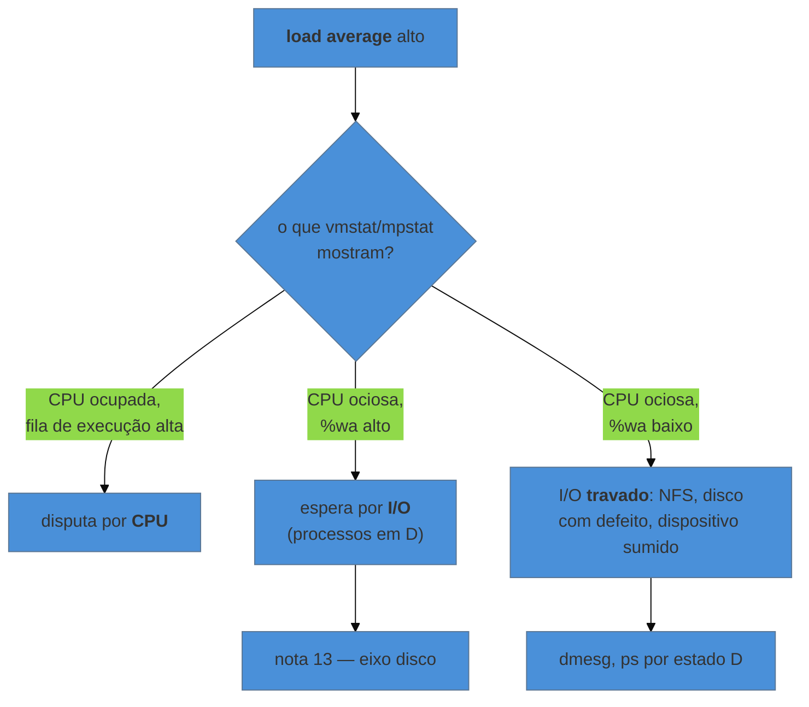

# Diagnóstico — os primeiros sessenta segundos

> [!abstract] TL;DR
> Diante de uma máquina que "está lenta", a diferença entre quem resolve em minutos e quem passa a tarde tentando não é conhecer mais comandos: é ter uma **ordem**. O checklist de sessenta segundos de Brendan Gregg dá essa ordem — dez comandos que, juntos, dizem se o problema é CPU, memória, disco, rede ou nenhum dos quatro. E o número que mais engana está logo no primeiro: **em Linux, o load average não mede CPU** — ele conta também processos em espera ininterrompível de I/O, e é por isso que uma máquina pode ter load 40 com processador ocioso.

---

## "Está lento" não é um sintoma

O chamado chega assim, e é a descrição menos útil possível: não diz o quê, não diz desde quando, não diz para quem.

O reflexo comum é abrir o `top` e olhar. O problema é que o `top` mostra tudo ao mesmo tempo, e sem hipótese você acaba fixando no primeiro número que parecer alto — que muitas vezes é irrelevante. É como procurar chave de casa com lanterna, apontando para onde a luz já está.

O que substitui o reflexo é uma **sequência com propósito**, em que cada comando responde uma pergunta e elimina uma possibilidade. Sessenta segundos bastam para descobrir *em qual dos quatro eixos* está o problema — e só então vale aprofundar, que é a nota 13.

---

## O checklist, comando a comando

Brendan Gregg formalizou essa sequência a partir do trabalho de análise de desempenho na Netflix, e ela permanece a melhor abertura que existe:

```bash
uptime
dmesg | tail
vmstat 1 5
mpstat -P ALL 1 5
pidstat 1 5
iostat -xz 1 5
free -m
sar -n DEV 1 5
sar -n TCP,ETCP 1 5
top
```

| Comando | Pergunta que responde |
|---|---|
| `uptime` | há quanto tempo, e a tendência da carga |
| `dmesg \| tail` | o kernel reclamou de algo? (OOM, erro de disco, rede) |
| `vmstat 1` | há espera por CPU? há troca com swap? |
| `mpstat -P ALL 1` | a carga está distribuída ou concentrada num núcleo? |
| `pidstat 1` | **qual processo**, ao longo do tempo |
| `iostat -xz 1` | o disco está sendo exigido, e com que latência |
| `free -m` | há memória de verdade disponível? |
| `sar -n DEV 1` | a rede está saturada? |
| `sar -n TCP,ETCP 1` | há retransmissão, conexão recusada? |
| `top` | a visão geral, **por último** |

Duas escolhas dessa lista merecem explicação, porque não são óbvias.

**`pidstat` em vez de `top` para achar o culpado.** O `top` mostra um instante e reordena a cada atualização, o que dificulta ver tendência. O `pidstat 1` imprime uma linha por intervalo, acumulando — dá para ver qual processo cresce, e é copiável para o chamado.

**`top` por último, não primeiro.** Ele é ótimo para confirmar uma hipótese e péssimo para formá-la.

> [!info] Se as ferramentas não estiverem instaladas
> `mpstat`, `pidstat`, `iostat` e `sar` vêm dos pacotes `sysstat` e `procps`, que nem sempre estão numa máquina enxuta ou num container — e instalar durante o incidente nem sempre é possível. Vale saber que **tudo isso é `/proc` formatado** (nota 02): `cat /proc/loadavg`, `/proc/stat`, `/proc/meminfo`, `/proc/diskstats` e `/proc/net/dev` respondem as mesmas perguntas, sem pacote nenhum.

---

## O load average, e por que ele engana

```bash
uptime
# 03:14:07 up 42 days,  load average: 38.24, 12.10, 4.55
```

A leitura intuitiva — "38 processos querendo CPU" — está errada em Linux. Aqui, o load average conta processos em dois estados: os que estão **executando ou prontos** (`R`) e os que estão em **espera ininterrompível** (`D`), tipicamente presos em I/O de disco ou de rede.

Isso paga a dívida deixada na nota 05: é exatamente por isso que uma máquina pode exibir load altíssimo com CPU ociosa. Um NFS que parou de responder põe dezenas de processos em `D`, e o número sobe sem que ninguém esteja calculando nada.



E os **três números** são uma tendência, que é a informação mais útil do comando: médias de 1, 5 e 15 minutos. `38, 12, 4` significa que a coisa está piorando agora; `4, 12, 38` significa que o pior já passou. Ler apenas o primeiro joga fora metade do que o comando diz.

> [!warning] Comparar load com número de núcleos é regra fraca
> A regra de bolso "load acima do número de núcleos é problema" só vale se a carga for de CPU. Com processos em `D`, o load pode passar de 40 numa máquina de 4 núcleos sem que a CPU seja o gargalo — e, no sentido inverso, uma máquina pode estar com CPU saturada e load modesto se poucos processos estiverem envolvidos. **Load é um sinal para investigar, não um veredito.** O que decide é o próximo comando.

---

> [!tip] Vídeo — o autor do checklist, com o método por trás dele
> [**Linux Performance Tools**](https://www.youtube.com/watch?v=FJW8nGV4jxY) (Brendan Gregg — Velocity, ~54 min, EN) é a fonte primária desta nota: quem apresenta é o autor do checklist e do método USE. E o mais valioso não são as ferramentas — é a parte que abre a palestra, que corresponde exatamente à abertura desta nota. Ele defende que a primeira etapa é o **método do enunciado do problema**: antes de qualquer comando, perguntar a quem abriu o chamado *o que "lento" significa e como isso é quantificado*, desde quando, e o que mudou. E nomeia o anti-padrão oposto — mexer em coisas ao acaso até o sintoma sumir —, que é o que a sequência ordenada existe para impedir. Depois disso ele percorre o USE aplicado a um ambiente inteiro (não só a uma máquina), mostra a divisão entre tempo de usuário e de sistema por thread como forma de decidir **que tipo de análise fazer a seguir**, e fecha com demonstrações ao vivo — uma delas terminando não em defeito de infraestrutura, mas em caracterização de carga: *o trabalho que estão pedindo à máquina é que é ineficiente*.
>
> Vale saber que existe também o [**Linux Performance Analysis in 60 seconds**](https://www.youtube.com/watch?v=ZdVpKx6Wmc8) do mesmo autor: 72 segundos, exatamente o checklist desta seção, comando a comando. Ficou **fora da inserção principal por estar abaixo do piso de duração** do galho, mas é a referência mais curta possível para quem quer só a sequência.
>
> ⚠️ Palestra de meados da década de 2010. As metodologias — USE, enunciado do problema, caracterização de carga — não envelheceram; a parte de ferramentas é anterior à popularização de eBPF, hoje o caminho padrão para rastreamento de baixo custo, tratado na nota 15.

## Um método antes das ferramentas

O checklist é a abertura; o que o sustenta é uma forma de pensar, e a mais prática é o **método USE**, também de Gregg. Para cada recurso — CPU, memória, disco, rede —, três perguntas:

| | O que perguntar | Onde olhar |
|---|---|---|
| **U**tilização | que fração do tempo está ocupado? | `mpstat`, `iostat`, `free` |
| **S**aturação | há trabalho **esperando** na fila? | fila de execução no `vmstat`, `await` no `iostat`, swap |
| **E**rros | há erros reportados? | `dmesg`, `sar -n EDEV`, contadores |

A pergunta que mais diferencia é a segunda. Utilização em 100% **não é necessariamente problema** — um disco em 100% atendendo tudo sem fila está apenas sendo bem aproveitado. O que dói é **saturação**: trabalho enfileirado, esperando. É por isso que `%util` sozinho engana e `await` importa mais, assunto da nota 13.

E a terceira é a mais esquecida: erro de hardware, pacote descartado ou reset de conexão não aparecem em gráfico de utilização, e explicam lentidão que nenhum outro número justifica. `dmesg` estar na segunda posição do checklist não é acaso.

---

## Um percurso trabalhado

Chamado: "a API está lenta desde as 3h".

```bash
$ uptime
 03:14:07 up 42 days,  load average: 38.24, 12.10, 4.55
```

Load alto e **subindo**. Ainda não se sabe de quê.

```bash
$ dmesg -T | tail -5
[Sun Aug 16 03:02:11 2026] nfs: server storage-01 not responding, still trying
```

Aqui o diagnóstico praticamente termina, em dois comandos. Mas vale confirmar em vez de concluir:

```bash
$ vmstat 1 3
procs -----------memory---------- ---swap-- ---io--- -system-- ------cpu-----
 r  b   swpd   free   buff  cache   si   so    bi    bo   in   cs us sy id wa
 1 34      0 2013456  84320 6120448  0    0     8    12  920 1840  3  1 21 75
```

Duas colunas contam a história: `b` em 34 — processos **bloqueados** esperando I/O — e `wa` em 75%, com `us` em apenas 3%. A CPU não está trabalhando; está esperando. E `si`/`so` em zero descarta swap.

```bash
$ ps -eo stat,pid,cmd | awk '$1 ~ /^D/'
D    2841 /usr/bin/node /opt/api/server.js
D    2903 /usr/bin/node /opt/api/server.js
...
```

Os processos da API estão em `D`, presos exatamente como a nota 05 descreveu. **A causa não está na máquina** — está no servidor de armazenamento que parou de responder, e nenhuma ação local resolve. O achado é para quem cuida do NFS.

O que esse percurso ilustra é o valor da ordem: sem ela, seria fácil olhar o load, concluir "CPU", e passar a tarde investigando a aplicação.

---

## Armadilhas comuns

> [!warning] Ler o load como utilização de CPU
> **O que acontece:** conclui-se falta de CPU, escala-se a máquina, e o problema continua — porque era disco ou rede. **Por quê:** em Linux, `D` entra na conta. **Como evitar:** load é gatilho de investigação. Quem responde "é CPU?" é `vmstat`/`mpstat`, olhando `us`, `sy`, `wa` e a fila.

> [!warning] Confiar na primeira amostra
> **O que acontece:** `vmstat` ou `iostat` sem intervalo, e os números parecem estranhos ou baixos demais. **Por quê:** a **primeira linha é a média desde o boot**, não o instante atual. Numa máquina com 42 dias no ar, ela dilui qualquer coisa. **Como evitar:** sempre com intervalo (`vmstat 1 5`) e **descarte a primeira linha**. Vale para `iostat`, `mpstat` e `sar`.

> [!warning] Diagnosticar sem saber o que é normal
> **O que acontece:** um número parece alto, e não há com o que comparar. **Por quê:** falta linha de base. **Como evitar:** olhar as mesmas métricas quando **não** há incidente, e guardar. Isso é observabilidade como disciplina, e mora em [[03-Dominios/Engenharia/Operação/index|Engenharia/Operação]] — aqui está o instrumento, lá a prática de manter histórico.

> [!warning] Investigar direto na máquina errada
> **O que acontece:** o sintoma aparece na API, e a causa está no banco, no armazenamento ou na rede. **Por quê:** lentidão se propaga por dependência. **Como evitar:** o `dmesg` e os processos em `D` costumam apontar para fora rapidamente. Se a máquina está esperando, pergunte **esperando o quê**.

---

## Como explicar em inglês

"When someone says a box is slow, the difference isn't knowing more commands — it's having an order. Gregg's sixty-second checklist gives you that: ten commands that narrow it down to CPU, memory, disk or network. The number that misleads most is the first one: on Linux, load average isn't CPU utilization — it also counts tasks in uninterruptible sleep waiting on I/O, so you can see a load of 40 with an idle processor. Load is a trigger to investigate, not a verdict; `vmstat` and `mpstat` are what answer whether it's actually CPU."

| PT | EN |
|---|---|
| carga média | load average |
| espera ininterrompível | uninterruptible sleep |
| fila de execução | run queue |
| saturação | saturation |
| linha de base | baseline |
| gargalo | bottleneck |
| espera por I/O | I/O wait |

---

## O que vem a seguir

O checklist diz **em qual eixo** está o problema. Falta ler cada eixo com precisão — e é onde moram os números que mais geram conclusão errada: a memória que parece cheia e não está, o disco a 100% que não é gargalo, o `%wa` que não significa disco lento, e o tempo roubado que só existe em máquina virtual.

- **13 — CPU, memória, disco e I/O, um de cada vez** — quatro eixos, quatro conjuntos de sinais.
- [[03-Dominios/Tecnologia/Infraestrutura/Linux/05 - O processo como objeto administrável|05 — O processo como objeto administrável]] — o estado `D`, cuja consequência no load esta nota cobrou.
- [[03-Dominios/Tecnologia/Infraestrutura/Linux/02 - A hierarquia do sistema de arquivos|02 — A hierarquia]] — `/proc` como fonte de tudo o que estas ferramentas formatam.

## Fontes

- **Brendan Gregg** — [*Linux Performance Analysis in 60,000 Milliseconds*](https://netflixtechblog.com/linux-performance-analysis-in-60-000-milliseconds-accc10403c55) — o checklist original, comando a comando, com a justificativa de cada um.
- **Brendan Gregg** — [*The USE Method*](https://www.brendangregg.com/usemethod.html) — utilização, saturação e erros como grade de análise por recurso.
- **Brendan Gregg** — *Systems Performance: Enterprise and the Cloud*, 2ª ed. — o tratamento completo, incluindo a explicação de por que o load average do Linux inclui `TASK_UNINTERRUPTIBLE`.
- **Michael Kerrisk** — [*proc(5)*](https://man7.org/linux/man-pages/man5/proc.5.html) — `/proc/loadavg`, `/proc/stat` e `/proc/diskstats`, a fonte por trás das ferramentas.
