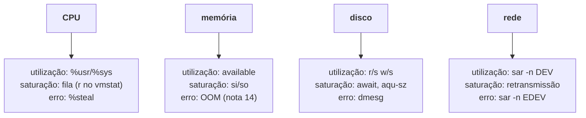

# CPU, memória, disco e I/O, um de cada vez

> [!abstract] TL;DR
> Quatro eixos, e em cada um há um número que engana. Em **CPU**, é o `%wa`, que não significa disco lento, e o `%st`, que só existe em máquina virtual e denuncia um problema que não é seu. Em **memória**, é o `free`, que quase sempre está baixo e quase nunca importa — o número certo é `available`. Em **disco**, é o `%util`, que perdeu o sentido em NVMe e foi substituído na prática pelo `await`. Saber qual número ler em cada eixo é o que transforma o checklist da nota 12 em diagnóstico.

---

## Eixo 1 — CPU

```bash
mpstat -P ALL 1 5
```

```text
CPU    %usr   %nice   %sys  %iowait   %steal   %idle
all   12,50    0,00   3,20    68,30     0,00   16,00
  0   48,00    0,00   9,00     2,00     0,00   41,00
  1    1,00    0,00   0,50    92,00     0,00    6,50
```

Duas leituras que só aparecem com `-P ALL`:

**A distribuição importa tanto quanto a média.** Na tabela acima, a média esconde que o núcleo 0 está a 48% de trabalho útil enquanto o 1 está 92% esperando I/O. Média de 12% de uso pareceria máquina ociosa. Carga concentrada num único núcleo costuma indicar aplicação de thread única — e nesse caso adicionar núcleos não resolve nada.

**Cada coluna aponta para um lugar diferente:**

| Coluna | Significa | Se estiver alto |
|---|---|---|
| `%usr` | tempo em código de aplicação | trabalho real — investigue **qual** processo |
| `%sys` | tempo em código do kernel | muitas chamadas de sistema, I/O intenso, rede |
| `%iowait` | **CPU ociosa** com I/O pendente | vá para o eixo disco |
| `%steal` | o hipervisor deu a CPU a outro | problema do **hospedeiro**, não seu |
| `%idle` | ocioso de fato | — |

> [!warning] `%iowait` não significa "o disco está lento"
> Ele mede **CPU ociosa enquanto há I/O pendente**. Se a máquina tem trabalho de CPU para fazer, o `%iowait` cai — sem que o disco tenha melhorado em nada. E o contrário: numa máquina sem outro trabalho, um único processo lendo disco produz `%iowait` alto e isso pode ser perfeitamente normal. Ele é **pista para mudar de eixo**, nunca conclusão. Quem responde sobre o disco é o `iostat`.

O `%steal` merece nota própria porque quase ninguém olha: em VM na nuvem, ele mede o tempo em que a sua CPU virtual **quis rodar e não conseguiu**, porque o hospedeiro estava atendendo outro cliente. `%steal` consistentemente alto significa vizinho barulhento ou hospedeiro superlotado — e a ação é trocar de instância ou falar com o provedor, não otimizar o seu código.

Para achar o processo, com tendência em vez de instantâneo:

```bash
pidstat 1 5                 # por processo, por intervalo
pidstat -t -p <pid> 1       # por thread — revela se é uma thread só
```

> [!info] `%CPU` acima de 100% no `top` não é bug
> O `top` reporta por processo somando todos os núcleos: 400% num processo significa quatro núcleos ocupados. Tecle `1` no `top` para desdobrar por núcleo, ou `H` para ver threads.

---

## Eixo 2 — memória

O eixo em que o número mais visível é o mais inútil.

```bash
free -h
```

```text
               total        used        free      shared  buff/cache   available
Mem:            15Gi       4,2Gi       312Mi       620Mi        11Gi        10Gi
```

Olhando `free`, a máquina tem 312 MB livres e parece à beira do colapso. Olhando `available`, ela tem **10 GB** — e é este o número correto.

A diferença é o **cache de página**. O kernel usa memória ociosa para guardar conteúdo de arquivos lidos recentemente, porque memória livre é memória desperdiçada. Esse cache é **descartável**: quando uma aplicação pedir memória, o kernel devolve na hora.

> **Memória em uma frase:** `free` é memória nunca usada; `available` é memória que você pode usar. Só a segunda é decisão.

O sinal de pressão real não está no `free` — está no swap, e não no *quanto* está em swap:

```bash
vmstat 1 5
# ...  ---swap-- ...
#      si   so
#       0    0
```

`si` e `so` são páginas entrando e saindo de swap **por segundo**. Swap ocupado com `si`/`so` em zero é apenas coisa antiga guardada, e não custa nada. `si`/`so` continuamente diferentes de zero é *thrashing*: o sistema está trocando páginas o tempo todo, e aí tudo fica lento sem que CPU ou disco pareçam culpados.

Por processo:

```bash
ps -eo pid,rss,vsz,comm --sort=-rss | head
```

E a distinção que evita alarme falso: **`VSZ` é o que o processo endereçou; `RSS` é o que está de fato na memória física**. Um processo com `VSZ` de 20 GB e `RSS` de 300 MB é normal — mapeou muito, usa pouco. Só `RSS` conta para pressão de memória.

O caso extremo — o processo que some sem log — é a nota 14.

---

## Eixo 3 — disco

```bash
iostat -xz 1 5
```

```text
Device   r/s    w/s   rkB/s   wkB/s   r_await  w_await  aqu-sz  %util
nvme0n1  120,0  340,0  4800,0 13600,0    0,42     0,88    1,20   38,00
```

As colunas que decidem:

| Coluna | O que é |
|---|---|
| `r/s`, `w/s` | operações por segundo — a carga |
| `rkB/s`, `wkB/s` | volume por segundo |
| `r_await`, `w_await` | **latência média**, em ms, incluindo fila |
| `aqu-sz` | tamanho médio da fila — a **saturação** do método USE |
| `%util` | fração do tempo com ao menos uma requisição em andamento |

> [!warning] `%util` deixou de significar o que significava
> Em disco rotacional, que atende uma requisição por vez, `%util` em 100% queria dizer saturado. Em **SSD e NVMe**, que atendem dezenas de requisições em paralelo, o dispositivo pode estar em 100% de `%util` e ainda ter muita capacidade sobrando — basta haver sempre alguma operação em voo. O par que substitui: **`await`** (a latência doeu?) e **`aqu-sz`** (há fila?). Uma referência grosseira ajuda a calibrar: NVMe costuma responder abaixo de 1 ms; SSD SATA na casa de poucos ms; disco rotacional em dezenas de ms. `await` de 200 ms num NVMe é anomalia, mesmo com `%util` moderado.

E para descobrir **quem** está fazendo o I/O:

```bash
pidstat -d 1 5             # leitura e escrita por processo
cat /proc/<pid>/io         # totais acumulados daquele processo
sudo iotop -oPa            # interativo, só quem está fazendo I/O
```

---

> [!tip] Vídeo — o eixo disco, do sintoma ao processo
> [**Troubleshooting IO performance issues on Linux**](https://www.youtube.com/watch?v=sjyLRS52zOg) (TECSTER, ~7 min, EN) percorre o eixo de disco na mesma ordem desta seção: parte do `%iowait`, vai ao `iostat` com intervalo para identificar **qual dispositivo** está sofrendo, e termina em `iotop -o` — a opção que filtra apenas os processos que estão de fato fazendo I/O, em vez de listar tudo. É curto e direto, e serve bem como demonstração do caminho métrica → dispositivo → processo.
>
> ⚠️ Uma precisão: ele usa a regra de bolso de que `%iowait` acima de 10-20% "indica problema de disco". Como esta nota argumenta, `%iowait` é **CPU ociosa com I/O pendente** — numa máquina sem outro trabalho, um único processo lendo disco produz `%iowait` alto sem que nada esteja errado, e numa máquina ocupada ele cai sem o disco ter melhorado. Trate como ponteiro para mudar de eixo; quem responde sobre o disco é `await` e `aqu-sz`.

## Eixo 4 — rede

O grosso está na nota 10; para desempenho, três comandos:

```bash
sar -n DEV 1 5             # volume e pacotes por interface
sar -n EDEV 1 5            # erros e descartes — o "E" do método USE
sar -n TCP,ETCP 1 5        # conexões, retransmissões
ss -s                      # resumo de sockets por estado
```

O que costuma passar despercebido é `sar -n EDEV`: pacote descartado e erro de interface não aparecem em gráfico de banda, e produzem lentidão que parece inexplicável. E, no `ETCP`, retransmissão consistente indica perda no caminho — o que é problema de rede, não da aplicação.

---

## Os quatro eixos, lado a lado



| Eixo | Número que engana | Número que decide |
|---|---|---|
| CPU | `%iowait` — é CPU ociosa, não disco lento | `%usr`/`%sys` e a fila de execução |
| memória | `free` — quase sempre baixo | `available`, e `si`/`so` para pressão |
| disco | `%util` — sem sentido em NVMe | `await` e `aqu-sz` |
| rede | banda — raramente é o limite | erros, descartes e retransmissão |

---

## Um caso trabalhado: a aplicação ficou lenta e nada parece alto

`%usr` moderado, `%iowait` baixo, disco tranquilo, memória com `available` folgado. E a aplicação lenta.

```bash
$ mpstat -P ALL 1 3
CPU    %usr   %sys  %iowait  %steal  %idle
all   22,00   4,00     1,00   31,00  42,00
```

`%steal` em 31%. Um terço do tempo, a CPU virtual quis rodar e o hipervisor a deu a outra máquina. Nenhum eixo interno está saturado porque **o problema não está dentro desta máquina** — e nenhuma otimização de código, índice de banco ou ajuste de configuração vai melhorar isso.

A ação é externa: mudar de tipo de instância, migrar para outro hospedeiro, ou acionar o provedor. Vale destacar porque é o tipo de conclusão que só se alcança olhando a coluna certa — e que, sem ela, vira semanas de otimização inútil.

---

## Armadilhas comuns

> [!warning] "A memória está cheia"
> **O que acontece:** alguém vê `free` baixo e conclui falta de memória; às vezes reinicia o serviço "para liberar". **Por quê:** o cache de página ocupa a memória ociosa de propósito, e é devolvido sob demanda. **Como evitar:** leia `available`. E jamais use `drop_caches` em produção para "melhorar" — isso descarta cache útil e piora o desempenho até o cache se reconstruir.

> [!warning] Tratar `%util` de NVMe como saturação
> **O que acontece:** troca-se o disco por um mais rápido e nada muda. **Por quê:** `%util` mede tempo com I/O em voo, não capacidade — e dispositivos paralelos chegam a 100% sem estarem no limite. **Como evitar:** `await` e `aqu-sz`. Se a latência está boa e a fila vazia, o disco não é o gargalo, por mais alto que esteja o `%util`.

> [!warning] Ignorar `%steal` em máquina virtual
> **O que acontece:** meses otimizando o que não é seu. **Por quê:** a coluna quase nunca é olhada, e em máquina física ela é sempre zero — então o hábito não se forma. **Como evitar:** em nuvem, `%steal` entra na primeira olhada, junto com `%usr` e `%iowait`.

> [!warning] Otimizar o eixo errado por causa de um único número
> **O que acontece:** dobra-se a CPU e a latência continua igual. **Por quê:** um número alto não é o gargalo; o gargalo é o recurso com **saturação**. **Como evitar:** a grade da nota 12 — utilização, saturação e erros, nos quatro eixos — antes de qualquer mudança. E medir depois, para confirmar que a mudança fez efeito.

---

## Como explicar em inglês

"Each of the four axes has one number that misleads. On CPU it's `%iowait` — that's idle CPU with I/O outstanding, not a slow disk — and `%steal`, which only exists on VMs and points at the host, not at you. On memory it's `free`, which is almost always low and almost never matters; `available` is the real figure, because page cache is reclaimable on demand. On disk it's `%util`, which lost its meaning on NVMe since parallel devices hit 100% while still having headroom — `await` and queue size replaced it. Knowing which column to read per axis is what turns the checklist into a diagnosis."

| PT | EN |
|---|---|
| cache de página | page cache |
| memória recuperável | reclaimable memory |
| tempo roubado | steal time |
| latência de I/O | I/O latency |
| profundidade de fila | queue depth |
| troca excessiva de páginas | thrashing |
| vizinho barulhento | noisy neighbour |

---

## O que vem a seguir

Os quatro eixos cobrem a máquina que está **lenta**. Falta o caso mais desconcertante: a máquina que está bem e o processo simplesmente **sumiu**, sem erro na aplicação e sem nada no log dela. Isso quase sempre é o kernel agindo — e há dois mecanismos possíveis, um que mata por falta de memória e outro que impede pelo estouro de um limite declarado.

- **14 — Quando o processo some: OOM killer e limites** — quem matou, por quê, e onde isso ficou registrado.
- [[03-Dominios/Tecnologia/Infraestrutura/Linux/12 - Diagnóstico - os primeiros sessenta segundos|12 — Os primeiros sessenta segundos]] — o método que esta nota detalha.
- [[03-Dominios/Ciência/Sistemas Operacionais/07 - Memória virtual e paginação|Ciência/SO 07 — Memória virtual e paginação]] — o mecanismo por trás de cache de página e swap, que esta nota lê pelos sintomas.

## Fontes

- **Brendan Gregg** — *Systems Performance*, 2ª ed., caps. 6-10 — CPU, memória, sistemas de arquivos, disco e rede, com as métricas de cada um.
- **Brendan Gregg** — [*iostat %util is misleading*](https://www.brendangregg.com/blog/2021-04-15/iostat-util.html) — por que a coluna perdeu significado em dispositivos com paralelismo.
- **sysstat** — [*iostat(1)*](https://man7.org/linux/man-pages/man1/iostat.1.html) · [*mpstat(1)*](https://man7.org/linux/man-pages/man1/mpstat.1.html) · [*pidstat(1)*](https://man7.org/linux/man-pages/man1/pidstat.1.html) — a definição exata de cada coluna citada.
- **Kernel.org** — [*/proc/meminfo e o cálculo de MemAvailable*](https://www.kernel.org/doc/html/latest/filesystems/proc.html) — o que entra na estimativa que o `free` reporta como `available`.
