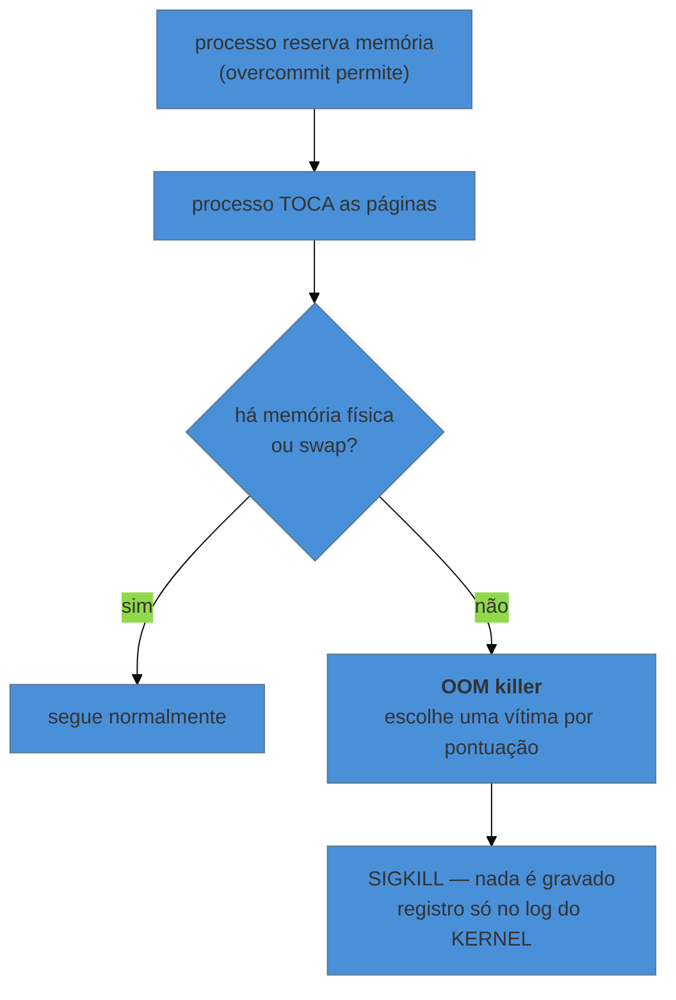

# Quando o processo some — OOM killer e limites

> [!abstract] TL;DR
> Processo que desaparece sem erro no log da aplicação quase nunca "travou": ele foi **morto** ou **impedido** pelo kernel. São dois mecanismos distintos. O **OOM killer** age quando a memória acaba, escolhe uma vítima por pontuação e registra no log do kernel — nunca no da aplicação, porque `SIGKILL` não é entregue a ela. Os **rlimits** agem antes: o processo pede algo (abrir arquivo, criar thread) e recebe recusa. E o detalhe que mais rápido identifica o primeiro caso: **código de saída 137** é `128 + 9`, ou seja, morte por `SIGKILL`.

---

## Não há erro porque não houve erro

A aplicação sumiu de madrugada. O log dela termina no meio de uma requisição normal — sem exceção, sem *stack trace*, sem mensagem de encerramento. O supervisor a reiniciou, e agora tudo parece bem.

A ausência de erro **é** a informação. Quando um processo trata uma falha, ele registra; quando ele recebe `SIGKILL`, nada é registrado, porque o sinal não chega ao código — o kernel remove o processo, como a nota 05 estabeleceu. O log de quem matou está em outro lugar:

```bash
journalctl -k --since "03:00" --until "03:10"
dmesg -T | grep -i -E "killed process|out of memory"
```

```text
[Sun Aug 16 03:04:22 2026] Out of memory: Killed process 2841 (node)
  total-vm:8421320kB, anon-rss:7903112kB, file-rss:0kB, shmem-rss:0kB,
  UID:1001 pgtables:15640kB oom_score_adj:0
```

Uma linha responde tudo: **quem** morreu, **quanto** estava usando, e **por quê**.

---

## O OOM killer: por que ele existe

O Linux permite que processos reservem mais memória do que existe — o *overcommit*. Isso não é descuido: programas costumam reservar muito mais do que efetivamente tocam, e recusar cada reserva pelo total teórico desperdiçaria a máquina.

A consequência é que a conta não fecha na **reserva**, e sim no **uso**: a alocação é aceita, e quando as páginas são de fato tocadas e não há mais memória física nem swap, alguém precisa morrer. Esse alguém é escolhido pelo *OOM killer*.



A escolha não é aleatória. Cada processo tem uma pontuação, e ela cresce principalmente com **o quanto ele consome**:

```bash
cat /proc/<pid>/oom_score        # a pontuação atual
cat /proc/<pid>/oom_score_adj    # o ajuste: -1000 a +1000
```

`oom_score_adj` é o ajuste que você controla. `-1000` torna o processo praticamente imune; valores positivos o tornam vítima preferencial. É o mecanismo que o kubelet usa para materializar as classes de QoS — assunto que o galho de Kubernetes trata na [[03-Dominios/Tecnologia/Infraestrutura/Kubernetes/17 - O kubelet e o nó|nota 17]], pelo lado do orquestrador. Aqui está o mecanismo da máquina; lá, quem o configura.

> [!warning] O maior consumidor costuma morrer — e nem sempre é o culpado
> A pontuação favorece matar quem usa mais memória, porque é o que resolve o problema com uma morte só. Mas o processo que **causou** a exaustão pode ser outro — um job que alocou rápido e terminou, deixando a máquina no limite. O banco de dados morre porque é o maior, não porque é o responsável.
> Por isso a investigação não termina na linha do `dmesg`: ela começa ali. A pergunta seguinte é o que mais mudou no consumo naquele período.

---

## Dois níveis de OOM, e a distinção que mais confunde

Existe OOM **do sistema** e OOM **de cgroup**, e eles se parecem no sintoma e diferem em tudo o mais.

| | OOM do sistema | OOM de cgroup |
|---|---|---|
| Gatilho | a **máquina** ficou sem memória | o **grupo** estourou o próprio limite |
| Quem é afetado | qualquer processo, por pontuação | só processos daquele grupo |
| O resto da máquina | sofre junto | **não percebe nada** |
| Onde aparece | `dmesg`, `journalctl -k` | idem, com a menção ao cgroup |

O segundo caso é o de container: a máquina tem 30 GB livres, e o container morre assim mesmo porque o **limite dele** era 512 MB. Quem chega olhando `free` no host conclui, erradamente, que memória não era o problema.

```bash
# o limite e o uso do grupo (cgroup v2)
cat /sys/fs/cgroup/memory.max
cat /sys/fs/cgroup/memory.current

# num serviço do systemd
systemctl show minha-app -p MemoryMax -p MemoryCurrent
```

E o `systemd` permite declarar isso por unidade, que é a forma de impedir que um serviço derrube a máquina inteira:

```ini
[Service]
MemoryMax=2G          # teto duro: estourou, o cgroup mata
MemoryHigh=1500M      # pressão: acima disso, o kernel força recuperação antes
```

`MemoryHigh` é o menos conhecido e frequentemente o mais útil: em vez de matar, ele **desacelera** o processo e força recuperação de memória, dando margem para observar antes do desastre.

---

> [!tip] Vídeo — cgroups v2 por Michael Kerrisk
> [**An introduction to control groups (cgroups) version 2**](https://www.youtube.com/watch?v=kcnFQgg9ToY) (Michael Kerrisk — NDC TechTown, ~57 min, EN) é a fonte mais autoritativa possível para a seção acima: Kerrisk é o mantenedor das man-pages do Linux e autor de *The Linux Programming Interface*, citado nas fontes deste galho inteiro. Ele explica por que a versão 2 existiu — na v1 cada controlador foi adicionado por conta própria, sem coordenação — e depois **constrói um cgroup ao vivo**: cria o diretório, move um shell para dentro escrevendo em `cgroup.procs`, e mostra que **processos filhos nascem no cgroup do pai**, que é o que faz o limite valer para a árvore inteira sem ninguém declarar nada. Três peças que a nota usa e ele detalha: o limite de memória com teto duro e limite suave; o controle de CPU por cota e período (`20000/100000` = 20% no máximo); e a regra de que um controlador só pode ser usado num nível se tiver sido **habilitado no nível acima**, via `cgroup.subtree_control` — a origem de "declarei o limite e ele não fez efeito". **O que ele não cobre:** o OOM killer em si e sua pontuação, os rlimits, e o código de saída 137.

## O código de saída que entrega o caso

Quando um processo morre por sinal, o código de saída é `128 + número do sinal`:

| Código | Sinal | Significa |
|---|---|---|
| **137** | 9 (`SIGKILL`) | morto à força — OOM killer, `kill -9`, timeout do systemd |
| **143** | 15 (`SIGTERM`) | encerramento pedido — parada normal |
| 139 | 11 (`SIGSEGV`) | falha de segmentação — defeito no programa |

```bash
systemctl status minha-app
#  Main PID: 2841 (code=killed, signal=KILL)

docker inspect --format='{{.State.ExitCode}} {{.State.OOMKilled}}' <container>
# 137 true
```

**137 é o número a reconhecer.** Em container, `OOMKilled: true` confirma sem margem de dúvida. Em serviço, `code=killed, signal=KILL` diz o mesmo — e aí é conferir no log do kernel se foi o OOM ou o `TimeoutStopSec` da nota 07.

---

## O outro mecanismo: rlimits

O OOM mata depois; os limites de recurso **impedem antes**. O processo pede, o kernel recusa, e a aplicação recebe um erro que ela pode ou não tratar bem.

```bash
ulimit -a                              # os limites do shell atual
cat /proc/<pid>/limits                 # os limites REAIS de um processo
```

| Limite | `ulimit` | Sintoma quando estoura |
|---|---|---|
| arquivos abertos | `-n` | `Too many open files` |
| processos/threads | `-u` | `Resource temporarily unavailable` / falha ao criar thread |
| tamanho de pilha | `-s` | falha de segmentação em recursão profunda |
| arquivo de despejo | `-c` | não há *core dump* para analisar |

O primeiro é o mais comum, e já apareceu duas vezes neste galho — na nota 03, como teto de descritores, e no `worker_rlimit_nofile` do Nginx. A declaração correta em serviço é na unidade, não no shell:

```ini
[Service]
LimitNOFILE=65535
LimitNPROC=4096
```

E a distinção que evita subir limite à toa: **teto baixo demais** é gráfico que sobe e estabiliza no limite; **vazamento** é gráfico que sobe e nunca desce.

```bash
watch -n5 'ls /proc/<pid>/fd | wc -l'
```

Se cresce indefinidamente, aumentar o limite só adia — o problema é a aplicação não fechar o que abre.

---

## Um percurso trabalhado

Alerta: a API reiniciou três vezes na madrugada.

```bash
$ systemctl status api
#  Main PID: 4127 (code=killed, signal=KILL)

$ journalctl -k --since "yesterday" | grep -i "killed process"
[Aug 16 03:04:22] Out of memory: Killed process 2841 (node) anon-rss:7903112kB
[Aug 16 03:41:07] Out of memory: Killed process 3902 (node) anon-rss:7811004kB
[Aug 16 04:12:55] Out of memory: Killed process 4009 (node) anon-rss:7889432kB
```

Três mortes, sempre no mesmo patamar — perto de 7,9 GB. Isso já elimina uma hipótese: não é pico esporádico de tráfego, é a aplicação **crescendo até um teto e morrendo**. O padrão é de vazamento de memória, não de dimensionamento.

```bash
$ free -h        # e o resto da máquina?
               total        used        free      buff/cache   available
Mem:            15Gi       8,1Gi       412Mi         6,5Gi       6,2Gi
```

Confirma OOM **do sistema**, não de cgroup: o serviço não tinha `MemoryMax` declarado, então cresceu até comprometer a máquina inteira — e, pela pontuação, foi ele mesmo a vítima escolhida por ser o maior.

Duas ações, e a distinção entre elas importa:

**Contenção, agora:** declarar `MemoryMax=4G` na unidade. Isso não corrige o vazamento — mas transforma "a máquina inteira em risco" em "um serviço reiniciado", e o reinício passa a ser previsível e registrado.

**Correção, depois:** o vazamento é da aplicação, e o achado precisa ir para quem a mantém, com os números do `dmesg` como evidência.

Confundir as duas é o erro clássico: subir a memória da máquina faz o gráfico demorar mais para bater no teto, e não resolve nada.

---

## Armadilhas comuns

> [!warning] Procurar a causa no log da aplicação
> **O que acontece:** horas lendo o log do serviço, que termina no meio de uma operação normal.
> **Por quê:** `SIGKILL` não é entregue ao processo; não há nada a registrar.
> **Como evitar:** ao ver término sem erro, vá direto ao log do **kernel** — `journalctl -k` ou `dmesg -T`. E confira o código de saída: 137 fecha o diagnóstico.

> [!warning] Aumentar o limite sem descobrir por que ele foi atingido
> **O que acontece:** o problema volta, mais tarde e maior.
> **Por quê:** vazamento não tem teto que resolva.
> **Como evitar:** acompanhe a tendência — descritores ou memória que sobem e nunca descem indicam vazamento. Limite é contenção; a correção é na aplicação.

> [!warning] Desligar o swap achando que evita OOM
> **O que acontece:** o OOM passa a acontecer **antes** e de forma mais abrupta.
> **Por quê:** swap não causa OOM; ele adia, dando ao kernel margem para descartar páginas frias. Sem ele, a exaustão chega mais cedo.
> **Como evitar:** o problema do swap é *thrashing* — troca contínua, visível em `si`/`so` na nota 13 —, não a existência dele. Em servidor, um swap modesto costuma ajudar; o que precisa de ajuste é `vm.swappiness`, não a remoção.

> [!warning] Deixar serviços sem teto de memória
> **O que acontece:** um serviço com defeito derruba a máquina e leva junto todos os outros.
> **Por quê:** sem `MemoryMax`, o único limite é a memória física, e a escolha da vítima é do kernel.
> **Como evitar:** `MemoryMax` por unidade. É o equivalente, no host, de declarar `limits` num Pod — mesmo mecanismo de cgroup, decidido em outro lugar.

---

## Como explicar em inglês

"A process that vanishes with nothing in its own log usually didn't crash — it was killed. `SIGKILL` isn't delivered to the application, so there's nothing for it to write; the record is in the kernel log. Exit code 137 is the giveaway: 128 plus 9. The other thing to separate is system OOM from cgroup OOM — a container can be killed for exceeding its own 512 MB limit while the host still has 30 GB free, so looking at `free` on the host tells you nothing. And raising a limit is containment, not a fix: a leak has no ceiling that helps."

| PT | EN |
|---|---|
| memória excedida | out of memory (OOM) |
| sobrealocação | overcommit |
| pontuação de vítima | OOM score |
| teto de memória | memory limit |
| limite de recurso | resource limit (rlimit) |
| vazamento | leak |
| contenção | containment |

---

## O que vem a seguir

Quando o kernel mata, ele deixa registro. Falta o caso em que ele **não** deixa: o processo está vivo, não consome nada, e mesmo assim não funciona — porque está esperando por algo que você não vê. Aí a pergunta deixa de ser "quanto ele consome" e passa a ser **o que ele está pedindo ao kernel**.

- **15 — Ver o que o processo pede ao kernel** — `strace`, `lsof` e o log do kernel como investigação.
- [[03-Dominios/Tecnologia/Infraestrutura/Kubernetes/17 - O kubelet e o nó|Kubernetes 17 — O kubelet e o nó]] — o mesmo `oom_score_adj`, decidido pelo orquestrador.
- [[03-Dominios/Ciência/Sistemas Operacionais/07 - Memória virtual e paginação|Ciência/SO 07]] — o mecanismo de paginação e overcommit, que esta nota lê pelos sintomas.

## Fontes

- **Kernel.org** — [*Concepts overview — OOM killer*](https://www.kernel.org/doc/html/latest/admin-guide/mm/concepts.html) — por que o overcommit existe e como a vítima é escolhida.
- **Michael Kerrisk** — [*proc(5)*](https://man7.org/linux/man-pages/man5/proc.5.html) — `oom_score`, `oom_score_adj` e `/proc/<pid>/limits`.
- **Michael Kerrisk** — [*getrlimit(2)*](https://man7.org/linux/man-pages/man2/getrlimit.2.html) — cada `RLIMIT_*` e o erro devolvido quando é atingido.
- **freedesktop.org** — [*systemd.resource-control(5)*](https://www.freedesktop.org/software/systemd/man/systemd.resource-control.html) — `MemoryMax=`, `MemoryHigh=` e o mapeamento para cgroup v2.
