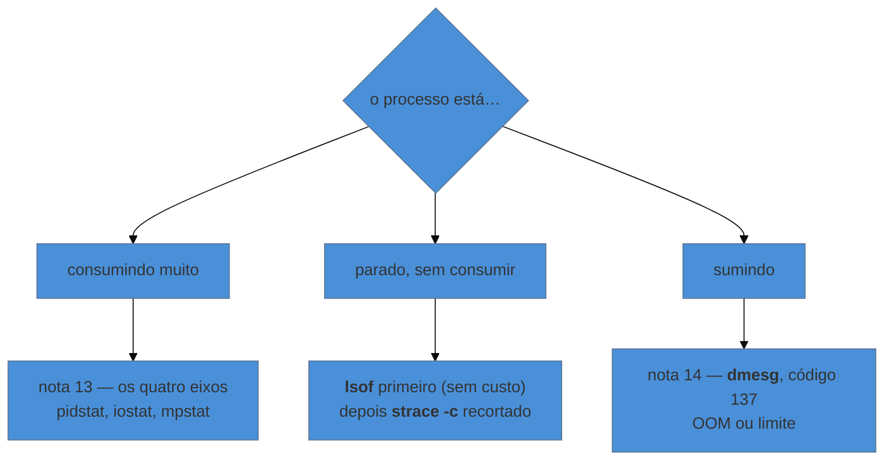

# Ver o que o processo pede ao kernel

> [!abstract] TL;DR
> Quando o processo está vivo, não consome nada e mesmo assim não funciona, a pergunta deixa de ser *quanto ele usa* e passa a ser **o que ele está pedindo**. `strace` mostra cada chamada de sistema — e responde de uma vez qual arquivo ele realmente procura, em qual endereço tenta conectar, e onde exatamente parou. O preço é alto: o processo fica ordens de grandeza mais lento, então nunca se anexa `strace` a serviço quente sem recorte. `lsof` responde a mesma família de perguntas sem custo, e `dmesg` responde quando a causa é hardware ou kernel.

---

## Vivo, ocioso, e mesmo assim parado

O serviço está de pé. Não usa CPU, não usa memória, o disco está calmo. E a requisição não volta.

Nenhum dos quatro eixos da nota 13 acusa nada, porque não há saturação: o processo não está trabalhando — está **esperando**. Falta descobrir esperando o quê, e essa informação não aparece em nenhuma métrica agregada.

```bash
sudo strace -p 2841
# ...
connect(14, {sa_family=AF_INET, sin_port=htons(5432),
             sin_addr=inet_addr("10.0.3.44")}, 16
```

A saída para ali. O processo está tentando abrir conexão com `10.0.3.44:5432` e não recebe resposta — nem sucesso, nem recusa. A chamada não retorna, e é por isso que não há erro na aplicação: ela ainda está no meio da tentativa.

Uma linha respondeu o que nenhum gráfico responderia. E o achado aponta para fora: o banco naquele endereço, ou a rota até ele.

---

## `strace`: a fronteira sendo atravessada, ao vivo

Toda vez que um processo precisa de algo que só o kernel pode fazer — abrir arquivo, ler, escrever, conectar, criar processo —, ele faz uma **chamada de sistema**. O `strace` intercepta essas chamadas e imprime cada uma, com argumentos e retorno.

Os recortes que se usam de verdade:

```bash
sudo strace -p <pid>                          # anexa a um processo em execução
sudo strace -f -p <pid>                       # inclui threads e filhos
sudo strace -e trace=openat,stat ./programa   # só as chamadas de arquivo
sudo strace -e trace=network -p <pid>         # só rede
sudo strace -c -p <pid>                       # RESUMO: contagem, tempo e erros
sudo strace -T -p <pid>                       # tempo gasto em cada chamada
sudo strace -o /tmp/trace.log -f ./programa   # para arquivo, para ler com calma
```

O `-c` merece destaque porque é o modo mais seguro e mais informativo para começar: em vez de despejar milhares de linhas, ele acumula e imprime uma tabela ao final.

```text
% time     seconds  usecs/call     calls    errors syscall
------ ----------- ----------- --------- --------- ----------------
 94.21    4.021144        2010      2001      1998 openat
  3.10    0.132330          66      2005           read
```

Aqui a tabela já entrega o caso: duas mil chamadas de `openat`, e **1998 falharam**. O programa está procurando um arquivo em vários caminhos e não achando — provavelmente uma biblioteca ou configuração ausente, num laço de tentativa.

### As três perguntas que ele responde melhor que qualquer outra ferramenta

**"Qual arquivo ele procura, afinal?"** — a documentação diz um caminho, a aplicação insiste que não encontra, e a verdade está aqui:

```bash
sudo strace -f -e trace=openat ./programa 2>&1 | grep -i config
# openat(AT_FDCWD, "/etc/app/config.yaml", O_RDONLY) = -1 ENOENT
# openat(AT_FDCWD, "/opt/app/config.yaml", O_RDONLY) = 3
```

Duas linhas encerram a discussão: ele tenta um caminho, falha, tenta outro, acha. Nenhuma leitura de documentação chega a isso tão rápido.

**"Para onde ele está conectando?"** — o caso da abertura. Útil especialmente quando a configuração diz um endereço e o comportamento sugere outro.

**"Onde ele travou?"** — anexar a um processo parado mostra a última chamada, que não retornou. `futex` significa espera por lock interno; `read` num socket significa espera por resposta de rede; ausência total de saída significa que ele não está pedindo nada ao kernel — e aí o problema é laço interno, território de depurador de aplicação, não deste galho.

> [!warning] `strace` custa caro — não é ferramenta de produção quente
> Cada chamada de sistema interceptada custa duas paradas do processo. Uma aplicação com I/O intenso pode ficar **dezenas de vezes mais lenta** sob `strace`, e num serviço em produção isso transforma investigação em incidente.
> Regras que evitam o desastre: prefira `-c` (resumo) a saída completa; **sempre recorte** com `-e trace=`; limite o tempo (`timeout 10 strace ...`); e, se possível, reproduza fora de produção. Para observação contínua em produção, a ferramenta certa é **eBPF** (`bpftrace`, `bcc`), que roda no kernel com custo próximo de zero — assunto de tamanho próprio, e a menção fica como caminho, não como conteúdo deste galho.

> [!info] Se o `strace` recusar anexar
> `ptrace: Operation not permitted`, mesmo como root, costuma ser o `ptrace_scope`: várias distribuições restringem anexar a processos que não sejam filhos diretos.
> ```bash
> cat /proc/sys/kernel/yama/ptrace_scope     # 0 = livre, 1 = só descendentes
> sudo sysctl -w kernel.yama.ptrace_scope=0  # temporário; volta no boot
> ```
> Em container, é preciso ainda a capacidade `SYS_PTRACE` — por isso `docker run --cap-add=SYS_PTRACE`. É a mesma discussão de capabilities da nota 04.

---

> [!tip] Vídeo — `strace` em português, com o mecanismo nomeado
> [**Entendendo e utilizando o strace no Linux**](https://www.youtube.com/watch?v=G-HpLitxpXc) (LINUXtips, ~10 min, **PT-BR**) cobre o essencial desta seção em dez minutos e acerta o enquadramento: ele nomeia o **`ptrace`** como o mecanismo do kernel que torna tudo isso possível — o mesmo que, restrito por padrão em várias distribuições, produz o `Operation not permitted` do callout acima. Ele demonstra `-o` para desviar a saída a arquivo (útil porque o `strace` escreve no erro padrão, e misturar com a saída do programa confunde), `-e trace=` acumulando mais de uma chamada, e `-p` para anexar a um processo já em execução. E dá o mesmo uso que esta nota apresenta como o mais valioso: descobrir **qual biblioteca ou arquivo o programa procura e não encontra**. Ele também menciona, com honestidade, que o `strace` não funciona bem com todo programa. **O que ele não cobre:** o custo de interceptação e as regras para não usá-lo em produção quente, o resumo com `-c`, e as alternativas de baixo custo.
>
> ⚠️ Uma precisão: no vídeo, a opção `-r` é apresentada como "quanto tempo cada chamada levou". `-r` imprime **carimbos relativos entre chamadas**; quem mede o tempo gasto *dentro* de cada chamada é **`-T`**, que é a opção listada acima nesta nota. As duas são úteis e respondem coisas diferentes.

## `lsof`: a mesma família de perguntas, sem custo

Onde o `strace` mostra o que está acontecendo **agora**, o `lsof` mostra o que está **aberto** — e responde muita coisa sem parar o processo:

```bash
lsof -p <pid>                 # tudo que o processo tem aberto
lsof -i :8080                 # quem está usando esta porta
lsof -i -a -p <pid>           # só as conexões deste processo
lsof +L1                      # arquivos apagados ainda abertos (nota 02)
lsof /var/log/app.log         # quem está com este arquivo aberto
```

Ele é o instrumento de primeira escolha porque não tem custo relevante, e frequentemente já responde: conexões estabelecidas mostram com quem o processo fala; a contagem de descritores revela vazamento; e o arquivo apagado que segura espaço fecha o enigma da nota 02.

A equivalência vale registrar: **`lsof -p` é uma leitura formatada de `/proc/<pid>/fd/`**, exatamente como a nota 01 mostrou. Quando o `lsof` não estiver instalado — o que é comum em container —, o diretório continua lá.

---

## `dmesg`: quando a resposta é do kernel

O anel de mensagens do kernel guarda o que aconteceu abaixo da aplicação:

```bash
dmesg -T | tail -30           # com data legível
dmesg -T -l err,crit          # só erro e acima
dmesg -T -w                   # acompanhar ao vivo
journalctl -k -b -1           # o kernel do boot ANTERIOR (nota 08)
```

O que costuma aparecer ali e em nenhum outro lugar:

| Mensagem | Significa |
|---|---|
| `Out of memory: Killed process` | o OOM killer da nota 14 |
| `segfault at ... ip ...` | o processo violou memória — defeito do programa |
| `I/O error, dev sda, sector ...` | disco com problema físico |
| `nfs: server X not responding` | armazenamento remoto parado — os processos em `D` da nota 05 |
| `Link is Down` / `Link is Up` | interface oscilando |
| `TCP: request_sock_TCP: Possible SYN flooding` | fila de conexão estourando |

> [!warning] `dmesg` sem `-T` produz conclusão errada sobre "quando"
> Sem a opção, os carimbos são **segundos desde o boot**, e ninguém converte isso de cabeça sob pressão. Numa máquina com 42 dias no ar, `[3627411.882]` não diz nada. Use `-T` sempre — e, quando precisar correlacionar com outra máquina, `journalctl -k --utc`.

---

## Escolher a ferramenta pela pergunta



A ordem importa porque o custo é diferente: `lsof` e `dmesg` são leituras baratas de estado; `strace` interfere no processo observado. Começar pelo mais barato costuma resolver antes de precisar do caro.

---

## Um percurso trabalhado: o serviço que sobe e não responde

O serviço inicia, o `systemd` diz ativo, e nenhuma requisição é atendida.

```bash
$ ss -tlnp | grep 8080      # 1. ele chegou a escutar?
# (vazio)
```

Não está escutando. Então morreu antes de chegar lá, ou parou no meio da inicialização.

```bash
$ sudo strace -f -p $(systemctl show -p MainPID --value api) -e trace=openat,connect
# openat(AT_FDCWD, "/etc/api/secrets.yaml", O_RDONLY) = -1 EACCES (Permission denied)
```

Não é ausência de arquivo — é **permissão negada**. E aí a nota 04 fecha o caso em um comando:

```bash
$ namei -l /etc/api/secrets.yaml
 f: /etc/api/secrets.yaml
 drwxr-xr-x root root /
 drwxr-xr-x root root etc
 drwx------ root root api          ← o diretório não permite travessia
 -rw-r----- root api  secrets.yaml
```

O arquivo tem grupo e permissão corretos; o **diretório-pai** não deixa o serviço atravessar. É exatamente a regra da nota 04 — sem `x` no diretório, o resto não importa —, e o `strace` foi o que apontou para lá em vez de deixar adivinhando.

---

## Armadilhas comuns

> [!warning] Anexar `strace` ao processo errado
> **O que acontece:** a saída não faz sentido, ou não há saída nenhuma.
> **Por quê:** aplicações modernas têm processo mestre e trabalhadores; anexar ao mestre mostra supervisão, não trabalho.
> **Como evitar:** `pstree -p <pid>` para ver a árvore, e `-f` para seguir filhos. Em servidor web, o interessante quase sempre é o trabalhador.

> [!warning] Deixar `strace` rodando em produção
> **O que acontece:** a latência dispara e o incidente piora — causado pela investigação.
> **Por quê:** cada chamada interceptada para o processo duas vezes.
> **Como evitar:** `timeout 10 strace -c -e trace=...` recortado. E, para observação contínua, eBPF em vez de ptrace.

> [!warning] Ler `dmesg` sem `-T` e datar errado o evento
> **O que acontece:** correlaciona-se com o incidente errado.
> **Por quê:** carimbo em segundos desde o boot.
> **Como evitar:** `-T` sempre; `journalctl -k` quando precisar de fuso e de boots anteriores.

> [!warning] Concluir que "não há nada" quando o `strace` fica mudo
> **O que acontece:** anexa-se ao processo travado e nada aparece; conclui-se que a ferramenta falhou.
> **Por quê:** silêncio **é** informação — o processo não está pedindo nada ao kernel.
> **Como evitar:** leia o silêncio como "o problema é interno": laço, espera por lock em espaço de usuário, coleta de lixo. Aí a ferramenta certa é do ecossistema da linguagem, não do sistema.

---

## Como explicar em inglês

"When a process is alive, idle and still not working, the question stops being how much it consumes and becomes what it's asking for. `strace` shows every system call, so it answers in one line which file it actually looks for, which address it tries to connect to, and where it stopped. The cost is real — intercepting each call stops the process twice, so it can be orders of magnitude slower, and you never attach it to a hot production path without a filter. Start with `lsof`, which reads state for free, and remember that silence under `strace` is information: it means the problem is inside the process, not at the kernel boundary."

| PT | EN |
|---|---|
| chamada de sistema | system call |
| rastrear | to trace |
| anexar a um processo | to attach to a process |
| sobrecarga | overhead |
| anel de mensagens do kernel | kernel ring buffer |
| falha de segmentação | segmentation fault |

---

## O que vem a seguir

O galho está completo: o contrato que a máquina entrega, como ela guarda e mostra as coisas, como ela executa e supervisiona, como ela fala com a rede, e como ela é investigada. Falta usar tudo junto, numa investigação real que atravessa vários eixos e termina numa decisão — que é o que separa saber os comandos de saber conduzir.

- **16 — Capstone: a máquina que ficou lenta às três da manhã** — do primeiro `uptime` à causa raiz.
- [[03-Dominios/Tecnologia/Infraestrutura/Linux/14 - Quando o processo some - OOM killer e limites|14 — OOM killer e limites]] — o caso em que o kernel age e deixa registro.
- [[03-Dominios/Ciência/Sistemas Operacionais/02 - System calls e a fronteira kernel-usuário|Ciência/SO 02 — System calls]] — o mecanismo da fronteira que o `strace` observa.

## Fontes

- **strace** — [*strace(1)*](https://man7.org/linux/man-pages/man1/strace.1.html) — `-c`, `-e trace=`, `-f`, `-T` e o custo de interceptação.
- **Michael Kerrisk** — [*ptrace(2)*](https://man7.org/linux/man-pages/man2/ptrace.2.html) — o mecanismo por trás, e por que ele é restrito por padrão.
- **Kernel.org** — [*Yama LSM — ptrace_scope*](https://www.kernel.org/doc/html/latest/admin-guide/LSM/Yama.html) — a restrição que impede anexar a processos que não sejam descendentes.
- **lsof** — [*lsof(8)*](https://man7.org/linux/man-pages/man8/lsof.8.html) — os seletores usados aqui, incluindo `-i` e `+L1`.
- **Brendan Gregg** — [*BPF Performance Tools*](https://www.brendangregg.com/bpf-performance-tools-book.html) — a alternativa de baixo custo para observação contínua em produção.
