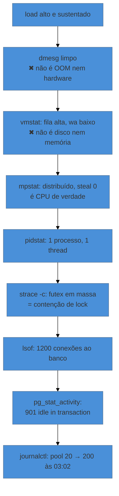

# Capstone — a máquina que ficou lenta às três da manhã

> [!abstract] TL;DR
> Uma investigação completa, do primeiro `uptime` à decisão — atravessando os quatro eixos, descartando três hipóteses plausíveis e terminando numa causa que não estava onde o sintoma apareceu. O que este capstone exercita não é o repertório de comandos: é a **ordem**, o hábito de eliminar uma hipótese por vez, e a disciplina de separar **contenção** (o que devolve o serviço agora) de **correção** (o que impede a repetição). As duas são necessárias, e confundi-las é o erro que faz o mesmo incidente voltar na semana seguinte.

---

## O chamado

> *"O checkout está lento desde umas três da manhã. Alguns pedidos demoram 30 segundos, outros passam normais. Ninguém fez deploy ontem."*

Três informações úteis já estão aí, e vale extrair antes de tocar em qualquer terminal:

- **"desde umas três"** — há uma janela temporal. Tudo que for investigado deve ser comparado contra o que havia antes dela.
- **"alguns sim, outros não"** — não é indisponibilidade, é degradação **intermitente**. Isso torna improvável causa binária (serviço caído, porta fechada) e provável saturação ou dependência lenta.
- **"ninguém fez deploy"** — enfraquece a hipótese de mudança na aplicação, sem eliminá-la. Mudança pode ter vindo de fora: dados, tráfego, ou uma máquina vizinha.

---

## Minuto 1 a 5 — triagem

O checklist da nota 12, sem pular a ordem.

```bash
$ uptime
 09:12:44 up 63 days,  load average: 14,82, 15,10, 9,44
```

Load alto e **sustentado** — o número de 5 minutos é próximo do de 1 minuto, então não é pico momentâneo. O de 15 minutos é menor, o que situa o começo dentro da última meia hora de crescimento. Ainda não se sabe de qual recurso.

```bash
$ dmesg -T | tail -20
# (nada relevante)
$ journalctl -k --since "03:00" | grep -iE "oom|error|i/o"
# (vazio)
```

**Hipótese descartada nº 1: não é OOM nem erro de hardware.** Se fosse, a nota 14 já teria fechado o caso aqui. Vale ter olhado — custa dois comandos e elimina a explicação mais grave.

```bash
$ vmstat 1 5
procs -----------memory---------- ---swap-- -----io---- -system-- ------cpu-----
 r  b   swpd   free   buff  cache   si   so    bi    bo   in   cs us sy id wa
14  0      0 1204336 128440 5820112   0    0    24    88 4210 9880 78 14  7  1
```

Agora o eixo aparece. `r` em 14 — quatorze processos na **fila de execução**, disputando CPU. `wa` em 1%, então não é espera por I/O. `si`/`so` em zero, então não é swap.

**Hipótese descartada nº 2: não é disco nem memória.** É CPU, e há disputa real.

```bash
$ mpstat -P ALL 1 3 | tail -6
CPU    %usr   %sys  %iowait  %steal  %idle
all   78,20  14,10     0,90    0,00    6,80
  0   79,00  13,50     1,00    0,00    6,50
  1   77,80  14,80     0,80    0,00    6,60
```

Distribuída por todos os núcleos, `%steal` zerado — não é vizinho barulhento em VM, o que a nota 13 ensinou a conferir cedo. E `%sys` em 14% é alto o suficiente para reparar: muito tempo dentro do kernel costuma indicar volume de chamadas de sistema, I/O de rede ou criação de processos.

---

## Minuto 5 a 15 — quem

```bash
$ pidstat 1 5
UID  PID    %usr %system  %CPU  Command
1001 3241  310,00   58,00 368,00  node
1001 3244   12,00    3,00  15,00  node
 999 1120    4,00    2,00   6,00  postgres
```

Um processo `node` consumindo o equivalente a quase quatro núcleos, enquanto os irmãos estão normais. **A carga está concentrada num único trabalhador**, não distribuída pela aplicação.

```bash
$ pidstat -t -p 3241 1 3 | head
      TID    %usr %system  %CPU
     3241    2,00    1,00   3,00
     3298  298,00   54,00 352,00     ← uma thread
```

Uma **thread** dentro dele responde por quase tudo. Isso é informação forte: descarta tráfego alto uniformemente distribuído — que apareceria espalhado — e sugere um trabalho específico em laço.

```bash
$ ss -s
Total: 1843 (kernel 0)
TCP:   1622 (estab 1580, closed 12, orphaned 0, timewait 8)
```

Conexões estabelecidas em número alto, mas estáveis. Não há acúmulo de `TIME_WAIT` nem de órfãs.

**Hipótese descartada nº 3: não é enxurrada de requisições novas.** A carga não bate com o número de conexões.

---

## Minuto 15 a 25 — o que ela está pedindo

Com o processo e a thread identificados, entra a nota 15 — com o cuidado que ela mesma recomenda, porque isto é produção:

```bash
$ sudo timeout 10 strace -c -f -p 3241
% time     seconds  usecs/call     calls    errors syscall
------ ----------- ----------- --------- --------- ----------------
 61,04    2,110455          21    100210           futex
 22,31    0,771302          15     51402           sendto
 11,80    0,408011          14     29140           recvfrom
```

Cem mil chamadas de `futex` em dez segundos. `futex` é o mecanismo de espera por lock — em volume assim, indica **contenção**: threads disputando o mesmo recurso interno. E `sendto`/`recvfrom` em número alto mostra tráfego de rede intenso saindo do processo.

```bash
$ sudo lsof -i -a -p 3241 | awk '{print $9}' | sort | uniq -c | sort -rn | head -3
   1204 10.0.3.44:5432
     18 10.0.9.12:6379
```

Mil e duzentas conexões abertas com o **banco**. Para um serviço de checkout, é muita coisa — e a essa altura a suspeita mudou de lugar: o problema aparece na aplicação, e a origem pode estar na relação dela com o banco.

---

## Minuto 25 a 40 — a causa

```bash
$ psql -h 10.0.3.44 -c "SELECT state, count(*) FROM pg_stat_activity GROUP BY state;"
 state                | count
----------------------+-------
 active               |   287
 idle in transaction  |   901
 idle                 |    16
```

Novecentas conexões em `idle in transaction` — transações abertas sem trabalho em andamento. É o achado.

O efeito em cadeia explica cada sintoma observado: transações abertas seguram locks e impedem a limpeza de versões antigas de linha, o que degrada as consultas; consultas mais lentas fazem a aplicação abrir mais conexões; mais conexões aumentam a disputa interna, que é o `futex` da etapa anterior; e o resultado, na ponta, é o pedido que demora trinta segundos — enquanto outro, que não toca as tabelas afetadas, passa normal.

E a janela temporal fecha o caso:

```bash
$ journalctl -u checkout --since "02:50" --until "03:20" | grep -iE "deploy|config|reload"
Aug 16 03:02:11 checkout[3241]: config reloaded: pool.max=200 (was 20)
```

**Às 03:02, o tamanho do pool de conexões foi alterado de 20 para 200** — por recarga de configuração, sem deploy. Foi por isso que "ninguém fez deploy" era verdade e irrelevante.

A causa raiz não é o pool grande em si: é que a aplicação tem um caminho que abre transação e não a fecha em algum ramo de erro. Com pool de 20, o defeito era invisível — as conexões eram devolvidas e reutilizadas rápido. Com 200, ele passou a acumular até degradar o banco.

> **O sintoma estava na máquina de aplicação; a causa estava numa configuração dela; e o dano acontecia no banco.** Nenhum dos três lugares, sozinho, contava a história.

---

> [!tip] Vídeo — investigações curtas, do mesmo formato deste capstone
> [**Linux Performance Troubleshooting Demos**](https://www.youtube.com/watch?v=rwVLa9me7e4) (grobelDev, ~11 min, EN) encadeia várias investigações curtas no mesmo formato usado aqui — sintoma relatado, comandos em ordem, conclusão —, o que o torna um bom exercício adicional depois deste capstone. Duas passagens acrescentam: uma investigação que termina numa aplicação presa em **laço infinito lendo um arquivo zero bytes por vez**, que é o tipo de achado que só aparece descendo até a chamada de sistema (nota 15); e a leitura de `si`/`so` diferentes de zero como sinal de que a memória de fato acabou, exatamente como a nota 13 trata. Ele também dá um detalhe de quem já fez isso a sério: ao amostrar com `perf`, usar **99 Hz em vez de 100** para não amostrar em sincronia com atividades periódicas do sistema e perder justamente o que se quer medir. **O que ele não cobre:** o encadeamento longo deste capstone, com hipóteses descartadas uma a uma e causa fora da máquina onde o sintoma apareceu.

## A decisão: contenção e correção não são a mesma coisa

**Contenção — agora, para devolver o serviço:**

```bash
# reverter a configuração para o valor anterior
# e encerrar as transações penduradas há mais de 5 minutos
psql -h 10.0.3.44 -c "SELECT pg_terminate_backend(pid) FROM pg_stat_activity
  WHERE state = 'idle in transaction' AND state_change < now() - interval '5 minutes';"
```

**Correção — depois, para não repetir:**

1. O defeito de transação não fechada, na aplicação — o achado real, que vai para quem a mantém, com as evidências desta investigação.
2. `idle_in_transaction_session_timeout` no banco, para que a mesma classe de defeito não derrube nada de novo.
3. Alerta sobre `idle in transaction`, que teria detectado isso em minutos em vez de horas — e isso é [[03-Dominios/Engenharia/Operação/index|Operação]], não este galho.
4. Revisar por que uma mudança de pool de 10× entrou por recarga sem revisão.

> [!warning] Parar na contenção é o erro que faz o incidente voltar
> Reverter a configuração devolve o serviço, e é tentador encerrar aí — o gráfico normalizou, o chamado fechou. Mas o defeito de transação continua lá, esperando a próxima vez que alguém aumentar o pool, ou que o tráfego cresça o suficiente para expor o mesmo comportamento com pool menor. **Contenção é obrigação imediata; correção é obrigação da semana.** Registrar as duas separadamente, com dono e prazo, é o que diferencia operação de apagar incêndio.

---

## O caminho percorrido, e de onde veio cada peça



| Passo | Nota |
|---|---|
| load average e o que ele inclui | 12 |
| descartar OOM e hardware | 14, 08 |
| escolher o eixo pelos sinais certos | 13 |
| achar processo e thread | 13 |
| ler o que ele pede ao kernel | 15 |
| descritores e conexões abertas | 03, 15 |
| correlacionar com o log, na janela | 08 |
| entender que a mudança veio por recarga | 06, 07 |

Nenhum passo exigiu ferramenta exótica. O que exigiu foi **não pular a ordem** — e, em cada bifurcação, gastar dois comandos para eliminar uma hipótese em vez de perseguir a primeira que pareceu promissora.

---

## O que este capstone deveria ter deixado

- **Método antes de ferramenta.** A sequência da nota 12 é o que impede a investigação de virar tentativa.
- **Eliminar é progresso.** Três hipóteses descartadas, cada uma com dois comandos, valeram mais que qualquer palpite.
- **Sintoma e causa raramente moram juntos.** A lentidão aparecia na aplicação; a causa estava numa configuração dela; o dano acontecia no banco.
- **`/proc` e as ferramentas que o formatam respondem quase tudo** — e, quando não bastam, `strace` recortado responde o resto.
- **Contenção ≠ correção.** As duas são obrigatórias, em prazos diferentes.
- **O que teria evitado** não é conhecimento de Linux: é alerta e revisão de mudança. O galho entrega o instrumento; a prática de operar é vizinha.

---

## Como explicar em inglês

"The value of a runbook isn't the commands, it's the order — and the discipline of eliminating one hypothesis at a time instead of chasing the first plausible one. In this case a sustained load turned out not to be OOM, not disk, not memory and not steal time; it was CPU contention traced to a single thread, then to twelve hundred database connections, then to nine hundred sessions idle in transaction — caused by a config reload that raised the pool tenfold and exposed a transaction leak that a smaller pool had been hiding. The symptom was on the app host, the cause was in its config, and the damage was in the database. And containment isn't the fix: reverting the config returns the service, but the leak is still there."

| PT | EN |
|---|---|
| triagem | triage |
| degradação intermitente | intermittent degradation |
| descartar hipótese | to rule out a hypothesis |
| contenção de lock | lock contention |
| causa raiz | root cause |
| contenção (medida imediata) | containment / mitigation |
| janela temporal | time window |

---

## O que vem a seguir

Este capstone fecha o galho de Linux e, com ele, o domínio de Infraestrutura — Docker, Kubernetes, Nginx e Linux, as quatro ferramentas por dentro, para quem já vai operá-las.

- [[03-Dominios/Tecnologia/Infraestrutura/index|Infraestrutura]] — o mapa do domínio e o sanduíche de quatro camadas.
- [[03-Dominios/Engenharia/Operação/index|Engenharia/Operação]] — o ofício: SLO, alerta, resposta a incidente e postmortem. É o passo seguinte natural de quem terminou este galho.
- [[03-Dominios/Ciência/Sistemas Operacionais/index|Ciência/Sistemas Operacionais]] — o mecanismo por baixo de tudo o que aqui foi lido pelos sintomas.
- [[03-Dominios/Engenharia/Arqueologia e Restauração de Software/index|Arqueologia e Restauração de Software]] — quando a máquina herdada vem junto com um sistema que ninguém entende.

## Fontes

- **Brendan Gregg** — *Systems Performance*, 2ª ed., cap. 2 — metodologias de investigação, incluindo por que eliminar hipóteses supera perseguir sintomas.
- **Brendan Gregg** — [*Linux Performance Analysis in 60,000 Milliseconds*](https://netflixtechblog.com/linux-performance-analysis-in-60-000-milliseconds-accc10403c55) — o checklist que abre a triagem.
- **PostgreSQL** — [*The Statistics Collector — pg_stat_activity*](https://www.postgresql.org/docs/current/monitoring-stats.html) — os estados de sessão, incluindo `idle in transaction`.
- **PostgreSQL** — [*idle_in_transaction_session_timeout*](https://www.postgresql.org/docs/current/runtime-config-client.html) — a proteção citada na correção.
