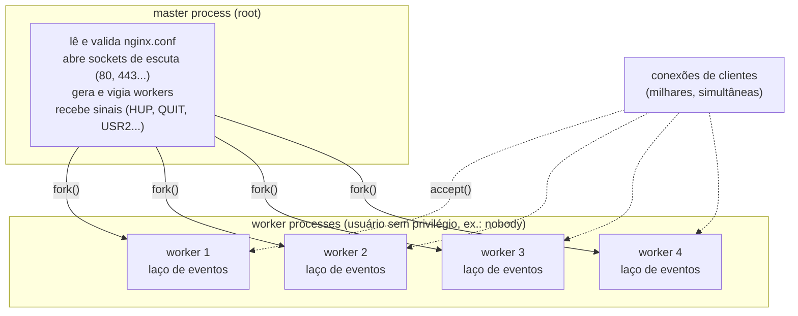
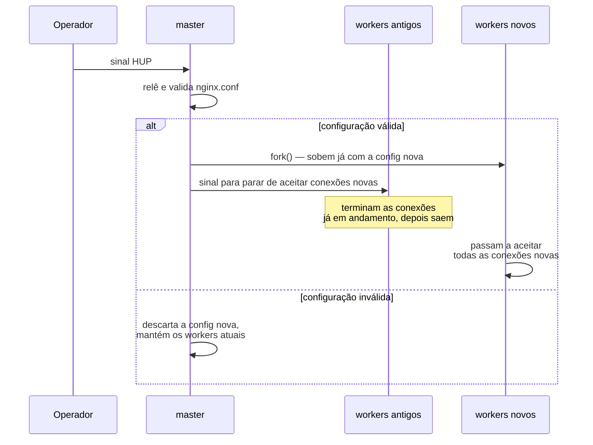
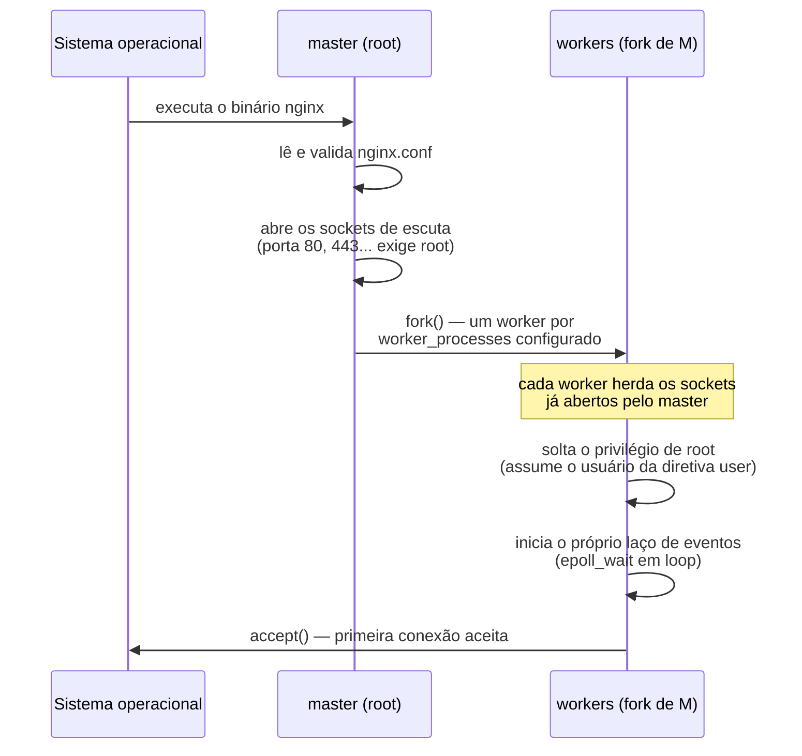
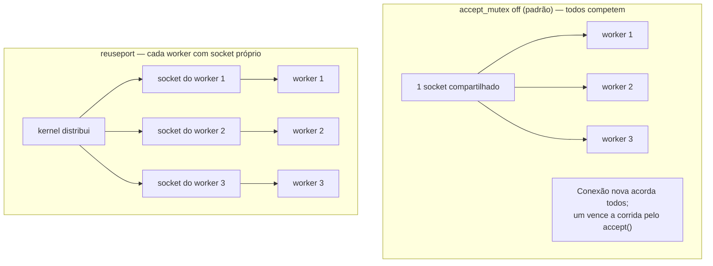

# 01 — O problema que o Nginx resolve

> [!abstract] TL;DR
> Um servidor que atende dez mil conexões simultâneas com o modelo clássico de um processo (ou uma thread) por conexão paga por todas as dez mil, mesmo que só um punhado esteja de fato trocando bytes num dado instante — memória reservada, pilha alocada, e o kernel trocando contexto entre elas o tempo todo. Esse é o problema C10K, e é o motivo pelo qual o Nginx existe. A resposta não é mais hardware: é trocar "uma thread por conexão" por "um laço de eventos não bloqueante multiplexando milhares de conexões dentro de poucos processos". Um `master` privilegiado lê a configuração, abre os sockets e vigia um punhado de `worker` sem privilégio, que fazem todo o trabalho de aceitar e processar request — e é exatamente essa divisão de papéis, mais do que qualquer otimização de I/O, que torna possível recarregar configuração em produção sem derrubar uma única conexão em andamento. O ponto cego do modelo, e a peça que explica quase todo comportamento estranho do Nginx daqui em diante, é que esse laço de eventos só é rápido enquanto nada dentro dele bloqueia.

Imagine um servidor web clássico, do tipo que gera um processo do sistema operacional — ou, na melhor das hipóteses, uma thread — para cada conexão TCP que chega. Cem conexões simultâneas custam cem processos; a memória por processo, o overhead de pilha, os descritores de arquivo abertos, tudo multiplicado por cem. O sistema operacional aguenta isso sem esforço. Mil conexões já começam a doer: o kernel está trocando contexto entre mil entidades agendáveis, e cada troca de contexto é tempo de CPU que não vai para servir request nenhuma — sem falar na memória: uma thread num sistema Linux típico reserva, por padrão, alguns megabytes de espaço de pilha, então mil threads ociosas já significam gigabytes de memória comprometida antes mesmo de qualquer uma delas processar um único byte de dado real. Dez mil conexões simultâneas — um número nada exótico para qualquer site com tráfego real, ainda mais contando as conexões *keep-alive* que ficam abertas e ociosas entre uma request e a próxima — e o servidor simplesmente não escala mais: fica sem memória, sem descritores de arquivo disponíveis, ou gastando mais tempo trocando de contexto do que processando qualquer coisa. É crucial notar o detalhe que torna esse problema traiçoeiro: a maior parte dessas dez mil conexões está **ociosa** na maior parte do tempo — um cliente que abriu a conexão e está lendo a página, um keep-alive esperando a próxima request. Um processo ocioso ainda ocupa memória, ainda é uma entidade que o kernel precisa agendar, ainda aparece na contagem de descritores de arquivo abertos do sistema. O custo do modelo clássico não é proporcional ao trabalho feito num dado instante; é proporcional ao número de conexões abertas, trabalhando ou não.

Vale insistir num ponto antes de seguir, porque é a armadilha de raciocínio mais comum diante desse tipo de teto: a resposta óbvia — "põe mais memória, mais CPU, mais máquina" — ataca o sintoma, não a causa. Dobrar a RAM de um servidor rodando o modelo de thread-por-conexão dobra o número de threads ociosas que ele consegue sustentar, mas não muda a relação fundamental entre "conexão aberta" e "custo pago" — o problema volta, só que num número maior de conexões, assim que o tráfego crescer de novo. O que realmente resolve o problema é mudar essa relação: fazer com que uma conexão ociosa custe, na prática, quase nada, para que o número de conexões abertas deixe de ser a variável que limita a escala. É exatamente essa mudança de relação — não uma otimização incremental do modelo antigo — que a arquitetura do Nginx entrega.

Esse é, historicamente, o **problema C10K** — o desafio de fazer um único servidor sustentar dez mil conexões simultâneas sem que o custo por conexão inviabilize a escala. O Nginx nasceu explicitamente para resolvê-lo: Igor Sysoev começou a desenvolvê-lo em 2002 e o lançou publicamente em 2004, justamente para atender a essa exigência de escala — o próprio software chegou a servir 500 milhões de requests por dia para o portal russo Rambler já em 2008. A resposta de design que ele escolheu foi radical para a época: abandonar o modelo de "uma thread por conexão" e adotar uma arquitetura **orientada a eventos**, assíncrona, em vez de threads — o resultado prático, hoje bem documentado, é que dez mil conexões HTTP mantidas em keep-alive e ociosas custam ao Nginx algo da ordem de poucos megabytes no total, não os gigabytes que o modelo de thread-por-conexão exigiria para o mesmo número. Esse é o eixo em torno do qual toda a arquitetura do Nginx gira, e é o assunto desta nota.

| | Thread-por-conexão | Nginx (laço de eventos) |
|---|---|---|
| Unidade que representa uma conexão | Thread do sistema operacional | Entrada numa estrutura de dados em memória |
| Custo de uma conexão ociosa | Pilha de thread inteira reservada | Poucos bytes de estado |
| 10.000 conexões keep-alive ociosas | Ordem de gigabytes de memória | Ordem de poucos megabytes no total |
| O que o kernel agenda | Uma entidade por conexão | Um processo por *worker* (poucos, não milhares) |
| Onde o paralelismo real acontece | Entre threads, uma por conexão | Entre `worker_processes`, um por núcleo de CPU |

Essa tabela não é uma comparação entre "bom" e "ruim" em abstrato — é a mesma pergunta, respondida por dois modelos de concorrência diferentes: quem representa uma conexão, e quanto essa representação custa quando ela não está fazendo nada. Todo o resto desta nota é a implementação concreta, dentro do Nginx, da coluna da direita.

## A ideia central: conexão deixa de ser thread e vira estado

A virada de design é simples de enunciar e profunda em consequência: em vez de uma thread do sistema operacional dedicada a cada conexão — bloqueada, esperando dados chegarem, e ocupando sua fatia de memória e agendamento o tempo inteiro em que está esperando —, um único processo do Nginx mantém um **laço de eventos** que monitora milhares de conexões ao mesmo tempo, e só gasta tempo de CPU em uma conexão específica no instante exato em que há algo de fato para fazer nela: dados chegaram para ler, o buffer de saída está livre para escrever, a conexão fechou. Cada conexão, entre um evento e o próximo, não é uma thread dormindo — é só uma entrada numa estrutura de dados, um punhado de bytes de estado (em que fase do processamento está, que buffers tem associados, se está esperando o cliente ou esperando um upstream) que o laço de eventos consulta quando o kernel avisa que algo mudou. Não existe pilha de execução reservada, nem contexto de sistema operacional dedicado, para uma conexão parada esperando o próximo pacote — existe só essa entrada, tão barata quanto uma pequena estrutura em memória.

Esse "avisar quando algo muda" é o papel de um mecanismo de multiplexação de I/O do sistema operacional — `epoll` no Linux, `kqueue` em sistemas BSD — que permite a um único processo perguntar ao kernel "me avise quando qualquer uma destas dez mil conexões tiver algo pronto para ler ou escrever", em vez de ter que verificar uma por uma, ou pior, manter uma thread bloqueada em cada uma esperando. O worker do Nginx registra, junto ao kernel, o conjunto de descritores de arquivo (cada conexão TCP é, no fim, um descritor de arquivo) que ele quer monitorar, e então faz uma única chamada bloqueante — `epoll_wait`, no caso do Linux — que só retorna quando pelo menos um desses descritores tem algo pronto. O laço processa os descritores prontos, um a um, sem bloquear em nenhum deles individualmente, e volta a chamar `epoll_wait` para esperar o próximo lote de eventos. É esse ciclo — esperar eventos, processar os que chegaram, voltar a esperar — que constitui o laço de eventos de cada worker, repetido indefinidamente enquanto o processo estiver vivo.

A teoria por trás desse modelo de concorrência — o porquê de um laço de eventos não-bloqueante conseguir fazer o trabalho de milhares de threads com uma fração do custo, e as trocas que esse modelo faz em relação a paralelismo real — está desenvolvida com profundidade em [[03-Dominios/Ciência/Concorrência e Paralelismo/14 - Loop de eventos e assincronia|Loop de eventos e assincronia]]; a distinção fundamental entre processo e thread como unidades de execução do sistema operacional, que explica por que o Nginx escolhe processos (não threads) como unidade de paralelismo entre workers, está em [[03-Dominios/Ciência/Concorrência e Paralelismo/02 - Processos e threads|Processos e threads]] e em [[03-Dominios/Ciência/Sistemas Operacionais/03 - Processos|Processos]]; e o mecanismo de multiplexação de I/O em si, o que `epoll`/`kqueue` de fato fazem por dentro do kernel, está em [[03-Dominios/Ciência/Sistemas Operacionais/10 - I-O e o subsistema de entrada e saída|I/O e o subsistema de entrada e saída]]. Esta nota não reexplica essa teoria — ela mostra como o Nginx a **implementa**: quantos laços de eventos existem, quem os administra, e o que acontece quando essa implementação encontra seus próprios limites.

Vale desenhar o ciclo em si, porque é curto e se repete exatamente da mesma forma bilhões de vezes ao longo da vida de um worker — não há mistério escondido em nenhuma etapa dele, só repetição disciplinada:


Repare no que esse desenho deixa implícito: entre uma chamada a `epoll_wait` e a próxima, o worker pode estar processando dezenas de conexões diferentes, uma logo depois da outra, todas no tempo que levaria para processar uma única conexão num modelo de thread bloqueante. É esse entrelaçamento — processar um pedaço da conexão A, um pedaço da conexão B, voltar para A quando ela tiver mais dados — que permite a um processo só sustentar milhares de conexões simultâneas sem paralelismo real de hardware por trás de cada uma: não é que o worker está fazendo várias coisas ao mesmo tempo no sentido literal, é que nenhuma conexão ocupa o worker por mais tempo do que o estritamente necessário para processar o evento que a trouxe até ali.

Essa é, também, a razão pela qual uma conexão lenta do lado do cliente — um usuário numa rede móvel ruim, recebendo a resposta em pedacinhos ao longo de vários segundos — não é um problema estrutural para esse modelo, desde que nada dentro do processamento dela bloqueie o worker: enquanto os dados não estiverem prontos para aquele cliente específico, o worker simplesmente não gasta ciclo nenhum nela, e usa o tempo livre para atender qualquer outra conexão que tenha algo pronto. O custo de uma conexão lenta, nesse modelo, é tempo de vida da conexão — ela fica mais tempo ocupando uma entrada na tabela de conexões do worker —, não tempo de CPU gasto ativamente nela.

## Master e worker: duas responsabilidades que não se sobrepõem

O Nginx, ao subir, não é um processo só — é uma família de processos com papéis estritamente separados. O **master process** faz um conjunto pequeno e bem definido de tarefas administrativas: lê e valida a sintaxe do arquivo de configuração, abre os sockets de escuta (as portas em que o Nginx vai aceitar conexões), gera os processos `worker` e os mantém vivos, e recebe os sinais do sistema operacional que controlam o ciclo de vida do servidor. O master nunca atende uma request de cliente — ele nasce como o processo que iniciou o Nginx, tipicamente rodando como `root`, e é justamente esse privilégio que permite ao master abrir sockets em portas privilegiadas: a porta 80 e a 443, ambas abaixo de 1024, exigem privilégio de root no Linux para serem vinculadas por qualquer processo.

Os **worker processes**, em contraste, são quem de fato faz o trabalho: aceitam as conexões TCP que chegam nos sockets que o master já abriu, leem a request, avaliam contra a configuração, fazem proxy para um backend se for o caso, servem um arquivo estático, escrevem a resposta. E é aqui que a separação de privilégio se torna concreta: os workers rodam sob o usuário e grupo definidos pela diretiva `user` — cujo valor padrão documentado é `nobody nobody` nas versões OSS do Nginx, embora praticamente toda distribuição empacotada substitua esse padrão por um usuário dedicado (`www-data`, `nginx`) na sua própria configuração já na instalação. O master abre a porta privilegiada como root; os workers, que são quem processa dados vindos diretamente da internet — a superfície de ataque real —, rodam sem privilégio nenhum. Se um worker for comprometido por uma falha de processamento de request, o dano fica contido pelas permissões de um usuário sem privilégio, e nunca chega a expor o socket em si ou o sistema de arquivos com os privilégios que abriram a porta.



### O que cada sinal enviado ao master de fato dispara

O master não é controlado por uma API própria ou por um protocolo de gerência exótico — é controlado do jeito mais tradicional possível em sistemas Unix, por **sinais** enviados ao seu PID. Vale conhecer o vocabulário completo, porque cada um desses sinais aparece em algum ponto de operação real do Nginx, e confundir um com outro tem consequência prática:

| Sinal | Efeito no master |
|---|---|
| `TERM`, `INT` | Encerramento rápido — workers são derrubados imediatamente, conexões em andamento são cortadas |
| `QUIT` | Encerramento gracioso — workers param de aceitar conexões novas e terminam as que já tinham, então saem |
| `HUP` | Recarrega a configuração — valida, abre os novos sockets necessários, sobe workers novos e desliga os antigos graciosamente |
| `USR1` | Reabre os arquivos de log — usado depois de uma rotação de log externa (`logrotate`), sem precisar reiniciar nada |
| `USR2` | Faz upgrade do binário do Nginx em execução, sem derrubar o servidor |
| `WINCH` | Desliga os workers graciosamente, mantendo o master vivo — passo intermediário do upgrade via `USR2` |

O par `USR2`/`WINCH` merece uma palavra à parte, porque é o mecanismo menos conhecido da tabela e o que mais depende diretamente da separação entre master e worker discutida nesta nota: trocar o **binário** do Nginx em execução — para uma versão nova, por exemplo — sem nunca fechar a porta de escuta. `USR2` instrui o master atual a executar um novo binário do Nginx, que sobe como um segundo master, herdando os mesmos sockets de escuta já abertos, e passa a gerar seus próprios workers ao lado dos workers do master antigo — os dois conjuntos, do binário velho e do binário novo, atendendo tráfego ao mesmo tempo, na mesma porta. Só depois de confirmar que o master novo está saudável é que `WINCH` é enviado ao master antigo, desligando graciosamente os workers dele; o master antigo em si só é finalizado por último, com `QUIT`. É a mesma lógica do reload de configuração via `HUP` — nunca derrubar o que está funcionando antes de confirmar que o substituto funciona —, só que aplicada ao binário inteiro, não só à configuração que ele lê.

Vale nomear com precisão por que essa separação de responsabilidades — e não alguma técnica exótica de I/O — é o que torna possível recarregar a configuração do Nginx **sem derrubar uma única conexão em andamento**, um comportamento que costuma parecer mágico na primeira vez que alguém o observa em produção. Quando o master recebe `HUP`, ele relê e revalida a configuração, abre os novos sockets que essa configuração exigir, e então inicia um novo conjunto de workers já rodando com a configuração nova — enquanto os workers antigos continuam vivos, param de aceitar conexões novas, mas terminam de atender as conexões que já tinham em andamento antes de sair. Se a validação da configuração nova falhar, o master simplesmente não sobe workers novos e continua operando com a configuração antiga — o reload falha de forma segura, sem jamais deixar o servidor num estado parcialmente configurado. Não existe, em nenhum momento desse processo, um único processo tentando trocar sua própria configuração enquanto atende tráfego: existem workers velhos morrendo de velhice natural e workers novos nascendo já corretos, e o master orquestrando a transição entre um conjunto e outro.



É essa arquitetura de processos curtos e substituíveis, com o master como orquestrador estável no meio, que faz o reload gracioso ser possível em primeiro lugar. Existe, ainda, uma rede de segurança para o caso de um worker antigo nunca conseguir drenar suas conexões sozinho — por exemplo, uma conexão de longa duração, como um WebSocket, que nunca fecha por conta própria: a diretiva `worker_shutdown_timeout`, sem valor padrão embutido (ou seja, sem limite de tempo a menos que configurada explicitamente), define um prazo após o qual o worker que está sendo desligado força o fechamento de todas as conexões que ainda tiver abertas, em vez de esperar indefinidamente por elas. A mecânica exata do sinal `HUP` em maior detalhe, o comportamento de rollback quando a configuração nova falha validação, e como diagnosticar um reload que não converge são assunto da nota [[03-Dominios/Tecnologia/Infraestrutura/Nginx/13 - Tuning e diagnóstico|13 — Tuning e diagnóstico]].

> [!info] Baseline de versão
> Esta nota, e o restante do galho, toma como baseline a linha mainline 1.31.3 (lançada em 15 de julho de 2026) e a linha stable 1.30.4 do Nginx open source. Onde um comportamento ou um valor padrão for específico de versão, o texto sinaliza explicitamente.

A distinção entre as duas linhas — mainline e stable — não é um detalhe de rodapé: mainline recebe funcionalidades novas e correções continuamente, enquanto stable só recebe correções de bugs críticos e de segurança, sem novos recursos, sendo a recomendação padrão para quem prioriza previsibilidade de comportamento em produção sobre acesso antecipado a funcionalidades novas. Boa parte das diretivas citadas ao longo desta nota — `reuseport`, `aio threads`, `worker_cpu_affinity auto` — já estão presentes em ambas as linhas há várias versões, o que as torna seguras de usar independentemente de qual das duas o ambiente-alvo segue.

### Vendo a família de processos com as próprias mãos

Não é preciso confiar de fé nesse modelo de dois papéis — dá para observá-lo diretamente em qualquer máquina com Nginx instalado. Rodar `ps aux | grep nginx` (ou, num sistema com `systemd`, `ps -ef --forest | grep nginx` para ver a árvore de processos) tipicamente mostra algo como:

```
root       1234  0.0  0.1  55000  1800 ?  Ss  10:00  0:00 nginx: master process /usr/sbin/nginx
www-data   1235  0.0  0.3  55400  3200 ?  S   10:00  0:01 nginx: worker process
www-data   1236  0.0  0.3  55400  3180 ?  S   10:00  0:01 nginx: worker process
www-data   1237  0.0  0.3  55400  3210 ?  S   10:00  0:01 nginx: worker process
www-data   1238  0.0  0.3  55400  3190 ?  S   10:00  0:01 nginx: worker process
```

O primeiro campo de cada linha é o usuário do sistema operacional dono do processo, e é exatamente aqui que a separação de privilégio descrita nesta nota fica visível sem nenhuma abstração no meio: um único processo rodando como `root` (o master, PID 1234), e um punhado de processos rodando como `www-data` (os workers) — o número de workers, no exemplo, batendo com o número de núcleos que `worker_processes auto` detectou naquela máquina. `nginx -V` (com V maiúsculo) devolve, entre outras coisas, os módulos com que aquele binário foi compilado, incluindo se o suporte a threads (`--with-threads`) está presente — um pré-requisito, retomado mais adiante nesta nota, para o pool de threads que resolve I/O de disco bloqueante.

### Do binário no disco ao primeiro `accept()`

Vale seguir, passo a passo, o que acontece entre rodar `nginx` (ou o `systemctl start nginx` que faz a mesma coisa por baixo) e o servidor de fato aceitar sua primeira conexão — porque é essa sequência que explica por que o master precisa existir antes de qualquer worker, e não o contrário.



Repare no detalhe que costuma passar despercebido: os workers não abrem seus próprios sockets de escuta — eles **herdam** os sockets que o master já tinha aberto antes do `fork()`. É por isso que o privilégio de abrir uma porta abaixo de 1024 só precisa existir uma vez, no master, no exato instante em que o socket é criado; todo worker nascido depois já recebe aquele socket pronto, sem nunca precisar de privilégio de root para usá-lo. A ordem importa: primeiro o master abre o socket como root, só depois ele soltam a família de workers, e cada worker, assim que nasce, já assume o usuário sem privilégio antes de processar qualquer byte vindo da rede.

## Os processos auxiliares: cache manager e cache loader

Além do master e dos workers, um Nginx configurado com cache em disco (via `proxy_cache_path`) sobe dois processos auxiliares adicionais, ambos administrativos, nenhum dos dois atendendo request de cliente diretamente. O **cache loader** roda uma única vez, pouco depois da inicialização do Nginx, e sua única função é ler os metadados dos arquivos de cache já existentes em disco — de execuções anteriores — e povoar com eles a zona de memória compartilhada que indexa o cache, para que os workers não precisem redescobrir o cache existente request por request; ele processa esse trabalho em iterações curtas (por padrão, até 100 itens ou 200ms por iteração, o que vier primeiro), com pequenas pausas entre elas, para não competir pesado com os workers logo na inicialização. O **cache manager** roda continuamente durante toda a vida do processo Nginx, também em ciclos curtos e com os mesmos limites por iteração, com uma única responsabilidade: manter o cache dentro do tamanho máximo configurado, removendo as entradas menos recentemente usadas quando o limite é ultrapassado. Nenhum dos dois processa uma request HTTP — a decisão de servir uma resposta a partir do cache, ou de buscá-la no backend e gravá-la, acontece dentro do worker que está atendendo aquela conexão, não nesses dois processos auxiliares. A mecânica de zonas de cache, chave de cache e os detalhes finos de configuração desses dois processos são assunto da nota [[03-Dominios/Tecnologia/Infraestrutura/Nginx/10 - Cache no Nginx|10 — Cache no Nginx]]; o que importa reter aqui é só que eles existem, são processos à parte do laço de eventos que atende tráfego, e sua existência é mais uma prova do mesmo princípio arquitetural que rege o master e os workers: cada processo do Nginx tem um papel estreito e bem definido, e nada faz duas coisas ao mesmo tempo dentro do mesmo laço.

### A peça que amarra tudo isso: memória compartilhada entre processos

Vale nomear, ainda que de passagem, o mecanismo que torna útil ter vários processos independentes trabalhando sobre o mesmo cache, ou sobre os mesmos contadores de limite de taxa, sem que cada um viva numa realidade isolada da dos outros: **zonas de memória compartilhada**, declaradas explicitamente na configuração via um parâmetro `zone` — visível, por exemplo, no `keys_zone` de `proxy_cache_path`, que aparece na configuração do cache manager e do cache loader descritos acima. Uma zona de memória compartilhada é uma região alocada pelo master antes de qualquer worker nascer, e por isso acessível igualmente por todos os processos que a herdam via `fork()` — cache manager, cache loader, e cada worker individual leem e escrevem na mesma zona sem precisar de nenhum protocolo de rede entre si, porque não são processos que trocam mensagens: são processos que compartilham memória física diretamente. É esse mesmo mecanismo, generalizado, que sustenta o índice de cache detalhado na nota [[03-Dominios/Tecnologia/Infraestrutura/Nginx/10 - Cache no Nginx|10 — Cache no Nginx]] e os contadores de limitação de taxa que sustentam `limit_req` e `limit_conn`, tema de uma nota mais adiante no galho sobre limitar e comprimir tráfego — nos dois casos, o problema de fundo é o mesmo: múltiplos workers, cada um em seu próprio espaço de memória isolado por padrão, precisando concordar sobre um único estado compartilhado (quantas requests aquele IP já fez, quais URLs já estão em cache) sem que cada worker precise perguntar aos outros.

## Quantos workers, e o teto de conexões que eles sustentam

A diretiva que controla quantos processos `worker` o master sobe é `worker_processes`, e seu padrão documentado é `worker_processes 1` — um único worker, a menos que a configuração diga o contrário. Na prática, praticamente toda configuração de produção usa `worker_processes auto`, que instrui o Nginx a tentar detectar automaticamente o número de núcleos de CPU disponíveis e subir um worker por núcleo. Faz sentido: cada worker é single-threaded no seu laço de eventos principal, então um worker por núcleo é o que permite ao Nginx de fato usar todos os núcleos disponíveis da máquina em paralelo, em vez de deixar núcleos ociosos enquanto um único worker processa tudo sozinho — mais workers do que núcleos, ao contrário do que a intuição sugere, não acelera nada, e a seção de armadilhas comuns retoma esse ponto com mais detalhe.

Cada worker, por sua vez, tem um teto de quantas conexões simultâneas ele está disposto a manter abertas — a diretiva `worker_connections`, cujo padrão documentado é `worker_connections 512`, definida dentro do bloco `events`. Esse número não é um limite arbitrário de política: ele soma **todas** as conexões que aquele worker mantém, não só as conexões de clientes. Se o Nginx está fazendo proxy reverso para um backend, cada request em andamento consome **duas** conexões daquele worker — a conexão com o cliente e a conexão com o servidor upstream —, não uma. Um bloco de configuração típico expõe as duas diretivas lado a lado:

```nginx
worker_processes auto;

events {
    worker_connections 4096;
}
```

Com essas duas diretivas, o teto teórico de conexões simultâneas do servidor inteiro é `worker_processes × worker_connections`. Vale fazer a conta com números concretos, porque é exatamente o tipo de tabela que separa quem sabe a fórmula de quem sabe aplicá-la a uma decisão de capacidade real:

| Cenário | Núcleos (workers) | `worker_connections` | Teto bruto de conexões | Teto real de requests de proxy simultâneas |
|---|---|---|---|---|
| Servidor pequeno, servindo estático puro | 2 | 1024 | 2.048 | 2.048 (estático usa 1 conexão por request) |
| Mesmo servidor, agora como proxy reverso | 2 | 1024 | 2.048 | 1.024 (cada request custa 2 conexões) |
| Servidor de médio porte, proxy reverso | 4 | 4096 | 16.384 | 8.192 |
| Servidor de médio porte, `worker_connections` dobrado sem revisar o motivo | 4 | 8192 | 32.768 | 16.384 |

A coluna mais à direita é a que costuma faltar em qualquer estimativa de capacidade feita às pressas: em uma máquina de quatro núcleos com `worker_connections 4096`, o teto bruto de 16.384 soa generoso, mas se o Nginx estiver atuando como proxy reverso puro, o teto real de requests de proxy simultâneas por worker é a metade do valor de `worker_connections`, não o valor cheio — porque cada request em andamento ocupa duas entradas na contagem daquele worker, uma para o cliente e uma para o upstream. Servir arquivo estático não paga esse preço — uma request estática usa só a conexão com o cliente —, mas qualquer configuração que mistura proxy com servir estático numa mesma instância precisa somar as duas contas, não assumir a mais otimista.

Vale nomear, ainda dentro deste ponto, uma diretiva menos citada mas relevante para quem está espremendo o máximo de uma máquina dedicada: `worker_cpu_affinity`, que fixa cada worker a um núcleo de CPU específico, em vez de deixar o escalonador do sistema operacional livre para mover o worker entre núcleos ao longo do tempo. Sem valor padrão embutido (workers não são fixados a nenhum núcleo específico por padrão), a diretiva aceita tanto máscaras de bit explícitas por worker quanto o parâmetro `auto`, disponível desde a versão 1.9.10, que faz essa distribuição automaticamente:

```nginx
worker_processes    auto;
worker_cpu_affinity auto;
```

O ganho de fixar cada worker a um núcleo fixo é evitar que o mesmo worker seja movido de núcleo em núcleo pelo escalonador, o que invalidaria repetidamente os dados que aquele núcleo já tinha em cache de CPU sobre o trabalho daquele worker — um ajuste fino, não estrutural, que só costuma valer a pena em máquinas dedicadas de alto tráfego, e que a nota 13 retoma junto com o resto do tuning. Vale lembrar também que `worker_connections` não é o teto absoluto: o número real de conexões simultâneas que um worker consegue abrir também está limitado pelo teto de descritores de arquivo do sistema operacional para aquele processo, ajustável via `worker_rlimit_nofile` — uma diretiva sem valor padrão embutido (herda o limite do sistema operacional a menos que seja definida explicitamente), e que existe justamente para permitir subir esse teto sem precisar reiniciar o processo principal do sistema operacional inteiro. Configurar `worker_connections` acima do teto de descritores de arquivo do sistema não trava nada de imediato — a diretiva é aceita normalmente na validação —, mas o worker simplesmente não consegue abrir mais conexões do que seu teto real de descritores permite quando a carga de fato chegar lá, e o sintoma nesse ponto costuma ser conexões recusadas silenciosamente, sem nenhum erro de configuração visível:

```nginx
# main context — sobe o teto de descritores de arquivo do worker
worker_rlimit_nofile 65535;

events {
    worker_connections 32768;
}
```

O tuning fino desses dois números sob carga real — incluindo como diagnosticar, no sistema operacional, se o teto que está sendo atingido é o de `worker_connections` ou o de descritores de arquivo do processo — é assunto da nota [[03-Dominios/Tecnologia/Infraestrutura/Nginx/13 - Tuning e diagnóstico|13 — Tuning e diagnóstico]].

### Vendo o teto se aproximar em tempo real

O módulo `stub_status`, quando habilitado, expõe exatamente os números que essa conta teórica está tentando prever, direto do estado interno do Nginx:

```nginx
location = /basic_status {
    stub_status;
}
```

Consultar essa rota (`curl http://localhost/basic_status`) devolve algo como:

```
Active connections: 291
server accepts handled requests
 16630948 16630948 31070465
Reading: 6 Writing: 179 Waiting: 106
```

`Active connections` é a soma de tudo que está em andamento naquele instante — lendo o cabeçalho da request (`Reading`), escrevendo a resposta (`Writing`), ou parada em keep-alive esperando a próxima request do mesmo cliente (`Waiting`). O par `accepts`/`handled` na segunda linha é o que denuncia, sem ambiguidade, quando o teto configurado foi de fato atingido: os dois números começam iguais, e só divergem quando o Nginx aceitou uma conexão TCP no nível do socket mas não conseguiu processá-la — tipicamente porque `worker_connections` (ou o teto de descritores de arquivo por trás dele) já estava saturado no worker que a recebeu. Ver `handled` ficar sistematicamente atrás de `accepts`, crescendo a distância entre os dois ao longo do tempo, é o sinal mais direto de que a conta de capacidade feita na configuração já não corresponde à carga real — o próximo passo, nesse cenário, é a nota 13.

## Como os workers dividem as conexões que chegam

Com vários workers escutando o mesmo socket, existe uma pergunta de design que precisa de resposta: quando uma conexão nova chega, qual worker a atende? O comportamento padrão documentado do Nginx é `accept_mutex off` — cada evento de conexão nova é notificado a todos os workers que compartilham aquele socket de escuta, e eles competem pela chamada `accept()` que de fato pega a conexão, sem coordenação explícita entre eles. Existe também a diretiva `accept_mutex`, que, quando ligada, faz os workers se revezarem — só um por vez tenta aceitar conexões novas durante um intervalo, controlado por `accept_mutex_delay` (padrão de 500ms) — evitando que todos os workers acordem ao mesmo tempo para disputar uma única conexão nova, o efeito conhecido em sistemas concorrentes como *thundering herd*. A documentação oficial é explícita sobre quando esse mutex deixa de ser necessário: em sistemas que suportam a flag `EPOLLEXCLUSIVE` do Linux (disponível desde a versão 1.11.3 do Nginx), ou quando a opção `reuseport` está em uso, não há necessidade de ligar `accept_mutex` — o próprio kernel já resolve a distribuição sem que o Nginx precise coordenar nada por conta própria.

Esse padrão vale a pena guardar com a data colada nele, porque é uma das divergências mais comuns entre a documentação oficial e o material de terceiros. **Até a versão 1.11.3, o padrão de `accept_mutex` era `on`** — foi a chegada do `EPOLLEXCLUSIVE`, na mesma versão, que tornou a coordenação em espaço de usuário desnecessária no Linux e permitiu inverter o padrão para `off`. Boa parte dos tutoriais, respostas de fórum e arquivos de configuração herdados que circulam por aí foi escrita antes dessa inversão, e continua afirmando que o padrão é `on`, às vezes recomendando explicitamente ligá-lo "para evitar thundering herd". Diante de uma configuração alheia que traz `accept_mutex on;` escrito à mão, a leitura mais provável não é que alguém mediu e decidiu — é que o valor foi copiado de material anterior a 2016 e nunca revisto.

A alternativa mais moderna, e hoje a recomendação de fato para distribuir carga entre workers, é o parâmetro `reuseport` da diretiva `listen`, disponível desde a versão 1.9.1 do Nginx. Em vez de todos os workers competirem por um único socket compartilhado, `reuseport` instrui o Nginx a criar um socket de escuta **individual para cada worker**, usando a opção `SO_REUSEPORT` do kernel (disponível em Linux 3.9+, e em variações equivalentes noutros sistemas como FreeBSD 12+ e DragonFly BSD). Com um socket próprio por worker, é o próprio kernel quem distribui as conexões novas entre eles, sem a etapa intermediária de todos competirem pela mesma chamada `accept()` — menos contenção, melhor distribuição sob carga alta, e sem o custo de coordenação que `accept_mutex` introduz. A documentação também sinaliza uma ressalva de segurança ao usar `reuseport`: como qualquer processo com privilégio suficiente pode, em tese, se ligar à mesma porta com essa opção, seu uso inapropriado fora do contexto de uma única aplicação controlada pode ter implicações que vale considerar antes de habilitá-la de forma automática em ambientes multi-inquilino.

```nginx
server {
    listen 443 ssl reuseport;
    # ...
}
```



Vale reter a diferença estrutural entre as duas abordagens antes de escolher uma: `accept_mutex` (ou seu equivalente automático via `EPOLLEXCLUSIVE`) resolve o problema de "todo mundo acorda para uma única conexão" coordenando os workers entre si sobre um único socket compartilhado; `reuseport` elimina o compartilhamento em si, dando a cada worker seu próprio socket e deixando a distribuição inteiramente a cargo do kernel. Para a maioria das configurações modernas de alto tráfego, `reuseport` é a escolha recomendada por evitar de vez a contenção entre workers pelo mesmo socket — mas ela só está disponível a partir da versão 1.9.1 e depende de suporte de `SO_REUSEPORT` no sistema operacional, o que a torna a opção condicionada ao ambiente, não um padrão universal aplicável sem checar a plataforma-alvo primeiro.

Existe ainda uma terceira diretiva, `multi_accept`, que resolve um problema adjacente mas distinto: quantas conexões um worker tenta aceitar de uma vez quando é notificado de que há trabalho novo no socket. Por padrão, `multi_accept off`, um worker aceita **uma** conexão nova por vez, mesmo que várias tenham chegado juntas — voltando ao laço de eventos para tratar cada uma isoladamente antes de aceitar a próxima. Ligar `multi_accept on` faz o worker tentar aceitar todas as conexões pendentes no socket de uma vez, numa única passagem, o que reduz o número de vezes que o worker precisa voltar ao kernel perguntar "tem mais alguma?" sob rajadas de conexões simultâneas — à custa de, num pico muito grande, um único worker gastar mais tempo consecutivo só aceitando conexões antes de processar qualquer uma delas.

> [!tip] Vídeo — a arquitetura interna do Nginx, do lado do kernel
> [**NGINX Internal Architecture — Workers**](https://www.youtube.com/watch?v=vVYM2QBk-iQ) (Hussein Nasser, ~15 min, EN) desce um degrau abaixo do que esta nota cobre: em vez de parar em `accept_mutex` e `reuseport`, ele mostra o que o **kernel** faz antes de qualquer worker entrar em cena — o handshake de três vias completando, a conexão saindo da fila de SYN e entrando na **fila de accept**, e só então um worker a retirando de lá. Também detalha a contagem de `worker_processes auto` em máquina com hyperthreading, onde "número de cores" não é o número que se imagina. **O que ele não cobre:** o laço de eventos em si e o problema do bloqueio, que são o assunto da seção seguinte desta nota. Trecho de destaque [5:42]: *"how does the process picks up a connection from this connection queue is an art by itself — there are so many methods, so many discussions and so many papers written about this particular problem."*
>
> 🎬 [Assistir no YouTube](https://www.youtube.com/watch?v=vVYM2QBk-iQ)

## O calcanhar de Aquiles: qualquer bloqueio trava o worker inteiro

Chegado a este ponto, vale nomear a peça de conhecimento mais importante desta nota inteira — porque é ela que explica, de forma mecânica, boa parte do comportamento do Nginx que de outra forma pareceria arbitrário. Um worker é, na sua essência, **um único laço de eventos rodando numa única thread principal**. Toda a elegância do modelo — milhares de conexões atendidas por um processo só, sem o custo de milhares de threads — depende de uma premissa que nunca é dita em voz alta com a ênfase que merece: **nenhuma operação dentro daquele laço pode bloquear**. Se qualquer chamada de sistema feita pelo worker bloquear esperando alguma coisa — um disco lento respondendo, uma chamada de biblioteca síncrona, um DNS lento — o laço de eventos inteiro para. E como o laço de eventos é a única coisa que está atendendo **todas** as conexões daquele worker, não só a que causou o bloqueio, uma única operação lenta é capaz de travar milhares de conexões simultaneamente, mesmo que nenhuma delas tenha nada a ver com a operação que travou.

Esse é o motivo concreto pelo qual leitura de arquivo em disco é um problema de arquitetura para o Nginx, não um detalhe menor. Chamadas de I/O de rede são naturalmente não-bloqueantes no modelo do Nginx — é exatamente o que `epoll`/`kqueue` foram desenhados para multiplexar, e é por isso que uma conexão de cliente lenta, sozinha, nunca trava as demais. Mas I/O de **disco**, em muitos sistemas operacionais e sistemas de arquivo, não oferece a mesma garantia de não-bloqueio nas mesmas condições — uma leitura de um arquivo grande, ou de um disco sob carga, pode bloquear a chamada de sistema que a fez até os dados estarem prontos, mesmo que o worker tenha, por baixo dos panos, tentado registrar essa leitura como mais um evento a monitorar. Se essa chamada acontecer dentro do laço de eventos principal do worker, é o laço inteiro que fica parado esperando o disco, e todo cliente conectado àquele worker — sem nenhuma relação com o arquivo que travou — sente a lentidão simultaneamente.

```mermaid
graph TB
    subgraph "Sem aio threads — leitura de disco bloqueia o laço"
        A1["Worker recebe request<br/>para um arquivo grande"] --> A2["Chama read() no disco"]
        A2 --> A3["Laço de eventos INTEIRO<br/>fica parado até o disco responder"]
        A3 --> A4["TODAS as outras conexões<br/>daquele worker esperam junto"]
    end

    subgraph "Com aio threads — leitura delegada"
        B1["Worker recebe request<br/>para um arquivo grande"] --> B2["Delega a leitura<br/>a uma thread do pool"]
        B2 --> B3["Laço de eventos continua livre<br/>atendendo outras conexões"]
        B3 --> B4["Thread avisa quando termina;<br/>worker retoma só aquela conexão"]
    end

    style A3 fill:#7a2e2e,stroke:#c0392b,color:#fff
    style A4 fill:#7a2e2e,stroke:#c0392b,color:#fff
    style B3 fill:#1e5c3a,stroke:#27ae60,color:#fff
```



A resposta do Nginx para esse problema específico é a diretiva `aio`, e em particular a variante `aio threads`, disponível desde a versão 1.7.11: em vez de o worker fazer a leitura de disco diretamente na sua própria thread, ele delega a operação a um **pool de threads** dedicado, e o laço de eventos principal continua livre para atender outras conexões enquanto aquela leitura acontece em paralelo, numa thread à parte. Quando a leitura termina, o worker é notificado e retoma o processamento daquela conexão específica — exatamente o mesmo padrão de "não bloquear o laço principal, delegar o trabalho pesado e ser notificado quando terminar" que rege o resto da arquitetura, só que aplicado ao único tipo de I/O que o modelo puramente orientado a eventos não conseguia resolver sozinho:

```nginx
# thread_pool default: threads=32 max_queue=65536 — já é o padrão, mas
# pode ser declarado explicitamente no contexto main para deixar visível.
thread_pool default threads=32 max_queue=65536;

location /video/ {
    sendfile       on;
    aio            threads;
}
```

Vale reter o valor padrão dessa diretiva antes de assumir que ela já está ativa: `aio` vem desligada por padrão (`aio off`), e a variante com threads exige que o binário do Nginx tenha sido compilado com suporte a threads (`--with-threads`) — não é um comportamento automático, é uma escolha explícita de configuração para as rotas onde I/O de disco pesado é uma possibilidade real, como servir arquivos grandes. O pool padrão, quando declarado sem nome, sobe com 32 threads e uma fila de até 65.536 tarefas — parâmetros generosos o bastante para a maioria dos casos, mas ajustáveis via `thread_pool` para cargas específicas, como um servidor dedicado a servir vídeo com arquivos muito grandes e picos de leitura concorrente.

Vale situar `aio` ao lado de uma diretiva vizinha com quem ela costuma aparecer, `sendfile` — também desligada por padrão (`sendfile off`) —, sem entrar no mecanismo de zero-copy em si, que fica para a nota deste galho dedicada a servir arquivos estáticos. O que importa reter aqui é só que as duas resolvem problemas complementares, não concorrentes: `sendfile` reduz o número de cópias de dados entre o disco e a rede que o worker precisa fazer; `aio` garante que a espera pelo disco, quando ela existe, não trava o laço de eventos enquanto os dados ainda não chegaram. Um worker pode ter as duas ligadas ao mesmo tempo, e em várias combinações de sistema operacional e tamanho de arquivo — controladas pela diretiva `directio` — o próprio Nginx decide, request a request, se usa uma ou outra.

Esse mesmo princípio — "bloquear o laço de eventos custa caro, e custa caro para todo mundo conectado àquele worker, não só para quem causou o bloqueio" — é a lente que explica adiante, ao longo deste galho, por que a ordem de avaliação das fases de processamento de uma request importa tanto (assunto da nota [[03-Dominios/Tecnologia/Infraestrutura/Nginx/05 - O ciclo de vida de uma request|05 — O ciclo de vida de uma request]]), e por que operações caras de disco, como servir um arquivo estático grande sem os ajustes certos, aparecem tão cedo na lista de coisas que degradam um Nginx sob carga.

## Reconstituindo um incidente com as peças desta nota

Vale amarrar tudo com um cenário concreto, do tipo que aparece de verdade em produção, porque é assim que as peças isoladas desta nota se tornam uma ferramenta de diagnóstico, não só um conjunto de fatos soltos sobre processos. Um servidor Nginx de quatro núcleos, `worker_processes auto` (portanto quatro workers), atua como proxy reverso na frente de uma aplicação que também serve alguns arquivos grandes de exportação em `/export/`, sem `aio threads` configurado nessa rota. Sob tráfego normal, tudo funciona: os quatro workers dividem a carga, cada um multiplexando centenas de conexões no seu laço de eventos, e ninguém percebe nada.

Em um pico de uso, um cliente começa a baixar repetidamente arquivos grandes de `/export/` através de uma conexão de rede lenta — o tipo de padrão de acesso que faz o Nginx passar mais tempo lendo do disco por request. Como `/export/` não tem `aio threads`, essas leituras acontecem de forma síncrona, dentro do laço de eventos do worker que as atende. Um a um, à medida que requests para `/export/` chegam, cada worker que pega uma delas fica temporariamente preso na leitura de disco — e, enquanto isso, **todas as outras conexões daquele worker específico**, sem nenhuma relação com `/export/`, param de receber resposta. Se o tráfego de exportação for distribuído o bastante entre os quatro workers, o efeito observável de fora é um servidor que "engasga" de forma intermitente e aparentemente aleatória: ora um usuário comum sente lentidão, ora não, dependendo puramente de qual worker aceitou a conexão dele no momento em que outro worker estava preso numa leitura de `/export/`.

O primeiro instinto de quem chega nesse incidente costuma ser olhar para `worker_connections` e `worker_processes`, porque são os números mais conhecidos de tuning do Nginx — e é aí que vale o hábito de checar a métrica antes de mudar a configuração. Um `stub_status` consultado durante o incidente mostraria `Reading`/`Writing` baixos e `accepts`/`handled` ainda emparelhados — o teto de `worker_connections` não foi o problema, então a métrica que normalmente aponta para saturação de conexões não vai apontar para nada de errado aqui. O sintoma real está em outro lugar: tempo de resposta alto e irregular, sem relação direta com o volume de conexões abertas. É exatamente o padrão descrito na terceira armadilha desta nota, e a correção não passa por `worker_connections`, `reuseport` ou qualquer diretiva de distribuição de conexões — passa por reconhecer que a causa raiz é um bloqueio de disco dentro do laço de eventos, e a correção é adicionar `aio threads` (com o binário compilado com suporte a threads) exatamente na rota `/export/`, isolando o custo daquela leitura pesada do resto do tráfego que passa pelos mesmos workers.

O ponto a reter deste cenário inteiro não é a receita específica de `/export/` — é o hábito de raciocínio: diante de um sintoma de lentidão intermitente num servidor Nginx, a primeira pergunta produtiva não é "quantas conexões estão abertas?", é "existe alguma chamada, em algum `location`, que pode estar bloqueando o laço de eventos de um worker?". Essa pergunta, sozinha, resolve uma fração desproporcional dos incidentes reais de Nginx sob carga.

## Os quatro papéis que este galho vai destrinchar

Tudo que foi descrito até aqui — o master administrando, os workers em laço de eventos, o cuidado obsessivo em nunca bloquear — é a fundação sobre a qual o Nginx constrói os papéis pelos quais ele é conhecido na prática. Como **servidor de arquivos estáticos**, ele serve HTML, CSS, JS e imagens diretamente do disco para o cliente, e é aqui que o cuidado com `sendfile` e `aio` descrito nesta nota se torna mais visível — assunto de uma nota dedicada mais à frente no galho. Como **proxy reverso**, ele recebe a request do cliente e a repassa para um backend — uma aplicação Node, Java, Python, o que for —, devolvendo a resposta como se fosse dele; é aqui que a conta de "duas conexões por request" apresentada nesta nota se torna operacionalmente relevante. Como **balanceador de carga**, ele distribui requests entre múltiplas instâncias de um mesmo backend, decidindo qual delas atende cada request — os algoritmos e a distinção entre balanceamento de camada 4 e camada 7 estão detalhados, na teoria de rede que os fundamenta, em [[03-Dominios/Ciência/Redes e Protocolos/13 - Load balancing e CDN|Load balancing e CDN]]. E como **terminador de TLS**, ele decripta o tráfego HTTPS na borda, conversando em texto claro (ou em TLS próprio, mais barato de operar) com o backend por trás dele — poupando cada instância de aplicação do custo de lidar com criptografia individualmente, um papel de borda que também aparece, num nível mais operacional, em [[03-Dominios/Engenharia/Operação/3 - Rodar em produção/05 - Rede e borda em produção|Rede e borda em produção]].

Esses quatro papéis não são módulos separados nem modos de operação distintos — são configurações diferentes do mesmo conjunto de processos master e worker, do mesmo laço de eventos, atendendo request pela mesma lógica de fases:

| Papel | O que faz | Onde este galho aprofunda |
|---|---|---|
| Servidor de arquivos estáticos | Serve HTML/CSS/JS/imagens direto do disco, aproveitando `sendfile` e `aio` | Nota dedicada a servir arquivos estáticos, mais à frente |
| Proxy reverso | Repassa a request a um backend e devolve a resposta como se fosse dele; paga duas conexões por request | Nota dedicada a proxy reverso, mais à frente |
| Balanceador de carga | Distribui requests entre múltiplas instâncias do mesmo backend | Nota dedicada a `upstream` e balanceamento, mais à frente |
| Terminador de TLS | Decripta HTTPS na borda, poupando o backend do custo de criptografia | Nota dedicada a TLS no Nginx, mais à frente |

### O arquivo mínimo que já expõe todo o modelo desta nota

Vale fechar juntando, num único arquivo comentado, todas as diretivas que esta nota tratou isoladamente — não como receita a decorar, mas como o mapa de onde cada peça mora dentro da estrutura real de um `nginx.conf`:

```nginx
# --- contexto main: domínio do master ---
user www-data;                    # workers rodam sem privilégio
worker_processes auto;            # um worker por núcleo de CPU
worker_rlimit_nofile 65535;       # teto de descritores por worker

events {
    worker_connections 4096;      # teto de conexões por worker
    # accept_mutex off é o padrão; reuseport (abaixo, no listen)
    # já resolve a distribuição sem precisar dele.
}

http {
    server {
        listen 443 ssl reuseport;

        location /video/ {
            # I/O de disco pesado: delega ao pool de threads
            # em vez de bloquear o laço de eventos do worker.
            sendfile on;
            aio      threads;
        }

        location /api/ {
            # proxy reverso: cada request aqui consome 2 conexões
            # do worker — a do cliente e a do upstream.
            proxy_pass http://backend;
        }
    }
}
```

Cada linha desse arquivo aponta de volta para uma seção específica desta nota — `user` e a separação de privilégio, `worker_processes auto` e o teto de núcleos, `worker_connections` e a conta de duas conexões por proxy, `reuseport` e a distribuição sem mutex, `aio threads` e o calcanhar de Aquiles do bloqueio de disco. Nenhuma dessas diretivas é isolada: todas expressam, de formas diferentes, a mesma arquitetura de poucos processos e um laço de eventos que nunca pode parar. Nenhuma delas, sozinha, é o que faz o Nginx ser rápido — é o conjunto, e a disciplina de nunca violar a premissa central, que produz o comportamento inteiro descrito nesta nota.

A nota [[03-Dominios/Tecnologia/Infraestrutura/Nginx/02 - A estrutura da configuração|02 — A estrutura da configuração]] é o próximo passo: como o arquivo de configuração que o master lê no início desta nota é de fato organizado, e por que uma diretiva herdada de um contexto pai é **substituída**, não fundida, quando reaparece num contexto filho — a primeira armadilha real de quem começa a escrever configuração do Nginx.

## Armadilhas comuns

> [!warning] "Aumentei os workers e ficou mais lento" — mais workers que núcleos de CPU
> Configurar `worker_processes` com um número muito maior que o de núcleos físicos disponíveis não multiplica a capacidade do servidor — cada worker ainda precisa de fatia de CPU para rodar seu laço de eventos, e ter mais workers do que núcleos só introduz troca de contexto extra entre eles, exatamente o custo que a arquitetura inteira foi desenhada para evitar. O sintoma costuma ser latência mais alta e uso de CPU mais alto para a mesma carga, não mais throughput. `worker_processes auto` existe precisamente para tirar esse número de julgamento manual errado — e vale desconfiar de qualquer configuração legada que fixa esse número manualmente sem comentário explicando por quê.

> [!warning] "Configurei worker_connections alto e ainda bate no teto" — esquecer o custo duplo do proxy
> Uma configuração comum é setar `worker_connections` para um valor generoso, tipo 4096, e assumir que o servidor aguenta 4096 requests simultâneas por worker. Se o Nginx está fazendo proxy reverso, cada request em andamento consome duas conexões daquele worker — a do cliente e a do upstream —, então o teto real de requests de proxy simultâneas por worker é metade do valor configurado, não o valor cheio. Esquecer essa conta é a causa mais comum de um Nginx que atinge o limite de conexões (visível em erros como "too many open files" ou conexões recusadas) em uma carga bem menor do que o número configurado sugeria.

> [!warning] "O servidor trava sob carga mesmo com poucas conexões" — I/O de disco bloqueando o worker
> Um sintoma clássico de bloqueio dentro do laço de eventos é o servidor inteiro parecer travado — todas as conexões daquele worker parando de responder ao mesmo tempo — mesmo com um número de conexões bem abaixo do limite configurado. A causa mais comum é I/O de disco síncrono acontecendo dentro do worker: um arquivo grande sendo lido sem `aio threads`, um disco sob pressão, um sistema de arquivo de rede lento montado no caminho servido. A pista é o padrão do sintoma: não degrada gradualmente com o aumento de carga, trava abruptamente e todas as conexões daquele worker sofrem juntas, independente de terem qualquer relação com o arquivo que causou o bloqueio.

> [!warning] "Rodei o Nginx como root e as requests chegam com privilégio total" — confundir o processo que abre a porta com o processo que atende o cliente
> É comum, ao ler que o master roda como root, assumir erroneamente que toda a superfície de processamento de request também roda com esse privilégio. Não é o caso: o master abre o socket como root só porque portas abaixo de 1024 exigem esse privilégio para vincular, e imediatamente delega todo o trabalho de atender conexão para os workers, que rodam sob o usuário definido pela diretiva `user` — sem privilégio nenhum por padrão. Um `ps aux | grep nginx` mostrando o master como root e os workers como `www-data` ou `nginx` é o comportamento correto, não um sinal de configuração quebrada; o oposto — workers também rodando como root — é que merece investigação.

> [!warning] "Mandei HUP e nada mudou" — configuração inválida sendo silenciosamente rejeitada
> Enviar `HUP` ao master com uma configuração que falha na validação não derruba o servidor, mas também não aplica nada — o master detecta a falha de sintaxe antes de subir qualquer worker novo, registra o erro no log, e continua rodando com a configuração antiga, intacta. O sintoma confunde quem espera um erro estrondoso: o comportamento observável é simplesmente "nada mudou", como se o reload nunca tivesse sido pedido. Rodar `nginx -t` antes de qualquer `HUP` — testando a sintaxe sem aplicar nada — é o hábito que evita esse ciclo de confusão.

> [!warning] "Configurei aio threads e nada mudou" — binário compilado sem suporte a threads
> Declarar `aio threads` numa configuração cujo binário do Nginx não foi compilado com `--with-threads` não gera, necessariamente, um erro óbvio de configuração no primeiro teste — mas o comportamento de delegar a leitura de disco a um pool de threads simplesmente não está disponível naquele binário. `nginx -V` expõe os parâmetros de compilação usados, incluindo a presença ou ausência de `--with-threads`, e é o primeiro lugar a checar quando `aio threads` está na configuração mas o sintoma de worker travando sob I/O de disco pesado continua aparecendo do mesmo jeito.

> [!warning] "Reuseport devia distribuir igual e não está" — reuseport não substitui health check de worker
> `reuseport` resolve a distribuição de conexões **novas** entre workers pelo kernel, mas não sabe nada sobre quanto trabalho cada worker já está processando naquele instante — não é um balanceador de carga interno consciente de carga, é uma distribuição no nível do socket. Se um worker específico estiver momentaneamente mais ocupado (por exemplo, preso numa leitura de disco bloqueante, o cenário da seção anterior), `reuseport` não desvia tráfego novo dele — o kernel continua distribuindo conexões novas para aquele worker exatamente como faria para qualquer outro. Achar que ligar `reuseport` sozinho resolve desequilíbrio de carga entre workers é confundir "distribuição de conexões novas" com "balanceamento consciente de carga", que o Nginx não promete em nenhum dos dois modos.

## Como explicar em inglês

| Português | Inglês | Nota de uso |
|---|---|---|
| Problema C10K | C10K problem | Termo técnico consagrado, usa-se em inglês mesmo em conversa em português |
| Laço de eventos | Event loop | "Nginx uses a non-blocking event loop instead of a thread per connection" |
| Processo mestre | Master process | Nunca "main process" — o termo oficial é "master" |
| Processo trabalhador | Worker process | No plural, "worker processes", não "workers processes" |
| Recarga graciosa | Graceful reload | "A graceful reload replaces workers without dropping in-flight connections" |
| Bloquear o laço de eventos | Block the event loop | Frase-chave para explicar o calcanhar de Aquiles do modelo em entrevista |
| Conexão ociosa | Idle connection | Distingue de "active connection" ao explicar o custo por conexão |
| Multiplexação de I/O | I/O multiplexing | "epoll lets a single process multiplex thousands of file descriptors" |
| Pool de threads | Thread pool | "Disk I/O is offloaded to a thread pool so it never blocks the event loop" |
| Recarga sem downtime | Zero-downtime reload | Prefira a "graceful reload" quando o entrevistador pedir o mecanismo exato |
| Sinal (Unix) | Signal | "The master process is controlled entirely through Unix signals, like HUP for reload" |
| Descritor de arquivo | File descriptor | "Every open connection consumes a file descriptor, capped by worker_rlimit_nofile" |

> [!tip] Frase de entrevista
> "Nginx solves the C10K problem by replacing thread-per-connection with a small number of worker processes, each running a non-blocking event loop that multiplexes thousands of connections. The master process handles privileged setup — reading config, binding sockets — while unprivileged workers do all the request processing, which is also what makes graceful reloads possible: old and new workers coexist during the transition instead of one process mutating its own config mid-flight. The one thing that breaks the whole model is a blocking call inside the event loop — that's why disk I/O gets offloaded to a thread pool instead of running inline."

Vale ensaiar essa mesma explicação em voz alta, porque é o tipo de pergunta que aparece com frequência em entrevista técnica de nível sênior sob a forma de "como o Nginx consegue lidar com tanto tráfego com tão pouco recurso?" — e a resposta fraca é citar "é rápido porque é escrito em C" (verdadeiro, mas irrelevante para a pergunta real), enquanto a resposta forte nomeia o mecanismo: poucos processos, um laço de eventos não-bloqueante por processo, e uma disciplina rígida de nunca deixar nada bloquear esse laço.

## O que vem a seguir

Esta nota tratou o Nginx como uma caixa de processos: quem sobe, com que privilégio, e por que bloquear o laço de eventos é o erro mais caro que se pode cometer. Isso é o alicerce, não o assunto principal deste galho — a lente que o resto das dezesseis notas segue é o **ciclo de vida de uma request**, a ordem em que uma configuração é de fato avaliada, que raramente é a ordem em que ela está escrita no arquivo. Sem entender primeiro quem é o processo que avalia essa configuração, e sob que restrições ele opera, as fases descritas nas próximas notas ficam soltas no ar — é por isso que este galho começa aqui, pela infraestrutura de processos, antes de chegar à lógica de avaliação em si.

A próxima nota, [[03-Dominios/Tecnologia/Infraestrutura/Nginx/02 - A estrutura da configuração|02 — A estrutura da configuração]], abre essa caixa a partir de dentro: como o arquivo que o master lê no boot é organizado em contextos aninhados, e por que uma diretiva herdada de um bloco pai não se soma à do bloco filho quando os dois declaram a mesma coisa — ela é simplesmente substituída. É a primeira armadilha real de configuração deste galho, e a base sobre a qual todas as próximas notas — como o Nginx escolhe um `server`, como escolhe um `location`, como decide em que fase avaliar cada diretiva — se apoiam.

## Fontes

- [nginx.org — Core module (worker_processes, master_process, user, accept_mutex, worker_rlimit_nofile, thread_pool)](https://nginx.org/en/docs/ngx_core_module.html)
- [nginx.org — HTTP core module (aio, listen reuseport)](https://nginx.org/en/docs/http/ngx_http_core_module.html)
- [nginx.org — Controlling nginx (master/worker, sinais, reload)](https://nginx.org/en/docs/control.html)
- [nginx.org — Proxy module (proxy_cache_path, cache manager e cache loader)](https://nginx.org/en/docs/http/ngx_http_proxy_module.html#proxy_cache_path)
- [nginx.org — Connection processing methods (select, poll, epoll, kqueue)](https://nginx.org/en/docs/events.html)
- [Dan Kegel — The C10K problem](http://www.kegel.com/c10k.html) — o texto que nomeou o problema e catalogou as estratégias de I/O disponíveis na época
- [The Architecture of Open Source Applications, vol. 2 — nginx](https://aosabook.org/en/v2/nginx.html) — capítulo escrito com os desenvolvedores do Nginx sobre as decisões de arquitetura do master/worker
- [Wikipedia — nginx (origem, C10K, Igor Sysoev)](https://en.wikipedia.org/wiki/Nginx)
