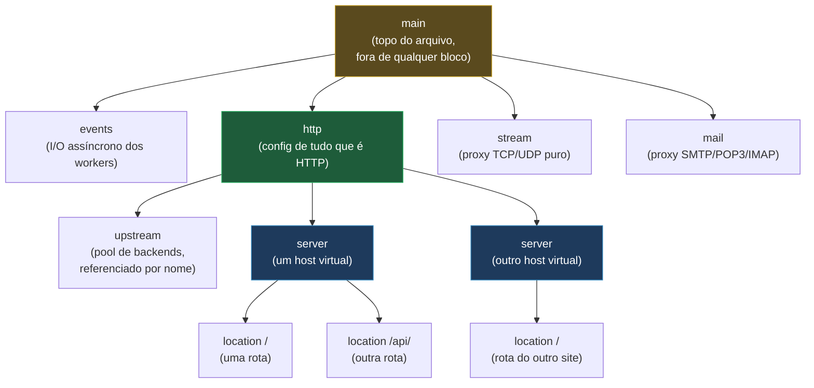
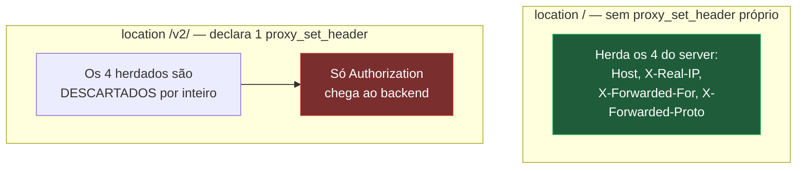

# 02 — A estrutura da configuração: contextos e herança

> [!abstract] TL;DR
> Um `nginx.conf` alheio não é uma lista de comandos que roda de cima para baixo — é uma **árvore de contextos aninhados**, e cada diretiva só existe dentro do contexto onde a documentação oficial declara que ela é válida. A parte que confunde quase todo mundo não é a sintaxe, é a herança: um contexto filho **não funde** o que herdou do pai com o que declara — ele **substitui inteiro**. Um `location` que define um `proxy_set_header` descarta, por completo, todos os `proxy_set_header` herdados do `server` e do `http`, mesmo os que não têm nada a ver com o que o `location` queria mudar. `add_header` segue a mesma regra, com uma armadilha extra sobre em quais códigos de resposta ela atua por padrão. `nginx -T` — não `-t` — é o primeiro comando a rodar ao herdar um servidor de outra pessoa.

Abra um `nginx.conf` de produção que você não escreveu. Trezentas linhas, talvez seiscentas, espalhadas por meia dúzia de arquivos que se incluem uns aos outros. Você procura o bloco que atende `api.exemplo.com`, encontra um `location /v2/` com um `proxy_set_header Authorization $http_authorization`, e conclui, olhando só para aquele bloco, que a requisição vai chegar ao backend com aquele header e mais os headers padrão de sempre — `Host`, `X-Real-IP`, `X-Forwarded-For` — porque alguém, lá em cima, no `server` ou no `http`, certamente configurou isso uma vez para todo o site. Você aplica a mudança, faz o deploy, e o backend começa a reclamar que não sabe mais o IP real do cliente. Nada quebrou no código. A configuração fez exatamente o que estava escrita para fazer — só que o que ela faz não é o que a leitura de cima para baixo sugeria.

Esse tipo de surpresa não nasce de sintaxe malformada. `nginx -t` teria acusado erro de sintaxe na hora. Nasce de um modelo mental errado sobre como o Nginx decide, para uma requisição específica, chegando num `location` específico, qual conjunto de diretivas está de fato em vigor. Essa nota constrói esse modelo do zero: a forma da árvore, a diferença entre diretiva simples e diretiva de bloco, e a regra de herança que — sozinha — explica a maior parte dos "isso deveria estar funcionando" que qualquer pessoa acumula na primeira semana mexendo em Nginx alheio. A nota anterior, [[03-Dominios/Tecnologia/Infraestrutura/Nginx/01 - O problema que o Nginx resolve|01 — O problema que o Nginx resolve]], explicou por que o Nginx existe e como o master e os workers dividem trabalho — o processo por trás do arquivo. Esta nota explica o arquivo em si: a forma que ele tem, e a regra que rege essa forma.

## A árvore de contextos

Todo `nginx.conf`, por mais espalhado que esteja por vários arquivos incluídos, converge para uma única estrutura de árvore. No topo está o contexto **main** — tudo que não está dentro de nenhuma chave `{ }`, o nível onde vivem diretivas como `user`, `worker_processes` e `pid`. Dentro do main, dois contextos-filho fazem o trabalho pesado: **events**, que configura o mecanismo de I/O assíncrono usado pelos workers (o `worker_connections`, o método de notificação do kernel), e **http**, que é onde a esmagadora maioria de uma configuração de verdade mora. Dentro de `http` aninham-se **server** (um site, um host virtual) e, dentro de cada `server`, **location** (uma rota, um prefixo de caminho). Um contexto adicional, **upstream**, também vive dentro de `http`, mas fora de qualquer `server` — é onde se declara um pool de backends, referenciável por nome a partir de qualquer `location` que precise fazer proxy para ele.

Vale marcar, porque é fonte comum de confusão para quem só conhece o caminho `http` → `server` → `location`, que `http` não é o único contexto de primeiro nível dentro de `main`. Existem dois irmãos dele, cada um com sua própria sub-árvore de `server` e afins, para protocolos que não são HTTP: **stream**, que lida com proxy e balanceamento de TCP e UDP puros — sem conhecer nada sobre paths, headers ou métodos HTTP —, e **mail**, que implementa proxy para os protocolos de e-mail (SMTP, POP3, IMAP). Um `nginx.conf` que faz só reverse proxy HTTP nunca vai ter um bloco `stream` ou `mail`, e a maioria não tem — mas encontrar um `stream { }` num arquivo de configuração não é erro de digitação nem `http` mal fechado: é um Nginx fazendo, ao mesmo tempo, duas coisas completamente diferentes, uma delas fora do universo HTTP inteiramente.



O contexto **main** merece um parágrafo à parte, porque é o único que não abre com uma palavra reservada seguida de chaves — é literalmente tudo que está fora de qualquer bloco, no topo do arquivo. As diretivas mais comuns encontradas ali dizem respeito ao processo do Nginx como um todo, não a nenhum site específico: `user`, que define sob qual usuário do sistema operacional os workers rodam; `worker_processes`, que decide quantos workers o master lança (a nota [[03-Dominios/Tecnologia/Infraestrutura/Nginx/01 - O problema que o Nginx resolve|01 — O problema que o Nginx resolve]] detalha essa divisão); e `pid`, o caminho do arquivo onde o master grava seu próprio identificador de processo. As três são exclusivas do contexto `main` — a documentação oficial declara `Context: main` para as três, sem exceção, e tentar declará-las dentro de `http` ou de qualquer bloco mais interno é erro de configuração. Uma quarta diretiva comum em `main`, `error_log`, quebra esse padrão de exclusividade: ela aceita `main`, `http`, `mail`, `stream`, `server` e `location` ao mesmo tempo — é possível ter um `error_log` geral em `main` e um `error_log` mais específico, apontando para outro arquivo, dentro de um `server` só para aquele site, e ambos coexistem sem conflito, porque `error_log` não é a diretiva de conjunto multi-instância que a seção sobre herança desta nota discute — é um valor único por contexto, redeclarado independentemente em cada nível.

Essa árvore não é decoração visual — é a estrutura que a nota [[03-Dominios/Tecnologia/Infraestrutura/Nginx/03 - Como o Nginx escolhe o server block|03 — Como o Nginx escolhe o server block]] percorre para decidir qual `server` atende uma requisição, e que a nota [[03-Dominios/Tecnologia/Infraestrutura/Nginx/04 - location e a tabela de precedência|04 — location e a tabela de precedência]] percorre de novo, um nível abaixo, para decidir qual `location` dentro daquele `server`. Cada uma dessas notas assume que você já sabe onde, na árvore, cada uma dessas decisões acontece — e é exatamente esse "onde" que esta nota deixa estabelecido.

Vale marcar um detalhe estrutural que passa despercebido até alguém tropeçar nele: `location` não é, estritamente, um contexto que só existe dentro de `server`. A documentação oficial do `ngx_http_core_module` declara o contexto da diretiva `location` como `server, location` — ou seja, um `location` pode conter outro `location` aninhado dentro de si, com a mesma regra de herança por substituição desta nota valendo, de novo, entre o `location` externo e o interno. Existe uma única exceção a essa possibilidade de aninhamento: **locations nomeados** (prefixados com `@`, usados para redirecionamento interno de requisições — o assunto do `error_page` e do `try_files` avançado que a nota [[03-Dominios/Tecnologia/Infraestrutura/Nginx/04 - location e a tabela de precedência|04 — location e a tabela de precedência]] desenvolve) não podem ser aninhados, nem conter aninhamento. Aninhar `location` dentro de `location` é raro em configurações do dia a dia — a maioria das tarefas que pareceriam pedir esse aninhamento tem solução mais direta via os modificadores de precedência que a nota 04 cobre — mas encontrar um numa configuração alheia não é erro de sintaxe nem acidente: é a árvore desta nota, só que descendo um nível a mais do que o diagrama acima mostrou.

## Diretiva simples e diretiva de bloco

Dentro de qualquer contexto, uma configuração de Nginx é feita de duas formas sintáticas, e só duas. Uma **diretiva simples** é um nome seguido de um ou mais parâmetros, terminada por ponto e vírgula:

```nginx
worker_processes auto;
listen 80;
proxy_set_header Host $host;
```

Uma **diretiva de bloco** tem a mesma forma — nome, parâmetros — mas em vez de terminar com `;` abre um par de chaves, dentro das quais moram outras diretivas, simples ou de bloco:

```nginx
http {
    server {
        listen 80;

        location / {
            root /var/www/html;
        }
    }
}
```

`http`, `server`, `location`, `events`, `upstream`, `stream` e `mail` são todos diretivas de bloco — são elas que criam os contextos da árvore da seção anterior. Confundir os dois tipos produz um erro de sintaxe imediato, capturado por `nginx -t` antes mesmo do processo tentar recarregar: esquecer o ponto e vírgula de uma diretiva simples, ou fechar uma diretiva de bloco com `;` em vez de `{ }`, são os dois erros de digitação mais comuns de quem está apenas começando a editar Nginx à mão.

O que a sintaxe sozinha **não** revela é onde cada diretiva pode aparecer. `proxy_set_header` faz sentido dentro de um `location` que faz proxy — mas também é válida dentro de `server` e de `http`, para ser herdada por todos os `location` de baixo (a herança em si é o assunto do resto desta nota). Já `listen` só faz sentido dentro de um `server`, nunca dentro de um `location` — declarar `listen` ali é um erro de configuração que `nginx -t` recusa, com uma mensagem apontando exatamente qual diretiva está no contexto errado. É aqui que a documentação oficial de cada módulo — [nginx.org/en/docs](https://nginx.org/en/docs/) — vale mais do que qualquer tutorial de terceiros: a página de cada diretiva individual traz um campo **Context**, listando explicitamente em quais blocos ela é válida. A página do `proxy_set_header`, por exemplo, declara `Context: http, server, location` — três contextos, nem mais nem menos. A página do `upstream` declara só `Context: http`, e é isso que impede alguém de tentar declarar um pool de backends dentro de um `server` específico.

> [!info] O hábito que evita metade dos erros
> Antes de copiar qualquer diretiva de um exemplo achado online para dentro de uma configuração própria, ler o campo **Context** da página oficial daquela diretiva economiza o ciclo inteiro de "copiei, rodei `nginx -t`, deu erro de contexto inválido, fui ler a documentação de qualquer jeito". A referência completa de módulos HTTP está em [nginx.org/en/docs/http](https://nginx.org/en/docs/http/) — cada módulo lista suas diretivas com Syntax, Default e Context lado a lado.

Indentação, por sua vez, não carrega nenhum significado sintático — o Nginx não é Python nem YAML. Os quatro espaços que os exemplos desta nota usam para marcar profundidade de aninhamento são só uma convenção de legibilidade que a comunidade adotou; um arquivo inteiro escrito sem nenhuma indentação, tudo colado na margem esquerda, é tão válido para o parser do Nginx quanto o mais bem formatado dos exemplos, desde que as chaves estejam corretamente abertas e fechadas. Quebras de linha também não importam para a sintaxe — várias diretivas simples poderiam, tecnicamente, ficar todas na mesma linha física, separadas só pelos pontos e vírgula — mas nenhuma configuração de produção séria abusa dessa liberdade, porque legibilidade para quem vai debugar às três da manhã pesa mais do que qualquer economia de linhas. Comentários seguem a convenção de shell: tudo depois de um `#` até o fim da linha é ignorado pelo parser, em qualquer contexto, inclusive dentro de um bloco.

## A regra central: herança é para baixo, e por substituição

Chegado a este ponto, a árvore de contextos e a distinção entre diretiva simples e de bloco são só o vocabulário. A regra que de fato prevê comportamento — a que separa quem lê uma configuração alheia com confiança de quem só copia bloco e testa em produção — é sobre **herança**.

Boa parte das diretivas do Nginx pode ser declarada em mais de um nível da árvore ao mesmo tempo. `proxy_set_header` é válida em `http`, `server` e `location`; `add_header` também; `gzip`, `access_log`, `error_page` e dezenas de outras seguem o mesmo padrão. Quando uma diretiva desse tipo é declarada num contexto pai — digamos, dentro de `http` — e o contexto filho — um `server`, ou um `location` dentro dele — não redeclara essa mesma diretiva, o filho **herda** o valor do pai, como seria de esperar. Até aqui, nada surpreendente.

A parte contraintuitiva aparece quando o contexto filho **também** declara aquela diretiva. A expectativa natural — de quem vem de linguagens de programação com herança por composição, ou simplesmente de bom senso sobre o que "adicionar uma configuração" deveria significar — é que o filho **acrescenta** a sua declaração às que já vinham do pai, formando um conjunto maior. Não é isso que o Nginx faz. Para o conjunto de diretivas que seguem esse padrão de herança — `proxy_set_header` e `add_header` entre elas —, a regra é: **se o contexto atual declara pelo menos uma instância daquela diretiva, todas as instâncias herdadas do nível anterior são descartadas por completo, mesmo as que não tinham nenhuma relação com a que foi redeclarada.** Herança para baixo, sim — mas por substituição inteira do conjunto, nunca por fusão.

### Por que só algumas diretivas surpreendem dessa forma

Vale uma pausa para entender por que essa armadilha aparece especificamente com `proxy_set_header`, `fastcgi_param` e `add_header`, e não com toda diretiva herdável do Nginx. A diferença está em qual delas representa um **valor único** e qual representa uma **lista que se constrói por acumulação de instâncias**. Diretivas como `root` ou `index` aceitam um valor — redeclarar `root` num `location` simplesmente troca o caminho em vigor ali, e não existe confusão possível sobre "o que aconteceu com o `root` anterior", porque só pode existir um `root` de cada vez, não um conjunto deles. Não há "fusão" nem "substituição de conjunto" para discutir quando só existe um valor.

`proxy_set_header`, `fastcgi_param` e `add_header` são diferentes: cada uma pode ser escrita várias vezes no mesmo contexto, cada instância adicionando um item a um conjunto — um header, um parâmetro. É só quando a diretiva representa esse tipo de conjunto multi-instância que a pergunta "o que acontece quando o filho redeclara?" tem duas respostas possíveis — funde os itens, ou substitui o conjunto inteiro — e é exatamente aí que o Nginx escolhe a segunda, contra a intuição de quem espera a primeira. A documentação oficial usa, para as três, a mesma frase quase palavra por palavra: "these directives are inherited from the previous configuration level if and only if there are no [nome da diretiva] directives defined on the current level" — o "these directives", no plural, já é a pista de que o texto está falando de um conjunto de instâncias, não de um valor isolado.

### O exemplo que expõe a armadilha

Considere um `server` que centraliza, de propósito, os headers que todo backend atrás dele deveria receber — a intenção de quem escreveu essa configuração foi clara: definir uma vez, no nível do `server`, e deixar todo `location` herdar automaticamente.

```nginx
server {
    listen 80;
    server_name api.exemplo.com;

    # Headers que TODO location abaixo deveria receber, na intenção de quem escreveu isto
    proxy_set_header Host $host;
    proxy_set_header X-Real-IP $remote_addr;
    proxy_set_header X-Forwarded-For $proxy_add_x_forwarded_for;
    proxy_set_header X-Forwarded-Proto $scheme;

    location / {
        proxy_pass http://backend_padrao;
        # nenhum proxy_set_header aqui — herda os quatro de cima, como esperado
    }

    location /v2/ {
        proxy_pass http://backend_v2;
        # a única coisa que este location queria mudar era acrescentar
        # o header de autenticação repassado
        proxy_set_header Authorization $http_authorization;
    }
}
```

A leitura ingênua de `location /v2/` — a mesma leitura que a abertura desta nota descreveu — é: "esse `location` recebe os quatro headers herdados do `server`, mais o `Authorization` que ele mesmo declarou". Não é isso que acontece. Porque `location /v2/` contém pelo menos um `proxy_set_header`, a regra de substituição entra em ação: **os quatro `proxy_set_header` do `server` são descartados por inteiro**, e o único header explicitamente enviado ao backend, para requisições que passam por `/v2/`, é `Authorization`. `Host` some. `X-Real-IP` some. `X-Forwarded-For` e `X-Forwarded-Proto` também. O backend atrás de `/v2/` deixa de saber o IP real do cliente, o protocolo original (`http` ou `https`), e passa a receber `Host: $proxy_host` — o valor default que o próprio Nginx usa quando nenhum `proxy_set_header Host` está em vigor, tipicamente o endereço do upstream, não o domínio que o cliente de fato acessou.

A correção não é sofisticada — é só desfazer a suposição errada e repetir, de forma explícita, tudo que o `location` precisa, porque a substituição não deixa outra opção:

```nginx
    location /v2/ {
        proxy_pass http://backend_v2;

        # repetir os quatro herdados, porque declarar QUALQUER
        # proxy_set_header aqui zera a herança do server inteiro
        proxy_set_header Host $host;
        proxy_set_header X-Real-IP $remote_addr;
        proxy_set_header X-Forwarded-For $proxy_add_x_forwarded_for;
        proxy_set_header X-Forwarded-Proto $scheme;

        proxy_set_header Authorization $http_authorization;
    }
```

Vale marcar precisamente onde a diferença entre "o que o autor esperava" e "o que de fato acontece" mora: o autor original tratou o `proxy_set_header` do `server` como uma base cumulativa, um alicerce sobre o qual cada `location` empilharia suas próprias exceções. O Nginx trata cada nível como responsável por declarar, **por completo**, o conjunto de `proxy_set_header` que está em vigor ali, no momento em que decide redeclarar qualquer um deles. Não existe meio-termo, não existe "só sobrescreve o que colide por nome" — é tudo ou nada, por diretiva, por contexto.



> [!info] Baseline de versão
> Esse comportamento de substituição para `proxy_set_header` é estável há muitas versões do Nginx e não mudou nas linhas mainline 1.31.3 (15 jul 2026) e stable 1.30.4, que servem de baseline para esta nota. A documentação oficial do módulo `ngx_http_proxy_module` declara a regra de forma direta: "These directives are inherited from the previous configuration level if and only if there are no `proxy_set_header` directives defined on the current level."

## `add_header`: a mesma regra, mais uma armadilha de código de resposta

`add_header`, do módulo `ngx_http_headers_module`, segue exatamente a mesma regra de substituição — herdado do nível anterior só se o nível atual não declarar nenhum `add_header` próprio. Um `server` que define headers de segurança padrão (`X-Frame-Options`, `X-Content-Type-Options`, `Strict-Transport-Security`) e um `location` específico que adiciona só um `Cache-Control` para arquivos estáticos caem exatamente na mesma armadilha do exemplo anterior: declarar aquele `Cache-Control` dentro do `location` apaga os headers de segurança herdados do `server`, a menos que sejam repetidos ali também.

```nginx
server {
    add_header X-Frame-Options "SAMEORIGIN" always;
    add_header X-Content-Type-Options "nosniff" always;
    add_header Strict-Transport-Security "max-age=63072000" always;

    location /static/ {
        # isto ZERA os três add_header acima para requisições em /static/
        add_header Cache-Control "public, immutable";
    }
}
```

Além da substituição, `add_header` carrega uma segunda armadilha, independente da primeira, sobre **quando** o header é de fato adicionado. Por padrão, `add_header` só se aplica a um conjunto específico de códigos de resposta bem-sucedidos ou de redirecionamento — não a qualquer resposta que o Nginx produza. Uma resposta de erro gerada pelo próprio Nginx (um `404`, um `500`, um `502` de upstream fora do ar) não recebe, por padrão, os headers declarados via `add_header` — o que costuma surpreender quem espera ver `Strict-Transport-Security` ou os headers de CORS presentes em toda resposta, inclusive nas de erro. O parâmetro `always`, usado em todos os exemplos desta nota, existe justamente para isso: quando presente, o header é adicionado independentemente do código de resposta. A lista padrão é explícita na documentação oficial — `200`, `201`, `204`, `206`, `301`, `302`, `303`, `304`, `307` e `308` — e o que ela tem em comum é justamente o que a torna traiçoeira: são os códigos de sucesso e de redirecionamento, exatamente aqueles em que ninguém testa a ausência de um header de segurança.

> [!info] Baseline de versão
> A partir da versão 1.29.3 existe uma segunda ferramenta para lidar com o problema da substituição total, específica para `add_header`: a diretiva `add_header_inherit`, aceitando `on` (o comportamento padrão, substituição inteira, descrito nesta nota), `off` (cancela qualquer herança) e `merge` (concatena os valores herdados do nível anterior aos declarados no nível atual, em vez de descartar os herdados). É uma diretiva nova o bastante para não aparecer na maioria das configurações de produção ainda — mas resolve, de forma nativa, exatamente o problema que o exemplo do `Cache-Control` acima ilustra, sem precisar repetir manualmente os headers herdados.

## `include` e a organização em vários arquivos

Nenhuma configuração de produção de tamanho razoável vive inteira num único `nginx.conf`. A diretiva `include` — documentada com `Context: any`, ou seja, válida em absolutamente qualquer contexto da árvore, inclusive dentro de um `location` — resolve isso da forma mais direta possível: substitui a si mesma, no momento em que o arquivo é lido, pelo conteúdo do arquivo ou arquivos que ela referencia.

```nginx
http {
    include mime.types;
    include /etc/nginx/conf.d/*.conf;

    server {
        listen 80;
        server_name exemplo.com;

        include /etc/nginx/snippets/security-headers.conf;

        location / {
            root /var/www/html;
        }
    }
}
```

`include` aceita tanto um caminho de arquivo único quanto uma máscara com glob (`*.conf`), incluindo, nesse segundo caso, todos os arquivos que casarem com o padrão, na ordem em que o sistema de arquivos os retornar — o que importa quando a ordem de leitura afeta a herança descrita nas seções anteriores. Não existe limite de profundidade: um arquivo incluído pode, ele mesmo, conter outros `include`, formando uma árvore de arquivos que espelha, fisicamente em disco, a árvore de contextos que existe logicamente na configuração resolvida.

Vale desfazer, com precisão, uma confusão comum sobre dois nomes de diretório que aparecem em praticamente toda instalação de Nginx em distribuições baseadas em Debian — Ubuntu incluído: `sites-available` e `sites-enabled`. **Isso não é uma feature do Nginx.** O Nginx, como projeto, não sabe o que é `sites-available`, não trata esse nome de forma especial, e não documenta esses diretórios em lugar nenhum de [nginx.org](https://nginx.org/en/docs/). É uma **convenção de empacotamento** que o pacote `nginx` do Debian/Ubuntu adota: o `nginx.conf` gerado pelo instalador desse pacote traz, dentro do bloco `http`, a linha `include /etc/nginx/sites-enabled/*;` — uma diretiva `include` genérica, igual a qualquer outra, apontando para um diretório específico. `sites-available/` guarda os arquivos de configuração de cada site, escritos ou desativados; `sites-enabled/` guarda apenas **links simbólicos** para os arquivos de `sites-available/` que devem, de fato, entrar em vigor — o comando clássico é `ln -s /etc/nginx/sites-available/exemplo.com /etc/nginx/sites-enabled/exemplo.com`, e removê-lo desativa o site sem apagar a configuração original. O mesmo pacote Debian/Ubuntu também traz uma segunda linha de `include`, `include /etc/nginx/conf.d/*.conf;`, apontando para um diretório mais simples — sem a distinção "disponível" versus "ativo" — usado tipicamente para configurações globais que não são um site inteiro (limites de rate limiting compartilhados, mapas, zonas de cache). Instalar o Nginx a partir do código-fonte, ou de uma distribuição diferente, pode não trazer nenhum desses dois diretórios — porque, de novo, eles não são parte do Nginx, são parte de como um pacote específico decidiu organizar a configuração default que ele instala.

> [!info] Baseline de versão
> O `nginx.conf` default do pacote `nginx` no Debian (verificado na versão 1.30.4-3, disponível em sid) traz as duas linhas exatamente como descrito: `include /etc/nginx/conf.d/*.conf;` e `include /etc/nginx/sites-enabled/*;`, ambas diretivas `include` comuns dentro do bloco `http`.

> [!tip] Vídeo — a mesma árvore, dissecada num arquivo real
> [**Learn Proper NGINX Configuration Context Logic**](https://www.youtube.com/watch?v=C5kMgshNc6g) (Jay Desai, NGINX — canal oficial, ~13 min, EN) faz exatamente o percurso desta nota, mas na tela: primeiro os contextos de topo (`main`, `events`, `http`, `stream`) e seus filhos (`server`, `location`, `upstream`), depois a distinção entre **diretiva simples** e **diretiva de bloco** — "um bloco é um agrupamento de diretivas entre chaves" —, e por fim ele abre o `nginx.conf` de uma instância de verdade, desce para `conf.d/` e mostra como os arquivos se encaixam. O detalhe mais útil, e que esta nota trata na seção de `include` logo acima, ele demonstra na prática em [09:34]: o Nginx lê os arquivos incluídos **em ordem alfabética** — no exemplo dele, `default.conf` antes de `web.conf` —, o que importa quando a configuração depende de ordem de definição. Ele fecha usando `nginx -T` para provar qual configuração está de fato montada, que é o mesmo instrumento da seção seguinte. **O que ele não cobre — e é justamente o núcleo desta nota:** a regra de herança para baixo por **substituição**, e a armadilha que decorre dela; o vídeo apresenta a árvore de contextos e diz que diretivas de `http` são herdadas pelos filhos, mas não chega ao caso em que declarar uma diretiva no filho **descarta inteiramente** o valor do pai — nem à armadilha correlata de `add_header`.

## Um esqueleto completo, contexto por contexto

Vale reunir tudo que as seções anteriores descreveram separadamente — main, events, http, upstream, server, location, e os irmãos stream e mail — num único esqueleto comentado, para que a árvore da primeira seção deixe de ser um diagrama abstrato e vire algo que se reconhece de relance num arquivo de verdade. Este exemplo é deliberadamente mais completo do que qualquer um dos anteriores; ele não introduz diretiva nova nenhuma além do que já foi explicado, só mostra onde cada contexto se encaixa em relação aos outros.

```nginx
# ── main: fora de qualquer bloco, o nível mais alto de todos ──
user nginx;
worker_processes auto;
error_log /var/log/nginx/error.log warn;
pid /run/nginx.pid;

# include em main: qualquer contexto aceita include, mesmo o mais alto de todos
include /etc/nginx/modules-enabled/*.conf;

events {
    # ── events: só existe uma vez, controla o mecanismo de I/O dos workers ──
    worker_connections 1024;
}

http {
    # ── http: onde a configuração de sites HTTP inteira mora ──
    include /etc/nginx/mime.types;
    default_type application/octet-stream;

    # diretivas que valem, por herança, para todo server abaixo,
    # a menos que um server ou location redeclare a mesma diretiva
    sendfile on;
    keepalive_timeout 65;
    gzip on;

    # upstream: irmão de server, não filho — vive direto dentro de http,
    # referenciado por nome a partir de qualquer location que precise dele
    upstream backend_padrao {
        server 127.0.0.1:3000;
    }

    upstream backend_v2 {
        server 127.0.0.1:3001;
    }

    # include buscando outros arquivos de configuração, cada um
    # trazendo os seus próprios blocos server
    include /etc/nginx/conf.d/*.conf;

    server {
        # ── server: um host virtual dentro de http ──
        listen 80;
        server_name api.exemplo.com;

        location / {
            # ── location: uma rota dentro deste server ──
            proxy_pass http://backend_padrao;
        }

        location /v2/ {
            proxy_pass http://backend_v2;
        }
    }
}

# stream: irmão de http, não filho — proxy de TCP/UDP puro,
# sem nenhuma noção de path, header ou método HTTP
stream {
    upstream banco_de_dados {
        server 10.0.0.5:5432;
    }

    server {
        listen 5432;
        proxy_pass banco_de_dados;
    }
}

# mail: outro irmão de http, proxy para SMTP/POP3/IMAP —
# raro o bastante para a maioria das configurações nunca precisar dele
mail {
    server {
        listen 25;
        protocol smtp;
        proxy on;
    }
}
```

Repare no que esse esqueleto deixa visível de um jeito que nenhuma seção isolada conseguiria: `upstream` está dentro de `http`, mas fora de qualquer `server` — é um irmão dos `server`, não um filho de nenhum deles, e por isso o mesmo `upstream` pode ser referenciado a partir de `location` em `server` diferentes. `stream` e `mail`, por outro lado, estão fora de `http` inteiramente, no mesmo nível dele dentro de `main` — cada um com sua própria noção de `server`, que não tem nenhuma relação direta com o `server` HTTP, exceto o nome compartilhado. Um `server` dentro de `stream` não entende `location`, não entende `server_name` baseado em `Host` (porque TCP puro não tem esse conceito), e por isso a próxima nota deste galho, que decide qual `server` HTTP atende uma requisição por `Host` e porta, não se aplica a ele — a lógica de roteamento do `stream` é outra, geralmente baseada só em porta e IP de origem.

## Vendo a configuração de verdade: `nginx -t` e `nginx -T`

Toda a árvore de contextos, a regra de substituição e o `include` espalhando a configuração por vários arquivos convergem para um problema prático: como saber, com certeza, o que está de fato em vigor, sem precisar montar a árvore inteira de cabeça, arquivo por arquivo?

`nginx -t` responde à primeira metade dessa pergunta — testa a sintaxe da configuração, incluindo a resolução de todos os `include`, e confirma se os arquivos referenciados existem e são legíveis. Um `nginx -t` bem-sucedido garante que a configuração está sintaticamente correta e que nenhum arquivo referenciado está faltando; não garante, e não tem como garantir, que o comportamento resultante é o que alguém pretendia — um `location` na ordem errada, um `proxy_set_header` silenciosamente descartado pela regra de substituição, passam incólumes por esse teste, porque nenhum dos dois é um erro de sintaxe.

```bash
sudo nginx -t
```

```
nginx: the configuration file /etc/nginx/nginx.conf syntax is ok
nginx: configuration file /etc/nginx/nginx.conf test is successful
```

`nginx -T` faz o mesmo teste de sintaxe, mas soma a ele algo estruturalmente diferente: despeja, na saída padrão, **a configuração inteira, com todos os `include` já expandidos**, como se o arquivo inteiro tivesse sido escrito num único lugar, sem indireção nenhuma. É o comando que responde à segunda metade da pergunta — não "isso está sintaticamente correto?", mas "o que está, de fato, em vigor, agora, para este servidor?".

```bash
sudo nginx -T
```

```
# configuration file /etc/nginx/nginx.conf:
user nginx;
worker_processes auto;
...

# configuration file /etc/nginx/conf.d/api.conf:
upstream backend_v2 {
    server 127.0.0.1:3001;
}

# configuration file /etc/nginx/sites-enabled/api.exemplo.com:
server {
    listen 80;
    server_name api.exemplo.com;
...
```

Repare no formato: cada bloco da saída começa com um comentário indicando de qual arquivo físico aquele trecho veio — útil para rastrear de volta ao arquivo certo depois de identificar um problema — mas o conteúdo entre um comentário e o próximo é exatamente o que o `nginx -t` sozinho nunca mostra: a árvore de contextos inteira, resolvida, sem nenhum `include` restante para seguir manualmente.

É por isso que `nginx -T` — não `-t`, não `nginx -s reload`, não abrir os arquivos um a um no editor — é o primeiro comando a rodar ao herdar um servidor configurado por outra pessoa. Ler `sites-enabled/api.exemplo.com` isoladamente, como fez a cena de abertura desta nota, mostra só a metade local da história: o que aquele arquivo específico declara, sem revelar o que foi herdado de um `conf.d/*.conf` incluído antes dele, nem se algum `location` mais específico, em outro arquivo, está descartando por substituição algo que pareceria óbvio olhando só para ali. `nginx -T` elimina essa incerteza de uma vez: a saída inteira é a configuração real, resolvida, do jeito que o Nginx de fato a enxerga — não o jeito que ela está distribuída fisicamente entre arquivos por conveniência de organização humana.

Na prática, `nginx -T` sozinho costuma despejar mais texto do que qualquer pessoa consegue ler linearmente numa configuração grande — dezenas de `server`, cada um com vários `location`. Combiná-lo com `grep`, pedindo contexto ao redor da diretiva que interessa, transforma o despejo inteiro numa ferramenta de busca dirigida em vez de leitura corrida:

```bash
sudo nginx -T | grep -A5 -B5 'proxy_set_header Authorization'
```

Esse único comando responde, sem ambiguidade, à pergunta que a cena de abertura desta nota levantou: quais headers de fato acompanham `Authorization` no bloco resolvido, exatamente como o Nginx os vê — sem depender de reconstruir a herança de cabeça, arquivo por arquivo, torcendo para não esquecer nenhum `include` no caminho.

## Um resumo de contextos para a caixa de ferramentas

Ao longo desta nota, o campo **Context** de várias diretivas apareceu espalhado dentro dos exemplos, cada um respondendo a uma dúvida pontual sobre onde aquela diretiva específica é válida. Vale reunir os principais numa única referência, não como substituto de consultar a documentação oficial a cada diretiva nova, mas como ponto de partida rápido para as diretivas que qualquer configuração de Nginx acaba usando cedo ou tarde:

| Diretiva | Context (onde é válida) | Observação |
|---|---|---|
| `user`, `worker_processes`, `pid` | `main` | Exclusivas do nível mais alto; configuram o processo do Nginx como um todo, não um site específico. |
| `error_log` | `main`, `http`, `server`, `location`, `mail`, `stream` | Valor único por nível, não sofre a armadilha de substituição total — cada contexto pode ter o seu, coexistindo com os dos níveis acima. |
| `server` (o bloco) | `http` | Só existe dentro de `http`; o `server` de `stream` e `mail` é uma diretiva homônima, distinta, documentada em seus próprios módulos. |
| `listen` | `server` | Nunca dentro de `location` — é o `server` que escuta uma porta, não uma rota dentro dele. |
| `location` (o bloco) | `server`, `location` | Aninhamento é permitido, com exceção dos locations nomeados (`@nome`). |
| `upstream` (o bloco) | `http` | Irmão dos `server`, não filho de nenhum — por isso um único `upstream` serve a vários `server` diferentes. |
| `proxy_set_header` | `http`, `server`, `location` | Multi-instância; herda por substituição total quando o nível atual redeclara qualquer instância. |
| `fastcgi_param` | `http`, `server`, `location` | Mesmo padrão de `proxy_set_header`, aplicado a backends FastCGI (PHP-FPM, por exemplo) em vez de proxy HTTP. |
| `add_header` | `http`, `server`, `location`, `if in location` | Multi-instância com a mesma regra de substituição, mais a restrição de códigos de resposta que o `always` remove. |
| `include` | qualquer contexto | O único mecanismo real por trás de convenções como `sites-available`/`sites-enabled` — não existe diretiva `include` especial para isso. |

Nenhuma dessas linhas substitui a leitura da documentação de uma diretiva nova antes de usá-la pela primeira vez — mas, para as dez que aparecem em praticamente todo `nginx.conf` de produção, ter o Context de cabeça é o que permite ler uma configuração alheia sem precisar abrir uma aba nova a cada duas linhas. Vale reparar num padrão que a própria tabela expõe: as diretivas restritas a um único contexto (`user`, `listen`, `server`, `upstream`) tendem a ser as que definem **o que uma coisa é** — um processo, uma porta, um host, um pool —, enquanto as que aceitam vários contextos e permitem herança (`error_log`, `proxy_set_header`, `add_header`) tendem a ser as que **ajustam comportamento** de algo que já foi definido em outro lugar. Não é uma regra absoluta, mas ajuda a adivinhar, diante de uma diretiva desconhecida, se vale a pena checar a regra de herança antes de usá-la.

Vale fechar esta seção com um lembrete prático: a tabela cobre só as diretivas que apareceram nesta nota, um recorte deliberadamente pequeno perto do catálogo inteiro que a documentação de módulos HTTP, stream e mail do Nginx oferece. Módulos de terceiros — `ngx_brotli`, módulos de autenticação customizada, integrações com serviços de nuvem — trazem suas próprias diretivas, cada uma com seu próprio campo Context, e a mesma disciplina de checar a documentação antes de copiar um exemplo vale igualmente para eles.

Compilações do Nginx feitas com módulos dinâmicos (`--with-*_module=dynamic` na hora do build) exigem, adicionalmente, uma diretiva `load_module` no contexto `main`, antes de qualquer outro contexto que a use — sem ela, o Nginx nem reconhece a existência das diretivas daquele módulo, e `nginx -t` recusa a configuração com um erro de diretiva desconhecida, não de contexto errado.

## Armadilhas comuns

> [!warning] Assumir que `proxy_set_header` (ou `add_header`) acumula em vez de substituir
> É a armadilha central desta nota, e a mais cara em produção porque não produz erro de sintaxe nenhum — só um comportamento silenciosamente diferente do esperado. Qualquer `location` ou `server` que declare uma dessas diretivas precisa, nesse mesmo nível, repetir tudo que o nível anterior declarava e que ainda deveria valer ali. Não existe atalho de "só sobrescrever o que mudou" sem repetir o resto — a menos que se use `add_header_inherit merge;`, disponível a partir da versão 1.29.3 e restrito a `add_header`.

> [!warning] Ler um único arquivo de `sites-enabled/` e concluir que ali está a configuração inteira
> Um arquivo de site isolado normalmente não declara sozinho os headers de segurança, os limites de tamanho de corpo, ou os timeouts que se aplicam a ele — esses costumam vir herdados de um `conf.d/*.conf` incluído mais cedo, ou do próprio `http` no `nginx.conf` principal. Julgar o comportamento de um site olhando só para o seu arquivo em `sites-enabled/`, sem rodar `nginx -T` para ver a árvore inteira resolvida, é receita para prever errado o que uma requisição de fato recebe.

> [!warning] Copiar uma diretiva de um exemplo online sem checar o campo Context na documentação oficial
> Um `proxy_set_header` dentro de um bloco `upstream`, ou um `listen` dentro de um `location`, são erros de contexto que `nginx -t` recusa — mas só depois de escrito, testado, e frequentemente já commitado num PR. Consultar o campo **Context** na página oficial de cada diretiva antes de colar um exemplo alheio evita esse ciclo inteiro; a referência de módulos HTTP está em [nginx.org/en/docs/http](https://nginx.org/en/docs/http/).

> [!warning] Tratar `sites-available`/`sites-enabled` como um conceito do Nginx
> Times que migram de uma instalação Debian/Ubuntu para uma imagem de container baseada em outra distribuição, ou para o binário compilado a partir do código-fonte, às vezes procuram por esses dois diretórios e não encontram nenhum — não porque a instalação esteja quebrada, mas porque eles nunca existiram fora da convenção de empacotamento daquela distribuição específica. O único mecanismo real, por baixo de qualquer convenção de diretório, é a diretiva `include` genérica, apontando para onde quer que a configuração tenha decidido organizar seus arquivos.

> [!warning] Esquecer o `always` em `add_header` e não entender por que o header some numa resposta de erro
> Um header de segurança ou de CORS declarado via `add_header` sem `always` deixa de aparecer justamente nas respostas onde ele mais importa — erros — porque o conjunto de códigos de resposta padrão ao qual `add_header` se aplica não cobre toda resposta que o Nginx pode gerar. O sintoma típico é um header presente em testes manuais bem-sucedidos (que retornam `200`) e ausente quando alguém testa contra um endpoint que devolve erro — parecendo, à primeira vista, um bug intermitente em vez de uma omissão previsível do `always`.

> [!warning] Presumir que a regra de substituição vale para toda diretiva herdável
> Depois de internalizar a armadilha central desta nota, é fácil generalizar rápido demais e passar a desconfiar de qualquer herança no Nginx. Diretivas de valor único — `root`, `index`, `client_max_body_size` — não têm essa complicação: redeclarar uma delas num nível mais interno simplesmente troca o valor em vigor ali, sem nenhum conjunto anterior para "descartar". A armadilha é específica de diretivas que constroem uma lista por múltiplas instâncias — `proxy_set_header`, `fastcgi_param`, `add_header`, entre outras do mesmo padrão — não uma propriedade geral de todo o sistema de herança do Nginx.

> [!warning] Confundir um `location` aninhado dentro de outro `location` com um erro de indentação
> Como a maioria das configurações nunca precisa aninhar `location` dentro de `location`, encontrar esse padrão numa configuração alheia costuma gerar a suspeita errada — de que alguém colou um bloco no lugar errado por engano. É sintaticamente válido, documentado explicitamente pelo `ngx_http_core_module`, e segue a mesma regra de herança por substituição entre o `location` externo e o interno; a única forma de `location` que de fato não pode ser aninhada é a nomeada (`@nome`), usada para redirecionamento interno.

## Como explicar em inglês

| Português | Inglês | Nuance de uso |
|---|---|---|
| Contexto | Context | Termo técnico fixo da documentação oficial — a página de cada diretiva traz um campo "Context" listando onde ela é válida; não se traduz por "block" nem "scope" em conversa técnica. |
| Herança | Inheritance | Usado exatamente como em outras áreas de configuração; o ponto fino a comunicar é que, para certas diretivas, a herança é "all-or-nothing", não incremental. |
| Diretiva | Directive | Termo padrão para qualquer instrução de configuração, simples ou de bloco; "setting" é aceitável em conversa informal, mas "directive" é o termo da documentação. |
| Substituição (não fusão) | Override / replace, not merge | A frase que evita ambiguidade em entrevista é algo como "it overrides the whole set, it doesn't merge with it" — "override" sozinho às vezes é lido como troca campo a campo, o que é exatamente o erro a evitar. |
| Diretiva de bloco | Block directive | Contraposto a "simple directive"; ambos os termos aparecem lado a lado na documentação oficial e no Beginner's Guide. |
| Despejar a configuração resolvida | Dump the resolved configuration | Descreve exatamente o que `nginx -T` faz; "resolved" comunica que todos os `include` já foram expandidos, não só concatenados. |
| Convenção de empacotamento | Packaging convention | A expressão certa para `sites-available`/`sites-enabled` — evita a armadilha de descrever como "feature do Nginx" algo que é decisão de uma distribuição específica. |
| Configuração resolvida | Resolved configuration | O estado final, com todos os `include` expandidos e toda herança já aplicada — em contraste com a configuração "como está escrita nos arquivos", que pode divergir bastante do que de fato está em vigor. |
| Diretiva multi-instância | Multi-instance / list-building directive | Não é termo oficial da documentação, mas comunica bem a distinção entre diretivas de valor único (`root`) e diretivas que constroem um conjunto por repetição (`proxy_set_header`), que é o cerne de por que a substituição surpreende. |

Uma formulação que soa sênior quando a pergunta é "why did my proxy headers disappear after I added one line?": *"Because directives like `proxy_set_header` don't merge across context levels — they override completely. The moment a location block declares even one `proxy_set_header`, none of the ones inherited from the server block apply anymore. You have to repeat everything you still want, not just the new one."* Vale evitar, nessa explicação, a palavra "merge" aplicada ao comportamento padrão — ela descreve exatamente o oposto do que o Nginx faz por padrão, e só passa a ser precisa se a resposta mencionar `add_header_inherit merge`, específico do `add_header` e recente o bastante para precisar de contexto de versão.

Uma segunda formulação, mais curta, serve para quando a pergunta é sobre como diagnosticar rápido uma configuração desconhecida: *"The first thing I run on someone else's nginx box is `nginx -T`, not `-t`. `-t` only checks syntax; `-T` dumps the fully resolved configuration, with every include expanded, so I can see what's actually in effect instead of guessing from files spread across `sites-enabled` and `conf.d`."* Essa resposta costuma render bem porque demonstra hábito de produção, não só conhecimento de sintaxe — é o tipo de detalhe que separa quem já operou um Nginx real de quem só leu sobre ele.

## O que vem a seguir

Esta nota tratou de uma única árvore, um único `http`, com um único `server` de exemplo. Uma configuração de produção normalmente tem muitos `server`, todos dentro do mesmo `http`, cada um respondendo por um domínio, um subdomínio, ou uma combinação de porta e IP diferente. A pergunta natural — e o assunto que abre a próxima nota — é: quando uma requisição chega, com um `Host` específico, batendo numa porta específica, como o Nginx decide **qual** desses vários `server` vai processá-la? A resposta não é "o primeiro que casar, na ordem em que está escrito no arquivo" — e entender por que não é isso é o que a nota [[03-Dominios/Tecnologia/Infraestrutura/Nginx/03 - Como o Nginx escolhe o server block|03 — Como o Nginx escolhe o server block]] desenvolve.

Vale marcar, com honestidade, o que esta nota deliberadamente deixou de fora. A forma da configuração — a árvore, a herança, o `include` — está aqui; a **ordem em que o Nginx avalia essa forma para uma requisição específica** não está, e é o assunto que atravessa as próximas três notas do galho: qual `server` responde por um `Host` ([[03-Dominios/Tecnologia/Infraestrutura/Nginx/03 - Como o Nginx escolhe o server block|03]]), qual `location` responde por um caminho dentro daquele `server` ([[03-Dominios/Tecnologia/Infraestrutura/Nginx/04 - location e a tabela de precedência|04]]), e em que fase exata do processamento cada tipo de diretiva de fato executa ([[03-Dominios/Tecnologia/Infraestrutura/Nginx/05 - O ciclo de vida de uma request|05]]) — a nota que a MOC deste galho chama, sem meio-termo, de a que carrega a lente do galho inteiro. As diretivas específicas de proxy reverso que apareceram aqui só como exemplo do problema de herança — `proxy_set_header`, os buffers, os timeouts — ganham tratamento completo, diretiva por diretiva, na nota [[03-Dominios/Tecnologia/Infraestrutura/Nginx/07 - Proxy reverso|07 — Proxy reverso]]. E o `map`, o `rewrite` e o logging estruturado, que também seguem contextos e herança mas têm mecânica própria o bastante para merecer nota dedicada, ficam para [[03-Dominios/Tecnologia/Infraestrutura/Nginx/12 - Variáveis, map, rewrite e logging|12 — Variáveis, map, rewrite e logging]]; o `reload` gracioso que aplica uma configuração nova sem derrubar conexões — mencionado de passagem nesta nota como o comando que deveria vir depois de um `nginx -t` limpo — é assunto da nota [[03-Dominios/Tecnologia/Infraestrutura/Nginx/13 - Tuning e diagnóstico|13 — Tuning e diagnóstico]].

## Fontes

- [Nginx Docs — Beginner's Guide](https://nginx.org/en/docs/beginners_guide.html)
- [Nginx Docs — Core module (include, e diretivas de main)](https://nginx.org/en/docs/ngx_core_module.html)
- [Nginx Docs — ngx_http_core_module (contextos http, server, location)](https://nginx.org/en/docs/http/ngx_http_core_module.html)
- [Nginx Docs — ngx_http_proxy_module (proxy_set_header e regra de herança)](https://nginx.org/en/docs/http/ngx_http_proxy_module.html)
- [Nginx Docs — ngx_http_headers_module (add_header, always, add_header_inherit)](https://nginx.org/en/docs/http/ngx_http_headers_module.html)
- [Nginx Docs — ngx_http_upstream_module (contexto do upstream)](https://nginx.org/en/docs/http/ngx_http_upstream_module.html)
- [Nginx Docs — ngx_stream_core_module (contexto stream, TCP/UDP)](https://nginx.org/en/docs/stream/ngx_stream_core_module.html)
- [Nginx Docs — Command-line switches (-t e -T)](https://nginx.org/en/docs/switches.html)
- [Nginx Docs — ngx_http_fastcgi_module (fastcgi_param e a mesma regra de herança)](https://nginx.org/en/docs/http/ngx_http_fastcgi_module.html)
- [Debian Sources — nginx.conf default do pacote nginx 1.30.4-3](https://sources.debian.org/src/nginx/1.30.4-3/debian/conf/nginx.conf/)
- [Nginx Docs — nginx.org, referência completa de todos os módulos HTTP](https://nginx.org/en/docs/http/)
