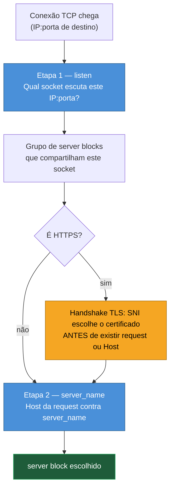
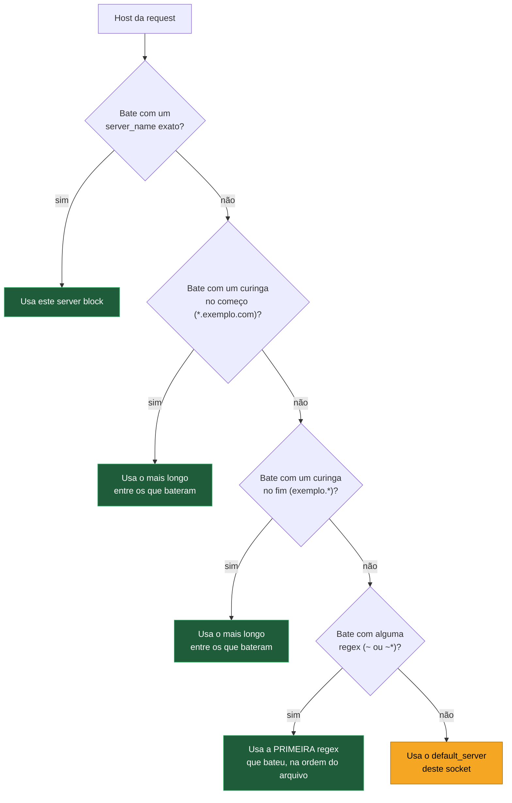
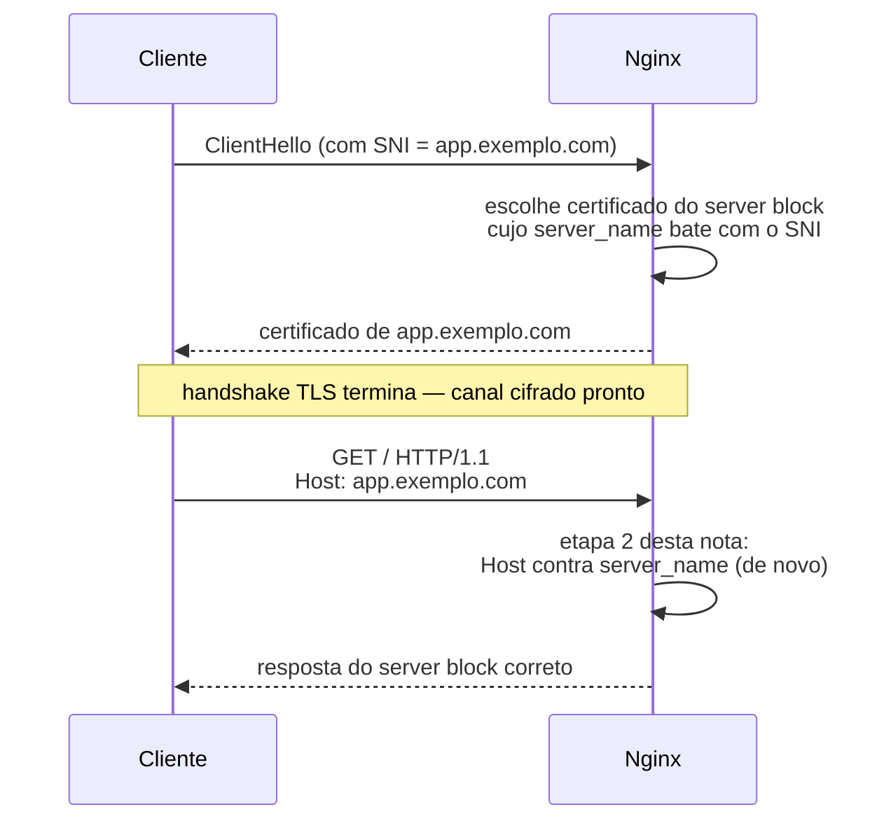

# 03 — Como o Nginx escolhe o `server` block

> [!abstract] TL;DR
> A escolha do `server` block que atende uma request acontece em **duas etapas** e em **dois momentos diferentes**: primeiro o sistema operacional entrega a conexão a um socket de escuta (`listen`), o que já reduz o universo de blocos candidatos a quem escuta naquele endereço e porta; depois, só dentro desse grupo, o Nginx compara o cabeçalho `Host` contra os `server_name` declarados, numa ordem de precedência fixa que não é a ordem do arquivo (exceto entre regex). Em HTTPS existe uma complicação que não tem equivalente em HTTP puro: o certificado TLS precisa ser escolhido durante o handshake, antes de existir request e portanto antes de existir `Host` — quem resolve isso é o SNI, e quando SNI e `Host` divergem, ou quando o cliente não manda SNI, o sintoma clássico é "o certificado errado apareceu" mesmo com a configuração de `server_name` perfeita.

Três `server` blocks, um IP só, e a mesma pergunta se repetindo em produção: por que a request para `app.exemplo.com` está caindo no bloco de `api.exemplo.com`? A configuração parece correta lida de cima para baixo — o bloco certo está ali, com o `server_name` certo — mas o comportamento observado diz outra coisa. Pior: em `curl -H "Host: app.exemplo.com" http://ip-do-servidor/` o roteamento funciona perfeitamente, mas o navegador, batendo em `https://app.exemplo.com`, recebe o certificado de outro domínio, com o aviso de segurança que assusta qualquer usuário. Os dois sintomas parecem o mesmo bug e não são. O primeiro é uma questão de precedência de `server_name`. O segundo acontece numa camada inteiramente anterior — o certificado já foi entregue antes de o Nginx sequer ler o `Host` — e nenhuma correção de `server_name` resolve, porque o problema não está ali.

Quem só olha o arquivo de cima para baixo, tratando `server` blocks como se fossem avaliados em ordem sequencial — o primeiro que "parecer" bater, ganha — está aplicando um modelo mental que funciona para `if`/`else` de qualquer linguagem de programação comum, mas não é o modelo que o Nginx de fato usa. Essa expectativa errada é exatamente o tipo de suposição por herança cultural que a introdução do galho já avisou: copiar bloco de configuração sem entender o algoritmo por trás produz um sistema que parece funcionar em teste manual e falha de forma imprevisível assim que um terceiro domínio, um cliente sem SNI, ou uma reordenação de arquivo entra em cena.

Essa dupla armadilha só faz sentido depois que a mecânica de seleção fica explícita. A nota anterior deste galho, [[03-Dominios/Tecnologia/Infraestrutura/Nginx/02 - A estrutura da configuração|02 — A estrutura da configuração]], estabeleceu como os contextos se aninham e como uma diretiva herdada é substituída, não fundida. Esta nota assume esse modelo de contextos como dado e responde a uma pergunta anterior a qualquer diretiva dentro do `server`: **qual `server` block, entre vários candidatos, processa esta request específica?** É a pergunta que precisa de resposta antes de fazer sentido perguntar qual `location` dentro dele vai atender — assunto que fica para a próxima nota do galho.

## Duas etapas, dois momentos diferentes

Vale nomear de saída a arquitetura da resposta, porque o erro mais comum de quem debuga esse tipo de problema é tratar a seleção como um processo único. Não é. A primeira etapa acontece no nível do sistema operacional e do socket TCP: o kernel entrega a conexão recebida a um processo `worker` do Nginx que está escutando naquele endereço IP e porta específicos, através da diretiva `listen`. A segunda etapa acontece só depois, já dentro da aplicação Nginx, comparando o cabeçalho `Host` da request HTTP contra os `server_name` dos blocos que compartilham aquele mesmo socket. A primeira etapa filtra por **onde a conexão chegou**; a segunda filtra por **o que o cliente disse que queria**, e só é possível porque a primeira já aconteceu.



Repare que o TLS não é um passo extra depois da etapa 2 — ele se intromete **entre** as duas, e roda com informação mais pobre do que a etapa 2 vai ter disponível segundos depois. É essa intromissão, mais do que qualquer detalhe de sintaxe, que explica por que "certificado errado" é uma categoria de bug diferente de "fui parar no `server` errado". A seção sobre TLS e SNI, mais adiante nesta nota, desenvolve essa consequência com profundidade; por ora, o que importa reter é que ela existe e que acontece antes da etapa 2, nunca depois.

## Etapa 1 — o socket de escuta

Toda diretiva `listen` declara um endereço IP e uma porta — ou só uma porta, deixando o endereço implícito. As três formas mais comuns:

```nginx
listen 80;              # equivale a 0.0.0.0:80 — qualquer endereço, porta 80
listen 192.168.1.10:80; # endereço específico, porta 80
listen *:80;            # forma explícita do wildcard de endereço
```

Quando dois `server` blocks têm `listen` que poderiam, em tese, capturar a mesma conexão — um escutando `192.168.1.10:80` e outro escutando `80` (ou seja, `0.0.0.0:80`) — o Nginx não trata isso como ambiguidade a ser resolvida na hora. Ele resolve a especificidade **antes**, ao montar a tabela de sockets: um `listen` com endereço IP explícito é mais específico do que um `listen` que só declara a porta, e vence quando uma conexão chega exatamente naquele endereço. Uma conexão chegando em `192.168.1.10:80` é entregue ao bloco que escuta `192.168.1.10:80`, mesmo que exista outro bloco escutando `80` (todos os endereços) na mesma porta; uma conexão chegando em qualquer outro endereço da máquina na porta 80 cai no bloco genérico. Só quando dois blocos têm exatamente a mesma especificidade de endereço:porta é que a etapa 2 — `server_name` contra `Host` — de fato decide entre eles.

```nginx
# Bloco A — específico: só responde em 192.168.1.10:80
server {
    listen 192.168.1.10:80;
    server_name app.exemplo.com;
    ...
}

# Bloco B — genérico: responde em qualquer endereço, porta 80
server {
    listen 80;
    server_name api.exemplo.com;
    ...
}
```

Uma conexão batendo em `192.168.1.10:80` só é candidata ao bloco A, independente do `Host` que ela carregue — o bloco B nem entra na comparação, porque a etapa 1 já o eliminou antes de qualquer `server_name` ser olhado. É esse mecanismo, e não um capricho de sintaxe, que explica a regra mais citada sobre `listen`: endereço explícito ganha de wildcard. Vale reter também que **múltiplos `server` blocks podem compartilhar o mesmo `listen`** — é exatamente esse compartilhamento que torna a etapa 2 necessária: sem ela, "todos escutam em `80`" significaria que só um `server` block poderia existir por porta, o que inviabilizaria hospedagem virtual baseada em nome.

### IPv4 e IPv6 são sockets separados, mesmo na mesma porta

Um detalhe que vale fixar antes de seguir: `listen 80;` escuta só em IPv4. Cobrir IPv6 exige uma segunda diretiva `listen`, explícita, dentro do mesmo `server` block:

```nginx
server {
    listen 80;
    listen [::]:80;
    server_name app.exemplo.com;
    ...
}
```

Isso não é uma segunda camada de precedência — é literalmente um segundo socket de escuta, tratado pela etapa 1 exatamente como qualquer outro par endereço:porta, só que na família IPv6. Um `server` block que declara os dois `listen` participa de dois grupos de socket diferentes ao mesmo tempo, um por família de endereço; um cliente batendo via IPv6 nunca é avaliado contra o socket IPv4, e vice-versa, mesmo que ambos apontem para o mesmo `server_name` no fim das contas. Omitir o `listen [::]:80;` não é um erro de sintaxe — é, silenciosamente, deixar aquele `server` block invisível para todo tráfego IPv6 nessa porta, que cairá no `default_server` IPv6 (se existir um) ou simplesmente não encontrará socket nenhum escutando.

### Não existe separação limpa entre IP-based e name-based

Vale desfazer, de passagem, uma distinção que soa mais rígida do que é na prática: a diferença entre um "virtual host baseado em IP" (cada site com seu próprio endereço) e um "virtual host baseado em nome" (vários sites compartilhando um endereço, diferenciados só pelo `Host`) não é uma escolha binária de arquitetura no Nginx — é só um efeito colateral de como `listen` e `server_name` combinam. Um mesmo arquivo de configuração pode misturar as duas estratégias livremente: alguns `server` blocks com `listen` em endereços exclusivos, tratados como IP-based porque a etapa 1 sozinha já os resolve; outros compartilhando um `listen` genérico, tratados como name-based porque dependem da etapa 2 para desempatar. Não existe uma diretiva que declare "este site é IP-based" — o comportamento nasce inteiramente da combinação de `listen` que cada bloco escolhe, e um mesmo `nginx.conf` pode ter as duas formas lado a lado sem conflito, porque cada `listen` é resolvido de forma independente na etapa 1.

> [!info] Baseline de versão
> Esta nota descreve o comportamento das versões correntes do Nginx em 2026 — mainline 1.31.3 (15 jul 2026) e stable 1.30.4. A partir da 1.25.1, a forma de ligar HTTP/2 mudou: o parâmetro `http2` dentro de `listen` (`listen 443 ssl http2;`) está deprecado em favor de uma diretiva própria, `http2 on;`, separada do `listen`. A mudança não afeta a lógica de seleção de socket descrita nesta seção — `listen` continua definindo só endereço, porta e o modo TLS — mas afeta qualquer exemplo de configuração copiado de material anterior a essa versão, que ainda mistura `http2` dentro do `listen`.

## Etapa 2 — `server_name` contra o cabeçalho `Host`

Uma vez que a etapa 1 já reduziu o universo a um grupo de `server` blocks compartilhando o mesmo socket, o Nginx lê o cabeçalho `Host` da request HTTP e o compara contra o `server_name` de cada bloco do grupo, seguindo uma ordem de precedência fixa — **não** a ordem em que os blocos aparecem no arquivo, com uma única exceção que a tabela abaixo marca.

| Ordem | Tipo de `server_name` | Exemplo | Ordem do arquivo importa? |
|---|---|---|---|
| 1 | Nome exato | `server_name app.exemplo.com;` | Não — é match direto, o mais específico possível |
| 2 | Curinga no começo | `server_name *.exemplo.com;` | Não entre curingas-início; o mais longo vence se houver mais de um |
| 3 | Curinga no fim | `server_name app.*;` | Não entre curingas-fim; o mais longo vence se houver mais de um |
| 4 | Expressão regular | `server_name ~^www\d+\.exemplo\.com$;` | **Sim** — a primeira regex que casa, na ordem em que aparece no arquivo, vence |

O Nginx para na primeira categoria que produzir um match: se existe um `server_name` exato batendo com o `Host`, nenhum curinga ou regex é sequer avaliado. Só quando a categoria inteira falha em produzir um match — nenhum nome exato bate — é que a próxima categoria da tabela entra em jogo. Dentro da categoria de regex, e só dentro dela, a posição no arquivo decide: a primeira regex, lida de cima para baixo entre os blocos do grupo, que casar com o `Host` é a vencedora, mesmo que uma regex mais específica exista mais abaixo no arquivo.



A consequência prática mais comum dessa tabela: alguém adiciona um `server_name *.exemplo.com;` esperando que ele capture tudo, inclusive `exemplo.com` sem subdomínio, e se surpreende quando `exemplo.com` puro cai no `default_server` em vez de no bloco do curinga — porque `*.exemplo.com` é, por definição, um curinga que exige pelo menos um rótulo antes do domínio; `exemplo.com` sem subdomínio simplesmente não bate com esse padrão, curinga ou não. Quem precisa cobrir os dois casos declara os dois nomes explicitamente no mesmo bloco: `server_name exemplo.com *.exemplo.com;`.

Vale também tornar concreto o critério de desempate "o mais longo vence" dentro de uma mesma categoria de curinga, porque ele só aparece quando dois blocos diferentes declaram curingas que, ambos, bateriam com o mesmo `Host`. Considere dois blocos, um com `server_name *.exemplo.com;` e outro com `server_name *.dept.exemplo.com;`, e uma request chegando com `Host: relatorios.dept.exemplo.com`. Os dois curingas batem: `relatorios.dept.exemplo.com` é subdomínio de `exemplo.com` e também é subdomínio de `dept.exemplo.com`. Entre os dois, `*.dept.exemplo.com` é o curinga mais longo — mais rótulos fixos no padrão, mais específico — e é ele quem vence, roteando a request para o bloco de `dept.exemplo.com`, não para o bloco genérico de `exemplo.com`, ainda que os dois blocos compartilhem o mesmo socket e o mesmo desempenho de avaliação.

Regex custam mais para avaliar do que nome exato ou curinga — cada uma é testada, uma a uma, até achar a que bate ou esgotar a lista — o que é outro motivo, além da previsibilidade, para preferir nome exato e curinga sempre que a lógica de roteamento permitir, e reservar regex para os casos em que só ela resolve, como capturar um identificador dentro do próprio hostname com um grupo nomeado.

### Diagnosticando qual bloco de fato está ativo

Antes de seguir para `default_server`, vale nomear a ferramenta que evita boa parte da dor de cabeça desta nota: `nginx -T`. Diferente de `nginx -t`, que só valida a sintaxe e retorna "syntax is ok" ou o erro correspondente, `nginx -T` **imprime a configuração inteira já resolvida**, com todos os `include` expandidos, exatamente como o Nginx a interpretou ao carregar. É a forma mais direta de responder "qual `listen` e qual `server_name` este bloco realmente tem?" sem depender de reconstruir mentalmente a árvore de `include`s espalhados por `sites-enabled/`, `conf.d/` e módulos de terceiros.

```bash
sudo nginx -T | less
# ou, filtrando só os blocos server de um arquivo específico:
sudo nginx -T | grep -A 5 "server_name app.exemplo.com"
```

Combinado com um teste de request real, `nginx -T` fecha o ciclo de diagnóstico: primeiro confirma-se, na configuração resolvida, qual `listen` e qual `server_name` um bloco de fato declara; depois confirma-se, com `curl -H "Host: ..."` ou `openssl s_client -servername ...`, qual bloco a request realmente atinge. Divergência entre os dois é sinal de que a precedência descrita nas seções anteriores está produzindo um resultado diferente do que a leitura ingênua do arquivo sugeriria — o próprio motivo de existir desta nota.

## `default_server`: quem atende quando nada casa

Quando o `Host` da request não bate com nenhum `server_name` de nenhum bloco do grupo, o Nginx não recusa a conexão nem lança um erro genérico — ele entrega a request a um `server` block específico, marcado como o **`default_server`** daquele socket de escuta. A marcação é feita como parâmetro do próprio `listen`, nunca do `server_name`:

```nginx
server {
    listen 80 default_server;
    server_name _;
    return 444;
}
```

O ponto que costuma passar despercebido é o escopo dessa marcação: **`default_server` é uma propriedade do socket de escuta, não uma propriedade global do arquivo de configuração.** Cada combinação distinta de endereço:porta pode ter o seu próprio `default_server`, independente dos outros. Um `listen 192.168.1.10:80 default_server;` e um `listen 192.168.1.20:80 default_server;` em blocos diferentes não conflitam entre si — são dois sockets diferentes, cada um com seu próprio padrão.

E se ninguém marcar `default_server` explicitamente em nenhum bloco de um dado socket? O Nginx não recusa a configuração nem levanta erro — ele escolhe implicitamente **o primeiro `server` block, na ordem em que aparece no arquivo de configuração (respeitando a ordem de `include`), entre os que compartilham aquele endereço:porta**. Esse comportamento implícito é a origem de um bug de produção clássico: alguém adiciona um terceiro `server` block a uma configuração que já tinha dois, sem se preocupar com a ordem, e de repente o site que era servido por engano a qualquer domínio desconhecido apontado para aquele IP muda — não porque alguém decidiu isso, mas porque a posição no arquivo mudou.

## `server_name ""` e a request sem `Host`

Uma request HTTP tecnicamente válida pode chegar sem cabeçalho `Host` — HTTP/1.0 não exige o cabeçalho, e alguns clientes malformados ou automatizados o omitem mesmo em HTTP/1.1. O Nginx trata essa ausência como um valor de nome vazio, e existe uma forma explícita de capturar esse caso: `server_name "";`.

```nginx
server {
    listen 80;
    server_name "";
    return 444;
}
```

Desde a versão 0.8.48, `server_name ""` é o valor padrão quando nenhum `server_name` é declarado — ou seja, um `server` block sem `server_name` algum já trata implicitamente requests sem `Host` como um match seu. Um bloco que declara explicitamente `server_name exemplo.com "";` cobre os dois cenários no mesmo lugar: nome correto e ausência de nome. Sem essa cobertura, uma request sem `Host` cai na mesma regra geral de "nada casou" — vai para o `default_server` do socket, exatamente como uma request com `Host` desconhecido.

## O bloco catch-all defensivo

A pergunta natural depois de entender `default_server` e a escolha implícita é: por que não simplesmente deixar o primeiro site cadastrado absorver esse papel por acidente? A resposta é uma questão de superfície de exposição. Qualquer domínio, de qualquer pessoa, apontado via DNS para o IP público do servidor — mesmo um domínio que nunca teve relação nenhuma com a aplicação — vai bater naquele IP:porta e, não encontrando `server_name` correspondente, cair no `default_server`. Se o `default_server` implícito for, por acaso, o site principal da aplicação, esse site vira o rosto público de qualquer domínio de terceiro mal-intencionado apontado para o mesmo IP, incluindo cenários de scanner automatizado testando milhares de hostnames por segundo contra IPs conhecidos, coletando certificados e conteúdo por reflexo.

A defesa padrão é declarar um `server` block dedicado, `default_server` explícito, que não serve conteúdo nenhum — só fecha a conexão:

```nginx
server {
    listen 80 default_server;
    listen 443 ssl default_server;
    server_name _;

    ssl_certificate     /etc/nginx/ssl/catch-all.crt;
    ssl_certificate_key /etc/nginx/ssl/catch-all.key;

    return 444;
}
```

`444` é um código de status não padronizado, específico do Nginx: ele fecha a conexão TCP sem enviar nenhuma resposta HTTP de volta. Para um scanner automatizado, isso é mais barato de descartar do que qualquer resposta de erro estruturada — não há corpo para interpretar, não há cabeçalho para logar, a conexão simplesmente morre. A alternativa é um `421 Misdirected Request`, o status HTTP padrão para "esta conexão está servindo o hostname errado" — mais informativo para um cliente HTTP bem-comportado, mas também mais generoso em informação para quem está sondando o servidor de propósito. A escolha entre os dois é uma questão de postura: `444` para minimizar qualquer resposta a tráfego não solicitado, `421` para manter uma semântica HTTP correta quando o consumidor esperado é outro sistema, não um scanner hostil.

O bloco HTTPS do catch-all merece atenção à parte, porque ele precisa de um certificado mesmo servindo tráfego que será descartado — e é exatamente esse detalhe que conecta esta seção à próxima. Vale usar aqui um certificado autoassinado, genérico, gerado só para essa finalidade (às vezes chamado de certificado "snake oil"), nunca o certificado real do domínio principal — porque, como a próxima seção detalha, esse é precisamente o certificado que um cliente sem SNI vai receber.

> [!warning] `server_name _;` não é sintaxe especial
> O sublinhado (`_`) em `server_name _;` não é um curinga reconhecido pelo Nginx — é só uma convenção de nome que, por não ser um hostname real que alguém registraria, sinaliza intenção de "catch-all" para quem lê a configuração depois. O que de fato faz esse bloco capturar tudo que sobrou é o `default_server` no `listen`, combinado com a ausência de qualquer `server_name` real que pudesse capturar o `Host` antes de chegar aqui.

## O nó da nota — a interação com TLS e SNI

Tudo que as seções anteriores descreveram — `listen`, especificidade de socket, `server_name` contra `Host`, `default_server` — pressupõe que o Nginx já tem uma request HTTP legível na mão, com um cabeçalho `Host` para comparar. Em HTTPS, isso não é verdade no momento em que a decisão mais crítica precisa ser tomada: **qual certificado apresentar**. A teoria completa do handshake TLS — como ele negocia cifras, como a cadeia de confiança é validada, o papel exato de cada extensão da ClientHello — está em [[03-Dominios/Ciência/Redes e Protocolos/05 - TLS e HTTPS|TLS e HTTPS]]; esta seção trata só da consequência específica para a escolha do `server` block, não do protocolo em si.

O ponto de partida do problema é uma questão de ordem temporal, não de configuração. A conexão TLS é estabelecida — certificado apresentado, chaves negociadas, canal cifrado montado — **antes** de o cliente enviar qualquer byte da request HTTP propriamente dita. O cabeçalho `Host`, que é o que a etapa 2 desta nota usa para escolher o `server` block, faz parte da request HTTP; ele simplesmente não existe ainda no instante em que o Nginx precisa decidir qual certificado oferecer. Sem nenhum outro mecanismo, o Nginx estaria cego nesse momento — obrigado a escolher um certificado sem saber para qual domínio a conexão é.

A extensão **SNI** (*Server Name Indication*, RFC 6066) resolve exatamente essa cegueira: ela permite que o cliente TLS envie o hostname pretendido já dentro da própria ClientHello, na primeira mensagem do handshake, antes de qualquer coisa cifrada trafegar. Com SNI, o Nginx lê esse hostname e escolhe, entre os `server` blocks daquele socket, o certificado do bloco cujo `server_name` bate com o nome recebido — usando essencialmente a mesma lógica de comparação de nomes da etapa 2, só que aplicada ao nome vindo do SNI em vez de ao `Host` HTTP, e num momento anterior do ciclo de vida da conexão.



Repare que a comparação de nome acontece **duas vezes** numa conexão HTTPS típica: uma vez durante o handshake, guiada pelo SNI, para escolher o certificado; outra vez depois, já dentro do canal cifrado, guiada pelo `Host` HTTP, para escolher o `server` block que efetivamente processa a request — o mesmo mecanismo da etapa 2 descrita antes nesta nota. Na grande maioria das conexões reais, SNI e `Host` carregam o mesmo valor, porque é o mesmo navegador, na mesma aba, preenchendo os dois a partir da mesma URL — e por isso a duplicidade passa despercebida. Mas nada no protocolo garante que os dois coincidam, e é exatamente aí que nascem os dois sintomas mais confusos dessa área da configuração.

> [!question] O que acontece quando SNI e `Host` não coincidem?
> São mecanismos independentes, decididos em momentos diferentes por camadas diferentes do protocolo, e nada os força a concordar. Um cliente pode, tecnicamente, enviar um SNI e depois, na request HTTP já dentro do canal cifrado, mandar um `Host` diferente — um comportamento raro em navegadores comuns, mas plenamente possível, e usado de propósito em algumas técnicas de *domain fronting* e em ferramentas de diagnóstico. Quando isso acontece, o Nginx já entregou o certificado escolhido pelo SNI — essa decisão é irreversível, o handshake já terminou — e só depois aplica a etapa 2 desta nota sobre o `Host`, potencialmente escolhendo um `server` block diferente daquele cujo certificado foi de fato apresentado ao cliente. O resultado visível: uma conexão que serve conteúdo de um domínio sob o certificado de outro.

O caso mais comum na prática, porém, não envolve nenhum comportamento exótico de cliente — envolve a simples ausência de SNI. Clientes muito antigos, algumas bibliotecas HTTP de baixo nível mal configuradas, e sobretudo scanners e bots automatizados que abrem conexão TLS direto no IP sem passar por resolução de nome, não enviam extensão SNI nenhuma. Diante disso, o Nginx não tem hostname algum para comparar durante o handshake — e cai exatamente na mesma regra descrita na seção sobre `default_server`: apresenta o certificado do `default_server` daquele socket, porque é o único certificado que ele pode oferecer sem saber para qual domínio a conexão pretende ir.

> [!info] Certificado errado sem SNI é comportamento documentado, não bug
> A própria documentação oficial do Nginx é explícita sobre esse ponto: como a conexão TLS é estabelecida antes de a request HTTP ser enviada, e o Nginx não sabe qual servidor foi de fato solicitado, ele "só pode oferecer o certificado do servidor padrão" para conexões sem SNI. Isso significa que qualquer cliente sem suporte a SNI batendo em qualquer `server_name` que não seja o `default_server` daquele socket recebe o certificado errado — sempre, por design, não como falha ocasional. Para clientes desse tipo, a única solução estrutural é dar a cada certificado seu próprio endereço IP, eliminando a necessidade de escolher entre vários certificados no mesmo socket.

É essa mesma mecânica que torna o certificado "snake oil" do bloco catch-all, descrito na seção anterior, uma escolha deliberada: qualquer scanner batendo sem SNI no IP do servidor recebe justamente esse certificado genérico e inútil, nunca o certificado real de nenhum domínio de produção — porque o `default_server` é, por construção, quem responde quando o Nginx não tem hostname nenhum para decidir de outra forma.

> [!warning] "Funciona no `curl -k`, quebra no navegador" é sintoma de SNI, não de `server_name`
> Um `curl https://ip-do-servidor/ -k --resolve app.exemplo.com:443:ip-do-servidor` sem cuidado adicional pode não enviar SNI da forma esperada dependendo da versão e das flags usadas, recebendo silenciosamente o certificado do `default_server` — e quem está debugando, vendo o certificado errado só nesse teste manual, mas vendo o certificado certo no navegador (que sempre envia SNI corretamente), tende a suspeitar de cache de DNS ou de propagação de certificado, quando o problema real é só a ausência de SNI naquela chamada específica de teste. O diagnóstico correto usa `openssl s_client -connect ip:443 -servername app.exemplo.com` explicitamente, que força o SNI, ou confere direto no navegador — nunca um `curl -k` sem `--resolve` bem configurado contra um IP nu.

Vale registrar, ainda que sem se aprofundar — isso pertence à nota sobre TLS —, que o Nginx expõe o nome recebido via SNI numa variável própria, `$ssl_server_name`, disponível desde a versão 1.7.0. Ela é a base de um padrão usado em setups multi-tenant com centenas de domínios: em vez de declarar um `server` block e um par de certificados para cada domínio, um único bloco usa `$ssl_server_name` para montar dinamicamente o caminho do certificado a carregar (`ssl_certificate $ssl_server_name.crt;`), carregando o arquivo certo por handshake em vez de manter centenas de blocos estáticos. A documentação oficial já avisa o custo dessa flexibilidade: usar variáveis no caminho do certificado implica carregar um certificado do disco a cada handshake, o que tem impacto de desempenho perceptível sob volume alto — um trade-off explícito entre simplicidade de configuração e custo por conexão.

Todos os detalhes de configuração do certificado em si — a ordem da cadeia no arquivo, sessão e tickets TLS, OCSP stapling, os protocolos e cifras aceitos — pertencem à nota [[03-Dominios/Tecnologia/Infraestrutura/Nginx/09 - TLS no Nginx|09 — TLS no Nginx]]. O que esta seção fixa é só a interação que importa aqui: SNI decide o certificado antes de o `Host` existir, os dois mecanismos comparam nomes de forma independente, e um cliente sem SNI está, por design do protocolo, condenado ao certificado do `default_server`.

## Exemplo trabalhado: três `server` blocks e a precedência na prática

Vale fechar o corpo técnico com uma configuração completa, comentada, que junta as três camadas desta nota — socket, `server_name`, TLS — e permite prever o comportamento de qualquer request antes de testá-la de fato.

```nginx
# Bloco 1 — o app principal, nome exato + curinga de subdomínio
server {
    listen 443 ssl default_server;   # é o default deste socket: primeiro no arquivo
    http2 on;
    server_name app.exemplo.com *.app.exemplo.com;

    ssl_certificate     /etc/nginx/ssl/app.exemplo.com.crt;
    ssl_certificate_key /etc/nginx/ssl/app.exemplo.com.key;

    location / {
        proxy_pass http://app_upstream;
    }
}

# Bloco 2 — a API, nome exato específico
server {
    listen 443 ssl;
    http2 on;
    server_name api.exemplo.com;

    ssl_certificate     /etc/nginx/ssl/api.exemplo.com.crt;
    ssl_certificate_key /etc/nginx/ssl/api.exemplo.com.key;

    location / {
        proxy_pass http://api_upstream;
    }
}

# Bloco 3 — legado, capturado por regex numerada
server {
    listen 443 ssl;
    http2 on;
    server_name ~^legado(?<versao>\d+)\.exemplo\.com$;

    ssl_certificate     /etc/nginx/ssl/legado.exemplo.com.crt;
    ssl_certificate_key /etc/nginx/ssl/legado.exemplo.com.key;

    location / {
        proxy_pass http://legado_upstream_$versao;
    }
}
```

Com essa configuração, vale seguir três requests concretas até o fim:

Uma request com `Host: api.exemplo.com` e SNI `api.exemplo.com`: a etapa 1 já colocou os três blocos no mesmo grupo, porque todos escutam `443 ssl` sem endereço específico. Durante o handshake, o SNI bate com nome exato do bloco 2, que apresenta o certificado de `api.exemplo.com`. Depois, na etapa 2, o `Host` HTTP bate com o mesmo nome exato do mesmo bloco 2 — os dois mecanismos concordam, como na maioria esmagadora dos casos reais, e a request é servida pelo `api_upstream`.

Uma request com `Host: legado3.exemplo.com`: nenhum nome exato bate (nem bloco 1, nem bloco 2 declaram esse nome), nenhum curinga-início ou curinga-fim bate — só o curinga de subdomínio do bloco 1 (`*.app.exemplo.com`) existe, e `legado3.exemplo.com` não é subdomínio de `app.exemplo.com`. A regex do bloco 3 bate, captura `3` no grupo nomeado `versao`, e a request vai para `legado_upstream_3`.

Uma request sem SNI algum, batendo direto no IP: o handshake TLS não tem hostname para comparar, e o certificado apresentado é o do bloco 1 — o `default_server` explícito daquele socket — mesmo que o `Host` HTTP, enviado depois já dentro desse canal cifrado com o certificado errado, seja `api.exemplo.com`. Um cliente rigoroso quanto à identidade do certificado recusa a conexão nesse ponto, antes mesmo de a etapa 2 rodar; um cliente permissivo (ou com verificação desabilitada) segue adiante, e a etapa 2 escolhe corretamente o bloco 2 pelo `Host`, servindo conteúdo de `api.exemplo.com` sob um certificado que nomeia `app.exemplo.com` — o sintoma exato descrito na abertura desta nota.

## Dois cenários de produção que dependem desta precedência

Vale sair do exemplo sintético e ver a mesma mecânica decidindo o resultado de duas situações que aparecem com frequência em produção — uma puramente de `server_name`, outra que mistura `server_name` com o `default_server` da seção anterior.

### Migração de domínio com o `default_server` como rede de segurança

Uma aplicação está migrando de `app-legado.com` para `app.exemplo.com`, e o DNS dos dois domínios já aponta para o mesmo servidor durante a janela de transição, enquanto clientes antigos (bookmarks, integrações não atualizadas, cache de DNS residual) ainda batem no domínio velho. A configuração de transição usa exatamente a precedência de nome exato para não deixar margem de erro:

```nginx
server {
    listen 443 ssl default_server;
    http2 on;
    server_name app.exemplo.com;   # domínio novo — é o default explícito

    ssl_certificate     /etc/nginx/ssl/app.exemplo.com.crt;
    ssl_certificate_key /etc/nginx/ssl/app.exemplo.com.key;

    location / {
        proxy_pass http://app_upstream;
    }
}

server {
    listen 443 ssl;
    http2 on;
    server_name app-legado.com;    # domínio antigo — nome exato, próprio bloco

    ssl_certificate     /etc/nginx/ssl/app-legado.com.crt;
    ssl_certificate_key /etc/nginx/ssl/app-legado.com.key;

    location / {
        return 301 https://app.exemplo.com$request_uri;
    }
}
```

Os dois domínios batem em nome exato — a categoria mais alta da tabela de precedência — então não existe ambiguidade nenhuma entre eles: cada `Host` cai no seu próprio bloco, independente da ordem em que os blocos aparecem no arquivo. O papel do `default_server` aqui não é resolver essa disputa (ela já está resolvida por nome exato); é capturar o terceiro caso, silencioso e fácil de esquecer, de qualquer outro hostname apontado para o mesmo IP por engano ou por scanner — que cai no bloco do domínio novo em vez de vazar para o legado, garantindo que, se algo não previsto acontecer, o comportamento padrão do servidor seja "servir a versão atual da aplicação", não "servir a versão sendo descontinuada".

### SaaS multi-tenant: subdomínio de plataforma contra domínio próprio do cliente

Uma plataforma SaaS atende dois tipos de acesso: o subdomínio padrão que todo cliente ganha (`clienteA.plataforma.com`) e, para clientes maiores, um domínio próprio configurado via CNAME (`app.clienteb.com`). Os dois caminhos convivem no mesmo Nginx, e a diferença de categoria de `server_name` entre eles é o que torna a configuração previsível em vez de frágil:

```nginx
server {
    listen 443 ssl;
    http2 on;
    server_name *.plataforma.com;   # curinga-início: todo subdomínio da plataforma

    ssl_certificate     /etc/nginx/ssl/wildcard.plataforma.com.crt;
    ssl_certificate_key /etc/nginx/ssl/wildcard.plataforma.com.key;

    location / {
        proxy_set_header X-Tenant-Slug $host;
        proxy_pass http://tenant_upstream;
    }
}

server {
    listen 443 ssl;
    http2 on;
    server_name app.clienteb.com;   # nome exato: domínio próprio de um cliente específico

    ssl_certificate     $ssl_server_name.crt;   # carregado dinamicamente por tenant
    ssl_certificate_key $ssl_server_name.key;

    location / {
        proxy_set_header X-Tenant-Slug "clienteb";
        proxy_pass http://tenant_upstream;
    }
}
```

Como nome exato vence sobre curinga na tabela de precedência, `app.clienteb.com` sempre cai no seu próprio bloco, nunca no bloco genérico do curinga — mesmo que, coincidentemente, `clienteb` também tivesse um subdomínio `clienteb.plataforma.com` ativo ao mesmo tempo. Isso é o que permite a uma plataforma SaaS oferecer domínio próprio como funcionalidade sem precisar reescrever a lógica de roteamento do subdomínio padrão: os dois convivem porque pertencem a categorias diferentes da mesma tabela, e a categoria mais específica sempre tem prioridade sobre a mais genérica, por construção, sem precisar de nenhuma regra adicional de exceção escrita à mão.

Repare também que o segundo bloco reaparece com o padrão de certificado dinâmico via `$ssl_server_name` apresentado na seção sobre TLS e SNI — é exatamente este tipo de cenário, um domínio próprio por cliente, que torna esse padrão vantajoso: sem ele, cada novo cliente com domínio próprio exigiria um `server` block inteiro, hardcoded, só para trocar o caminho dos dois arquivos de certificado.

## Armadilhas comuns

> [!warning] Confiar que `curl` sem `-H "Host:"` testa o roteamento de produção
> **O que acontece:** um `curl http://ip-do-servidor/` sem cabeçalho `Host` explícito, ou um `curl` contra `localhost` em vez do domínio real, cai quase sempre no `default_server`, não no bloco que a pessoa pretendia testar. **Por quê:** sem `Host` (ou com um `Host` igual ao IP/`localhost`), nenhum `server_name` real bate, e a etapa 2 cai direto na regra de "nada casou" descrita na seção sobre `default_server`. **Como evitar:** sempre testar com `curl -H "Host: dominio-real.com" http://ip-do-servidor/`, ou usar `--resolve dominio-real.com:443:ip-do-servidor` para HTTPS, garantindo que tanto SNI quanto `Host` estejam corretos na chamada de teste.

> [!warning] Reordenar `server` blocks sem revisar o `default_server` implícito
> **O que acontece:** alguém adiciona um `server` block novo antes dos existentes — por convenção de organização alfabética, por exemplo — e um domínio de terceiro, ou um scanner, passa a receber o conteúdo desse bloco novo em vez de cair no catch-all esperado. **Por quê:** quando nenhum bloco tem `default_server` explícito, o Nginx escolhe implicitamente o primeiro bloco do arquivo (respeitando `include`) para aquele socket; reordenar o arquivo muda esse "primeiro" sem nenhum aviso. **Como evitar:** marcar `default_server` explicitamente em todo socket de escuta que tenha mais de um `server` block, de preferência apontando para o bloco catch-all defensivo, nunca deixando a escolha implícita decidir isso por acidente de ordenação.

> [!warning] Achar que um curinga como `*.exemplo.com` cobre o domínio nu `exemplo.com`
> **O que acontece:** `exemplo.com` sem subdomínio nenhum cai inesperadamente no `default_server`, mesmo existindo um bloco com `server_name *.exemplo.com;` que, à primeira vista, "deveria" cobrir tudo relacionado a `exemplo.com`. **Por quê:** um curinga no começo exige pelo menos um rótulo antes do domínio-base — `*.exemplo.com` casa com `www.exemplo.com` ou `app.exemplo.com`, mas não com `exemplo.com` puro, que não tem nada antes do ponto para o curinga consumir. **Como evitar:** declarar os dois nomes no mesmo `server_name`, explicitamente: `server_name exemplo.com *.exemplo.com;`.

> [!warning] Testar TLS com uma ferramenta que não envia SNI e concluir que o certificado está errado
> **O que acontece:** um teste manual com uma biblioteca antiga, um `openssl s_client` sem `-servername`, ou um scanner de rede genérico recebe o certificado do `default_server` e é interpretado como "o Nginx está servindo o certificado errado para este domínio", quando o domínio nunca foi de fato comunicado ao Nginx. **Por quê:** sem SNI, o Nginx não tem hostname para escolher entre certificados durante o handshake e cai, por design documentado, no certificado do `default_server` daquele socket. **Como evitar:** sempre incluir `-servername dominio.com` em testes com `openssl s_client`, e lembrar que qualquer teste sem SNI explícito não valida a escolha de certificado — só valida que o handshake em si funciona.

> [!warning] Assumir que `nginx -t` valida também a precedência de `server_name`
> **O que acontece:** um deploy passa em `nginx -t` sem erro, mas em produção uma request cai num `server` block diferente do esperado — e a pessoa responsável pelo deploy assume que, já que a config "validou", o roteamento também está correto. **Por quê:** `nginx -t` valida só sintaxe e semântica estrutural (diretivas conhecidas, tipos de valor corretos, contextos permitidos) — ele não simula requests nem verifica se a ordem de precedência entre vários `server_name` produz o resultado que a pessoa tinha em mente. **Como evitar:** depois de todo `nginx -t` limpo, seguir com `nginx -T` para conferir a configuração resolvida e com testes de request reais (`curl -H "Host: ..."`, `openssl s_client -servername ...`) contra os domínios que a mudança afeta, antes de considerar o deploy validado.

## Como explicar em inglês

> "Server block selection in nginx happens in two stages, at two different times. First, the OS hands the connection to whichever listen socket matches the destination address and port — a listen directive with an explicit IP address beats a wildcard on the same port. Only within that group does nginx compare the Host header against server_name, following a fixed precedence: exact name, then wildcard at the start, then wildcard at the end, then regular expressions in file order. If nothing matches, the request goes to that socket's default_server — which is either explicitly marked, or implicitly the first server block declared for that address:port. With TLS it gets trickier: the certificate has to be chosen during the handshake, before nginx has read any Host header at all, because the TLS handshake completes before the HTTP request is sent. SNI is what makes that possible — the client sends the intended hostname inside the ClientHello — but a client without SNI support gets the default_server's certificate, always, by design. That's the classic 'wrong certificate' bug: it's not a server_name misconfiguration, it's a client that never sent SNI in the first place."

| PT | EN |
|---|---|
| socket de escuta | listening socket |
| endereço explícito vs. curinga | explicit address vs. wildcard |
| grupo de server blocks | server block group |
| servidor padrão | default server |
| curinga no começo/fim | leading/trailing wildcard |
| aperto de mão TLS | TLS handshake |
| indicação de nome do servidor | Server Name Indication (SNI) |
| certificado errado | wrong certificate |
| bloco catch-all | catch-all block |
| divergência entre SNI e Host | SNI/Host mismatch |

## O que vem a seguir

Uma vez que o `server` block certo foi escolhido — pela etapa 1, pela etapa 2, e com o certificado certo entregue se for HTTPS — a pergunta seguinte é interna àquele bloco: entre vários `location` declarados, qual deles atende o path da request? A lógica muda de figura por completo, porque `location` usa modificadores próprios (`=`, `^~`, `~`, `~*`, prefixo puro) com uma ordem de avaliação que também não é a ordem do arquivo, mas por um critério diferente do desta nota.

- [[03-Dominios/Tecnologia/Infraestrutura/Nginx/04 - location e a tabela de precedência|04 — `location` e a tabela de precedência]] — os cinco modificadores e por que o `location` mais específico vence, não o primeiro do arquivo.
- [[03-Dominios/Tecnologia/Infraestrutura/Nginx/05 - O ciclo de vida de uma request|05 — O ciclo de vida de uma request]] — depois de `server` e `location` escolhidos, a request ainda passa por fases de processamento distintas, e uma diretiva na fase errada simplesmente não tem efeito.
- [[03-Dominios/Tecnologia/Infraestrutura/Nginx/09 - TLS no Nginx|09 — TLS no Nginx]] — a configuração completa de certificado, cadeia, sessão e protocolos que esta nota deixou de fora de propósito.

## Fontes

- **Nginx Docs** — [*How nginx processes a request*](https://nginx.org/en/docs/http/request_processing.html) — a fonte oficial sobre a separação entre seleção por `listen` e seleção por `server_name`, e sobre a regra de `default_server` como propriedade do socket.
- **Nginx Docs** — [*Server names*](https://nginx.org/en/docs/http/server_names.html) — a ordem de precedência completa de `server_name` (exato, curinga-início, curinga-fim, regex), o papel de `server_name ""` e o comportamento sem cabeçalho `Host`.
- **Nginx Docs** — [*Module ngx_http_core_module — `listen`*](https://nginx.org/en/docs/http/ngx_http_core_module.html#listen) — a sintaxe do `listen`, o parâmetro `default_server`, e a regra de que o primeiro `server` daquele endereço:porta vira o padrão implícito quando ninguém marca explicitamente.
- **Nginx Docs** — [*Configuring HTTPS servers*](https://nginx.org/en/docs/http/configuring_https_servers.html) — a explicação oficial de por que um cliente sem SNI recebe o certificado do `default_server`, e a introdução do SNI como solução.
- **Nginx Docs** — [*Module ngx_http_ssl_module*](https://nginx.org/en/docs/http/ngx_http_ssl_module.html) — a variável `$ssl_server_name` e a recomendação de IPs separados por certificado para máxima compatibilidade com clientes sem SNI.
- **Nginx Docs** — [*Module ngx_http_v2_module — `http2`*](https://nginx.org/en/docs/http/ngx_http_v2_module.html) — a diretiva `http2` própria, introduzida na 1.25.1, substituindo o parâmetro `http2` dentro de `listen`.
- **DigitalOcean** — [*Understanding Nginx Server and Location Block Selection Algorithms*](https://www.digitalocean.com/community/tutorials/understanding-nginx-server-and-location-block-selection-algorithms) — descreve com exemplos a regra de especificidade de `listen` (endereço explícito vence wildcard) que a documentação oficial não enuncia de forma tão direta.
- **IETF** — [*RFC 6066 — Transport Layer Security (TLS) Extensions: Extension Definitions*](https://datatracker.ietf.org/doc/html/rfc6066) — define formalmente a extensão SNI que o Nginx consulta durante o handshake, referenciada diretamente pela documentação oficial de TLS do Nginx.
