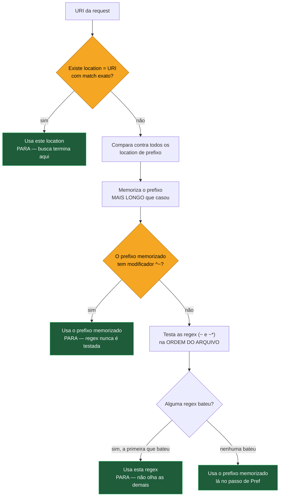

# 04 — `location` e a tabela de precedência

> [!abstract] TL;DR
> Dentro do `server` block escolhido, o Nginx decide qual `location` atende cada request num algoritmo de **duas fases**, não numa varredura sequencial do arquivo: primeiro compara **prefixos** (strings literais no início do path) e memoriza o mais longo que casar; depois testa **expressões regulares**, na ordem em que aparecem no arquivo, parando na primeira que casar. Se nenhuma regex casar, vence o prefixo memorizado na primeira fase. Dois modificadores mudam esse fluxo: `=` produz match exato e encerra a busca imediatamente, antes de qualquer outra coisa ser avaliada; `^~`, aplicado ao prefixo mais longo, pula a fase de regex por completo. O resultado é que um `location /static/` de prefixo, por mais específico que pareça, perde de rotina para um `location ~ \.php$` de regex escrito bem mais abaixo no arquivo — e a única forma de proteger um prefixo dessa derrota é `^~`, não reescrever o prefixo de outro jeito.

Duas requests batem no mesmo `server` block, `GET /static/relatorio.php` e `GET /static/imagem.png`. A configuração tem um `location /static/` cuidadosamente posicionado no topo do arquivo, servindo arquivos de um diretório fixo, e um `location ~ \.php$` mais abaixo, encaminhando qualquer coisa terminada em `.php` para o PHP-FPM. A intuição de quem lê de cima para baixo diz que `/static/relatorio.php` deveria cair no primeiro bloco — está escrito primeiro, e o path começa exatamente com o prefixo declarado. Na prática, a request cai no segundo bloco, o PHP-FPM tenta interpretar um arquivo que não existe no seu diretório de trabalho, e o cliente recebe um 404 vindo de uma camada inteiramente diferente da que a configuração parecia garantir. Ninguém editou o arquivo entre um teste e outro; o comportamento sempre foi esse, só que ninguém tinha mandado a request certa para expor.

O sintoma gêmeo, ainda mais desorientador, é um `location` que parece "nunca ser alcançado" apesar de estar escrito antes de qualquer outro candidato plausível. Alguém adiciona um bloco novo, testa, e o bloco novo nunca dispara — como se o Nginx estivesse ignorando a ordem do arquivo de propósito. Ele está, de fato, ignorando a ordem do arquivo — só que não por capricho: a ordem do arquivo só decide alguma coisa dentro da categoria de regex, e mesmo assim só entre regexes que competem entre si. Fora dessa categoria específica, o algoritmo de seleção de `location` segue um critério de especificidade, memorizado em duas etapas distintas, que a nota anterior já preparou o terreno para reconhecer: a nota [[03-Dominios/Tecnologia/Infraestrutura/Nginx/03 - Como o Nginx escolhe o server block|03 — Como o Nginx escolhe o `server` block]] mostrou que a escolha do `server_name` também não é sequencial, exceto entre regex — o mesmo padrão se repete aqui, um nível de aninhamento adiante, com regras próprias de especificidade.

## O algoritmo, em cinco passos exatos

Vale nomear o algoritmo por inteiro antes de qualquer exemplo, porque cada passo tem uma ordem fixa e um motivo estrutural para existir nessa posição, não em outra.

1. O Nginx primeiro examina todos os `location` de **prefixo** — strings literais que o path da request precisa começar com. Entre os que casam, o de **prefixo mais longo** é selecionado e **memorizado** — não aplicado ainda, só guardado como candidato provisório.
2. Em seguida, as **expressões regulares** (`~` e `~*`) são testadas **na ordem em que aparecem no arquivo**. A busca **termina no primeiro match**; a configuração daquele `location` é a usada, e nenhuma regex posterior é sequer avaliada.
3. Se nenhuma regex casar, a busca recai sobre o `location` de prefixo memorizado no passo 1 — ele estava esperando esse desfecho o tempo todo.
4. Exceção ao passo 2: se o `location` de prefixo mais longo memorizado no passo 1 carrega o modificador `^~`, as expressões regulares **não são testadas de jeito nenhum** — o algoritmo para ali, no prefixo, sem nunca chegar ao passo 2.
5. Exceção anterior a tudo: o modificador `=` marca **match exato** de URI. É o primeiro teste que o Nginx faz — mais barato que qualquer comparação de prefixo ou regex — e, se um match exato é encontrado, **a busca termina imediatamente**, sem examinar nenhum outro `location`, prefixo ou regex.

Repare no que esses cinco passos implicam, e que vale tornar explícito porque é o coração pedagógico da nota: **a ordem de avaliação não é a ordem do arquivo**, em lugar nenhum do algoritmo, com uma única exceção — o desempate entre regexes que competem entre si no passo 2. Um `location` de prefixo escrito na primeira linha do arquivo perde, sistematicamente, para um `location` de prefixo mais específico escrito na última linha, porque "mais longo" é o critério, não "primeiro". Um `location` de regex escrito no topo do arquivo perde para um `location` de prefixo comum se aquele prefixo tiver o modificador `^~`, mesmo a regex nunca tendo sido escrita para competir com aquele prefixo específico. Quem lê o arquivo de cima para baixo, aplicando o modelo mental de um `if`/`else if`/`else` de qualquer linguagem de programação, está aplicando o modelo errado — e vai prever corretamente por acidente, na maioria das configurações simples, até o dia em que a configuração deixa de ser simples.

Em uma frase: **a posição no arquivo só decide entre regexes concorrentes — para tudo o mais, quem decide é o tipo de modificador e, dentro do prefixo, o comprimento do match.**



> [!info] Baseline de versão
> Esta nota descreve o algoritmo de seleção de `location` documentado para as versões correntes do Nginx em 2026 — mainline 1.31.3 (15 jul 2026) e stable 1.30.4. O comportamento em si — prefixo mais longo memorizado, regex na ordem do arquivo parando no primeiro match, `^~` interrompendo a busca por regex, `=` como match exato imediato — é estável há muitas versões e não muda entre mainline e stable.

## A tabela de precedência dos cinco casos

Cada `location` cai numa de cinco categorias, definidas pelo modificador (ou pela ausência dele) que precede o path. A tabela consolida o que o algoritmo dos cinco passos já estabeleceu, na ordem em que cada categoria é de fato avaliada:

| Modificador | Nome | O que faz | Quando a busca para |
|---|---|---|---|
| `=` | Match exato | Compara a URI **literalmente**, sem considerar prefixo nem regex | Imediatamente, se casar — é o primeiro teste, o mais barato de todos |
| `^~` | Prefixo com corte de regex | Funciona como prefixo comum na comparação, mas, se for o prefixo mais longo que casou, **impede** a fase de regex de rodar | Depois da fase de prefixo, sem chegar à fase de regex |
| `~` | Regex sensível a caixa | Casa a URI contra um padrão de expressão regular, diferenciando maiúsculas de minúsculas | Na primeira regex (`~` ou `~*`) que casar, na ordem do arquivo |
| `~*` | Regex insensível a caixa | Mesma coisa que `~`, mas ignora a diferença entre maiúsculas e minúsculas no match | Na primeira regex (`~` ou `~*`) que casar, na ordem do arquivo |
| (nenhum) | Prefixo puro | Compara o início da URI contra a string declarada | Só decide se nenhuma regex casar — mesmo sendo o mais longo, fica sujeito ao passo de regex |

A leitura mais importante dessa tabela não é a lista em si, é a ordem de custo e de precedência que ela embute: `=` é testado primeiro e mais barato de resolver porque é comparação de string completa, não de prefixo nem de padrão; prefixo (com ou sem `^~`) é o próximo mais barato, uma comparação de início de string; regex é a mais cara, porque cada uma precisa ser avaliada, uma a uma, até achar a que bate ou esgotar a lista — o mesmo argumento de custo que a nota anterior já tinha levantado para `server_name`. É por isso que a documentação recomenda `^~` justamente para os prefixos que servem conteúdo estático de alto volume: evita gastar ciclos de CPU testando regex numa fração relevante do tráfego total do site, além de garantir o comportamento correto.

### Capturas em regex

Uma expressão regular usada num `location`, desde a versão 0.7.40, pode declarar **grupos de captura** — trechos do padrão entre parênteses, opcionalmente nomeados — cujo conteúdo fica disponível para outras diretivas dentro daquele bloco, como se fossem variáveis comuns do Nginx. É esse mecanismo que torna uma regex mais do que um filtro binário de "casa ou não casa": ela também extrai pedaços do path para reuso imediato.

```nginx
location ~ ^/loja/(?<slug>[a-z0-9-]+)/produto/(?<id>\d+)$ {
    proxy_set_header X-Loja-Slug $slug;
    proxy_pass http://catalogo_upstream/produtos/$id;
}
```

Uma request para `/loja/casa-e-jardim/produto/4821` casa com essa regex, e as capturas nomeadas `$slug` (`casa-e-jardim`) e `$id` (`4821`) ficam disponíveis imediatamente dentro do bloco, sem precisar de nenhuma diretiva `rewrite` ou `map` adicional para extrair essas partes do path — a captura acontece como efeito colateral do próprio teste de match do algoritmo. Vale a ressalva de escopo: esse é o único ponto em que uma regex de `location` faz mais do que decidir qual bloco vence — ela também alimenta o corpo daquele bloco com dados extraídos da URI, um mecanismo que a nota [[03-Dominios/Tecnologia/Infraestrutura/Nginx/12 - Variáveis, map, rewrite e logging|12 — Variáveis, `map`, rewrite e logging]] retoma com mais profundidade, incluindo o uso das mesmas capturas dentro de `rewrite`.

> [!info] Prefixo em sistema de arquivo case-insensitive
> Desde a versão 0.7.7, quando o Nginx roda sobre um sistema de arquivo que ignora diferença entre maiúsculas e minúsculas — o caso de macOS e do ambiente Cygwin no Windows, nunca de um Linux comum com ext4 ou XFS —, o **match por prefixo** passa a ignorar caixa também. Isso não estende essa insensibilidade para `~` (que continua sensível a caixa por definição do próprio modificador) nem muda o comportamento em produção sobre Linux, onde a esmagadora maioria dos servidores Nginx roda; vale reter como detalhe de portabilidade para quem desenvolve ou testa localmente em macOS antes de publicar a mesma configuração num servidor Linux, onde o mesmo prefixo pode passar a diferenciar caixa sem aviso nenhum.

## Exemplo trabalhado: sete `location`, seis requests

Vale fixar o algoritmo com uma configuração completa, o tipo que aparece em produção com frequência — um app com API, assets estáticos, um endpoint de health check, e um handler de PHP legado convivendo no mesmo `server` block:

```nginx
server {
    listen 443 ssl;
    http2 on;
    server_name app.exemplo.com;

    # 1 — match exato: a raiz do site, otimização de tráfego alto
    location = / {
        proxy_pass http://app_upstream;
    }

    # 2 — match exato: health check, sem overhead nenhum
    location = /healthz {
        return 200 "ok";
    }

    # 3 — prefixo com corte de regex: assets estáticos, nunca cai em PHP
    location ^~ /static/ {
        root /var/www/app;
        expires 30d;
    }

    # 4 — prefixo puro: API, mas SEM proteção contra regex
    location /api/ {
        proxy_pass http://api_upstream;
    }

    # 5 — prefixo puro, mais específico que o 4
    location /api/v2/ {
        proxy_pass http://api_v2_upstream;
    }

    # 6 — regex sensível a caixa: qualquer coisa terminada em .php
    location ~ \.php$ {
        fastcgi_pass unix:/run/php-fpm.sock;
    }

    # 7 — regex insensível a caixa: imagens, mais abaixo no arquivo
    location ~* \.(jpg|jpeg|png|gif)$ {
        root /var/www/legado;
    }
}
```

Antes de seguir as requests, vale um mapa rápido dos sete blocos e sua categoria na tabela de precedência, para consulta durante a leitura dos casos:

| Bloco | Modificador | Categoria |
|---|---|---|
| 1 — `location = /` | `=` | Match exato |
| 2 — `location = /healthz` | `=` | Match exato |
| 3 — `location ^~ /static/` | `^~` | Prefixo com corte de regex |
| 4 — `location /api/` | (nenhum) | Prefixo puro |
| 5 — `location /api/v2/` | (nenhum) | Prefixo puro |
| 6 — `location ~ \.php$` | `~` | Regex sensível a caixa |
| 7 — `location ~* \.(jpg\|jpeg\|png\|gif)$` | `~*` | Regex insensível a caixa |

Seis requests, seguidas passo a passo pelo algoritmo:

**`GET /`** — a fase de match exato (passo 5 do algoritmo) testa `location = /` primeiro, antes de qualquer outra coisa. Casa imediatamente. Nenhum prefixo é comparado, nenhuma regex é avaliada, o bloco 1 vence e a busca termina ali — a otimização que a seção seguinte detalha.

**`GET /healthz`** — mesmo raciocínio do caso anterior: `location = /healthz` é um match exato, testado antes de tudo. Vence sem disputa, sem nunca chegar à fase de prefixo.

**`GET /static/logo.png`** — não há `location = /static/logo.png` exato. A fase de prefixo entra em ação: `location ^~ /static/` casa (o path começa com `/static/`), e é o prefixo mais longo entre os candidatos que casam (`/api/` e `/api/v2/` nem começam a bater, porque o path não começa com esses prefixos). Como o prefixo memorizado carrega `^~`, o passo 4 do algoritmo entra em jogo: a fase de regex é pulada por completo. Isso importa porque `logo.png` também bateria com a regex `~* \.(jpg|jpeg|png|gif)$` do bloco 7 — se `^~` não estivesse ali, a regex venceria, porque regex sempre é testada depois do prefixo e sempre vence sobre um prefixo sem `^~`. Com `^~`, o bloco 3 vence de forma garantida, servindo do diretório correto.

**`GET /api/v2/pedidos`** — nenhum match exato. Na fase de prefixo, dois candidatos casam: `/api/` (bloco 4) e `/api/v2/` (bloco 5) — os dois são prefixos válidos do path. Entre eles, `/api/v2/` é o mais longo, e é ele quem é memorizado. Nenhum dos dois carrega `^~`, então a fase de regex roda: nenhuma das duas regex (`.php$`, `.(jpg|jpeg|png|gif)$`) bate com `/api/v2/pedidos`. A busca recai sobre o prefixo memorizado — bloco 5, `api_v2_upstream` — exatamente como o passo 3 do algoritmo prevê.

**`GET /api/legado.php`** — nenhum match exato. Na fase de prefixo, só `/api/` (bloco 4) casa — `/api/v2/` não bate, porque o path não continua com `v2/`. O bloco 4 é memorizado, sem `^~`. A fase de regex roda: `location ~ \.php$` bate com `legado.php` no fim do path. A regex vence sobre o prefixo memorizado — é exatamente o caso clássico de armadilha que a próxima seção nomeia: um prefixo comum, por mais específico que pareça na leitura humana, perde para uma regex escrita bem mais abaixo no arquivo.

**`GET /relatorios/RELATORIO.JPG`** — nenhum match exato, nenhum prefixo declarado bate com `/relatorios/` (não existe `location /relatorios/` nesta configuração), então não há prefixo nenhum memorizado — tecnicamente, o `location` padrão do contexto vazio cobre esse caso na ausência de qualquer outro, mas o que importa aqui é a fase de regex: `location ~ \.php$` não bate (a extensão é `.JPG`, maiúscula, e essa regex é sensível a caixa); `location ~* \.(jpg|jpeg|png|gif)$` bate, porque `~*` ignora a diferença entre maiúsculas e minúsculas — o bloco 7 vence, servindo do diretório legado.

A tabela abaixo consolida o veredito das seis requests, lado a lado com o passo do algoritmo que decidiu cada uma — útil como referência rápida para revisitar o exemplo sem reler os seis parágrafos inteiros:

| Request | Bloco vencedor | Passo decisivo | Por quê |
|---|---|---|---|
| `GET /` | 1 — `location = /` | Passo 5 (match exato) | URI bate literalmente com `/` |
| `GET /healthz` | 2 — `location = /healthz` | Passo 5 (match exato) | URI bate literalmente com `/healthz` |
| `GET /static/logo.png` | 3 — `location ^~ /static/` | Passo 4 (corte por `^~`) | Prefixo mais longo memorizado, regex nunca testada |
| `GET /api/v2/pedidos` | 5 — `location /api/v2/` | Passo 3 (fallback ao prefixo) | Prefixo mais longo memorizado, nenhuma regex bateu |
| `GET /api/legado.php` | 6 — `location ~ \.php$` | Passo 2 (regex bate) | Regex vence sobre prefixo `/api/` sem `^~` |
| `GET /relatorios/RELATORIO.JPG` | 7 — `location ~* \.(jpg\|jpeg\|png\|gif)$` | Passo 2 (regex bate, case-insensitive) | Nenhum prefixo específico, `~*` ignora caixa |

Repare que só uma das seis requests — `/api/v2/pedidos` — chega ao passo 3, o fallback puro ao prefixo memorizado sem interferência de regex nem de match exato. As outras cinco são resolvidas mais cedo (match exato ou corte por `^~`) ou mais tarde (regex vencendo sobre o prefixo memorizado) — o que já é, por si só, uma boa evidência de que tratar o algoritmo como "location de prefixo primeiro, sempre" é uma simplificação perigosa: na maioria real dos casos, alguma coisa além do prefixo puro decide o resultado.

## O caso clássico de armadilha, e como `^~` conserta

O terceiro e o quinto caso do exemplo trabalhado, lado a lado, são a ilustração mais direta do erro que esta nota inteira existe para prevenir. `location /static/` — sem `^~` — parece, para quem lê a configuração, mais específico do que `location ~ \.php$`: tem mais caracteres, aparece antes no arquivo, e descreve exatamente a intenção de "sirva só arquivos estáticos daqui". Nada disso importa para o algoritmo. Sem `^~`, um `location` de prefixo puro é **sempre** derrotado por qualquer regex que também case, não importa o quão longo o prefixo seja nem em que posição do arquivo ele esteja escrito — porque o passo 2 do algoritmo roda incondicionalmente depois da fase de prefixo, a menos que o passo 4 (o corte por `^~`) o impeça.

```nginx
# Errado — location /static/ sem proteção
location /static/ {
    root /var/www/app;
}

location ~ \.php$ {
    fastcgi_pass unix:/run/php-fpm.sock;
}
```

Uma request para `/static/upload-do-usuario.php` — um arquivo cujo nome só coincide, por acidente, em ter extensão `.php`, talvez um upload de usuário mal validado, ou um arquivo de configuração antigo esquecido dentro de `static/` — cai no bloco de PHP-FPM, não no bloco de arquivos estáticos, porque a regex sempre é testada e sempre vence quando bate. Dependendo do que o PHP-FPM faz com um caminho de arquivo que não existe no seu próprio diretório de trabalho, o resultado varia de um 404 inofensivo a, em configurações mal protegidas de FastCGI, uma tentativa de interpretar um arquivo controlado por quem fez o upload como código PHP — uma superfície de ataque real, não hipotética, historicamente associada a más configurações de `fastcgi_pass` combinadas com upload de arquivo sem validação de extensão.

```nginx
# Corrigido — ^~ corta a fase de regex para este prefixo
location ^~ /static/ {
    root /var/www/app;
}

location ~ \.php$ {
    fastcgi_pass unix:/run/php-fpm.sock;
}
```

A correção não reescreve o prefixo, não move o bloco de posição no arquivo, não duplica a lógica em regex — só adiciona `^~`. Isso muda o comportamento do passo 4: se `/static/` for o prefixo mais longo que casou (e, para qualquer request dentro de `/static/`, ele será, a menos que exista outro prefixo ainda mais específico competindo), a fase de regex inteira é pulada, e nenhuma regex, `.php$` ou qualquer outra, tem chance de interceptar aquela request. É a única correção estrutural para esse problema — trocar a ordem dos blocos no arquivo não muda nada, porque a ordem do arquivo nunca decidiu essa disputa em primeiro lugar.

> [!question] Por que não simplesmente escrever a regex `.php$` de um jeito que exclua `/static/`?
> Seria possível, com uma regex negativa mais elaborada, mas é frágil e não escala: cada novo prefixo que precisar de proteção — `/uploads/`, `/media/`, `/assets/` — exigiria editar a regex de novo, num único lugar cada vez mais complexo e cada vez mais fácil de errar. `^~` resolve o problema na direção certa: cada prefixo declara sua própria proteção, localmente, sem acoplar sua configuração à lista de regex que existem em outro lugar do arquivo. É o mesmo princípio de localidade que evita, em qualquer linguagem de programação, centralizar exceções de um módulo dentro da lógica de outro módulo que nem deveria conhecer os detalhes do primeiro.

## Por que `location = /` é uma otimização real

O primeiro bloco do exemplo trabalhado, `location = /`, não é só um hábito de estilo — é uma otimização documentada e mensurável para um caso específico, mas frequente: a raiz do site. Sem o `=`, um `location /` (prefixo puro, sem modificador) casa com **toda** URI que começa com `/` — ou seja, com absolutamente qualquer request que chegue àquele `server` block, porque toda URI começa com a barra. Isso o torna, na prática, o prefixo-catch-all: ele sempre casa, ele é sempre candidato, e em qualquer request que não bata com nenhum prefixo mais específico, `location /` acaba sendo o prefixo memorizado no passo 1 — e ainda assim precisa esperar a fase de regex inteira rodar antes de ter certeza de que vai ser usado, porque prefixo sem `^~` nunca corta a fase de regex.

`location = /`, por comparação, só entra em jogo para a URI exata `/` — a home page, nada além dela — e, quando entra, resolve tudo no passo 5 do algoritmo, o primeiro e mais barato: nenhuma comparação de prefixo roda, nenhuma regex é sequer considerada, porque o match exato já encerrou a busca antes de qualquer uma dessas fases começar. Para um site de tráfego alto, onde a raiz (`/`) costuma ser, sozinha, uma fração desproporcional do volume total de requests — a home page de qualquer aplicação web tende a concentrar tráfego —, essa diferença de custo por request, multiplicada por um volume grande, é o motivo concreto pelo qual a própria documentação do Nginx cita `location = /` como recomendação de performance, não como preferência estética.

```nginx
# Sem otimização — toda request na raiz passa pela fase de prefixo
# E, se houver qualquer location de regex na config, ainda testa regex
location / {
    proxy_pass http://app_upstream;
}

# Com otimização — resolvido no passo mais barato do algoritmo,
# sem tocar em fase de prefixo nem de regex
location = / {
    proxy_pass http://app_upstream;
}
```

Vale a ressalva honesta: o ganho por request individual é pequeno — microssegundos, não milissegundos — porque comparar uma string contra um prefixo curto já é uma operação barata em si. O que torna a otimização relevante não é o custo de uma request isolada, é a multiplicação por um volume alto e sustentado de tráfego batendo especificamente na raiz, somado ao fato de que, sem `=`, a raiz continua sujeita à fase de regex completa caso existam blocos de regex na mesma configuração — exatamente o tipo de trabalho redundante que `location = /` elimina por construção, sem custo de manutenção adicional.

O mesmo raciocínio de custo se aplica, com o mesmo tipo de ganho marginal por request, a qualquer outro endpoint de alto volume e resposta fixa que não precise de nenhuma variação de path — um endpoint de métricas consultado por um sistema de monitoramento a cada poucos segundos, ou um endpoint de verificação de saúde consultado por um load balancer a cada request de roteamento, são candidatos igualmente naturais a `=`, pela mesma razão que a raiz é: URI única, resposta fixa, volume desproporcional ao resto do tráfego.

## Aninhamento de `location`

Um `location` pode conter outros `location` aninhados dentro de si — um bloco `location /api/` pode ter, dentro do seu próprio contexto, um `location ~ \.json$` que só se aplica dentro daquele prefixo. O algoritmo de seleção descrito nesta nota roda, nesse caso, de forma recursiva: primeiro o Nginx resolve qual `location` de nível superior atende a request, seguindo os cinco passos normalmente; se o `location` vencedor tiver `location`s aninhados dentro de si, o mesmo algoritmo roda de novo, agora só entre os blocos aninhados daquele contexto específico, para decidir se algum deles é ainda mais específico que o bloco-pai que os contém.

Existem exceções à possibilidade de aninhamento que vale reter sem se aprofundar: um `location` que já usa modificador de match exato (`=`) não pode conter outros `location` aninhados dentro de si — faz sentido estruturalmente, porque um match exato já resolve a URI por completo, não sobra nenhuma variação de path para um bloco aninhado decidir. A prática de aninhar `location`s é bem menos comum do que a de declarar todos no mesmo nível do `server`, e configurações reais tendem a evitar aninhamento profundo justamente porque ele multiplica os pontos onde alguém precisa lembrar do algoritmo de precedência para prever o comportamento — cada nível de aninhamento é uma nova rodada inteira dos cinco passos, não uma simplificação deles.

Vale um exemplo concreto de onde o aninhamento aparece com alguma frequência: um prefixo amplo, servindo estático, que precisa de uma regra especial só para um subconjunto de arquivos dentro dele — por exemplo, desabilitar cache para um manifesto que muda a cada deploy, mantendo cache longo para todo o resto:

```nginx
location /assets/ {
    root /var/www/app;
    expires 30d;

    location ~ manifest\.json$ {
        expires -1;
        add_header Cache-Control "no-store";
    }
}
```

Uma request para `/assets/manifest.json` primeiro casa com o `location /assets/` de nível superior — é o único candidato ali, então é ele quem "recebe" a request no primeiro nível do algoritmo. Dentro do contexto desse bloco, o Nginx roda o algoritmo de novo, agora só entre os `location`s aninhados: só existe um, a regex `~ manifest\.json$`, e ela casa, então suas diretivas (`expires -1`, o `Cache-Control` sem cache) valem por cima das diretivas do bloco pai para essa URI específica. Uma request para `/assets/app.js`, no mesmo prefixo, não bate com a regex aninhada — não existe outro `location` aninhado para competir — e as diretivas do próprio `location /assets/` valem sem alteração, com os 30 dias de `expires`.

## Locations nomeados: fora do algoritmo por completo

Existe uma sexta categoria de `location`, sintaticamente parecida com as outras mas semanticamente à parte: o **`location` nomeado**, declarado com `@` seguido de um identificador — `location @fallback { ... }`. Um `location` nomeado nunca participa do algoritmo de seleção descrito nesta nota inteira: ele não tem prefixo para comparar, não tem regex para testar, e o Nginx nunca o escolhe como resposta a uma URI de request normal. A única forma de alcançar um `location` nomeado é por **redirecionamento interno** — outra diretiva, processando a mesma request, decide explicitamente "encaminhe isto para o `location` chamado `@fallback`", tipicamente através de `try_files` (quando nenhum arquivo é encontrado no disco) ou `error_page` (quando uma resposta de erro específica precisa de tratamento próprio, como servir uma página de manutenção customizada para todo 502).

```nginx
server {
    location / {
        try_files $uri $uri/ @fallback;
    }

    location @fallback {
        proxy_pass http://app_legado;
    }
}
```

Vale reter só a existência e o propósito desse mecanismo aqui — `try_files` e a lógica completa de fallback de arquivo estático, incluindo o padrão de SPA que depende exatamente desse redirecionamento interno, é assunto da nota [[03-Dominios/Tecnologia/Infraestrutura/Nginx/06 - Servir arquivos estáticos|06 — Servir arquivos estáticos]]. O ponto que fecha o argumento desta seção: um `location` nomeado nunca compete pela precedência descrita nas seções anteriores, porque ele nunca é candidato durante a busca normal — só é alcançado quando outra diretiva o invoca de forma explícita, nomeando-o. Por essa mesma razão estrutural, um `location` nomeado também não pode ser aninhado dentro de outro `location`.

O outro caminho comum até um `location` nomeado é `error_page`, usado para centralizar o tratamento de uma família de códigos de erro num único lugar, em vez de espalhar lógica de erro por cada bloco que poderia produzi-lo:

```nginx
server {
    error_page 502 503 504 @manutencao;

    location / {
        proxy_pass http://app_upstream;
    }

    location @manutencao {
        root /var/www/paginas-erro;
        rewrite ^ /manutencao.html break;
    }
}
```

Quando `app_upstream` fica indisponível e o proxy retorna um 502, 503 ou 504, o `error_page` intercepta essa resposta e redireciona internamente para `@manutencao`, que serve uma página estática de manutenção em vez de deixar o erro cru do backend vazar para o cliente. Nenhuma request comum jamais atinge `@manutencao` diretamente — só chega ali quem foi explicitamente redirecionado pelo `error_page`, reforçando o ponto central desta seção: `location` nomeado é destino de redirecionamento interno, nunca candidato do algoritmo de seleção normal.

## Diagnosticando qual `location` de fato respondeu

Da mesma forma que a nota anterior deste galho recomendou `nginx -T` para conferir a configuração resolvida antes de confiar na leitura mental do arquivo, existe um jeito direto de confirmar qual `location` respondeu a uma request específica, sem precisar reconstruir o algoritmo de cabeça toda vez. O caminho mais confiável não é ler o arquivo com mais atenção — é instrumentar a resposta e observar o que o Nginx de fato fez.

```nginx
location ^~ /static/ {
    add_header X-Matched-Location "static-prefix" always;
    root /var/www/app;
}

location ~ \.php$ {
    add_header X-Matched-Location "php-regex" always;
    fastcgi_pass unix:/run/php-fpm.sock;
}
```

Um `add_header` temporário, um por `location` sob suspeita, com um valor identificando o próprio bloco, transforma a pergunta "qual bloco respondeu?" numa checagem de um cabeçalho de resposta qualquer, em vez de uma dedução manual sobre precedência:

```bash
curl -sI https://app.exemplo.com/static/upload-suspeito.php | grep -i x-matched-location
```

Se a resposta trouxer `X-Matched-Location: php-regex` para uma request que a intenção original era servir como arquivo estático, o cabeçalho já denuncia a armadilha descrita na seção anterior antes de qualquer outro sintoma aparecer em log de aplicação ou em erro de FastCGI. O `add_header` é descartável — existe só para o diagnóstico, e sai da configuração antes do deploy seguinte; a alternativa mais permanente, para produção, é logar a variável embutida `$uri` junto de um identificador do bloco no `access_log`, mas isso já é assunto da nota [[03-Dominios/Tecnologia/Infraestrutura/Nginx/12 - Variáveis, map, rewrite e logging|12 — Variáveis, `map`, rewrite e logging]], não desta.

Vale aplicar o mesmo instrumento nos dois extremos da tabela de precedência, não só no meio: um `add_header` no bloco de match exato (`location = /`) e outro no bloco de fallback de prefixo confirmam, com a mesma técnica, que a otimização de raiz descrita adiante nesta nota está de fato em uso, e não sendo silenciosamente contornada por algum outro `location` mais genérico que, por engano de configuração, também bateria com a URI `/`. Um `nginx -T` seguido de uma bateria de `curl` com cabeçalhos de diagnóstico temporários é, na prática, o par de ferramentas que substitui a simulação mental do algoritmo por uma confirmação observável — a mesma lição, repetida uma camada abaixo, que a nota anterior já tinha estabelecido para a escolha de `server` block.

## Dois cenários de produção que dependem desta precedência

Vale sair do exemplo sintético e ver a mesma mecânica decidindo o resultado de duas situações que aparecem com frequência em produção — uma sobre lançamento de versão de API, outra sobre o encontro entre uma SPA e um backend de upload.

### Lançar uma versão nova de API sem quebrar a antiga

Uma API em produção atende `/api/` inteiro através de um único upstream, e o time decide introduzir `/api/v2/` como uma reescrita de contrato incompatível, mantendo `/api/` servindo a versão antiga para clientes que ainda não migraram. A tentação comum é declarar os dois prefixos e confiar que "o mais específico ganha", sem verificar se algum modificador está interferindo:

```nginx
location /api/ {
    proxy_pass http://api_v1_upstream;
}

location /api/v2/ {
    proxy_pass http://api_v2_upstream;
}
```

Essa configuração funciona pelo motivo certo, não por sorte: os dois são prefixos puros, sem `=`, sem `^~`, sem regex nenhuma competindo no mesmo `server` block. O passo 1 do algoritmo memoriza o mais longo entre os que casam — para qualquer request começando com `/api/v2/`, esse bloco é sempre o mais longo, então sempre vence; para o restante de `/api/`, só o bloco 1 casa, e vence por ausência de concorrente. O risco real nesse cenário não está na precedência entre os dois prefixos — está em esquecer que uma regex declarada em outro lugar do mesmo `server` block, por exemplo `location ~ \.json$` para servir specs OpenAPI estáticas, pode interceptar uma request de `/api/v2/schema.json` antes que o prefixo memorizado tenha chance de responder, exigindo o mesmo cuidado com `^~` que a seção da armadilha clássica já cobriu.

### SPA com upload de arquivo passando pelo mesmo `server`

Uma aplicação de página única serve seus arquivos estáticos com fallback de rota via `try_files` — assunto que a próxima nota do galho aprofunda —, mas convive no mesmo `server` block com um endpoint de upload que recebe arquivos com extensão arbitrária, incluindo, ocasionalmente, `.php` por erro de usuário ou tentativa deliberada de exploração:

```nginx
location ^~ /uploads/ {
    root /var/www/app;
    # sem fastcgi_pass, sem proxy_pass — só serve estático, nunca executa
}

location ~ \.php$ {
    fastcgi_pass unix:/run/php-fpm.sock;
}

location / {
    try_files $uri $uri/ /index.html;
}
```

O `^~` em `/uploads/` não é redundância defensiva — é a única garantia de que um arquivo `qualquer-coisa.php` salvo dentro daquele diretório por um usuário nunca é interpretado como código PHP pelo Nginx, porque a fase de regex nunca chega a rodar para requests que caem nesse prefixo. Sem o `^~`, a mesma armadilha da seção anterior se repete, só que desta vez com uma superfície de ataque real: um usuário capaz de fazer upload de um arquivo com extensão `.php` para dentro de `/uploads/` conseguiria, se o `location ~ \.php$` vencesse a disputa, fazer o Nginx encaminhar esse arquivo para o interpretador PHP — um caminho clássico de execução remota de código quando upload e interpretação de código convivem sem essa barreira.

### Cache invalidado por engano num rebrand de rota

Uma equipe de e-commerce decide migrar `/catalogo/` para `/loja/`, mantendo o prefixo antigo funcionando por compatibilidade, e usa uma zona de cache compartilhada entre os dois, configurada num `location` de nível mais alto que os dois prefixos:

```nginx
location ~ ^/(catalogo|loja)/ {
    proxy_cache zona_catalogo;
    proxy_pass http://catalogo_upstream;
}

location = /loja/promocoes {
    proxy_cache_bypass 1;   # página de promoções nunca deve cachear
    proxy_pass http://catalogo_upstream;
}
```

A intenção do segundo bloco é clara na leitura: `/loja/promocoes` nunca deve ser servida do cache, porque o conteúdo muda a cada minuto durante uma campanha. O algoritmo garante essa intenção, mas não pelo motivo que a ordem do arquivo sugeriria — `location = /loja/promocoes` é um match exato, resolvido no passo 5, antes mesmo de a regex do primeiro bloco ser avaliada. Se alguém, revisando a configuração depois, trocasse o `=` por um `~` equivalente na tentativa de "deixar tudo no mesmo estilo", a regex do primeiro bloco (mais genérica, e potencialmente testada antes dependendo da posição no arquivo) poderia voltar a capturar `/loja/promocoes`, reintroduzindo cache numa página que precisa ser sempre fresca — uma regressão silenciosa, sem erro de sintaxe, sem aviso de `nginx -t`, só um comportamento que muda porque um modificador mudou.

## Armadilhas comuns

> [!warning] Prefixo sem `^~` perdendo silenciosamente para regex
> **O que acontece:** um `location /caminho/` de prefixo, escrito para servir um conjunto específico de recursos, é ocasionalmente interceptado por uma regex declarada em outro lugar do arquivo, para requests cujo path também bate com aquela regex.
> **Por quê:** sem `^~`, todo prefixo — não importa o quão longo ou específico — fica sujeito à fase de regex do passo 2 do algoritmo, que roda incondicionalmente depois da fase de prefixo e sempre vence se alguma regex casar.
> **Como evitar:** adicionar `^~` a qualquer prefixo que precise de garantia de que nenhuma regex vai interceptá-lo, especialmente prefixos que servem arquivos estáticos convivendo com regex de roteamento dinâmico (`.php$`, `.py$`) no mesmo `server` block.

> [!warning] Assumir que reordenar blocos de prefixo muda o resultado
> **O que acontece:** alguém move um `location` de prefixo para o topo do arquivo, esperando que ele passe a vencer, e o comportamento observado não muda em nada.
> **Por quê:** a ordem do arquivo só decide alguma coisa dentro da fase de regex, entre regexes que competem entre si; entre prefixos, o critério é sempre "o mais longo que casa", independente de onde cada um está escrito.
> **Como evitar:** para dar precedência a um prefixo sobre outro, tornar o prefixo mais específico (mais longo) em vez de reordenar; para dar precedência a uma regex sobre outra, aí sim a posição no arquivo é o mecanismo correto — mas só entre regexes.

> [!warning] Duas regex concorrentes e a mais específica perdendo por estar mais abaixo
> **O que acontece:** uma regex mais genérica, escrita antes no arquivo, captura requests que uma regex mais específica, escrita depois, foi pensada para tratar — e a regex mais específica nunca dispara.
> **Por quê:** entre regexes, o critério não é especificidade, é posição no arquivo — a primeira que casar, ganha, mesmo que uma regex mais precisa exista logo abaixo.
> **Como evitar:** ordenar deliberadamente as regexes da mais específica para a mais genérica dentro do arquivo, tratando a ordem ali como parte real da lógica de roteamento, não como um detalhe estético — é o único ponto do algoritmo inteiro em que a ordem do arquivo de fato decide.

> [!warning] Esperar que `location = /caminho` também cubra `/caminho/subpath`
> **O que acontece:** um `location = /download` funciona perfeitamente para a URI exata `/download`, mas uma request para `/download/arquivo.zip` cai em outro bloco — geralmente o `default` ou um catch-all — e a pessoa assume que o `=` "quase" funcionou.
> **Por quê:** match exato compara a URI inteira, byte a byte; `/download` e `/download/arquivo.zip` são strings diferentes, e não existe noção de "prefixo aproximado" dentro da semântica de `=`.
> **Como evitar:** usar `=` só quando a intenção é mesmo cobrir uma única URI exata (raiz, health check, um endpoint fixo); para uma família de paths sob o mesmo prefixo, usar prefixo puro ou `^~`, nunca `=`.

> [!warning] Achar que `location` nomeado (`@fallback`) pode ser alcançado por uma request comum
> **O que acontece:** alguém aponta um cliente diretamente para um path que corresponde ao nome de um `location` nomeado, esperando que ele responda como qualquer outro bloco, e recebe 404 em vez do comportamento configurado dentro dele.
> **Por quê:** um `location` nomeado nunca entra na disputa dos cinco passos do algoritmo — ele não tem prefixo, não tem regex, e não é candidato a URI nenhuma; só é alcançável por redirecionamento interno disparado por outra diretiva, como `try_files` ou `error_page`.
> **Como evitar:** tratar `@nome` como um rótulo interno, nunca como uma rota pública — se o mesmo comportamento precisa ser acessível diretamente por um cliente, ele precisa também de um `location` comum (prefixo, regex ou exato) apontando para a mesma lógica.

> [!warning] Confundir o prefixo mais longo com o prefixo mais específico "na intenção"
> **O que acontece:** dois prefixos, `/api/` e `/api-interno/`, convivem no mesmo `server`, e uma request para `/api-interno/status` cai, para surpresa de quem escreveu a configuração, exatamente onde deveria — mas só porque os dois prefixos não têm sobreposição real, não porque o algoritmo "entendeu a intenção" de separá-los.
> **Por quê:** "mais longo" é uma comparação puramente textual de caracteres em comum a partir do início da string, não uma noção semântica de hierarquia de rotas; dois prefixos que parecem relacionados na cabeça de quem escreve podem ou não competir de fato, dependendo só de quantos caracteres iniciais eles compartilham.
> **Como evitar:** testar mentalmente (ou com `add_header` de diagnóstico) qualquer par de prefixos que compartilhe um trecho inicial não trivial, em vez de assumir que a leitura humana de "esses dois são conceitos diferentes" coincide com o critério puramente textual que o algoritmo usa.

> [!warning] Tentar decidir entre dois `location` pela query string
> **O que acontece:** uma configuração declara `location /busca` e `location /busca?tipo=avancada` esperando que a segunda capture só requests com aquele parâmetro específico, e a segunda nunca vence, nem quando a query string bate exatamente.
> **Por quê:** o algoritmo de seleção de `location` compara só a parte da URI antes do `?`; a query string nunca entra em nenhuma das duas fases (prefixo ou regex), então um `location` "com query string" não é sintaxe válida para esse propósito — na prática, o `?` e o que vem depois dele são tratados como parte literal, improvável de casar com qualquer URI real.
> **Como evitar:** decidir sempre pelo path, e resolver a variação por query string dentro do bloco já selecionado, usando `$args` ou `$arg_nome` nas diretivas internas, ou delegando a decisão para a aplicação atrás do proxy.

## Checklist mental para prever uma request nova

Vale fechar o corpo técnico com uma sequência curta de perguntas, na ordem exata do algoritmo, que substitui a leitura de cima para baixo do arquivo por uma simulação correta — a mesma sequência que, internalizada, elimina a necessidade de testar cada request nova em produção antes de saber o que ela vai fazer.

1. **Existe um `location =` cujo path bate exatamente com a URI?** Se sim, a resposta já está decidida — pare aqui, nada mais importa.
2. **Quais `location` de prefixo (com ou sem `^~`) começam com o mesmo texto da URI?** Entre os que casam, qual é o mais longo? Esse é o candidato memorizado.
3. **O candidato memorizado tem `^~`?** Se sim, pare aqui — ele vence, nenhuma regex é testada.
4. **Se não tem `^~`, existe alguma regex (`~` ou `~*`) no mesmo `server` block que também bate com a URI?** Percorra as regex na ordem do arquivo, uma a uma.
5. **A primeira regex que bater vence.** Se nenhuma bater, volta para o candidato memorizado no passo 2.
6. **O bloco vencedor é um `location` nomeado (`@algo`)?** Nunca — locations nomeados não entram nesta simulação; se a resposta esperada envolve um `@`, o caminho até ele passa por outra diretiva (`try_files`, `error_page`), não por este checklist.

Rodar essas seis perguntas mentalmente, na ordem, para qualquer URI e qualquer configuração — sintética ou de produção — produz o mesmo resultado que o Nginx produziria, sem precisar de um `curl` de confirmação. O `curl` continua sendo a forma de confirmar a previsão, não de substituí-la.

### A comparação ignora a query string

Um detalhe fácil de esquecer, porque raramente aparece explícito em nenhum lugar da configuração: o algoritmo inteiro desta nota compara o `location` contra a parte da URI **antes** de qualquer `?`. Uma request para `/api/v2/pedidos?status=pendente&pagina=2` é comparada, para efeito de seleção de `location`, exatamente como `/api/v2/pedidos` — a query string não participa nem da fase de prefixo nem da fase de regex, a menos que a própria regex declarada inclua explicitamente algo depois de um `\?` escapado, o que é raro e geralmente evitável usando as variáveis de argumento do Nginx (`$args`, `$arg_status`) dentro do corpo do bloco já escolhido, em vez de tentar decidir o `location` pela query string.

```nginx
location /api/v2/pedidos {
    # bate com /api/v2/pedidos, /api/v2/pedidos?status=pendente,
    # /api/v2/pedidos?qualquer=coisa — a query string é irrelevante aqui
    proxy_pass http://api_v2_upstream;
}
```

Quem espera que dois `location` diferentes respondam à mesma URI base dependendo do parâmetro de query está, estruturalmente, tentando resolver com `location` um problema que pertence a outra camada — tipicamente `map` combinado com uma variável de argumento, ou lógica dentro da própria aplicação atrás do proxy. O `location` decide **qual código roda**; o que aquele código faz com a query string é decisão de dentro do bloco, não de fora dele.

Vale a mesma ressalva para a URI **normalizada**: antes de qualquer comparação de prefixo ou regex, o Nginx decodifica sequências percent-encoded (`%2F` vira `/`), resolve `.` e `..` no path, e mescla barras duplicadas consecutivas em uma só — a comparação nunca acontece contra o texto cru exatamente como o cliente o enviou, mas contra essa forma já normalizada. É outro motivo, além da própria tabela de precedência, pelo qual reconstruir mentalmente "o que o cliente mandou" nem sempre coincide com "o que o Nginx de fato comparou" — para dúvida real, o `add_header` de diagnóstico apresentado antes continua sendo a fonte de verdade mais barata.

## Como explicar em inglês

> "Location matching in nginx runs in two phases, not a top-to-bottom scan. First nginx checks all prefix locations and remembers the longest one that matches. Then it checks regular expressions in the order they appear in the config file, stopping at the first one that matches — that config wins. If no regex matches, nginx falls back to the prefix it remembered in phase one. Two modifiers change that flow: exact match, the equals sign, is tested before anything else, and if it matches the search stops immediately — that's why `location = /` is a real performance optimization for the site root. And `^~` on a prefix location, if it's the longest prefix that matched, skips the regex phase entirely — that's the fix for the classic trap where a plain prefix location like `/static/` silently loses to a regex like `.php$` declared somewhere else in the file, because without `^~`, any prefix is always subject to the regex phase, regardless of how specific or how early in the file it is."

| PT | EN |
|---|---|
| match exato | exact match |
| prefixo mais longo | longest matching prefix |
| memorizado | remembered / stored |
| corte de regex | regex short-circuit |
| location nomeado | named location |
| redirecionamento interno | internal redirect |
| ordem do arquivo | file order |
| a busca termina | the search terminates |
| aninhamento | nesting |
| sensível/insensível a caixa | case-sensitive/case-insensitive |

## O que vem a seguir

Uma vez que o `location` certo foi escolhido — pela fase de prefixo, pela fase de regex, ou pelo corte de um dos dois modificadores especiais —, a pergunta muda de "qual bloco processa esta request" para "em que ordem, dentro daquele bloco, as diretivas de fato rodam". Um `rewrite` e um `access` não competem pela mesma pergunta que `location` responde: eles competem por um momento diferente dentro do ciclo de vida da request, organizado em fases sequenciais que também não seguem a ordem do arquivo — a última peça que falta para prever com segurança o comportamento de qualquer configuração do Nginx.

- [[03-Dominios/Tecnologia/Infraestrutura/Nginx/05 - O ciclo de vida de uma request|05 — O ciclo de vida de uma request]] — as fases de processamento e por que uma diretiva na fase errada simplesmente não tem efeito, mesmo dentro do `location` correto.
- [[03-Dominios/Tecnologia/Infraestrutura/Nginx/06 - Servir arquivos estáticos|06 — Servir arquivos estáticos]] — o que o `location` vencedor de fato faz quando serve um arquivo: `root` × `alias`, `try_files` e o fallback que os locations nomeados desta nota deixaram só esboçado.
- [[03-Dominios/Tecnologia/Infraestrutura/Nginx/07 - Proxy reverso|07 — Proxy reverso]] — o outro destino comum de um `location` vencedor: encaminhar a request para um backend, em vez de servir do disco.

## Fontes

- **Nginx Docs** — [*Module ngx_http_core_module — `location`*](https://nginx.org/en/docs/http/ngx_http_core_module.html#location) — a fonte oficial do algoritmo dos cinco passos: prefixo mais longo memorizado, regex na ordem do arquivo, `^~` cortando a fase de regex, `=` como match exato imediato; também documenta o aninhamento e suas exceções, e a insensibilidade a caixa em sistemas de arquivo case-insensitive desde a 0.7.7.
- **Nginx Docs** — [*How nginx processes a request*](https://nginx.org/en/docs/http/request_processing.html) — situa a seleção de `location` como a etapa que roda depois da escolha do `server` block, dentro do fluxo completo de processamento de uma request.
- **DigitalOcean** — [*Understanding Nginx Server and Location Block Selection Algorithms*](https://www.digitalocean.com/community/tutorials/understanding-nginx-server-and-location-block-selection-algorithms) — desenvolve exemplos passo a passo do algoritmo de `location`, incluindo o caso clássico de prefixo perdendo para regex e a correção via `^~`.
- **Nginx Docs** — [*Changes*](https://nginx.org/en/CHANGES) — registra, na 0.7.40, o suporte a capturas em expressões regulares nas diretivas `location` e `server_name` (nomear as capturas é recurso da biblioteca PCRE, não do Nginx), e, na 0.7.7, a insensibilidade a caixa no match de prefixo em sistemas de arquivo que ignoram caixa.
