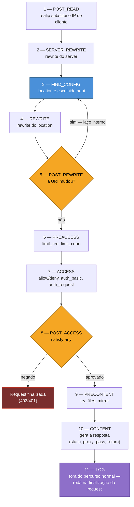

# 05 — O ciclo de vida de uma request

> [!abstract] TL;DR
> O Nginx processa toda request HTTP passando por uma sequência fixa de **11 fases**, de `POST_READ` a `LOG`, e a ordem dessas fases — não a ordem em que as diretivas aparecem no arquivo — decide quando cada diretiva de fato roda. `rewrite` no `server` roda antes de qualquer `location` existir; `location` só é escolhido na fase `FIND_CONFIG`; `limit_req` roda antes de `auth_basic`; `try_files` só roda depois que o controle de acesso inteiro já aprovou a request. Uma diretiva que "não faz efeito" quase sempre está correta na sintaxe e errada no tempo: ela roda numa fase que já passou, ou que ainda não chegou, no momento em que alguém espera vê-la agir. Entender essas 11 fases é o que fecha o modelo mental que as notas 02, 03 e 04 deste galho construíram peça por peça — onde a configuração mora, qual `server` é escolhido, qual `location` é escolhido — respondendo à pergunta que faltava: **quando**, exatamente, cada coisa acontece.

Um caso comum: alguém protege um `location` com `auth_basic` e, na mesma configuração, tenta usar `try_files` para servir um arquivo estático de fallback antes mesmo de pedir usuário e senha — a intenção sendo "primeiro sirvo o `favicon.ico` público, só autentico o resto". A configuração parece correta lida de cima para baixo: `try_files` aparece antes de `auth_basic` no bloco, então "deveria" rodar antes. Só que o navegador continua pedindo a senha para todo mundo, inclusive para o `favicon.ico`. Nada na sintaxe está errado — as duas diretivas existem, os dois caminhos estão certos, os testes manuais de cada uma isolada funcionam. O problema é que a posição no arquivo não determina a ordem de execução. `auth_basic` roda na fase de controle de acesso; `try_files` roda numa fase posterior, dedicada a conteúdo, que só é alcançada depois que o controle de acesso inteiro já aprovou a request. Reescrever o bloco, mover linhas, trocar a ordem visual de `try_files` e `auth_basic` no arquivo: nada disso muda o resultado, porque a ordem visual nunca foi a ordem real. A ordem real é a de um mapa fixo de fases, e esta nota é esse mapa.

Essa mesma armadilha — tratar a configuração como um script lido de cima para baixo — já apareceu, num ângulo diferente, na nota [[03-Dominios/Tecnologia/Infraestrutura/Nginx/03 - Como o Nginx escolhe o server block|03 — Como o Nginx escolhe o server block]], ao mostrar que `server` blocks não são avaliados em ordem sequencial de arquivo, e de novo na nota [[03-Dominios/Tecnologia/Infraestrutura/Nginx/04 - location e a tabela de precedência|04 — location e a tabela de precedência]], ao mostrar que `location` também não é. As duas notas resolveram um "qual": qual `server`, qual `location`. Esta nota resolve o "quando" que sustenta as duas — e é o "quando" que permite prever, sem testar, se uma diretiva nova vai de fato produzir o efeito esperado, ou se vai silenciosamente rodar tarde demais, cedo demais, ou nunca, porque a request já foi finalizada numa fase anterior.

## As 11 fases, em ordem

A [documentação de desenvolvimento do Nginx](https://nginx.org/en/docs/dev/development_guide.html) descreve a request HTTP como uma sequência de fases (*phases*): em cada fase roda um tipo distinto de processamento, e módulos registram *handlers* nas fases que lhes dizem respeito. As fases são processadas sucessivamente — uma request nunca pula uma fase, e nunca volta para uma fase anterior, exceto pelo laço explícito que a seção seguinte descreve. Esta é a lista completa, na ordem em que o Nginx as percorre:

| # | Fase | O que roda ali |
|---|---|---|
| 1 | `POST_READ` | primeira fase de todas; é onde `ngx_http_realip_module` substitui o endereço do cliente, antes de qualquer outro módulo ser sequer invocado |
| 2 | `SERVER_REWRITE` | `rewrite` declarado no nível de `server` (fora de qualquer `location`) |
| 3 | `FIND_CONFIG` | fase especial: **o `location` é escolhido aqui**, com base na URI da request — o algoritmo em si é o assunto da nota 04; nenhum handler adicional pode se registrar nesta fase |
| 4 | `REWRITE` | `rewrite` declarado dentro do `location` escolhido na fase anterior |
| 5 | `POST_REWRITE` | fase especial: se a URI mudou durante o `REWRITE`, a request é redirecionada de volta para a fase `FIND_CONFIG`, para escolher um novo `location` com base na URI nova |
| 6 | `PREACCESS` | fase comum a handlers não relacionados a controle de acesso; `limit_conn` e `limit_req` registram seus handlers aqui |
| 7 | `ACCESS` | verifica se o cliente está autorizado a fazer a request; `allow`/`deny` e `auth_basic` registram seus handlers aqui — por padrão, o cliente precisa passar em **todos** os handlers desta fase para seguir adiante |
| 8 | `POST_ACCESS` | fase especial: processa a diretiva `satisfy any` — se algum handler da fase `ACCESS` negou acesso e nenhum liberou explicitamente, a request é finalizada aqui; nenhum handler adicional pode se registrar nesta fase |
| 9 | `PRECONTENT` | handlers chamados antes de gerar conteúdo; `try_files` e `mirror` registram seus handlers aqui |
| 10 | `CONTENT` | fase onde a resposta é normalmente gerada — vários módulos (index, static, proxy) registram handlers aqui, chamados em sequência até um deles produzir a saída; um `location` também pode ter um handler de conteúdo próprio, que substitui os registrados nesta fase |
| 11 | `LOG` | escrita do log de acesso; só `ngx_http_log_module` se registra aqui, e roda **na finalização da request**, não como parte do percurso normal de fases |

> [!info] Baseline de versão
> Esta tabela reflete o *development guide* oficial do Nginx, válido para as versões correntes em 2026 — mainline 1.31.3 (15 jul 2026) e stable 1.30.4. Vale uma precisão histórica: até a versão 1.13.4 (ago 2017), a fase 9 se chamava `TRY_FILES_PHASE` — só o `try_files` rodava ali. A 1.13.4 introduziu o `ngx_http_mirror_module`, que também precisava rodar antes da geração de conteúdo mas depois do controle de acesso, e a fase foi generalizada e renomeada para `PRECONTENT_PHASE` para acomodar os dois. Qualquer material de referência anterior a essa versão que mencione `TRY_FILES_PHASE` está descrevendo a mesma posição no ciclo, com o nome antigo.

A própria documentação chama duas fases de "especiais" — `FIND_CONFIG` e `POST_REWRITE` — e a razão é a mesma para as duas: elas não existem para que módulos registrem lógica de negócio, existem para o próprio motor de fases tomar uma decisão estrutural (qual `location`, se deve voltar). `POST_ACCESS` é a terceira fase especial, e cumpre um papel parecido: consolidar o veredito da fase `ACCESS` antes de deixar a request seguir.

Repare também no que a função interna `ngx_http_core_run_phases()` de fato executa: ela é chamada quando o cabeçalho da request já foi lido e completamente interpretado, e percorre as fases **de `POST_READ` até `CONTENT`** — a última delas gera a resposta e a repassa para a cadeia de filtros, sem que isso signifique, necessariamente, que a resposta já foi enviada ao cliente naquele instante; ela pode continuar em buffer e ser enviada só na finalização. A fase `LOG` fica de fora desse percurso: ela roda depois, como parte da finalização da request, bem no fim, pouco antes de a memória da request ser liberada — é por isso que um log de acesso consegue registrar até o tempo total gasto e o código de status final, informações que só existem depois que todo o resto já aconteceu.

## Por que um motor de fases, e não uma lista ordenada de diretivas

Vale nomear a decisão de arquitetura por trás dessas 11 fases, porque ela explica por que o Nginx nunca vai se comportar como um pipeline sequencial de middlewares, do tipo que frameworks web costumam expor, onde cada peça roda na ordem exata em que foi registrada. A documentação de desenvolvimento descreve o mecanismo assim: cada módulo pode registrar um *handler* numa fase específica, e a fase, não o módulo, é a unidade de ordenação. `limit_req` e `auth_basic` não "sabem" um do outro, não têm nenhuma dependência declarada entre si, e nenhum dos dois precisa saber que o outro existe — cada um só declara "eu quero rodar na fase `PREACCESS`" ou "eu quero rodar na fase `ACCESS`", e é a posição fixa dessas duas fases na sequência, decidida pelo núcleo do Nginx, que produz a ordem final observável.

Essa escolha tem uma consequência direta sobre extensibilidade: um módulo de terceiros pode se inserir em qualquer uma das fases comuns (`POST_READ`, `SERVER_REWRITE`, `REWRITE`, `PREACCESS`, `ACCESS`, `PRECONTENT`, `CONTENT`) sem precisar coordenar com nenhum módulo já existente, porque a fase é o contrato de posição, não a ordem de carregamento ou a posição no arquivo de configuração. As três fases marcadas como especiais nesta nota — `FIND_CONFIG`, `POST_REWRITE`, `POST_ACCESS` — são justamente as que **não** aceitam esse tipo de extensão: são lógica fixa do núcleo, porque decidir qual `location` processa a request ou consolidar o veredito de várias verificações de acesso não é um comportamento que faça sentido "somar" de múltiplos módulos independentes — precisa de uma única fonte de verdade.

O efeito prático, para quem configura (em vez de programa) o Nginx, é que a pergunta "em que ordem essas duas diretivas rodam?" tem sempre a mesma resposta, previsível a partir só do nome das duas fases envolvidas — nunca depende de em que ordem os módulos foram compilados, carregados, ou declarados no arquivo. É essa previsibilidade, mais do que qualquer otimização de performance, que a arquitetura de fases entrega: ler a tabela de 11 fases uma vez é suficiente para prever o comportamento de qualquer combinação nova de diretivas, sem precisar testar cada par.

## O diagrama das 11 fases

O diagrama a seguir junta a sequência inteira, marcando o laço que a fase `POST_REWRITE` pode disparar de volta para `FIND_CONFIG`, e destacando em qual fase o `location` é de fato decidido.



O laço entre as fases 3, 4 e 5 é o único ponto do percurso inteiro em que a request pode "voltar": se um `rewrite` dentro do `location` muda a URI, a fase `POST_REWRITE` reencaminha a request para `FIND_CONFIG`, que escolhe um `location` novo com base na URI nova — possivelmente um `location` completamente diferente do primeiro, com seu próprio bloco de `rewrite`, que por sua vez pode mudar a URI de novo. Esse laço tem um limite explícito, e vale saber o número de cor porque ele aparece na mensagem de erro: a documentação do `ngx_http_core_module` crava **10 redirecionamentos internos por request**, justamente para impedir que uma configuração incorreta trave o worker num laço infinito. Ao estourar esse teto, o Nginx devolve **500 (Internal Server Error)** ao cliente e escreve no log de erro a mensagem `rewrite or internal redirection cycle` — que é, na prática, o nome próprio desse bug. Diante de um 500 sem nenhuma exceção correspondente do lado da aplicação, essa linha no `error_log` é o que distingue "o backend quebrou" de "a configuração do Nginx está se mordendo pelo rabo". Configurações de `rewrite` mal desenhadas — regra A reescreve para uma URI que bate no `location` de origem da regra B, que reescreve de volta para uma URI que bate no `location` de origem da regra A — são a causa mais comum desse erro, e o diagrama acima é exatamente o mapa para encontrar onde, no ciclo, esse tipo de loop nasce.

## Redirecionamento interno e subrequests: outras portas de volta no ciclo

O laço `FIND_CONFIG` → `REWRITE` → `POST_REWRITE` → `FIND_CONFIG` não é a única forma de a request mudar de `location` no meio do caminho — é só a mais visível, porque nasce de uma diretiva de configuração (`rewrite ... last;`). O *development guide* descreve um mecanismo mais geral, do qual esse laço é um caso particular: **redirecionamento interno**. A request está sempre associada a um `location` através de um campo interno da estrutura que a representa, e esse vínculo pode mudar várias vezes ao longo da vida da request — a primeira mudança acontece ao trocar de `server` (pelo `Host` ou pelo SNI), a segunda acontece na fase `FIND_CONFIG`, e daí em diante qualquer módulo pode disparar uma nova mudança chamando uma de duas funções internas, cada uma reentrando o percurso de fases num ponto diferente:

- **Redirecionamento para uma nova URI** reenvia a request para a fase `SERVER_REWRITE` (fase 2) — não para `FIND_CONFIG` diretamente. A request passa a usar o `location` padrão do `server`, e só chega a um `location` específico de novo quando `FIND_CONFIG` rodar mais uma vez, com a URI nova. Esse é o mecanismo por trás de `error_page` redirecionando para um path interno, e de módulos que reescrevem a URI e querem recomeçar o percurso do zero, como se fosse uma request nova para aquela URI.
- **Redirecionamento para um *named location*** (um `location @nome { }`, que não é alcançável por nenhuma URI pública) pula direto para a fase `REWRITE` (fase 4) do `location` nomeado, sem passar por `FIND_CONFIG` — porque o destino já é conhecido pelo nome, não precisa ser descoberto por comparação de URI. É esse mecanismo que sustenta o padrão de fallback com `try_files ... @fallback;` e o encaminhamento de erro com `error_page 404 = @tratamento;`.

Ambos os caminhos apagam qualquer contexto que módulos tenham guardado na request antes do redirecionamento — a documentação é explícita sobre isso — precisamente para evitar que dados associados ao `location` antigo vazem, inconsistentes, para o `location` novo.

Existe ainda um terceiro mecanismo, mais discreto e que vale nomear porque aparece direto em qualquer configuração com `auth_request`: **subrequests**. Uma subrequest é uma request interna, gerada por um módulo, que compartilha os dados de entrada do cliente com a request original mas percorre o ciclo de fases por conta própria, com seu próprio `location`. Toda subrequest começa na fase `SERVER_REWRITE` — a mesma fase de entrada de um redirecionamento por URI — e passa pelas fases seguintes normalmente. O `ngx_http_auth_request_module`, que implementa a diretiva `auth_request`, é um exemplo direto: ele cria sua subrequest **na fase `ACCESS`** da request original — o mesmo ponto do ciclo onde `allow`/`deny` e `auth_basic` também atuam, o que explica por que `auth_request` compõe naturalmente com as duas diretivas, todas decidindo a mesma pergunta ("este cliente pode passar?") na mesma fase, sobre o mesmo veredito consolidado depois em `POST_ACCESS`:

```nginx
location /privado/ {
    auth_request /auth-check;
    proxy_pass http://app_upstream;
}

location = /auth-check {
    internal;
    proxy_pass http://auth_service/validate;
    proxy_pass_request_body off;
}
```

A subrequest disparada por `auth_request` roda o ciclo inteiro contra o `location /auth-check`, mas o corpo da resposta dela nunca chega ao cliente — só o código de status é usado para decidir se a fase `ACCESS` da request original aprova ou nega. É a mesma arquitetura de fases, reaproveitada para resolver um problema que `allow`/`deny` e `auth_basic` sozinhos não resolvem: delegar a decisão de autorização para um serviço HTTP externo qualquer.

Vale saber nomear a categoria inteira a que essas requests reencaminhadas pertencem, porque o termo aparece na documentação em vários lugares sem aviso prévio: chamam-se **requests internas** (*internal requests*), e o Nginx as trata de forma distinta das requests originais vindas de um cliente — só uma request interna pode alcançar um `location` marcado com a diretiva `internal`, por exemplo, o que é exatamente o que torna `location = /auth-check { internal; }` inacessível a qualquer cliente externo tentando bater nele direto. A documentação lista, como requests internas: as reencaminhadas por `error_page`, `index`, `internal_redirect`, `random_index` e `try_files`; as reencaminhadas pelo cabeçalho de resposta `X-Accel-Redirect`, quando um backend por trás de `proxy_pass` sinaliza que o Nginx deve servir outro recurso em vez do corpo que ele próprio devolveu; e as subrequests formadas por diretivas como `include virtual` do módulo SSI. Todos esses mecanismos, por caminhos de código diferentes, convergem para o mesmo ponto: reentrar o percurso de fases a partir de `SERVER_REWRITE` ou `REWRITE`, com uma URI diferente da que o cliente originalmente pediu.

### Onde o handshake TLS entra nesse mapa

Vale fechar um ponto que a nota anterior deste galho já tratou por outro ângulo, mas que merece uma frase explícita aqui: **nenhuma das 11 fases desta nota cobre o handshake TLS**. A escolha de certificado via SNI, descrita em detalhe na nota [[03-Dominios/Tecnologia/Infraestrutura/Nginx/03 - Como o Nginx escolhe o server block|03 — Como o Nginx escolhe o server block]], acontece inteiramente antes da fase `POST_READ` — antes mesmo de existir uma request HTTP para o motor de fases processar. O handshake decide o `server` block (via certificado) numa camada de conexão; o motor de fases desta nota só começa a rodar depois que a primeira request daquela conexão já foi lida e o cabeçalho já foi parseado por completo. É por isso que um problema de certificado errado (sintoma da nota 03) e um problema de diretiva na fase errada (sintoma desta nota) nunca têm a mesma causa raiz, ainda que os dois produzam sintomas que parecem "a configuração não fez o que eu esperava": um está numa camada abaixo da primeira fase, o outro está dentro do próprio percurso de fases.

| Camada | O que decide | Onde fica documentado |
|---|---|---|
| Conexão TCP + TLS | qual `server` block (via `listen` e SNI) | nota 03 |
| Fases 1-3 (`POST_READ` a `FIND_CONFIG`) | qual `location`, antes de qualquer lógica de `location` rodar | nota 04 + esta nota |
| Fases 4-9 (`REWRITE` a `PRECONTENT`) | reescrita, taxa, autorização, fallback — dentro do `location` já escolhido | esta nota |
| Fases 10-11 (`CONTENT`, `LOG`) | a resposta em si, e o registro dela | notas 06, 07, 12 |

## Grupo 1 — antes de existir `location` (fases 1 a 3)

As três primeiras fases acontecem antes de o Nginx saber qual `location` vai atender a request — e essa ordem, por si só, já explica uma classe inteira de comportamento que parece contraintuitivo.

`POST_READ` roda primeiro, e a única peça padrão que se registra ali é o `ngx_http_realip_module`, quando ativado:

```nginx
set_real_ip_from 10.0.0.0/8;
real_ip_header X-Forwarded-For;
```

Como `realip` roda antes de qualquer outra coisa, todo o restante do processamento — logging, controle de acesso por IP, variáveis como `$remote_addr` — já enxerga o endereço substituído, nunca o endereço original de conexão TCP quando a substituição se aplica. É por isso que um `allow`/`deny` baseado em IP, ou um log de acesso, refletem o cliente real por trás de um balanceador de carga só quando `realip` está configurado e roda antes deles — o que, dado que `POST_READ` é literalmente a primeira fase, é sempre o caso.

`SERVER_REWRITE` roda em seguida, processando qualquer `rewrite` declarado direto no nível de `server`, fora de qualquer `location`:

```nginx
server {
    listen 80;
    server_name app.exemplo.com;

    rewrite ^/old-path/(.*)$ /new-path/$1 permanent;

    location /new-path/ {
        proxy_pass http://app_upstream;
    }
}
```

O ponto que costuma escapar de quem lê essa configuração de cima para baixo: no momento em que esse `rewrite` roda, **nenhum `location` foi escolhido ainda** — `FIND_CONFIG` é a fase seguinte, não a anterior. Um `rewrite` de `server` não está "dentro" de nenhum `location` porque, no instante em que ele executa, o conceito de `location` ainda não se aplica àquela request. É exatamente por isso que um `rewrite` de `server`, mudando a URI de `/old-path/x` para `/new-path/x`, consegue mudar qual `location` vai atender a request: a URI nova, produzida na fase 2, é a URI que a fase 3 usa para escolher o `location`. Se o `rewrite` estivesse depois da escolha do `location` — o que só o `rewrite` de `location`, na fase 4, permite —, ele não teria esse poder: mudaria a URI, mas o `location` já teria sido fixado antes.

`FIND_CONFIG` é a fase que decide, com base na URI corrente da request, qual `location` vai processá-la — o algoritmo exato (os cinco modificadores, a ordem de prefixo versus regex) é o assunto inteiro da nota [[03-Dominios/Tecnologia/Infraestrutura/Nginx/04 - location e a tabela de precedência|04 — location e a tabela de precedência]], e não é reexplicado aqui. O que importa fixar nesta nota é só a posição dessa escolha no tempo: ela acontece depois do `rewrite` de `server`, e antes de qualquer diretiva declarada dentro de um `location` rodar — inclusive o próprio `rewrite` de `location`, que é a fase seguinte.

Vale nomear um detalhe que só faz sentido depois que as fases 1 e 2 já foram descritas: a request não chega à fase `FIND_CONFIG` sem `location` nenhum associado — ela chega com o **`location` padrão do `server`** já atribuído, um espaço de configuração genérico que existe desde antes de qualquer fase rodar, e que é reatribuído de novo se a request trocar de `server` (pelo `Host` ou pelo SNI, mecanismo da nota 03). É contra esse `location` padrão que qualquer módulo consultado durante `POST_READ` ou `SERVER_REWRITE` resolve sua configuração, antes de existir um `location` específico para consultar. `FIND_CONFIG` não cria o conceito de `location` do nada — ele troca o `location` padrão por um mais específico, escolhido pela URI, e é só a partir dessa troca que diretivas declaradas dentro de blocos `location {}` passam a ter efeito.

## Grupo 2 — dentro do `location`, antes de gerar conteúdo (fases 4 a 9)

Uma vez que o `location` foi escolhido, seis fases rodam antes de a resposta em si começar a ser gerada — e a ordem entre elas resolve, sem ambiguidade, várias perguntas comuns de "qual diretiva vence".

`REWRITE` processa qualquer `rewrite` declarado dentro do `location` escolhido:

```nginx
location /api/ {
    rewrite ^/api/v1/(.*)$ /api/$1 last;
    proxy_pass http://api_upstream;
}
```

`POST_REWRITE`, a fase seguinte, verifica se a URI mudou durante o `REWRITE` — e se mudou, reencaminha a request de volta para `FIND_CONFIG`, fechando o laço já descrito. O `last` no exemplo acima é justamente o que provoca essa nova busca; a diretiva `break`, em contraste, também para o processamento de `rewrite` daquele bloco mas **sem** disparar a nova busca de `location` — a request segue adiante, para `PREACCESS`, com a URI já modificada, mas presa ao `location` original. Essa diferença entre `last` e `break` é, de novo, uma diferença de em qual fase a request continua depois — assunto que a nota [[03-Dominios/Tecnologia/Infraestrutura/Nginx/12 - Variáveis, map, rewrite e logging|12 — Variáveis, map, rewrite e logging]] desenvolve com o detalhe que a diretiva `rewrite` merece por inteiro.

`PREACCESS` é onde `limit_req` e `limit_conn` atuam — as duas diretivas registram handlers na mesma fase, o que significa que, quando ambas aparecem no mesmo `location`, as duas rodam antes de qualquer verificação de identidade, na ordem em que a documentação de cada módulo as processa internamente:

```nginx
limit_req_zone $binary_remote_addr zone=por_ip:10m rate=10r/s;
limit_conn_zone $binary_remote_addr zone=conexoes_por_ip:10m;

location /api/ {
    limit_req zone=por_ip burst=20 nodelay;
    limit_conn conexoes_por_ip 5;
    ...
}
```

Combinar as duas é comum em bordas expostas: `limit_req` limita a **taxa** de requests por segundo, `limit_conn` limita o **número de conexões simultâneas** — e como as duas vivem na mesma fase, um cliente que já estourou o limite de conexões simultâneas nunca chega a consumir orçamento de CPU verificando taxa de request, nem chega perto da fase `ACCESS` mais cara, logo em seguida. A mecânica fina de cada uma — o algoritmo de balde furado por trás de `limit_req`, o significado exato de `burst` e `nodelay` — é o assunto da nota [[03-Dominios/Tecnologia/Infraestrutura/Nginx/11 - Limitar e comprimir|11 — Limitar e comprimir]]; o que importa fixar aqui é só a posição no tempo, compartilhada pelas duas diretivas.

`ACCESS` é onde o controle de identidade e permissão roda — `allow`/`deny`, `auth_basic`, `auth_request`:

```nginx
location /admin/ {
    allow 10.0.0.0/8;
    deny all;

    auth_basic "Área restrita";
    auth_basic_user_file /etc/nginx/.htpasswd;
}
```

A ordem entre `PREACCESS` (fase 6) e `ACCESS` (fase 7) não é acidente de numeração — ela resolve, de forma mecânica, uma pergunta de design que aparece toda vez que alguém combina rate limiting com autenticação: **o limite de taxa se aplica a quem ainda não provou identidade nenhuma**. Um cliente disparando tentativas de login não gasta o orçamento de `auth_basic` — que é caro, envolve verificar hash de senha — antes de o `limit_req` já ter cortado o excesso; o rate limit atua sobre qualquer requisição que chegue até ali, autenticada ou não, porque ele roda numa fase anterior à que sabe distinguir cliente legítimo de cliente abusivo. Inverter essa ordem — verificar identidade antes de limitar taxa — abriria a porta para um ataque de força bruta gastar processamento de autenticação sem limite algum antes de qualquer coisa barrar o volume.

`POST_ACCESS` processa a diretiva `satisfy`, cujo valor padrão (`all`) exige que a request passe por **todos** os handlers registrados na fase `ACCESS`; `satisfy any` relaxa essa exigência, aceitando a request se **qualquer um** dos handlers a aprovar:

```nginx
location /interno/ {
    satisfy any;

    allow 192.168.1.0/24;
    deny all;

    auth_basic "Acesso alternativo";
    auth_basic_user_file /etc/nginx/.htpasswd;
}
```

Nesse exemplo, um cliente dentro da rede `192.168.1.0/24` passa sem precisar de senha — o `allow` já aprova sozinho — enquanto um cliente de fora da rede ainda pode entrar fornecendo usuário e senha corretos, porque `satisfy any` aceita qualquer aprovação isolada em vez de exigir as duas ao mesmo tempo.

Vale ver as três diretivas de `ACCESS` combinadas — `allow`/`deny`, `auth_basic` e `auth_request` — porque a combinação é comum em bordas que precisam de defesa em profundidade, e as três compõem sem conflito justamente por rodarem na mesma fase, sob o mesmo veredito consolidado em `POST_ACCESS`:

```nginx
location /admin/ {
    allow 10.0.0.0/8;
    deny all;

    auth_basic "Painel interno";
    auth_basic_user_file /etc/nginx/.htpasswd;

    auth_request /2fa-check;
}
```

Com `satisfy all` implícito (o padrão, quando `satisfy` não é declarado), a request só avança para `PRECONTENT` se **todos os três** handlers aprovarem: o IP precisa estar na faixa confiável, a senha precisa bater, e a subrequest de segundo fator precisa retornar sucesso. Reprovação em qualquer um dos três finaliza a request em `POST_ACCESS`, sem que os handlers restantes cheguem sequer a ser avaliados na ordem declarada no arquivo — a fase `ACCESS` roda todos os handlers registrados nela e só depois `POST_ACCESS` consolida o resultado, o que é diferente de um `if/else` de curto-circuito lido de cima para baixo.

`PRECONTENT` é onde `try_files` atua, sempre depois de todo o bloco de controle de acesso já ter aprovado a request:

```nginx
location / {
    try_files $uri $uri/ /index.html;
}
```

É essa posição — depois de `ACCESS` e `POST_ACCESS`, nunca antes — que resolve o caso de abertura desta nota: um `try_files` tentando servir um arquivo estático antes de `auth_basic` verificar credenciais nunca vai conseguir isso, estruturalmente, não importa a ordem visual das linhas no bloco, porque `PRECONTENT` só é alcançado depois que `ACCESS` já aprovou a request. `try_files` a fundo — a mecânica de fallback, o parâmetro final tratado como URI interna versus como named location — é o assunto da nota [[03-Dominios/Tecnologia/Infraestrutura/Nginx/06 - Servir arquivos estáticos|06 — Servir arquivos estáticos]].

## Grupo 3 — geração da resposta e finalização (fases 10 e 11)

`CONTENT` é onde a resposta de fato nasce. Várias diretivas padrão competem por essa fase — servir um arquivo estático, fazer proxy para um backend, devolver um valor fixo com `return` — e o Nginx as chama em sequência até uma delas produzir a saída, ou usa diretamente o handler de conteúdo do `location`, quando ele tem um configurado, ignorando os handlers genéricos da fase:

```nginx
location /health {
    return 200 "ok\n";
}

location /app/ {
    proxy_pass http://app_upstream;
}

location / {
    root /var/www/site;
    index index.html index.htm;
}
```

O terceiro bloco ilustra bem o que "chamados em sequência até um deles produzir a saída" significa na prática: `index` e o módulo de arquivo estático são handlers distintos, registrados na mesma fase `CONTENT`. Numa request para `/`, o handler de `index` roda primeiro, tentando localizar `index.html` e, se não achar, `index.htm`, dentro do diretório resolvido por `root`; só se nenhum dos dois existir é que o handler seguinte da fase assume, tipicamente devolvendo um `403` (diretório sem index) ou delegando a um `autoindex`, se configurado. Nenhuma dessas diretivas tem uma fase própria e exclusiva — todas competem, na ordem em que o Nginx as consulta internamente, dentro da mesma fase `CONTENT`, o que é diferente do papel de `proxy_pass`, que normalmente é o único produtor de conteúdo dentro do `location` que o declara, sem concorrência com `index` ou arquivo estático no mesmo bloco.

Todo o mecanismo de escolher upstream, repassar cabeçalhos e lidar com timeout de `proxy_pass` é o assunto próprio da nota [[03-Dominios/Tecnologia/Infraestrutura/Nginx/07 - Proxy reverso|07 — Proxy reverso]] — aqui basta reter que `proxy_pass`, como qualquer outro produtor de conteúdo, roda na fase `CONTENT`, depois de toda a triagem das oito fases anteriores. O caminho completo de `root`, `alias`, `index` e o modo zero-copy de `sendfile` é o assunto da nota [[03-Dominios/Tecnologia/Infraestrutura/Nginx/06 - Servir arquivos estáticos|06 — Servir arquivos estáticos]], que também aprofunda como `try_files`, já na fase anterior, decide qual URI de fato chega até esse trio de handlers de `CONTENT`.

`LOG` fecha o ciclo, mas fora do percurso normal de fases: como a tabela já registrou, ela não faz parte do trecho que `ngx_http_core_run_phases()` percorre — ela roda na finalização da request, o que é o motivo pelo qual um log de acesso consegue registrar o tempo total de resposta e o código de status definitivo, informações que só existem depois que a fase `CONTENT` (e qualquer processamento de erro decorrente dela) já terminou por completo. A mecânica de `access_log`, os campos disponíveis e o formato `json` ficam para a nota [[03-Dominios/Tecnologia/Infraestrutura/Nginx/12 - Variáveis, map, rewrite e logging|12 — Variáveis, map, rewrite e logging]].

## Exemplo trabalhado: uma request, fase por fase

Vale seguir uma única request concreta do socket ao log, ao lado da configuração exata que a processa, para tornar as 11 fases tangíveis em vez de abstratas.

```nginx
http {
    limit_req_zone $binary_remote_addr zone=api_limit:10m rate=5r/s;

    server {
        listen 443 ssl;
        http2 on;
        server_name app.exemplo.com;

        set_real_ip_from 10.0.0.0/8;
        real_ip_header X-Forwarded-For;

        rewrite ^/painel$ /painel/ permanent;

        location /painel/ {
            limit_req zone=api_limit burst=10 nodelay;

            allow 10.0.0.0/8;
            deny all;

            auth_basic "Painel interno";
            auth_basic_user_file /etc/nginx/.htpasswd;

            try_files $uri $uri/ /painel/index.html;
        }
    }
}
```

Uma request `GET /painel HTTP/1.1`, com `Host: app.exemplo.com`, chegando de um proxy interno em `10.0.0.5` que anexa `X-Forwarded-For: 203.0.113.7`, percorre assim:

**Fase 1 — `POST_READ`.** `realip` vê que a conexão chegou de `10.0.0.5`, dentro do bloco confiável declarado em `set_real_ip_from`, e substitui `$remote_addr` pelo valor de `X-Forwarded-For`: `203.0.113.7`. Todo o restante do processamento — inclusive o log final — vai enxergar esse endereço, não o do proxy interno.

**Fase 2 — `SERVER_REWRITE`.** O `rewrite ^/painel$ /painel/ permanent;` do `server` bate: a URI `/painel` vira `/painel/`. Como o modificador é `permanent`, essa fase também já monta uma resposta `301` de redirecionamento — o cliente vai precisar refazer a request para `/painel/` antes de qualquer conteúdo ser servido. Para seguir o restante do ciclo até o `CONTENT`, considere que a segunda request, já para `/painel/`, é a que continua daqui em diante.

**Fase 3 — `FIND_CONFIG`.** Com a URI `/painel/` em mãos, o Nginx escolhe o `location /painel/` como o bloco que vai processar essa request — o único candidato nesta configuração.

**Fase 4 — `REWRITE`.** O `location /painel/` não declara nenhum `rewrite` próprio; a fase roda, mas não há handler para agir.

**Fase 5 — `POST_REWRITE`.** A URI não mudou desde a fase 3, então não há nova busca de `location` — a request segue para a fase seguinte com o mesmo `location` já escolhido.

**Fase 6 — `PREACCESS`.** `limit_req zone=api_limit burst=10 nodelay;` consulta a zona de memória compartilhada `api_limit`, indexada por `$binary_remote_addr` — agora já o IP substituído pelo `realip` na fase 1, `203.0.113.7`. Se aquele IP não excedeu a taxa de 5 requests por segundo (com folga de `burst=10` consumida sem atraso por causa de `nodelay`), a request segue; se excedesse, seria rejeitada aqui, antes de qualquer verificação de senha rodar.

**Fase 7 — `ACCESS`.** Primeiro `allow`/`deny`: o IP `203.0.113.7` não está em `10.0.0.0/8`, então o `allow` não aprova — mas a request não é rejeitada ainda, porque o padrão (`satisfy all`, implícito) exige que todos os handlers desta fase concordem, e o `auth_basic` ainda não rodou. O `auth_basic` verifica as credenciais enviadas no cabeçalho `Authorization`; se o usuário e senha batem com uma entrada de `/etc/nginx/.htpasswd`, esse handler aprova. Como o padrão é exigir aprovação de todos os handlers, e o `allow`/`deny` já reprovou por IP, a combinação depende de como o cluster de regras foi desenhado — nesta configuração específica, sem `satisfy any`, a reprovação do `deny all` já é suficiente para barrar a request na fase `ACCESS`, independente de a senha estar correta.

**Fase 8 — `POST_ACCESS`.** Como não há `satisfy any` declarado, esta fase só confirma o veredito da fase anterior: a request já foi reprovada, e é finalizada aqui com `401` (se a falha foi de `auth_basic`) ou `403` (se foi de `deny`) — nenhuma fase posterior chega a rodar.

Para seguir o exemplo até o fim, considere agora que a request vem de dentro da rede confiável, `10.0.0.12`, com a senha correta. **Fase 7 — `ACCESS`, revisitada.** O `allow 10.0.0.0/8;` aprova por IP; o `auth_basic` também aprova pela senha correta. Os dois handlers concordam, e a request segue.

**Fase 8 — `POST_ACCESS`.** Aprovação consolidada; a request segue para conteúdo.

**Fase 9 — `PRECONTENT`.** `try_files $uri $uri/ /painel/index.html;` testa, em ordem, se `$uri` (o caminho `/painel/` como arquivo literal) existe no sistema de arquivos, depois se `$uri/` (como diretório) existe; se nenhum dos dois existir, cai no último parâmetro, `/painel/index.html`, tratado como uma nova URI interna.

**Fase 10 — `CONTENT`.** Supondo que nem o arquivo nem o diretório existam, a URI interna `/painel/index.html` é servida pelo módulo de arquivo estático, que lê o arquivo do disco e monta o corpo da resposta com status `200`.

**Fase 11 — `LOG`, na finalização.** Só agora, com a request inteira resolvida — status final, tamanho da resposta, tempo total decorrido — o `ngx_http_log_module` escreve a linha de acesso, usando `$remote_addr` já substituído pelo `realip` desde a fase 1, e não o IP de conexão TCP original.

Doze linhas de configuração, onze fases percorridas (mais o segundo ciclo pela primeira metade, provocado pelo redirecionamento), e nenhuma delas fora de ordem: cada diretiva rodou exatamente na fase que a documentação atribui a ela, independente de onde estava escrita dentro do bloco.

### Uma variação: o que muda com `error_page`

Vale seguir uma quarta variante da mesma request, agora acrescentando uma diretiva de tratamento de erro à configuração, porque `error_page` é outro ponto do ciclo em que a request muda de rumo de um jeito que só faz sentido à luz das fases:

```nginx
location /painel/ {
    limit_req zone=api_limit burst=10 nodelay;

    allow 10.0.0.0/8;
    deny all;

    auth_basic "Painel interno";
    auth_basic_user_file /etc/nginx/.htpasswd;

    try_files $uri $uri/ /painel/index.html;

    error_page 404 = /painel/erro-customizado.html;
}
```

Suponha que a fase `PRECONTENT` (9) já rodou, `try_files` não encontrou nenhum dos candidatos, e a fase `CONTENT` (10), tentando servir `/painel/index.html`, também não encontra o arquivo — um erro genuíno de configuração, não coberto por `try_files`. O módulo de conteúdo sinaliza `404`, e é aí que `error_page` intercepta: como a diretiva usa `=` para trocar a URI (em vez de só trocar o código de status, que aconteceria sem o `=`), o Nginx dispara um **redirecionamento interno** — o mesmo mecanismo descrito na seção sobre subrequests — e a request reentra o ciclo pela fase `SERVER_REWRITE` (2), não pela fase onde estava. A partir dali, ela percorre `FIND_CONFIG` de novo com a URI nova (`/painel/erro-customizado.html`), possivelmente caindo num `location` totalmente diferente do original, com seu próprio conjunto de `allow`/`deny`, `auth_basic` e `try_files` — ou sem nenhum, se o `location` de erro for deliberadamente mais permissivo. É por isso que uma página de erro customizada, servida via `error_page ... = ...;`, pode escapar de restrições de acesso que o `location` original impunha: ela não é "mais uma resposta" dentro do mesmo ciclo, é uma request nova, com seu próprio percurso de fases, começando de `SERVER_REWRITE` outra vez.

## Como usar isto para depurar

Diante de "esta diretiva não está fazendo efeito", a pergunta produtiva não é "a sintaxe está certa?" — na maioria dos casos está — mas **em que fase esta diretiva roda, e o que já rodou (ou ainda vai rodar) antes dela que possa estar contradizendo o que eu espero?**

Um roteiro prático, apoiado na tabela do início desta nota:

1. **Identifique a fase da diretiva suspeita.** Um `rewrite` está em `SERVER_REWRITE` ou `REWRITE`, dependendo de estar fora ou dentro de um `location`; `try_files` está em `PRECONTENT`; `auth_basic`, `allow`/`deny` e `auth_request` estão em `ACCESS`; `limit_req`/`limit_conn` estão em `PREACCESS`.
2. **Identifique a fase de tudo que parece "vencer" no lugar dela.** Se um `location` diferente do esperado está sendo escolhido, o culpado é sempre algo rodando em `SERVER_REWRITE` (fase 2) — antes de `FIND_CONFIG` — mudando a URI antes de o `location` ser decidido.
3. **Compare as duas posições na tabela.** Se a diretiva suspeita está numa fase posterior à de algo que já decide o destino da request (uma finalização em `ACCESS`, uma resposta já gerada em `CONTENT` de um `location` diferente), ela nunca vai rodar — a request já terminou antes de chegar lá.
4. **Verifique se algum mecanismo de redirecionamento interno está reentrando o ciclo.** `error_page` com `=`, `X-Accel-Redirect`, `internal_redirect` e o parâmetro final de `try_files` tratado como URI todos podem reenviar a request para `SERVER_REWRITE`, trocando o `location` no meio do caminho sem que nenhuma linha do arquivo pareça, à primeira vista, responsável por isso.
5. **Confirme com `nginx -T`**, já apresentado na nota anterior deste galho, para garantir que a diretiva está de fato no bloco que você pensa que está, antes de suspeitar da ordem de fases — um erro de precedência de `location` (nota 04) produz o mesmo sintoma de "diretiva ignorada" que um erro de fase, e os dois exigem diagnóstico diferente.

Um segundo padrão de depuração vale registrar à parte: `add_header`, ao contrário do que a posição no arquivo sugere, não é avaliado numa fase própria de forma independente — ele é coletado durante a fase `CONTENT` (e fases de erro correlatas) e só aplicado se o contexto que o declara for, de fato, o que produz a resposta final; um `add_header` num `location` que a request nunca atinge (porque outro `location` mais específico venceu na fase `FIND_CONFIG`) simplesmente nunca é considerado, o mesmo tipo de armadilha temporal descrito nesta nota, só que cruzando com a escolha de `location` da nota 04 em vez de com uma fase isolada.

Um terceiro recurso, mais custoso mas definitivo quando os dois anteriores não bastam, é o log de depuração (`error_log ... debug;`), que a nota [[03-Dominios/Tecnologia/Infraestrutura/Nginx/13 - Tuning e diagnóstico|13 — Tuning e diagnóstico]] trata a fundo. Vale nomear aqui só o motivo pelo qual ele resolve exatamente a classe de dúvida desta nota: o log de depuração registra, entre outras coisas, cada mudança de `location` associada à request e cada fase relevante sendo atravessada — o que permite, em último caso, ver com os próprios olhos que uma request passou por `SERVER_REWRITE` duas vezes (sinal de redirecionamento interno via `error_page` ou `rewrite`), ou que `FIND_CONFIG` selecionou um `location` diferente do que a leitura do arquivo sugeria:

```nginx
error_log /var/log/nginx/debug.log debug;
```

```bash
curl -H "Host: app.exemplo.com" http://ip-do-servidor/painel
tail -f /var/log/nginx/debug.log | grep -E "http script|rewrite|access"
```

É a ferramenta certa quando a pergunta não é mais "em que fase esta diretiva roda" — que a tabela desta nota já responde de memória — mas "por que, nesta request específica, o percurso não seguiu o caminho que eu esperava". O custo de habilitar `debug` em produção, e como restringi-lo a um IP de origem específico via `debug_connection`, é assunto próprio da nota 13; aqui vale só reter que a saída desse log fala explicitamente a língua desta nota — nomeia fases, nomeia `location`s, nomeia reescritas — em vez de deixar a pessoa inferir por tentativa e erro.

## Armadilhas comuns

> [!warning] Esperar que `try_files` rode antes de `auth_basic` só porque está escrito antes
> **O que acontece:** alguém declara `try_files` acima de `auth_basic` no mesmo `location`, esperando servir certos arquivos sem exigir autenticação, e todo o `location` continua pedindo credencial, mesmo para os arquivos que "deveriam" ser públicos. **Por quê:** `try_files` roda na fase `PRECONTENT` (9), sempre depois de `ACCESS` (7) e `POST_ACCESS` (8) — a ordem visual das linhas dentro do bloco não altera a fase em que cada diretiva de fato executa. **Como evitar:** separar o conteúdo público num `location` próprio, sem `auth_basic`, e deixar `auth_basic` só no `location` que de fato precisa de proteção — a separação por fase precisa virar separação por bloco quando o objetivo é tratamento diferente para caminhos diferentes.

> [!warning] Colocar `rewrite` dentro do `location` esperando que ele afete a escolha de `server` ou de outro `location`
> **O que acontece:** um `rewrite` dentro de um `location` muda a URI, e a expectativa é que isso reabra a escolha de `server` block — o que nunca acontece, porque `server` já foi decidido antes de qualquer fase de `rewrite` rodar. **Por quê:** a escolha de `server` (etapa 1 e 2 da nota 03) acontece na conexão TCP e no handshake TLS, bem antes da fase `SERVER_REWRITE`; nenhuma fase de processamento de request consegue voltar e escolher outro `server` block — o laço de `POST_REWRITE` só reabre `FIND_CONFIG`, a escolha de `location`, nunca a de `server`. **Como evitar:** tratar a escolha de `server` como definitiva e imutável a partir da fase 2 em diante; qualquer lógica que precise variar por domínio pertence a `server_name`, não a um `rewrite` tentando simular a troca de virtual host.

> [!warning] Supor que `limit_req` protege contra abuso de quem já está autenticado
> **O que acontece:** alguém configura `limit_req` esperando que ele limite a taxa por usuário autenticado, e se surpreende ao ver que múltiplas contas por trás do mesmo IP compartilham o mesmo balde, ou que o limite se aplica igualmente antes de qualquer verificação de identidade. **Por quê:** `limit_req` roda em `PREACCESS` (6), antes de `ACCESS` (7) — no momento em que ele age, a request ainda não foi autenticada; a chave do balde (`$binary_remote_addr` ou qualquer outra variável escolhida) é tudo que ele tem disponível, porque identidade de usuário simplesmente não existe ainda nesse ponto do ciclo. **Como evitar:** para rate limiting por usuário autenticado, é preciso uma chave derivada de algo que já existe antes de `PREACCESS` — como um cabeçalho ou cookie que o cliente já envia na request, não algo que só `auth_basic` produziria; a mecânica completa de `limit_req`, `burst` e `nodelay` é o assunto da nota 11.

> [!warning] Achar que `add_header` num `location` "errado" simplesmente não funciona por bug
> **O que acontece:** um `add_header` declarado num `location` nunca aparece na resposta, mesmo com sintaxe correta, e a suspeita recai sobre versão do Nginx ou módulo ausente. **Por quê:** `add_header` só é aplicado quando o contexto que o declara é o que de fato produz a resposta na fase `CONTENT`; se outro `location`, mais específico na tabela de precedência da nota 04, vencer a escolha da fase `FIND_CONFIG`, o `add_header` do bloco perdedor nunca é sequer considerado — o problema não é de fase isolada, é de qual bloco a request nunca alcança. **Como evitar:** confirmar primeiro, com `nginx -T` e um teste de request real, qual `location` de fato atende aquele path, antes de suspeitar de qualquer diretiva dentro dele.

> [!warning] Assumir que uma página de `error_page` herda as restrições do `location` que gerou o erro
> **O que acontece:** um `location` protegido por `auth_basic` dispara um erro (por exemplo, `404` de um `try_files` que não encontrou nada), e a página de erro customizada configurada via `error_page ... = ...;` é servida sem pedir credencial nenhuma, mesmo o erro tendo se originado dentro do bloco protegido. **Por quê:** `error_page` com `=` provoca um redirecionamento interno que reenvia a request para a fase `SERVER_REWRITE` — o início do ciclo — e de lá ela é roteada, via `FIND_CONFIG`, para o `location` que corresponde à nova URI de erro, não para o `location` original; se esse novo `location` não tiver as mesmas diretivas de `ACCESS`, elas simplesmente não se aplicam à página de erro. **Como evitar:** quando a página de erro precisa herdar as mesmas restrições, declará-la dentro do mesmo `location` (ou repetir explicitamente `allow`/`deny`/`auth_basic` no `location` de erro) — herança de contexto entre `location`s vizinhos não acontece automaticamente, nem aqui nem em nenhum outro cenário coberto pela nota [[03-Dominios/Tecnologia/Infraestrutura/Nginx/02 - A estrutura da configuração|02 — A estrutura da configuração]].

## Como explicar em inglês

> "Every HTTP request in nginx goes through a fixed sequence of eleven phases, from post-read to log, and that sequence — not the order directives appear in the file — is what decides when each directive actually runs. Location isn't chosen until the find-config phase, which means a server-level rewrite runs before any location even exists, and can change which location gets picked. Rate limiting runs in the preaccess phase, before access control, so it applies to every client regardless of whether they've authenticated yet. try_files runs in precontent, always after access control has already approved the request — so you can't use it to serve some paths without authentication if auth_basic is sitting in the same location. When a directive 'doesn't work,' the productive question isn't whether the syntax is right — it almost always is — it's which phase that directive runs in, and what already ran, or hasn't run yet, that contradicts what you expected."

| PT | EN |
|---|---|
| fase de processamento | processing phase |
| escolha do location | location selection |
| controle de acesso | access control |
| limite de taxa | rate limiting |
| redirecionamento interno | internal redirect |
| geração de conteúdo | content generation |
| finalização da request | request finalization |
| log de acesso | access log |
| laço de reescrita | rewrite loop |
| diretiva ignorada / sem efeito | directive has no effect |

## Uma frase por fase, para memorizar

Antes da tabela de referência final, vale um resumo em forma de mnemônico — a versão condensada que sobra na memória depois de ler esta nota inteira uma vez:

1. `POST_READ` — troca o IP do cliente, se `realip` estiver ativo.
2. `SERVER_REWRITE` — reescreve a URI antes de qualquer `location` existir.
3. `FIND_CONFIG` — escolhe o `location`, com base na URI corrente.
4. `REWRITE` — reescreve a URI de novo, agora dentro do `location` escolhido.
5. `POST_REWRITE` — se a URI mudou, volta para a fase 3.
6. `PREACCESS` — limita taxa e conexões, antes de saber quem é o cliente.
7. `ACCESS` — decide se o cliente pode passar.
8. `POST_ACCESS` — consolida o veredito de `ACCESS`.
9. `PRECONTENT` — decide o fallback, com o cliente já autorizado.
10. `CONTENT` — gera a resposta de fato.
11. `LOG` — registra tudo, na finalização, fora do percurso normal.

## Tabela de referência rápida

Vale fechar o corpo técnico consolidando, numa única tabela, as 11 fases contra a diretiva mais comum de cada uma e a nota deste galho onde ela é aprofundada — o resumo para consulta rápida quando a dúvida já não é "qual é a ordem" (a tabela do início já resolveu isso), mas "onde eu leio mais sobre a diretiva X":

| Fase | Diretiva típica | Aprofundada em |
|---|---|---|
| `POST_READ` | `real_ip_header`, `set_real_ip_from` | — |
| `SERVER_REWRITE` | `rewrite` (nível `server`) | [[03-Dominios/Tecnologia/Infraestrutura/Nginx/12 - Variáveis, map, rewrite e logging\|nota 12]] |
| `FIND_CONFIG` | escolha de `location` | [[03-Dominios/Tecnologia/Infraestrutura/Nginx/04 - location e a tabela de precedência\|nota 04]] |
| `REWRITE` | `rewrite` (nível `location`) | [[03-Dominios/Tecnologia/Infraestrutura/Nginx/12 - Variáveis, map, rewrite e logging\|nota 12]] |
| `POST_REWRITE` | laço interno, sem diretiva própria | esta nota |
| `PREACCESS` | `limit_req`, `limit_conn` | [[03-Dominios/Tecnologia/Infraestrutura/Nginx/11 - Limitar e comprimir\|nota 11]] |
| `ACCESS` | `allow`/`deny`, `auth_basic`, `auth_request` | esta nota |
| `POST_ACCESS` | `satisfy` | esta nota |
| `PRECONTENT` | `try_files`, `mirror` | [[03-Dominios/Tecnologia/Infraestrutura/Nginx/06 - Servir arquivos estáticos\|nota 06]] |
| `CONTENT` | `proxy_pass`, `root`, `index`, `return` | [[03-Dominios/Tecnologia/Infraestrutura/Nginx/06 - Servir arquivos estáticos\|nota 06]], [[03-Dominios/Tecnologia/Infraestrutura/Nginx/07 - Proxy reverso\|nota 07]] |
| `LOG` | `access_log`, `log_format` | [[03-Dominios/Tecnologia/Infraestrutura/Nginx/12 - Variáveis, map, rewrite e logging\|nota 12]] |

## O que vem a seguir

Com o `server` escolhido (nota 03), o `location` escolhido (nota 04) e agora o mapa completo de quando cada fase roda, a próxima pergunta natural é: dentro da fase `CONTENT`, o que de fato acontece quando o Nginx precisa servir um arquivo do disco? A fase `PRECONTENT`, onde `try_files` decide o fallback, e a fase `CONTENT`, onde o arquivo é de fato lido e devolvido, são o assunto da próxima nota — que fecha, com essa peça, a fase Iniciado deste galho: quem chegou até aqui já sabe onde a configuração mora, qual `server`, qual `location`, e quando cada diretiva roda; falta só ver o caminho de dados que serve o conteúdo em si.

- [[03-Dominios/Tecnologia/Infraestrutura/Nginx/06 - Servir arquivos estáticos|06 — Servir arquivos estáticos]] — `root` × `alias`, `try_files` a fundo, e o caminho zero-copy do `sendfile`.
- [[03-Dominios/Tecnologia/Infraestrutura/Nginx/07 - Proxy reverso|07 — Proxy reverso]] — o que de fato acontece quando o handler de conteúdo, na fase `CONTENT`, é `proxy_pass`.
- [[03-Dominios/Tecnologia/Infraestrutura/Nginx/11 - Limitar e comprimir|11 — Limitar e comprimir]] — `limit_req` e `limit_conn` a fundo, com o balde furado e os parâmetros `burst`/`nodelay` que esta nota só nomeou.
- [[03-Dominios/Tecnologia/Infraestrutura/Nginx/12 - Variáveis, map, rewrite e logging|12 — Variáveis, map, rewrite e logging]] — `rewrite` completo (`last` × `break` × `return`), `map` e o formato de log.

## Fontes

- **Nginx Docs** — [*Development guide — Phases*](https://nginx.org/en/docs/dev/development_guide.html) — a fonte primária desta nota: a lista oficial das 11 fases, a descrição de cada uma, e o comportamento de `ngx_http_core_run_phases()` e da finalização da request.
- **Nginx Docs** — [*How nginx processes a request*](https://nginx.org/en/docs/http/request_processing.html) — o texto de referência sobre a relação entre `listen`, `server_name` e `location`, complementar ao modelo de fases.
- **Nginx Docs** — [*Module ngx_http_core_module*](https://nginx.org/en/docs/http/ngx_http_core_module.html) — a sintaxe de `location`, `try_files` e o contexto onde cada uma se aplica.
- **Nginx Docs** — [*Module ngx_http_rewrite_module*](https://nginx.org/en/docs/http/ngx_http_rewrite_module.html) — a diretiva `rewrite`, os modificadores `last` e `break`, e o contexto de `server` versus `location`.
- **Nginx Docs** — [*Module ngx_http_access_module*](https://nginx.org/en/docs/http/ngx_http_access_module.html) — `allow`/`deny` e sua posição na fase `ACCESS`.
- **Nginx Docs** — [*Module ngx_http_auth_basic_module*](https://nginx.org/en/docs/http/ngx_http_auth_basic_module.html) — `auth_basic`, também na fase `ACCESS`, e a diretiva `satisfy`.
- **Nginx Docs** — [*Module ngx_http_limit_req_module*](https://nginx.org/en/docs/http/ngx_http_limit_req_module.html) — `limit_req`, `burst` e `nodelay`, registrados na fase `PREACCESS`.
- **Nginx Docs** — [*Module ngx_http_realip_module*](https://nginx.org/en/docs/http/ngx_http_realip_module.html) — `realip`, o único módulo padrão registrado na fase `POST_READ`.
- **Nginx Docs** — [*Module ngx_http_log_module*](https://nginx.org/en/docs/http/ngx_http_log_module.html) — a fase `LOG` e o momento de finalização em que ela roda.
- **Nginx Docs** — [*Module ngx_http_auth_request_module*](https://nginx.org/en/docs/http/ngx_http_auth_request_module.html) — `auth_request` e a subrequest que ele cria na fase `ACCESS`, descrita também no *development guide*.
- **Nginx Docs** — [*Module ngx_http_index_module*](https://nginx.org/en/docs/http/ngx_http_index_module.html) — `index`, um dos handlers padrão registrados na fase `CONTENT`, junto do módulo de arquivo estático.
- **Nginx Docs** — [*Core module — `debug_connection`*](https://nginx.org/en/docs/ngx_core_module.html) — como restringir o log de depuração (`error_log ... debug;`) a conexões de origem específicas, referenciado na seção de diagnóstico desta nota.
- **GitHub — apache/incubator-pagespeed-ngx** — [*Issue #1451: 'ngx_http_core_try_files_phase' was not declared in this scope*](https://github.com/apache/incubator-pagespeed-ngx/issues/1451) — registro público da renomeação de `TRY_FILES_PHASE` para `PRECONTENT_PHASE` na versão 1.13.4.
