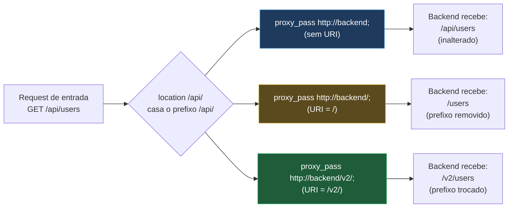

# 07 — Proxy reverso

> [!abstract] TL;DR
> `proxy_pass` é a diretiva mais usada de toda configuração de Nginx, e também a que mais engana quem lê rápido demais: uma barra a mais ou a menos no final da URL muda, de forma binária, o path que o backend recebe — sem erro de sintaxe, sem aviso, sem `nginx -t` reclamando de nada. Por padrão o Nginx não repassa `Host` nem `Connection` do jeito que a maioria espera, e não envia `X-Real-IP` nem `X-Forwarded-For` nem `X-Forwarded-Proto` a menos que alguém peça explicitamente — cada um desses headers precisa ser escrito à mão. E, contrariando quase todo tutorial em circulação, desde a versão 1.29.7 as duas linhas mais copiadas da internet para manter conexões keepalive com o upstream — `proxy_http_version 1.1;` e `proxy_set_header Connection "";` — deixaram de ser necessárias, porque os dois valores viraram o padrão do próprio Nginx.

Um sintoma comum, dos que geram um ticket de suporte antes de gerar uma busca no Google: o backend recebe `Host: 127.0.0.1:3000` em vez de `Host: app.exemplo.com`, e qualquer lógica que dependa do domínio original — geração de link, verificação de origem, roteamento multi-tenant — quebra silenciosamente. Outro, irmão do primeiro: a aplicação por trás do proxy monta uma URL absoluta a partir do próprio `Host` que recebeu, devolve um redirecionamento para `http://127.0.0.1:3000/dashboard`, e o navegador do cliente, que nunca ouviu falar daquele endereço interno, trava numa tela de erro de conexão. Um terceiro, mais sutil ainda: o path que chega ao backend vem duplicado — `/api/api/users` em vez de `/api/users` — e ninguém, olhando só para o `location`, entende de onde veio o `/api` repetido. Os três sintomas têm causas diferentes na superfície, mas a mesma raiz: `proxy_pass` não é uma diretiva "transparente" que simplesmente encaminha a request como ela chegou. Ela reescreve o path segundo uma regra precisa, e não repassa headers por conta própria além de dois, também segundo uma regra precisa. Esta nota é o mapa das duas regras, e de tudo que gira em torno delas — buffers, timeouts, WebSocket, redirecionamento reescrito — para quem precisa que um proxy reverso se comporte como o esperado, não como uma caixa-preta que às vezes funciona.

A nota anterior deste galho, [[03-Dominios/Tecnologia/Infraestrutura/Nginx/05 - O ciclo de vida de uma request|05 — O ciclo de vida de uma request]], já situou `proxy_pass` no mapa maior: é um dos handlers que competem pela fase `CONTENT`, a décima das onze fases, chamada só depois que rewrite, rate limit e controle de acesso já aprovaram a request inteira. O que aquela nota não abriu — porque não era o assunto dela — é o que acontece dentro desse handler específico: qual URI de fato sai pela outra ponta, quais headers acompanham essa URI, e o que fazer quando a resposta que volta é grande demais, lenta demais, ou carrega um `Location` que não faz sentido fora da rede interna. É esse "dentro do handler" que esta nota cobre por inteiro.

## A barra final do `proxy_pass`: o coração da nota

A documentação oficial do `ngx_http_proxy_module` descreve duas variantes de `proxy_pass`, e a diferença entre elas é a fonte mais comum de "o path chegou errado no backend" de toda a configuração de Nginx. Com URI declarada no `proxy_pass`, a regra é: *"a parte de uma URI de request normalizada que casa com o `location` é substituída pela URI especificada na diretiva"*. Sem URI, a regra é a oposta: *"a URI da request é passada ao servidor na mesma forma em que foi enviada pelo cliente"* — inalterada, por completo.

O exemplo que a própria documentação usa para ilustrar a primeira variante é direto: `location /name/ { proxy_pass http://127.0.0.1/remote/; }`. Uma request para `/name/alguma-coisa` chega ao backend como `/remote/alguma-coisa` — o prefixo `/name/`, que casou com o `location`, foi substituído pelo `/remote/` declarado no `proxy_pass`. É uma reescrita de path automática, silenciosa, e presente em qualquer `proxy_pass` que carregue algo depois do host — mesmo que esse algo seja só uma barra sozinha.

E é exatamente aí que mora a armadilha: `proxy_pass http://backend;` e `proxy_pass http://backend/;` não são a mesma diretiva com um caractere cosmético a mais. A primeira não tem URI nenhuma — é só protocolo, host e porta — então a request passa inalterada. A segunda tem uma URI, e essa URI é uma única barra, `/` — então o Nginx substitui o prefixo do `location` por essa barra, o que, na prática, remove o prefixo do path antes de repassar a request. Trocar `proxy_pass http://backend;` por `proxy_pass http://backend/;` num `location /api/` muda o path que o backend recebe de `/api/users` para `/users`, sem tocar em mais nenhuma linha da configuração — e sem gerar nenhum aviso de `nginx -t`, porque as duas formas são sintaticamente válidas e ambíguas o bastante para nunca soarem como erro na primeira leitura.

### Tabela completa: as quatro combinações

Considere uma request de entrada para `/api/users`, contra um `location` que casa com o prefixo `/api/` (com barra final) e um `proxy_pass` apontando para `http://backend:3000`. A tabela a seguir cobre as combinações que de fato aparecem em produção — variando se o `location` termina em barra e se o `proxy_pass` carrega uma URI:

> | `location` | `proxy_pass` | Path que chega ao backend | Por quê |
> |---|---|---|---|
> | `location /api/ {` | `proxy_pass http://backend;` | `/api/users` | Sem URI no `proxy_pass` — a request passa inalterada, prefixo incluído. |
> | `location /api/ {` | `proxy_pass http://backend/;` | `/users` | URI é `/` — o prefixo `/api/` que casou é substituído por essa barra sozinha, removendo-o. |
> | `location /api/ {` | `proxy_pass http://backend/v2/;` | `/v2/users` | URI é `/v2/` — o prefixo `/api/` é substituído por `/v2/`, trocando o path por outro prefixo. |
> | `location /api {` (sem barra) | `proxy_pass http://backend/;` | `//users` | O `location` sem barra final casa com `/api` inteiro; a request original é `/api/users`, a parte que casa é só `/api`, e o `/users` restante é concatenado depois da substituição — produzindo uma barra dupla se a URI de substituição já terminar em `/`. |
> | `location = /api/health {` | `proxy_pass http://backend/status;` | `/status` | `location` exato: a URI inteira que casa (`/api/health`) é substituída pela URI completa do `proxy_pass` (`/status`), sem sobra de path para concatenar. |

A quarta linha é a que mais surpreende porque não é um erro de configuração isolado — é o resultado mecânico de duas escolhas de barra que, sozinhas, parecem inofensivas: um `location` sem barra final e um `proxy_pass` com URI terminando em barra. A recomendação prática que decorre direto da tabela é simples de enunciar e fácil de esquecer sob pressão: **a barra final do `location` e a barra final (ou ausência dela) do `proxy_pass` precisam ser pensadas como um par, nunca isoladamente** — mudar uma sem revisar a outra é a causa mais comum do "path duplicado" e do "path truncado" que abriram esta nota.



Vale nomear o caso que produz o sintoma `/api/api/users` da abertura desta nota, porque é a combinação inversa da segunda linha da tabela: um `location /api/` com `proxy_pass http://backend;` **sem URI**, apontando para um backend cujas próprias rotas já começam com `/api`. Nesse caso a request inteira, prefixo incluído, é repassada sem alteração — o backend recebe `/api/users`, e se ele só sabe responder a `/users`, a rota simplesmente não existe do lado de lá, gerando um `404` que parece bug de roteamento mas é, de novo, a mesma regra da barra, só que aplicada ao lado errado do problema: a correção nesse cenário não é mexer no `location`, é adicionar a URI de substituição que falta no `proxy_pass` — `proxy_pass http://backend/;` — para que o prefixo `/api/` seja consumido antes de sair.

Um detalhe que vale registrar antes de seguir: se `proxy_pass` usa variáveis na URI — algo como `proxy_pass http://$backend_upstream;`, comum em configurações que decidem o destino dinamicamente via `map` — a regra de reescrita não se aplica do mesmo jeito. Nesses casos, segundo a mesma documentação, a URI da request original é usada, com a resolução final acontecendo em tempo de request; a substituição determinística da tabela acima vale para `proxy_pass` com um destino literal, escrito no arquivo.

### Os três casos em que a reescrita automática não existe

A documentação do `ngx_http_proxy_module` nomeia, com precisão, três situações em que **não há como o Nginx determinar** qual parte da URI deveria ser substituída — e nas três, a exigência é a mesma: `proxy_pass` precisa ser declarado sem URI, ou o comportamento observado diverge do que a tabela anterior descreve.

A primeira é `location` declarado com expressão regular (ou dentro de um *named location*): como não existe um prefixo fixo casando com a request — uma regex pode capturar partes variáveis do path de formas que não correspondem a nenhum "prefixo substituível" — a doc afirma que, nesses casos, `proxy_pass` deveria ser especificado sem URI.

```nginx
location ~ ^/usuarios/(\d+)$ {
    proxy_pass http://backend;
    # proxy_pass http://backend/perfil/; seria ambíguo aqui —
    # não existe "o prefixo que casou" para substituir por /perfil/
}
```

A segunda é quando a URI já foi alterada dentro do próprio `location` por um `rewrite ... break;` — o modificador que, como a nota [[03-Dominios/Tecnologia/Infraestrutura/Nginx/05 - O ciclo de vida de uma request|05 — O ciclo de vida de uma request]] já registrou, muda a URI sem disparar nova busca de `location`. Nesse caso, segundo a documentação, a URI declarada no `proxy_pass` é **ignorada por completo**, e a URI já reescrita pelo `rewrite` é repassada inteira ao backend:

```nginx
location /name/ {
    rewrite /name/([^/]+) /users?name=$1 break;
    proxy_pass http://127.0.0.1;
}
```

Uma request para `/name/joao` vira, depois do `rewrite`, `/users?name=joao` — e é essa URI, não nenhuma reescrita adicional do `proxy_pass`, que chega ao backend, mesmo que o `proxy_pass` daquele bloco tivesse alguma URI declarada.

A terceira é o caso já mencionado do `proxy_pass` com variáveis: quando o endereço do upstream é resolvido dinamicamente, uma URI declarada junto — `proxy_pass http://127.0.0.1$request_uri;`, por exemplo — é usada como está, substituindo a URI original diretamente, sem a lógica de "prefixo do `location` substituído por sufixo do `proxy_pass`" que rege o caso literal.

Os três casos compartilham a mesma lição: a tabela de combinações barra-a-barra desta nota vale para o caso comum — `location` com prefixo fixo, `proxy_pass` com destino literal — que é a esmagadora maioria das configurações reais; fora dele, a pergunta "qual URI chega ao backend" deixa de ter uma resposta mecânica derivável só da barra final, e passa a depender de qual dos três casos acima está em jogo.

## Os headers: o que o Nginx envia por padrão, e o que não envia

A segunda causa de sintoma mais comum — `Host` errado chegando ao backend — nasce de uma suposição igualmente razoável e igualmente errada: a de que um proxy reverso, por definição, repassa os headers da request original sem tocar neles. O Nginx não faz isso. A documentação do `ngx_http_proxy_module` é explícita: por padrão, os campos de cabeçalho `Host` e `Connection` da request original **não** são passados ao servidor proxied. Em vez disso, quando HTTP/1.0 ou 1.1 está habilitado para o proxy, o Nginx os redefine com os seguintes valores default:

```nginx
proxy_set_header Host       $proxy_host;
proxy_set_header Connection close;
```

`$proxy_host` é uma variável embutida do módulo, definida como *"nome e porta de um servidor proxied conforme especificado na diretiva `proxy_pass`"* — ou seja, o valor default de `Host` não é o domínio que o cliente digitou, é o endereço do upstream, tipicamente algo como `backend:3000` ou `127.0.0.1:8080`. É exatamente esse default que produz o primeiro sintoma da abertura: sem um `proxy_set_header Host` explícito, o backend enxerga a si mesmo como destino, nunca o domínio público que o cliente acessou.

Existem três formas documentadas de setar `Host`, cada uma com uma nuance distinta: `proxy_set_header Host $http_host;` repassa o `Host` exatamente como o cliente enviou, mas se o cliente não enviar esse header a request original fica sem nada; `proxy_set_header Host $host;` usa o nome do `server` que atendeu a request — o valor do header `Host` se presente, ou o nome primário do `server` se ausente —, e é essa a forma recomendada pela documentação como a mais robusta das três; e passar host junto com a porta do upstream, `proxy_set_header Host $host:$proxy_port;`, quando o backend precisa saber em que porta o Nginx está escutando.

```nginx
location /app/ {
    proxy_pass http://app_upstream;

    proxy_set_header Host $host;
    proxy_set_header X-Real-IP $remote_addr;
    proxy_set_header X-Forwarded-For $proxy_add_x_forwarded_for;
    proxy_set_header X-Forwarded-Proto $scheme;
}
```

Nenhum dos três headers da segunda metade desse bloco — `X-Real-IP`, `X-Forwarded-For`, `X-Forwarded-Proto` — tem um default equivalente ao de `Host`. Eles simplesmente não existem no vocabulário padrão de `ngx_http_proxy_module`; se ninguém os declarar, o backend não recebe informação nenhuma sobre o IP original do cliente nem sobre se a conexão original era HTTP ou HTTPS — ele só enxerga o IP e o protocolo da conexão entre o Nginx e ele mesmo, que é sempre a máquina do proxy, quase sempre HTTP puro internamente. `X-Real-IP $remote_addr;` propaga o endereço de quem conectou direto no Nginx. `X-Forwarded-Proto $scheme;` propaga se a conexão original era `http` ou `https` — informação que a aplicação por trás costuma precisar para não gerar link misto ou marcar cookie como `Secure` incorretamente. `X-Forwarded-For` merece um cuidado à parte: setá-lo direto como `$remote_addr` descarta qualquer cadeia de proxies anterior; a variável correta para isso é `$proxy_add_x_forwarded_for`, que a documentação descreve como *"o campo de cabeçalho `X-Forwarded-For` da request do cliente com a variável `$remote_addr` anexada a ele, separada por vírgula"* — se o cliente não enviou `X-Forwarded-For` nenhum, o valor da variável equivale só a `$remote_addr`, preservando a cadeia quando ela já existe em vez de sobrescrevê-la.

> [!info] Baseline de versão
> Para HTTP/2, a documentação registra uma diferença: o pseudo-header `:authority`, com o valor de `$proxy_host`, é enviado por padrão a menos que seja substituído por um `Host` explícito — o mesmo comportamento de fundo do HTTP/1.x, só que expresso num campo diferente do protocolo. Este comportamento e os defaults acima valem para as versões correntes em 2026 — mainline 1.31.3 (15 jul 2026) e stable 1.30.4.

## `proxy_http_version` e o keepalive com o upstream: a mudança da versão 1.29.7

Existe um par de linhas que aparece em praticamente todo tutorial de proxy reverso já escrito, copiado de configuração em configuração há anos, quase sempre sem explicação do porquê:

```nginx
proxy_http_version 1.1;
proxy_set_header Connection "";
```

Para entender por que essas duas linhas existiam, vale voltar ao comportamento default de `proxy_set_header Connection` descrito na seção anterior: por padrão, o Nginx envia `Connection: close` ao backend — instruindo-o, explicitamente, a fechar a conexão TCP depois de responder. Isso é seguro e simples, mas caro: toda nova request contra o mesmo backend paga o custo de um novo handshake TCP inteiro. A diretiva `keepalive`, do módulo `ngx_http_upstream_module`, existe para evitar esse custo, mantendo um pool de conexões ociosas já abertas com o upstream, reaproveitadas entre requests em vez de recriadas a cada vez — mas manter uma conexão HTTP viva entre duas requests só funciona com HTTP persistente, e HTTP/1.0 (o default histórico de `proxy_http_version` antes da mudança que esta seção descreve) não suporta isso da mesma forma que HTTP/1.1. Era por isso que as duas linhas eram, até pouco tempo atrás, obrigatórias sempre que alguém configurava `keepalive` num bloco `upstream`: `proxy_http_version 1.1;` trocava o protocolo usado para falar com o backend, de HTTP/1.0 para HTTP/1.1 — o único que sustenta conexão persistente de forma nativa — e `proxy_set_header Connection "";` limpava o `Connection: close` que o default enviaria, porque um valor vazio numa diretiva `proxy_set_header` significa, segundo a própria documentação, que aquele campo de cabeçalho **não é enviado** ao backend — sem essa limpeza explícita, o `close` continuaria instruindo o backend a derrubar a conexão a cada resposta, tornando o `keepalive` do upstream inútil na prática, mesmo configurado.

> [!info] Baseline de versão — a mudança da 1.29.7
> A documentação do `ngx_http_upstream_module` registra, na descrição da diretiva `keepalive`: *"Since 1.29.7, keepalive connections are enabled by default, with a default limit of 32 connections per each worker process."* E a documentação do `ngx_http_proxy_module`, na descrição de `proxy_http_version`, é igualmente direta: *"Since 1.29.7, version 1.1 is used by default. Before 1.29.7, version 1.0 was used by default."* As duas mudanças, juntas, tornam as duas linhas acima **desnecessárias** em builds a partir da 1.29.7 — `proxy_http_version` já é `1.1` por padrão, e a documentação de `keepalive` mostra o exemplo canônico de proxy HTTP com as duas linhas comentadas, anotadas explicitamente com `# before version 1.29.7`. A mainline 1.31.3 (15 jul 2026) já carrega esse comportamento; a stable 1.30.4, por ser uma linha anterior à 1.29.7, **não** carrega — quem roda 1.30.x ainda precisa das duas linhas explícitas.

O exemplo oficial da documentação do `ngx_http_upstream_module`, para versões anteriores à 1.29.7, é exatamente este:

```nginx
upstream http_backend {
    server 127.0.0.1:8080;

    keepalive 16;
}

server {
    location /http/ {
        proxy_pass http://http_backend;
        # proxy_http_version 1.1; # before version 1.29.7
        # proxy_set_header Connection ""; # before version 1.29.7
    }
}
```

A ressalva prática que decorre disso é dupla, e vale segurar as duas pontas ao mesmo tempo. Primeiro: **quem escreve configuração nova, contra um Nginx atual, não precisa mais dessas duas linhas** — o comportamento que elas forçavam já é o default. Segundo, e mais importante para quem lida com configuração herdada: **a esmagadora maioria das configurações em produção hoje foi escrita antes dessa mudança, ou roda numa versão anterior a ela**, e nessas duas linhas continuam sendo tanto corretas quanto necessárias — removê-las de uma configuração rodando stable 1.30.4 ou qualquer versão anterior à 1.29.7 reintroduz `Connection: close` e HTTP/1.0 contra o backend, matando o `keepalive` silenciosamente, sem erro nenhum de `nginx -t`. Não há nenhum problema em manter as duas linhas mesmo numa versão que já não precisa delas — são redundantes, não incorretas, contra o default novo — o que torna "deixar como está" uma opção sempre segura diante de dúvida sobre qual versão está de fato rodando em produção.

A mecânica de balanceamento e o restante da diretiva `keepalive` — o parâmetro `connections`, o `local`, quantas conexões o Nginx de fato reaproveita — pertence à nota [[03-Dominios/Tecnologia/Infraestrutura/Nginx/08 - upstream e balanceamento|08 — upstream e balanceamento]], que abre o bloco `upstream` por inteiro; o que importa fixar aqui é só o motivo pelo qual `proxy_http_version` e `Connection` acompanham `keepalive` na conversa, e por que a resposta a "preciso escrever essas duas linhas?" mudou de "sempre" para "depende da versão".

## A armadilha da herança, na prática

A nota [[03-Dominios/Tecnologia/Infraestrutura/Nginx/02 - A estrutura da configuração|02 — A estrutura da configuração]] já estabeleceu a regra geral: `proxy_set_header` é uma diretiva multi-instância, e um contexto filho que declara **qualquer** instância dela descarta por inteiro todas as instâncias herdadas do contexto pai — não só a que colide por nome. Nesta nota, a regra deixa de ser abstrata e vira o motivo concreto por trás de um dos sintomas mais frequentes de proxy reverso em produção: um `server` centraliza os quatro `proxy_set_header` de sempre, um `location` específico precisa de só mais um — digamos, repassar um token de autenticação —, declara esse header sozinho, e os quatro herdados somem sem aviso.

```nginx
server {
    listen 80;
    server_name api.exemplo.com;

    proxy_set_header Host $host;
    proxy_set_header X-Real-IP $remote_addr;
    proxy_set_header X-Forwarded-For $proxy_add_x_forwarded_for;
    proxy_set_header X-Forwarded-Proto $scheme;

    location / {
        proxy_pass http://backend_padrao;
        # nenhum proxy_set_header aqui — herda os quatro do server
    }

    location /interno/ {
        proxy_pass http://backend_interno;
        # a intenção era só ACRESCENTAR este header —
        # o efeito real é ZERAR os quatro herdados
        proxy_set_header X-Internal-Token $internal_token;
    }
}
```

Depois dessa declaração, requests que passam por `/interno/` chegam ao backend com `X-Internal-Token` presente e nenhum dos outros quatro — `Host` volta ao default `$proxy_host` (o endereço do upstream, não o domínio público), `X-Real-IP` e `X-Forwarded-For` somem, `X-Forwarded-Proto` também. A correção segue a mesma regra desde a nota 02: repetir, no `location`, tudo que ainda deveria valer ali, porque a substituição não deixa outra saída.

```nginx
    location /interno/ {
        proxy_pass http://backend_interno;

        proxy_set_header Host $host;
        proxy_set_header X-Real-IP $remote_addr;
        proxy_set_header X-Forwarded-For $proxy_add_x_forwarded_for;
        proxy_set_header X-Forwarded-Proto $scheme;

        proxy_set_header X-Internal-Token $internal_token;
    }
```

O padrão prático que evita essa armadilha em configurações reais é declarar o bloco inteiro de `proxy_set_header` uma vez, num snippet incluído via `include`, e referenciá-lo em todo `location` que precise de proxy — trocando "repetir de cabeça, torcendo para não esquecer nenhum" por "repetir via `include`, garantido pelo arquivo":

```nginx
# /etc/nginx/snippets/proxy-headers.conf
proxy_set_header Host $host;
proxy_set_header X-Real-IP $remote_addr;
proxy_set_header X-Forwarded-For $proxy_add_x_forwarded_for;
proxy_set_header X-Forwarded-Proto $scheme;
```

```nginx
    location /interno/ {
        proxy_pass http://backend_interno;
        include /etc/nginx/snippets/proxy-headers.conf;
        proxy_set_header X-Internal-Token $internal_token;
    }
```

## Buffers: o que acontece quando a resposta não cabe

`proxy_buffering`, ligado por padrão (`on`), controla se o Nginx acumula a resposta inteira do backend antes de começar a devolvê-la ao cliente, ou se repassa cada pedaço assim que chega. Com buffering ligado, a documentação descreve o fluxo assim: o Nginx recebe a resposta do backend o mais rápido possível, salvando-a nos buffers configurados por `proxy_buffer_size` e `proxy_buffers`; se a resposta inteira não couber na memória reservada por esses buffers, uma parte dela pode ser salva num arquivo temporário em disco, controlado por `proxy_max_temp_file_size` e `proxy_temp_file_write_size`.

Os quatro nomes, com seus papéis e defaults, confirmados na documentação oficial:

- **`proxy_buffer_size`** — tamanho do buffer usado para ler a **primeira parte** da resposta, tipicamente o cabeçalho. Default: `4k` ou `8k`, dependendo da plataforma — equivalente a uma página de memória do sistema. Se o cabeçalho da resposta exceder esse tamanho, a resposta é considerada inválida.
- **`proxy_buffers`** — número e tamanho dos buffers usados para ler o restante da resposta, por conexão. Default: `8 4k|8k` — oito buffers, cada um de 4K ou 8K conforme a plataforma.
- **`proxy_max_temp_file_size`** — tamanho máximo do arquivo temporário em disco, usado quando a resposta não cabe inteira nos buffers acima. Default: `1024m`.
- **`proxy_buffering`** — liga ou desliga o mecanismo inteiro. Default: `on`.

Quando `proxy_buffering` está desligado, o comportamento muda de forma que vale nomear com precisão, porque é justamente aqui que streaming entra em cena: a resposta é passada ao cliente de forma síncrona, assim que é recebida — o Nginx não tenta ler a resposta inteira do backend antes de repassar nada, e o tamanho máximo de dado que ele consegue receber do servidor de uma vez passa a ser limitado só por `proxy_buffer_size`. É por isso que `proxy_buffering off;` surpreende quem espera "mais rápido" e recebe, em vez disso, um comportamento de repasse quase byte a byte: com buffering ligado (o padrão), uma resposta que o backend gera lentamente, aos poucos, fica acumulada nos buffers do Nginx até estar pronta ou até estourar o espaço disponível — o cliente só começa a receber quando o Nginx decide que já tem o bastante para valer a pena mandar; com buffering desligado, cada pedaço que o backend produz é repassado ao cliente imediatamente, o que é exatamente o comportamento que streaming de eventos (Server-Sent Events, por exemplo) e respostas incrementais de aplicações que "digitam" a resposta aos poucos precisam para não parecer travadas.

O detalhe que costuma pegar quem nunca leu a doc com atenção: **buffering é sobre a resposta do backend para o Nginx, não sobre a resposta do Nginx para o cliente.** Uma API que gera uma resposta grande, digamos um relatório de vários megabytes, com buffering ligado (o padrão) tem essa resposta inteira acumulada nos buffers do Nginx — e, se ela exceder o espaço de `proxy_buffer_size` mais `proxy_buffers`, uma parte vai para um arquivo temporário em disco, respeitando o teto de `proxy_max_temp_file_size`, até ser toda enviada ao cliente. Isso é transparente na maioria dos casos — o cliente nem percebe — mas custa I/O de disco silencioso quando a resposta é consistentemente maior do que os buffers configurados, e é a causa raiz de um padrão de sintoma específico: latência extra que só aparece com respostas grandes, nunca com pequenas, sem nenhum erro no log além, às vezes, de um aviso sobre escrita em arquivo temporário.

> [!info] Baseline de versão
> Os valores default de `proxy_buffer_size` (`4k|8k`) e `proxy_buffers` (`8 4k|8k`) — "uma página de memória, 4K ou 8K dependendo da plataforma" — e o default de `proxy_max_temp_file_size` (`1024m`) valem para as versões correntes documentadas pelo `ngx_http_proxy_module`, mainline 1.31.3 e stable 1.30.4.

Um `location` dedicado a streaming — eventos de servidor, uma API que envia progresso incremental de um job longo — costuma desligar `proxy_buffering` de forma isolada, deixando o resto da configuração com os buffers padrão para todo o restante do site:

```nginx
location /eventos/ {
    proxy_pass http://backend_eventos;

    proxy_buffering off;
    proxy_read_timeout 3600s;

    proxy_set_header Host $host;
    proxy_set_header X-Real-IP $remote_addr;
}

location / {
    proxy_pass http://backend_padrao;
    # proxy_buffering permanece "on" aqui — o default de todo o resto do site
}
```

O `proxy_read_timeout` alargado, no mesmo bloco, não é coincidência: uma conexão de streaming pode ficar legitimamente sem enviar nada por longos períodos entre eventos, e o default de 60 segundos fecharia uma conexão saudável só porque ela está ociosa entre mensagens — o mesmo raciocínio que a seção de WebSocket, mais adiante, aplica ao mesmo timeout num contexto diferente. Vale notar que `proxy_busy_buffers_size`, uma quinta diretiva de buffer que a documentação também define, limita o tamanho total dos buffers que podem estar ocupados enviando dados ao cliente enquanto a resposta ainda não terminou de ser lida — por padrão, limitado ao tamanho de dois buffers somados (`proxy_buffer_size` mais `proxy_buffers`); ela raramente precisa de ajuste manual, mas explica por que, mesmo com buffering ligado, o Nginx começa a mandar dados ao cliente antes de ter lido a resposta inteira do backend, em vez de esperar tudo chegar para só então repassar.

## Timeouts: o que cada um mede, e qual gera o 504

Três diretivas de timeout cobrem fases diferentes da conversa entre o Nginx e o backend, e confundir qual é qual é a razão pela qual "aumentar o timeout" às vezes não resolve nada — porque quem estourou não foi o timeout que alguém mudou.

**`proxy_connect_timeout`** — *"define um timeout para estabelecer uma conexão com um servidor proxied"*. Mede só a fase de handshake TCP inicial, antes de qualquer byte de request ser enviado. Default: `60s`. A própria documentação nota que esse timeout normalmente não pode exceder 75 segundos, um limite de baixo nível independente do valor configurado.

**`proxy_send_timeout`** — *"define um timeout para transmitir uma request ao servidor proxied. O timeout é contado só entre duas operações de escrita sucessivas, não para a transmissão da request inteira"*. Default: `60s`. Se o backend parar de aceitar dados por mais de 60 segundos entre uma escrita e a seguinte — não 60 segundos no total — a conexão é fechada.

**`proxy_read_timeout`** — *"define um timeout para ler uma resposta do servidor proxied. O timeout é contado só entre duas operações de leitura sucessivas, não para a transmissão da resposta inteira"*. Default: `60s`. Se o backend fica em silêncio, sem enviar nenhum byte novo, por mais de 60 segundos entre um pedaço recebido e o seguinte, a conexão é fechada.

`proxy_read_timeout` é o clássico gerador do **504 Gateway Timeout**: um backend que trava numa consulta lenta, numa chamada externa pendurada, ou num processamento que simplesmente demora mais do que o limite configurado, deixa de enviar qualquer byte por tempo suficiente, e o Nginx encerra a conexão, devolvendo `504` ao cliente sem que o backend necessariamente tenha crashado — ele pode continuar processando, alheio ao fato de que o cliente já recebeu erro. É por isso que "aumentar o `proxy_connect_timeout`" quase nunca resolve um 504 recorrente: a conexão já foi estabelecida havia muito tempo quando o timeout estourou; quem precisa de ajuste é `proxy_read_timeout`, e mesmo esse ajuste é, no fundo, um remendo — o sintoma real costuma ser um backend lento demais para o caso de uso, não um Nginx impaciente demais.


## WebSocket: o upgrade que o proxy precisa deixar passar

Uma conexão WebSocket nasce como uma request HTTP/1.1 comum, que pede uma troca de protocolo via os headers hop-by-hop `Upgrade` e `Connection`. A documentação de proxy do Nginx é explícita sobre a consequência disso para um proxy reverso: como `Upgrade` é um header hop-by-hop, ele **não é repassado** do cliente ao servidor proxied por padrão — o mesmo destino de qualquer header hop-by-hop atravessando um proxy. Desde a versão 1.3.13, o Nginx implementa um modo especial de operação que permite montar um túnel entre cliente e backend quando o servidor proxied responde com `101 Switching Protocols` e o cliente pediu a troca via `Upgrade` — mas esse modo só entra em ação se os headers relevantes forem repassados explicitamente:

```nginx
location /chat/ {
    proxy_pass http://backend;
    proxy_set_header Upgrade $http_upgrade;
    proxy_set_header Connection "upgrade";
}
```

Essa forma simples funciona quando toda request que chega àquele `location` é, de fato, uma tentativa de upgrade. O problema aparece quando o mesmo `location` também precisa atender requests HTTP normais, sem `Upgrade` nenhum — forçar `Connection: upgrade` incondicionalmente quebraria essas requests comuns. A solução documentada é um `map`, decidindo o valor de `Connection` com base na presença do header `Upgrade` na request original:

```nginx
http {
    map $http_upgrade $connection_upgrade {
        default upgrade;
        ''      close;
    }

    server {
        location /chat/ {
            proxy_pass http://backend;
            proxy_set_header Upgrade $http_upgrade;
            proxy_set_header Connection $connection_upgrade;
        }
    }
}
```

Quando o cliente envia `Upgrade`, `$http_upgrade` não é vazio, o `map` cai no `default` e produz `upgrade` — o backend recebe `Connection: upgrade` e o túnel é estabelecido. Quando não há `Upgrade` na request, `$http_upgrade` é uma string vazia, o `map` casa com a entrada `''` e produz `close` — a request segue como HTTP comum, sem o Nginx tentar montar um túnel que não faz sentido ali. A mecânica completa do `map` — como ele constrói uma tabela de decisão a partir de uma variável de entrada, os valores especiais como `default` — é o assunto da nota [[03-Dominios/Tecnologia/Infraestrutura/Nginx/12 - Variáveis, map, rewrite e logging|12 — Variáveis, map, rewrite e logging]]; aqui basta reter que esse par `Upgrade`/`Connection`, condicionado via `map`, é o padrão canônico para expor WebSocket atrás de um `location` que também serve tráfego HTTP normal.

Um detalhe de timeout que vale nomear porque é fácil de esquecer com WebSocket especificamente: a documentação registra que, por padrão, a conexão é fechada se o servidor proxied não transmitir nenhum dado por 60 segundos — o mesmo `proxy_read_timeout` já descrito, só que agora aplicado a uma conexão que pode ficar legitimamente ociosa por longos períodos entre mensagens. O ajuste recomendado pela própria documentação não é necessariamente aumentar `proxy_read_timeout` sem limite, e sim configurar o backend para enviar frames de ping periódicos, resetando o timeout e confirmando que a conexão segue viva — uma solução no nível da aplicação, não só da configuração do proxy.

## gRPC: uma diretiva própria, não uma variação do HTTP

Fazer proxy de tráfego gRPC pelo Nginx não usa `proxy_pass` — usa uma diretiva própria, `grpc_pass`, parte do módulo `ngx_http_grpc_module`, com sua própria sintaxe e seu próprio conjunto de diretivas irmãs (`grpc_set_header`, `grpc_read_timeout`, e por aí vai), espelhando o padrão de `proxy_pass` mas adaptado ao fato de que gRPC roda sobre HTTP/2 com framing binário, não sobre o texto de requisições HTTP/1.x comuns. Um `location` típico troca uma diretiva pela outra sem mudar muito mais em volta:

```nginx
location /pacote.Servico/ {
    grpc_pass grpc://backend_grpc;
}
```

Aprofundar `grpc_pass` foge do escopo desta nota — o registro que vale reter aqui é só que ele existe, como um handler de conteúdo irmão de `proxy_pass`, competindo pela mesma fase `CONTENT` do ciclo de vida da request, para quem encontrar `grpc_pass` numa configuração e reconhecer que não é erro de digitação de `proxy_pass`.

> [!tip] Vídeo — o irmão que esta nota não abriu: `fastcgi_pass` e o porquê de existir um gateway
> [**How Nginx and PHP-FPM turn a web request into code**](https://www.youtube.com/watch?v=lh4RnczaATI) (Chris Fidao, ~7 min, EN) responde a pergunta que fica no ar quando se lê `fastcgi_pass` nos exemplos da nota 04 depois de aprender `proxy_pass` aqui: por que duas diretivas para a mesma ideia de "mandar a request para outro processo"? A resposta é que `proxy_pass` só funciona quando o backend **fala HTTP** — e PHP, Ruby e Python, sozinhos, não falam. Entre o Nginx e o código precisa existir um *gateway* que traduza a request HTTP para outro protocolo (FastCGI) e monte, do outro lado, as estruturas que a linguagem entende como "uma request" — o `$_SERVER` do PHP sendo preenchido, um a um, pelos `fastcgi_param` que o próprio Nginx enviou. Linguagens com servidor HTTP embutido, como Go e Node, dispensam o intermediário: para elas, `proxy_pass` basta. **O que ele não cobre:** nada do que é o assunto desta nota — a regra da barra final, herança de headers, buffers, timeouts, WebSocket; ele também não entra na gestão de processos do próprio PHP-FPM. Trecho de destaque [1:04]: *"most languages have a gateway that sits between a web server and their code base, especially older programming languages like Ruby or Python, PHP included — newer languages typically have HTTP built into them, so they actually don't need this gateway intermediary thing."*
>
> 🎬 [Assistir no YouTube](https://www.youtube.com/watch?v=lh4RnczaATI)

## `proxy_redirect`: por que um `Location` absoluto do backend quebra atrás de proxy

Um padrão comum de aplicação web é responder a certas ações — login bem-sucedido, criação de recurso — com um redirecionamento HTTP, carregando um header `Location`. Quando essa aplicação roda atrás de um proxy reverso mas não sabe disso, ela tende a montar esse `Location` usando o próprio endereço em que está escutando — `http://127.0.0.1:3000/dashboard`, por exemplo — porque, do ponto de vista dela, é esse o endereço correto. O cliente, que nunca fala diretamente com `127.0.0.1:3000` porque toda a conversa passa pelo Nginx em `app.exemplo.com`, recebe esse `Location` inalterado e tenta segui-lo — falhando, porque `127.0.0.1:3000` não existe do lado de fora da rede onde o backend roda.

`proxy_redirect` existe exatamente para essa situação: reescreve o texto dos headers `Location` e `Refresh` de uma resposta do backend, trocando o endereço interno por um que faça sentido do lado do cliente.

```nginx
location /app/ {
    proxy_pass http://127.0.0.1:3000/;
    proxy_redirect http://127.0.0.1:3000/ http://app.exemplo.com/app/;
}
```

Com essa diretiva, um `Location: http://127.0.0.1:3000/dashboard` devolvido pelo backend é reescrito, antes de sair para o cliente, para `Location: http://app.exemplo.com/app/dashboard` — o exemplo que a própria documentação usa segue a mesma lógica, com `http://localhost:8000/two/some/uri/` virando `http://frontend/one/some/uri/` via `proxy_redirect http://localhost:8000/two/ http://frontend/one/;`. O nome de servidor na string de substituição pode ser omitido — nesse caso o nome e a porta do `server` principal são inseridos automaticamente.

O default, `proxy_redirect default;`, tenta resolver essa reescrita automaticamente a partir dos parâmetros do próprio `location` e do `proxy_pass` — a documentação mostra que `proxy_pass http://upstream:port/two/; proxy_redirect default;` produz o mesmo resultado que escrever `proxy_redirect http://upstream:port/two/ /one/;` à mão, desde que o `proxy_pass` use um destino literal, não uma variável (o `default` não é permitido quando `proxy_pass` é especificado via variável). `proxy_redirect off;` desativa a reescrita por completo — útil quando o backend já sabe que está atrás de proxy e monta o `Location` corretamente, ou quando a aplicação depende de controlar esse header sem interferência.

Vale marcar a relação direta entre essa diretiva e a seção de headers anterior: um backend bem-comportado, que já recebe `X-Forwarded-Proto` e um `Host` correto via `proxy_set_header`, tem tudo que precisa para montar o próprio `Location` já correto — nesse caso `proxy_redirect` sequer entra em ação, porque nunca há nada de errado para reescrever. `proxy_redirect` é o remendo do lado do proxy para um backend que não faz essa parte sozinho; corrigir os headers de entrada, quando possível, é a solução mais robusta das duas, porque elimina a necessidade de manter as duas pontas (headers de request e reescrita de resposta) sincronizadas.

## Exemplo trabalhado: uma request, do cliente ao backend e de volta

Vale seguir uma configuração completa, e uma única request concreta através dela, para tornar tangível a interação entre tudo que as seções anteriores trataram separadamente — a barra do `proxy_pass`, os headers, o timeout, o `proxy_redirect`.

```nginx
http {
    upstream app_backend {
        server 10.0.1.20:4000;
        keepalive 32;
    }

    server {
        listen 443 ssl;
        http2 on;
        server_name app.exemplo.com;

        location /app/ {
            proxy_pass http://app_backend/;

            proxy_set_header Host $host;
            proxy_set_header X-Real-IP $remote_addr;
            proxy_set_header X-Forwarded-For $proxy_add_x_forwarded_for;
            proxy_set_header X-Forwarded-Proto $scheme;

            proxy_connect_timeout 5s;
            proxy_read_timeout 30s;

            proxy_redirect http://10.0.1.20:4000/ http://app.exemplo.com/app/;
        }
    }
}
```

Uma request `GET /app/pedidos/42 HTTP/2` chega em `https://app.exemplo.com/app/pedidos/42`, vinda de um navegador em `203.0.113.9`. O Nginx já resolveu `server` e `location` segundo o mecanismo das notas 03 e 04, e a fase `CONTENT` do ciclo descrito na nota 05 chama o handler de `proxy_pass` deste `location /app/`.

**O path.** `proxy_pass http://app_backend/;` carrega uma URI — a barra sozinha depois do nome do upstream. Pela regra da primeira seção desta nota, o prefixo que casou com o `location`, `/app/`, é substituído por essa barra: o path que sai é `/pedidos/42`, sem o prefixo. O backend, que só conhece suas próprias rotas (`/pedidos/:id`, não `/app/pedidos/:id`), recebe exatamente o que espera.

**Os headers.** `Host` chega como `app.exemplo.com` — o valor de `$host`, não o `10.0.1.20:4000` que seria o default sem a declaração explícita. `X-Real-IP` chega como `203.0.113.9`. `X-Forwarded-For` chega com esse mesmo IP, ou com uma cadeia mais longa se algum proxy anterior já tiver anexado o seu. `X-Forwarded-Proto` chega como `https`, refletindo `$scheme` na conexão original entre o cliente e o Nginx — mesmo que a conversa entre o Nginx e o backend, internamente, aconteça sobre HTTP puro.

**O timeout.** Se o backend, processando o pedido 42, não responder byte nenhum por mais de 30 segundos — o valor de `proxy_read_timeout` explicitamente reduzido neste `location`, abaixo do default de 60s, porque essa rota específica tem SLA mais apertado — o Nginx encerra a conexão e devolve `504` ao cliente, registrando no log de erro qual fase e qual upstream estouraram.

**A resposta, se for um redirect.** Suponha que o pedido 42 não existe mais, e o backend responde com `302` e `Location: http://10.0.1.20:4000/pedidos`. Sem `proxy_redirect`, esse header sairia para o cliente sem alteração, e o navegador tentaria abrir um endereço interno inacessível. Com a diretiva declarada, o Nginx reescreve o `Location` para `http://app.exemplo.com/app/pedidos` antes de repassar a resposta — o navegador segue o redirecionamento normalmente, sem nunca saber que existe um `10.0.1.20:4000` do outro lado.

Nenhuma dessas quatro decisões — path, headers, timeout, redirect — depende das outras três; cada uma é uma diretiva isolada, resolvida pela própria regra que a documentação declara para ela. É exatamente por isso que uma configuração de proxy reverso pode ter três dessas quatro peças corretas e a quarta silenciosamente errada, sem que o restante acuse nada: elas não se validam mutuamente, só coexistem na mesma fase `CONTENT` do ciclo de vida da request.

## Armadilhas comuns

> [!warning] Trocar `proxy_pass http://backend;` por `proxy_pass http://backend/;` sem revisar o `location`
> **O que acontece:** uma barra adicionada ao final do `proxy_pass` — muitas vezes por hábito, ou copiando de outro bloco — muda o path que o backend recebe, de repassado inalterado para prefixo removido, sem nenhum erro de sintaxe. **Por quê:** a presença de qualquer coisa depois do host no `proxy_pass`, mesmo uma barra sozinha, conta como URI para efeito da regra de substituição — a doc trata "sem URI" e "URI = `/`" como dois comportamentos radicalmente diferentes, não como variações cosméticas. **Como evitar:** tratar a barra final do `proxy_pass` como parte deliberada da configuração, nunca como estilo — e, ao revisar um `proxy_pass`, sempre reconferir contra a tabela desta nota o que o backend vai de fato receber.

> [!warning] Esperar que `Host` chegue "como veio do cliente" sem declarar `proxy_set_header Host`
> **O que acontece:** o backend recebe `Host` apontando para o próprio upstream (`$proxy_host`, o default), não para o domínio público que o cliente acessou — quebrando geração de link, verificação de origem, ou qualquer lógica de roteamento por domínio. **Por quê:** a documentação do `ngx_http_proxy_module` é explícita — por padrão, `Host` e `Connection` da request original **não** são passados ao backend; eles são redefinidos com valores próprios do proxy. **Como evitar:** declarar `proxy_set_header Host $host;` explicitamente em todo `location` que faz proxy — a forma recomendada pela documentação, mais robusta do que `$http_host` porque não depende de o cliente ter enviado o header.

> [!warning] Setar `proxy_set_header X-Forwarded-For $remote_addr;` em vez de usar `$proxy_add_x_forwarded_for`
> **O que acontece:** uma cadeia de proxies anterior (outro load balancer, um CDN) que já anexou seu próprio IP ao `X-Forwarded-For` tem esse histórico apagado — o backend só enxerga o último salto, não a cadeia inteira. **Por quê:** `$remote_addr` sozinho é só o IP de quem conectou direto no Nginx; `$proxy_add_x_forwarded_for` anexa esse IP ao valor de `X-Forwarded-For` já presente na request, preservando a cadeia em vez de sobrescrevê-la. **Como evitar:** usar sempre `$proxy_add_x_forwarded_for`, nunca `$remote_addr` puro, para essa diretiva específica — e tratar o valor resultante como uma lista separada por vírgula do lado do backend, não como um IP único confiável sem mais verificação.

> [!warning] Achar que `proxy_buffering off;` deixa tudo mais rápido
> **O que acontece:** alguém desliga `proxy_buffering` esperando ganho de performance geral, e passa a ver mais conexões simultâneas com o backend seguradas por mais tempo, além de comportamento diferente sob resposta lenta. **Por quê:** com buffering desligado, o Nginx repassa cada pedaço da resposta ao cliente assim que chega, sem acumular — o que é exatamente o que streaming precisa, mas também significa que a conexão com o backend fica aberta pelo tempo inteiro que ele levar para terminar de responder, em vez de o Nginx absorver a resposta rapidamente nos buffers e liberar o backend mais cedo. **Como evitar:** reservar `proxy_buffering off;` para os `location` que de fato fazem streaming (SSE, respostas incrementais) — manter `on` (o default) em tudo o mais, onde o comportamento de absorver e repassar é o desejado.

> [!warning] Confundir qual timeout está estourando num 504
> **O que acontece:** alguém aumenta `proxy_connect_timeout` na tentativa de resolver 504s recorrentes, e o problema continua idêntico. **Por quê:** `proxy_connect_timeout` só mede o handshake TCP inicial — quase nunca é o gargalo real; um 504 por lentidão do backend, depois da conexão já estabelecida, é quase sempre `proxy_read_timeout` estourando entre duas leituras. **Como evitar:** diagnosticar com o log de erro do Nginx antes de ajustar qualquer timeout — a mensagem indica qual fase estourou; ajustar o timeout errado só adia a descoberta do problema real, que costuma ser o backend, não o Nginx.

> [!warning] Declarar URI num `proxy_pass` dentro de `location` com regex
> **O que acontece:** um `location ~ ^/usuarios/(\d+)$` tem um `proxy_pass` com URI declarada, na esperança de que o Nginx substitua "o que casou" pela URI nova — e o comportamento resultante não corresponde a nenhuma regra simples de prefixo, porque não existe um prefixo fixo para substituir. **Por quê:** a documentação nomeia esse caso como um dos três em que a parte da URI a ser substituída **não pode ser determinada** — `location` por regex não tem um prefixo estático, só um padrão que pode capturar substrings de formas variáveis. **Como evitar:** em `location` por regex, declarar `proxy_pass` sempre sem URI, deixando a request passar como chegou — e usar variáveis de captura da regex (`$1`, `$2`) num `rewrite` anterior, se o path do backend precisar ser montado de forma diferente do que o cliente enviou.

## Como diagnosticar um `proxy_pass` que não está fazendo o que parece

Diante de um dos três sintomas que abriram esta nota — `Host` errado, path duplicado, redirecionamento quebrado —, um roteiro curto, apoiado só em ferramentas já disponíveis em qualquer instalação, resolve a maioria dos casos sem precisar adivinhar:

1. **Confirme o que o backend de fato recebeu, não o que a configuração parece dizer.** Se o backend é uma aplicação sob seu controle, um log de acesso simples nele — registrando o `Host` e o path recebidos — corta a adivinhação pela metade: compara o que a configuração do Nginx *deveria* produzir, segundo a tabela desta nota, contra o que de fato chegou.
2. **Use `curl -v` contra o Nginx, não contra o backend direto.** `curl -v https://app.exemplo.com/app/pedidos/42` mostra os headers de request enviados pelo cliente e os de resposta devolvidos — inclusive um `Location` já reescrito por `proxy_redirect`, se a reescrita estiver ativa. Comparar essa saída com um `curl -v` direto contra o backend, quando a rede permite, isola se o problema está na configuração do proxy ou na aplicação por trás dele.
3. **Rode `nginx -T`, já apresentado na nota 02 deste galho, e localize o `location` de fato responsável.** Confirmar qual bloco está em vigor — considerando herança por substituição, precedência de `location` — antes de suspeitar de uma diretiva específica evita depurar o bloco errado.
4. **Consulte o log de erro para timeouts e falhas de conexão.** Um `504` gera uma linha específica no `error_log`, tipicamente `upstream timed out` seguida do endereço do backend e da fase — o mesmo log que a nota [[03-Dominios/Tecnologia/Infraestrutura/Nginx/13 - Tuning e diagnóstico|13 — Tuning e diagnóstico]] trata a fundo, junto do catálogo completo de códigos de erro característicos de proxy reverso.
5. **Para path e barra, teste a tabela desta nota mentalmente antes de testar em produção.** Escrever a combinação exata — `location` com ou sem barra, `proxy_pass` com ou sem URI — contra a tabela do início desta nota prevê o resultado sem precisar de nenhuma request real; é mais rápido do que abrir uma aba do navegador para cada hipótese.

## Como explicar em inglês

> "The most common source of confusion with `proxy_pass` is the trailing slash — with a URI in `proxy_pass`, the matched part of the location prefix gets replaced by that URI; without one, the request URI passes through unchanged. That single slash decides whether the backend sees the original path or a rewritten one, and nginx won't warn you either way. On top of that, nginx doesn't forward the client's Host or Connection header by default — it sets its own, so you have to declare Host, X-Real-IP, X-Forwarded-For and X-Forwarded-Proto explicitly if the backend needs to know who the client actually was. And there's a version detail worth knowing: since 1.29.7, keepalive connections to the upstream are on by default, so the `proxy_http_version 1.1` plus `proxy_set_header Connection ""` pair that's copy-pasted into nearly every tutorial isn't required anymore on a current build — though plenty of production configs still carry it because they're running an older version."

> | PT | EN |
> |---|---|
> | proxy reverso | reverse proxy |
> | barra final | trailing slash |
> | reescrita de path | path rewriting |
> | herdar cabeçalhos | inherit headers |
> | conexão mantida viva (keepalive) | keepalive connection |
> | buffer de resposta | response buffer |
> | tempo limite de leitura | read timeout |
> | atualização de protocolo (WebSocket) | protocol upgrade |
> | redirecionamento reescrito | rewritten redirect |
> | servidor upstream / backend | upstream server / backend |

Uma frase que costuma render bem em entrevista, quando a pergunta é "o que você faria diferente numa configuração de proxy que você herdou": *"First thing I'd check is whether `proxy_pass` has a trailing URI or not — that decides the whole path rewriting behavior, and it's the single most common source of a mismatched route between nginx and the backend. Second, whether Host, X-Forwarded-For and X-Forwarded-Proto are actually being set — because nginx doesn't forward those by default, only Host and Connection get a default value, and that default isn't even the original Host."*

## Tabela de referência rápida

Vale fechar o corpo técnico consolidando, numa única tabela, as diretivas desta nota contra o seu default e o problema que cada uma resolve — útil como checklist ao revisar um `location` de proxy alheio, sem precisar reler a nota inteira de novo:

> | Diretiva | Default | O que resolve |
> |---|---|---|
> | `proxy_pass` (com URI) | — | Substitui o prefixo do `location` pela URI declarada. |
> | `proxy_pass` (sem URI) | — | Repassa a URI da request original, inalterada. |
> | `proxy_set_header Host` | `$proxy_host` | Sem declarar, o backend enxerga o endereço do upstream, não o domínio público. |
> | `proxy_set_header Connection` | `close` | Fecha a conexão a cada resposta, a menos que `keepalive` esteja em jogo. |
> | `proxy_http_version` | `1.1` (desde 1.29.7; `1.0` antes) | Protocolo usado para falar com o backend; `1.1`/`2` sustentam conexão persistente. |
> | `proxy_buffering` | `on` | Acumula a resposta antes de repassar; desligar é o que streaming exige. |
> | `proxy_buffer_size` | `4k\|8k` | Buffer para a primeira parte (cabeçalho) da resposta. |
> | `proxy_buffers` | `8 4k\|8k` | Buffers para o restante da resposta, por conexão. |
> | `proxy_max_temp_file_size` | `1024m` | Teto do arquivo temporário em disco quando a resposta não cabe nos buffers. |
> | `proxy_connect_timeout` | `60s` | Handshake TCP com o backend. |
> | `proxy_send_timeout` | `60s` | Entre duas escritas sucessivas da request ao backend. |
> | `proxy_read_timeout` | `60s` | Entre duas leituras sucessivas da resposta — o timeout por trás do 504 clássico. |
> | `proxy_redirect` | `default` | Reescreve `Location`/`Refresh` de resposta, evitando endereço interno vazando ao cliente. |

## O que vem a seguir

Esta nota tratou `proxy_pass` como se houvesse sempre um único backend do outro lado — `http://backend:3000`, um endereço fixo. Produção raramente é assim: existe mais de uma instância rodando a mesma aplicação, e alguém precisa decidir para qual delas cada request vai, o que fazer quando uma delas cai, e como manter uma sessão de cliente grudada no mesmo backend quando isso importa. Esse "mais de um backend" é o bloco `upstream`, que apareceu de passagem nesta nota só como `http://backend` — a próxima nota do galho abre esse bloco por inteiro: os algoritmos de balanceamento, o `keepalive` entre Nginx e upstream (a mesma diretiva que a mudança de versão 1.29.7 desta nota afetou), e o health check passivo que o Nginx OSS de fato entrega, sem depender do módulo comercial.

- [[03-Dominios/Tecnologia/Infraestrutura/Nginx/08 - upstream e balanceamento|08 — upstream e balanceamento]] — o pool de backends, os algoritmos de distribuição, e o `keepalive` por trás do que esta nota só tratou como um endereço único.
- [[03-Dominios/Tecnologia/Infraestrutura/Nginx/10 - Cache no Nginx|10 — Cache no Nginx]] — quando a resposta de um `proxy_pass` pode ser guardada e reaproveitada, em vez de sempre buscada de novo no backend.
- [[03-Dominios/Tecnologia/Infraestrutura/Nginx/12 - Variáveis, map, rewrite e logging|12 — Variáveis, map, rewrite e logging]] — o `map` completo por trás do padrão de WebSocket desta nota, e o `rewrite` que decide a URI antes de `proxy_pass` sequer rodar.
- [[03-Dominios/Tecnologia/Infraestrutura/Nginx/13 - Tuning e diagnóstico|13 — Tuning e diagnóstico]] — o catálogo completo de códigos de erro (502, 504, 499) que um proxy mal configurado produz, incluindo os timeouts desta nota vistos pelo lado do diagnóstico.

## Fontes

- **Nginx Docs** — [*Module ngx_http_proxy_module*](https://nginx.org/en/docs/http/ngx_http_proxy_module.html) — a fonte primária desta nota: `proxy_pass` e a regra de reescrita por URI, `proxy_set_header` e os defaults de `Host`/`Connection`, `proxy_http_version`, os quatro diretivas de buffer, os três timeouts, e `proxy_redirect`.
- **Nginx Docs** — [*Module ngx_http_upstream_module*](https://nginx.org/en/docs/http/ngx_http_upstream_module.html) — a diretiva `keepalive`, seus parâmetros, e a mudança de default na versão 1.29.7 (keepalive habilitado por padrão, limite de 32 conexões por worker).
- **Nginx Docs** — [*WebSocket proxying*](https://nginx.org/en/docs/http/websocket.html) — o mecanismo de túnel via `101 Switching Protocols`, o exemplo de `map` para `Connection`, e a nota sobre `proxy_http_version` antes da 1.29.7.
- **Nginx Docs** — [*Module ngx_http_v2_module*](https://nginx.org/en/docs/http/ngx_http_v2_module.html) — `http2 on;` como parâmetro de bloco, substituindo o parâmetro `http2` de `listen`, depreciado desde a versão 1.25.1.
- **Nginx Docs** — [*Module ngx_http_grpc_module*](https://nginx.org/en/docs/http/ngx_http_grpc_module.html) — `grpc_pass` como diretiva própria para proxy de tráfego gRPC.
