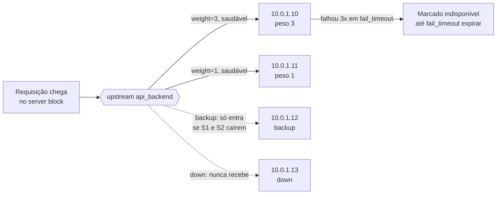
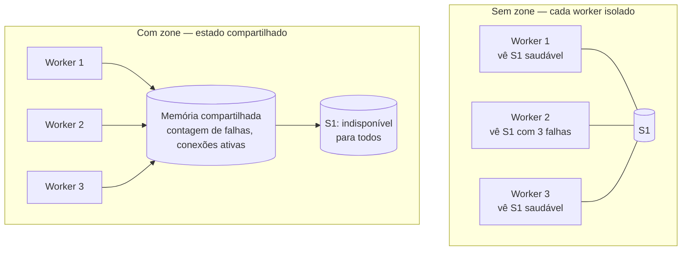
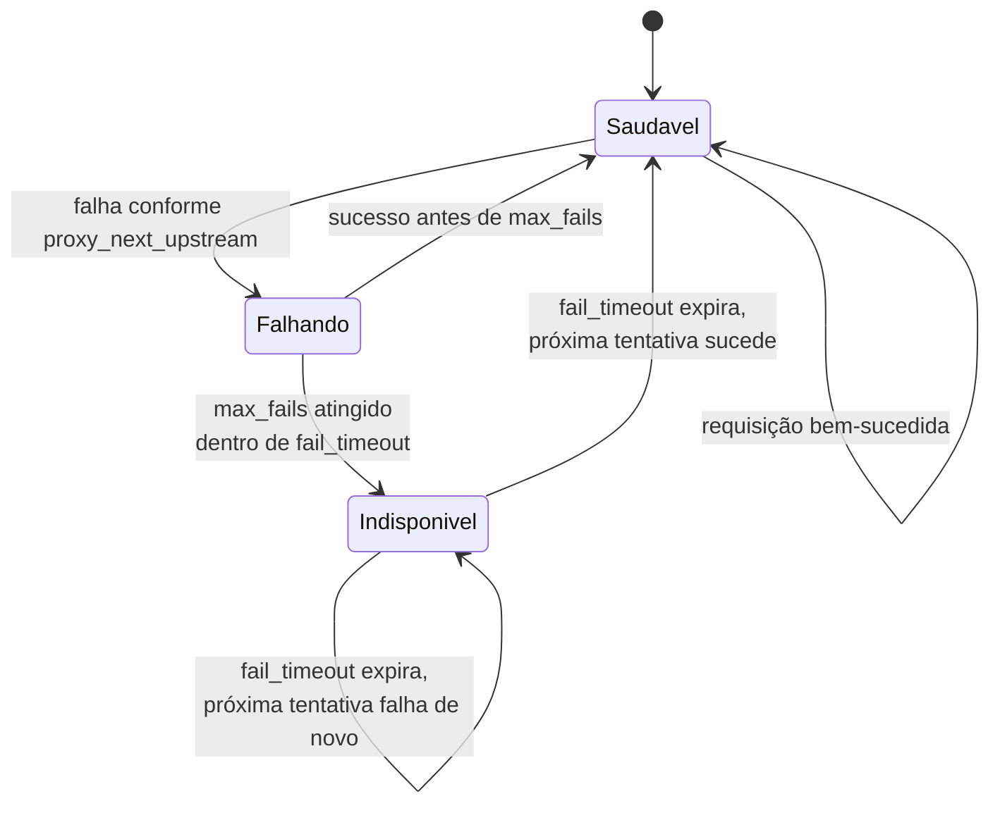

# 08 — `upstream` e balanceamento

> [!abstract] TL;DR
> Um backend cai à meia-noite e o Nginx continua mandando requisições pra ele por minutos, porque ninguém definiu `max_fails`/`fail_timeout` — o pool de servidores existe, mas ninguém disse ao Nginx como reagir a falha. O `upstream` é o bloco que nomeia esse pool e o `proxy_pass` da nota anterior aponta para ele em vez de para um único endereço. A partir daí, três decisões de configuração fazem toda a diferença: qual servidor recebe a próxima requisição (método de balanceamento), quando um servidor sai do pool (health check passivo — o open source não faz probe ativo), e se cada requisição reabre uma conexão TCP nova para o backend ou reaproveita uma já aberta (`keepalive`, que desde a versão 1.29.7 vem **ligado por padrão**, invertendo uma década de tutoriais). Esta nota é o arquivo de configuração; a teoria de L4×L7, algoritmos e sticky sessions mora em [[03-Dominios/Ciência/Redes e Protocolos/13 - Load balancing e CDN|Load balancing e CDN]].

Três cenas concretas, todas evitáveis com a leitura desta nota. Primeira: um backend trava — não cai, trava, continua aceitando conexão TCP mas nunca responde — e o Nginx segue mandando uma fatia do tráfego pra ele porque `max_fails` nunca foi ajustado do valor default de 1, que em alguns cenários de timeout demora a disparar. Segunda: um deploy sobe uma versão nova derrubando os processos antigos um a um, e metade das requisições em trânsito quebra porque `proxy_next_upstream` nunca foi configurado para reenviar a requisição a outro servidor do pool. Terceira: a aplicação escala de um backend para dois, e sessões de usuário somem aleatoriamente — porque a arquitetura assumia estado em memória de processo, sem saber que o load balancer na frente ia espalhar as requisições do mesmo usuário entre processos diferentes a cada rodízio.

Nenhuma dessas cenas é sobre escolher o algoritmo certo de balanceamento — isso é [[03-Dominios/Ciência/Redes e Protocolos/13 - Load balancing e CDN|teoria já resolvida em Redes]]. É sobre saber quais diretivas o bloco `upstream` do Nginx **de fato** oferece, com qual comportamento default, e — o ponto que mais envelhece mal em tutorial — quais dessas diretivas existem só na versão paga.

## O bloco `upstream`

`upstream` é um contexto de primeiro nível dentro de `http {}` — mesmo nível de `server {}` — que declara um nome e uma lista de servidores atrás dele. A nota [[03-Dominios/Tecnologia/Infraestrutura/Nginx/07 - Proxy reverso|07 — Proxy reverso]] já mostrou o `proxy_pass` apontando para um único host; agora ele aponta para esse nome:

```nginx
upstream api_backend {
    server 10.0.1.10:8080 weight=3 max_fails=2 fail_timeout=15s;
    server 10.0.1.11:8080 weight=1;
    server 10.0.1.12:8080 backup;
    server 10.0.1.13:8080 down;
}

server {
    listen 80;
    location /api/ {
        proxy_pass http://api_backend;
    }
}
```

`http://api_backend` não resolve DNS nenhum — `api_backend` é um nome interno, definido pelo `upstream`, que o Nginx substitui pela lista de `server` daquele bloco. É fácil confundir os dois `server`: o `server {}` de fora é um bloco que escuta uma porta e decide qual `location` atende uma requisição (assunto das notas 03 e 04); o `server` de dentro do `upstream` é uma linha, uma diretiva, que declara um endereço de backend com parâmetros.

### Os parâmetros de `server` dentro de `upstream`

- **`weight=number`** — peso relativo na distribuição; default `1`. Um servidor com `weight=3` recebe, em média, o triplo de requisições de um com peso `1`, no método round-robin (que na prática vira *weighted* round-robin sempre que qualquer peso difere de 1 — não existe um método "weighted round robin" separado no Nginx, é o mesmo `server` com um número diferente).
- **`max_fails=number`** — quantas tentativas malsucedidas, dentro da janela de `fail_timeout`, marcam o servidor como indisponível; default `1`.
- **`fail_timeout=time`** — dois papéis na mesma diretiva: é a janela de tempo em que as falhas de `max_fails` são contadas, e também é quanto tempo o servidor fica marcado como indisponível depois de atingir o limite, antes de o Nginx tentar mandar tráfego pra ele de novo; default `10s`.
- **`backup`** — só recebe tráfego quando todos os servidores não-backup do pool estão indisponíveis. Não é peso baixo, é prioridade zero até faltar alternativa.
- **`down`** — marca o servidor como permanentemente fora do pool, sem removê-lo da configuração; útil para tirar um backend de circulação sem apagar a linha (e é o único parâmetro que faz sentido combinar com `ip_hash` ou `hash` sem quebrar a distribuição consistente, porque os outros servidores continuam vistos como presentes).
- **`max_conns=number`** — teto de conexões simultâneas ativas para aquele servidor; requisições além do teto esperam ou são recusadas conforme o restante da configuração.
- **`resolve`** — instrui o Nginx a monitorar mudanças no IP resolvido daquele nome de servidor, sem precisar de reload; ver a seção de DNS mais abaixo.

> [!info] Parâmetro que virou open source em 1.27.3
> `resolve`, junto com `service` (descoberta via registro SRV), migrou do Nginx Plus para o open source na versão **1.27.3**. A doc oficial do módulo `ngx_http_upstream_module` marca os dois com a frase *"Prior to version 1.27.3, this parameter was available only as part of our commercial subscription"*. `route` (usado por `sticky route`) e `drain` (retirada graciosa de um servidor do pool) fizeram a mesma migração, só que na **1.29.6**.



Lead-in: o diagrama mostra o mesmo bloco `upstream` da configuração acima, com os quatro estados de servidor que a nota trata separadamente — peso alto, peso baixo, backup e down — e o efeito de acumular falhas.

Leitura do diagrama: `S1` e `S2` recebem tráfego normalmente, na proporção dos seus pesos (3 para 1). `S3` fica de fora enquanto `S1` e `S2` responderem, e só entra quando os dois primários estiverem indisponíveis ao mesmo tempo. `S4` nunca recebe nada, porque `down` o remove do rodízio sem apagar a linha da configuração. A seta de `S1` para "Marcado indisponível" mostra o health check passivo agindo: depois de acumular falhas suficientes dentro da janela de `fail_timeout`, aquele servidor some do pool ativo até a janela expirar — sem nenhum probe ter sido disparado por fora, só a observação do tráfego real.

### A distribuição de peso em números

Vale ver o efeito do `weight` numa sequência concreta, porque "recebe em média o triplo" é abstrato até ser contado. Com `server A weight=3` e `server B weight=1`, uma sequência de oito requisições round-robin se distribui assim: A, A, A, B, A, A, A, B — seis para A, duas para B, exatamente a proporção 3:1 que os pesos declaram. Não é aleatório nem por rajada; o Nginx intercala de forma determinística para manter a proporção estável mesmo em janelas curtas, em vez de mandar as três primeiras requisições em sequência só para A e depois uma para B.

## Métodos de balanceamento — o que está no open source

O default, sem declarar nenhum método, é **round-robin**: cada requisição vai para o próximo servidor da lista, ponderado por `weight` quando presente. Os demais métodos são diretivas próprias dentro do `upstream`, e aqui é onde tutorial datado mais erra — vários migraram do Plus para o open source em versões recentes.

> [!info] Tabela verificada em `ngx_http_upstream_module.html` — mainline 1.31.3
> | Método | Diretiva | Situação no open source |
> |---|---|---|
> | Round-robin | (nenhuma, é o default) | Sempre foi open source |
> | Least connections | `least_conn;` | Open source desde a introdução (1.3.1 / 1.2.2), nunca foi Plus-only |
> | Generic hash | `hash key [consistent];` | Open source desde a introdução (1.7.2), nunca foi Plus-only |
> | IP hash | `ip_hash;` | Sempre foi open source |
> | Random | `random [two [method]];` | O método `random` básico sempre foi open source (desde 1.15.1); só a variante `random two least_time` continua exclusiva do Plus |
> | Least time | `least_time header \| last_byte [inflight];` | **Prior to version 1.31.0, this directive was available only as part of our commercial subscription** — migrou para o open source na mainline 1.31.0 |

O padrão round-robin serve bem para uma frota homogênea com requisições de custo parecido — é o caso mais comum e o que menos precisa de decisão. `least_conn` faz sentido quando as conexões duram tempos muito diferentes entre si (upload grande ao lado de uma consulta rápida), porque round-robin ignora completamente quanto trabalho cada servidor já tem em andamento. `hash`/`ip_hash` entram quando alguma forma de afinidade é necessária no próprio Nginx — a teoria de por que isso é, em geral, um anti-padrão está em [[03-Dominios/Ciência/Redes e Protocolos/13 - Load balancing e CDN|Redes 13]]; aqui só cabe registrar que `hash` aceita qualquer chave (`$request_uri`, um header, uma combinação), enquanto `ip_hash` é fixo no IP do cliente.

> [!info] `least_time` — cuidado com a versão instalada
> `least_time` só está disponível no open source a partir da mainline **1.31.0**. A stable atual (**1.30.4**) não tem esse método fora do Plus — é a doc oficial que faz a distinção: a frase de disponibilidade é sobre a mainline, não sobre a stable. Antes de escrever `least_time` numa configuração de produção, confirme `nginx -v` contra esse corte, porque tentar usá-lo numa build stable mais antiga, ou numa build Plus mal identificada como OSS, resulta em erro de diretiva desconhecida no `nginx -t`.

### Só um método por `upstream`, e algumas combinações são proibidas

Cada bloco `upstream` aceita **uma** diretiva de método de balanceamento — declarar `least_conn;` e `hash $request_uri;` no mesmo bloco não soma comportamentos, é conflito de configuração. Além disso, a doc oficial é explícita sobre uma restrição que passa despercebida com frequência: os parâmetros `backup` e `slow_start` do `server` **não podem ser combinados** com os métodos `hash`, `ip_hash` e `random` — a frase da doc é *"The parameter cannot be used along with the hash, ip_hash, and random load balancing methods"*. Um `upstream` que usa `ip_hash` para afinidade de sessão, portanto, não pode ter um servidor `backup` dedicado do jeito descrito nesta nota — a semântica de "reserva que só entra se todos os outros caírem" não é compatível com um algoritmo cuja escolha de servidor depende do hash do cliente, não da ordem de tentativa.

### Hash consistente — por que existe além do hash simples

`hash key consistent;` troca o algoritmo padrão de distribuição pelo método **ketama**, cujo ganho a doc descreve com precisão: *"only a few keys will be remapped to different servers when a server is added to or removed from the group"*. Sem `consistent`, adicionar ou remover um único servidor do pool reembaralha a mapeação de praticamente todas as chaves para servidores diferentes — devastador quando o `upstream` é um conjunto de caches (Memcached, por exemplo), porque uma mudança pequena no pool derruba a taxa de acerto de cache quase inteira de uma vez. Com `consistent`, só a fração de chaves que "pertencia" ao servidor adicionado ou removido migra; o resto permanece mapeado exatamente como estava. A própria doc nota compatibilidade direta com a biblioteca Perl `Cache::Memcached::Fast` usando o parâmetro `_ketama_points_` — um sinal de que esse modo existe primariamente para pools de cache, não para backends de aplicação genéricos.

### O que acontece quando o pool inteiro falha

Vale nomear o comportamento de última instância, porque ele é fácil de presumir errado. A doc descreve o fluxo completo: *"If an error occurs during communication with a server, the request will be passed to the next server, and so on until all of the functioning servers will be tried. If a successful response could not be obtained from any of the servers, the client will receive the result of the communication with the last server."* Ou seja, o Nginx não inventa uma resposta de erro genérica quando todo o pool falha — ele tenta cada servidor em sequência (respeitando o limite de `proxy_next_upstream_tries`, quando configurado) e, se nenhum responder com sucesso, devolve ao cliente exatamente o que o **último** servidor tentado respondeu (ou o erro de conexão que ele produziu). Um pool inteiro fora do ar não produz um 503 uniforme e previsível por padrão — produz o resultado específico da última tentativa, o que vale saber antes de tentar interpretar um log de erro em produção como se fosse sempre o mesmo código.

## O restante do mapa OSS × Plus

A tabela de métodos de balanceamento cobre a decisão mais visível, mas o módulo `ngx_http_upstream_module` tem outras diretivas cuja disponibilidade também vale conferir antes de escrever qualquer configuração baseada em memória de tutorial antigo — a lista a seguir foi checada linha por linha na mesma página oficial.

> [!info] Tabela verificada em `ngx_http_upstream_module.html` — mainline 1.31.3
> | Diretiva/parâmetro | Situação no open source |
> |---|---|
> | `max_conns` (parâmetro de `server`) | **Since version 1.5.9 and prior to version 1.11.5, this parameter was available as part of our commercial subscription** — migrou para o open source na 1.11.5 |
> | `sticky` (cookie/route/learn) | **Prior to version 1.29.6, this directive was available only as part of our commercial subscription** — migrou na 1.29.6 |
> | `sticky ... sync` (sincronização de zona compartilhada) | Continua exclusivo do Plus mesmo depois da migração do `sticky` básico |
> | `ntlm` | **This directive is available as part of our commercial subscription** — sem janela de migração, continua Plus-only |
> | `queue` | **This directive is available as part of our commercial subscription** — sem janela de migração, continua Plus-only |
> | `state` | **This directive is available as part of our commercial subscription** — sem janela de migração, continua Plus-only |
> | `slow_start` (parâmetro de `server`) | Continua exclusivo do Plus |

`sticky` merece uma nota à parte porque é fácil de interpretar mal a migração: o diretiva básica (afinidade por cookie, por rota ou por aprendizado de sessão) está no open source desde a 1.29.6, mas a teoria de **por que** afinidade de sessão costuma ser um anti-padrão — atrapalhar escala, atrapalhar failover, desbalancear — continua inteiramente válida e mora em [[03-Dominios/Ciência/Redes e Protocolos/13 - Load balancing e CDN|Redes 13]]; a migração de licença não muda o trade-off arquitetural, só remove a barreira de custo para experimentar. `queue`, que enfileira requisições quando todo o pool está em `max_conns`, e `state`, que persiste o estado do `upstream` em disco entre reinícios do Nginx, continuam sem qualquer janela de migração anunciada — não há sinal, na doc atual, de que estejam a caminho do open source.

### `max_conns` sem `queue` — o teto que o open source aplica sozinho

`max_conns=number`, no `server`, já está no open source (migrou na 1.11.5, como a tabela acima mostra) e limita quantas conexões simultâneas aquele servidor específico aceita — a doc define: *"limits the maximum number of simultaneous active connections to the proxied server"*, com default `0`, que significa sem limite. O comportamento de requisições que chegam depois do teto atingido — esperar, ser recusada, ser mandada a outro servidor do pool — depende do restante da configuração; o Nginx open source não documenta um comportamento de espera coordenada específico para esse caso fora do que `queue` faria. `queue number [timeout=time];` é quem formaliza essa espera: *"If an upstream server cannot be selected immediately while processing a request, the request will be placed into the queue"*, com um teto de requisições enfileiradas e um `timeout` (default 60 segundos) depois do qual um 502 é devolvido ao cliente. Como a tabela desta seção já mostrou, `queue` continua exclusivamente Plus — quem depende de `max_conns` no open source precisa dimensionar o pool para que o teto raramente seja atingido, já que não há fila nativa amortecendo o excesso.

## Health check passivo — o que o open source de fato entrega

O Nginx open source só faz **health check passivo**. Não existe probe ativo — nenhuma sonda periódica batendo numa rota tipo `/health` independente do tráfego real — fora do Nginx Plus. O mecanismo passivo é simplesmente a combinação de `max_fails` e `fail_timeout` já descrita: o Nginx observa as respostas que ele mesmo está tentando proxy'ar, conta falhas (timeout, conexão recusada, e por padrão certos códigos de erro conforme `proxy_next_upstream`) dentro da janela de `fail_timeout`, e ao atingir `max_fails` marca o servidor como indisponível pelo resto daquela janela.

```nginx
upstream api_backend {
    server 10.0.1.10:8080 max_fails=3 fail_timeout=30s;
    server 10.0.1.11:8080 max_fails=3 fail_timeout=30s;
}
```

A consequência prática é dupla. Primeiro, um backend travado só sai do pool depois que **usuários reais** já sofreram o número de falhas configurado em `max_fails` — não existe um vigia rodando ao lado, prevenindo o problema antes de acontecer. Segundo, o servidor volta a receber tráfego automaticamente assim que `fail_timeout` expira, mesmo que ele continue quebrado — o Nginx não confirma recuperação antes de mandar tráfego de novo, ele simplesmente tenta de novo e, se falhar outra vez, reinicia a contagem.

Um detalhe que liga esta seção diretamente à de `proxy_next_upstream`, mais abaixo, e que passa despercebido com frequência: **o que conta como "tentativa malsucedida" para `max_fails` não é fixo** — a doc oficial define isso como *"What is considered an unsuccessful attempt is defined by the proxy_next_upstream ... directive"*. Ou seja, `max_fails` não tem uma lista própria de códigos de erro; ele conta exatamente os mesmos eventos que `proxy_next_upstream` está configurado para considerar falha. Mudar `proxy_next_upstream` para incluir `http_500`, por exemplo, também muda o que alimenta a contagem de `max_fails` — as duas diretivas compartilham a mesma definição de "deu errado", mesmo vivendo em contextos diferentes da configuração.

> [!info] Health check ativo é módulo à parte, e é inteiramente Plus
> O módulo `ngx_http_upstream_hc_module`, que implementa a diretiva `health_check` (probe ativo, periódico, independente de tráfego) é descrito na doc oficial com a frase *"This module is available as part of our commercial subscription"* — sem nenhuma janela de migração para o open source, ao contrário de `least_time` ou `sticky`. Quem precisa de probe ativo sem pagar Plus recorre a uma ferramenta externa (orquestrador, service mesh, ou um script batendo em `/health` e reescrevendo a configuração via `zone` + API, o que também é Plus) — não existe substituto nativo no core.

Essa distinção é onde mais se escreve besteira em entrevista: passivo reage a falha real depois que ela já afetou alguém; ativo antecipa. O Nginx open source só tem o primeiro.

### O deploy que derruba metade das requisições — resolvido

Vale voltar à segunda cena da abertura desta nota com a configuração que a evita. Um deploy que substitui processos backend um a um, sem coordenação com o Nginx, produz uma janela curta em que uma requisição chega a um processo que acabou de ser derrubado — conexão recusada, não um erro de aplicação. Sem nada configurado, essa requisição vira um 502 direto para o usuário. Com `proxy_next_upstream` (cujo default já inclui `error`) e pelo menos dois servidores saudáveis no pool, o mesmo evento vira um reenvio silencioso para o próximo servidor, e o usuário nunca percebe:

```nginx
upstream api_backend {
    zone api_backend 64k;
    server 10.0.1.10:8080 max_fails=2 fail_timeout=10s;
    server 10.0.1.11:8080 max_fails=2 fail_timeout=10s;
}

location /api/ {
    proxy_pass http://api_backend;
    proxy_next_upstream error timeout;
    proxy_next_upstream_tries 2;
}
```

A ressalva já foi dada na seção sobre `proxy_next_upstream` mais abaixo e vale repetir aqui, porque é exatamente neste cenário que ela morde: o reenvio automático só é seguro por padrão para métodos idempotentes. Um deploy que derruba um processo no meio de um `POST` não sofre reenvio automático sem `non_idempotent` explícito — o que é a escolha correta, porque reenviar uma escrita que talvez já tenha sido processada é pior do que devolver um erro isolado ao cliente.

## `keepalive` para o upstream — o achado que muda o tutorial padrão

Esta é a seção que mais vale a pena ler com atenção, porque contraria o que qualquer guia publicado antes de 2026 ensina.

Historicamente, toda conexão HTTP entre o Nginx e um backend era, por padrão, aberta e fechada a cada requisição — um handshake TCP inteiro (e, se o backend também falasse TLS, um handshake TLS) para cada request proxy'ada, mesmo que o mesmo par cliente-Nginx-backend repetisse a mesma rota mil vezes por segundo. A prática recomendada, por mais de uma década, era declarar explicitamente:

```nginx
upstream api_backend {
    server 10.0.1.10:8080;
    server 10.0.1.11:8080;
    keepalive 32;
}

server {
    location /api/ {
        proxy_pass http://api_backend;
        proxy_http_version 1.1;
        proxy_set_header Connection "";
    }
}
```

As duas últimas linhas existiam porque `proxy_pass` fala HTTP/1.0 com o backend por padrão, e HTTP/1.0 não sustenta conexão persistente sem negociação extra — então era preciso forçar `1.1` e limpar o header `Connection` (que o Nginx herdaria do cliente, potencialmente com `close`) para o keepalive de fato funcionar.

> [!info] A virada da versão 1.29.7
> A doc oficial do módulo mudou o exemplo canônico: hoje ela mostra `proxy_http_version 1.1;` e `proxy_set_header Connection "";` **comentados**, com a anotação explícita *"before version 1.29.7"*. O texto da diretiva `keepalive` afirma: *"Since 1.29.7, keepalive connections are enabled by default, with a default limit of 32 connections per each worker process."* O default agora é `keepalive 32 local;` — sem precisar declarar `keepalive` no bloco `upstream`, o Nginx já mantém até 32 conexões persistentes por worker contra cada backend, e a negociação de HTTP/1.1 necessária para isso já acontece por baixo. O par de linhas que todo tutorial manda escrever deixou de ser necessário — continua funcionando se declarado, mas não é mais pré-requisito.

O parâmetro `local`, também introduzido na 1.29.7, desliga o compartilhamento de conexões keepalive em cache **entre `location` diferentes**, mesmo quando o endereço do backend é idêntico nos dois. Sem `local`, duas rotas apontando para o mesmo `upstream` poderiam reaproveitar a mesma conexão persistente entre si; com `local` (o default), cada `location` mantém seu próprio conjunto de conexões cacheadas — mais isolamento, ao custo de um pool de conexões um pouco maior no total.

```nginx
upstream api_backend {
    server 10.0.1.10:8080;
    server 10.0.1.11:8080;
    keepalive 64;
}
```

Declarar `keepalive 64;` continua fazendo sentido quando 32 conexões por worker não bastam para o volume de tráfego — o número certo depende de quantos workers existem (a nota [[03-Dominios/Tecnologia/Infraestrutura/Nginx/01 - O problema que o Nginx resolve|01 — O problema que o Nginx resolve]] já cobriu por que são vários processos independentes) e de quanto tempo cada requisição de backend costuma levar. `keepalive` (a diretiva em si) existe desde a versão **1.1.4** — o que mudou em 1.29.7 não foi a diretiva nascer, foi o comportamento default dela mudar de desligado para ligado.

Vale reter por que isso importa além de economia de handshake: reabrir TCP (e TLS, se aplicável) a cada requisição consome portas efêmeras no lado do Nginx e do backend, sob carga alta o suficiente pode esgotar a faixa de portas disponíveis (o clássico esgotamento de `TIME_WAIT`), e adiciona uma rodada inteira de round-trip antes mesmo da requisição HTTP sair. Manter conexões abertas e reaproveitá-las é, sozinho, uma das otimizações de maior retorno por linha de configuração que existe num proxy reverso.

### Antes e depois da 1.29.7, lado a lado

> [!info] Comparação direta
> | Aspecto | Antes de 1.29.7 | Desde 1.29.7 |
> |---|---|---|
> | Keepalive contra upstream | Desligado por padrão; exigia `keepalive N;` explícito | Ligado por padrão, `keepalive 32 local;` implícito |
> | `proxy_http_version` | Precisava declarar `1.1;` para keepalive funcionar | Já vem `1.1` funcionalmente aplicado onde necessário; a doc mostra a linha comentada |
> | `proxy_set_header Connection ""` | Obrigatório para limpar o header herdado do cliente | Já não é pré-requisito para o keepalive básico funcionar |
> | Compartilhamento entre `location` | Não existia o conceito — dependia de como a config estava escrita | Controlado por `local`; default desliga o compartilhamento entre `location` diferentes |
> | `keepalive_requests` (limite por conexão) | Default 100 antes da 1.19.10, depois 1000 | Continua 1000, independente da mudança de 1.29.7 |

Configurações herdadas continuam funcionando sem alteração — declarar `keepalive 32;` explicitamente, com `proxy_http_version 1.1;` e o `Connection` limpo, produz o mesmo efeito que o novo default. O que muda é que uma configuração **nova**, escrita do zero contra uma versão 1.29.7 ou mais recente, já nasce com keepalive contra o backend, mesmo que ninguém tenha pensado nisso — o que é bom para desempenho, mas também significa que quem depura um comportamento de conexão persistente inesperada numa instalação recente precisa saber que o default mudou, em vez de assumir que "não tem `keepalive` na config, então não tem keepalive".

### Os três limites que acompanham `keepalive`

`keepalive N;` só define **quantas** conexões ociosas ficam guardadas por worker; três outras diretivas, também dentro do `upstream`, definem por quanto tempo e com quanto uso cada conexão individual sobrevive antes de ser descartada e reaberta:

- **`keepalive_requests number;`** — quantas requisições uma única conexão persistente pode atender antes de ser fechada e substituída por uma nova; default `1000` desde a versão 1.19.10 (o default anterior era `100`).
- **`keepalive_time time;`** — tempo total máximo de vida de uma conexão persistente, mesmo que continue sendo reutilizada dentro do limite de requisições; default `1h`.
- **`keepalive_timeout timeout;`** — quanto tempo uma conexão pode ficar ociosa, sem nenhuma requisição nova, antes de ser fechada; default `60s`.

```nginx
upstream api_backend {
    server 10.0.1.10:8080;
    server 10.0.1.11:8080;
    keepalive 64;
    keepalive_requests 2000;
    keepalive_timeout 30s;
}
```

Os três limites existem para o mesmo propósito geral que motiva rotacionar qualquer recurso de longa duração: uma conexão TCP reaproveitada indefinidamente pode carregar estado sutil (buffers internos do backend, por exemplo) que uma conexão nova não carrega, e um limite de idade ou de uso força uma renovação periódica sem abrir mão do ganho de desempenho do keepalive na maior parte do tempo.

## `zone` — por que estado compartilhado entre workers importa

`zone name [size];`, declarada dentro de `upstream`, cria uma região de memória compartilhada entre todos os workers do processo Nginx, em vez de cada worker manter sua própria contagem isolada de estado do pool. A nota 01 já estabeleceu que o Nginx roda como vários processos worker independentes, cada um atendendo suas próprias conexões — sem `zone`, cada worker teria sua própria visão de quantas conexões cada servidor tem abertas, quantas falhas cada um acumulou, e um servidor marcado como indisponível por um worker continuaria recebendo tráfego normalmente dos outros.

```nginx
upstream api_backend {
    zone api_backend 64k;
    server 10.0.1.10:8080 max_fails=3 fail_timeout=30s;
    server 10.0.1.11:8080 max_fails=3 fail_timeout=30s;
}
```

`zone` corrige exatamente isso: o estado de saúde passivo (contagem de falhas, marca de indisponibilidade) e a contagem de conexões ativas (relevante para `least_conn` e `max_conns`) passam a ser vistos igualmente por todos os workers. Sem `zone`, `max_conns` por exemplo não consegue impor um teto real no total de conexões contra um servidor — cada worker aplicaria seu próprio teto isolado, multiplicando o limite efetivo pelo número de workers. A recomendação prática é declarar `zone` sempre que `max_fails`/`fail_timeout` ou `max_conns` estiverem em jogo, para que o comportamento configurado corresponda ao comportamento observado.

> [!info] `zone` no open source
> A própria diretiva `zone` está no open source desde a versão **1.9.0** — a doc só marca como exclusivo do Plus a capacidade adicional de **alterar** a composição do grupo (adicionar/remover servidores) ou reconfigurar parâmetros de um servidor **sem reiniciar** o Nginx. Declarar `zone` para compartilhar estado entre workers, sem editar o pool em runtime, não exige licença nenhuma.



Lead-in: o diagrama de cima mostra o problema; o de baixo mostra o que `zone` corrige.

Leitura do diagrama: sem `zone` (grupo de cima), cada worker mantém sua própria contagem de falhas contra `S1` — o worker 2 já viu falhas suficientes para marcar `S1` indisponível, mas os workers 1 e 3 continuam mandando tráfego pra lá, porque cada um só enxerga o que ele mesmo observou. Com `zone` (grupo de baixo), a contagem vive numa região de memória compartilhada entre todos os workers, então assim que qualquer um deles atinge `max_fails`, `S1` sai do pool para o processo inteiro, não só para quem detectou a falha.

## `proxy_next_upstream` — reenvio e o perigo da não-idempotência

`proxy_next_upstream` decide, dentro de um `location` que faz proxy, em quais condições uma requisição que falhou contra um servidor do pool é **reenviada** a outro servidor do mesmo `upstream`, em vez de simplesmente devolver o erro ao cliente:

```nginx
location /api/ {
    proxy_pass http://api_backend;
    proxy_next_upstream error timeout http_502 http_503 http_504;
    proxy_next_upstream_tries 2;
    proxy_next_upstream_timeout 5s;
}
```

O default de `proxy_next_upstream` já inclui `error` e `timeout` — ou seja, sem nenhuma configuração explícita, o Nginx já tenta o próximo servidor quando a conexão falha ou expira. `proxy_next_upstream_tries` limita quantas tentativas adicionais são feitas (default `0`, sem limite fora do que `proxy_next_upstream_timeout` já corta), e `proxy_next_upstream_timeout` limita o tempo total gasto tentando servidores diferentes antes de desistir.

O risco fica explícito quando a requisição **não é idempotente**. Um `POST /pedidos` que criou o pedido no primeiro servidor, mas cujo timeout de resposta estourou antes de o cliente receber a confirmação, é reenviado pelo Nginx a um segundo servidor — que, sem saber que a operação já aconteceu, processa o mesmo pedido de novo. O resultado é um pedido duplicado, uma cobrança duplicada, um efeito colateral duplicado — e nada nisso aparece como erro em lugar nenhum, porque do ponto de vista do Nginx a segunda tentativa teve sucesso. A prática defensável é excluir `non_idempotent` do reenvio em rotas de escrita (o Nginx, por padrão, já **não** reenvia automaticamente requisições `POST`/`LOCK`/`PATCH` a menos que `non_idempotent` seja adicionado explicitamente à lista de `proxy_next_upstream`) e garantir, do lado da aplicação, que operações de escrita aceitem uma chave de idempotência quando o reenvio for inevitável.

> [!warning] `non_idempotent` existe, mas raramente deveria ser ligado
> Adicionar `non_idempotent` a `proxy_next_upstream` faz o Nginx reenviar até requisições de escrita a outro servidor em caso de falha — útil para maximizar disponibilidade, perigoso para consistência. A escolha default do Nginx de **não** reenviar métodos não-idempotentes é uma decisão de segurança, não uma limitação a contornar sem pensar no efeito colateral do lado da aplicação.

Vale registrar, com precisão, desde quando essa proteção existe: a doc descreve o comportamento de não reenviar `POST`/`LOCK`/`PATCH` por padrão como introduzido na versão **1.9.13** — antes dela, o comportamento de retry não distinguia idempotência de forma alguma, e qualquer combinação de `proxy_next_upstream` com múltiplos servidores já reenviava escritas silenciosamente. Configurações herdadas de instalações muito antigas, atualizadas ao longo dos anos sem revisão de `proxy_next_upstream`, valem uma auditoria pontual só por causa desse detalhe.

## Resolução de DNS de upstream

O comportamento default do `upstream` é resolver o nome de cada `server` **uma única vez, na inicialização** (ou no reload) do Nginx, e manter esse IP fixo em memória enquanto o processo estiver de pé. Isso significa que, num ambiente onde o backend muda de IP com frequência — um serviço gerenciado, um cluster que reagenda pods, um DNS de descoberta de serviço — o Nginx continua mandando tráfego para o IP antigo até o próximo reload, mesmo que o nome já resolva para outro endereço.

```nginx
upstream api_backend {
    zone api_backend 64k;
    server backend.internal:8080 resolve;
    resolver 10.0.0.2 valid=10s;
}
```

O parâmetro `resolve` no `server`, combinado com a diretiva `resolver` dentro do `upstream`, muda esse comportamento: o Nginx passa a monitorar o TTL da resposta DNS (ou o `valid=` explícito, quando declarado) e reresolve o nome periodicamente, atualizando o pool sem precisar de reload. Ambos exigem `zone` — o estado do endereço resolvido também é compartilhado entre workers, pelo mesmo motivo já explicado na seção anterior.

> [!info] `resolver` dentro de `upstream` é recente no open source
> A doc oficial marca a diretiva `resolver` (no contexto `upstream`, distinta do `resolver` mais geral usado em outros contextos) com *"Since version 1.17.5 and prior to version 1.27.3, this directive was available only as part of our commercial subscription"* — ou seja, resolução dinâmica de nome dentro de um `upstream` só chegou ao open source na versão **1.27.3**, junto com o parâmetro `resolve` do `server`. Configurações escritas contra versões anteriores a essa simplesmente não tinham essa opção fora do Plus, e o padrão "nome resolvido só na inicialização" era a única alternativa nativa.

A resolução de nome como conceito de rede — recursão, cache, TTL — é assunto de [[03-Dominios/Ciência/Redes e Protocolos/04 - DNS|DNS]]; aqui cabe só o comportamento específico do Nginx diante de um nome que muda.

Vale tornar concreto o efeito prático da ausência de `resolve` num ambiente dinâmico. Um serviço gerenciado troca o IP por trás de `backend.internal` às 14h; sem `resolve`, o Nginx continua com o IP antigo em memória, e toda requisição contra esse `upstream` falha (conexão recusada, porque o IP antigo já não responde mais naquela porta) até alguém rodar `nginx -s reload` manualmente ou até o próximo deploy que force um reload incidental. Com `resolve` e um `resolver` configurado, a mesma troca de IP é percebida dentro da janela de `valid=` declarada — nesse exemplo, até 10 segundos — sem intervenção humana nenhuma. A diferença entre os dois comportamentos é, na prática, a diferença entre um incidente que exige alguém acordado às 14h10 e um incidente que nunca chega a existir.

## O ciclo de vida de um servidor no pool

Vale consolidar, num único diagrama, os estados por que um `server` dentro de `upstream` passa ao longo do tempo — porque as seções anteriores descreveram cada transição separadamente, mas é a sequência completa que explica o comportamento observado em produção.



Leitura do diagrama: um servidor começa saudável e permanece assim enquanto responder com sucesso. Cada falha, do tipo que `proxy_next_upstream` define, o move para "falhando" — um estado transitório: se a próxima tentativa tiver sucesso antes de acumular `max_fails` falhas dentro da janela de `fail_timeout`, ele volta a saudável sem nunca sair do pool. Só ao acumular `max_fails` falhas é que o servidor vira "indisponível" de fato, saindo do rodízio até `fail_timeout` expirar — e aí o ciclo se repete: uma nova tentativa decide se ele volta a saudável ou reinicia a contagem de indisponibilidade. Nenhuma dessas transições depende de um observador externo; todas acontecem como efeito colateral do próprio tráfego que passa pelo Nginx, o que é, ao mesmo tempo, a elegância e a limitação do health check passivo.

## O que continua exclusivo do Nginx Plus — consolidado

As seções anteriores verificaram cada item individualmente contra a doc oficial; vale reunir os que **permanecem** Plus-only, sem nenhuma janela de migração anunciada até a mainline 1.31.3, num único lugar de consulta:

> [!info] Consolidado a partir de `ngx_http_upstream_module.html` e `ngx_http_upstream_hc_module.html`
> | Recurso | Módulo/diretiva |
> |---|---|
> | Health check ativo (probe periódico independente de tráfego) | `ngx_http_upstream_hc_module` inteiro, incluindo `health_check` |
> | Reconfiguração de pool em runtime, sem reload | Extensão comercial sobre `zone` |
> | `ntlm` | `ngx_http_upstream_module` |
> | `queue` | `ngx_http_upstream_module` |
> | `state` (persistência de estado do upstream em disco) | `ngx_http_upstream_module` |
> | `slow_start` (parâmetro de `server`) | `ngx_http_upstream_module` |
> | `sticky ... sync` (sincronização de zona entre instâncias) | `ngx_http_upstream_module` |
> | `random two least_time` (variante que usa tempo de resposta) | `ngx_http_upstream_module` |

Tudo que não está nesta lista — o bloco `upstream` em si, `zone`, os parâmetros básicos de `server` (`weight`, `max_fails`, `fail_timeout`, `backup`, `down`, `max_conns`, `resolve`, `service`, `route`, `drain`), os métodos `round-robin`, `least_conn`, `hash`/`ip_hash`/`random`, `least_time` (só na mainline 1.31.0+), `sticky` básico, `keepalive` e seus três companheiros, `proxy_next_upstream` e `resolver` — é open source hoje, na mainline 1.31.3 usada como baseline desta nota.

## Juntando as peças

Vale fechar o corpo técnico da nota com um `upstream` único que usa, de propósito, quase toda diretiva descrita acima — não como receita a copiar sem pensar, mas como referência de onde cada peça se encaixa dentro do mesmo bloco:

```nginx
upstream api_backend {
    zone api_backend 64k;

    server 10.0.1.10:8080 weight=3 max_fails=3 fail_timeout=20s;
    server 10.0.1.11:8080 weight=1 max_fails=3 fail_timeout=20s;
    server 10.0.1.12:8080 backup;
    server backend-dinamico.internal:8080 resolve max_conns=50;

    resolver 10.0.0.2 valid=10s;

    keepalive 64;
    keepalive_requests 2000;
    keepalive_timeout 30s;
}

server {
    listen 80;

    location /api/ {
        proxy_pass http://api_backend;
        proxy_next_upstream error timeout http_502 http_503 http_504;
        proxy_next_upstream_tries 2;
        proxy_next_upstream_timeout 5s;
    }
}
```

Cada linha responde a uma pergunta feita nesta nota. `zone` garante que os três workers do processo enxerguem a mesma contagem de falhas e conexões. Os dois primeiros `server` usam peso desigual porque as máquinas por trás têm capacidades diferentes, e `max_fails`/`fail_timeout` toleram ruído de rede sem reagir tarde demais nem cedo demais. O terceiro `server` é `backup`, só entrando se os dois primeiros caírem juntos. O quarto usa `resolve` porque aquele nome específico resolve para IPs que mudam, e por isso o `upstream` também declara `resolver`. `keepalive` e seus dois companheiros mantêm conexões persistentes contra o pool inteiro, com um teto de idade e de uso por conexão. E o `location`, fora do `upstream`, decide reenviar a requisição a outro servidor do pool em caso de erro, timeout ou 5xx — sempre respeitando o default de não reenviar métodos não-idempotentes sem `non_idempotent` explícito.

Nenhum método de balanceamento foi declarado nesse exemplo, o que significa round-robin ponderado pelos pesos — a escolha implícita mais comum, e a que menos precisa de justificativa numa configuração nova.

### As diretivas de tempo desta nota, num só lugar

Esta nota introduziu seis diretivas com nome parecido e propósito distinto, o suficiente para confundir numa leitura rápida. Vale um resumo de referência:

| Diretiva | Contexto | O que limita |
|---|---|---|
| `fail_timeout` | parâmetro implícito ligado a `server`/`max_fails` | janela de contagem de falhas e tempo que o servidor fica indisponível |
| `keepalive_timeout` | `upstream` | tempo ocioso máximo de uma conexão persistente antes de fechar |
| `keepalive_time` | `upstream` | tempo total de vida de uma conexão persistente, mesmo em uso |
| `proxy_next_upstream_timeout` | `location` | tempo total tentando servidores diferentes antes de desistir |
| `resolver` (`valid=`) | `upstream` | por quanto tempo um IP resolvido fica em cache antes de reresolver |
| `resolver_timeout` | `upstream` | quanto tempo esperar por uma resposta do servidor DNS |

Nenhuma dessas seis substitui as outras, e é comum uma configuração de produção madura declarar todas ao mesmo tempo, cada uma resolvendo um tipo diferente de espera — falha de servidor, ociosidade de conexão, tentativa de reenvio, ou resolução de nome.

## Armadilhas comuns

> [!warning] `max_fails=1` (o default) dispara rápido demais em ambiente ruidoso
> Um `fail_timeout` curto combinado com o `max_fails` default de `1` faz um servidor sair do pool a uma única falha isolada — um timeout passageiro de rede, uma requisição lenta que estourou o `proxy_read_timeout` por acaso. Em produção, valores como `max_fails=3 fail_timeout=30s` toleram ruído sem deixar de reagir a falha real e sustentada.

> [!warning] Confundir `down` com peso zero
> `down` remove o servidor do rodízio ativo, mas ele continua contando para a distribuição consistente de `hash`/`ip_hash` — não existe um "peso zero" que faça o mesmo efeito sem esse detalhe. Remover a linha inteira do `server`, em vez de marcar `down`, muda a distribuição hash de todos os outros clientes, mesmo os que nunca bateram naquele servidor.

> [!warning] Achar que `keepalive` sozinho garante reuso de conexão em toda situação
> `keepalive` (ou o default 1.29.7) reduz o número de conexões TCP novas, mas cada `worker_processes` mantém seu próprio pool — um Nginx com muitos workers e um `keepalive` baixo por worker ainda pode acabar abrindo mais conexões simultâneas contra o backend do que o esperado. O número efetivo de conexões persistentes possíveis é, no pior caso, `keepalive × worker_processes`, não `keepalive` isolado.

> [!warning] Achar que health check ativo existe no open source porque a doc "parece" cobrir isso
> `ngx_http_upstream_hc_module` nunca teve janela de migração para o open source — ao contrário de `least_time`, `sticky` e `resolve`. Presumir que ele também "acabou liberando" é o tipo exato de erro que confunde entrevista técnica com licenciamento comercial.

> [!warning] Declarar `resolve` sem `resolver`, ou sem `zone`
> `resolve` no `server` é inútil sem uma diretiva `resolver` configurada no mesmo `upstream` — sem ela, não há para onde mandar a consulta DNS periódica. E, como o restante do estado dinâmico do pool, `resolve` também depende de `zone`: sem memória compartilhada entre workers, a atualização de IP percebida por um worker não se propaga para os demais, e o comportamento observado varia dependendo de qual worker atendeu a conexão.

> [!warning] Testar `least_time` numa build stable e concluir que "não funciona no OSS"
> Rodar `nginx -t` numa instalação **stable 1.30.4** com `least_time` na configuração produz erro de diretiva desconhecida — não porque `least_time` seja Plus-only hoje, mas porque a migração para o open source aconteceu só na **mainline 1.31.0**, e a stable ainda não recebeu esse corte. Confundir "erro nesta build" com "recurso ainda pago" é o erro mais provável de acontecer justamente com quem checou a doc corretamente mas testou contra a branch errada do Nginx.

## Como explicar em inglês

| PT-BR | EN |
|---|---|
| bloco upstream | upstream block |
| pool de backends | backend pool / upstream pool |
| health check passivo | passive health check |
| health check ativo | active health check |
| conexão persistente / keepalive | keepalive connection |
| balanceamento por peso | weighted load balancing |
| servidor de reserva | backup server |
| reenvio para outro servidor | retry against another upstream server |
| requisição não idempotente | non-idempotent request |
| resolução dinâmica de nome | dynamic DNS resolution |
| janela de indisponibilidade | failure window |
| pool saturado / no teto de conexões | saturated pool / at connection limit |

> [!tip] Frase de entrevista
> "Open-source Nginx only does passive health checks — it marks a server unavailable after `max_fails` failures within `fail_timeout`, it never probes proactively. Active health checks are an Nginx Plus feature. And since 1.29.7, keepalive to upstream is on by default with a limit of 32 connections per worker, so the `proxy_http_version 1.1` plus `proxy_set_header Connection \"\"` pair that every older tutorial tells you to write is no longer required — though it still works if you set it explicitly."

## O que vem a seguir

Esta nota fechou o pool de backends: como ele é declarado, como um servidor sai e volta ao rodízio, e como conexões contra ele são reaproveitadas.

O `upstream` decide para qual backend a requisição vai; a nota [[03-Dominios/Tecnologia/Infraestrutura/Nginx/09 - TLS no Nginx|09 — TLS no Nginx]] cobre o outro lado da borda — como o Nginx recebe a conexão do cliente, a cadeia de certificados no arquivo, sessão e tickets, OCSP stapling e a negociação de HTTP/2 e HTTP/3. Diagnóstico de problema de upstream em produção — o 502/504 que aparece quando o pool inteiro cai, o teto de conexões esgotado — pertence a [[03-Dominios/Tecnologia/Infraestrutura/Nginx/13 - Tuning e diagnóstico|13 — Tuning e diagnóstico]] e a [[03-Dominios/Engenharia/Operação/3 - Rodar em produção/05 - Rede e borda em produção|Rede e borda em produção]].

## Fontes

- [Module ngx_http_upstream_module — nginx.org](https://nginx.org/en/docs/http/ngx_http_upstream_module.html)
- [Module ngx_http_upstream_hc_module — nginx.org](https://nginx.org/en/docs/http/ngx_http_upstream_hc_module.html)
- [nginx changelog — nginx.org](https://nginx.org/en/CHANGES)
