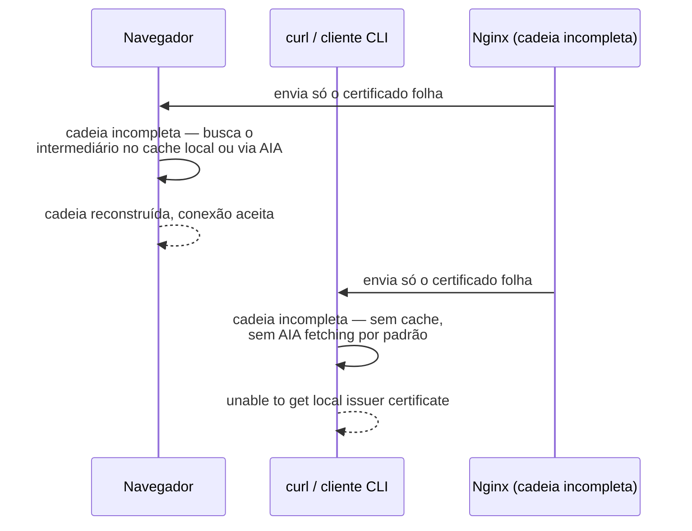
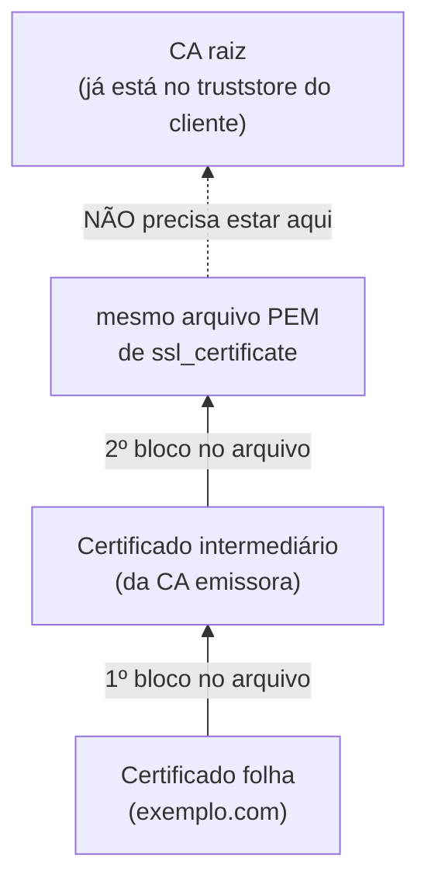
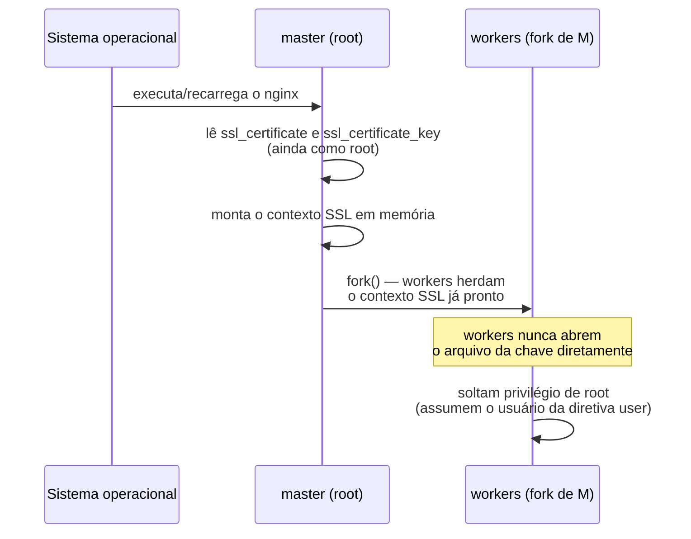
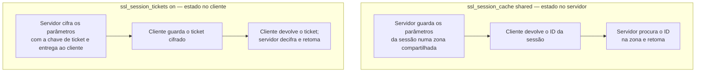
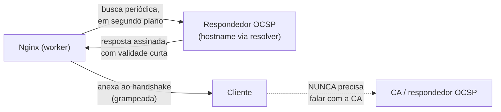
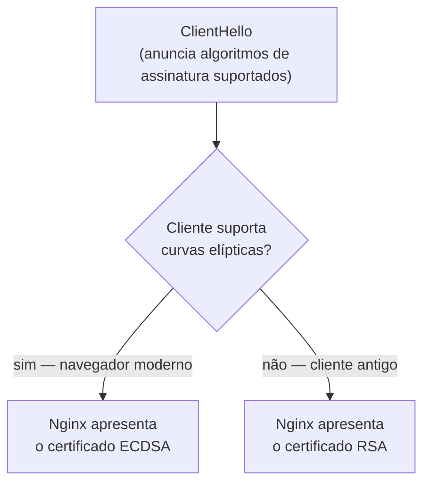

# 09 — TLS no Nginx

> [!abstract] TL;DR
> `ssl_certificate` não aceita só o certificado do servidor — aceita o certificado seguido dos intermediários, nessa ordem, porque é o Nginx quem monta a cadeia que o cliente vai verificar, e um navegador esconde a falta de um elo completando-a sozinho a partir de um cache que `curl` e a maioria dos clientes de linha de comando não têm. Fora esse ponto — o miolo prático desta nota —, o resto é uma lista curta de diretivas com valores padrão específicos e às vezes contraintuitivos: `ssl_session_cache` vem **desligado** (`none`) por padrão enquanto `ssl_session_tickets` vem **ligado**, o que significa que a retomada de sessão de fábrica do Nginx é via ticket, não via cache do servidor; `ssl_stapling` vem desligado; e `ssl_protocols` já exclui TLS 1.0 e 1.1 de fábrica há anos, então a auditoria pedindo para "desligar TLS antigo" costuma estar pedindo algo que a configuração padrão já faz.

Um certificado que abre perfeitamente no Chrome, no Firefox e no Safari, e que falha com `curl: (60) SSL certificate problem: unable to get local issuer certificate` na primeira chamada de um script de integração, é o sintoma mais comum de toda esta nota — e o mais mal diagnosticado. A reação inicial de quem vê esse erro costuma ser desconfiar do certificado em si: será que expirou, será que foi emitido para o domínio errado, será que a CA não é confiável. Nenhuma dessas hipóteses explica o padrão observado, porque o padrão é específico demais para ser coincidência: funciona em todo navegador testado, falha em todo cliente de linha de comando testado, e falha de novo em qualquer app móvel que valide a cadeia manualmente. Esse padrão tem um nome — **cadeia incompleta** — e é uma falha de configuração do lado do servidor, não do lado do cliente que reclama.

A outra porta de entrada para esta nota é uma nota de auditoria de segurança, o tipo de item que aparece com regularidade em relatórios de pentest ou de conformidade: "desligar TLS 1.0 e TLS 1.1 no servidor de borda". Quem recebe esse pedido e vai direto editar `ssl_protocols` sem checar o estado atual às vezes descobre que já não há nada para desligar — a versão do Nginx em produção já assume um padrão que exclui os dois protocolos legados, e o item da auditoria só teria sentido contra uma configuração antiga que sobrescreveu esse padrão de propósito, geralmente por compatibilidade com algum cliente já aposentado. As duas portas de entrada — cadeia incompleta e protocolo legado — cobrem, juntas, a maior parte dos tickets de TLS que chegam a quem opera um Nginx em produção, e é por isso que esta nota organiza o corpo em torno delas.

Vale marcar de saída o que esta nota **não** cobre, porque a tentação de reexplicar é grande e o vault já tem essa teoria em outro lugar, com mais profundidade do que caberia aqui. O handshake TLS 1.3 passo a passo, a cadeia de confiança e o papel da CA raiz, o que forward secrecy significa e por que ECDHE garante, os detalhes de mTLS, o que SNI é e como ele resolve o problema de escolher um certificado antes de existir `Host` — tudo isso está em [[03-Dominios/Ciência/Redes e Protocolos/05 - TLS e HTTPS|TLS e HTTPS]], e a interação específica entre SNI e a escolha de `server` block já foi tratada em [[03-Dominios/Tecnologia/Infraestrutura/Nginx/03 - Como o Nginx escolhe o server block|03 — Como o Nginx escolhe o server block]]. Esta nota trata só do arquivo: quais diretivas existem, o que cada uma faz de concreto na configuração do Nginx, quais valores vêm por padrão, e o que quebra quando alguém copia um bloco de configuração sem entender por que aquele bloco tem aquela forma.

## O sintoma: funciona no navegador, quebra no `curl`

Vale seguir o sintoma até a causa antes de qualquer diretiva, porque é ele que dá sentido a tudo que vem depois. Um navegador moderno, ao montar a cadeia de confiança de um certificado, não depende só do que o servidor lhe envia no handshake — ele mantém um cache próprio de certificados intermediários, populado por visitas anteriores a qualquer site que já tenha apresentado aquele mesmo intermediário, e alguns navegadores complementam esse cache com **AIA fetching** (Authority Information Access), buscando o certificado intermediário faltante direto na URL que o próprio certificado da folha aponta. Um `curl` de linha de comando, uma biblioteca HTTP de uma aplicação móvel, ou um cliente `openssl s_client` chamado sem opções especiais não fazem nada disso: eles verificam a cadeia estritamente com o que o servidor enviou no handshake, mais o que já existe no truststore local do sistema operacional — e o truststore local nunca contém certificados intermediários, só raízes.

O resultado é uma assimetria de diagnóstico traiçoeira: o mesmo servidor, com a mesma configuração incompleta, parece saudável para quem testa no navegador e quebrado para quem testa por script — e a suspeita natural recai sobre o script, não sobre o servidor, porque "funciona no navegador" costuma ser tomado como prova de que o certificado está correto. Não está. O navegador está compensando, silenciosamente, uma falha de configuração que ele não tem obrigação nenhuma de compensar — a RFC que rege TLS não exige esse comportamento de nenhum cliente, é uma conveniência que os navegadores mais populares adicionaram para tolerar servidores mal configurados, e nem todo cliente TLS do mundo faz o mesmo favor.



Diagnosticar isso corretamente exige um cliente que não compense nada, para ver exatamente o que o servidor está de fato enviando. `openssl s_client` com a flag `-showcerts` expõe a cadeia completa que chegou na conexão:

```bash
openssl s_client -connect exemplo.com:443 -servername exemplo.com -showcerts </dev/null 2>/dev/null | grep -E "^(subject|issuer|Verify return code)"
```

`Verify return code: 0 (ok)` confirma cadeia completa; `Verify return code: 21 (unable to verify the first certificate)` é a assinatura inequívoca de intermediário faltando. A próxima seção resolve exatamente esse sintoma, porque a causa é sempre a mesma: o arquivo declarado em `ssl_certificate` não contém o que precisa conter.

## `ssl_certificate` e a ordem da cadeia

A diretiva `ssl_certificate` aponta para um arquivo PEM, e é comum tratá-lo, por analogia com o resto da configuração, como se guardasse "o certificado" no singular. A documentação oficial é explícita quanto a isso: o arquivo deve conter o certificado do servidor seguido dos certificados intermediários, primeiro o principal, depois os intermediários — nessa ordem, concatenados dentro do mesmo arquivo. Não existe uma diretiva separada para "os intermediários"; eles vivem dentro do mesmo PEM que o certificado da folha, um logo depois do outro.

```
-----BEGIN CERTIFICATE-----
(certificado do servidor — exemplo.com)
-----END CERTIFICATE-----
-----BEGIN CERTIFICATE-----
(certificado intermediário — a CA emissora)
-----END CERTIFICATE-----
```

A ordem importa porque o Nginx não reordena nada — ele envia o arquivo como está, na ordem em que os blocos aparecem, e o cliente monta a cadeia lendo essa sequência. Um arquivo com os blocos invertidos, ou faltando o intermediário por inteiro (o caso mais comum: alguém baixa só o certificado principal do painel da CA e esquece de baixar e concatenar o intermediário), produz exatamente o sintoma da seção anterior. A causa raiz mais frequente na prática não é um erro de digitação — é um processo de emissão que entrega dois ou três arquivos separados (`certificate.crt`, `ca_bundle.crt` ou `chain.pem`) e espera que quem instala os concatene manualmente:

```bash
cat exemplo.com.crt intermediate.crt > exemplo.com.fullchain.crt
```

```nginx
server {
    listen 443 ssl;
    server_name exemplo.com;

    ssl_certificate     /etc/nginx/ssl/exemplo.com.fullchain.crt;
    ssl_certificate_key /etc/nginx/ssl/exemplo.com.key;
    # ...
}
```

Vale reter, porque poupa um passo em falso comum, que a CA **raiz** não entra nesse arquivo. O truststore do cliente já a tem; enviá-la no handshake é bytes a mais sem função — o cliente só precisa da folha e dos intermediários para reconstruir a cadeia até uma raiz que ele já confia por conta própria, exatamente como [[03-Dominios/Ciência/Redes e Protocolos/05 - TLS e HTTPS|TLS e HTTPS]] descreve a verificação subindo de baixo para cima. Enviar a raiz também não quebra nada — só desperdiça um handshake ligeiramente maior.



`nginx -t` não detecta cadeia incompleta — a sintaxe do arquivo está perfeitamente correta, é um PEM válido com um único certificado dentro, e a diretiva aceita isso sem reclamar. A validação de sintaxe e a validação de cadeia são checagens de naturezas diferentes: uma confere se o arquivo é um PEM bem formado que a diretiva sabe interpretar; a outra confere se o conjunto de certificados naquele PEM, mais o que o cliente já confia, fecha uma cadeia íntegra — e só a segunda captura o problema desta seção. A ferramenta certa é testar a cadeia de fato, com `openssl s_client -showcerts` como na seção anterior, ou com um verificador de cadeia dedicado depois do deploy — nunca assumir que `nginx -t` limpo significa cadeia correta.

### Contando quantos certificados o servidor de fato enviou

Vale nomear um segundo comando de diagnóstico, complementar ao `Verify return code` da seção anterior, porque ele responde a uma pergunta ligeiramente diferente e mais direta: quantos blocos `BEGIN CERTIFICATE` chegaram na conexão, não se eles fecham uma cadeia válida.

```bash
openssl s_client -connect exemplo.com:443 -servername exemplo.com </dev/null 2>/dev/null \
  | grep -c "BEGIN CERTIFICATE"
```

Um resultado `1` é o sinal mais direto possível de cadeia incompleta antes mesmo de olhar para o `Verify return code`: só a folha chegou, nenhum intermediário. Um resultado `2` ou `3`, combinado com `Verify return code: 0 (ok)`, confirma que a cadeia está completa e fechando corretamente contra o truststore que o `openssl` local já tem. Os dois comandos — contagem de blocos e código de verificação — são baratos o bastante para rodar como checagem automatizada depois de todo deploy que toca certificado, antes de qualquer reclamação de cliente chegar.

## `ssl_certificate_key`, permissões e quem lê a chave primeiro

`ssl_certificate_key` aponta para o arquivo com a chave privada correspondente ao certificado, também em PEM. A própria documentação oficial do Nginx é direta sobre o cuidado que esse arquivo exige: a chave privada é um segredo e deve ficar num arquivo com acesso restrito — e, ao mesmo tempo, precisa ser legível pelo processo **master** do Nginx. As duas exigências parecem em tensão até se lembrar de quem, exatamente, lê esse arquivo e quando.

A nota [[03-Dominios/Tecnologia/Infraestrutura/Nginx/01 - O problema que o Nginx resolve|01 — O problema que o Nginx resolve]] já estabeleceu a sequência: o master sobe como `root`, lê e valida `nginx.conf`, abre os sockets de escuta que exigem porta privilegiada, e só depois gera os workers, que assumem o usuário sem privilégio antes de processar qualquer byte vindo da rede. O carregamento do contexto SSL — ler o certificado, ler a chave privada, montar a estrutura em memória que o handshake vai usar — acontece durante essa mesma fase inicial, com o processo ainda rodando como `root`, antes do `fork()` que gera os workers. Os workers herdam o contexto SSL já montado em memória; eles nunca precisam abrir o arquivo da chave diretamente no disco. É a mesma lógica de privilégio que abre a porta 443 aplicada a um segundo recurso sensível: o processo com privilégio faz a leitura crítica uma única vez, cedo, e os processos sem privilégio que vêm depois herdam o resultado já pronto, sem nunca precisar do acesso original.

Essa mecânica é o motivo prático de a chave poder — e dever — ter permissões bem mais restritivas do que o certificado público, geralmente `600` e dono `root`, sem leitura para o grupo nem para outros usuários do sistema: nenhum worker, rodando sob um usuário sem privilégio, jamais precisa ler aquele arquivo por conta própria. Restringir demais a permissão da chave não quebra o carregamento — é o master, ainda como `root`, quem lê; restringir de menos é o erro real, porque deixa o segredo legível por qualquer processo do sistema que rode sob o mesmo usuário do worker, sem ganho nenhum de funcionalidade em troca.

```nginx
# no filesystem, antes de qualquer diretiva:
# chown root:root /etc/nginx/ssl/exemplo.com.key
# chmod 600       /etc/nginx/ssl/exemplo.com.key

server {
    listen 443 ssl;
    server_name exemplo.com;

    ssl_certificate     /etc/nginx/ssl/exemplo.com.fullchain.crt;
    ssl_certificate_key /etc/nginx/ssl/exemplo.com.key;
}
```

Vale fechar esta seção com a consequência que ela tem sobre reload: como a leitura da chave acontece na fase de carregamento de configuração do master, um `nginx -s reload` (o sinal `HUP` descrito na nota 01) relê certificado e chave do zero, aplicando qualquer troca de arquivo imediatamente aos workers novos que sobem em seguida — sem precisar reiniciar o processo master nem derrubar conexões em andamento nos workers antigos, que continuam servindo o certificado anterior até drenar.



## Retomada de sessão: cache, tickets e o trade-off de forward secrecy

Repetir o handshake completo a cada conexão nova é caro — [[03-Dominios/Ciência/Redes e Protocolos/05 - TLS e HTTPS|TLS e HTTPS]] já explica por que a retomada de sessão existe e o que ela evita repetir. O que essa nota trata é a configuração concreta de duas mecânicas independentes que o Nginx oferece para isso, e um detalhe de valor padrão que costuma surpreender quem nunca abriu a documentação: **por padrão, o cache de sessão do servidor está desligado.**

```nginx
ssl_session_cache   none;    # padrão — nenhum estado de sessão fica guardado no servidor
ssl_session_tickets on;      # padrão — retomada via ticket segue ligada mesmo assim
ssl_session_timeout 5m;      # padrão
```

`ssl_session_cache none` não significa "sem retomada de sessão alguma" — significa que o Nginx não mantém, do lado do servidor, nenhum armazenamento indexado por ID de sessão: ele aceita a possibilidade de reuso quando o cliente pede, mas não guarda parâmetro nenhum para tornar esse reuso possível por esse mecanismo específico. Quem quer de fato ativar cache de sessão do lado do servidor precisa declarar `shared:`, com um nome arbitrário e um tamanho em bytes — a documentação estima cerca de 4000 sessões por megabyte de zona:

```nginx
ssl_session_cache   shared:SSL:10m;   # ~40 mil sessões cabendo na zona
ssl_session_timeout 10m;
```

O parâmetro `shared` é o que importa em qualquer instalação com mais de um worker: uma zona `shared` fica em memória compartilhada entre todos os workers, então uma sessão negociada por um worker pode ser retomada por outro, o que o cache `builtin` — usado por um único worker, sujeito a fragmentação de memória segundo a própria documentação — não garante. `off` é uma terceira opção, mais estrita que `none`: proíbe reuso de sessão de forma explícita, informando ao cliente que aquela sessão não pode ser reaproveitada de jeito nenhum.



Os dois mecanismos não são mutuamente exclusivos — um cliente pode oferecer os dois métodos na mesma ClientHello, e o Nginx escolhe qual usar conforme o que estiver configurado e o que o cliente já possuir de uma conexão anterior. Enquanto isso, `ssl_session_tickets on` — o padrão, sem precisar de nenhuma configuração adicional — já habilita retomada por **ticket** (RFC 5077), o mecanismo em que o servidor cifra o próprio estado da sessão com uma chave que só ele conhece e entrega esse blob cifrado ao cliente; o cliente guarda o ticket, o servidor não guarda nada indexado por ID. Isso explica a combinação padrão do Nginx, à primeira vista contraditória: `ssl_session_cache none` mais `ssl_session_tickets on` significa **retomada de sessão de fábrica é via ticket, não via cache do servidor** — o servidor continua sem estado de sessão indexado, e ainda assim consegue retomar conexões, porque quem carrega o estado é o cliente, dentro do ticket.

A chave que cifra esses tickets tem seu próprio ciclo de vida, controlável por `ssl_session_ticket_key`. Sem essa diretiva declarada — o caso padrão — a documentação afirma que uma chave é gerada aleatoriamente; a mesma documentação nota que a diretiva só é necessária quando a mesma chave de ticket precisa ser compartilhada entre múltiplos servidores, o cenário típico de um pool atrás de um balanceador de carga em que o ticket emitido por um nó precisa ser decifrável por outro. É aqui que mora o trade-off de forward secrecy que vale nomear com cuidado: a chave de ticket não é a chave efêmera de sessão descrita em [[03-Dominios/Ciência/Redes e Protocolos/05 - TLS e HTTPS|TLS e HTTPS]] — é uma chave separada, de vida mais longa, cuja única função é cifrar e decifrar tickets contendo o segredo da sessão. Quanto mais tempo essa chave de ticket vive sem rotação, maior a janela em que comprometê-la permite decifrar tickets capturados e, por meio deles, recuperar segredos de sessões antigas — exatamente o cenário que forward secrecy existe para fechar em outra camada do protocolo. Desde a versão 1.23.2, quando se usa `ssl_session_cache shared:`, o próprio Nginx passa a gerar, armazenar e rotacionar essas chaves de ticket automaticamente entre os workers que compartilham a zona, a menos que `ssl_session_ticket_key` seja configurado explicitamente — o que reduz essa janela sem exigir nenhuma automação externa. Quem gerencia a chave de ticket manualmente, via arquivo, é quem assume a responsabilidade de rotacioná-la, com o padrão de duas chaves (atual e anterior) que a própria diretiva suporta para rotação sem invalidar tickets em trânsito:

```nginx
ssl_session_ticket_key /etc/nginx/ssl/ticket-current.key;
ssl_session_ticket_key /etc/nginx/ssl/ticket-previous.key;
```

> [!info] Baseline de versão
> Os valores padrão desta seção — `ssl_session_cache none`, `ssl_session_tickets on`, `ssl_session_timeout 5m` — e a rotação automática de chave de ticket sob `shared:` desde a versão 1.23.2 refletem a documentação oficial vigente para as linhas mainline 1.31.3 (15 jul 2026) e stable 1.30.4.

## OCSP stapling

A revogação de certificados — por que é o elo mais frágil de toda a PKI, e por que CRL e OCSP puro têm cada um o seu defeito estrutural — já está desenvolvida em [[03-Dominios/Ciência/Redes e Protocolos/05 - TLS e HTTPS|TLS e HTTPS]]. O que falta ali é a configuração concreta de OCSP stapling no Nginx, e é isso que esta seção resolve: em vez de o cliente perguntar diretamente à CA se o certificado ainda é válido — vazando ao respondedor OCSP qual site está sendo visitado, e pagando uma latência extra por conexão —, o próprio Nginx busca essa prova periodicamente e a anexa ("grampeia") na resposta do handshake, poupando o cliente de qualquer consulta externa.

```nginx
server {
    listen 443 ssl;
    server_name exemplo.com;

    ssl_certificate       /etc/nginx/ssl/exemplo.com.fullchain.crt;
    ssl_certificate_key   /etc/nginx/ssl/exemplo.com.key;

    ssl_stapling          on;    # padrão: off
    ssl_stapling_verify   on;    # padrão: off

    ssl_trusted_certificate /etc/nginx/ssl/intermediate.crt;
    resolver               1.1.1.1 8.8.8.8 valid=300s;
}
```

Quatro diretivas cooperam, e todas têm o mesmo motivo de existir separado: `ssl_stapling on` liga o mecanismo, mas depende de o Nginx conhecer o certificado do emissor para consultar o respondedor OCSP certo — se `ssl_certificate` já contém os intermediários, como a seção sobre a cadeia recomendou, o Nginx normalmente já consegue extrair o emissor dali; a documentação oficial recomenda declarar `ssl_trusted_certificate` para esse fim quando for preciso ser explícito ou quando a cadeia enviada ao cliente não deva incluir tudo que o Nginx precisa para validar. `ssl_stapling_verify on` vai além: verifica a própria resposta OCSP obtida, o que exige que a cadeia completa — emissor, intermediários, raiz — esteja disponível via `ssl_trusted_certificate` para essa verificação funcionar. E `resolver` é obrigatório para stapling: o Nginx precisa resolver o hostname do respondedor OCSP (informação que vem do próprio certificado, na extensão *Authority Information Access*) via DNS, e sem um `resolver` configurado no bloco, essa resolução simplesmente não tem como acontecer.

Vale registrar o comportamento em caso de falha, porque muda a postura de risco: se a busca da resposta OCSP falhar — respondedor fora do ar, timeout de rede —, o Nginx não bloqueia o handshake esperando por ela; ele segue sem anexar a prova, e o cliente reage a essa ausência do jeito que a própria implementação dele decidir, tipicamente o mesmo soft-fail já descrito em [[03-Dominios/Ciência/Redes e Protocolos/05 - TLS e HTTPS|TLS e HTTPS]]. Stapling reduz a dependência de disponibilidade da CA no caminho crítico de cada conexão de cliente — o Nginx busca a prova em segundo plano, com cache, e serve o cache mesmo se a busca mais recente falhar —, mas não elimina por completo a possibilidade de servir sem a prova anexada numa janela de indisponibilidade do respondedor.



Confirmar que o grampeamento está de fato funcionando, e não só configurado, exige olhar a conexão de fora:

```bash
openssl s_client -connect exemplo.com:443 -servername exemplo.com -status </dev/null 2>/dev/null | grep -A 5 "OCSP Response Status"
```

`OCSP Response Status: successful` confirma que uma resposta chegou grampeada na conexão; a ausência completa dessa seção na saída — nenhum bloco `OCSP Response`, nem sucesso nem erro — é o sintoma da armadilha descrita ao final desta nota: `ssl_stapling on` declarado, mas sem `resolver` ou sem visibilidade do emissor para de fato buscar a prova.

## `ssl_protocols` e `ssl_ciphers` na prática

`ssl_protocols` e `ssl_ciphers` são as duas diretivas mais copiadas de gerador de configuração da internet, e as duas mais provavelmente copiadas de forma desatualizada. O padrão documentado atual — `ssl_protocols TLSv1.2 TLSv1.3;` — já exclui SSLv3, TLS 1.0 e TLS 1.1 sem que ninguém precise escrever nada: é exatamente o item que uma auditoria de segurança tipicamente pede para "corrigir", e em qualquer instalação recente, sem override manual herdado de configuração antiga, já não há nada para corrigir.

```nginx
ssl_protocols TLSv1.2 TLSv1.3;   # padrão — nada a declarar se este é o objetivo
```

Restringir ainda mais, para `TLSv1.3` sozinho, é possível e reduz a superfície de negociação ao mínimo — mas tem um custo real: qualquer cliente, biblioteca ou dispositivo que ainda não suporte TLS 1.3 perde a conexão por completo, sem fallback. A decisão de restringir depende de quem são os clientes reais daquele serviço, não de uma régua de segurança abstrata — um serviço interno entre microsserviços sob controle total pode restringir sem custo; uma API pública consumida por dispositivos de terceiros com ciclo de atualização lento paga esse custo de compatibilidade a cada cliente ainda preso a versões antigas.

`ssl_ciphers` tem o padrão `HIGH:!aNULL:!MD5` — uma notação de filtro do OpenSSL, não uma lista explícita: `HIGH` seleciona cifras consideradas fortes pela biblioteca instalada naquele momento, `!aNULL` exclui cifras sem autenticação, `!MD5` exclui o hash MD5. É uma diretiva de filtro relativo ao que o OpenSSL da máquina considera "forte" agora, não uma enumeração fixa — o que significa que o mesmo `ssl_ciphers HIGH:!aNULL:!MD5;` pode resultar em conjuntos de cifras negociáveis diferentes em duas máquinas com versões de OpenSSL diferentes.

> [!warning] Copiar uma lista de cifras fixa de um gerador da internet envelhece mal
> Listas de cifras copiadas literalmente — o tipo de string longa com dezenas de nomes de algoritmo separados por dois-pontos, geradas por ferramentas de terceiros num dado momento — capturam o que era considerado seguro **naquela data**, e nunca mais são revisadas depois de coladas na configuração. Uma cifra que era aceitável há alguns anos pode ser depreciada por pesquisa criptográfica nova sem que ninguém volte a essa configuração para removê-la, porque ela não está mais olhando para o padrão vivo da distribuição, está fixada num instantâneo do passado. Preferir os filtros relativos do OpenSSL (`HIGH`, `!aNULL`) sobre listas fixas transfere a responsabilidade de acompanhar o estado da arte para quem mantém a biblioteca — que é atualizada por patch de sistema operacional, não por revisão manual de configuração.

Em TLS 1.3, boa parte dessa preocupação perde relevância porque o próprio protocolo já reduziu o cardápio de cifras negociáveis a um punhado de opções seguras por construção, sem os modos legados que existiam em TLS 1.2 — o mesmo argumento de "menos botões para configurar errado" que [[03-Dominios/Ciência/Redes e Protocolos/05 - TLS e HTTPS|TLS e HTTPS]] já registra sobre o design do 1.3. `ssl_prefer_server_ciphers`, cujo padrão é `off`, decide quem tem a palavra final na escolha entre as cifras que ambos os lados suportam — cliente ou servidor —; em TLS 1.3 a negociação de cifra é mais restrita e essa diretiva perde parte do peso que tinha sob TLS 1.2, onde um servidor podia forçar uma cifra mais forte mesmo que o cliente tivesse ordenado a lista dele de outro jeito.

## Múltiplos certificados no mesmo `server` (RSA e ECDSA)

Desde a versão 1.11.0, a diretiva `ssl_certificate` pode ser declarada mais de uma vez dentro do mesmo `server` block, cada uma acompanhada do seu próprio `ssl_certificate_key`, para servir tipos diferentes de certificado — tipicamente RSA e ECDSA — para o mesmo domínio:

```nginx
server {
    listen              443 ssl;
    server_name         exemplo.com;

    ssl_certificate      /etc/nginx/ssl/exemplo.com.rsa.fullchain.crt;
    ssl_certificate_key  /etc/nginx/ssl/exemplo.com.rsa.key;

    ssl_certificate      /etc/nginx/ssl/exemplo.com.ecdsa.fullchain.crt;
    ssl_certificate_key  /etc/nginx/ssl/exemplo.com.ecdsa.key;
}
```

O Nginx escolhe, durante o handshake, qual dos dois apresentar, com base nos algoritmos que o cliente anunciou suportar na ClientHello — um navegador moderno recebe o certificado ECDSA, menor e mais barato de processar por chave equivalente; um cliente antigo sem suporte a curvas elípticas recebe o RSA, sem que a configuração precise escolher um dos dois às custas do outro. A documentação nota que suportar cadeias de certificado separadas para cada tipo depende de OpenSSL 1.0.2 ou superior — uma condição de ambiente, não de versão do Nginx em si, relevante para quem roda uma distribuição com OpenSSL mais antigo vinculado.



Vale reter o motivo prático de manter os dois em vez de migrar totalmente para ECDSA: a troca é sobre performance e compatibilidade simultânea, não sobre segurança relativa entre os dois algoritmos — ECDSA com curva P-256 é considerado, na prática corrente, equivalente em força a RSA de 3072 bits, com assinaturas e handshakes mais baratos de processar; manter RSA ao lado serve só para não excluir a fração de clientes ainda sem suporte a curvas elípticas, sem forçar o restante do tráfego a pagar o custo do algoritmo mais caro.

## HTTP/2 e HTTP/3

A diretiva `http2` própria — separada do parâmetro `http2` que antes vinha dentro de `listen` — está disponível desde a versão 1.25.1, com padrão `off`; é ela, não mais o parâmetro dentro de `listen`, quem liga o protocolo:

```nginx
server {
    listen               443 ssl;
    http2                on;

    ssl_certificate      /etc/nginx/ssl/exemplo.com.fullchain.crt;
    ssl_certificate_key  /etc/nginx/ssl/exemplo.com.key;
}
```

HTTP/2 sobre TLS depende de ALPN — a extensão que negocia, dentro do próprio handshake, qual protocolo de aplicação vai rodar por cima do túnel cifrado —, disponível desde OpenSSL 1.0.2; sem suporte a ALPN na biblioteca vinculada, a negociação simplesmente não acontece e a conexão cai para HTTP/1.1.

HTTP/3 e QUIC são entregues por um módulo à parte, `ngx_http_v3_module`, disponível desde a versão 1.25.0 e explicitamente marcado como **experimental** pela documentação oficial — não é compilado por padrão, exige `--with-http_v3_module` no `configure` do binário. A diretiva que liga o protocolo é `http3`, com padrão `on` uma vez que o módulo está presente e o `listen` correspondente existe; o `listen` de QUIC usa o parâmetro `quic`, tipicamente acompanhado de `reuseport`, porque QUIC roda sobre UDP e não sobre TCP:

```nginx
server {
    listen 443 quic reuseport;
    listen 443 ssl;
    http2  on;

    ssl_certificate      /etc/nginx/ssl/exemplo.com.fullchain.crt;
    ssl_certificate_key  /etc/nginx/ssl/exemplo.com.key;

    add_header Alt-Svc 'h3=":443"; ma=86400';
}
```

Repare na estrutura: dois `listen` na mesma porta, um para QUIC (UDP) e outro para TLS clássico sobre TCP, coexistindo no mesmo `server` block — um cliente sem suporte a HTTP/3 simplesmente nunca abre a conexão UDP e cai no caminho TCP de sempre. O header `Alt-Svc` é quem anuncia ao cliente, numa resposta HTTP comum, que aquele mesmo host também atende HTTP/3 na mesma porta — sem esse anúncio, um cliente que já suporta HTTP/3 não tem como descobrir a oferta sozinho na primeira visita.

A documentação oficial também condiciona parte do suporte a biblioteca TLS: OpenSSL 1.1.1 ou superior cobre o básico, mas a funcionalidade de dados iniciais 0-RTT — o mesmo mecanismo de reconexão adiantada descrito em [[03-Dominios/Ciência/Redes e Protocolos/05 - TLS e HTTPS|TLS e HTTPS]], aqui aplicado sobre QUIC — exige OpenSSL 3.5.1 ou superior, ou alternativas como BoringSSL, LibreSSL ou QuicTLS; versões de OpenSSL mais antigas simplesmente não oferecem 0-RTT sob HTTP/3, independentemente de qualquer diretiva de configuração.

> [!info] HTTP/3 é experimental na doc oficial
> A própria página do módulo `ngx_http_v3_module` classifica o suporte a HTTP/3 e QUIC como experimental. Isso não impede uso em produção — várias operações de grande escala já rodam HTTP/3 —, mas é uma sinalização explícita da documentação de que a superfície ainda pode mudar entre versões, algo que pesa mais em ambientes conservadores de mudança do que num serviço interno de baixo risco.

Confirmar qual protocolo uma conexão de fato negociou, do lado do cliente, evita depender só da presença do header `Alt-Svc` na resposta — ele anuncia a oferta, não prova que uma requisição específica de fato usou HTTP/3:

```bash
curl -Iso /dev/null -w "%{http_version}\n" --http2 https://exemplo.com/
curl -Iso /dev/null -w "%{http_version}\n" --http3 https://exemplo.com/
```

Do lado do servidor, a variável embutida `$http3` — vazia para conexões que não negociaram HTTP/3, `h3` quando negociaram — é o que um bloco de log customizado usa para medir, ao longo do tempo, que fração do tráfego real já está chegando por QUIC em vez de cair para o caminho TCP de sempre.

## O redirect de HTTP para HTTPS feito certo

Todo domínio servido por HTTPS costuma precisar de um segundo `server` block, escutando na porta 80, cuja única função é redirecionar para a versão cifrada. A forma correta é curta e não tem segredo escondido:

```nginx
server {
    listen      80;
    listen      [::]:80;
    server_name exemplo.com;

    return 301 https://$host$request_uri;
}
```

`return` encerra o processamento ali, sem passar pelas fases de reescrita nem avaliar `location` algum além do que já casou — é uma resposta direta, barata de processar, sem efeito colateral fora do redirecionamento em si. A alternativa que aparece com frequência em configuração copiada — um `rewrite ^ https://$host$request_uri? permanent;`, ou pior, um bloco `if ($scheme != "https") { ... }` envolvendo a lógica de redirecionamento — é estritamente pior para esse propósito específico: `rewrite` participa da fase de reescrita de URI, que pode rodar mais de uma vez por request e interagir com outras diretivas de reescrita no mesmo bloco de forma difícil de prever; `if` dentro de um contexto `location`, fora dos poucos usos considerados seguros pela própria documentação do Nginx, tem um histórico documentado de comportamento inesperado justamente por não ser uma estrutura de controle real do bloco `server`/`location`, mas um artefato do módulo de reescrita reaproveitado para parecer uma. Um `return` simples não tem nenhuma dessas ambiguidades: é a resposta mais direta para o problema mais simples desta seção.

Vale reter, também, que HSTS — o header que instrui o navegador a nunca mais tentar `http://` para aquele domínio, fechando a janela de SSL stripping já descrita em [[03-Dominios/Ciência/Redes e Protocolos/05 - TLS e HTTPS|TLS e HTTPS]] — só faz sentido dentro do `server` block HTTPS, nunca no bloco de redirect em texto puro; mandar `Strict-Transport-Security` por uma resposta HTTP não cifrada é inútil, porque o canal que deveria estar protegendo já está exposto no momento em que o header seria enviado.

## Certificado automatizado: o que muda na configuração do Nginx

Emissão automatizada via ACME — o protocolo por trás da Let's Encrypt e de praticamente todo emissor moderno gratuito — tem, do lado do Nginx, um único ponto de contato obrigatório quando o desafio escolhido é HTTP-01: o cliente ACME precisa provar posse do domínio respondendo, em texto puro na porta 80, a uma requisição para um caminho específico, `/.well-known/acme-challenge/<token>`. O Nginx só precisa de um `location` dedicado, servindo o diretório onde o agente ACME grava o arquivo de desafio:

```nginx
server {
    listen      80;
    server_name exemplo.com;

    location /.well-known/acme-challenge/ {
        root /var/www/acme-challenge;
    }

    location / {
        return 301 https://$host$request_uri;
    }
}
```

A ordem dos dois `location` importa por causa da tabela de precedência já descrita em [[03-Dominios/Tecnologia/Infraestrutura/Nginx/03 - Como o Nginx escolhe o server block|03 — Como o Nginx escolhe o server block]] (que trata `server`, não `location`, mas a lógica geral de "mais específico vence" se aplica igual): o prefixo `/.well-known/acme-challenge/` precisa continuar acessível em texto puro mesmo com um redirect geral para HTTPS no mesmo bloco, porque o validador ACME do lado da CA bate diretamente na porta 80 em HTTP puro para checar o desafio, não segue redirect para HTTPS antes de validar. Um redirect capturando esse caminho antes do `location` específico entrar em jogo quebra a emissão silenciosamente, com um erro de validação do lado do cliente ACME que não aponta de volta para essa causa de forma óbvia.

Vale marcar a fronteira desta seção com clareza: o fluxo completo de obter, instalar e renovar automaticamente um certificado via `certbot` ou qualquer outro cliente ACME é operação, não configuração de Nginx — envolve escolher um cliente, agendar renovação, decidir entre desafio HTTP-01 e DNS-01, e tratar o `reload` do Nginx depois de cada renovação. Nada disso é assunto desta nota; o que importa reter aqui é só a peça estática de configuração que o Nginx precisa ter no lugar para que qualquer cliente ACME funcione: o `location` do desafio, acessível antes de qualquer redirect.

## Exemplo trabalhado: um `server` block completo

Vale fechar o corpo técnico juntando, num único bloco comentado, todas as diretivas que as seções anteriores trataram isoladamente — a forma como elas de fato convivem num `nginx.conf` de produção, não uma lista solta de exemplos:

```nginx
# porta 80 — só existe para o desafio ACME e o redirect
server {
    listen      80;
    listen      [::]:80;
    server_name exemplo.com;

    location /.well-known/acme-challenge/ {
        root /var/www/acme-challenge;
    }

    location / {
        return 301 https://$host$request_uri;
    }
}

# porta 443 — o server block que esta nota inteira descreve
server {
    listen 443 ssl reuseport;
    listen [::]:443 ssl reuseport;
    http2  on;
    server_name exemplo.com;

    # cadeia completa: folha + intermediários, nessa ordem
    ssl_certificate      /etc/nginx/ssl/exemplo.com.ecdsa.fullchain.crt;
    ssl_certificate_key  /etc/nginx/ssl/exemplo.com.ecdsa.key;
    ssl_certificate      /etc/nginx/ssl/exemplo.com.rsa.fullchain.crt;
    ssl_certificate_key  /etc/nginx/ssl/exemplo.com.rsa.key;

    # retomada de sessão via cache compartilhado entre workers
    ssl_session_cache    shared:SSL:10m;
    ssl_session_timeout  10m;
    ssl_session_tickets  on;

    # grampeamento OCSP
    ssl_stapling         on;
    ssl_stapling_verify  on;
    ssl_trusted_certificate /etc/nginx/ssl/intermediate.crt;
    resolver              1.1.1.1 8.8.8.8 valid=300s;

    # protocolos e cifras — os padrões documentados, declarados
    # explicitamente para deixar a intenção visível a quem ler depois
    ssl_protocols         TLSv1.2 TLSv1.3;
    ssl_ciphers           HIGH:!aNULL:!MD5;

    add_header Strict-Transport-Security "max-age=31536000" always;

    location / {
        proxy_pass http://app_upstream;
    }
}
```

Repare no que essa configuração deliberadamente **não** faz: não restringe `ssl_protocols` a só TLS 1.3, porque nada na descrição do serviço justificou pagar o custo de compatibilidade da seção anterior; não sobrescreve `ssl_ciphers` com uma lista fixa, preferindo o filtro relativo do OpenSSL; e mantém os dois certificados, RSA e ECDSA, porque a decisão de servir os dois é sobre alcance de cliente, não sobre insegurança de um em relação ao outro. Cada diretiva presente responde a uma pergunta concreta que uma das seções anteriores já formulou — nenhuma está ali por hábito de copiar bloco alheio.

## Armadilhas comuns

> [!warning] Enviar só o certificado da folha e confiar que o navegador "resolve"
> **O que acontece:** o site funciona perfeitamente em todo teste feito por navegador, e falha com erro de cadeia em `curl`, em bibliotecas HTTP de aplicações móveis, e em qualquer verificador de certificado que não faça reconstrução automática de cadeia. **Por quê:** navegadores completam cadeias incompletas a partir de cache local ou AIA fetching; a maioria dos outros clientes TLS verifica estritamente o que o servidor enviou no handshake, sem nenhuma compensação. **Como evitar:** concatenar o certificado do servidor com os intermediários, nessa ordem, no mesmo arquivo de `ssl_certificate`, e validar com `openssl s_client -showcerts` (procurando `Verify return code: 0`), nunca só testando no navegador.

> [!warning] Assumir que `nginx -t` valida a cadeia de certificados
> **O que acontece:** um deploy com cadeia incompleta passa em `nginx -t` sem nenhum aviso, e o problema só aparece depois, em produção, através de reclamações de clientes de API ou de apps móveis. **Por quê:** `nginx -t` valida sintaxe e semântica estrutural da configuração — um PEM bem formado com um único certificado dentro é sintaticamente válido, mesmo estando incompleto como cadeia de confiança. **Como evitar:** depois de todo `nginx -t` limpo em mudança envolvendo TLS, testar a cadeia de fato com `openssl s_client -showcerts`, nunca tratar a validação de sintaxe como prova de cadeia correta.

> [!warning] Ligar `ssl_stapling on` sem `resolver` e sem `ssl_trusted_certificate`
> **O que acontece:** o stapling parece configurado — a diretiva está `on` — mas o Nginx nunca consegue buscar a resposta OCSP, silenciosamente, e nenhuma prova é de fato anexada ao handshake. **Por quê:** `ssl_stapling` sozinho não tem como resolver o hostname do respondedor OCSP nem, dependendo da configuração da cadeia, identificar com segurança o certificado do emissor para a consulta. **Como evitar:** declarar `resolver` com um servidor DNS acessível e `ssl_trusted_certificate` apontando para a cadeia de emissão, e confirmar com `openssl s_client -status` que uma resposta OCSP grampeada está de fato chegando na conexão.

> [!warning] Copiar uma string de `ssl_ciphers` fixa de um artigo antigo
> **O que acontece:** a configuração declara uma lista longa, explícita, de nomes de cifra copiada de um artigo ou gerador de alguns anos atrás, e ninguém revisa essa lista de novo depois disso. **Por quê:** uma lista fixa congela o entendimento de "seguro" do momento em que foi gerada; o padrão relativo do OpenSSL (`HIGH:!aNULL:!MD5`) acompanha as atualizações da biblioteca do sistema operacional, uma lista fixa não acompanha nada. **Como evitar:** preferir o padrão do Nginx ou filtros relativos do OpenSSL a listas fixas, e, se uma lista explícita for de fato necessária por algum requisito de compatibilidade específico, documentar a data e a fonte, tratando-a como algo a revisar periodicamente, não como configuração definitiva.

> [!warning] Usar `rewrite` ou `if` para o redirect HTTP → HTTPS
> **O que acontece:** o redirect funciona na maioria dos testes manuais, mas se comporta de forma inconsistente assim que outra diretiva de reescrita, ou outro `location`, entra no mesmo bloco — laços de redirect intermitentes, ou `query string` perdida em alguns casos e preservada em outros. **Por quê:** `rewrite` participa da fase de reescrita de URI, que pode rodar mais de uma vez e interagir com outras reescritas do mesmo contexto; `if` fora dos usos considerados seguros pela documentação oficial não é uma estrutura de controle confiável dentro de `location`. **Como evitar:** usar `return 301 https://$host$request_uri;` num `server` block dedicado à porta 80, sem `rewrite` nem `if` envolvidos na lógica do redirect.

## Como explicar em inglês

> "The certificate file needs the server cert followed by the intermediates, in that order — browsers silently complete an incomplete chain from their own cache, but curl and most CLI clients don't, which is why the classic symptom is 'works in the browser, fails in curl.' Session cache is off by default in nginx — ssl_session_cache none — while session tickets are on by default, so out of the box, session resumption happens via ticket, not via a server-side cache. OCSP stapling needs a resolver directive to work, because nginx has to look up the OCSP responder's hostname itself. And multiple ssl_certificate directives in the same server block let you serve both an RSA and an ECDSA certificate for the same domain, with nginx picking based on what the client's ClientHello advertises."

| PT | EN |
|---|---|
| cadeia incompleta | incomplete chain |
| certificado intermediário | intermediate certificate |
| chave privada | private key |
| retomada de sessão | session resumption |
| ticket de sessão | session ticket |
| grampeamento OCSP | OCSP stapling |
| respondedor OCSP | OCSP responder |
| conjunto de cifras | cipher suite |
| redirecionamento permanente | permanent redirect |
| desafio de validação de domínio | domain validation challenge |

## O que vem a seguir

Uma vez que o certificado está servido corretamente — cadeia completa, chave protegida, sessão retomando do jeito esperado, protocolos e cifras num padrão que não vai envelhecer mal —, a próxima pergunta é o que o Nginx faz com as respostas que ele já processou: guardá-las, e servi-las de novo sem tocar o backend. É aí que mora o próximo galho da trilha Adepto.

- [[03-Dominios/Tecnologia/Infraestrutura/Nginx/10 - Cache no Nginx|10 — Cache no Nginx]] — zonas e chave de cache, o vazamento entre usuários que a chave default pode causar, e como o Nginx desobedece o backend quando configurado para isso.
- [[03-Dominios/Tecnologia/Infraestrutura/Nginx/07 - Proxy reverso|07 — Proxy reverso]] — para quem chegou aqui atrás de TLS terminando na borda antes de um proxy reverso para o backend.
- [[03-Dominios/Tecnologia/Infraestrutura/Nginx/13 - Tuning e diagnóstico|13 — Tuning e diagnóstico]] — onde ficam os catálogos de erro (502, 504, 499) que surgem depois que TLS já terminou e o problema passou a ser outra camada.
- [[03-Dominios/Engenharia/Operação/3 - Rodar em produção/05 - Rede e borda em produção|Rede e borda em produção]] — o que muda na operação de certificados quando a borda é produção de verdade: renovação automatizada monitorada, rotação de chave, e o que fazer quando o certificado expira sem aviso.

## Fontes

- **Nginx Docs** — [*Module ngx_http_ssl_module*](https://nginx.org/en/docs/http/ngx_http_ssl_module.html) — a referência de todas as diretivas `ssl_*` usadas nesta nota: `ssl_certificate`, `ssl_certificate_key`, `ssl_session_cache`, `ssl_session_tickets`, `ssl_session_ticket_key`, `ssl_stapling`, `ssl_stapling_verify`, `ssl_trusted_certificate`, `ssl_protocols`, `ssl_ciphers`, `ssl_prefer_server_ciphers`, e o suporte a múltiplos certificados desde a versão 1.11.0.
- **Nginx Docs** — [*Configuring HTTPS servers*](https://nginx.org/en/docs/http/configuring_https_servers.html) — a explicação oficial sobre SNI resolvendo o problema de vários HTTPS num só IP, e a exigência de que a chave privada seja legível pelo processo master.
- **Nginx Docs** — [*Module ngx_http_v2_module*](https://nginx.org/en/docs/http/ngx_http_v2_module.html) — a diretiva `http2` própria, disponível desde a 1.25.1, e a dependência de ALPN.
- **Nginx Docs** — [*Module ngx_http_v3_module*](https://nginx.org/en/docs/http/ngx_http_v3_module.html) — HTTP/3 e QUIC, disponíveis desde a 1.25.0, marcados como experimentais, os requisitos de build e de versão de OpenSSL.
- **Nginx Docs** — [*Module ngx_http_core_module*](https://nginx.org/en/docs/http/ngx_http_core_module.html) — a diretiva `listen` com os parâmetros `ssl`, `quic` e `reuseport` usados nos exemplos desta nota.
- **Nginx Docs** — [*How nginx processes a request*](https://nginx.org/en/docs/http/request_processing.html) — o comportamento de `if` fora dos usos seguros dentro de `location`, referenciado na seção sobre o redirect HTTP → HTTPS.
- **Let's Encrypt** — [*Challenge Types*](https://letsencrypt.org/docs/challenge-types/) — a definição do desafio HTTP-01 e o caminho `/.well-known/acme-challenge/` que a configuração do Nginx precisa expor.
