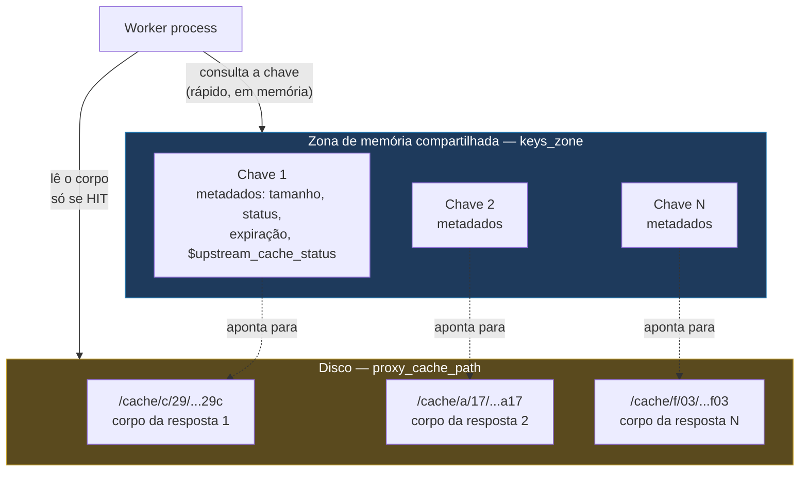
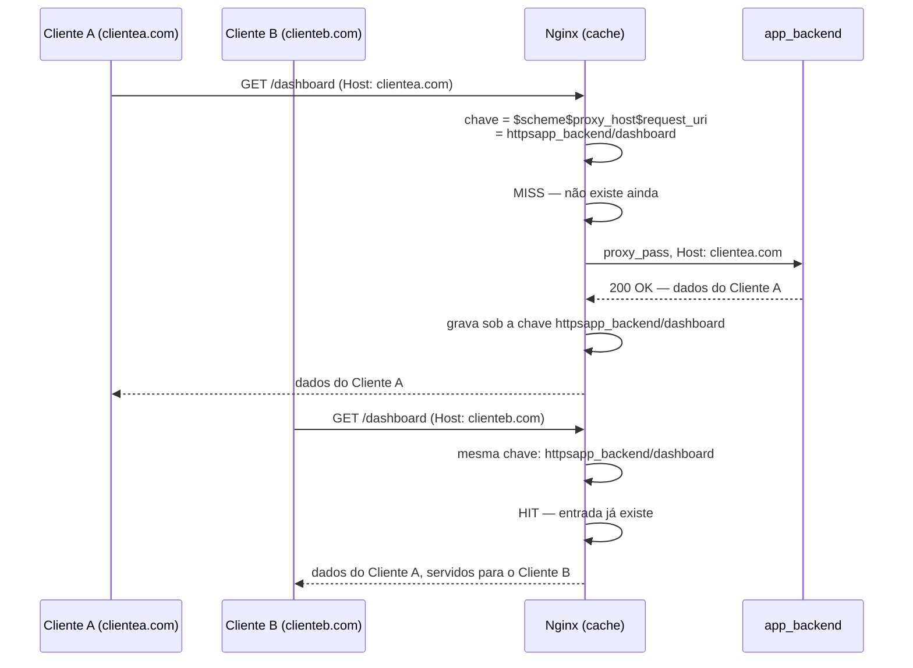
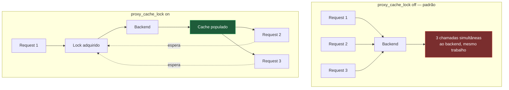

# 10 — Cache no Nginx

> [!abstract] TL;DR
> O cache de proxy do Nginx guarda respostas de um upstream para servir de novo sem tocar o backend, e a diretiva que decide o que conta como "a mesma resposta" é `proxy_cache_key`, cujo padrão oficial é `$scheme$proxy_host$request_uri` — repare no `$proxy_host`, o host do **upstream**, não no `$host` que o cliente mandou. A consequência prática é a armadilha mais cara do cache do Nginx: dois `server` blocks de domínios diferentes que fazem proxy para o **mesmo** upstream compartilham as mesmas entradas de cache, porque a chave nunca viu o domínio pelo qual o cliente entrou — só o endereço para onde o Nginx mandou a request. Uma resposta gerada para o domínio A pode ser servida, byte a byte, para um cliente do domínio B. O segundo eixo desta nota é igualmente traiçoeiro: os padrões `proxy_cache_min_uses 1` e `proxy_cache_use_stale off` significam que tudo é cacheado já na primeira request e que nada é servido velho quando o backend cai — o oposto do que a maioria das pessoas configurando cache pela primeira vez presume estar acontecendo.

Três cenas, todas comuns o bastante para render ticket de suporte antes de render busca no Google. Primeira: um cliente reporta ver, na tela de "meu perfil", os dados de outra pessoa — não é bug de sessão na aplicação, é o cache de borda entregando para o cliente B uma resposta que foi gerada para o cliente A, porque a chave de cache não distinguiu os dois. Segunda: alguém configura `proxy_cache` inteiro, confere que a diretiva está lá, e ainda assim todo request bate no backend — o log mostra `$upstream_cache_status` sempre `MISS`, nunca `HIT`, e a explicação não está em nenhuma diretiva "faltando", está numa combinação de headers do backend que o Nginx está, corretamente, obedecendo. Terceira: o backend cai por trinta segundos durante um deploy, e em vez do Nginx servir a última resposta boa que tinha guardada em disco — o motivo pelo qual alguém configurou cache, em primeiro lugar — ele devolve `502 Bad Gateway` para todo mundo, com o conteúdo bom sentado ali, em disco, sem ser usado. As três cenas têm raízes técnicas diferentes, mas a mesma origem: cache de proxy não é uma chave liga-desliga, é uma pilha de decisões finas, cada uma com seu próprio padrão — e os padrões do Nginx nem sempre são os que a intuição espera.

Esta nota assume o proxy reverso já coberto pela nota [[03-Dominios/Tecnologia/Infraestrutura/Nginx/07 - Proxy reverso|07 — Proxy reverso]] — `proxy_pass`, os headers, os timeouts — e cobre só a camada que se soma a ele: guardar a resposta de um `proxy_pass` para não precisar buscá-la de novo. A semântica HTTP de cache — o que `Cache-Control`, `ETag`, `Vary` e `stale-while-revalidate` significam como protocolo, independente de qual software os implementa — já está descrita em profundidade na nota [[03-Dominios/Ciência/Redes e Protocolos/08 - Caching HTTP|Caching HTTP]], e esta nota não repete esse conteúdo: ela assume que os termos são conhecidos e foca no que muda quando é o **Nginx**, especificamente, quem decide o que fazer com eles — inclusive quando ele decide não obedecer.

## `proxy_cache_path`: a zona de memória e o disco são coisas diferentes

Um cache de proxy do Nginx é declarado por uma única diretiva, `proxy_cache_path`, no contexto `http`, e ela faz duas coisas ao mesmo tempo que valem a pena separar antes de qualquer outra coisa: reserva uma **zona de memória compartilhada** e aponta um **diretório em disco**. As duas guardam coisas diferentes, e confundir isso é a fonte mais comum de "o cache está lotado" mal diagnosticado.

```nginx
proxy_cache_path /data/nginx/cache
    levels=1:2
    keys_zone=api_cache:10m
    max_size=1g
    inactive=60m
    use_temp_path=off;
```

Segundo a documentação do `ngx_http_proxy_module`, o nome do arquivo em cache é o resultado de aplicar a função MD5 sobre a chave de cache — a mesma chave que a seção seguinte desta nota trata como o coração do assunto. O parâmetro `levels` define a hierarquia de subdiretórios usada para não empilhar dezenas de milhares de arquivos num único diretório plano — de 1 a 3 níveis, cada um aceitando valor 1 ou 2 — e com `levels=1:2` um arquivo cujo hash MD5 termina em `...b7f54b2df7773722d382f4809d65029c` acaba salvo em `/data/nginx/cache/c/29/b7f54b2df7773722d382f4809d65029c`, os dois últimos caracteres de cada nível formando o caminho. `keys_zone=api_cache:10m` é a zona de memória compartilhada: segundo a mesma documentação, um megabyte de zona guarda cerca de oito mil chaves — não oito mil respostas inteiras, só as chaves e os metadados associados a elas (tamanho, status HTTP, tempos de expiração, o `$upstream_cache_status` que cada uma teria). `max_size=1g` é o teto do **disco**, o lugar onde os corpos das respostas de fato residem. `inactive=60m` — cujo padrão, quando omitido, é 10 minutos — não é o tempo de vida da resposta; é o tempo que uma entrada pode ficar **sem ser acessada** antes de ser removida, independente de ainda estar fresh ou não segundo `proxy_cache_valid`. `use_temp_path=off` evita que o Nginx grave a resposta primeiro num diretório temporário e depois copie entre sistemas de arquivo — a documentação recomenda manter cache e diretório temporário no mesmo filesystem justamente para que a escrita final seja um `rename` barato, não uma cópia.



O que esse diagrama deixa visível: perguntar "esse request está em cache?" nunca toca o disco — é uma consulta contra a zona de memória, rápida por construção, porque a zona inteira é dimensionada para caber na RAM e a documentação garante essa densidade aproximada de oito mil chaves por megabyte. Só quando a resposta é um `HIT` de fato é que o worker lê o corpo do disco para servi-lo. É por isso que uma zona de memória pequena demais para o volume de chaves de um site com catálogo grande produz sintomas de cache "não funcionando" — chaves antigas sendo despejadas da zona antes mesmo do `inactive` mandar, porque a memória acabou primeiro que o tempo.

## Cache manager e cache loader: quem limpa e quem carrega

A nota anterior deste galho a mencionar esses dois processos foi a [[03-Dominios/Tecnologia/Infraestrutura/Nginx/01 - O problema que o Nginx resolve|01 — O problema que o Nginx resolve]], que os apresentou como parte do modelo de processos sem detalhar o que cada um faz. Aqui está o detalhe, direto da documentação do `ngx_http_proxy_module`.

O **cache manager** monitora o tamanho máximo de cache definido por `max_size` — e, desde a versão 1.19.1, a quantidade mínima de espaço livre definida por `min_free` — no sistema de arquivo onde o cache mora. Quando o tamanho é excedido, ou o espaço livre fica abaixo do configurado, ele remove os dados menos recentemente usados, em iterações: no máximo `manager_files` itens por iteração (padrão 100), cada iteração limitada por `manager_threshold` (padrão 200 milissegundos), com uma pausa de `manager_sleep` entre iterações (padrão 50 milissegundos). É o cache manager, e só ele, quem aplica `max_size` — é uma poda por espaço, baseada em LRU, rodando continuamente enquanto o Nginx está de pé.

O **cache loader** roda uma única vez, um minuto depois do Nginx subir, e faz um trabalho diferente por completo: carrega, para dentro da zona de memória, as informações sobre os dados que já estavam em disco antes desse processo específico começar — o inventário de um cache que sobreviveu a um restart do Nginx. Também em iterações, com os parâmetros espelhados (`loader_files`, `loader_threshold`, `loader_sleep`, mesmos padrões de 100 itens, 200ms, 50ms). Sem o cache loader, um Nginx que reinicia começaria com uma zona de memória vazia mesmo que o disco estivesse cheio de respostas ainda válidas — cada uma delas forçaria um `MISS` até ser recriada, mesmo com o corpo já sentado em disco esperando.

A distinção entre `inactive` e `max_size`, prometida na abertura desta nota, agora tem lastro nos dois processos: `inactive` é aplicado como parte da varredura geral de manutenção do cache — uma entrada que ninguém pediu dentro da janela configurada é removida, esteja o disco cheio ou vazio, porque o critério é **tempo sem uso**, não espaço; `max_size` é o critério de **espaço**, aplicado só pelo cache manager, removendo o menos recentemente usado até caber de novo, esteja aquela entrada dentro ou fora da janela de `inactive`. Um cache pode estourar `max_size` com entradas todas frescas e acessadas há segundos — nesse caso o manager remove mesmo assim, porque o teto de espaço não pergunta se o conteúdo ainda é popular, só qual é o mais antigo dos menos usados.

## A chave de cache: o coração da nota

Toda entrada de cache é identificada por uma string — a chave — e é essa string, hasheada em MD5, que vira o nome do arquivo em disco e a entrada na zona de memória. A diretiva que a define é `proxy_cache_key`, e o padrão oficial, direto da documentação do `ngx_http_proxy_module`, é:

```nginx
proxy_cache_key $scheme$proxy_host$request_uri;
```

Vale ler essa string componente a componente, porque cada peça que ela **não** contém é tão importante quanto as que contém. `$scheme` distingue `http` de `https` — duas respostas para a mesma URI, uma servida por TLS e outra sem, não compartilham entrada. `$request_uri` é o path mais a query string, exatamente como o cliente mandou. E `$proxy_host` — aqui está a peça que muda tudo — é, segundo a documentação, o nome e a porta de um servidor proxied conforme especificado na diretiva `proxy_pass`: o endereço do **upstream**, não o `Host` que o cliente enviou na request. A chave de cache padrão do Nginx nunca olha para o domínio pelo qual o cliente entrou. Ela olha só para para onde a request foi mandada.

Isso é inofensivo — até indiferente — em qualquer configuração onde existe um `server` block só, ou onde cada `server` block aponta para um upstream diferente. Deixa de ser inofensivo no instante em que dois domínios distintos compartilham o mesmo `proxy_pass`.

### O vazamento entre domínios, passo a passo

Considere uma configuração de multi-tenant simples: dois domínios de clientes diferentes, `clientea.com` e `clienteb.com`, ambos servidos por um único backend de aplicação, que decide o conteúdo a mostrar consultando o `Host` recebido.

```nginx
proxy_cache_path /data/nginx/cache keys_zone=app_cache:10m max_size=1g inactive=60m;

server {
    listen 443 ssl;
    server_name clientea.com;

    location / {
        proxy_pass http://app_backend;
        proxy_set_header Host $host;
        proxy_cache app_cache;
        proxy_cache_valid 200 10m;
    }
}

server {
    listen 443 ssl;
    server_name clienteb.com;

    location / {
        proxy_pass http://app_backend;
        proxy_set_header Host $host;
        proxy_cache app_cache;
        proxy_cache_valid 200 10m;
    }
}
```

`proxy_set_header Host $host;` está correto nos dois blocos — o backend recebe o domínio certo, exatamente como a nota 07 recomenda, e monta a resposta certa para cada um. O problema não está em nenhum header enviado ao backend; está na chave de cache, que ninguém tocou, ainda no padrão `$scheme$proxy_host$request_uri`. Os dois `server` blocks apontam para o mesmo `app_backend`, então `$proxy_host` é idêntico nos dois — algo como `app_backend:80` — para qualquer request, não importa se ela chegou via `clientea.com` ou `clienteb.com`. Uma request para `GET /dashboard` em `clientea.com` produz a chave `httpsapp_backend/dashboard`; uma request para `GET /dashboard` em `clienteb.com` produz **a mesma chave exata**, `httpsapp_backend/dashboard` — porque nem `$scheme`, nem `$proxy_host`, nem `$request_uri` carregam informação nenhuma sobre qual domínio o cliente usou para entrar.



O primeiro request, vindo de `clientea.com`, é um `MISS` legítimo: vai ao backend, recebe os dados do cliente A, e grava a resposta sob aquela chave. O segundo request, minutos depois, vindo de `clienteb.com` para a mesma URI, encontra um `HIT` — e recebe, servidos diretamente da zona de memória e do disco, os dados do cliente A. Nenhuma linha de log de erro é gerada. `nginx -t` não reclama de nada, porque a configuração é sintaticamente perfeita nos dois blocos. O único sintoma é um cliente vendo dado que não é dele, e a explicação nunca está no `server_name`, no `location` ou no `proxy_set_header Host` — está numa diretiva que, no exemplo acima, nem sequer foi escrita, porque o padrão bastou para causar o problema.

### O conserto

A correção mais direta é incluir `$host` — o domínio que o cliente de fato usou, resolvido pelo mesmo `server` block que atendeu a request — na própria chave:

```nginx
proxy_cache_key "$scheme$host$request_uri";
```

Com essa chave, a mesma sequência de requests do exemplo anterior produz `httpsclientea.com/dashboard` para o cliente A e `httpsclienteb.com/dashboard` para o cliente B — chaves distintas, entradas de cache distintas, `MISS` legítimo para os dois. Nada além dessa diretiva muda; o resto da configuração — `proxy_cache_path`, `proxy_cache`, `proxy_cache_valid` — permanece igual.

Vale reter a regra geral por trás do conserto, porque generaliza além desse caso específico: **a chave de cache precisa conter tudo que torna duas respostas diferentes entre si, e nada além disso.** `$host` entra porque o backend responde diferente por domínio nesse cenário. Se a aplicação também variar a resposta por cookie de sessão, ou por header de autenticação, esses componentes também precisariam entrar na chave — e a mesma documentação do `ngx_http_proxy_module` traz exatamente esse exemplo, `proxy_cache_key "$host$request_uri $cookie_user";`, para uma resposta que muda por usuário logado. O risco simétrico é incluir componentes demais: cada valor novo que entra na chave multiplica o número de entradas distintas, na mesma lógica de explosão de cache key que a nota [[03-Dominios/Ciência/Redes e Protocolos/08 - Caching HTTP|Caching HTTP]] já descreve para `Vary: User-Agent` — uma chave granular demais reduz o hit rate a quase zero, e o cache passa a ter o custo de armazenamento sem o benefício de servir do que já está guardado.

Como o nome do arquivo em cache é o MD5 da chave — o mesmo mecanismo determinístico que a seção de purga desta nota usa para localizar um arquivo manualmente —, é possível confirmar o conserto sem esperar por um cliente reportar nada: calcular o hash das duas chaves esperadas, uma por domínio, e verificar que elas de fato apontam para arquivos distintos em disco.

```bash
printf '%s' "httpsclientea.com/dashboard" | md5sum
printf '%s' "httpsclienteb.com/dashboard" | md5sum
```

Dois hashes diferentes confirmam duas chaves diferentes, e portanto dois arquivos distintos sob `/data/nginx/cache` — a prova, fora do Nginx, de que o vazamento que a seção anterior descreveu deixou de ser possível para essa rota específica.

### Query string: incluir ou não, e o risco de tracking

`$request_uri`, no padrão, carrega o path **e** a query string inteira. Isso significa que `/produtos?cor=azul` e `/produtos?cor=verde` são, para o cache, duas entradas completamente distintas — o que é correto quando a query string de fato muda o conteúdo da resposta, e é puro desperdício quando não muda. O caso mais comum de desperdício, e o mais perigoso de ignorar, é o parâmetro de rastreamento: `/produtos?utm_source=newsletter`, `/produtos?utm_source=instagram`, `/produtos?gclid=abc123` são, na prática, a mesma página — mas, com a chave padrão, cada combinação de parâmetro de tracking gera sua própria entrada de cache, nunca reaproveitada, porque nenhum visitante chega com o parâmetro exatamente igual ao de outro. O efeito não é um vazamento de dado — é um hit rate que despenca silenciosamente, cada campanha de marketing populando dezenas de entradas de cache que servem exatamente uma vez cada.

A correção depende do que a query string de fato faz. Quando ela nunca deveria afetar o conteúdo — parâmetros de rastreamento, session ID solto na URL —, a resposta mais robusta é reescrever a URI antes do cache decidir qualquer coisa, tipicamente via `map` ou `rewrite` para normalizar ou remover os parâmetros irrelevantes, cobertos em profundidade na nota [[03-Dominios/Tecnologia/Infraestrutura/Nginx/12 - Variáveis, map, rewrite e logging|12 — Variáveis, map, rewrite e logging]]. Quando alguns parâmetros importam e outros não, montar a chave manualmente a partir só dos que importam — `proxy_cache_key "$scheme$host$uri$arg_cor";`, por exemplo, usando `$uri` (sem query string) mais só o argumento relevante — é mais seguro do que tentar filtrar a query string inteira via regex. O oposto também merece nome, porque cachear uma URI ignorando a query string quando ela de fato importa é uma variante do mesmo erro de "vazamento por chave incompleta" da seção anterior: se `/busca?termo=gato` e `/busca?termo=cachorro` produzirem a mesma chave por a query string ter sido descartada por engano, o segundo visitante recebe os resultados do primeiro — uma forma mais sutil, e não menos real, de servir a resposta errada para a pessoa errada.

## `proxy_cache_valid` e a diferença entre não ler e não escrever

`proxy_cache_valid` define por quanto tempo uma resposta é considerada fresh, com granularidade por código de status:

```nginx
proxy_cache_valid 200 302 10m;
proxy_cache_valid 404 1m;
proxy_cache_valid any 1m;
```

Segundo a documentação, se nenhum código for listado — só `proxy_cache_valid 5m;`, por exemplo — o tempo se aplica apenas às respostas `200`, `301` e `302`; qualquer outro código não é cacheado a menos que apareça explicitamente numa linha própria, ou que `any` seja usado para capturar tudo. Cachear `404` por um tempo curto é uma prática comum e deliberada — evita que um recurso inexistente vire alvo repetido de request ao backend, sem prender esse estado por tempo longo o bastante para atrapalhar quando o recurso finalmente existir.

Existem duas diretivas, com nomes parecidos o bastante para confundir, que controlam se o cache participa de uma request — e a diferença entre elas é o ponto que mais gera dúvida em quem está configurando cache pela primeira vez.

`proxy_cache_bypass` decide se o Nginx **lê** do cache. Quando qualquer um dos parâmetros passados a ela é não vazio e diferente de `"0"`, a resposta não é buscada no cache — o request sempre vai ao backend, mesmo que já exista uma entrada válida guardada.

`proxy_no_cache` decide se o Nginx **escreve** no cache. Quando qualquer um dos parâmetros é não vazio e diferente de `"0"`, a resposta obtida do backend não é salva — mas se já existir uma entrada anterior válida, ela continua podendo ser lida e servida normalmente.

```nginx
proxy_cache_bypass $cookie_nocache $arg_nocache$arg_comment;
proxy_no_cache $cookie_nocache $arg_nocache$arg_comment;
```

Esse par, usado junto — o mesmo exemplo que a própria documentação apresenta — é o padrão para dar a um cliente específico uma via de escape completa: um cookie ou parâmetro de query que, quando presente, faz aquele request pular o cache dos dois lados, nem lendo nem escrevendo. Usados separadamente, cada um resolve um problema diferente. Só `proxy_cache_bypass`, sem `proxy_no_cache`, força um request específico a sempre buscar do backend, mas ainda permite que a resposta dele **atualize** o cache para os próximos — útil para um "forçar refresh" que um administrador dispara sem querer desabilitar cache para todo mundo depois. Só `proxy_no_cache`, sem `proxy_cache_bypass`, deixa esse request específico continuar lendo entradas já existentes normalmente, só impedindo que a resposta dele particular contamine o cache — útil quando a resposta para aquele request é personalizada demais para ser reaproveitada, mas não faz mal nenhum servir a ele uma entrada genérica já cacheada por outro visitante.

## Quando o Nginx obedece o backend, e quando não

Por padrão, o Nginx respeita os headers de cache que o backend manda — `Cache-Control`, `Expires`, e a presença de `Set-Cookie` afetando o que é considerado cacheável. Isso soa como o comportamento correto e esperado de qualquer cache HTTP obediente, na linha do que a nota [[03-Dominios/Ciência/Redes e Protocolos/08 - Caching HTTP|Caching HTTP]] descreve como semântica de protocolo. A diretiva `proxy_ignore_headers` quebra essa obediência de propósito, e vale nomear com clareza o que isso significa: ela não é uma configuração de nicho, é uma declaração explícita de que o Nginx sabe mais do que o backend sobre o que deveria ser cacheado.

```nginx
location /catalogo/ {
    proxy_pass http://backend_legado;
    proxy_cache catalogo_cache;
    proxy_cache_valid 200 30m;

    proxy_ignore_headers Cache-Control Expires Set-Cookie;
}
```

Um cenário real onde isso é deliberado: um backend legado, fora de controle imediato de quem está configurando o Nginx, manda `Cache-Control: no-cache` em toda resposta por hábito herdado de um template antigo — mesmo em páginas de catálogo público que mudam uma vez por semana. Sem `proxy_ignore_headers`, o Nginx, corretamente, revalida a cada request, e o ganho de performance do cache nunca aparece. Com `proxy_ignore_headers Cache-Control Expires;`, o Nginx passa a decidir a validade sozinho, só pelo que `proxy_cache_valid` declarar, ignorando por completo o que o backend pediu.

O caso de `Set-Cookie` merece destaque à parte porque tem uma consequência de segurança direta, não só de performance: por padrão, uma resposta que carrega `Set-Cookie` não é cacheada — segundo a documentação, esse comportamento existe justamente para evitar que um cookie de sessão gerado para o cliente A seja gravado numa entrada de cache e depois entregue ao cliente B junto com uma resposta que nunca foi dele. Incluir `Set-Cookie` em `proxy_ignore_headers` remove essa proteção — o Nginx passa a cachear a resposta normalmente mesmo com `Set-Cookie` presente, o que só é seguro se o backend estiver mandando esse header em respostas que, de fato, são idênticas para qualquer cliente, e não em respostas de fato personalizadas.

> [!info] Baseline de versão
> `proxy_ignore_headers` aceita, além de `Cache-Control`, `Expires` e `Set-Cookie`, um conjunto de headers `X-Accel-*` (`X-Accel-Redirect`, `X-Accel-Expires`, `X-Accel-Limit-Rate`, `X-Accel-Buffering`, `X-Accel-Charset`) e `Vary` — todos documentados no `ngx_http_proxy_module`, válido para as versões correntes em 2026, mainline 1.31.3 (15 jul 2026) e stable 1.30.4.

O ponto que vale reter, generalizando os dois exemplos: o cache do Nginx **não é** um espectador passivo obedecendo cegamente o que o backend manda. É configurável a ponto de contradizer o backend de propósito — e isso é, ao mesmo tempo, poder (contornar um backend legado sem tocar nele) e perigo (desabilitar, sem perceber, uma proteção contra vazamento de sessão que existia só porque ninguém tinha mexido no padrão).

## Servindo velho de propósito

O padrão `proxy_cache_use_stale off;` significa que, por padrão, o Nginx **nunca** serve uma resposta velha — se o backend está fora do ar, lento demais, ou devolvendo um erro, o cliente recebe o erro correspondente, mesmo com uma cópia perfeitamente utilizável sentada em disco a poucos milissegundos de distância. Para a maioria de quem configura cache pensando em resiliência, esse padrão é o oposto do comportamento desejado — e corrigir é uma linha:

```nginx
proxy_cache_use_stale error timeout updating http_500 http_502 http_503 http_504;
```

Cada parâmetro nomeia uma condição específica sob a qual uma resposta stale pode ser servida em vez de propagar a falha: `error` cobre falha de conexão ou seleção de servidor; `timeout` cobre o backend não respondendo dentro dos timeouts descritos na nota 07; os `http_5xx` cobrem o backend respondendo mas com erro; e `updating` é o parâmetro que fecha o círculo com a próxima diretiva desta seção.

### O problema do rebanho, e `proxy_cache_lock`

Quando uma entrada de cache expira, e várias requests idênticas chegam quase ao mesmo tempo — um pico de tráfego batendo numa página popular no exato segundo em que ela ficou stale —, o comportamento ingênuo é deixar todas elas irem ao backend simultaneamente para regenerar a mesma resposta: dezenas ou centenas de requests idênticas, todas fazendo o mesmo trabalho redundante, no pior momento possível — exatamente quando o backend já estava sob pressão o bastante para justificar o cache em primeiro lugar. Esse padrão tem nome, *thundering herd* — o rebanho que corre para o mesmo lugar ao mesmo tempo — e `proxy_cache_lock` existe para conter exatamente isso.

Com `proxy_cache_lock on;`, segundo a documentação, apenas um request por vez é autorizado a popular um elemento de cache novo, identificado pela `proxy_cache_key`, passando a request ao backend. Os demais requests para o mesmo elemento esperam — a resposta aparecer no cache, ou o lock ser liberado — até o tempo definido por `proxy_cache_lock_timeout` (padrão 5 segundos). `proxy_cache_lock_age` (padrão também 5 segundos) é a válvula de escape: se o request que detém o lock não tiver terminado dentro desse tempo, um novo request é liberado para tentar o backend também, evitando que uma única conexão travada prenda todo o rebanho indefinidamente.



`proxy_cache_background_update`, com padrão `off`, resolve um problema adjacente: mesmo com `proxy_cache_use_stale updating` habilitado — servindo a cópia velha para quem chegou depois que a entrada expirou —, alguém ainda precisa, em algum momento, ir ao backend buscar a versão nova. Com `proxy_cache_background_update on;`, essa atualização acontece numa subrequest em background, enquanto o cliente que disparou a checagem já recebeu a resposta stale imediatamente, sem esperar a atualização terminar. A combinação `use_stale updating` mais `background_update on` é o par que produz, na prática, o mesmo efeito que `stale-while-revalidate` descreve como semântica HTTP na nota [[03-Dominios/Ciência/Redes e Protocolos/08 - Caching HTTP|Caching HTTP]] — só que aqui implementado como decisão de configuração do proxy, não como header interpretado por um cache de protocolo genérico.

## `proxy_cache_revalidate`: economizar o corpo, não só a resposta

`proxy_cache_revalidate`, com padrão `off`, habilita revalidação condicional de itens de cache expirados, usando `If-Modified-Since` e `If-None-Match` — os mesmos dois mecanismos que a nota [[03-Dominios/Ciência/Redes e Protocolos/08 - Caching HTTP|Caching HTTP]] já detalha como validadores de protocolo. A diferença que essa diretiva introduz é puramente sobre quem dispara a revalidação: sem ela, quando uma entrada expira, o Nginx trata a próxima request como um `MISS` comum — busca o corpo inteiro de novo, mesmo que o conteúdo não tenha mudado nada. Com `proxy_cache_revalidate on;`, o Nginx envia, ele mesmo, os headers condicionais que carrega da resposta original guardada, e se o backend responder `304 Not Modified` — sem corpo —, o Nginx renova o prazo da entrada existente em vez de substituí-la, economizando exatamente a banda que a revalidação condicional sempre existiu para economizar, só que aplicada à conversa entre o Nginx e o backend, não entre o browser e a borda.

```nginx
proxy_cache_valid 200 10m;
proxy_cache_revalidate on;
```

Vale a ressalva de que essa economia depende do backend de fato suportar e honrar `If-None-Match`/`If-Modified-Since` — um backend que ignora esses headers e sempre devolve `200` com o corpo inteiro anula o benefício sem quebrar nada, só deixando a diretiva sem efeito prático.

## Diagnóstico: `$upstream_cache_status`

A variável `$upstream_cache_status`, disponível desde a versão 0.8.3 segundo a documentação, guarda o resultado da tentativa de acessar o cache para aquele request específico, e assume um de sete valores documentados.

> | Valor | O que significa |
> |---|---|
> | `MISS` | A resposta não foi encontrada no cache; buscada do backend. |
> | `BYPASS` | A leitura do cache foi pulada de propósito, via `proxy_cache_bypass`. |
> | `EXPIRED` | A entrada existia, mas passou do prazo de `proxy_cache_valid`. |
> | `STALE` | Uma entrada velha foi servida mesmo assim, via `proxy_cache_use_stale`. |
> | `UPDATING` | Uma versão velha foi servida enquanto uma nova estava sendo buscada. |
> | `REVALIDATED` | `proxy_cache_revalidate` confirmou, via `304`, que a entrada velha ainda vale. |
> | `HIT` | Encontrada e servida direto do cache, sem tocar o backend. |

Expor essa variável num header de resposta é o jeito mais rápido de diagnosticar, sem precisar interpretar log algum, o que aconteceu com um request específico:

```nginx
location / {
    proxy_pass http://backend;
    proxy_cache app_cache;

    add_header X-Cache-Status $upstream_cache_status;
}
```

Com esse header presente, uma checagem via `curl -I` contra qualquer URL revela imediatamente se aquele request bateu no backend ou não, e por qual motivo, sem precisar de acesso a log algum:

```bash
curl -sI https://app.exemplo.com/catalogo | grep -i x-cache-status
```

Um `X-Cache-Status: BYPASS` recorrente onde `HIT` era esperado costuma apontar de volta para `proxy_cache_bypass` disparando por engano — um cookie ou header presente em toda request de um determinado cliente, por exemplo um proxy corporativo que injeta `Cache-Control: no-cache` a toda saída, sendo capturado por uma condição de bypass configurada de forma ampla demais. Um `EXPIRED` seguido de `MISS` no request seguinte, em vez de `STALE` ou `UPDATING`, é o sinal mais direto de que `proxy_cache_use_stale` continua no padrão `off`.

Vale fechar o diagnóstico voltando à segunda cena da abertura desta nota — o cache configurado, `nginx -t` sem erro, e mesmo assim `$upstream_cache_status` sempre `MISS`, nunca `HIT`. Um `MISS` constante e nunca seguido de `HIT`, mesmo em requests repetidas contra a mesma URI em segundos de intervalo, quase sempre remonta a uma das duas causas já nomeadas nesta nota, não a uma terceira desconhecida: `Set-Cookie` presente em toda resposta do backend, impedindo a gravação por padrão de segurança, sem que `proxy_ignore_headers Set-Cookie;` tenha sido declarado para contornar isso de propósito; ou uma chave de cache variando a cada request por incluir algo que muda sempre — um `request_id` gerado pelo backend e ecoado num header capturado na chave, por exemplo — fazendo cada request parecer, aos olhos do Nginx, uma URI nunca vista antes. A segunda causa é mais rara de encontrar do que a primeira, mas mais difícil de perceber, porque a configuração de `proxy_cache_key` parece correta numa leitura rápida, e só um `curl -v` comparando duas respostas consecutivas, olhando para quais headers efetivamente diferem entre elas, revela o componente variável escondido.

## Purga: o que o open source oferece, e o que não oferece

`proxy_cache_purge`, a diretiva que expulsaria uma entrada específica do cache sob demanda, existe na documentação do `ngx_http_proxy_module` — mas a própria documentação marca essa diretiva como disponível **só como parte da assinatura comercial** do Nginx, não no build open source padrão. Quem tenta usar `proxy_cache_purge` num Nginx open source comum recebe um erro de diretiva desconhecida na inicialização — a diretiva simplesmente não existe naquele binário.

O open source oferece duas alternativas, nenhuma delas tão direta quanto uma requisição `PURGE` disparando remoção imediata e seletiva:

**Apagar o arquivo do disco diretamente.** Como o nome do arquivo em cache é determinístico — o MD5 da chave de cache, no caminho definido por `levels` —, é possível calcular o caminho exato de uma entrada e removê-la manualmente com `rm`. Isso funciona, mas exige reproduzir, fora do Nginx, o mesmo cálculo de hash e hierarquia de diretórios que a `proxy_cache_path` usa — frágil a qualquer mudança futura na configuração, e sem nenhuma garantia de que a zona de memória, que também guarda metadados sobre aquela chave, seja atualizada de forma consistente com a remoção do arquivo.

**`proxy_cache_bypass` condicional, forçando um `MISS` seletivo.** Em vez de remover a entrada, essa abordagem contorna o cache para o request que precisa de dado fresco, deixando a resposta nova sobrescrever a entrada existente na próxima escrita — a mesma técnica descrita na seção sobre `proxy_cache_bypass`/`proxy_no_cache` desta nota, geralmente disparada por um cookie ou parâmetro de query que só uma automação de deploy dispara, nunca um cliente comum.

Nenhuma das duas alternativas do open source entrega o que `proxy_cache_purge` promete — invalidação seletiva, imediata, disparada por uma requisição HTTP dedicada, com suporte a wildcard para expulsar um grupo inteiro de entradas de uma vez, segundo o exemplo que a própria documentação apresenta para a diretiva comercial. Quem precisa de purga fina e frequente, em produção, normalmente resolve isso numa camada acima do Nginx — reduzindo o `proxy_cache_valid` para uma janela pequena o bastante para que a invalidação nunca precise ser exata, ou compondo com uma CDN, cujas próprias ferramentas de purge são o assunto da fronteira desta nota, tratada em [[03-Dominios/Ciência/Redes e Protocolos/13 - Load balancing e CDN|Load balancing e CDN]] — não deste galho.

Vale registrar o desenho do `map` que simula purga seletiva no open source, porque aparece com frequência em configurações reais que precisam de algo parecido com `PURGE` sem pagar pela licença comercial: um método HTTP customizado, capturado por `map`, alimentando `proxy_cache_bypass` e `proxy_no_cache` juntos, restrito por IP ou por autenticação para não virar uma porta aberta de invalidação para qualquer cliente externo.

```nginx
map $request_method $bypass_cache {
    PURGE 1;
    default 0;
}

server {
    location / {
        proxy_pass http://backend;
        proxy_cache app_cache;
        proxy_cache_key "$scheme$host$request_uri";

        proxy_cache_bypass $bypass_cache;
        proxy_no_cache $bypass_cache;

        # restringe quem pode mandar PURGE — nunca deixar aberto ao público
        limit_except GET HEAD POST {
            allow 10.0.0.0/8;
            deny all;
        }
    }
}
```

Uma request `PURGE /catalogo/produto-42` contra esse `location` não apaga a entrada do disco — ela força um `MISS` para aquele request específico e impede que a resposta obtida seja gravada de volta, o que, na prática, deixa a entrada antiga intocada em disco até `inactive` expirá-la, mas garante que a **próxima** request normal, de qualquer cliente, não vai receber mais aquela versão velha, porque terá disparado seu próprio `MISS` legítimo e gravado uma entrada nova por cima. É uma aproximação de purga, não purga de verdade — a entrada velha continua ocupando espaço em disco até `inactive` ou `max_size` decidirem removê-la — mas resolve o problema prático mais comum, que é impedir a versão desatualizada de continuar sendo servida.

## Exemplo trabalhado: uma request, do cache ao backend e de volta

Vale seguir uma configuração completa, e duas requests concretas através dela, para tornar tangível a interação entre chave, validade, revalidação e diagnóstico tratados separadamente até aqui.

```nginx
http {
    proxy_cache_path /data/nginx/cache
        levels=1:2
        keys_zone=loja_cache:20m
        max_size=2g
        inactive=30m
        use_temp_path=off;

    server {
        listen 443 ssl;
        server_name loja.exemplo.com;

        location /produtos/ {
            proxy_pass http://loja_backend;
            proxy_set_header Host $host;

            proxy_cache loja_cache;
            proxy_cache_key "$scheme$host$request_uri";
            proxy_cache_valid 200 15m;
            proxy_cache_valid 404 1m;
            proxy_cache_use_stale error timeout updating http_500 http_502 http_503;
            proxy_cache_background_update on;
            proxy_cache_lock on;
            proxy_cache_revalidate on;

            proxy_cache_bypass $cookie_no_cache;
            proxy_no_cache $cookie_no_cache;

            add_header X-Cache-Status $upstream_cache_status always;
        }
    }
}
```

**A primeira request**, `GET /produtos/tenis-42`, chega sem o cookie `no_cache`. A chave calculada é `httpsloja.exemplo.com/produtos/tenis-42` — já protegida contra o vazamento entre domínios que a seção sobre a chave descreveu, porque `$host` está presente. Não existe entrada correspondente ainda: `MISS`. O Nginx vai ao `loja_backend`, recebe `200` com o corpo do produto, e grava a resposta sob aquela chave, válida por 15 minutos segundo `proxy_cache_valid 200 15m;`. O cliente recebe a resposta com `X-Cache-Status: MISS`.

**A segunda request**, minutos depois, para a mesma URI, cai dentro da janela de 15 minutos: `HIT`, servida direto da zona de memória e do disco, sem tocar o backend, com `X-Cache-Status: HIT`.

**Passados os 15 minutos**, uma terceira request encontra a entrada expirada. Como `proxy_cache_revalidate on;` está declarado, o Nginx não descarta a entrada de cara — ele revalida com o backend usando os validadores condicionais guardados da resposta anterior. Se o backend responder `304`, o Nginx renova o prazo da mesma entrada e devolve `REVALIDATED`, sem ter pago o custo de baixar o corpo inteiro de novo. Se o backend responder `200` com corpo novo, a entrada é substituída, e o status registrado é o `MISS` correspondente a essa nova gravação.

**Se o backend cair** durante essa janela — um deploy em andamento, por exemplo —, a combinação `proxy_cache_use_stale error timeout http_502 http_503` mais `proxy_cache_background_update on` entra em ação: o cliente recebe a última resposta boa conhecida, com status `STALE` ou `UPDATING`, enquanto uma tentativa de atualização roda em segundo plano assim que o backend voltar — em vez do `502` que a terceira cena da abertura desta nota descreveu como sintoma de um cache configurado sem essa rede de segurança.

**Se um cliente enviar o cookie `no_cache=1`**, ambos `proxy_cache_bypass` e `proxy_no_cache` disparam: aquele request específico sempre vai ao backend, e a resposta dele nunca é gravada — útil para uma ferramenta interna de QA que precisa sempre ver a versão mais recente, sem contaminar o cache que todo mundo mais está usando.

## Tabela de referência rápida

Vale fechar o corpo técnico consolidando, numa única tabela, as diretivas desta nota contra o seu default e o problema que cada uma resolve — útil como checklist ao revisar um bloco de cache alheio, sem precisar reler a nota inteira de novo:

> | Diretiva | Default | O que resolve |
> |---|---|---|
> | `proxy_cache_path` | — | Declara a zona de memória (chaves/metadados) e o diretório em disco (corpos). |
> | `proxy_cache_key` | `$scheme$proxy_host$request_uri` | Identifica uma entrada; `$proxy_host` (não `$host`) é a armadilha central desta nota. |
> | `proxy_cache_valid` | — | Tempo de validade por código de status; sem código listado, só `200`/`301`/`302`. |
> | `proxy_cache_min_uses` | `1` | Requests necessários antes de cachear — no padrão, já na primeira. |
> | `proxy_cache_methods` | `GET HEAD` | Métodos elegíveis a cache; `GET`/`HEAD` sempre incluídos. |
> | `proxy_cache_use_stale` | `off` | Servir resposta velha sob falha — no padrão, nunca. |
> | `proxy_cache_background_update` | `off` | Atualiza a entrada expirada em segundo plano, sem o cliente esperar. |
> | `proxy_cache_lock` | `off` | Uma escrita por vez por chave — evita o rebanho batendo no backend. |
> | `proxy_cache_lock_age` / `_timeout` | `5s` / `5s` | Válvula de escape do lock / tempo de espera antes de desistir dele. |
> | `proxy_cache_revalidate` | `off` | Revalidação condicional de entrada expirada, economizando o corpo. |
> | `proxy_cache_bypass` | — | Controla a **leitura**: quando não ler do cache. |
> | `proxy_no_cache` | — | Controla a **escrita**: quando não gravar no cache. |
> | `proxy_ignore_headers` | — | Ignora `Cache-Control`/`Expires`/`Set-Cookie`/`Vary` do backend, de propósito. |
> | `proxy_cache_purge` | — | Purga seletiva — só na assinatura comercial, ausente do open source. |

## Armadilhas comuns

> [!warning] Confiar na chave de cache padrão com múltiplos domínios apontando para o mesmo upstream
> **O que acontece:** um cliente vê, na tela, dado gerado para outro cliente — sem erro de log, sem falha de `nginx -t`, sem qualquer sinal visível na configuração.
> **Por quê:** `proxy_cache_key` padrão é `$scheme$proxy_host$request_uri`, e `$proxy_host` é o endereço do upstream, não o domínio pelo qual o cliente entrou — dois `server` blocks diferentes apontando para o mesmo backend produzem a mesma chave para a mesma URI, não importa o `Host` de entrada.
> **Como evitar:** incluir `$host` (ou outro componente que distinga os dois lados) explicitamente em `proxy_cache_key` sempre que mais de um `server_name` compartilhar o mesmo `proxy_pass` — tratar isso como checklist obrigatório de qualquer configuração multi-tenant, não como ajuste opcional de performance.

> [!warning] Assumir que `proxy_cache_use_stale off` (o padrão) já entrega resiliência a queda de backend
> **O que acontece:** o backend cai por poucos segundos durante um deploy, e o Nginx devolve erro para todo cliente durante a janela, mesmo com uma resposta perfeitamente boa guardada em disco.
> **Por quê:** o padrão de `proxy_cache_use_stale` é `off` — nada é servido velho a menos que a diretiva liste explicitamente as condições sob as quais isso é permitido (`error`, `timeout`, `updating`, os códigos `http_5xx`).
> **Como evitar:** declarar `proxy_cache_use_stale` com as condições relevantes sempre que resiliência a falha de backend for parte do motivo de ter cache — e combinar com `proxy_cache_lock` para não trocar "erro para todos" por "rebanho inteiro batendo no backend no instante em que ele volta".

> [!warning] Confundir `proxy_cache_bypass` com `proxy_no_cache`
> **O que acontece:** alguém configura só `proxy_no_cache` esperando que aquele request específico pule o cache por completo, e continua recebendo respostas cacheadas de antes — ou o oposto, configura só `proxy_cache_bypass` esperando impedir que a resposta contamine o cache, e ela é gravada normalmente mesmo assim.
> **Por quê:** `proxy_cache_bypass` controla só a **leitura** (se o Nginx busca no cache antes de ir ao backend); `proxy_no_cache` controla só a **escrita** (se a resposta obtida é salva). São eixos independentes — nenhuma das duas implica a outra.
> **Como evitar:** perguntar explicitamente "esse request deveria poder ler uma entrada existente?" e "a resposta desse request deveria virar uma entrada nova?" como duas perguntas separadas — e declarar as duas diretivas juntas, com a mesma condição, quando a resposta para ambas for "não".

> [!warning] Achar que `proxy_cache_purge` funciona em qualquer Nginx
> **O que acontece:** uma configuração copiada de um tutorial ou de um blog usa `proxy_cache_purge`, e o Nginx recusa subir com um erro de diretiva desconhecida.
> **Por quê:** `proxy_cache_purge` é uma diretiva do módulo comercial, não do build open source padrão — a documentação oficial marca isso de forma explícita.
> **Como evitar:** no open source, resolver invalidação seletiva via `proxy_cache_bypass` condicional (forçando `MISS` para quem sabe que precisa de dado fresco) ou removendo o arquivo de disco diretamente pelo caminho determinístico do MD5 da chave — nenhuma das duas tão direta quanto a diretiva comercial, e vale planejar em torno dessa limitação em vez de descobri-la em produção.

## Como explicar em inglês

> "The nginx cache key defaults to `$scheme$proxy_host$request_uri` — and that `$proxy_host` is the upstream's address, not the client's `Host` header. If two different domains proxy to the same backend without that being accounted for in the key, they end up sharing cache entries — one tenant's response gets served to another tenant's request. That's the trap I always check for first in a multi-tenant setup." On resilience: *"By default, `proxy_cache_use_stale` is `off` — nginx won't serve a stale response even when it has a perfectly good one on disk, so if the backend goes down, every client gets an error instead of the last known-good response. You have to opt into serving stale explicitly, listing which failure conditions qualify."* On the herd problem: *"When a popular entry expires, `proxy_cache_lock` makes sure only one request repopulates it while the rest wait, instead of a burst of identical requests all hitting the backend at once — the classic thundering herd."* On purge: *"Selective purge — `proxy_cache_purge` — is a commercial-only directive. Open source falls back to a conditional `proxy_cache_bypass` to force a fresh fetch, or deleting the cache file directly by its MD5 path."*

> | PT | EN |
> |---|---|
> | zona de memória compartilhada | shared memory zone |
> | chave de cache | cache key |
> | cache manager / cache loader | cache manager / cache loader process |
> | servir resposta velha | serve a stale response |
> | problema do rebanho | thundering herd |
> | trava de cache (uma escrita por vez) | cache lock |
> | atualização em segundo plano | background update |
> | revalidação condicional | conditional revalidation |
> | expulsar do cache / purgar | purge from cache |
> | vazamento entre inquilinos (multi-tenant) | cross-tenant leak |

## O que vem a seguir

Esta nota tratou o cache como se cada resposta fosse binária — cabe inteira, ou não cabe — sem falar do custo de banda de servir corpos grandes repetidamente nem do limite de quantas requests um cliente pode disparar contra o mesmo `location`. Esses dois problemas, comprimir o corpo antes de sair e conter a taxa de requests antes que elas cheguem ao cache ou ao backend, são o assunto da próxima nota do galho — o `limit_req` com seu balde furado, `limit_conn`, e o `gzip` que reduz exatamente o tipo de payload que um `HIT` de cache já está evitando buscar de novo.

- [[03-Dominios/Tecnologia/Infraestrutura/Nginx/11 - Limitar e comprimir|11 — Limitar e comprimir]] — o balde furado do `limit_req`, `limit_conn`, gzip e o 413 que ninguém entende.
- [[03-Dominios/Tecnologia/Infraestrutura/Nginx/12 - Variáveis, map, rewrite e logging|12 — Variáveis, map, rewrite e logging]] — o `map` e o `rewrite` por trás de normalizar query string antes da chave de cache decidir qualquer coisa.
- [[03-Dominios/Tecnologia/Infraestrutura/Nginx/13 - Tuning e diagnóstico|13 — Tuning e diagnóstico]] — o catálogo de erros e o diagnóstico de produção que complementa `$upstream_cache_status`.

## Fontes

- **Nginx Docs** — [*Module ngx_http_proxy_module*](https://nginx.org/en/docs/http/ngx_http_proxy_module.html) — a fonte primária desta nota: `proxy_cache_path` e seus parâmetros, cache manager e cache loader, `proxy_cache_key`, `proxy_cache_valid`, `proxy_cache_min_uses`, `proxy_cache_use_stale`, `proxy_cache_background_update`, `proxy_cache_lock`/`proxy_cache_lock_age`/`proxy_cache_lock_timeout`, `proxy_cache_revalidate`, `proxy_cache_methods`, `proxy_cache_bypass`, `proxy_no_cache`, `proxy_ignore_headers`, e `proxy_cache_purge` como diretiva comercial.
- **Nginx Docs** — [*Module ngx_http_upstream_module*](https://nginx.org/en/docs/http/ngx_http_upstream_module.html) — a definição de `$upstream_cache_status` e os sete valores possíveis.
- **Nginx Docs** — [*NGINX Content Caching*](https://docs.nginx.com/nginx/admin-guide/content-cache/content-caching/) — guia administrativo de referência para o comportamento operacional do cache de proxy.
