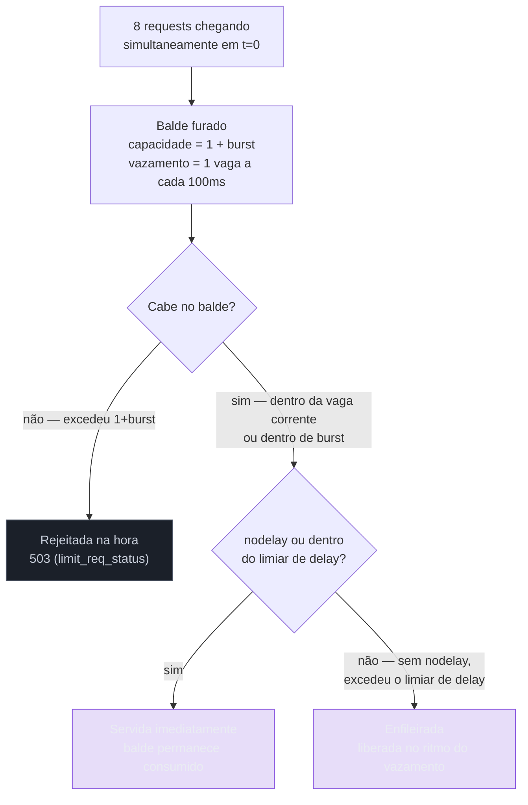
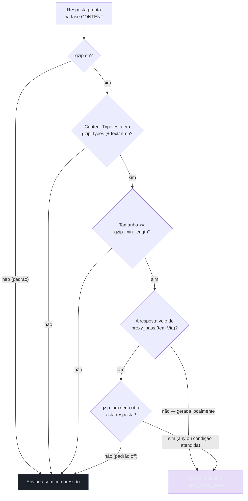

# 11 — Limitar e comprimir

> [!abstract] TL;DR
> `limit_req` não implementa "N requests por segundo numa janela de um segundo" — implementa um balde furado (*leaky bucket*): `rate=10r/s` é uma vaga liberada a cada 100 ms, ponto final, e duas requests no mesmo milissegundo já violam a taxa mesmo sendo as únicas do segundo inteiro. `burst=N` compra N vagas extras que ficam na fila, servidas no ritmo do balde; `nodelay` gasta essas vagas na hora, sem fila, só para evitar que o cliente espere; sem `burst`, qualquer excesso é rejeitado com `503` imediatamente. `limit_conn` resolve um problema diferente — não taxa, contagem de conexões simultâneas. `client_max_body_size` barra corpo grande com `413`, e o valor precisa bater no Nginx e no backend, porque o Nginx nunca avisa a aplicação do motivo. `gzip_types text/html` é sempre adicional — `text/html` está sempre comprimido, declarar tipos não substitui essa lista, soma a ela. `gzip_proxied off`, o padrão, significa que resposta vinda de `proxy_pass` **não é comprimida**, surpreendentemente, a menos que essa diretiva seja trocada. Brotli não é núcleo do Nginx open source.

Três cenas, todas comuns o bastante para já terem acontecido com quem configurou uma borda de produção. Primeira: um lançamento de produto dispara um pico de tráfego legítimo — usuários reais, não um ataque — e metade das requests volta com `503 Service Temporarily Unavailable`, porque alguém configurou `limit_req zone=api rate=10r/s;` sem pensar no parâmetro `burst`, e o balde furado rejeita, sem misericórdia, qualquer rajada que chegue mais rápido que uma request a cada 100 milissegundos, mesmo que o volume total do segundo esteja bem dentro do limite nominal. Segunda: um upload de 5 MB — uma foto de perfil, um anexo de formulário — falha com `413 Request Entity Too Large`, e o cliente não recebe nenhuma mensagem útil sobre o motivo, porque `client_max_body_size` tem um padrão de `1m` que ninguém lembrou de revisar, e o Nginx corta a conexão antes mesmo de o corpo da request chegar à aplicação, que nunca fica sabendo que existiu uma tentativa de upload. Terceira: alguém liga `gzip on;` esperando que o tráfego encolha, mede a economia de banda depois, e não encontra nada — porque `gzip_types` só foi declarado para `application/json`, e a resposta que a aplicação de fato devolve é servida com `Content-Type: application/json; charset=utf-8`, um tipo que não bate exatamente com o que foi listado, ou porque o corpo da resposta vem de um `proxy_pass` e `gzip_proxied` continua no seu padrão `off`.

Nenhuma das três cenas é bug do Nginx. As três são o comportamento documentado, exato, de diretivas cujo padrão é conservador por design — e é justamente esse padrão conservador que gera a surpresa, porque a maioria de quem escreve uma configuração de borda espera generosidade onde o Nginx entrega cautela. A nota [[03-Dominios/Tecnologia/Infraestrutura/Nginx/05 - O ciclo de vida de uma request|05 — O ciclo de vida de uma request]] já nomeou onde `limit_req` e `limit_conn` vivem no percurso de uma request — a fase `PREACCESS`, a sexta de onze, rodando antes de qualquer verificação de identidade — e por que essa posição importa: um cliente que ainda não provou quem é já pode ser cortado por excesso de taxa, sem gastar um único ciclo de CPU verificando senha. Esta nota assume esse mapa como resolvido e mergulha no mecanismo interno de cada diretiva: como o balde furado de fato conta, o que uma zona de memória compartilhada guarda, por que `limit_conn` não é a mesma pergunta que `limit_req`, e o que significa, na prática, um Nginx que decide sozinho não comprimir uma resposta que passou por ele.

## O balde furado: como `limit_req` decide

A primeira correção de intuição, e a mais importante desta nota inteira, é sobre o que `rate=10r/s` de fato significa. A leitura ingênua é "até 10 requests em qualquer janela de um segundo" — como se o Nginx contasse requests dentro de uma janela deslizante e resetasse o contador a cada segundo. Não é isso. O algoritmo é *leaky bucket*, balde furado: existe um buraco no fundo de um balde imaginário, vazando numa taxa constante — para `rate=10r/s`, uma gota a cada 100 milissegundos, sem exceção — e cada request que chega é uma gota despejada no balde. Se o balde tem espaço (não transbordou), a gota entra e, na prática, sai pelo buraco no ritmo do vazamento; se o balde já está cheio até a boca, a gota nova transborda e é descartada. A consequência direta, e contraintuitiva na primeira leitura, é que `rate=10r/s` não tolera duas requests no mesmo instante, mesmo que seja o único par de requests daquele segundo inteiro: a primeira gota ocupa a vaga daquele instante, a segunda, chegando um milissegundo depois, já encontra o balde momentaneamente sem espaço para absorver uma segunda unidade tão cedo — porque o vazamento ainda não teve tempo de abrir espaço de novo. `rate=10r/s` é, na prática mais precisa que a fração sugere, "uma request a cada 100 ms, sustentada", não "10 requests, distribuídas como quiser, dentro de qualquer segundo".

Isso muda completamente como ler um número de `rate`. Uma aplicação que responde bem a rajadas curtas — um usuário que clica três vezes seguidas num botão, um cliente que dispara chamadas paralelas para montar uma página — vai ver `503` em cenários que, medidos em "requests por segundo" no sentido coloquial, estão bem abaixo do limite nominal. É exatamente esse desencontro entre a intuição ("10 por segundo, tenho margem") e o mecanismo real ("uma a cada 100 ms, sem exceção") que os parâmetros `burst`, `nodelay` e `delay` existem para administrar — cada um decidindo de um jeito diferente o que fazer com a gota que chegaria cedo demais para o balde vazio, mas que ainda cabe dentro de alguma tolerância.

### `burst`: comprando espaço extra no balde, sem gastar a rajada de uma vez

`burst=N` aumenta a capacidade do balde em N unidades acima da vaga corrente liberada pelo vazamento. Sem `burst` — que tem valor padrão zero, a diretiva simplesmente não perdoa nenhum excesso — qualquer request que chegue antes de o vazamento abrir espaço de novo é rejeitada na hora, com o código configurado em `limit_req_status` (`503` por padrão). Com `burst=N` declarado, até N requests em excesso podem ser aceitas dentro do balde, mas não são processadas na hora: ficam retidas — na terminologia da própria documentação, "excessive requests are delayed" — e liberadas para a aplicação no mesmo ritmo do vazamento original, uma a cada intervalo de `rate`. É esse comportamento de retenção que dá ao parâmetro seu nome: não é um "desconto" na contagem, é um espaço de fila que absorve o pico e o achata no tempo, entregando à aplicação de trás do Nginx uma taxa suave mesmo quando o cliente mandou tudo de uma vez.

### `nodelay`: gastando a rajada na hora, sem enfileirar

`nodelay`, quando declarado junto de `burst`, muda o que acontece com as requests que caem dentro do espaço extra: em vez de esperar na fila, elas são servidas **imediatamente**, sem nenhum atraso artificial — mas o consumo do balde continua contando exatamente igual. É a diferença entre "aceitar o excesso e fazer o cliente esperar sua vez" (o comportamento padrão de `burst` sozinho) e "aceitar o excesso, servir na hora, e deixar o balde mais cheio para as próximas requests" (o que `nodelay` acrescenta). A vantagem prática é óbvia para tráfego sensível a latência — uma API que não pode impor 400 ms de espera artificial a uma request só porque ela chegou junto de outras três — mas o preço também é real: como o balde já está mais consumido depois de servir a rajada sem atraso, a próxima rajada, chegando pouco depois, tem menos espaço de sobra disponível, porque o vazamento ainda não teve tempo de esvaziar o que a rajada anterior ocupou.

### `delay`: o meio-termo entre esperar tudo e não esperar nada

`delay=N`, disponível desde a versão 1.15.7 do Nginx, oferece um terceiro comportamento, posicionado entre os dois extremos anteriores: as primeiras N requests do excesso são servidas sem atraso, exatamente como `nodelay` faria — mas o restante do espaço de `burst`, além dessas N, continua sendo enfileirado e atrasado no ritmo do vazamento, como o comportamento padrão sem `nodelay`. O valor padrão de `delay`, quando a diretiva `nodelay` também não está presente, é zero — o que equivale a dizer que, sem nenhum dos dois parâmetros, todo o excesso dentro de `burst` é atrasado, sem exceção. `delay=N` é, na prática, uma forma de dizer "tolere um pico curto sem impor latência nenhuma, mas depois de um certo ponto, comece a suavizar o resto" — útil quando a rajada típica tem uma cabeça pequena que vale servir na hora e uma cauda maior que já não precisa da mesma urgência.

### A rajada, número por número

Vale seguir um cenário numérico único através das quatro configurações, porque é o jeito mais direto de tornar tangível uma diferença que, em prosa, soa sutil demais. Considere a zona `limit_req_zone $binary_remote_addr zone=api:10m rate=10r/s;` — uma vaga a cada 100 ms — e um único cliente disparando **oito requests simultâneas**, todas chegando no mesmo instante `t=0ms`, sem nenhum espaçamento entre elas.

| Configuração da diretiva | Servidas imediatamente | Enfileiradas com atraso | Rejeitadas (`503`) |
|---|---|---|---|
| `limit_req zone=api;` (sem `burst`) | 1 | 0 | 7 |
| `limit_req zone=api burst=5;` | 1 | 5 (em `t=100,200,300,400,500ms`) | 2 |
| `limit_req zone=api burst=5 nodelay;` | 6 | 0 | 2 |
| `limit_req zone=api burst=5 delay=2;` | 3 | 3 (em `t=100,200,300ms`) | 2 |

A primeira linha é o comportamento cru do balde: uma request cabe na vaga que já existia em `t=0`, as outras sete chegam com o balde sem nenhum espaço de sobra e morrem na hora — é exatamente o cenário do pico de lançamento descrito na abertura desta nota, quando ninguém declarou `burst`. A segunda linha mostra o `burst=5` puro: a mesma primeira request passa na hora, mais cinco entram no espaço extra e ficam retidas, liberadas uma a uma no ritmo do vazamento — a aplicação de trás nunca vê mais de uma request a cada 100 ms, mesmo que o cliente tenha mandado oito de uma vez — e as duas que sobram, além do total de seis que o balde (1 + 5) comporta, são rejeitadas. A terceira linha troca a fila por imediatismo: as mesmas seis requests que o balde comporta (1 da vaga corrente mais 5 de `burst`) são servidas todas em `t=0ms`, sem nenhuma delas esperar — só as duas que excedem a capacidade total continuam rejeitadas, exatamente como na linha anterior, porque `nodelay` muda **quando** a request excedente é servida, não **quantas** cabem no balde. A quarta linha ilustra o meio-termo: das cinco vagas de `burst`, as duas primeiras (`delay=2`) são servidas sem atraso, junto da vaga corrente — três no total, em `t=0ms` — e as três restantes continuam na fila, atrasadas no ritmo do vazamento; as duas que sobram do total de oito seguem rejeitadas, porque `delay` não aumenta a capacidade do balde, só decide quais posições dentro dele esperam e quais não esperam.



O ponto que a tabela e o diagrama juntos deixam impossível de ignorar: **a capacidade total do balde é sempre `1 + burst`**, e nenhum dos parâmetros extras — `nodelay`, `delay` — muda esse número. O que muda é só o tratamento das requests que caem dentro dessa capacidade: esperar todas (padrão), não esperar nenhuma (`nodelay`), ou esperar só a partir de um certo ponto (`delay=N`). Confundir "aumentar `burst`" com "aceitar mais tráfego" é meio verdadeiro — aumenta quantas requests cabem antes de rejeitar — mas não muda a taxa sustentada que o backend de fato recebe ao longo do tempo, que continua presa ao `rate` declarado, gota a gota, para sempre, não importa quão generoso seja o `burst`.

### O rastro que a rejeição deixa no log

`limit_req_log_level`, com padrão `error`, controla em que nível o Nginx registra uma request rejeitada ou atrasada por `limit_req` no log de erro — e é essa linha, não uma métrica de aplicação, que costuma ser a primeira evidência concreta de que o balde furado está agindo:

```nginx
limit_req_zone $binary_remote_addr zone=api_limit:10m rate=10r/s;
limit_req_log_level warn;

location /api/ {
    limit_req zone=api_limit burst=20 nodelay;
}
```

```
2026/08/08 14:32:07 [error] 1823#1823: *4821 limiting requests, excess: 2.416 by zone "api_limit", client: 203.0.113.7, server: app.exemplo.com, request: "GET /api/pedidos HTTP/1.1", host: "app.exemplo.com"
```

O campo `excess` nessa linha é, literalmente, quanto o balde daquele cliente estourou no momento da rejeição — um número fracionário, porque o vazamento é contínuo, não discreto em unidades inteiras de request. Uma pessoa investigando um pico de `503` que não sabe ainda se a causa é `limit_req` ou um problema real de backend encontra a resposta direto nesse `grep`, sem precisar de nenhuma instrumentação adicional:

```bash
grep "limiting requests" /var/log/nginx/error.log | tail -50
```

Vale registrar, por completude, que essa mesma zona também pode ser referenciada por mais de um `location` ao mesmo tempo — dois blocos protegidos pelo mesmo `zone=api_limit` compartilham o mesmo balde por IP, o que é o comportamento certo quando os dois `location`s pertencem à mesma API e o limite deve valer para o conjunto, não para cada rota isoladamente.

## `limit_req_zone`, a chave e o tamanho da memória

A diretiva `limit_req_zone key zone=name:size rate=rate;` declara, no bloco `http`, a estrutura que guarda o estado do balde de cada chave distinta — tipicamente cada endereço IP, mas potencialmente qualquer variável do Nginx. A escolha mais comum, e a que a documentação usa em todos os seus próprios exemplos, é `$binary_remote_addr`, não `$remote_addr` — e a diferença entre as duas não é estética. `$remote_addr` é o endereço IP como string textual, algo como `"203.0.113.7"`, variando de 7 a 15 caracteres para IPv4 e bem mais para IPv6 por extenso; `$binary_remote_addr` é o mesmo endereço na sua representação binária compacta — 4 bytes fixos para IPv4, 16 bytes fixos para IPv6, sempre. Uma zona indexada por um valor de tamanho fixo e menor ocupa menos memória por entrada e é mais rápida de comparar do que uma indexada por string de tamanho variável, e é exatamente por isso que `$binary_remote_addr` é a recomendação padrão de qualquer configuração de rate limiting por IP no Nginx.

O tamanho declarado depois de `zone=nome:` — `10m` no exemplo mais comum da documentação — dimensiona quantos estados distintos a zona consegue guardar simultaneamente antes de começar a descartar as entradas mais antigas. A documentação do módulo é explícita sobre essa conta: um megabyte de zona guarda cerca de **16.000 estados em plataformas 32-bit** (64 bytes por estado) ou cerca de **8.000 estados em plataformas 64-bit** (128 bytes por estado) — a maioria dos servidores em produção hoje é 64-bit, então a referência prática é a segunda contagem. Uma zona de `10m`, o tamanho do exemplo canônico do módulo, comporta então algo em torno de 80.000 endereços distintos simultâneos antes de a memória virar um limite prático, o que é folgado o bastante para a maioria dos cenários de borda — mas vale saber fazer essa conta antes de assumir que `10m` é sempre suficiente, especialmente em bordas que enfrentam varredura de IPs distintos em massa, onde cada IP novo consome um estado próprio.

| Tamanho da zona | Estados em 64-bit (128 bytes cada) | Estados em 32-bit (64 bytes cada) |
|---|---|---|
| `1m` | ~8.000 | ~16.000 |
| `10m` | ~80.000 | ~160.000 |
| `50m` | ~400.000 | ~800.000 |

Quando a zona enche, o comportamento não é travar nem rejeitar todo mundo: o Nginx descarta os estados menos recentemente usados para abrir espaço para os novos, o mesmo tipo de política que qualquer cache de tamanho fixo aplicaria. O efeito prático de uma zona pequena demais para o tráfego real não é um erro visível — é o esquecimento silencioso de clientes que não fizeram request recente o bastante para permanecer na zona, o que dilui a eficácia do rate limiting sem gerar nenhum log de aviso.

```nginx
limit_req_zone $binary_remote_addr zone=api_limit:10m rate=10r/s;

server {
    location /api/ {
        limit_req zone=api_limit burst=20 nodelay;
        proxy_pass http://api_upstream;
    }
}
```

A zona é declarada uma vez, no nível `http`, e referenciada por nome em qualquer `server` ou `location` que precise dela — o mesmo padrão de "declarar uma vez, aplicar em vários lugares" que a nota [[03-Dominios/Tecnologia/Infraestrutura/Nginx/10 - Cache no Nginx|10 — Cache no Nginx]] já mostrou para zonas de cache. É útil, aliás, notar o paralelo estrutural entre as duas: uma `proxy_cache_path` e uma `limit_req_zone` são, ambas, memória compartilhada entre os workers do Nginx, dimensionada em megabytes, guardando um estado por chave — só que uma guarda respostas HTTP, e a outra guarda contadores de balde furado.

### A chave não precisa ser o IP

Nada na diretiva `limit_req_zone` amarra a chave a `$binary_remote_addr` — o primeiro argumento aceita qualquer variável, ou combinação de variáveis, disponível no ponto do ciclo em que a fase `PREACCESS` roda. Um padrão comum, quando o objetivo é limitar taxa por combinação de cliente e rota — em vez de um teto único por IP cobrindo toda a API — é concatenar duas variáveis na própria declaração da zona:

```nginx
limit_req_zone $binary_remote_addr$request_uri zone=por_rota:10m rate=5r/s;
```

Essa zona trata `203.0.113.7` acessando `/api/login` como uma chave distinta de `203.0.113.7` acessando `/api/pedidos` — cada rota, para cada IP, tem seu próprio balde independente, útil quando um endpoint caro (como `/api/login`, alvo natural de força bruta) precisa de um teto bem mais apertado do que o resto da API, sem que o tráfego normal nas outras rotas contribua para estourar esse balde específico, nem seja afetado por ele.

## `limit_conn` e `limit_conn_zone`: taxa não é conexão

`limit_req` responde a uma pergunta — "com que frequência este cliente pode chegar?" — que é estruturalmente diferente da pergunta que `limit_conn` responde: "quantas conexões este cliente pode manter abertas ao mesmo tempo?". As duas diretivas compartilham a mesma fase de processamento (`PREACCESS`, a sexta das onze fases) e a mesma sintaxe de declaração de zona em duas partes, mas medem coisas distintas, e é comum — e correto — usar as duas juntas, cada uma cobrindo um ângulo de abuso que a outra não cobre sozinha.

```nginx
limit_conn_zone $binary_remote_addr zone=conexoes_por_ip:10m;

server {
    location /downloads/ {
        limit_conn conexoes_por_ip 5;
    }
}
```

Um cliente que abre 50 conexões simultâneas para baixar 50 arquivos em paralelo, cada uma numa taxa de request perfeitamente aceitável — uma única request por conexão, sem rajada nenhuma — nunca vai disparar `limit_req`, porque não há violação de taxa; é `limit_conn` que enxerga o problema, porque a contagem que importa ali é de conexões abertas, não de requests por segundo. O inverso também vale: um cliente que reusa uma única conexão `keepalive` para disparar cem requests em rajada rápida nunca vai preocupar `limit_conn`, porque a conexão é uma só; é `limit_req` que segura esse padrão. `limit_conn_zone` não recebe parâmetro de `rate` — não existe taxa nenhuma envolvida, só uma contagem simples, incrementada quando uma conexão nova abre naquela chave e decrementada quando fecha — e a diretiva `limit_conn zone number;` declara o teto absoluto de conexões simultâneas que aquela chave pode manter. Casos de uso típicos incluem limitar downloads simultâneos por IP (evitando que um único cliente sature todas as conexões de upload disponíveis do servidor) e proteger endpoints caros de streaming ou upload de arquivo grande, onde o custo por conexão aberta — memória de buffer, um worker ocupado — importa mais do que a taxa de requests em si.

Vale notar a interação com `keepalive_timeout`, cujo padrão é `75s`: quanto mais tempo uma conexão ociosa pode ficar aberta esperando a próxima request do mesmo cliente, mais tempo ela também ocupa uma vaga em qualquer `limit_conn_zone` que a esteja contando. Um `keepalive_timeout` generoso é bom para performance — evita o custo de handshake de reabrir conexão a cada request — mas, combinado com um `limit_conn` apertado, pode fazer um cliente legítimo, que abriu poucas conexões mas as mantém ociosas por bastante tempo, esbarrar num teto que parecia folgado. Os dois números — `keepalive_timeout` e o limite de `limit_conn` — precisam ser lidos juntos, não em isolamento, sempre que a borda protege um endpoint sensível a conexões de longa duração.

### Exemplo trabalhado: as duas diretivas na mesma borda

Vale seguir um cenário concreto para fixar a diferença. Uma API de upload de imagens declara, ao mesmo tempo, um limite de taxa e um limite de conexões simultâneas, cada um protegendo um ângulo diferente de abuso:

```nginx
limit_req_zone $binary_remote_addr zone=api_rate:10m rate=10r/s;
limit_conn_zone $binary_remote_addr zone=api_conn:10m;

location /api/upload/ {
    limit_req zone=api_rate burst=20 nodelay;
    limit_conn api_conn 3;
    client_max_body_size 15m;
    proxy_pass http://upload_service;
}
```

Um script malicioso disparando cem requests por segundo, cada uma pequena e de curta duração — sem nenhum upload de verdade, só testando a rota — esbarra em `limit_req` muito antes de `limit_conn` ter qualquer motivo para agir, porque cada conexão fecha rápido e nunca chega a três simultâneas. Um usuário legítimo com conexão lenta, subindo três fotos de 10 MB ao mesmo tempo pelo aplicativo móvel, mantém três conexões abertas por vários segundos cada — dentro do limite de `limit_conn api_conn 3;`, sem violar taxa nenhuma, porque três requests em alguns segundos está bem abaixo de `10r/s`. Um cliente tentando abrir uma quarta conexão simultânea de upload, ainda dentro da mesma janela de tempo, é barrado por `limit_conn`, não por `limit_req` — a diferença entre "chegou rápido demais" e "está ocupando espaço demais" continua nítida mesmo quando as duas diretivas vivem lado a lado na mesma fase `PREACCESS`, processadas na ordem em que aparecem no bloco.

## 503 ou 429: o código de erro como sinal semântico

O padrão de `limit_req_status` e de `limit_conn_status` é `503` para as duas diretivas — e vale entender por que esse é o padrão histórico antes de decidir se convém trocá-lo. `503 Service Unavailable` comunica, na semântica HTTP, "o servidor não está em condições de atender esta request agora" — uma afirmação genérica o bastante para cobrir tanto "estou sobrecarregado de verdade" quanto "estou recusando você de propósito por excesso de taxa". É esse caráter genérico que torna o `503` um padrão problemático em monitoramento: um painel de observabilidade que agrega `503` como "indisponibilidade do serviço" mistura, sem distinção nenhuma, um backend real fora do ar com um cliente comportando-se mal e sendo barrado de propósito — dois eventos com causas, urgências e ações corretivas completamente diferentes, mas que aparecem como o mesmo número na mesma métrica.

`429 Too Many Requests` existe especificamente para resolver essa ambiguidade — é o código HTTP definido para dizer, sem meio-termo, "você está fazendo requests demais, espere e tente de novo", distinto de qualquer indisponibilidade genuína do lado do servidor. Trocar o padrão é simples:

```nginx
limit_req_status 429;
limit_conn_status 429;
```

O argumento para essa troca não é estético. É operacional: com `429` isolado do `503`, um painel de erros consegue separar, de forma automática, "o backend caiu" de "estamos protegendo o backend contra abuso" — a primeira exige investigação urgente, a segunda é o sistema de defesa funcionando exatamente como configurado. Manter tudo em `503` obriga quem investiga um alerta a abrir logs e distinguir manualmente as duas causas toda vez, um trabalho que o simples ato de trocar um código de status evitaria de saída.

## A fronteira: rate limiting em produção vive em outro andar

Vale marcar com precisão onde o mecanismo desta nota termina e onde começa a prática de produção. Tudo que foi descrito até aqui — o balde furado, a zona de memória, a chave `$binary_remote_addr` — é o que o Nginx faz sozinho, num único processo, com estado guardado localmente naquela máquina. Rate limiting **distribuído** entre múltiplas instâncias de Nginx atrás de um balanceador, rate limiting **na borda** de uma CDN antes mesmo do tráfego chegar à sua infraestrutura, e rate limiting **por API key** em vez de por IP — decisões de arquitetura que envolvem coordenação entre processos, propagação de estado compartilhado e políticas de negócio sobre quem é cada cliente — são assunto de prática de produção, tratado em [[03-Dominios/Engenharia/Operação/3 - Rodar em produção/05 - Rede e borda em produção|Rede e borda em produção]]. Uma zona `limit_req_zone` vive na memória de um único processo Nginx; se você roda três instâncias atrás de um balanceador de carga, cada uma tem seu próprio balde, cego ao que as outras duas estão vendo — um cliente distribuído entre as três pode efetivamente triplicar sua taxa efetiva sem que nenhuma zona individual perceba. Vale registrar, com honestidade, que o próprio Nginx reconhece essa lacuna: a sintaxe de `limit_req_zone` aceita um parâmetro `sync`, que sincroniza a zona de memória entre instâncias — mas essa sincronização é um recurso comercial do Nginx Plus, indisponível na versão open source que esta nota descreve. Sem `sync`, resolver rate limiting verdadeiramente distribuído no Nginx open source exige um mecanismo externo — um contador compartilhado, tipicamente num serviço como Redis — desenhado e mantido fora do `nginx.conf`, o que é, de novo, matéria de produção, não de mecanismo de uma única diretiva.

Há uma segunda armadilha, mais sutil e mais fácil de esquecer, que conecta diretamente com o começo do percurso de fases descrito na nota anterior deste galho: a chave `$binary_remote_addr` só identifica o cliente de verdade quando a conexão TCP chega direto dele até o Nginx. Atrás de um CDN, de um balanceador de camada 4 ou de qualquer proxy intermediário, o endereço que o Nginx enxerga na conexão TCP é o do proxy mais próximo, não o do cliente original — e nesse cenário, `limit_req` por `$binary_remote_addr` está, sem perceber, limitando a taxa agregada de **todos** os clientes que passam por aquele proxy, como se fossem um único IP. A correção é o `ngx_http_realip_module`, que roda logo na primeira das onze fases (`POST_READ`, antes de qualquer outro módulo), substituindo o endereço de conexão pelo valor de um cabeçalho como `X-Forwarded-For`, desde que a origem seja explicitamente confiada via `set_real_ip_from`. Como `limit_req_zone` referencia `$binary_remote_addr` — e essa variável já reflete a substituição feita por `realip`, por rodar em fase posterior — configurar `realip` corretamente é pré-condição, não opcional, para que rate limiting por IP funcione atrás de qualquer intermediário de rede.

Rate limiting por API key merece a mesma ressalva por um motivo diferente: não existe, em nenhum lugar do núcleo do Nginx, o conceito de "identidade de cliente autenticado" antes da fase `ACCESS` — e `limit_req`, rodando em `PREACCESS`, roda antes dela. Limitar por chave de API é perfeitamente possível dentro do Nginx, desde que a chave chegue como algo já lido antes de `PREACCESS`, tipicamente um cabeçalho HTTP que o próprio cliente envia (`limit_req_zone $http_x_api_key zone=...`) — mas isso é diferente de limitar por identidade *validada*, que só a aplicação, ou um `auth_request` rodando em `ACCESS`, consegue garantir. Uma política de negócio como "cada plano de assinatura tem seu próprio teto de requests por minuto, e o teto muda dinamicamente conforme o cliente troca de plano" já não é mais um `limit_req_zone` estático declarado uma vez no `nginx.conf` — é estado de aplicação, sincronizado com um sistema de billing, e cai fora do que este mecanismo resolve sozinho; é aí que a fronteira com a prática de produção, tratada em [[03-Dominios/Engenharia/Operação/3 - Rodar em produção/05 - Rede e borda em produção|Rede e borda em produção]], se torna literal, não só conceitual.

## `client_max_body_size` e o 413 silencioso

`client_max_body_size`, com padrão `1m`, define o tamanho máximo que o Nginx aceita para o corpo de uma request antes de cortar a conexão e devolver `413 Request Entity Too Large`. A diretiva vale nos contextos `http`, `server` e `location`, e — como qualquer diretiva herdável — pode ser sobrescrita num `location` específico que precise de um limite diferente, sem afetar o resto do `server`:

```nginx
server {
    client_max_body_size 1m;

    location /uploads/ {
        client_max_body_size 20m;
        proxy_pass http://upload_service;
    }
}
```

O detalhe operacional que costuma pegar quem só olha para o Nginx é este: `413` sendo devolvido pelo Nginx não avisa a aplicação de trás de nada. A conexão é cortada antes de o corpo inteiro sequer chegar ao backend — o processo de upload nunca vê a tentativa, nunca loga o evento, nunca tem chance de mostrar uma mensagem de erro contextual ("seu arquivo é grande demais, o limite é 20 MB") porque, do ponto de vista da aplicação, a request simplesmente nunca aconteceu. É por isso que o valor de `client_max_body_size` precisa **bater** entre o Nginx e a aplicação — se o backend valida uploads até 25 MB mas o Nginx corta em 1 MB, o usuário nunca alcança a mensagem de erro cuidadosamente escrita pela aplicação, só o `413` genérico do Nginx, sem contexto nenhum sobre o que fazer a seguir. A documentação oficial é explícita sobre um efeito colateral relacionado: navegadores não exibem corretamente a página de erro `413` — o que reforça por que tratar esse limite só no Nginx, sem replicar a mesma validação (com mensagem amigável) do lado da aplicação, deixa o usuário final sem nenhuma explicação utilizável.

## Compressão: gzip e a armadilha do `gzip_types`

O módulo `ngx_http_gzip_module` comprime a resposta antes de enviá-la ao cliente, trocando ciclos de CPU do servidor por bytes a menos na rede — uma troca que quase sempre vale a pena para conteúdo textual, e quase nunca vale para conteúdo já comprimido (imagens JPEG, vídeos, a maioria dos formatos binários modernos), onde tentar comprimir de novo só gasta CPU sem ganhar quase nada.

A diretiva `gzip` tem padrão `off` — compressão não acontece a menos que seja explicitamente ligada — e a diretiva companheira mais mal compreendida é `gzip_types`, cujo padrão é `text/html`. A armadilha está exatamente aqui: a documentação oficial é explícita ao dizer que os tipos declarados em `gzip_types` são **adicionais** a `text/html`, não substitutos dele — `text/html` está sempre comprimido, independentemente do que mais for listado, e não existe forma de remover esse tipo da lista. Quem declara `gzip_types application/json;` esperando que só JSON seja comprimido está, na verdade, ganhando compressão de `text/html` e `application/json` juntos — o que raramente é problema — mas quem lê essa mesma linha esperando que ela cubra *todo* o tráfego relevante da aplicação e descobre, meses depois, que respostas `text/css` ou `application/javascript` nunca foram comprimidas porque simplesmente não foram listadas, é a versão inversa e mais cara do mesmo mal-entendido:

```nginx
gzip on;
gzip_types text/css application/javascript application/json image/svg+xml;
gzip_min_length 256;
gzip_comp_level 5;
```

`gzip_comp_level`, com padrão `1`, controla o esforço de compressão numa escala de 1 (mais rápido, comprime menos) a 9 (mais lento, comprime um pouco mais) — e a curva entre os dois extremos tem retorno visivelmente decrescente: o salto de compressão entre nível 1 e nível 5 costuma ser perceptível, enquanto o salto entre nível 6 e nível 9 costuma render poucos bytes a mais por um custo de CPU desproporcional, porque o algoritmo já extraiu a maior parte da redundância disponível nos níveis intermediários. Configurar `gzip_comp_level 9;` numa borda de alto tráfego, na expectativa de "comprimir ao máximo", é um erro comum de otimização prematura: o ganho marginal de bytes raramente compensa o custo de CPU multiplicado por cada request, numa borda que já está sob pressão de volume. `gzip_min_length`, com padrão `20` (bytes), evita gastar CPU comprimindo respostas tão pequenas que o cabeçalho adicional do formato gzip anularia qualquer economia — comprimir uma resposta de 15 bytes normalmente produz uma saída maior que o original, por causa do overhead fixo do formato.

Vale amarrar esse custo de CPU ao modelo de processos que abre este galho: cada worker do Nginx roda um laço de eventos, tratando muitas conexões concorrentes dentro de uma única linha de execução. Comprimir uma resposta é trabalho de CPU, síncrono, dentro desse mesmo laço — não existe, por padrão, um pool separado de threads absorvendo o custo da compressão como existe para leitura de disco bloqueante via `aio`. Um `gzip_comp_level` alto processando uma resposta grande ocupa ciclos do worker que, no mesmo instante, deveria estar atendendo todas as outras conexões daquele mesmo worker — o custo de compressão não é isolado por conexão, ele compete com o resto do tráfego que o mesmo processo está servindo.

### `gzip_vary`: o cabeçalho que impede o cache de servir a versão errada

`gzip_vary`, com padrão `off`, controla se o Nginx acrescenta `Vary: Accept-Encoding` à resposta quando `gzip`, `gzip_static` ou `gunzip` estão ativos. Esse cabeçalho existe para resolver um problema que só aparece quando existe uma camada de cache — a `proxy_cache` do Nginx (nota [[03-Dominios/Tecnologia/Infraestrutura/Nginx/10 - Cache no Nginx|10 — Cache no Nginx]]), um CDN na frente, ou o cache do próprio navegador: sem `Vary: Accept-Encoding`, uma resposta comprimida guardada em cache pode ser servida depois para um cliente que nunca declarou suporte a gzip no seu `Accept-Encoding`, entregando bytes binários incompreensíveis onde deveria haver texto legível. Com o cabeçalho presente, qualquer cache correto guarda versões separadas — uma comprimida, outra não — indexadas também pelo valor de `Accept-Encoding` da request original, e nunca cruza as duas:

```nginx
gzip on;
gzip_types text/html application/json;
gzip_vary on;
```

Ligar `gzip_vary on;` sempre que `gzip` estiver ativo numa configuração que também envolve qualquer camada de cache — a do próprio Nginx ou uma externa — não é opcional: é a diferença entre uma resposta comprimida cacheada corretamente e uma resposta corrompida servida, de vez em quando, para o cliente errado.

### `gzip_proxied off`: o padrão que surpreende quem usa proxy reverso

`gzip_proxied`, com padrão `off`, é a diretiva mais surpreendente das cinco cobertas nesta nota, e vale desenvolver o porquê. A documentação descreve `gzip_proxied` como controlando a compressão de respostas para requests proxiadas — aquelas em que o Nginx está atuando como intermediário, tipicamente via `proxy_pass`, repassando uma resposta que veio de um backend por trás dele. Com o valor padrão `off`, **nenhuma resposta vinda de um upstream é comprimida**, independentemente de qualquer outra configuração de `gzip_types` ou `gzip on;` — o Nginx simplesmente decide, de saída, não comprimir nada que tenha passado por proxy, a menos que essa diretiva seja explicitamente trocada para um valor mais permissivo:

```nginx
location /app/ {
    proxy_pass http://app_upstream;
    gzip_proxied any;
}
```

`any` é o valor mais permissivo — comprime toda resposta proxiada, sem exceção — enquanto os valores intermediários (`expired`, `no-cache`, `no-store`, `private`, `no_last_modified`, `no_etag`, `auth`) condicionam a compressão a sinais específicos presentes no cabeçalho da resposta, tipicamente ligados a diretivas de cache. É comum ver uma configuração de borda onde `gzip on;` está declarado, `gzip_types` cobre exatamente o `Content-Type` certo, e a compressão continua não acontecendo — porque a resposta vem de `proxy_pass`, e `gzip_proxied` continua no seu padrão conservador. Esse é, sozinho, o motivo mais comum de "liguei gzip e nada mudou" em qualquer configuração que usa o Nginx como proxy reverso na frente de uma aplicação, o padrão descrito na nota [[03-Dominios/Tecnologia/Infraestrutura/Nginx/07 - Proxy reverso|07 — Proxy reverso]].



O diagrama deixa visível por que "liguei `gzip on;`" é necessário mas nunca suficiente: são quatro portões (`gzip`, `gzip_types`, `gzip_min_length`, e — só quando a resposta veio de proxy — `gzip_proxied`) e todos precisam abrir para a compressão de fato acontecer. A causa mais comum de compressão ausente numa borda com `proxy_pass` é o último portão, justamente porque é o único dos quatro cujo padrão surpreende: os outros três têm um padrão que, uma vez ligado `gzip on;`, tende a deixar passar (`gzip_types` já inclui `text/html`; `gzip_min_length` de 20 bytes é baixo o bastante para não filtrar quase nada) — só `gzip_proxied` fecha por padrão justamente o caminho mais comum de uma borda moderna, que é servir como proxy reverso na frente de uma aplicação.

## Brotli e a pré-compressão com `gzip_static`

Vale fechar com duas peças que costumam aparecer em qualquer discussão mais avançada de compressão, e que merecem uma resposta precisa em vez de suposição.

**Brotli não faz parte do núcleo do Nginx open source.** O algoritmo, criado pelo Google, costuma comprimir de forma um pouco melhor que gzip para conteúdo textual em níveis de compressão comparáveis — mas o suporte a ele no Nginx vem de um módulo de terceiros, `ngx_brotli`, mantido separadamente do projeto principal, que precisa ser compilado junto do binário do Nginx (não vem habilitado por padrão em nenhuma distribuição oficial) ou obtido via um pacote de build que já o inclua. As diretivas que o módulo expõe seguem o mesmo padrão de nomes do módulo gzip, só trocando o prefixo — `brotli`, `brotli_comp_level`, `brotli_types`, `brotli_static`, entre outras — o que facilita a leitura para quem já conhece as equivalentes de gzip, mas não muda o fato de que nenhuma delas está disponível numa instalação padrão do Nginx sem esse módulo adicional.

**`gzip_static` também não é núcleo por padrão** — mas por um motivo diferente do Brotli. O módulo `ngx_http_gzip_static_module` existe no próprio código-fonte oficial do Nginx, mantido pelo projeto, mas não é compilado por padrão numa build genérica: precisa ser habilitado explicitamente na hora de compilar, com a flag `--with-http_gzip_static_module`. Uma vez disponível, a diretiva `gzip_static on;` muda a lógica do módulo de compressão em tempo real: em vez de comprimir a resposta a cada request, o Nginx procura, ao lado do arquivo original, uma versão já comprimida com extensão `.gz` — e, se ela existir, serve essa versão pronta diretamente, sem gastar nenhum ciclo de CPU comprimindo na hora:

```nginx
location /static/ {
    gzip_static on;
    root /var/www/site;
}
```

Um pipeline de build que já gera `app.js` e `app.js.gz` lado a lado — comprimindo uma única vez, no momento do deploy, em vez de a cada request — é o cenário ideal para essa diretiva: o custo de compressão é pago uma vez, previsivelmente, em vez de repetido a cada acesso ao mesmo arquivo estático. `gzip_static` funciona bem em conjunto com `gzip on;`: quando o arquivo `.gz` não existe para um recurso específico, o Nginx cai de volta para a compressão em tempo real normal, desde que ela também esteja habilitada.

## Três pontes para fora deste galho

Vale nomear, explicitamente, três lugares onde o que esta nota descreveu como mecanismo puro do Nginx toca em disciplinas com nome e corpo próprios, para não deixar a impressão de que `limit_req`, `limit_conn` e `gzip` são ideias exclusivas desta ferramenta.

A escolha entre `503` e `429`, discutida a fundo mais acima, não é uma peculiaridade do Nginx — é uma aplicação direta da semântica de código de status HTTP, o vocabulário inteiro de "o que esta resposta está dizendo sobre o que aconteceu", tratado com profundidade própria em [[03-Dominios/Ciência/Redes e Protocolos/06 - HTTP - métodos, status e headers|HTTP — métodos, status e headers]]. O Nginx só escolhe, por padrão, um código genérico demais para o que de fato aconteceu; entender por que `429` comunica melhor exige entender a família inteira de códigos 4xx e 5xx, não só este par.

`limit_conn`, isolando um cliente para que ele não consuma mais do que sua cota de conexões simultâneas, é uma instância literal de um padrão que a engenharia de sistemas distribuídos batizou de **bulkhead** — compartimentar recursos para que a falha ou o abuso de uma parte não afunde o sistema inteiro, o mesmo princípio por trás de um compartimento estanque de navio. Esse padrão, junto dos seus vizinhos mais conhecidos — circuit breaker, retry com backoff — tem tratamento próprio, fora do escopo desta ferramenta específica, em [[03-Dominios/Ciência/Redes e Protocolos/14 - Resiliência de rede|Resiliência de rede]]. `limit_req` e `limit_conn`, aqui, são a implementação concreta de uma ideia que existe independentemente do Nginx — o mesmo padrão aparece, com outro nome de diretiva, em qualquer proxy reverso ou API gateway sério.

E o ganho que a compressão entrega — menos bytes na rede, TTFB menor, especialmente perceptível em conexões móveis de banda limitada — é medido, priorizado e otimizado com uma disciplina inteira própria, que trata a rede como um dos vários fatores que decidem se uma página "parece" rápida ou lenta para quem está do outro lado. Essa disciplina é [[03-Dominios/Tecnologia/Web Performance/index|Web Performance]]: `gzip_comp_level` e `gzip_types`, aqui, são só duas das muitas alavancas que ela cataloga, ao lado de coisas que não têm nada a ver com o Nginx, como o tamanho de um bundle de JavaScript ou o carregamento de uma fonte web.

## Diagnosticando na prática

Diante de "o rate limit não parece certo" ou "a compressão não está agindo", os dois roteiros abaixo resolvem a maioria dos casos sem precisar adivinhar.

**Para `limit_req` e `limit_conn`**, o primeiro lugar a olhar é sempre o log de erro, já apresentado na seção sobre `limit_req_log_level` — ele nomeia a zona, o `excess`, o cliente e a URI, o suficiente para confirmar se uma rejeição observada pelo cliente de fato veio dessas diretivas ou de outra causa qualquer. Quando a dúvida é sobre a chave usada — "este IP está mesmo sendo tratado como um cliente só, ou está sendo agrupado com outros atrás de um proxy?" — a forma mais direta de confirmar é expor a chave calculada como cabeçalho de resposta, temporariamente, e comparar:

```nginx
add_header X-Debug-RateLimit-Key $binary_remote_addr always;
```

```bash
for i in $(seq 1 15); do curl -s -o /dev/null -w "%{http_code}\n" https://app.exemplo.com/api/teste; done
```

Disparar quinze requests em sequência rápida contra um endpoint protegido e contar quantas voltam `200` contra quantas voltam `503` (ou `429`, se o padrão foi trocado) confirma, empiricamente, se o `burst` configurado corresponde ao comportamento esperado — sem precisar confiar só na leitura da configuração. Contra a zona `limit_req zone=api_limit burst=5 nodelay;` do exemplo usado ao longo desta nota, a saída típica desse laço — com o overhead natural do `curl` abrindo cada conexão nova espaçando ligeiramente as quinze chamadas — tende a mostrar algo como seis respostas `200` seguidas (a vaga corrente mais as cinco de `burst`, todas imediatas por causa de `nodelay`) e o restante `503`, até que o vazamento do balde, no ritmo de `rate`, comece a abrir espaço de novo para as chamadas seguintes do laço:

```
200
200
200
200
200
200
503
503
503
503
503
503
503
503
503
```

Reproduzir esse experimento contra a própria configuração, antes de assumir que ela está correta só porque a sintaxe validou sem erro no `nginx -t`, é o jeito mais barato de descobrir, em segundos, se o `burst` declarado corresponde de fato ao padrão de rajada que o tráfego real vai produzir.

**Para compressão**, `curl` com o cabeçalho certo revela imediatamente qual dos quatro portões do diagrama anterior está fechado:

```bash
curl -s -H "Accept-Encoding: gzip" -D - -o /dev/null https://app.exemplo.com/api/pedidos
```

Uma resposta sem o cabeçalho `Content-Encoding: gzip` na saída, apesar de `Accept-Encoding: gzip` ter sido enviado, significa que algum dos quatro portões recusou: verificar `gzip on;` primeiro (o mais óbvio, e ainda assim o mais esquecido em ambientes de teste que replicam produção parcialmente), depois se o `Content-Type` da resposta bate exatamente com o que está em `gzip_types`, depois o tamanho contra `gzip_min_length`, e por último — o mais fácil de esquecer, pela razão já discutida — se a resposta vem de `proxy_pass` e `gzip_proxied` está posicionado para permitir.

## Uma configuração de referência, com tudo junto

Vale fechar o corpo técnico com um único bloco reunindo todas as diretivas desta nota numa borda plausível, para servir de ponto de partida em vez de checklist solta:

```nginx
http {
    limit_req_zone $binary_remote_addr zone=api_rate:10m rate=10r/s;
    limit_conn_zone $binary_remote_addr zone=api_conn:10m;

    limit_req_status 429;
    limit_conn_status 429;

    gzip on;
    gzip_comp_level 5;
    gzip_min_length 256;
    gzip_types text/css application/javascript application/json image/svg+xml;
    gzip_vary on;

    server {
        listen 443 ssl;
        server_name app.exemplo.com;

        set_real_ip_from 10.0.0.0/8;
        real_ip_header X-Forwarded-For;

        client_max_body_size 1m;

        location /api/ {
            limit_req zone=api_rate burst=20 nodelay;
            limit_conn api_conn 10;
            proxy_pass http://api_upstream;
            gzip_proxied any;
        }

        location /uploads/ {
            client_max_body_size 15m;
            limit_conn api_conn 3;
            proxy_pass http://upload_service;
        }

        location /static/ {
            gzip_static on;
            root /var/www/site;
        }
    }
}
```

Cada linha desse bloco corresponde a uma decisão explicada nesta nota, não a um valor copiado sem entender: `realip` antes de qualquer zona depender de `$binary_remote_addr`, `429` no lugar do `503` padrão, `gzip_proxied any` porque o `location /api/` serve conteúdo de `proxy_pass`, um `client_max_body_size` mais generoso isolado só no `location` que de fato recebe upload, e `gzip_static` reservado ao `location` que serve arquivos já pré-comprimidos por um pipeline de build.

## Armadilhas comuns

> [!warning] Configurar `rate` sem pensar em `burst` e ser surpreendido por rajadas legítimas
> **O que acontece:** um pico de tráfego real — um lançamento, uma campanha, um horário de pico normal — dispara uma onda de `503` mesmo com um `rate` que, medido em volume total por segundo, parece folgado o bastante. **Por quê:** `rate=Nr/s` não é uma cota de volume por segundo, é um vazamento constante de uma vaga a cada `1000/N` milissegundos; sem `burst`, qualquer par de requests chegando mais perto do que esse intervalo já excede a capacidade do balde, mesmo que o total do segundo esteja dentro do número nominal. **Como evitar:** declarar sempre um `burst` compatível com o padrão real de rajada do tráfego esperado — não zero — e decidir explicitamente entre enfileirar (padrão), servir na hora (`nodelay`) ou um meio-termo (`delay=N`), em vez de aceitar o comportamento implícito de rejeitar tudo que exceder a vaga corrente.

> [!warning] Aplicar `limit_req` por `$binary_remote_addr` atrás de um balanceador ou CDN sem `realip`
> **O que acontece:** o limite de taxa parece agir sobre um único cliente monstruoso, ou parece completamente ineficaz contra abuso distribuído — dependendo de qual lado do erro se manifesta primeiro. **Por quê:** sem `realip` configurado, `$binary_remote_addr` reflete o endereço do proxy ou balanceador mais próximo, não o do cliente original; todo o tráfego que passa por aquele intermediário acaba compartilhando o mesmo balde, artificialmente. **Como evitar:** configurar `ngx_http_realip_module` (`set_real_ip_from` mais `real_ip_header`) antes de qualquer diretiva de rate limiting depender de `$binary_remote_addr` — a substituição roda na primeira fase do ciclo, `POST_READ`, então qualquer diretiva de `PREACCESS` em diante já enxerga o endereço corrigido.

> [!warning] Declarar `gzip_types` esperando que ele substitua a lista padrão em vez de somar a ela
> **O que acontece:** alguém declara `gzip_types application/json;` achando que só JSON vai ser comprimido, e se surpreende, meses depois, ao descobrir em uma auditoria que `text/html` também estava sendo comprimido o tempo todo — ou, na direção oposta, assume que `text/css` está coberto por engano e descobre que nunca esteve. **Por quê:** a documentação é explícita — os tipos declarados em `gzip_types` são adicionais a `text/html`, que é sempre comprimido por padrão, independentemente de qualquer configuração; não existe forma de remover `text/html` da lista, e não existe herança automática de outros tipos textuais comuns. **Como evitar:** listar explicitamente cada `Content-Type` que a aplicação de fato serve e que se beneficia de compressão — `text/css`, `application/javascript`, `application/json`, `image/svg+xml`, entre outros — em vez de assumir que algum deles já está coberto pelo padrão.

> [!warning] Ligar `gzip on;` numa borda de proxy reverso e não entender por que nada foi comprimido
> **O que acontece:** `gzip on;` está declarado, `gzip_types` cobre o `Content-Type` certo, e a resposta do cliente continua chegando sem compressão nenhuma, sem nenhum erro nem aviso no log. **Por quê:** `gzip_proxied`, com padrão `off`, desliga a compressão especificamente para respostas vindas de `proxy_pass` — a maioria das configurações reais de borda, onde o Nginx serve como proxy reverso na frente de uma aplicação — e esse padrão conservador não é mencionado em nenhuma mensagem de erro, só na documentação da diretiva. **Como evitar:** revisar `gzip_proxied` explicitamente sempre que `gzip` estiver configurado num `location` que usa `proxy_pass`; `any` é o valor mais simples de raciocinar quando não há razão específica para condicionar a compressão a cabeçalhos de cache do backend.

> [!warning] Confundir o `413` do Nginx com um erro tratado pela aplicação
> **O que acontece:** um usuário reporta que um upload falhou "sem explicação nenhuma", e a equipe de desenvolvimento não encontra log nenhum do lado da aplicação registrando a tentativa. **Por quê:** `client_max_body_size` corta a conexão antes de o corpo completo chegar ao backend; a aplicação nunca recebe a request, então nunca tem chance de logar, validar ou devolver uma mensagem contextual — o `413` que o cliente vê vem inteiramente do Nginx, sem passar pela lógica de negócio. **Como evitar:** manter o valor de `client_max_body_size` explicitamente sincronizado com qualquer limite equivalente validado na aplicação, e documentar esse número num lugar visível para as duas equipes — backend e infraestrutura — em vez de deixá-lo como um detalhe de configuração isolado que só quem mexeu no `nginx.conf` conhece.

> [!warning] Tratar `limit_req`/`limit_conn` como defesa suficiente contra um ataque volumétrico distribuído
> **O que acontece:** um ataque genuíno, vindo de milhares de IPs diferentes, continua passando praticamente ileso apesar de zonas de rate limiting bem configuradas, e a equipe se pergunta por que "o rate limit não está funcionando". **Por quê:** o balde furado conta por chave — tipicamente por IP — dentro de um único processo Nginx; um ataque distribuído por definição espalha o volume entre muitas chaves diferentes, cada uma individualmente bem abaixo de qualquer `rate` razoável, e várias instâncias de Nginx atrás de um balanceador nem sequer compartilham a mesma zona de memória entre si. **Como evitar:** tratar `limit_req` e `limit_conn` como a última camada de defesa contra abuso individual e picos legítimos, não como proteção contra volume distribuído — essa camada vive antes do Nginx, tipicamente numa CDN ou serviço de mitigação dedicado, assunto de [[03-Dominios/Engenharia/Operação/3 - Rodar em produção/05 - Rede e borda em produção|Rede e borda em produção]].

> [!warning] Subir `gzip_comp_level` para 9 numa borda de alto tráfego esperando "compressão máxima"
> **O que acontece:** a CPU dos workers sobe de forma visível sob carga, sem uma redução proporcional no tamanho médio das respostas, e a suspeita recai sobre qualquer coisa menos a própria configuração de compressão. **Por quê:** o retorno de `gzip_comp_level` é decrescente — o salto de compressão entre os níveis baixos e intermediários é real, mas o ganho adicional dos níveis mais altos costuma ser marginal, enquanto o custo de CPU por request continua subindo de forma quase linear com o nível. **Como evitar:** medir o tamanho de resposta real em dois ou três níveis intermediários (a documentação não recomenda um número universal) antes de escalar o nível só por instinto, e lembrar que o padrão da diretiva é `1` — deliberadamente conservador, priorizando velocidade sobre taxa de compressão máxima.

## Uma frase por diretiva, para memorizar

1. `limit_req` — uma vaga a cada `1000/rate` milissegundos, nunca "N por segundo, soltos".
2. `burst` — quantas vagas extras existem além da vaga corrente; capacidade total é sempre `1 + burst`.
3. `nodelay` — gasta o `burst` na hora, sem fila, deixando menos espaço de sobra logo depois.
4. `delay=N` — as primeiras N do excesso sem espera, o resto enfileirado como o padrão.
5. `limit_req_zone` — a chave decide quem compartilha o mesmo balde; `$binary_remote_addr`, nunca `$remote_addr`.
6. `limit_conn` — não é taxa, é quantas conexões o mesmo cliente pode manter abertas ao mesmo tempo.
7. `429` — o código certo para "você está pedindo demais"; `503` mistura isso com "estou fora do ar".
8. `client_max_body_size` — o `413` que ela gera nunca chega ao backend; sincronizar o número nos dois lados.
9. `gzip_types` — sempre adicional a `text/html`, nunca substitui a lista padrão.
10. `gzip_proxied off` — resposta de `proxy_pass` não é comprimida até essa diretiva dizer o contrário.

## Como explicar em inglês

> "`limit_req` doesn't cap requests per second in a sliding window — it's a leaky bucket. `rate=10r/s` means one slot opens every 100 milliseconds, period; two requests in the same millisecond already violate that, even if they're the only two in the whole second. `burst` buys extra slots that queue and drain at that same steady rate; `nodelay` spends those slots immediately instead of queuing, at the cost of leaving less headroom for the next burst; `delay` is the middle ground, serving the first few excess requests instantly and queuing the rest. `limit_conn` answers a different question entirely — not rate, concurrent connection count — so a client hammering you with parallel downloads at a perfectly reasonable request rate slips right past `limit_req` and gets caught by `limit_conn` instead. And two defaults trip people up constantly: `gzip_types` only adds to `text/html`, it never replaces it, and `gzip_proxied` defaults to `off`, which means anything coming back through `proxy_pass` isn't compressed at all unless you say otherwise."

| PT | EN |
|---|---|
| balde furado | leaky bucket |
| limite de taxa | rate limit |
| rajada | burst |
| vazamento (do balde) | leak / drain rate |
| conexões simultâneas | concurrent connections |
| corpo da request | request body |
| comprimir a resposta | compress the response |
| pré-compressão | pre-compression |
| tipo MIME | MIME type |
| padrão conservador | conservative default |

Duas frases curtas, do tipo que cabem numa resposta de entrevista sem soar decorado:

> "If someone asks why a rate limit rejected traffic that looked well under the nominal number, my first question is always what the actual arrival pattern looked like — the leaky bucket punishes clustering, not volume."

> "Compression not kicking in behind a reverse proxy is almost always `gzip_proxied` still sitting on its default — that one bites people more than any `gzip_types` mistake."

## Tabela de referência rápida

Vale fechar o corpo técnico consolidando, numa única tabela, as diretivas cobertas nesta nota contra seu padrão e o que cada uma de fato controla — o resumo para consulta rápida quando a dúvida já não é "como isso funciona" (o corpo da nota já resolveu isso), mas "qual é mesmo o padrão desta diretiva":

| Diretiva | Padrão | Controla |
|---|---|---|
| `limit_req_zone` | — | declara a zona de memória e a chave do balde furado |
| `limit_req` | — (sem `burst`) | aplica a zona a um `location`/`server`; `burst`, `nodelay`, `delay` ajustam a tolerância |
| `limit_req_status` | `503` | código devolvido quando `limit_req` rejeita |
| `limit_req_log_level` | `error` | nível de log da rejeição/atraso por `limit_req` |
| `limit_conn_zone` | — | declara a zona de contagem de conexões simultâneas |
| `limit_conn` | — | teto de conexões simultâneas por chave |
| `limit_conn_status` | `503` | código devolvido quando `limit_conn` rejeita |
| `limit_conn_log_level` | `error` | nível de log da rejeição por `limit_conn` |
| `client_max_body_size` | `1m` | tamanho máximo do corpo da request antes do `413` |
| `gzip` | `off` | liga ou desliga a compressão em tempo real |
| `gzip_types` | `text/html` | tipos MIME comprimidos, sempre somados a `text/html` |
| `gzip_comp_level` | `1` | esforço de compressão, 1 a 9, retorno decrescente |
| `gzip_min_length` | `20` | tamanho mínimo, em bytes, para valer a pena comprimir |
| `gzip_proxied` | `off` | se resposta de `proxy_pass` é elegível para compressão |
| `gzip_vary` | `off` | se `Vary: Accept-Encoding` é adicionado à resposta |
| `gzip_static` | — (exige `--with-http_gzip_static_module`) | serve `.gz` pré-comprimido em vez de comprimir na hora |

## O que vem a seguir

Este galho fecha a fase Adepto aqui: nove notas cobrindo o essencial de servir, fazer proxy, balancear, proteger com TLS, cachear, limitar e comprimir — a caixa de ferramentas que qualquer borda de produção precisa. O que resta é a fase Magus, que muda de registro: em vez de "o que cada diretiva faz", passa a ser "o que sustenta tudo isso por baixo e como se debuga quando quebra". A próxima nota — [[03-Dominios/Tecnologia/Infraestrutura/Nginx/12 - Variáveis, map, rewrite e logging|12 — Variáveis, map, rewrite e logging]] — completa o `rewrite` que a nota 05 só nomeou (`last` contra `break`, a diferença que decide se a request reabre a busca de `location`), introduz `map` como tabela de decisão e fecha com o formato de log estruturado que torna tudo isso auditável depois do fato. De lá em diante, [[03-Dominios/Tecnologia/Infraestrutura/Nginx/13 - Tuning e diagnóstico|13 — Tuning e diagnóstico]] junta as peças de todo o galho num catálogo de sintomas — `502`, `504`, `413`, `499` — e no mecanismo de reload gracioso que troca a configuração de um Nginx em produção sem derrubar uma única conexão em andamento.

## Fontes

- **Nginx Docs** — [*Module ngx_http_limit_req_module*](https://nginx.org/en/docs/http/ngx_http_limit_req_module.html) — a sintaxe completa de `limit_req_zone` e `limit_req`, o algoritmo de balde furado, `burst`, `nodelay`, `delay` (desde 1.15.7), e a capacidade de memória por megabyte de zona.
- **Nginx Docs** — [*Module ngx_http_limit_conn_module*](https://nginx.org/en/docs/http/ngx_http_limit_conn_module.html) — `limit_conn_zone`, `limit_conn`, e os padrões de `limit_conn_status` (`503`) e `limit_conn_log_level` (`error`).
- **Nginx Docs** — [*Module ngx_http_gzip_module*](https://nginx.org/en/docs/http/ngx_http_gzip_module.html) — os padrões de `gzip` (`off`), `gzip_comp_level` (`1`), `gzip_types` (`text/html`, sempre adicional), `gzip_min_length` (`20`) e `gzip_proxied` (`off`).
- **Nginx Docs** — [*Module ngx_http_gzip_static_module*](https://nginx.org/en/docs/http/ngx_http_gzip_static_module.html) — a diretiva `gzip_static` e a confirmação de que o módulo exige `--with-http_gzip_static_module` na compilação.
- **Nginx Docs** — [*Module ngx_http_core_module*](https://nginx.org/en/docs/http/ngx_http_core_module.html) — `client_max_body_size` (padrão `1m`, o comportamento do `413` e a ressalva sobre navegadores) e `keepalive_timeout` (padrão `75s`).
- **Nginx Docs** — [*Module ngx_http_realip_module*](https://nginx.org/en/docs/http/ngx_http_realip_module.html) — `set_real_ip_from` e `real_ip_header`, pré-condição para rate limiting por IP correto atrás de um proxy.
- **GitHub — google/ngx_brotli** — [*ngx_brotli*](https://github.com/google/ngx_brotli) — o módulo de terceiros que implementa suporte a Brotli no Nginx, confirmando que não faz parte do núcleo open source e listando as diretivas equivalentes (`brotli`, `brotli_comp_level`, `brotli_types`, `brotli_static`).
