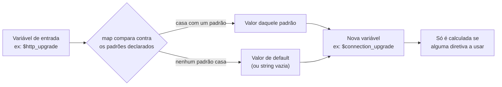
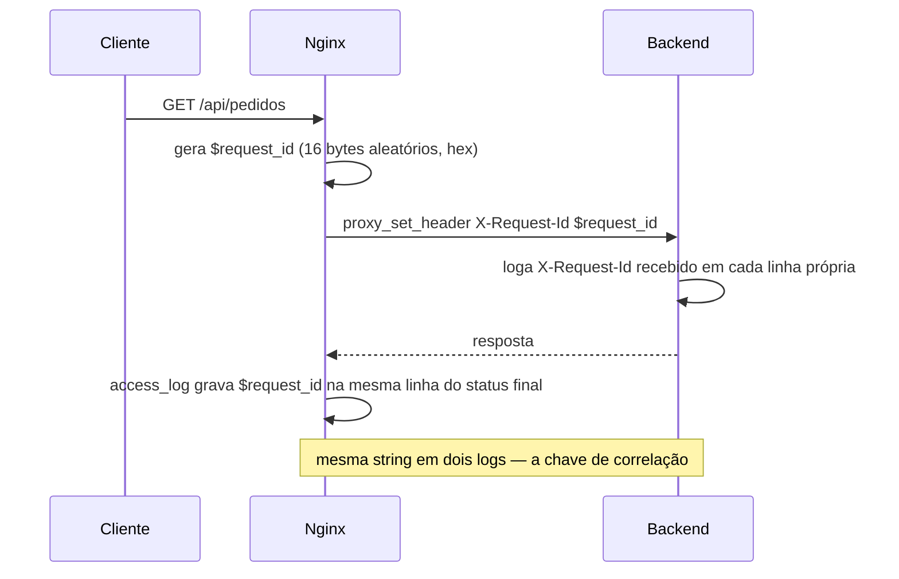

# 12 — Variáveis, `map`, rewrite e logging

> [!abstract] TL;DR
> Uma configuração de Nginx que parece correta pode falhar de três jeitos silenciosos: um `rewrite` que religa a URI para o próprio `location` de origem entra num laço, estoura o teto de 10 redirecionamentos internos por request e devolve `500` com `rewrite or internal redirection cycle` no log de erro; um `access_log` de texto livre transforma "quantas requests de um IP deram 429 na última hora" numa sessão de `grep`/`awk` frágil, em vez de uma consulta; e uma cadeia de `if` dentro de `location`, por mais inofensiva que pareça, entra numa zona da documentação oficial marcada como tendo comportamento imprevisível, incluindo SIGSEGV documentado. As três armadilhas têm a mesma raiz: tratar `rewrite`, `if` e log como scripting imperativo livre, quando na verdade são peças de um motor declarativo e orientado a fases — o mesmo motor que a nota anterior deste galho mapeou fase por fase. Esta nota fecha o que falta: variáveis (o dado que amarra tudo), `map` (a tabela de decisão que substitui `if` na maioria dos casos), `rewrite` × `return` com suas flags exatas, e logging — incluindo a novidade de log de erro em JSON da 1.29.8, que veio com uma pegadinha de licenciamento que vale conhecer antes de depender dela.

Um caso comum: um time herda uma configuração com uma cadeia de seis `rewrite` dentro de um `location`, tentando normalizar variações de URL antigas — sem barra, com barra dupla, com maiúscula, com parâmetro de rastreamento embutido no path. Em algum ponto entre a quarta e a quinta regra, uma reescrita produz uma URI que bate de novo no mesmo `location` de origem, que aplica a mesma regra de novo, que produz a mesma URI de novo. O Nginx não trava — ele conta. Depois de dez idas e voltas pela fase `FIND_CONFIG`, ele desiste, devolve `500 Internal Server Error` ao cliente, e escreve exatamente uma linha no log de erro que ninguém tinha ido procurar até então, porque o sintoma parecia "aplicação quebrada", não "configuração se mordendo pelo rabo". Ninguém teria detectado esse laço lendo o bloco de cima para baixo — cada `rewrite` isolado parece correto, testado em separado contra a URI que motivou sua criação. É a interação entre eles, mediada pelo mecanismo exato de `last` e pelo laço `FIND_CONFIG → REWRITE → POST_REWRITE` que a nota anterior já nomeou, que produz o loop. Esta nota é o texto que falta ler antes de escrever a sexta regra de `rewrite`, não depois do primeiro 500 em produção.

A nota [[03-Dominios/Tecnologia/Infraestrutura/Nginx/05 - O ciclo de vida de uma request|05 — O ciclo de vida de uma request]] já estabeleceu onde `rewrite` de `server` roda (fase 2), onde `rewrite` de `location` roda (fase 4), como a fase 5 (`POST_REWRITE`) pode devolver a request para a fase 3, e onde o log de acesso roda (fase 11, na finalização, fora do percurso normal de fases). Esta nota não reabre esse mapa — ela assume que ele já está internalizado e cobre o que fica dentro de cada uma dessas caixas: o que de fato é uma variável do Nginx, como `map` constrói uma tabela de decisão a partir delas, por que `if` dentro de `location` é uma categoria à parte de risco documentado, a anatomia completa das flags de `rewrite`, e o que sai — e como sai — pelas duas portas de log, acesso e erro.

> [!info] Fronteira desta nota dentro do galho
> Diagnóstico de incidente ao vivo — reload gracioso, teto de descritores, `stub_status`, o catálogo de códigos de erro — fica na próxima nota, [[03-Dominios/Tecnologia/Infraestrutura/Nginx/13 - Tuning e diagnóstico|13 — Tuning e diagnóstico]]. Esta nota cobre só o material que sustenta o diagnóstico: as variáveis, a tabela de decisão, e os dois canais de log que qualquer investigação depois vai consultar. A observabilidade como ofício — o que logar, como correlacionar entre camadas, como decidir o que vira métrica — é assunto de [[03-Dominios/Engenharia/Operação/index|Engenharia/Operação]], não deste [[03-Dominios/Tecnologia/Infraestrutura/index|domínio de Infraestrutura]], cuja lente é sempre a ferramenta por dentro, nunca a prática de operá-la.

## O que é, de fato, uma variável do Nginx

Uma variável do Nginx — `$host`, `$request_id`, `$args`, uma criada por `map` ou por captura de regex — não é uma célula de memória preenchida uma vez no início da request e lida depois. Ela é avaliada sob demanda, no exato momento em que uma diretiva a referencia, o que amarra diretamente com o modelo de fases: uma variável referenciada por uma diretiva da fase `PREACCESS` é calculada quando aquela fase roda, não antes; uma variável referenciada só no `log_format`, usado na fase `LOG`, é calculada na finalização da request, o que é o motivo pelo qual variáveis como o tempo total de resposta ou o status final conseguem aparecer numa linha de log sem que nada precise "guardar" esses valores ao longo do caminho. Esse comportamento sob demanda também explica por que declarar um `map` custoso, mas nunca referenciar a variável resultante em lugar nenhum da configuração, não custa nada em tempo de request — a documentação do módulo `map` é explícita sobre isso, e a seção seguinte retoma o ponto com mais profundidade.

Vale nomear as variáveis mais úteis no dia a dia de depuração e roteamento, porque são as que aparecem com mais frequência em `log_format`, `map` e `proxy_set_header`: `$uri` (a URI normalizada, depois de decodificação percent-encoded e resolução de `.`/`..`, sem query string), `$request_uri` (a URI original completa, com query string, exatamente como o cliente enviou, sem nenhuma normalização); `$args` (a query string inteira) e `$arg_nome` (o valor de um parâmetro específico, como `$arg_status` para `?status=pendente`); `$remote_addr` (o endereço IP de quem conectou — já substituído por `realip`, se o módulo estiver ativo, como a nota anterior mostrou); `$status` (o código de status HTTP final da resposta); `$request_time` (o tempo total, em segundos com casas decimais, entre o primeiro byte da request lido e o último byte da resposta enviado); `$upstream_response_time` (o tempo que só o backend levou para responder, útil para separar lentidão de rede da lentidão de aplicação); e `$request_id`, a variável que a seção sobre correlação, mais adiante, desenvolve por inteiro.

| Variável | O que carrega | Fase típica de uso |
|---|---|---|
| `$uri` | Path normalizado, sem query string | `REWRITE`, `PRECONTENT`, `LOG` |
| `$request_uri` | Path original com query string, sem normalização | `LOG`, redirecionamentos que precisam preservar `?` |
| `$args` / `$arg_nome` | Query string inteira / um parâmetro isolado | `map`, condições dentro do `location` já escolhido |
| `$remote_addr` | IP do cliente, já substituído por `realip` se ativo | `PREACCESS` (chave de `limit_req`), `ACCESS`, `LOG` |
| `$binary_remote_addr` | O mesmo IP, em formato binário compacto | chave de `limit_req_zone`, mais barata em memória que a versão textual |
| `$status` | Código HTTP final da resposta | `LOG` — só existe depois que `CONTENT` terminou |
| `$request_time` | Tempo total da request, em segundos com decimais | `LOG` |
| `$upstream_response_time` | Tempo só do backend, separado do tempo total | `LOG`, diagnóstico de lentidão |
| `$http_upgrade` | Valor do header `Upgrade` enviado pelo cliente | entrada do `map` de WebSocket |
| `$request_id` | Identificador único de 16 bytes aleatórios, hex | `proxy_set_header`, `LOG`, correlação |

A chave `$binary_remote_addr`, usada como entrada de `limit_req_zone` na nota [[03-Dominios/Tecnologia/Infraestrutura/Nginx/11 - Limitar e comprimir|11 — Limitar e comprimir]], é um bom exemplo de por que existem duas variáveis para a mesma informação: `$remote_addr` é uma string legível (`"203.0.113.7"`), útil em log e em comparação humana; `$binary_remote_addr` é o mesmo endereço em formato binário compacto, mais barato de indexar dentro da zona de memória compartilhada que o `limit_req` usa — a escolha entre as duas nunca é estética, é sempre sobre onde a variável vai ser consumida.

### `$host` × `$http_host` × `$server_name`: três respostas para "qual é o domínio"

As três variáveis parecem sinônimos até a primeira vez que um proxy interno, um balanceador de carga ou um cliente malicioso manda um `Host` inesperado — e nesse momento a diferença entre elas decide se a configuração se comporta de forma previsível ou não. `$http_host` é o valor cru do header `Host` como o cliente o enviou — nenhuma normalização, nenhum fallback, e se o cliente não enviar `Host` nenhum (tecnicamente possível em HTTP/1.0), a variável fica vazia. `$server_name`, em contraste, não vem do cliente: é o nome do `server` block que de fato aceitou a request, o texto literal declarado em `server_name` na configuração — se aquela request caiu no `default_server` porque o `Host` enviado não bateu com nenhum `server_name` conhecido, `$server_name` reflete o nome desse bloco default, não o `Host` que o cliente mandou. `$host`, a variável mais usada na prática e a mais segura como padrão, resolve essa ambiguidade com uma ordem de precedência documentada: nome de host da linha de request (raro, mas válido em alguns clientes HTTP/1.1 antigos), senão o header `Host`, senão o `server_name` que casou — a primeira fonte disponível, nessa ordem exata, vence.

```nginx
server {
    listen 80 default_server;
    server_name _;

    location /debug-host/ {
        add_header X-Http-Host $http_host always;
        add_header X-Host $host always;
        add_header X-Server-Name $server_name always;
        return 200 "ok\n";
    }
}
```

Uma request com `curl -H "Host: qualquer-coisa.invalido" http://ip-do-servidor/debug-host/` contra essa configuração devolve `X-Http-Host: qualquer-coisa.invalido` (o que o cliente mandou, sem filtro), `X-Host: qualquer-coisa.invalido` (porque o header `Host` é a segunda fonte na ordem de precedência, e existe) e `X-Server-Name: _` (o nome literal declarado no bloco que aceitou, porque nenhum `server_name` real bateu com o `Host` recebido). É por isso que usar `$http_host` para montar um redirecionamento absoluto (`return 301 https://$http_host$request_uri;`) é uma prática arriscada — ela repete de volta ao cliente qualquer valor de `Host` que ele mandou, inclusive um forjado, o que abre uma classe de ataque conhecida como Host header injection quando esse valor refletido é usado para montar links ou comparar contra listas de confiança; `$host`, por já ter passado pela mesma lógica de resolução que decidiu qual `server` block atendeu a request, é a escolha mais segura na maioria dos usos — mas, num cenário com `default_server` respondendo qualquer `Host` desconhecido, `$host` ainda reflete o `Host` recebido (a segunda fonte da precedência), não o nome do bloco; só `$server_name` é imune a um `Host` arbitrário, porque vem inteiramente da configuração, nunca da request.

A semântica do próprio header `Host` — por que ele existe, o que HTTP/1.1 exige dele, e sua relação com hospedagem virtual — pertence à camada de protocolo, coberta pela nota [[03-Dominios/Ciência/Redes e Protocolos/06 - HTTP - métodos, status e headers|HTTP — métodos, status e headers]]; o que esta seção cobre é só o que o Nginx faz com esse header depois de recebido — as três variáveis que derivam dele, e as diferenças de confiança entre elas.

## `map`: a tabela de decisão que substitui a cadeia de `if`

A diretiva `map` cria uma variável nova cujo valor depende do valor de uma variável de entrada, comparada contra uma lista de padrões — na prática, uma tabela de tradução, resolvida uma vez por request, no bloco `http`. A sintaxe básica associa a variável de entrada, o nome da variável nova, e um bloco de pares `padrão → valor`:

```nginx
http {
    map $http_user_agent $eh_bot {
        default        0;
        "~*bot|crawl|spider" 1;
    }

    server {
        location /api/ {
            if ($eh_bot) {
                return 403;
            }
        }
    }
}
```

A entrada `default` fixa o valor usado quando nenhum padrão bate; quando `default` não é declarada, o valor padrão é uma string vazia. O parâmetro `hostnames`, quando presente, permite que os padrões da esquerda sejam nomes de host com máscara de prefixo ou sufixo (`*.exemplo.com`, `exemplo.*`), o que é o uso típico de `map` para decidir comportamento por subdomínio sem escrever uma regex de hostname à mão. Desde a versão 0.9.6, os valores de entrada também podem ser expressões regulares — bastando prefixar o padrão com `~` (sensível a caixa) ou `~*` (insensível a caixa), o mesmo par de modificadores que a nota [[03-Dominios/Tecnologia/Infraestrutura/Nginx/04 - location e a tabela de precedência|04 — location e a tabela de precedência]] já apresentou para `location` — e essas regex também podem carregar capturas nomeadas ou posicionais, reaproveitáveis depois no mesmo bloco.

O detalhe de desempenho que vale reter, porque muda a forma de pensar sobre quantos `map` declarar: a documentação oficial afirma que, como variáveis do Nginx só são avaliadas quando usadas, a simples declaração de um `map` — mesmo um grande, com dezenas de entradas — não adiciona custo nenhum ao processamento de uma request que nunca referencia a variável resultante. Isso é o inverso do que a intuição de outras linguagens sugere: numa linguagem imperativa, uma tabela grande carregada na inicialização tem um custo fixo de memória e, às vezes, de construção. Num `map` do Nginx, o custo só existe no momento em que alguma diretiva, em algum `server` ou `location`, de fato lê a variável — e mesmo aí, o custo é o de uma comparação de string ou regex contra a tabela, não o de percorrer toda a configuração.



O `map` de `Connection` para WebSocket, já usado sem explicação na nota [[03-Dominios/Tecnologia/Infraestrutura/Nginx/07 - Proxy reverso|07 — Proxy reverso]], é o exemplo canônico do mecanismo:

```nginx
map $http_upgrade $connection_upgrade {
    default upgrade;
    ''      close;
}
```

A variável de entrada é `$http_upgrade` — o header `Upgrade` que o cliente enviou, vazio quando a request é HTTP comum. A tabela tem só duas entradas: a string vazia `''` mapeia para `close`, e o `default` — tudo que não for string vazia, ou seja, qualquer valor real de `Upgrade` — mapeia para `upgrade`. Repare que a ordem das duas linhas no bloco não importa: `map` não é uma cadeia de `if`/`else if` avaliada sequencialmente até a primeira que bate — é uma tabela de busca, e a entrada mais específica (`''`, uma string literal) sempre tem precedência implícita sobre `default`, que é só o catch-all para o que sobrar. É essa diferença de modelo — tabela de busca contra script sequencial — que torna `map` mais barato de raciocinar sobre do que uma cadeia de `if`, mesmo quando o número de casos cresce: adicionar uma décima primeira entrada a um `map` não muda o comportamento de nenhuma das dez anteriores, porque cada entrada é independente; adicionar um décimo primeiro `if` a uma cadeia pode, dependendo de onde ele entra, mudar o que os anteriores decidiam, porque `if`/`else` é sequencial por construção.

Um segundo exemplo, comum em bordas que precisam decidir comportamento por ambiente sem duplicar `server` blocks inteiros — um `map` sobre o próprio `$host`, produzindo o nome de um upstream diferente por subdomínio:

```nginx
map $host $backend_pool {
    hostnames;

    default          producao_upstream;
    staging.exemplo.com   staging_upstream;
    *.dev.exemplo.com     dev_upstream;
}

server {
    listen 443 ssl;
    server_name exemplo.com staging.exemplo.com *.dev.exemplo.com;

    location / {
        proxy_pass http://$backend_pool;
    }
}
```

Um único `server` block, um único `location`, decidindo o upstream de destino via `map` em vez de replicar o bloco inteiro três vezes só para trocar o valor de `proxy_pass` — e a manutenção de "qual subdomínio vai para qual pool" concentrada numa tabela, não espalhada em três blocos que precisam ser mantidos em sincronia manualmente.

## Por que `if` dentro de `location` é uma categoria à parte de risco

A [wiki oficial do Nginx sobre o tema](https://www.nginx.com/resources/wiki/start/topics/depth/ifisevil/) — cujo título, sem meio-termo, é "If is Evil… when used in location context" — abre com a frase que resume o problema inteiro: *"Directive if has problems when used in location context, in some cases it doesn't do what you expect but something completely different instead. In some cases it even segfaults."* A mesma página declara que as únicas duas coisas seguras dentro de um `if` em contexto de `location` são `return ...;` e `rewrite ... last;` — qualquer outra diretiva dentro daquele bloco *"may possibly cause unpredictable behaviour, including potential SIGSEGV"*.

A explicação que a própria página dá para a origem do problema é estrutural, não um bug isolado a ser corrigido numa versão futura: a diretiva `if` é parte do módulo de `rewrite`, que avalia instruções de forma imperativa — uma sequência de passos, executada em ordem —, enquanto o resto da configuração do Nginx é fundamentalmente declarativo — um conjunto de diretivas associadas a fases fixas, sem noção de "executar em sequência" no sentido de um script. Em algum momento, por demanda de usuários, o Nginx passou a permitir diretivas não pertencentes ao módulo de `rewrite` dentro de um bloco `if` — e essa mistura entre um modelo imperativo (o `if`) hospedando diretivas de um modelo declarativo (o resto) é o que produz comportamento inconsistente. A própria página nota que a inconsistência não é aleatória: para uma mesma request repetida, o comportamento é sempre o mesmo — mas o comportamento em si pode não ser o que a leitura do bloco sugere, porque cada `if` cria, por baixo dos panos, um contexto de `location` implícito e aninhado, e certas diretivas não herdam corretamente desse contexto criado às pressas.

A página documenta, como exemplos concretos e reproduzíveis, cinco armadilhas: dois `if` idênticos no mesmo bloco, cada um com um `add_header` diferente, produzem só o segundo `add_header` na resposta — o primeiro simplesmente desaparece; um `proxy_pass` com URI, seguido de um `if` vazio (sem `return` nem `rewrite` dentro), faz a request chegar ao backend sem a reescrita de path que o `proxy_pass` deveria ter aplicado; um `try_files` seguido do mesmo tipo de `if` vazio simplesmente deixa de funcionar; um `if` colocado antes de um `fastcgi_pass`, com um segundo `if` logo depois sem handler nenhum dentro, provoca um SIGSEGV documentado — o worker process trava; e um `location` de regex com captura nomeada, usada num `alias`, para de funcionar corretamente se um `if` for adicionado ao mesmo bloco, porque a captura não é herdada de forma correta pelo contexto implícito que o `if` cria.

A recomendação prática que a própria página resume, e que vale registrar como regra de bolso: usar `try_files` quando ele resolver o problema (a próxima seção deste galho, coberta na nota 06, é o lugar certo para esse padrão); usar `return` ou `rewrite ... last` quando a decisão for simplesmente "responda X" ou "redirecione para Y"; e, para os casos genuinamente sem alternativa — testar uma variável sem diretiva equivalente —, mover o `if` para o nível de `server`, onde só diretivas do próprio módulo de `rewrite` são permitidas, o que elimina a mistura de modelos que causa o problema em primeiro lugar. A página cita, como padrão seguro para trocar de `location` a partir de uma condição, a combinação de `error_page` com um código customizado e `recursive_error_pages on;`:

```nginx
location / {
    error_page 418 = @outro;
    recursive_error_pages on;

    if ($algo_de_negocio) {
        return 418;
    }

    proxy_pass http://app_upstream;
}

location @outro {
    proxy_pass http://app_alternativo;
}
```

Esse padrão funciona porque `return 418;` é uma das duas operações seguras dentro de `if`, e o `error_page 418 = @outro;` transforma esse código de status interno (nunca visto pelo cliente, porque `=` troca a URI antes de qualquer resposta sair) num redirecionamento interno para um `location` nomeado — o mesmo mecanismo de redirecionamento interno que a nota anterior já descreveu para `error_page`, aqui reaproveitado como forma segura de ramificar a lógica de roteamento sem depender de diretivas arbitrárias dentro de um `if`.

## `rewrite` × `return`: quando cada um, e a tabela das flags

`return` e `rewrite` resolvem problemas parecidos — mudar o destino ou o corpo de uma resposta — por caminhos radicalmente diferentes. `return` encerra o processamento imediatamente com um status e, opcionalmente, um corpo de texto ou uma URL de redirecionamento; não reescreve a URI da request corrente, não reabre nenhuma fase, e é a operação mais barata das duas — coerente com ser uma das únicas seguras dentro de `if`. `rewrite` reescreve a URI da request usando uma expressão regular com grupos de captura, e — dependendo da flag usada — pode religar o ciclo de fases inteiro, fazendo a request percorrer `FIND_CONFIG` de novo com a URI nova, como a nota anterior já descreveu para o laço `REWRITE → POST_REWRITE → FIND_CONFIG`. A regra prática mais simples: se a necessidade é só "responda isto" ou "redirecione para uma URL fixa", `return` resolve com menos custo e menos superfície de comportamento inesperado; se a necessidade é "transforme esta URI, preservando partes dela, e deixe o resto do sistema de `location` decidir o que fazer com o resultado", `rewrite` é a ferramenta certa.

```nginx
# return — mais barato, sem reescrever URI, sem reabrir fases
location = /old-page {
    return 301 /new-page;
}

# rewrite — reescreve a URI usando captura, pode reabrir FIND_CONFIG
location /blog/ {
    rewrite ^/blog/(\d{4})/(\d{2})/(.*)$ /posts/$1-$2-$3 last;
}
```

A documentação do `ngx_http_rewrite_module` define as quatro flags de `rewrite` com precisão que vale citar, não parafrasear: `last` *"stops processing the current set of ngx_http_rewrite_module directives and starts a search for a new location matching the changed URI"*; `break` *"stops processing the current set of ngx_http_rewrite_module directives as with the break directive"* — para o processamento de `rewrite` daquele bloco, mas **sem** disparar a nova busca de `location`; `redirect` devolve um redirecionamento temporário com código **302**, usado quando a string de substituição não começa com `http://`, `https://` ou `$scheme`; `permanent` devolve um redirecionamento **301**. E existe uma regra que passa por cima das quatro flags: se a própria string de substituição começa com `http://`, `https://` ou `$scheme`, o processamento para ali mesmo e o redirecionamento é devolvido ao cliente — independente de qual flag foi declarada, ou mesmo se nenhuma foi.

| Flag | Efeito sobre o processamento | Reabre `FIND_CONFIG`? | Resposta ao cliente |
|---|---|---|---|
| `last` | Para o processamento de `rewrite` daquele bloco | Sim — busca novo `location` com a URI mudada | Nenhuma direta; segue o ciclo internamente |
| `break` | Para o processamento de `rewrite` daquele bloco | Não — segue no mesmo `location`, URI já mudada | Nenhuma direta; segue o ciclo internamente |
| `redirect` | Interrompe e devolve resposta imediatamente | Não se aplica — a request termina ali | `302`, só se a substituição não começar com `http(s)://`/`$scheme` |
| `permanent` | Interrompe e devolve resposta imediatamente | Não se aplica — a request termina ali | `301` |

A diferença entre `last` e `break` é a que mais confunde na prática, porque as duas "param" alguma coisa, mas param coisas diferentes: `last` para o processamento local e delega a decisão de `location` para uma nova rodada de `FIND_CONFIG` — útil quando a URI reescrita pertence, de fato, a outro bloco, talvez até com sua própria cadeia de `rewrite`; `break` para o processamento local e mantém a request no mesmo `location`, com a URI já modificada, seguindo direto para `PREACCESS` — útil quando a intenção é só normalizar a URI antes de servir conteúdo dentro do mesmo bloco, sem reabrir a busca. Usar `last` onde `break` bastaria não costuma quebrar nada sozinho, mas adiciona uma rodada inteira de `FIND_CONFIG` desnecessária a cada request; usar `break` onde a intenção era religar para outro `location` produz o sintoma clássico de "a reescrita aconteceu, mas o bloco errado respondeu" — a URI mudou, mas a decisão de qual `location` processa ela ficou congelada na escolha original.

O laço de redirecionamento interno que abriu esta nota tem um limite explícito e documentado: **10 redirecionamentos internos por request**. Ao estourar esse teto, o Nginx devolve `500 Internal Server Error` e grava, no log de erro, a mensagem `rewrite or internal redirection cycle` — a nota anterior já nomeou esse mecanismo em detalhe; aqui vale só reter que uma cadeia de `rewrite ... last;` mal desenhada, em que a URI de saída de uma regra volta a bater no `location` de entrada de outra, é a causa mais comum desse erro, e que aumentar o número de regras de `rewrite` sem desenhar deliberadamente o grafo de para onde cada uma aponta é a forma mais confiável de reproduzi-lo em produção.

### Capturas de regex dentro do `rewrite`

A nota [[03-Dominios/Tecnologia/Infraestrutura/Nginx/04 - location e a tabela de precedência|04 — location e a tabela de precedência]] já mostrou que uma regex de `location`, desde a versão 0.7.40, pode declarar grupos de captura reaproveitáveis dentro do mesmo bloco. `rewrite` usa exatamente o mesmo mecanismo de captura de regex, só que a extração e a reconstrução da URI acontecem na própria diretiva, via `$1`, `$2`, ... (captura posicional) ou `$nome` (captura nomeada), referenciados na string de substituição:

```nginx
location ~ ^/loja/(?<slug>[a-z0-9-]+)/produto/(?<id>\d+)$ {
    rewrite ^ /catalogo/produto.php?slug=$slug&id=$id last;
}
```

Uma request para `/loja/casa-e-jardim/produto/4821` casa com a regex do `location`, captura `slug=casa-e-jardim` e `id=4821`, e o `rewrite` reconstrói a URI usando essas mesmas capturas — sem nenhuma diretiva adicional de extração. O padrão `^` como origem do `rewrite` (em vez de uma regex própria) é comum quando a única finalidade da regra é reformular a URI usando capturas que o próprio `location` já extraiu: `^` bate com qualquer string, então a regra roda sempre que o bloco é alcançado, e todo o trabalho de decidir "esta request se aplica?" já foi feito pela regex do `location`, não precisa ser repetido dentro do `rewrite`.

## `try_files` × `rewrite`: quando cada um

A nota [[03-Dominios/Tecnologia/Infraestrutura/Nginx/06 - Servir arquivos estáticos|06 — Servir arquivos estáticos]] já cobriu `try_files` em profundidade — a mecânica de fallback, o parâmetro final tratado como URI interna ou como `location` nomeado, o padrão de SPA. O que vale registrar aqui é só a fronteira de decisão entre os dois: `try_files` testa a **existência de arquivos no disco**, em sequência, e decide o que servir com base no que existe de fato — é a ferramenta certa para "sirva este arquivo se existir, senão aquele outro, senão caia num fallback"; `rewrite` transforma a **URI**, sem tocar no sistema de arquivos, e não sabe nem se importa se o resultado da transformação corresponde a algo que existe. Confundir os dois produz configurações redundantes ou, pior, contraditórias: usar `rewrite` para tentar simular fallback de arquivo ("se não existir, reescreva para outra URI") exige checar existência de arquivo dentro de uma regra de `rewrite` — o que a diretiva não faz nativamente — enquanto `try_files` já resolve isso de forma nativa e mais barata, porque o teste de existência é parte do próprio mecanismo, não uma condicional adicional.

```nginx
# Errado — tentando simular fallback com rewrite, sem checar existência
rewrite ^/app/(.*)$ /app/index.html last;

# Certo — try_files testa o disco antes de decidir
location /app/ {
    try_files $uri $uri/ /app/index.html;
}
```

A regra prática: se a decisão depende de "este caminho existe no disco?", é `try_files`; se a decisão depende de "esta URI precisa virar outra URI, sem relação com o que existe no disco" — uma migração de rota, uma normalização de path, uma extração de parâmetros via captura —, é `rewrite`. Os dois convivem sem conflito no mesmo `location`, cada um resolvendo a parte do problema que lhe cabe — como o exemplo trabalhado da nota anterior já mostrou, com `rewrite` de `server` normalizando `/painel` para `/painel/` antes mesmo de qualquer `location` ser escolhido, e `try_files`, já dentro do `location /painel/`, decidindo o fallback de arquivo depois que todo o controle de acesso já aprovou a request.

## Logging: `log_format`, `access_log` e a amostragem

A diretiva `log_format` define o layout de uma linha de log, referenciada depois por `access_log`. O parâmetro **`escape`**, com valores `default`, `json` ou `none`, existe desde a versão **1.11.8** e decide como caracteres especiais dentro dos valores de variável são tratados: com `escape=default` (o padrão), aspas, barras invertidas e caracteres de controle são escapados como `\xXX`; com `escape=json`, a saída já é válida como string JSON — aspas e barras invertidas viram `\"` e `\\`, caracteres de controle viram sequências como `\n`, `\r`, `\t`. Sem `log_format` declarado, o Nginx usa o formato padrão `combined`, herdado do Apache por convenção histórica:

```nginx
log_format combined '$remote_addr - $remote_user [$time_local] '
                     '"$request" $status $body_bytes_sent '
                     '"$http_referer" "$http_user_agent"';
```

Um `log_format` em JSON, usando `escape=json`, transforma cada linha de acesso numa estrutura já pronta para um pipeline de agregação de log — Loki, Elasticsearch, CloudWatch Logs Insights — sem precisar de um parser de regex para extrair campos de uma linha de texto livre:

```nginx
log_format json_combined escape=json '{'
    '"time":"$time_iso8601",'
    '"remote_addr":"$remote_addr",'
    '"request_id":"$request_id",'
    '"method":"$request_method",'
    '"uri":"$uri",'
    '"status":$status,'
    '"body_bytes_sent":$body_bytes_sent,'
    '"request_time":$request_time,'
    '"upstream_response_time":"$upstream_response_time",'
    '"http_referer":"$http_referer",'
    '"http_user_agent":"$http_user_agent"'
'}';

access_log /var/log/nginx/access.json.log json_combined;
```

A diferença prática entre esse formato e o `combined` de texto não é estética: um campo como `status` ou `request_time`, em JSON, é consultável diretamente — "todas as linhas com `status >= 500` e `request_time > 2`" é uma query, não uma expressão regular contra texto solto; a mesma pergunta contra um log em `combined` exige extrair campos por posição ou por regex antes de sequer começar a filtrar. O custo é maior verbosidade por linha — mais bytes por request, mais I/O de disco por volume de tráfego — o que é exatamente o que os parâmetros de buffer da próxima seção existem para mitigar.

`access_log` aceita, além do path e do formato, quatro parâmetros que decidem o **quando** e o **quanto** de cada escrita: `buffer=tamanho` define o tamanho do buffer de memória usado antes de gravar em disco — o Nginx acumula linhas de log ali e só escreve quando o buffer enche, quando dados antigos demais esperam havia tempo suficiente, ou na reabertura/encerramento do worker; `gzip[=nível]` comprime os dados bufferizados antes de escrever, reduzindo I/O ao custo de CPU; `flush=tempo` limita havia quanto tempo dados podem ficar no buffer antes de serem forçados a disco, mesmo sem o buffer estar cheio; e **`if=condição`** habilita log condicional — a request não é registrada quando a condição avalia para `"0"` ou string vazia.

```nginx
map $request_uri $skip_healthcheck_log {
    default         0;
    "/healthz"      1;
    "/metrics"      1;
}

access_log /var/log/nginx/access.log json_combined buffer=64k flush=5s if=$skip_healthcheck_log_inverso;
```

Vale a correção de raciocínio nesse exemplo: `if=` não loga quando a condição é verdadeira — não loga quando ela é `"0"` ou vazia; para "não logar health check", a variável de controle precisa carregar `0` justamente nas requests que **devem** ser logadas, e um valor não-zero nas que devem ser puladas seria o oposto do que a diretiva espera. A forma correta, exemplificada de fato pela documentação, inverte a lógica: a variável precisa ser vazia ou `"0"` exatamente nas requests que **não** devem gerar log —

```nginx
map $request_uri $loggable {
    default         1;
    "/healthz"      0;
    "/metrics"      0;
}

access_log /var/log/nginx/access.log json_combined if=$loggable;
```

Com esse `map`, uma request para `/healthz` produz `$loggable = 0`, e `access_log ... if=$loggable;` não escreve nada — o volume de log de um health check consultado a cada poucos segundos por um load balancer nunca chega a competir por I/O com o log de tráfego real. É o mesmo mecanismo de tabela de decisão da seção anterior, aplicado agora a uma pergunta binária de "logar ou não", em vez de "que valor de header propagar".

## O log de erro em JSON — e a pegadinha de licenciamento

A diretiva `error_log` tem a forma `error_log file [level] [json];`, com padrão `error_log logs/error.log error;` quando nada é declarado. Os níveis aceitos, em ordem crescente de severidade, são `debug`, `info`, `notice`, `warn`, `error`, `crit`, `alert`, `emerg` — declarar um nível faz o Nginx registrar aquele nível e todos os mais severos; o padrão `error` registra `error`, `crit`, `alert` e `emerg`, silenciando `debug`, `info`, `notice` e `warn`.

> [!info] Baseline de versão — log de erro em JSON, 1.29.8
> O parâmetro **`json`** de `error_log` *"enables writing a log in the JSON format, with support for context tags"*, e apareceu na versão **1.29.8**. É uma mudança relevante porque fecha uma assimetria antiga: o log de acesso tinha suporte a JSON (via `escape=json` em `log_format`) desde a **1.11.8**, quase uma década antes — o log de erro, até a 1.29.8, era sempre texto livre, com o formato de cada mensagem decidido internamente por cada módulo, sem estrutura consultável. A saída documentada em JSON carrega os campos `level`, `timestamp`, `pid`, `tid`, `cnum`, `msg`, `client`, `server`, `request`, `upstream`, `errno` e `errtext`. Uma linha não pode exceder 2 KB — dados além desse limite são truncados, com um marcador `"truncated":1`; logging de `debug` não é suportado em formato JSON.

```nginx
error_log /var/log/nginx/error.json.log warn json;
error_log_tag request_id $request_id;
```

Vale a ressalva honesta antes de depender dessa novidade em produção: tanto o parâmetro **`json`** de `error_log` quanto a diretiva **`error_log_tag`** — que define uma tag de contexto adicional para as mensagens do log de erro, também introduzida na **1.29.8** — são explicitamente marcados, na documentação oficial, como **disponíveis apenas como parte da assinatura comercial da F5/NGINX** (NGINX Plus), não do binário open source que este galho inteiro descreve. É uma distinção que muda a forma de planejar em torno dessa mudança: o log de acesso em JSON (`log_format ... escape=json;`) continua sendo um recurso do Nginx open source, disponível desde a 1.11.8, sem custo de licença; o log de erro em JSON, apesar de resolver exatamente o mesmo tipo de problema — texto livre versus estrutura consultável — do lado do erro, é um recurso pago. Quem opera só a variante open source e precisa estruturar o log de erro continua dependendo de um coletor externo (Fluent Bit, Vector, Logstash) para parsear o texto livre padrão e reestruturá-lo fora do Nginx — a mesma solução que já era necessária antes da 1.29.8 existir.

| Recurso | Desde | Camada | Disponível no OSS? |
|---|---|---|---|
| `log_format ... escape=json` (log de acesso) | 1.11.8 | `ngx_http_log_module` | Sim |
| `access_log ... if=` (log condicional) | 1.7.0 | `ngx_http_log_module` | Sim |
| `error_log file level json` (log de erro em JSON) | 1.29.8 | core | Não — assinatura comercial |
| `error_log_tag` (tag de contexto no log de erro) | 1.29.8 | `ngx_http_core_module` | Não — assinatura comercial |

A tabela deixa visível o motivo de tratar a novidade da 1.29.8 com cautela em vez de empolgação automática: ela fecha uma lacuna real — texto livre no log de erro sempre foi mais difícil de consultar do que o log de acesso estruturado — mas fecha essa lacuna só para quem já paga pela assinatura da F5. Para o restante da base de instalações, rodando o binário open source que este vault descreve em todas as outras quinze notas do galho, o log de erro continua sendo texto livre, e a estrutura precisa ser imposta por fora, num coletor de log a jusante.

## `$request_id` propagado: o mecanismo de correlação

`$request_id` é *"unique request identifier generated from 16 random bytes, in hexadecimal"*, disponível desde a versão **1.11.0** — um identificador único por request, gerado internamente pelo Nginx, sem depender de nenhum header enviado pelo cliente. O mecanismo de correlação mais simples e mais usado consiste em duas metades: propagar esse identificador para o backend via header, e incluí-lo em ambos os logs, o de acesso e — quando disponível — o de erro.

```nginx
log_format json_combined escape=json '{'
    '"request_id":"$request_id",'
    '"status":$status,'
    '"uri":"$uri"'
'}';

server {
    location /api/ {
        proxy_set_header X-Request-Id $request_id;
        proxy_pass http://api_upstream;

        access_log /var/log/nginx/access.json.log json_combined;
    }
}
```

Com `proxy_set_header X-Request-Id $request_id;`, o backend recebe o mesmo identificador que o Nginx gravou na sua própria linha de log — se a aplicação, por sua vez, também logar `X-Request-Id` recebido em cada linha que ela mesma escreve, uma única busca por esse valor, em qualquer sistema de agregação de log, reconstrói o caminho inteiro de uma request específica: a linha do Nginx (URI, status, tempo total) e a linha da aplicação (o que ela fez com aquela request, que consultas rodou, que erro talvez tenha capturado). É um mecanismo simples — um valor gerado uma vez, repassado por header, ecoado em log dos dois lados —, mas é o alicerce sobre o qual qualquer sistema de correlação mais sofisticado se apoia, incluindo tracing distribuído com múltiplos serviços encadeados.

Vale a fronteira explícita: o que esta seção descreve é só o mecanismo do Nginx — gerar um identificador, propagá-lo, logá-lo. A **prática** de observabilidade construída em cima disso — padronizar esse identificador (ou substituí-lo por um trace ID de formato W3C Trace Context), correlacionar entre múltiplos serviços numa cadeia de chamadas, agregar e consultar esses logs em escala, decidir o que vira métrica e o que vira log — é ofício de [[03-Dominios/Engenharia/Operação/index|Engenharia/Operação]], não deste galho. Aqui fica só a peça que o Nginx contribui para essa cadeia: um identificador confiável, gerado sem depender do cliente, disponível para qualquer diretiva que precise dele.



## Checklist mental antes de escrever um `rewrite ... last;`

Vale fechar a seção de `rewrite` com uma sequência curta de perguntas, no mesmo espírito do checklist que a nota anterior deste galho já deixou para prever qual `location` responde a uma request — aqui aplicado especificamente a prever se uma regra de `rewrite` vai religar o ciclo de forma segura ou vai abrir a porta para um laço.

1. **A URI produzida por esta regra pode, ela mesma, bater na condição de origem da regra?** Se sim, existe um laço potencial — a regra precisa de uma condição de saída, ou de `break` em vez de `last`.
2. **Esta regra precisa mesmo reabrir `FIND_CONFIG`, ou só precisa mudar a URI dentro do `location` atual?** Se a segunda opção for suficiente, `break` evita o custo de uma nova busca a cada request.
3. **Existe algum outro `rewrite`, em outro `location` do mesmo `server`, cuja URI de saída aponta de volta para o `location` desta regra?** Um laço raramente é obra de uma única regra isolada — é mais comum ser a interação entre duas ou mais regras, cada uma correta quando lida sozinha.
4. **A substituição começa com `http://`, `https://` ou `$scheme`?** Se sim, nenhuma flag importa — o Nginx já vai interromper e devolver um redirecionamento ao cliente, então declarar `last` ou `break` ali é irrelevante na prática.
5. **Este `rewrite` está tentando simular um teste de existência de arquivo?** Se sim, a ferramenta errada foi escolhida — a resposta certa é `try_files`, não uma cadeia de `rewrite` tentando adivinhar o que existe no disco.

## Dois cenários de produção que combinam as três peças

Vale sair dos exemplos isolados e ver `map`, `rewrite` e logging decidindo, juntos, o resultado de duas situações comuns — um rollout gradual de versão nova e uma investigação de incidente que depende só de log estruturado, sem acesso a `debug`.

### Canary release decidido por `map`, sem tocar em código de aplicação

Um time quer expor uma versão nova de um serviço para 10% do tráfego, mantendo os outros 90% na versão estável, sem alterar a aplicação nem depender de um recurso de canary do orquestrador — só com o que o Nginx já oferece. A base é um `map` sobre uma variável com distribuição suficientemente uniforme, como `$remote_addr`, combinada com a função de hash consistente que o próprio módulo `split_clients` implementa para esse propósito:

```nginx
split_clients "${remote_addr}${http_user_agent}" $variante {
    10%     canary;
    *       estavel;
}

map $variante $upstream_pool {
    canary   canary_upstream;
    estavel  estavel_upstream;
}

log_format canary_log escape=json '{'
    '"request_id":"$request_id",'
    '"variante":"$variante",'
    '"status":$status,'
    '"upstream_response_time":"$upstream_response_time"'
'}';

server {
    location /app/ {
        proxy_pass http://$upstream_pool;
        add_header X-Variante $variante always;
        access_log /var/log/nginx/canary.json.log canary_log;
    }
}
```

`split_clients` não é `map`, mas resolve um problema vizinho — distribuir requests entre grupos por uma proporção declarada, usando hash da string de entrada em vez de comparação contra padrões — e o resultado dele alimenta um `map` comum para decidir o `upstream_pool` de destino. O `log_format` grava a variante em cada linha, o que transforma "o canary está errando mais que a versão estável?" numa consulta filtrando por `variante` e agregando `status`, em vez de uma investigação manual sobre qual fração do tráfego foi de fato afetada.

### Investigação de incidente com log estruturado, sem `debug` habilitado

Um 502 esporádico aparece em produção, sem padrão óbvio de horário nem de rota — e a equipe não quer (nem deveria, por padrão) rodar `error_log ... debug;` em produção pelo custo que a nota seguinte deste galho detalha. O caminho viável é reconstruir o padrão a partir do `access_log` já estruturado, cruzando `request_id`, `upstream_addr` (qual instância de backend, dentro do pool, atendeu aquela request) e `upstream_response_time`:

```nginx
log_format incidente escape=json '{'
    '"time":"$time_iso8601",'
    '"request_id":"$request_id",'
    '"status":$status,'
    '"upstream_addr":"$upstream_addr",'
    '"upstream_status":"$upstream_status",'
    '"upstream_response_time":"$upstream_response_time",'
    '"uri":"$uri"'
'}';

access_log /var/log/nginx/incidente.json.log incidente;
```

Com `upstream_addr` e `upstream_status` gravados por linha, filtrar só as requests com `status=502` e agrupar por `upstream_addr` costuma revelar, em minutos, se o problema está concentrado numa única instância do pool (candidata a reinício ou remoção) ou distribuído por igual entre todas (sinal de um problema mais estrutural — timeout agressivo demais, ou o próprio upstream saturado). Nenhuma dessas duas variáveis exige `debug`; ambas já existem no vocabulário padrão de variáveis do módulo de proxy, só não aparecem no `combined` default — é o `log_format` customizado, não um nível de log mais verboso, que as torna visíveis.

## Armadilhas comuns

> [!warning] `rewrite ... last;` apontando de volta para o próprio `location` de origem
> **O que acontece:** uma cadeia de `rewrite` normaliza variações de URL, e uma das regras produz uma URI que, ao passar de novo por `FIND_CONFIG`, cai no mesmo `location` que a gerou — que aplica a mesma regra de novo, entrando num laço. **Por quê:** `last` sempre dispara uma nova busca de `location` a partir da URI reescrita; se essa busca reencontra o `location` de origem e a URI ainda casa com a condição do `rewrite`, o ciclo se repete até o teto de 10 redirecionamentos internos. **Como evitar:** desenhar deliberadamente, antes de escrever qualquer `rewrite ... last;`, o grafo de "esta regra produz uma URI que cai em qual `location`" — se a resposta for "o mesmo de onde ela saiu", trocar para `break` (sem reabrir a busca) ou reformular a condição para que a URI de saída nunca volte a casar com a mesma regra.

> [!warning] Usar `map` sem `default` e assumir que o valor padrão é sempre seguro
> **O que acontece:** um `map` sem entrada `default` produz string vazia para qualquer valor de entrada não previsto, e uma diretiva downstream que espera um valor não vazio (um nome de upstream, um código de status) recebe uma string vazia sem aviso nenhum. **Por quê:** quando `default` não é declarado, o valor padrão do `map` é uma string vazia — não um erro, não uma falha de configuração detectável por `nginx -t`, só um valor vazio silencioso. **Como evitar:** declarar `default` explicitamente em todo `map` cujo resultado alimenta uma diretiva que não tolera valor vazio, mesmo quando a expectativa é "isso nunca vai acontecer" — a lista de padrões de entrada raramente é tão exaustiva quanto parece no dia em que foi escrita.

> [!warning] Colocar `proxy_pass`, `fastcgi_pass` ou `add_header` dentro de um `if` em `location`
> **O que acontece:** um `add_header` some silenciosamente quando existe outro `if` idêntico no mesmo bloco; um `proxy_pass` com URI para de reescrever o path corretamente; em combinações com `fastcgi_pass`, o worker chega a sofrer SIGSEGV — comportamentos documentados oficialmente, não relatos avulsos. **Por quê:** `if` é parte do módulo de `rewrite`, que processa instruções de forma imperativa, dentro de uma configuração fundamentalmente declarativa; diretivas não pertencentes ao módulo de `rewrite`, hospedadas dentro de um `if`, herdam de forma inconsistente o contexto de `location` implícito que o `if` cria por baixo dos panos. **Como evitar:** restringir o corpo de qualquer `if` em `location` só a `return` e `rewrite ... last` — as duas únicas operações que a própria wiki oficial do Nginx classifica como seguras; para qualquer outra necessidade, usar `map`, mover a lógica para `server`, ou recorrer ao padrão `error_page` + `location` nomeado.

> [!warning] Confiar em `$http_host` para montar URLs devolvidas ao cliente
> **O que acontece:** um `return 301 https://$http_host$request_uri;`, ou um redirecionamento montado por `rewrite` com `$http_host`, reflete de volta ao cliente qualquer valor de `Host` que ele mandou — inclusive um forjado. **Por quê:** `$http_host` é o header `Host` cru, sem nenhuma validação contra a lista de `server_name` conhecidos; `$host`, em contraste, já passou pela mesma resolução que decidiu qual `server` block atendeu a request, ainda que também reflita o `Host` recebido quando ele bate com algum `server_name` (inclusive `default_server`). **Como evitar:** usar `$host` como padrão para montar qualquer URL devolvida ao cliente, e, em configurações expostas à internet sem `server_name` fixo conhecido, validar `Host` contra uma lista explícita antes de refleti-lo em qualquer resposta, redirecionamento ou header.

> [!warning] Habilitar `access_log` em JSON sem medir o custo de I/O em tráfego alto
> **O que acontece:** trocar `combined` por um `log_format` JSON verboso, sem `buffer`, `gzip` ou `flush`, aumenta perceptivelmente o I/O de disco em endpoints de volume alto, porque cada linha é maior e cada escrita é imediata. **Por quê:** sem `buffer=`, o Nginx grava cada linha de log individualmente; um formato JSON, por sua natureza mais verboso que o `combined` de texto plano, multiplica o número de bytes escritos por request, e a multiplicação por um volume alto de tráfego se transforma em I/O que compete com o resto do sistema. **Como evitar:** combinar `buffer=` e `flush=` no mesmo `access_log`, e usar `if=` para suprimir log de endpoints de alto volume e baixo valor informacional, como health checks e métricas — a combinação entre formato estruturado e escrita em lote é o que torna JSON viável em produção sem virar gargalo.

> [!warning] Assumir que o log de erro em JSON está disponível só por rodar uma versão 1.29.8 ou mais nova
> **O que acontece:** alguém atualiza o Nginx para uma versão recente, adiciona `json` à diretiva `error_log`, e a configuração falha ao carregar, ou o parâmetro é silenciosamente ignorado, dependendo do binário instalado. **Por quê:** o parâmetro `json` de `error_log` e a diretiva `error_log_tag` são recursos da assinatura comercial da F5/NGINX (NGINX Plus) — a versão do número (1.29.8) não é suficiente para saber se o recurso está disponível; o binário precisa ser o distribuído comercialmente, não o open source compilado a partir do código-fonte público. **Como evitar:** verificar a variante do binário (`nginx -V` costuma expor `nginx-plus` ou similar no build de assinatura comercial) antes de planejar em torno de log de erro estruturado; para a variante open source, estruturar o log de erro continua exigindo um coletor externo processando texto livre.

## Como explicar em inglês

> "Nginx variables are lazily evaluated — a variable only gets computed the moment some directive actually references it, which is why declaring a large `map` costs nothing if the resulting variable is never used. `map` builds a lookup table instead of a sequential chain: given an input variable, it matches against a list of patterns — strings, hostnames with wildcards, or regular expressions — and falls back to a `default` value when nothing matches; order inside the block doesn't matter the way it would in an `if`/`else` chain. `if` inside a `location` block is a documented risk, not folklore — the official wiki states plainly that the only two things safe to put inside it are `return` and `rewrite ... last`, because `if` belongs to the imperative rewrite module sitting inside an otherwise declarative configuration, and mixing the two produces inconsistent behavior, including a documented SIGSEGV case. `rewrite` with the `last` flag re-triggers location matching from scratch; `break` stops rewrite processing but keeps the same location; and there's a hard cap of ten internal redirects per request — cross it, and nginx returns a 500 with `rewrite or internal redirection cycle` in the error log. Error-log-as-JSON is a genuinely new capability as of 1.29.8, but it's gated behind the commercial NGINX Plus subscription — the open-source binary this whole track covers doesn't have it, even though access-log JSON has been free since 1.11.8."

| PT | EN |
|---|---|
| avaliação sob demanda | lazy evaluation |
| tabela de decisão | lookup table |
| cadeia de `if` | `if` chain |
| laço de redirecionamento interno | internal redirection cycle |
| assinatura comercial | commercial subscription |
| propagar o identificador de request | propagate the request identifier |
| amostrar / suprimir log | sample / suppress logging |
| gravação em buffer | buffered write |
| escapar caracteres | escape characters |
| correlação entre camadas | cross-layer correlation |

## O que vem a seguir

Com variáveis, `map`, `rewrite` e logging cobertos, falta uma última peça para fechar a fase Magus deste galho: o que fazer quando algo dá errado apesar de a configuração estar correta na letra — reload gracioso, o teto de descritores de arquivo, e o catálogo de códigos de erro que todo mundo já viu e poucos sabem diferenciar de cabeça (`502` × `504` × `413` × `499`). O `$request_id` que esta nota propagou para o backend é, também, a ferramenta central de correlação que a próxima nota usa para reconstruir o caminho de uma request específica através de logs e métricas durante um diagnóstico ao vivo.

- [[03-Dominios/Tecnologia/Infraestrutura/Nginx/13 - Tuning e diagnóstico|13 — Tuning e diagnóstico]] — reload gracioso, teto de descritores, `stub_status`, e o catálogo de códigos de erro.
- [[03-Dominios/Engenharia/Operação/index|Engenharia/Operação]] — onde a prática de observabilidade (tracing distribuído, correlação em produção, agregação de log em escala) mora de fato.

## Fontes

- **Nginx Docs** — [*Module ngx_http_rewrite_module*](https://nginx.org/en/docs/http/ngx_http_rewrite_module.html) — a fonte primária das flags `last`, `break`, `redirect`, `permanent`, o comportamento de substituição começando com `http://`/`https://`/`$scheme`, e a variável `$request_id` (1.11.0).
- **Nginx Docs** — [*Module ngx_http_log_module*](https://nginx.org/en/docs/http/ngx_http_log_module.html) — `log_format`, o parâmetro `escape` (1.11.8) e seus valores `default`/`json`/`none`, o formato `combined` padrão, e `access_log` com `buffer`, `gzip`, `flush` e `if`.
- **Nginx Docs** — [*Core module — `error_log`*](https://nginx.org/en/docs/ngx_core_module.html) — sintaxe e default de `error_log`, os oito níveis de log, e o parâmetro `json` (1.29.8), incluindo a nota de disponibilidade via assinatura comercial.
- **Nginx Docs** — [*Module ngx_http_core_module — `error_log_tag`*](https://nginx.org/en/docs/http/ngx_http_core_module.html#error_log_tag) — a diretiva `error_log_tag` (1.29.8), sua sintaxe e a mesma nota de disponibilidade comercial.
- **Nginx Docs** — [*Module ngx_http_map_module*](https://nginx.org/en/docs/http/ngx_http_map_module.html) — sintaxe de `map`, o parâmetro `default`, `hostnames`, suporte a regex desde a 0.9.6, e a nota sobre avaliação sob demanda não adicionar custo à declaração de variáveis não usadas.
- **Nginx Docs** — [*Module ngx_http_core_module — variáveis*](https://nginx.org/en/docs/http/ngx_http_core_module.html) — as definições de `$host` (ordem de precedência) e `$server_name`.
- **NGINX Wiki (F5)** — [*If is Evil… when used in location context*](https://www.nginx.com/resources/wiki/start/topics/depth/ifisevil/) — a fonte oficial do problema de `if` em `location`: as duas operações seguras (`return`, `rewrite ... last`), os cinco exemplos documentados de comportamento inesperado (incluindo SIGSEGV), a explicação estrutural (módulo imperativo dentro de configuração declarativa), e o padrão seguro com `error_page` + `location` nomeado.
- **Nginx Docs** — [*Module ngx_http_proxy_module*](https://nginx.org/en/docs/http/ngx_http_proxy_module.html) — o exemplo de `map $http_upgrade $connection_upgrade` para o upgrade de WebSocket, já referenciado sem explicação na nota 07 deste galho.
