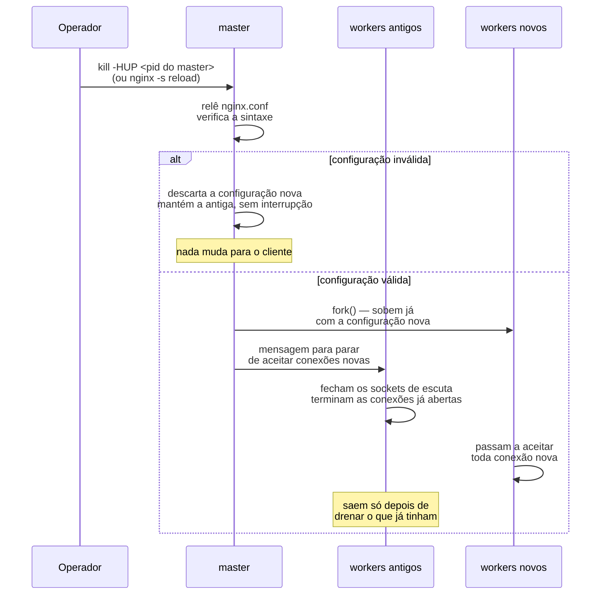
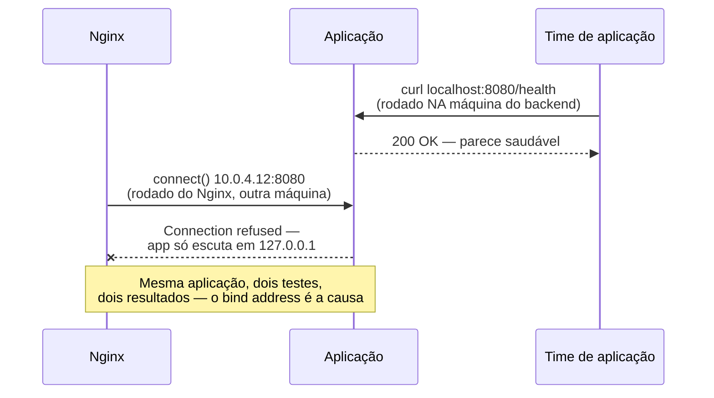

# 13 — Tuning e diagnóstico

> [!abstract] TL;DR
> Um 502 em produção às três da manhã, sem exceção nenhuma do lado da aplicação, é o tipo de sintoma que só o Nginx consegue explicar, porque só ele sabe se sequer chegou a falar com o backend. Esta nota fecha o galho com a mecânica que sustenta operar um Nginx vivo: `nginx -t`/`-T` antes de qualquer mudança, a mecânica exata do reload gracioso disparado por `HUP` — por que a configuração inválida nunca derruba a antiga, e por que os workers antigos convivem com os novos até drenar sozinhos —, a atualização de binário sem downtime via `USR2`/`WINCH`/`QUIT`, os níveis de `error_log` e o `stub_status` como janela para o estado interno de um worker, os limites reais de capacidade (`worker_connections`, `worker_rlimit_nofile`, o custo duplo do proxy), e um catálogo de erros — 502, 504, 499, 413, o laço de rewrite, `too many open files`, buffer de proxy pequeno demais — com o que cada um significa, onde olhar primeiro, e o que costuma ser a causa raiz.

São três da manhã, o alerta dispara: `myapp.exemplo.com` está devolvendo `502 Bad Gateway` para praticamente todas as requests. O time de aplicação já foi acionado e responde em minutos: nenhuma exceção, nenhum log de erro, nenhum deploy recente, os processos da aplicação estão de pé, saudáveis, respondendo normalmente a um `curl` local na própria máquina do backend. A suspeita natural — "algo quebrou na aplicação" — não bate com a evidência: se a aplicação estivesse de fato fora, o log dela teria alguma coisa a dizer sobre isso, e não tem nada. O que esse silêncio revela, embora ainda não pareça óbvio a quem está lendo o alerta pela primeira vez, é que o problema nunca chegou à aplicação — ele aconteceu na borda, entre o Nginx e o backend, num pedaço da requisição que nenhum log de aplicação jamais teria como registrar, porque a aplicação nunca a recebeu. Cenários assim, hipotéticos mas do tipo que se repete em qualquer operação de borda, são o fio condutor desta nota: cada seção resolve um pedaço do que separa "o Nginx está fazendo algo estranho" de saber exatamente o quê, e por quê.

Um segundo cenário, mais silencioso e mais insidioso, é o reload que "não pegou": alguém edita a configuração, roda `nginx -s reload` ou envia `HUP` ao master, e o comportamento antigo continua ali, como se nada tivesse mudado — sem erro visível, sem log estridente, só a sensação de estar gritando para um processo que não escuta. Os dois cenários — o 502 sem explicação e o reload fantasma — têm uma coisa em comum: os dois só se resolvem entendendo o que o Nginx faz por dentro quando ninguém está olhando, não adivinhando a partir do sintoma de fora. É essa lente que esta nota constrói, peça por peça.

## `nginx -t` e `nginx -T`: o primeiro comando, sempre

Antes de qualquer `reload`, existe um comando que nunca deveria ser pulado: `nginx -t` testa a configuração — lê todos os arquivos incluídos, valida a sintaxe, verifica se os caminhos referenciados existem — sem aplicar nada e sem tocar em nenhum processo vivo.

```bash
nginx -t
```

```
nginx: the configuration file /etc/nginx/nginx.conf syntax is ok
nginx: configuration file /etc/nginx/nginx.conf test is successful
```

Rodar `-t` antes de qualquer `reload` custa um segundo e elimina de vez a classe de incidente mais evitável de todas: recarregar uma configuração com erro de sintaxe e descobrir, minutos depois, que o `reload` silenciosamente não aplicou nada — o comportamento que a próxima seção desta nota explica em detalhe. O hábito certo é mecânico, não uma questão de julgamento: `nginx -t && nginx -s reload`, nunca o segundo comando isolado.

`nginx -T` (T maiúsculo) é um comando diferente, e resolve um problema diferente: ele despeja a configuração **inteira, já resolvida** — todo `include` expandido, todo caminho relativo resolvido contra o diretório de configuração, tudo num único fluxo de texto, na ordem em que o Nginx de fato a interpreta.

```bash
nginx -T | less
nginx -T | grep -A 5 "server_name minha-api"
```

É por isso que `-T` é, e deveria ser, o primeiro comando ao herdar um servidor Nginx alheio — o mesmo instinto que a nota [[03-Dominios/Tecnologia/Infraestrutura/Nginx/02 - A estrutura da configuração|02 — A estrutura da configuração]] já defendeu ao mostrar que uma diretiva herdada de um contexto pai pode estar escondida em qualquer um dos `include`s espalhados por `/etc/nginx/conf.d/`, `/etc/nginx/sites-enabled/`, ou qualquer convenção de organização que a distribuição ou o time anterior tenha adotado. Ler `nginx.conf` sozinho, sem `-T`, é ler um arquivo que quase nunca é o quadro completo — ele existe para incluir outros arquivos, não para conter a configuração inteira; `-T` é o único comando que garante enxergar exatamente o que o master vai aplicar, sem precisar seguir manualmente cada `include` e reconstruir a árvore de contextos de cabeça.

## A mecânica do reload gracioso

Esta é a seção central da nota, porque é a peça que separa quem sabe que o Nginx "recarrega sem downtime" de quem sabe **como**, exatamente, ele consegue isso — e o "como" é o que permite diagnosticar um reload que se comporta de forma inesperada, em vez de só reiniciar o serviço inteiro e torcer.

A nota [[03-Dominios/Tecnologia/Infraestrutura/Nginx/01 - O problema que o Nginx resolve|01 — O problema que o Nginx resolve]] já estabeleceu o vocabulário de sinais: `HUP` enviado ao master dispara "changing configuration". O que a documentação oficial descreve, em maior precisão, é uma sequência de passos fixa. Ao receber `HUP`, o master **relê o arquivo de configuração e verifica sua validade** — a mesma verificação de sintaxe que `nginx -t` roda isoladamente, só que agora dentro do processo vivo. Se essa configuração nova **falhar** na validação, o master **reverte para a configuração antiga e continua operando com ela**, sem nunca interromper o serviço; se a configuração nova **passar**, o master abre os novos sockets de escuta que ela exigir, **inicia processos worker novos com a configuração nova**, e envia uma mensagem aos workers antigos pedindo que **parem de aceitar conexões novas** — os workers antigos fecham seus sockets de escuta e continuam vivos só até terminar de atender as conexões que já tinham em andamento, então saem.



O ponto que costuma escapar de uma leitura apressada é que essa mecânica só é possível **por causa** da divisão de papéis entre master e worker que a nota 01 já descreveu. Se o Nginx fosse um único processo servindo tráfego e lendo sua própria configuração ao mesmo tempo, não haveria como trocar a configuração sem, em algum instante, um processo estar ao mesmo tempo processando uma request antiga e uma decisão nova — um estado inconsistente por definição. A separação resolve isso trocando o problema de "mutar configuração em voo" pelo problema, muito mais simples, de "administrar o ciclo de vida de processos curtos": o master nunca atende tráfego, então ele pode se dar ao luxo de coordenar uma transição inteira sem que nenhum cliente perceba nada — workers velhos morrem de velhice natural, workers novos nascem já corretos, e o intervalo entre um estado e outro nunca é observável de fora, porque durante boa parte dele os dois conjuntos de workers estão vivos e atendendo tráfego simultaneamente, cada um na configuração que lhe corresponde.

Existe um detalhe que vale nomear com precisão porque muda o resultado prático de um reload: se a configuração nova só altera diretivas que não exigem sockets de escuta novos — a maioria das mudanças do dia a dia, como um novo `location`, um `upstream` diferente, um `proxy_pass` reescrito —, a transição é exatamente a descrita acima. Se a configuração nova exige um socket de escuta que não existia antes — uma porta nova, um `listen` adicional —, o master precisa conseguir abrir esse socket com o mesmo privilégio que abriu os originais; qualquer falha nesse passo específico (porta já ocupada por outro processo, por exemplo) também é tratada como falha de validação, e o master mantém a configuração antiga intacta.

**O que acontece com uma conexão de longa duração, como um WebSocket, durante esse processo?** Ela continua sendo servida pelo worker antigo até fechar naturalmente — o worker antigo não é forçado a derrubá-la só porque um `reload` aconteceu. Isso é desejável na maioria dos casos, mas tem um efeito colateral real: um worker antigo com uma única conexão de longa duração pode, em tese, nunca sair sozinho, acumulando processos "zumbis" da configuração anterior indefinidamente. É exatamente esse cenário que a diretiva `worker_shutdown_timeout` resolve: ela define um prazo depois do qual um worker que está sendo desligado **força o fechamento de todas as conexões que ainda tiver abertas**, em vez de esperar por elas para sempre. Sem essa diretiva configurada, não há limite de tempo — o worker antigo espera o quanto for preciso, e um `ps aux | grep nginx` num servidor com muitas conexões persistentes pode revelar, de forma surpreendente para quem não conhece esse mecanismo, mais de um conjunto de workers vivo ao mesmo tempo, dias depois do último `reload`.

### Diagnosticando um reload que "não pegou"

O cenário de abertura desta nota — editar a configuração, recarregar, e ver o comportamento antigo persistir — tem, à luz da mecânica acima, uma lista curta e mecânica de suspeitos, na ordem em que vale checar:

```bash
nginx -t
```

Primeiro suspeito: a configuração nova nunca foi sequer válida, e o master reverteu para a antiga silenciosamente, exatamente como a seção anterior descreveu. Um `nginx -t` isolado, rodado depois do reload, reproduz a mesma verificação e expõe o erro de sintaxe que o `error_log` já deveria ter registrado no momento da tentativa de `HUP`.

```bash
nginx -T | grep -A 3 "location /rota-suspeita"
```

Segundo suspeito, mais sutil: a configuração aplicada está correta, mas não é a que se pensa que é — um `include` apontando para um diretório diferente do esperado, um arquivo editado no caminho errado, uma diretiva sobrescrita por outro arquivo carregado depois na ordem de `include`. `nginx -T` resolve isso de forma direta: se a diretiva esperada não aparece na saída, o problema nunca foi de reload, foi de estar editando o arquivo errado.

```bash
ps -o pid,lstart,cmd -C nginx
```

Terceiro suspeito, quando os dois primeiros não encontram nada: o `reload` de fato não chegou a acontecer — um `kill -HUP` enviado ao PID errado (um PID antigo, cacheado num script, depois de o master ter sido reiniciado por outro caminho), ou um `nginx -s reload` rodado contra um binário diferente do que está de fato servindo tráfego naquela máquina. `ps -o pid,lstart,cmd -C nginx` mostra o horário de início de cada processo — se nenhum worker tem um `lstart` posterior ao horário em que o reload foi supostamente disparado, o reload nunca aconteceu de verdade, e a investigação volta para "o comando certo foi executado, no host certo, contra o processo certo?", uma pergunta mais operacional do que de configuração do Nginx em si.

### Provando, com os próprios olhos, que o reload não derruba conexão

Vale um exercício simples para quem nunca observou esse comportamento de perto, porque "recarrega sem downtime" costuma soar a promessa de marketing até ser visto de fato acontecendo. Um laço curto de requisições, rodado em paralelo a um `reload` real:

```bash
while true; do
  curl -s -o /dev/null -w "%{http_code} %{time_total}\n" http://localhost/
  sleep 0.2
done &

nginx -t && nginx -s reload
```

Numa configuração saudável, a sequência de códigos de status permanece `200` do início ao fim, sem nenhum `502` ou conexão recusada aparecendo no meio — o `reload`, executado no meio do laço, não produz nenhuma linha diferente do resto. É essa ausência de qualquer efeito observável, não um log de sucesso explícito, que confirma que o mecanismo descrito nesta seção está de fato funcionando como a documentação promete.

## Atualização de binário sem downtime

O par `USR2`/`WINCH`/`QUIT`, já introduzido na nota 01, resolve um problema mais amplo do que o `HUP`: trocar o **binário** inteiro do Nginx — para uma versão nova, por exemplo — sem nunca fechar a porta de escuta. O procedimento, documentado em `control.html`, segue quatro passos: (1) `USR2` ao master atual coloca o executável novo no lugar do antigo, renomeia o arquivo de PID existente com o sufixo `.oldbin`, e inicia o executável novo, que por sua vez sobe seus próprios worker processes — nesse ponto, **os workers do binário antigo e os workers do binário novo aceitam requests simultaneamente**, os dois conjuntos vivos ao mesmo tempo, na mesma porta; (2) depois de confirmar que a versão nova está saudável, `WINCH` ao master antigo desliga graciosamente só os workers dele, deixando o master antigo vivo mas sem nenhum worker atendendo tráfego; (3) `QUIT` ao master antigo finaliza esse processo por completo, deixando só o master e os workers novos; (4) se algo der errado antes do passo 3, o master antigo ainda mantém seus sockets de escuta, e é possível reverter — reenviar `HUP` ao master antigo religa seus workers, e `QUIT` ao master novo o encerra, restaurando o estado anterior sem nunca ter derrubado a porta.

```bash
# 1. binário novo já no lugar do antigo em disco
kill -USR2 $(cat /var/run/nginx.pid.oldbin 2>/dev/null || cat /var/run/nginx.pid)

# 2. confirmado que o master/workers novos estão saudáveis
kill -WINCH $(cat /var/run/nginx.pid.oldbin)

# 3. só depois de confirmar que não há mais tráfego nos workers antigos
kill -QUIT $(cat /var/run/nginx.pid.oldbin)

# rollback, se o passo 2 revelar problema antes do passo 3
kill -HUP  $(cat /var/run/nginx.pid.oldbin)   # religa os workers antigos
kill -QUIT $(cat /var/run/nginx.pid)          # encerra o master novo
```

Vale um parágrafo de honestidade sobre quando esse procedimento vale a pena: ele é a ferramenta certa para trocar o **binário** — atualizar a versão do Nginx, ou trocar entre um build compilado com módulos diferentes — em produção sem downtime de porta. Não é o caminho recomendado para mudanças de configuração corriqueiras, que já são resolvidas de forma mais simples pelo `HUP`/reload descrito na seção anterior; e em qualquer ambiente que já roda atrás de orquestração (Kubernetes, um pool de instâncias atrás de um balanceador), o padrão moderno costuma ser substituir a instância inteira — subir um Pod ou uma instância nova com o binário atualizado e desviar tráfego para ela — em vez de operar esse procedimento manualmente numa máquina só. `USR2`/`WINCH`/`QUIT` continua sendo o mecanismo relevante para quem opera Nginx direto num host, sem uma camada de orquestração por baixo fazendo esse trabalho por outro caminho.

## Níveis de `error_log` e o que cada um revela

O `error_log` do Nginx aceita oito níveis de severidade, do mais verboso ao mais crítico: `debug`, `info`, `notice`, `warn`, `error`, `crit`, `alert`, `emerg`. O padrão documentado, quando nenhum nível é declarado, é **`error`** — o que significa que, por padrão, um Nginx recém-instalado só registra `error`, `crit`, `alert` e `emerg`, silenciando tudo que é `warn` ou mais brando. Isso importa na prática: um aviso de configuração legada, ou um `warn` sobre um upstream marcado como indisponível temporariamente, pode estar acontecendo o tempo todo sem aparecer em log nenhum, simplesmente porque o nível configurado não o inclui.

```nginx
error_log /var/log/nginx/error.log warn;
```

Vale uma leitura prática de quando cada nível compensa o custo de verbosidade que ele adiciona:

| Nível | Quando usar | O que revela |
|---|---|---|
| `error` (padrão) | Produção, sempre | 502/504/413 e falhas de conexão com upstream — o suficiente para o catálogo desta nota |
| `warn` | Produção, quando `error` não basta | Avisos de configuração, upstream marcado como indisponível temporariamente, cabeçalhos ignorados |
| `notice`/`info` | Investigação pontual, nunca fixo em produção | Eventos operacionais de rotina — volume alto, raramente vale o custo permanente |
| `debug` | Só durante uma investigação ativa, com `debug_connection` restringindo o escopo | Cada fase percorrida, cada `location` escolhido, cada decisão interna — o assunto da próxima subseção |

> [!info] `debug` exige compilação com `--with-debug`
> O nível `debug` só produz saída se o binário do Nginx tiver sido compilado com a flag `--with-debug` — sem esse suporte, declarar `error_log ... debug;` não gera erro de configuração, mas também não produz nenhuma linha a mais além do que o nível padrão já produziria. `nginx -V` expõe os parâmetros de compilação, o mesmo comando já usado na nota 01 para checar `--with-threads`; é o primeiro lugar a checar quando `debug` está configurado e o log continua enxuto do mesmo jeito.

Além do arquivo tradicional, `error_log` aceita o valor especial `stderr` — útil sobretudo dentro de container, onde a convenção é escrever para a saída padrão em vez de um arquivo em disco, o assunto que a próxima nota deste galho retoma — e dois prefixos: `syslog:`, para encaminhar direto a um daemon de syslog, e `memory:`, disponível desde a versão **1.7.11**, que grava num **buffer cíclico em memória** em vez de em disco, pensado especificamente para depuração de baixo custo, sem o overhead de I/O de um arquivo.

Um recurso mais recente vale registrar com precisão, e com a ressalva que decide se ele é útil para quem está lendo: desde a versão **1.29.8**, o parâmetro `json` da diretiva `error_log` permite escrever o log de erro em formato JSON estruturado, com campos como `level`, `timestamp`, `client`, `upstream`, `errno`; a mesma versão introduziu a diretiva `error_log_tag`, que permite anexar tags de contexto adicionais — por exemplo, `error_log_tag request_id $request_id;` — a cada linha desse log. Duas restrições adicionais valem registrar para quem cogitar o recurso: uma entrada de log em JSON não pode passar de **2 KB**, com o excedente truncado e sinalizado por `"truncated":1`; e o nível `debug` **não é suportado** em formato JSON — as duas coisas juntas, mesmo onde o recurso está disponível.

> [!warning] `error_log ... json` e `error_log_tag` são recursos da assinatura comercial, não do open source
> A documentação oficial é explícita sobre os dois: tanto o parâmetro `json` quanto a diretiva `error_log_tag` estão disponíveis **como parte da assinatura comercial** (F5 NGINX Plus) — nenhum dos dois existe no build open source padrão, por mais recente que seja a versão instalada. Quem opera o Nginx open source continua limitado ao formato de texto tradicional do `error_log`, sem log de erro estruturado nativo; a estrutura de campos documentada (nível, timestamp, cliente, upstream) segue útil só como guia do que vale extrair via parsing de log tradicional, com ferramentas como Logstash ou Fluent Bit. Vale uma assimetria que costuma confundir: `access_log` com o parâmetro `escape=json` é **open source desde a versão 1.11.8** — o log de **acesso** em JSON sempre esteve disponível a qualquer um. É só o log de **erro** estruturado que ficou do lado comercial; a lacuna nunca fechou no binário aberto.

Para depurar **um cliente específico** sem inundar o log inteiro com `debug` — algo especialmente valioso num servidor de produção com tráfego real, onde `debug` global geraria volume inviável —, existe `debug_connection`, declarada dentro do bloco `events`:

```nginx
events {
    debug_connection 203.0.113.7;
    debug_connection 192.168.1.0/24;
}
```

Só as conexões originadas dos endereços ou faixas listados recebem o nível `debug`; todo o resto do tráfego continua usando o nível configurado normalmente em `error_log`. Como `debug` como um todo, `debug_connection` também exige um binário compilado com `--with-debug` para produzir qualquer efeito.

## `stub_status`: a janela para o estado interno de um worker

O módulo `ngx_http_stub_status_module` expõe, em texto simples, um retrato instantâneo do estado de conexões daquele worker — os mesmos números que a conta teórica de `worker_processes × worker_connections`, já discutida na nota 01, tenta prever de antemão.

> [!info] Módulo não compilado por padrão
> `stub_status` **não** faz parte do build padrão do Nginx — é preciso compilar com a flag `--with-http_stub_status_module` para que a diretiva exista. `nginx -V` mostra se um binário específico foi compilado com esse suporte; a maioria das distribuições empacotadas (Debian/Ubuntu, imagem oficial do Docker Hub) já inclui esse módulo habilitado por padrão no pacote, mas isso é uma escolha do empacotador, não do projeto Nginx em si.

```nginx
location = /basic_status {
    stub_status;
}
```

Consultar essa rota devolve exatamente este formato:

```
Active connections: 291
server accepts handled requests
 16630948 16630948 31070465
Reading: 6 Writing: 179 Waiting: 106
```

Cada campo tem um significado preciso, documentado no módulo:

- **`Active connections`** — o número atual de conexões ativas de cliente, incluindo as que estão em `Waiting`.
- **`accepts`** — o total acumulado de conexões TCP aceitas pelo socket, desde que o worker subiu.
- **`handled`** — o total acumulado de conexões efetivamente processadas; normalmente igual a `accepts`, a menos que algum limite de recurso — o mais comum sendo `worker_connections` — tenha sido atingido.
- **`requests`** — o total acumulado de requests HTTP processadas (uma única conexão keep-alive pode conter várias requests, então `requests` tende a ser maior que `accepts`).
- **`Reading`** — quantas conexões, neste exato instante, o Nginx está lendo o cabeçalho da request.
- **`Writing`** — quantas conexões, neste exato instante, o Nginx está escrevendo a resposta de volta ao cliente.
- **`Waiting`** — quantas conexões estão ociosas, em keep-alive, esperando a próxima request do mesmo cliente.

O par `accepts`/`handled` é o diagnóstico mais direto que esse módulo oferece: os dois números **começam iguais**, e só divergem quando o Nginx aceitou uma conexão TCP no nível do socket mas não conseguiu processá-la — tipicamente porque `worker_connections`, ou o teto de descritores de arquivo por trás dele, já estava saturado naquele worker no instante em que a conexão chegou. Ver `handled` ficando sistematicamente atrás de `accepts`, com a distância entre os dois crescendo ao longo do tempo, é o sinal mais direto de que a capacidade configurada já não corresponde à carga real — o ponto exato em que a seção seguinte desta nota se torna relevante.

Vale um hábito prático para quem está diante de um incidente em andamento: consultar `stub_status` uma vez só é uma fotografia; consultá-lo em intervalo curto, repetidamente, revela a **taxa** de crescimento de cada campo, que costuma ser mais reveladora do que qualquer valor absoluto isolado.

```bash
watch -n 1 'curl -s http://localhost/basic_status'
```

`Active connections` crescendo sem parar, sem nenhum `Reading`/`Writing` acompanhando esse crescimento — só `Waiting` inchando —, é o padrão de conexões keep-alive acumulando sem nunca fechar, um sintoma diferente de `Reading` ou `Writing` crescendo sozinhos, que apontaria para requests genuinamente lentas em andamento, não conexões ociosas demoradas.

## Limites e capacidade

A nota 01 já estabeleceu a fórmula bruta: o teto de conexões simultâneas do servidor é, em tese, `worker_processes × worker_connections`. O que essa nota acrescenta é o que essa fórmula esconde na prática, e onde ela costuma quebrar sob carga real.

`worker_connections`, declarada dentro do bloco `events`, define quantas conexões um único worker está disposto a manter — e essa contagem soma **todas** as conexões daquele worker, não só as de cliente. Se o Nginx atua como proxy reverso — o assunto da nota [[03-Dominios/Tecnologia/Infraestrutura/Nginx/07 - Proxy reverso|07 — Proxy reverso]] —, cada request em andamento consome **duas** conexões daquele worker: a conexão com o cliente, e a conexão com o servidor upstream. Uma configuração com `worker_connections 4096` num servidor puramente de proxy reverso, portanto, sustenta na prática até 2.048 requests de proxy simultâneas por worker, não 4.096 — a metade do valor cru, um detalhe que a nota 01 já tratou como armadilha comum e que volta a valer aqui, agora do lado do diagnóstico: um Nginx que "trava" bem antes do teto que alguém calculou de cabeça quase sempre esqueceu esse fator dois.

`worker_rlimit_nofile` é a segunda metade da conta, e a que mais frequentemente falta na hora de dimensionar capacidade: mesmo com `worker_connections` configurado alto, um worker não consegue abrir mais conexões simultâneas do que seu teto de descritores de arquivo do sistema operacional permitir — cada conexão TCP, no fim, é um descritor de arquivo. Sem essa diretiva configurada explicitamente, o worker herda o limite padrão do sistema operacional para o processo, que em muitas distribuições é baixo o bastante (1024 é um valor comum de `ulimit -n` padrão) para se tornar o teto real antes de `worker_connections` sequer chegar perto do dele.

```nginx
worker_rlimit_nofile 65535;

events {
    worker_connections 32768;
}
```

O sintoma de um teto de descritores insuficiente raramente é um erro de configuração explícito — a diretiva `worker_connections` é aceita normalmente na validação, `nginx -t` não reclama de nada. O sintoma é conexões recusadas silenciosamente quando a carga de fato chega lá, ou, em casos mais graves, a mensagem `Too many open files` no `error_log`, tratada no catálogo a seguir. Checar o teto real de um worker específico, em produção, é uma consulta direta ao sistema operacional, não ao Nginx:

```bash
cat /proc/$(pgrep -o -f "nginx: worker")/limits | grep "open files"
```

Vale fechar esta seção com a mesma conta que a nota 01 já fez, agora do lado do diagnóstico em vez do lado do planejamento — a pergunta que qualquer estimativa de capacidade real precisa responder antes de acontecer o incidente, não durante ele:

| Cenário | `worker_connections` | `worker_rlimit_nofile` | Teto real de requests de proxy por worker |
|---|---|---|---|
| Padrão de fábrica, sem ajuste | 512 | não configurado (herda do SO, tipicamente 1024) | 256 (metade de 512, e ainda sujeito ao teto de 1024 descritores) |
| `worker_connections` subido, `worker_rlimit_nofile` esquecido | 8192 | não configurado (1024) | ~512 — o teto de descritores vira o gargalo real, não `worker_connections` |
| Os dois ajustados juntos, coerentes | 8192 | 65535 | 4096 — metade de `worker_connections`, agora o número que de fato limita |

A segunda linha é o padrão mais comum de configuração mal calibrada: alguém sobe `worker_connections` para um valor generoso depois de ler a documentação, sem tocar em `worker_rlimit_nofile`, e o servidor continua batendo num teto bem mais baixo do que o número visível na configuração sugere — o mesmo tipo de conta que a nota 01 já ensinou a fazer, agora aplicada ao diagnóstico de um teto que "não bate" com o que foi configurado.

> [!tip] Vídeo — por que os números desta seção têm essa forma
> [**The Powerful & Efficient NGINX Architecture (Lightboard Lesson)**](https://www.youtube.com/watch?v=i-8AISuZtN8) (Kevin Jones, NGINX — canal oficial, ~7 min, EN) explica em quadro branco o modelo de processos que dá origem a toda a aritmética de capacidade acima: um processo **master** que faz o que exige privilégio e disco de alto nível — abrir e escrever log, ler a configuração, administrar o PID — e os **workers** por baixo, que carregam a totalidade do trabalho de conexão e de proxy. Ele acrescenta a esta seção duas peças que a fórmula `worker_processes × worker_connections` esconde. A primeira é a **afinidade de CPU**: workers podem ser fixados a CPUs específicas, e é dela que vem a recomendação de casar o número de workers com o número de núcleos — não é folclore, é a intenção de projeto. A segunda é a **zona de memória compartilhada**, o mecanismo pelo qual workers, que são processos separados e não compartilham memória por padrão, trocam estado entre si — health check, contagem de rate limiting, afinidade de sessão. É a mesma `zone` que a nota 08 apresenta como pré-requisito do `upstream`, aqui explicada pelo lado do porquê. Ele também menciona que operações potencialmente bloqueantes são delegadas a *threads* auxiliares, justamente para o worker não parar. **O que ele não cobre:** absolutamente nada de diagnóstico — sem `nginx -T`, sem `stub_status`, sem `worker_rlimit_nofile`, sem catálogo de erros. É o modelo mental, não o instrumental.
>
> ⚠️ **Um ponto envelheceu, e é justamente sobre comportamento padrão.** Em [04:44] ele diz: *"by default, the workers actually will take turns accepting these connections as they come through — you can change that behavior"*. Isso descreve `accept_mutex on`, que **deixou de ser o padrão na 1.11.3**: hoje o valor padrão é `off`, e todos os workers são acordados para disputar a conexão que chega. A troca foi deliberada, porque o `EPOLLEXCLUSIVE` do kernel passou a resolver o *thundering herd* sem o custo de serialização que o mutex impunha.

## Ferramentas e atalhos

Além dos comandos já usados ao longo desta nota, vale nomear o punhado de comandos que economizam tempo real num incidente de borda.

`nginx -V` (V maiúsculo) expõe os parâmetros de compilação do binário em uso — se `--with-debug`, `--with-threads` ou `--with-http_stub_status_module` estão presentes —, o primeiro comando a rodar sempre que uma diretiva parece "não existir" ou "não fazer nada", porque a causa pode ser um binário compilado sem o módulo correspondente, não um erro de sintaxe.

```bash
nginx -V 2>&1 | tr -- ' ' '\n' | grep with
```

Análise rápida do `access_log` por código de status, sem depender de nenhuma ferramenta externa de observabilidade, é o primeiro instrumento de triagem quando o sintoma ainda não está localizado numa rota específica:

```bash
awk '{print $9}' /var/log/nginx/access.log | sort | uniq -c | sort -rn | head -20
```

Esse comando — assumindo o formato de log combinado padrão, onde o nono campo é o código de status — devolve, em segundos, a distribuição de status codes do período coberto pelo arquivo, e costuma já apontar se o incidente é predominantemente `502`, `504`, `499`, ou uma mistura. Isolar as linhas de um status específico, com o tempo de resposta do upstream, aprofunda a triagem sem sair da linha de comando:

```bash
grep ' 502 ' /var/log/nginx/access.log | tail -20
```

`lsof -p <pid do worker>` lista, um a um, os descritores de arquivo abertos por um worker específico — útil para confirmar, com evidência direta, se um worker está de fato perto do teto de `worker_rlimit_nofile`, em vez de inferir isso só a partir do `error_log`:

```bash
lsof -p $(pgrep -o -f "nginx: worker") | wc -l
```

E `nginx -s reload`/`nginx -s reopen`/`nginx -s quit` são os atalhos de linha de comando para os sinais já discutidos nesta nota — `reload` para `HUP`, `reopen` para `USR1`, `quit` para `QUIT` — preferíveis a `kill -SIGNAL <pid>` manual sempre que o binário `nginx` estiver disponível no `PATH`, porque eles já localizam o PID do master a partir do arquivo de PID configurado, sem depender de quem está operando saber ou lembrar esse PID de cabeça.

Um último atalho, útil especificamente para separar "o Nginx está lento" de "o upstream está lento" sem depender só do `error_log`: quebrar o tempo de uma request em suas fases, com `curl -w`.

```bash
curl -o /dev/null -s -w "connect: %{time_connect}s ttfb: %{time_starttransfer}s total: %{time_total}s\n" https://myapp.exemplo.com/api/pedidos
```

`time_connect` alto isolado aponta para rede ou TLS entre o cliente e o Nginx, não para o upstream; `time_starttransfer` muito maior que `time_connect` aponta para o tempo que o Nginx levou esperando o primeiro byte do upstream — o mesmo tempo que `proxy_read_timeout` está de olho —, uma distinção rápida de fazer antes de qualquer suspeita mais profunda.

## O catálogo de erros

Cada entrada a seguir é a parte mais imediatamente aplicável desta nota: o que o sintoma significa, onde olhar primeiro, e o que costuma ser a causa raiz.

### 502 Bad Gateway

**O que significa.** O Nginx conseguiu, ou tentou, falar com o upstream — mas ou a conexão foi recusada (o processo do backend não está escutando na porta esperada, ou caiu), ou o upstream respondeu de forma inválida (um cabeçalho HTTP malformado, uma resposta que não segue o protocolo esperado). É a assinatura clássica do cenário de abertura desta nota: nenhum log de aplicação, porque a aplicação — se estiver de pé — nunca chegou a processar nada de anormal; o problema aconteceu na conversa entre o Nginx e ela.

**Onde olhar.** O `error_log` do Nginx, não o log da aplicação — é lá que a tentativa de conexão fica registrada, tipicamente com uma linha do tipo `connect() failed (111: Connection refused) while connecting to upstream`.

**Causa comum.** O processo de backend caiu ou nunca subiu; um `proxy_pass` apontando para a porta errada; um container ou Pod de backend reiniciando exatamente no instante da request, um cenário que a nota [[03-Dominios/Tecnologia/Infraestrutura/Kubernetes/21 - Depurar um cluster|Depurar um cluster]] já cobre do lado do Pod que falha, e que aqui aparece do lado de quem está tentando alcançá-lo.

### 504 Gateway Timeout

**O que significa.** O upstream **aceitou** a conexão — diferente do 502, aqui não há recusa — mas não respondeu dentro do tempo limite configurado.

**Qual timeout dispara.** `proxy_read_timeout`, cujo padrão documentado é **60 segundos**, é o mais comum: ele conta o tempo entre duas leituras sucessivas da resposta do upstream, não o tempo total da resposta inteira — um upstream que envia bytes esporadicamente, mesmo que lentamente, nunca dispara esse timeout, só um upstream que fica silencioso por 60 segundos seguidos dispara. `proxy_connect_timeout` (também 60s por padrão) é o candidato quando o próprio estabelecimento da conexão trava, distinto do 502 de conexão recusada porque aqui a conexão nem chega a ser recusada nem aceita — só nunca completa.

```
2026/08/08 03:41:07 [error] 1234#0: *991122 upstream timed out (110: Connection timed out) while reading response header from upstream, client: 203.0.113.9, server: myapp.exemplo.com, request: "POST /api/relatorio HTTP/1.1", upstream: "http://10.0.4.12:8080/api/relatorio"
```

**Causa comum.** Uma query de banco lenta do lado do backend, uma dependência externa lenta, ou simplesmente um `proxy_read_timeout` baixo demais para uma rota que legitimamente processa algo pesado — o tipo de rota que precisaria de um timeout ajustado especificamente para ela, não do padrão global aplicado sem revisão.

### 499 — status próprio do Nginx

**O que significa.** O **cliente** fechou a conexão antes que o Nginx terminasse de enviar a resposta — o Nginx nunca chegou a devolver um status HTTP de verdade, porque não havia mais ninguém do outro lado para recebê-lo, e registra `499` no seu próprio log de acesso como uma convenção interna para esse caso.

**Confirmação na fonte.** O guia de desenvolvimento do Nginx documenta explicitamente a constante interna `NGX_HTTP_CLIENT_CLOSED_REQUEST` associada ao código `499`, usada na finalização da request quando o cliente fecha a conexão — **499 não é um código HTTP padrão**; é uma convenção própria do Nginx para um evento que o protocolo HTTP em si não tem como representar, já que não existe um "eu desisti de esperar" formal do lado do cliente.

**Por que aparece muito em aplicação lenta, e por que não é erro do servidor.** Um `499` alto costuma correlacionar diretamente com um backend lento: o cliente — um navegador, um app móvel, um outro serviço fazendo a chamada — configura seu próprio timeout, ou o usuário simplesmente fecha a aba ou cancela a requisição, antes que o backend termine de processar. O Nginx registrou fielmente o que aconteceu; ele não falhou em nada, e o `499` não deveria disparar o mesmo tipo de alerta que um `502` ou `504` disparariam, porque a causa raiz está no comportamento do cliente reagindo à lentidão do backend, não numa falha do Nginx nem necessariamente numa falha do backend em si — ainda que um `499` sistematicamente alto seja, quase sempre, um sintoma indireto de que o backend está lento demais para o paciência do cliente, mesmo sem nunca chegar a um timeout formal do lado do Nginx.

### 413 Request Entity Too Large

**O que significa.** O corpo da request excedeu `client_max_body_size`, cujo padrão documentado é **`1m`** — um megabyte, um valor conservador que costuma surpreender quem tenta fazer upload de arquivo sem nunca ter revisado essa diretiva.

**Onde olhar e como resolver.** O próprio `413` já é a confirmação; ajustar `client_max_body_size` no contexto (`http`, `server`, ou `location`) apropriado é a correção direta, aplicada especificamente à rota que legitimamente precisa de corpos maiores, em vez de subir o limite global para toda a configuração.

### 500 com `rewrite or internal redirection cycle`

**O que significa.** A nota [[03-Dominios/Tecnologia/Infraestrutura/Nginx/12 - Variáveis, map, rewrite e logging|12 — Variáveis, map, rewrite e logging]] já tratou `rewrite` a fundo; este é o sintoma do lado do diagnóstico: duas ou mais regras de `rewrite` (ou outros mecanismos de redirecionamento interno) se referenciam em círculo — a regra A reescreve para uma URI que bate no `location` de origem da regra B, que reescreve de volta para uma URI que bate no `location` de origem da regra A.

**O limite exato.** A documentação do `ngx_http_core_module` crava **10 redirecionamentos internos por request**; ao estourar esse teto, o Nginx devolve `500 (Internal Server Error)` e escreve a mensagem `rewrite or internal redirection cycle` no `error_log` — o nome próprio desse bug, fácil de reconhecer uma vez que se sabe procurar por ele.

```
2026/08/08 03:12:44 [error] 1234#0: *991010 rewrite or internal redirection cycle while processing "/painel/painel/painel/" , client: 203.0.113.9, server: myapp.exemplo.com, request: "GET /painel/ HTTP/1.1"
```

**Onde olhar.** O `error_log`, com essa mensagem exata; a correção é revisar a cadeia de `rewrite`s e outros redirecionamentos internos (`error_page` com `=`, `try_files`, `X-Accel-Redirect`) envolvidos naquele path específico, procurando o ponto onde o laço se fecha.

### `Too many open files`

**O que significa.** Um worker tentou abrir um descritor de arquivo novo — uma conexão TCP, um arquivo de log, um arquivo estático — e o sistema operacional recusou, porque o processo já está no seu teto de descritores.

**Onde olhar.** O `error_log`, com essa mensagem literal; e, do lado do sistema operacional, o teto real configurado para o processo worker, já descrito na seção de limites acima.

```
2026/08/08 03:15:02 [crit] 1234#0: accept4() failed (24: Too many open files)
```

**Causa comum.** `worker_rlimit_nofile` nunca foi configurado, ou foi configurado abaixo do necessário para a carga real; menos comum, mas possível: um vazamento de descritores de arquivo num módulo de terceiros, ou um volume de conexões genuinamente maior do que qualquer teto planejado.

### `upstream sent too big header`

**O que significa.** A resposta do upstream — tipicamente os cabeçalhos HTTP dela — excedeu o tamanho do buffer que o Nginx reserva para ler essa primeira parte da resposta, configurado por `proxy_buffer_size`, cujo padrão documentado é `4k` ou `8k`, dependendo da plataforma.

**Onde olhar.** O `error_log`, com essa mensagem; o sintoma costuma aparecer quando o backend devolve um número incomum de cookies, um cabeçalho de autenticação muito longo, ou qualquer resposta com cabeçalhos maiores do que o comum.

```
2026/08/08 03:19:31 [error] 1234#0: *991301 upstream sent too big header while reading response header from upstream, client: 203.0.113.9, server: myapp.exemplo.com, request: "GET /perfil HTTP/1.1", upstream: "http://10.0.4.12:8080/perfil"
```

**Como resolver.** Aumentar `proxy_buffer_size` (e, se necessário, `proxy_buffers`) explicitamente na rota afetada, em vez de assumir que o padrão de fábrica serve para qualquer backend.

## Uma investigação trabalhada: voltando ao 502 das três da manhã

Vale fechar boa parte desta nota amarrando o cenário de abertura a um caso hipotético, seguido do começo ao fim — o mesmo tipo de descida metódica que a nota [[03-Dominios/Tecnologia/Infraestrutura/Kubernetes/21 - Depurar um cluster|Depurar um cluster]] do galho de Kubernetes já usou para fechar aquele galho, aqui aplicada à borda em vez de ao cluster.

O alerta: `myapp.exemplo.com` devolvendo `502 Bad Gateway` para praticamente todas as requests, desde há cerca de dez minutos. A aplicação, checada diretamente, está de pé e saudável.

**Primeiro passo — o `error_log`.** Seguindo o método desta nota, o primeiro comando é sempre o log de erro, não uma suposição.

```bash
tail -100 /var/log/nginx/error.log
```

```
2026/08/08 03:04:12 [error] 1234#0: *987654 connect() failed (111: Connection refused) while connecting to upstream, client: 203.0.113.44, server: myapp.exemplo.com, request: "GET /api/pedidos HTTP/1.1", upstream: "http://10.0.4.12:8080/api/pedidos", host: "myapp.exemplo.com"
```

`Connection refused`, não timeout, não resposta malformada — o Nginx nem chegou a estabelecer a conexão TCP com `10.0.4.12:8080`. Isso já elimina a hipótese de aplicação lenta ou travada: uma conexão recusada significa que **nada estava escutando naquela porta**, não que algo demorou para responder.

**Segundo passo — o `upstream` referenciado.** A configuração aponta para um único endereço fixo, sem `upstream` nomeado nem health check — o assunto completo de `upstream` e balanceamento fica na nota [[03-Dominios/Tecnologia/Infraestrutura/Nginx/08 - upstream e balanceamento|08 — upstream e balanceamento]], mas o diagnóstico aqui não depende dela: um `curl` direto contra o mesmo endereço, do próprio host do Nginx, testa a hipótese sem intermediários.

```bash
curl -v http://10.0.4.12:8080/api/pedidos
```

```
curl: (7) Failed to connect to 10.0.4.12 port 8080: Connection refused
```

A confirmação chega em segundos: o problema não é do Nginx interpretando mal alguma coisa — é literalmente verdade que não há nada aceitando conexão naquele endereço e porta, de qualquer lugar da rede, não só do Nginx.

**Terceiro passo — por que "a aplicação está de pé" e a porta está fechada ao mesmo tempo.** A aparente contradição do alerta original — a aplicação responde localmente, mas a porta está recusando conexão de fora — aponta para uma causa específica: a aplicação está escutando em `127.0.0.1:8080` (loopback), não em `0.0.0.0:8080` ou no IP da interface de rede real, `10.0.4.12`. Um `curl localhost:8080` rodado *na própria máquina do backend* funciona perfeitamente — é exatamente esse teste que o time de aplicação já tinha feito, e é exatamente por isso que ele não revelou nada de errado. O Nginx, rodando numa máquina diferente (ou noutro container, ou noutro Pod), nunca teve acesso a `127.0.0.1` daquele backend — `127.0.0.1` é sempre local ao processo que o consulta, nunca um endereço alcançável de fora.



**Causa raiz.** Um deploy recente da aplicação trocou a configuração de bind de `0.0.0.0:8080` para `127.0.0.1:8080` — uma mudança feita, segundo o histórico do time, para "reduzir a superfície de ataque", sem que ninguém tivesse notado que o Nginx acessa o backend pela rede, não localmente. O teste local do time de aplicação (`curl localhost:8080`) sempre passaria, porque `localhost` sempre resolve para `127.0.0.1`, mesmo com essa mudança — o teste local nunca teria como revelar esse tipo de regressão, porque ele testa exatamente o caminho que continuou funcionando.

**Correção.** Reverter o bind da aplicação para `0.0.0.0:8080` (ou para o IP específico da interface interna, mais estrito que `0.0.0.0` sem reintroduzir o problema), sem tocar em nenhuma linha da configuração do Nginx — o Nginx nunca esteve errado, e nenhuma diretiva de `proxy_pass`, `proxy_read_timeout` ou `proxy_buffer_size` teria resolvido isso, porque o problema nunca chegou perto de qualquer uma dessas camadas.

O ponto a reter deste cenário inteiro: o `error_log` do Nginx, sozinho, já continha a resposta inteira — `Connection refused`, não timeout, não resposta inválida — e distinguir essas três categorias de falha (recusa, timeout, resposta malformada) no primeiro passo é o que evita perder tempo investigando `proxy_buffer_size` ou `proxy_read_timeout` quando a causa real está uma camada abaixo de qualquer um dos dois.

## Um método em ordem

No mesmo espírito da nota [[03-Dominios/Tecnologia/Infraestrutura/Kubernetes/21 - Depurar um cluster|Depurar um cluster]] do galho de Kubernetes — onde olhar primeiro, segundo, terceiro, do mais barato ao mais invasivo —, um incidente de Nginx sem causa óbvia se resolve seguindo esta ordem:

1. **`error_log` primeiro, sempre.** É o único lugar que distingue, de forma imediata, se o problema é de conexão com o upstream (502/504), de comportamento do cliente (499), de configuração (413, laço de rewrite), ou de recurso do sistema (`too many open files`). A maioria dos incidentes já se resolve nesta linha.
2. **`stub_status`, se habilitado.** Confirma ou descarta saturação de conexão em segundos — `accepts` divergindo de `handled` aponta direto para o teto de `worker_connections`/descritores; os dois emparelhados descarta essa hipótese e redireciona a investigação para outro lugar.
3. **`nginx -T`, para confirmar que a configuração em vigor é a que se pensa que é.** Um reload que "não pegou" — a configuração antiga ainda ativa por trás de uma falha de validação silenciosa — produz sintomas que parecem qualquer outra coisa até esse comando confirmar, ou descartar, a hipótese.
4. **O upstream em si**, fora do Nginx: o backend está de pé? Responde a um `curl` direto, sem passar pelo Nginx? Um 502/504 que também reproduz direto contra o backend não é mais um problema de borda.
5. **O sistema operacional**, por último: descritores de arquivo, memória, CPU do host — o recurso mais custoso de investigar, e o que menos frequentemente é a causa real, exatamente como o control plane do Kubernetes é o último degrau na nota 21 daquele galho.

## Tabela de diagnóstico rápido

| Sintoma | Primeiro comando | O que procurar |
|---|---|---|
| `502 Bad Gateway` | `tail -f error.log` | `Connection refused` (nada escutando) ou resposta inválida do upstream |
| `504 Gateway Timeout` | `tail -f error.log` | `upstream timed out` — comparar contra `proxy_read_timeout`/`proxy_connect_timeout` |
| `499` em massa | `access_log`, coluna de status | Correlacionar com tempo de resposta do upstream — sintoma de backend lento, não do Nginx |
| `413 Request Entity Too Large` | Resposta do próprio cliente | Tamanho do corpo contra `client_max_body_size` (padrão `1m`) |
| `500` com `rewrite or internal redirection cycle` | `error.log` | A cadeia de `rewrite`/`error_page`/`try_files` que fecha o laço |
| `Too many open files` | `error.log` + `cat /proc/<pid>/limits` | `worker_rlimit_nofile` ausente ou baixo demais |
| `upstream sent too big header` | `error.log` | `proxy_buffer_size` pequeno para os cabeçalhos reais do upstream |
| Reload que "não pegou" | `nginx -t` | Configuração inválida sendo silenciosamente descartada |
| `accepts` > `handled` no `stub_status` | `stub_status` + `cat /proc/<pid>/limits` | `worker_connections` ou descritores de arquivo saturados |

> [!info] Fronteira — o que fica fora desta nota
> Métricas, alertas, SLO e a disciplina de operar a borda em produção — dashboards, runbooks, o que dispara um pager — pertencem a [[03-Dominios/Engenharia/Operação/index|Engenharia/Operação]]. Esta nota ensina o diagnóstico do Nginx em si: o que cada sinal e cada erro significam, e onde olhar dentro do próprio processo. A pergunta "quando isso deveria acordar alguém" é de outro domínio.

## Armadilhas comuns

> [!warning] Rodar `reload` sem `nginx -t` antes
> Enviar `HUP` (ou `nginx -s reload`) com uma configuração inválida não derruba o servidor, mas também não aplica nada — e o sintoma observável, "nada mudou", é indistinguível de vários outros problemas até alguém checar o `error_log` e ver a mensagem de sintaxe rejeitada. `nginx -t && nginx -s reload` é o hábito que elimina essa classe inteira de confusão, sem custo nenhum além de um segundo de execução.

> [!warning] Achar que um worker antigo depois de um reload é um bug
> Um `ps aux | grep nginx` mostrando dois conjuntos de workers — um velho, um novo — logo após um `reload` não é sinal de nada quebrado: é exatamente o mecanismo de drenagem gracioso funcionando como esperado. Só vale investigar se esse estado persistir por muito mais tempo do que qualquer conexão legítima deveria durar, e nesse caso o suspeito é `worker_shutdown_timeout` ausente, com alguma conexão de longa duração (WebSocket, por exemplo) segurando o worker antigo vivo.

> [!warning] Tratar `499` como incidente com a mesma urgência de um `502`
> Um `499` alto é sinal de cliente desistindo, quase sempre porque o backend está lento — mas ele não é, em si, uma falha do Nginx, e disparar o mesmo alerta de severidade que um `502` ou `504` gera ruído sem valor. O sinal certo a perseguir, diante de `499` crescente, é a latência do backend, não o Nginx.

> [!warning] Aumentar `proxy_buffer_size` no `http` inteiro por causa de uma rota só
> `upstream sent too big header` costuma vir de uma rota ou de um backend específico com cabeçalhos incomuns — um endpoint de autenticação com muitos cookies, por exemplo. Subir o buffer no contexto `http` inteiro, em vez de só naquele `location`, gasta memória extra em toda rota que nunca teve o problema, sem necessidade.

> [!warning] Confundir o teto de `worker_connections` com o teto de descritores de arquivo
> Configurar `worker_connections` alto sem revisar `worker_rlimit_nofile` deixa o número mais visível na configuração mentindo sobre a capacidade real — o worker simplesmente não consegue abrir mais conexões do que seu teto de descritores permite, e o sintoma (conexões recusadas, ou `Too many open files`) aparece numa carga bem menor do que o `worker_connections` configurado sugeria.

> [!warning] Assumir que `error_log ... json` e `error_log_tag` estão disponíveis em qualquer build
> Os dois recursos existem desde a versão 1.29.8, mas a própria documentação do `ngx_core_module` os lista como disponíveis apenas como parte da assinatura comercial (F5 NGINX Plus) — declarar `error_log /var/log/nginx/error.log error json;` num build open source padrão não produz o log estruturado esperado. Confirmar com `nginx -V` e com a licença do binário em uso antes de desenhar qualquer pipeline de observabilidade em torno desse formato específico.

> [!warning] Tratar 502 e 504 como o mesmo tipo de falha
> Os dois aparecem juntos em muitos dashboards agrupados como "erro de upstream", mas a causa raiz de cada um está em lugares diferentes: 502 é o Nginx nunca tendo conseguido falar com o upstream (rede, processo caído, resposta malformada); 504 é o upstream tendo aceitado a conversa e nunca a terminado dentro do prazo. Investigar um 504 como se fosse conectividade — checando se o processo está de pé — perde tempo quando o processo está de pé, só lento; investigar um 502 como se fosse lentidão — ajustando `proxy_read_timeout` — nunca resolve uma conexão recusada.

## Como explicar em inglês

| Português | Inglês |
|---|---|
| Recarga graciosa | Graceful reload |
| Testar a configuração antes de aplicar | Test the config before applying it |
| Despejar a configuração resolvida inteira | Dump the fully resolved configuration |
| O cliente fechou a conexão | The client closed the connection |
| Cabeçalho de resposta grande demais | Response header too large |
| Laço de redirecionamento interno | Internal redirection cycle |
| Teto de descritores de arquivo | File descriptor limit |
| Atualização de binário sem downtime | Zero-downtime binary upgrade |
| O upstream recusou a conexão | The upstream refused the connection |
| O upstream não respondeu a tempo | The upstream didn't respond in time |
| O código de status é próprio do Nginx, não HTTP padrão | It's an nginx-specific status code, not a standard HTTP one |
| Recurso disponível só na assinatura comercial | Gated behind the commercial subscription |

> [!tip] Frase de entrevista
> "When nginx gets a HUP signal, the master re-reads and validates the config; if it's invalid, it keeps running on the old config, no interruption at all. If it's valid, it starts new workers on the new config and tells the old ones to stop accepting new connections — they just finish what they're already serving and exit. That's the whole trick behind zero-downtime reloads: nothing ever mutates its own config while serving traffic, old and new workers just coexist during the handoff. For diagnosing a 502 versus a 499, the distinction that matters is whether nginx ever got a response from upstream at all — 502 means it tried and failed, 499 means the client gave up before nginx could even finish talking to the client, which is nginx's own status code, not a real HTTP one."

## O que vem a seguir

Esta nota fechou o diagnóstico do Nginx como processo standalone: como testar, como recarregar sem downtime, como trocar o binário em produção sem fechar a porta, o que cada nível de log revela, o `stub_status` como janela viva para o estado de um worker, os limites reais de capacidade, e o catálogo de erros que resolve a maioria dos incidentes reais de borda. O que ainda falta é o contexto em que boa parte do Nginx roda hoje — não como um processo instalado direto num host, administrado à mão via sinais Unix como esta nota inteira descreveu, mas como um container, muitas vezes orquestrado por um Kubernetes que nem sabe, à primeira vista, que existe um Nginx por trás do seu Ingress. Vale a pergunta que fecha o galho: o que muda, em tudo que esta nota ensinou — reload, sinais, logs, `stub_status` —, quando o processo inteiro vive dentro de um container efêmero, sem disco persistente, sem PID estável entre reinícios?

A nota [[03-Dominios/Tecnologia/Infraestrutura/Nginx/14 - Nginx em container e como Ingress Controller|14 — Nginx em container e como Ingress Controller]] fecha esse círculo: como a imagem oficial se comporta dentro de um container, como a configuração chega até ela por bind mount ou ConfigMap, e como o controlador de Ingress traduz objetos declarativos do Kubernetes no mesmo `nginx.conf` que esta nota, e todo o resto deste galho, já ensinou a ler.

## Fontes

- [nginx.org — Controlling nginx (sinais, reload, atualização de binário)](https://nginx.org/en/docs/control.html)
- [nginx.org — Core module (error_log, worker_rlimit_nofile, debug_connection, error_log_tag via link)](https://nginx.org/en/docs/ngx_core_module.html)
- [nginx.org — HTTP core module (client_max_body_size, keepalive_timeout, error_log_tag, redirecionamentos internos)](https://nginx.org/en/docs/http/ngx_http_core_module.html)
- [nginx.org — Module ngx_http_stub_status_module](https://nginx.org/en/docs/http/ngx_http_stub_status_module.html)
- [nginx.org — Module ngx_http_proxy_module (timeouts e buffers)](https://nginx.org/en/docs/http/ngx_http_proxy_module.html)
- [nginx.org — Development guide (finalização da request e o código 499)](https://nginx.org/en/docs/dev/development_guide.html)
- [nginx.org — A debugging log](https://nginx.org/en/docs/debugging_log.html)
