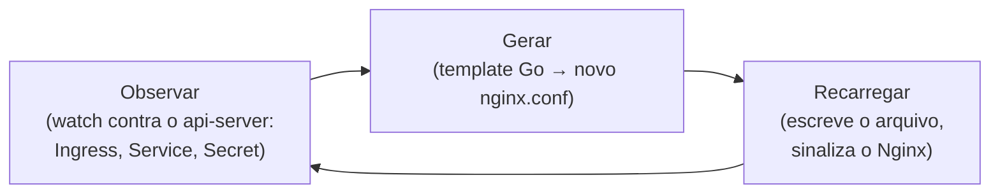

# 14 — Nginx em container e como Ingress Controller

> [!abstract] TL;DR
> Dentro de um container, o Nginx continua sendo o mesmo par master/worker descrito na nota 01 — mas o contrato muda: a imagem oficial resolve variáveis de ambiente em templates via `envsubst` num mecanismo de entrypoint (`/docker-entrypoint.d/`), manda log para `stdout`/`stderr` em vez de arquivo, e "recarregar configuração" deixa de significar `nginx -s reload` e passa a significar "sobe um container novo, derruba o antigo" — porque o container, ao contrário do processo nu numa VM, é tratado como imutável pelo orquestrador que o gerencia. A segunda metade desta nota muda de escala: um **Ingress Controller** é, por dentro, um Nginx comum rodando num Pod, com um processo adicional ao lado que observa a API do Kubernetes, gera `nginx.conf` e recarrega — a peça que a nota 15 do galho de Kubernetes deixou como caixa-preta. E há um fato que muda o eixo da segunda metade: o `ingress-nginx`, o controlador mais adotado da história do projeto, **foi aposentado** — SIG Network e o Security Response Committee anunciaram em 11 de novembro de 2025 que a manutenção de melhor esforço terminaria em março de 2026, e essa data já passou. O que resta é entender o mecanismo, que continua válido para qualquer sucessor, e reconhecer para onde o ecossistema foi.

Imagine a cena mais comum de todas: uma configuração de Nginx que funciona perfeitamente numa máquina de desenvolvimento — testada, revisada, publicada num repositório — e que, dentro de um container, simplesmente não produz o efeito esperado. Uma variável que deveria virar um valor concreto no arquivo de configuração continua aparecendo, literalmente, como `${API_BACKEND}` no `nginx.conf` processado. Ou o container que, depois de um `docker exec nginx -s reload`, parece não ter recarregado nada — a mudança está lá, o comando não devolveu erro, e o comportamento antigo persiste. Ou, pior ainda, os logs que deveriam estar em algum arquivo dentro do container simplesmente não existem em lugar nenhum acessível, e a única forma de ver o que está acontecendo é um comando de plataforma que ninguém pensou em rodar primeiro. Nenhum desses três sintomas é bug do Nginx — são o mesmo software de sempre, obedecendo ao mesmo modelo de processos da nota 01, só que operando dentro de um contrato que uma VM nunca impôs: o container não tem estado persistente por padrão, não tem shell interativo por padrão, e devolve tudo que produz através de dois canais só, `stdout` e `stderr`, não através do sistema de arquivos.

Nada disso é peculiaridade do Nginx — é o mesmo contrato de container que qualquer processo empacotado precisa respeitar, já estabelecido em [[03-Dominios/Tecnologia/Infraestrutura/Docker/index|Docker]]: imagem imutável, sistema de arquivos efêmero por padrão, saída padrão como canal de observabilidade. O que esta nota faz é aplicar esse contrato genérico a um software específico, com um modelo de processos próprio (master, workers, cache manager, cache loader) que a nota 01 já detalhou, e mostrar onde os dois mundos — o modelo de processos do Nginx e o contrato de container — se encaixam sem fricção, e onde eles exigem uma decisão explícita para não colidir.

## A imagem oficial: o que o entrypoint faz antes do primeiro `nginx.conf`

A imagem `nginx` publicada no Docker Hub não é só um binário compilado sobre uma distribuição base — ela embute um mecanismo de inicialização inteiro, um diretório chamado `/docker-entrypoint.d/`, que roda um conjunto de scripts, em ordem numérica, antes do processo `nginx` de fato assumir o PID 1 do container. O script `docker-entrypoint.sh`, declarado como `ENTRYPOINT` da imagem, é quem orquestra essa sequência: ele varre `/docker-entrypoint.d/` procurando arquivos executáveis, roda cada um, e só então executa o comando final (tipicamente `nginx -g "daemon off;"`) substituindo o próprio processo do shell — a mesma disciplina de PID 1 que a seção sobre sinais, adiante nesta nota, retoma com mais precisão. A imagem publicada já vem com quatro desses scripts instalados por padrão: um que habilita escuta em IPv6 quando disponível, um que resolve os *resolvers* de DNS locais do container, um que processa templates via `envsubst`, e um que ajusta `worker_processes` ao número de CPUs visíveis dentro do container — não da máquina host, distinção que importa em ambientes com *cgroups* limitando CPU, o mesmo tipo de descompasso entre "CPU do host" e "CPU visível ao processo" que o galho de Docker já tratou ao discutir limites de recurso.

O script mais relevante para configuração é o de `envsubst`. Nginx, como qualquer servidor que lê um arquivo de configuração estático, não tem noção nenhuma nativa de variável de ambiente dentro de blocos como `server` ou `location` — um `${API_BACKEND}` escrito direto num `nginx.conf` não é resolvido por nada dentro do próprio Nginx, é só texto literal. A imagem oficial resolve isso fora do Nginx, antes dele sequer subir: qualquer arquivo colocado em `/etc/nginx/templates/*.template` é processado pelo utilitário `envsubst` (parte do pacote `gettext`), que substitui cada referência de variável de ambiente pelo seu valor real, e grava o resultado em `/etc/nginx/conf.d/`, o diretório que a configuração base do Nginx já inclui via `include /etc/nginx/conf.d/*.conf;`. As três variáveis que controlam esse comportamento — `NGINX_ENVSUBST_TEMPLATE_DIR`, `NGINX_ENVSUBST_TEMPLATE_SUFFIX` e `NGINX_ENVSUBST_OUTPUT_DIR` — têm valores padrão sensatos (`/etc/nginx/templates`, `.template`, `/etc/nginx/conf.d`), e um quarto parâmetro, `NGINX_ENVSUBST_FILTER`, permite restringir quais variáveis são de fato substituídas via expressão regular — uma proteção deliberada contra vazar, por engano, uma variável de ambiente sensível (uma credencial de banco de dados, por exemplo, presente no ambiente do container por outro motivo qualquer) para dentro de um arquivo de configuração que o Nginx serve.

```nginx
# /etc/nginx/templates/default.conf.template
server {
    listen 8080;

    location /api/ {
        proxy_pass http://${API_BACKEND};
    }
}
```

Rodar esse container com `-e API_BACKEND=minha-api:3000` produz, em `/etc/nginx/conf.d/default.conf`, o mesmo bloco com `proxy_pass http://minha-api:3000;` já resolvido — um arquivo que o Nginx lê normalmente, sem nenhuma dependência de variável de ambiente em tempo de execução, porque a substituição já aconteceu antes dele iniciar. É crucial notar a ordem: o `envsubst` roda uma vez, no entrypoint, antes do `nginx` de fato subir — não é um mecanismo de configuração dinâmica, é geração de arquivo estático a partir de um template, seguida de leitura estática desse arquivo gerado, exatamente como qualquer outra inicialização de configuração deste galho.

| Script (ordem de execução) | O que resolve |
|---|---|
| `10-listen-on-ipv6-by-default.sh` | Ajusta `listen` para incluir IPv6 quando o ambiente do container suporta |
| `15-local-resolvers.envsh` | Detecta os resolvers de DNS do container e os expõe como variável |
| `20-envsubst-on-templates.sh` | Processa `/etc/nginx/templates/*.template` via `envsubst`, grava em `conf.d` |
| `30-tune-worker-processes.sh` | Ajusta `worker_processes` ao número de CPUs visíveis ao container |

O diretório `/docker-entrypoint.d/` da imagem oficial não carrega só o script de `envsubst` — ele vem, de fábrica, com os quatro scripts numerados da tabela acima, executados nessa ordem, cada um resolvendo uma preocupação estreita e específica antes do `nginx` propriamente dito assumir o processo. Vale destacar o último deles com um pouco mais de detalhe, porque é o que mais surpreende quem nunca parou para pensar no assunto: `30-tune-worker-processes.sh` ajusta `worker_processes` ao número de CPUs que o próprio **container** enxerga — não ao número de CPUs físicas da máquina host — uma distinção que importa porque um container limitado por *cgroups* a, digamos, duas CPUs deve subir dois workers, não os trinta e dois que a máquina host inteira poderia sustentar; a nota 01 já tratou `worker_processes auto` como "um worker por núcleo detectado", e é exatamente esse script que garante que a detecção automática enxergue o limite do *cgroup*, não o hardware inteiro por trás dele. Qualquer script adicional colocado manualmente em `/docker-entrypoint.d/`, com permissão de execução, entra nessa mesma sequência — é o mecanismo de extensão pretendido pela imagem para inicialização customizada, preferível a sobrescrever o `ENTRYPOINT` inteiro só para adicionar um passo a mais.

### Vendo o contrato de log com as próprias mãos

Não é preciso tomar a promessa de "log vai para stdout/stderr" como fé — o `Dockerfile` da imagem oficial resolve isso de forma visível, com duas linhas que substituem os arquivos de log padrão por links simbólicos apontando para os dispositivos de saída do processo:

```dockerfile
RUN ln -sf /dev/stdout /var/log/nginx/access.log \
 && ln -sf /dev/stderr /var/log/nginx/error.log
```

O efeito prático aparece no primeiro `docker run` de qualquer imagem baseada nessas linhas, sem nenhuma configuração adicional da aplicação:

```bash
docker run -d --name web -p 8080:80 nginx:1.30.4
curl -s -o /dev/null http://localhost:8080/
docker logs web
```

```
172.17.0.1 - - [08/Aug/2026:14:02:11 +0000] "GET / HTTP/1.1" 200 615 "-" "curl/8.5.0"
```

A linha de acesso aparece em `docker logs` sem que nada tenha sido configurado além de rodar a imagem — porque o `access.log`, dentro do container, nunca foi de fato um arquivo em disco: sempre foi um link para `/dev/stdout`, e o runtime de container já coleta esse fluxo por padrão. Um arquivo de configuração customizado que redeclara `access_log` ou `error_log` apontando para um caminho próprio, sem manter esse mesmo padrão de link simbólico, quebra silenciosamente essa garantia — o log passa a existir só dentro do sistema de arquivos efêmero do container, invisível a qualquer ferramenta de observabilidade que espere log no fluxo padrão.

> [!info] Baseline de versão
> Esta nota segue a mesma baseline do restante do galho: mainline 1.31.3 (15 de julho de 2026) e stable 1.30.4. O comportamento do entrypoint e da imagem oficial descrito aqui é estável há várias versões e não muda entre essas duas linhas. O que muda rápido, e por isso carrega data em cada afirmação, é o estado do ecossistema de Ingress Controllers — a segunda metade desta nota descreve o estado em 8 de agosto de 2026, e é o tipo de fato que vale reconferir antes de tomar como definitivo em qualquer leitura futura.

O segundo pilar do contrato de container, e o que explica o terceiro sintoma da abertura desta nota, é para onde o log vai. A imagem oficial, já no `Dockerfile` que a constrói, substitui os arquivos de log padrão do Nginx por links simbólicos: `access.log` aponta para `/dev/stdout`, `error.log` aponta para `/dev/stderr`. Não é um comportamento configurável por variável de ambiente — é uma decisão de imagem, tomada uma vez, na construção. A consequência prática é que `docker logs <container>` (ou o equivalente em qualquer orquestrador — `kubectl logs` num Pod, por exemplo) já mostra as linhas de acesso e de erro do Nginx misturadas, sem precisar de nenhum `docker exec` para entrar no container e ler um arquivo. Essa escolha amarra diretamente com o contrato de log de container que a maioria dos runtimes espera: um processo bem comportado dentro de um container não escreve log em arquivo local — porque o sistema de arquivos do container é efêmero por padrão, e um arquivo escrito ali morre junto com o container — ele escreve em `stdout`/`stderr`, e delega a coleta, o armazenamento e a rotação desses fluxos para uma camada de infraestrutura externa (o *driver* de log do Docker, o *log agent* de um cluster Kubernetes). Um Nginx configurado para escrever log num arquivo dentro do container, sem essa troca por link simbólico, funciona — mas o log fica invisível para qualquer ferramenta de observabilidade que espere log no fluxo padrão, e acumula num sistema de arquivos que ninguém está monitorando.

## Config por bind mount contra imagem própria: o trade-off real

A forma mais rápida de rodar um Nginx customizado em container é montar um `nginx.conf` do host por cima do arquivo padrão da imagem — um *bind mount*:

```bash
docker run -d \
  -v $(pwd)/nginx.conf:/etc/nginx/nginx.conf:ro \
  -p 8080:80 \
  nginx:1.30.4
```

Esse comando funciona, e é o padrão de praticamente todo primeiro tutorial de Nginx em container que qualquer pessoa encontra — mas carrega um pressuposto que passa despercebido até doer: o arquivo `nginx.conf` precisa existir, com o conteúdo certo, no sistema de arquivos de qualquer máquina que for rodar esse container. Funciona muito bem em desenvolvimento local, onde o repositório de código e o Docker rodam na mesma máquina. Em produção, esse pressuposto quebra de formas específicas: um orquestrador que agenda o container em qualquer node disponível do cluster (o mesmo modelo de agendamento que o galho de Kubernetes já descreveu) não garante que aquele arquivo específico exista naquele node específico — a configuração deixaria de viajar junto com a imagem, e passaria a depender de um mecanismo externo de distribuição de arquivo que o container, sozinho, não resolve.

A alternativa que se leva a produção é embutir a configuração dentro da própria imagem, via `COPY` no `Dockerfile`:

```dockerfile
FROM nginx:1.30.4
COPY nginx.conf /etc/nginx/nginx.conf
COPY conf.d/ /etc/nginx/conf.d/
```

Essa imagem, uma vez construída e publicada num registry, carrega a configuração como parte do seu conteúdo endereçado por hash — a mesma garantia de imutabilidade e reprodutibilidade que o galho de Docker já estabeleceu para qualquer imagem: rodar essa tag específica, em qualquer node, em qualquer momento, produz exatamente o mesmo Nginx configurado, sem depender de nenhum arquivo externo estar disponível ali. A tabela resume o que cada abordagem custa e o que cada uma resolve:

| | Bind mount | Imagem própria (`COPY`) |
|---|---|---|
| Onde a configuração mora | No host, fora da imagem | Dentro da imagem, versionada junto com ela |
| Mudar a config sem rebuild | Sim — edita o arquivo, reinicia o container | Não — exige nova imagem e novo deploy |
| Portabilidade entre nodes/hosts | Depende de o arquivo existir em cada destino | Total — a imagem carrega tudo |
| Rastreabilidade (qual config rodou quando) | Fraca — o arquivo pode mudar sem deixar rastro na imagem | Forte — a tag da imagem já identifica a config exata |
| Uso recomendado | Desenvolvimento local, prototipagem rápida | Produção, qualquer ambiente orquestrado |

O bind mount continua tendo lugar legítimo — depurar uma mudança de configuração rapidamente, sem precisar de um ciclo completo de build e push, é exatamente o cenário em que ele economiza tempo. O que muda de contexto para contexto não é qual técnica é "certa" em abstrato, é qual pressuposto sobre onde o container vai rodar está sendo feito silenciosamente.

Vale nomear uma armadilha específica de bind mount que costuma surpreender quem monta um diretório inteiro, em vez de um arquivo único: montar `-v $(pwd)/conf.d:/etc/nginx/conf.d` **substitui** o conteúdo inteiro daquele diretório dentro do container pelo conteúdo do host — qualquer arquivo que a imagem original já trouxesse ali (um `default.conf` de exemplo, por exemplo) simplesmente deixa de existir do ponto de vista do container, porque o bind mount não faz mescla de diretório, faz substituição completa do ponto de montagem. É a mesma lógica de "diretiva herdada é substituída, não fundida" que a nota [[03-Dominios/Tecnologia/Infraestrutura/Nginx/02 - A estrutura da configuração|02 — A estrutura da configuração]] já ensinou para contextos de configuração, só que aplicada agora à camada do sistema de arquivos do container, um nível abaixo de qualquer diretiva Nginx.

## Multi-stage: a SPA que build e serve nunca deveriam compartilhar imagem

Um padrão comum o bastante para merecer nome próprio: uma aplicação frontend (React, Vue, Angular, o que for) que precisa de um passo de *build* — transformar código-fonte em JavaScript, CSS e HTML estáticos — e depois só precisa de um servidor de arquivos estáticos para entregar esse resultado. As duas etapas não têm nada em comum em termos de dependências: a etapa de build precisa de `node`, do gerenciador de pacotes, de todo o código-fonte e das dependências de desenvolvimento; a etapa de servir precisa só dos arquivos finais e de um servidor HTTP. Empacotar as duas coisas na mesma imagem — `node` instalado, `node_modules` inteiro presente, código-fonte completo, só para no fim rodar um Nginx por cima — produz uma imagem gigantesca, cheia de superfície de ataque e peso que nunca é usado em produção.

Um `Dockerfile` multi-stage resolve isso com dois `FROM` na mesma construção, onde só o resultado do último estágio vira a imagem final:

```dockerfile
# --- estágio 1: build da aplicação ---
FROM node:22-alpine AS build
WORKDIR /app
COPY package*.json ./
RUN npm ci
COPY . .
RUN npm run build

# --- estágio 2: servir com Nginx ---
FROM nginx:1.30.4-alpine
COPY --from=build /app/dist /usr/share/nginx/html
COPY nginx.conf /etc/nginx/conf.d/default.conf
EXPOSE 80
```

A instrução `COPY --from=build` traz só o diretório de saída do build (`dist`, `build`, o nome varia por ferramenta) para dentro da imagem final baseada em `nginx`, sem nenhum rastro de `node`, `node_modules` ou código-fonte sobrevivendo no resultado publicado. O resultado é uma imagem final que carrega só o Nginx e os arquivos estáticos — tipicamente uma fração do tamanho da alternativa de estágio único.

A parte que costuma faltar nesse padrão, e que produz o sintoma clássico de "recarreguei a página numa rota da SPA e recebi 404", é a configuração de fallback. Uma *single-page application* trata rotas como `/produtos/42` inteiramente no lado do cliente — o servidor nunca teve, e nunca terá, um arquivo físico chamado `produtos/42` no disco. Sem instrução explícita, o Nginx procura esse caminho literal, não encontra, e devolve 404. A correção é a diretiva `try_files`, já desenvolvida em detalhe na nota [[03-Dominios/Tecnologia/Infraestrutura/Nginx/06 - Servir arquivos estáticos|06 — Servir arquivos estáticos]]:

```nginx
server {
    listen 80;
    root /usr/share/nginx/html;

    location / {
        try_files $uri $uri/ /index.html;
    }
}
```

Cada requisição que não corresponde a um arquivo real cai no `/index.html`, devolvendo o *shell* da aplicação, que então lê a URL no navegador e decide, do lado do cliente, o que renderizar. É a mesma lógica de fallback que a nota 06 já ensinou, só que agora dentro do contexto específico de uma imagem multi-stage — o padrão mais comum, de longe, em que alguém encontra essa diretiva pela primeira vez.

Vale completar o exemplo com o segundo detalhe que qualquer SPA em produção precisa e que o `try_files` sozinho não resolve: a maioria das ferramentas de build (Vite, Webpack, o que for) já gera nomes de arquivo com hash de conteúdo — `app.a1b2c3.js`, por exemplo — precisamente para permitir cache agressivo desses arquivos, já que qualquer mudança de conteúdo produz um nome novo. O `index.html`, em contraste, referencia esses nomes com hash e por isso não pode ser cacheado da mesma forma — ele precisa ser revalidado a cada visita, ou usuários continuariam recebendo uma versão antiga do *shell*, apontando para arquivos com hash que talvez nem existam mais depois de um novo deploy:

```nginx
server {
    listen 80;
    root /usr/share/nginx/html;

    location / {
        try_files $uri $uri/ /index.html;
    }

    location = /index.html {
        add_header Cache-Control "no-cache";
    }

    location ~* \.(js|css|png|jpg|svg|woff2)$ {
        add_header Cache-Control "public, max-age=31536000, immutable";
    }
}
```

A semântica completa por trás de `Cache-Control`, `immutable` e revalidação condicional foge do escopo desta nota — o que importa reter aqui é só a assimetria: arquivos com hash no nome podem ser cacheados por um ano inteiro sem risco, o `index.html` nunca pode, e uma imagem multi-stage que serve uma SPA sem essa distinção está, na melhor das hipóteses, deixando cache em cima da mesa, e na pior, servindo `index.html` desatualizado para usuários que já deveriam ter recebido a versão nova.

## O tamanho da imagem: por que a maioria dos exemplos usa `-alpine`

Vale nomear, ainda dentro da parte de container desta nota, uma escolha que aparece silenciosamente em quase todo exemplo já mostrado até aqui: as tags com sufixo `-alpine` (`nginx:1.30.4-alpine`, `nginxinc/nginx-unprivileged:1.30-alpine`) em vez das variantes baseadas em Debian. A imagem `nginx` publicada no Docker Hub existe em ambas as famílias — uma construída sobre Debian, com o conjunto usual de bibliotecas e ferramentas de uma distribuição completa, e outra sobre Alpine Linux, uma distribuição minimalista construída em torno de `musl libc` em vez de `glibc`. A diferença de tamanho entre as duas é substancial — a variante Alpine costuma pesar uma fração da variante Debian, contando só o essencial para o Nginx rodar — e essa diferença importa de forma direta para exatamente o mecanismo que o galho de Docker já descreveu: cada camada de imagem menor significa menos bytes para transferir a cada `docker pull`, e a nota [[03-Dominios/Tecnologia/Infraestrutura/Kubernetes/02 - O loop de reconciliação|02 — O loop de reconciliação]] já mostrou que puxar a imagem é, tipicamente, a etapa mais lenta e mais variável de toda a convergência de um Pod novo — um Nginx `-alpine`, mais leve, converge mais rápido num node que ainda não tem aquela imagem em cache local, o que importa proporcionalmente mais em clusters que escalam Pods com frequência.

O trade-off, honesto, é que Alpine não é uma substituição neutra de Debian — `musl libc` tem diferenças de comportamento sutis em relação a `glibc` em cenários específicos (resolução de DNS sob certas condições é o exemplo mais citado historicamente), e qualquer dependência nativa compilada contra `glibc`, se alguma vier a ser adicionada à imagem por cima do Nginx, precisa ser recompilada ou trocada por uma alternativa compatível com `musl`. Para o Nginx puro, sem módulos de terceiros compilados contra bibliotecas específicas de sistema, essa fricção raramente aparece na prática — e é exatamente por isso que a variante Alpine é a escolha default em quase todo exemplo de produção que este galho apresenta, inclusive nas imagens internas usadas por implementações como o próprio NGINX Gateway Fabric, citado mais adiante nesta nota.

## Rodar sem privilégio: a porta baixa e o `nginx-unprivileged`

A nota 01 já estabeleceu por que o master do Nginx precisa nascer como `root`: abrir uma porta abaixo de 1024 — a 80, a 443 — exige esse privilégio no Linux, e é exatamente por isso que os workers, depois de herdar o socket já aberto, soltam esse privilégio e passam a rodar sob um usuário sem permissões especiais. Dentro de um container, essa mesma exigência colide de frente com uma prática de segurança cada vez mais padrão em ambientes orquestrados: rodar o container inteiro — processo principal incluído, não só os workers depois de soltarem privilégio — sob um usuário não-root desde o primeiro instante, sem nunca ter `root` disponível dentro daquele *namespace* de usuário. Um `securityContext` de Pod no Kubernetes que exige `runAsNonRoot: true`, por exemplo, rejeita de cara um container cujo processo principal precise nascer como root — mesmo que esse processo solte o privilégio depois, como o master do Nginx faz para os workers.

A imagem oficial `nginxinc/nginx-unprivileged` resolve exatamente essa colisão. Ela remove a diretiva `user` do `nginx.conf` base — a mesma que, na imagem padrão, instrui o master a criar workers sob um usuário sem privilégio depois de abrir a porta como root — e deixa o processo inteiro, master incluído, rodando sob o usuário não-root definido pelo próprio runtime de container, sem nunca precisar de root em ponto nenhum da execução. A consequência direta é que essa imagem não consegue abrir a porta 80: ela expõe a porta **8080** por padrão, porque um usuário sem privilégio nunca teve permissão para se ligar a portas abaixo de 1024 no Linux, independente de container ou não. Vale marcar a ressalva de versão de runtime que a própria documentação da imagem sinaliza: essa restrição de porta baixa deixou de existir no Docker especificamente a partir da versão 20.03 (que passou a permitir capacidades específicas sem privilégio total), mas continua valendo em outros runtimes de container e, mais relevante, em qualquer ambiente onde o *namespace* de usuário do container mapeia de fato para um usuário sem privilégio no kernel — que é o cenário padrão em produção.

```dockerfile
FROM nginxinc/nginx-unprivileged:1.30-alpine
COPY nginx.conf /etc/nginx/conf.d/default.conf
EXPOSE 8080
```

Rodar essa imagem exige ajustar qualquer coisa que dependa da porta 80 estar em uso — o `Service` do Kubernetes que expõe o Pod, o balanceador de nuvem na frente dele — para apontar para 8080, um detalhe de configuração pequeno, mas que costuma ser a primeira armadilha de quem troca uma imagem `nginx` padrão pela variante sem privilégio sem revisar o resto da cadeia. Além da porta, a imagem também move os diretórios de escrita temporária (o *cache* de proxy, o `pid` file) de locais como `/var/run/` e `/var/cache/nginx/` para dentro de `/tmp/`, precisamente porque um usuário sem privilégio nunca teve permissão de escrita nesses diretórios do sistema — um usuário sem privilégio, com sistema de arquivos raiz somente leitura (`readOnlyRootFilesystem: true`, outra exigência comum de `securityContext`), consegue rodar essa imagem sem nenhuma modificação adicional, porque tudo que ela precisa escrever já foi movido para o único lugar que continua gravável.

Um manifesto de Pod que combina as três exigências de segurança mais comuns — usuário não-root, sistema de arquivos raiz somente leitura, e sem escalonamento de privilégio — mostra como as peças se encaixam quando a imagem certa já foi escolhida:

```yaml
apiVersion: v1
kind: Pod
metadata:
    name: web-unprivileged
spec:
    containers:
        - name: nginx
          image: nginxinc/nginx-unprivileged:1.30-alpine
          ports:
              - containerPort: 8080
          securityContext:
              runAsNonRoot: true
              readOnlyRootFilesystem: true
              allowPrivilegeEscalation: false
          volumeMounts:
              - name: tmp
                mountPath: /tmp
    volumes:
        - name: tmp
          emptyDir: {}
```

O `volumeMounts` para `/tmp` explícito, apontando para um `emptyDir`, existe porque `readOnlyRootFilesystem: true` torna todo o resto do sistema de arquivos do container imutável — inclusive o `/tmp` que a imagem sem privilégio já usa para seu cache e `pid` file. Sem esse volume, a própria imagem `nginx-unprivileged`, apesar de desenhada para segurança máxima, falharia ao tentar escrever nesse diretório agora somente-leitura — a peça final de um encaixe que só funciona quando as duas exigências (imagem que já move a escrita para `/tmp`, e um `/tmp` de fato gravável por cima da raiz somente leitura) estão presentes ao mesmo tempo.

## Reload em container: por que substituir é mais seguro do que recarregar

A nota 01 detalhou, com precisão, como o master do Nginx reage a um sinal `HUP`: relê a configuração, valida, sobe workers novos já com a configuração atualizada, desliga os antigos graciosamente — tudo isso sem derrubar uma única conexão em andamento, e sem nunca precisar reiniciar o processo inteiro. Esse mecanismo continua existindo, intacto, dentro de um container: um `docker exec <container> nginx -s reload` (ou o equivalente `kill -HUP <pid>`) dispara exatamente o mesmo comportamento de sempre, dentro do único processo master que aquele container hospeda.

O que muda, em ambiente de container e sobretudo em ambiente orquestrado, é se esse reload é sequer a operação certa a fazer. Um container, no modelo que o galho de Docker já estabeleceu, é tratado como **imutável** por convenção — a imagem que o originou é o artefato versionado, testado e rastreável; o container em si é uma instância descartável dessa imagem, sem nenhuma garantia de que uma mudança feita à mão dentro dele (via `exec`, editando um arquivo, recarregando configuração manualmente) sobreviva ao próximo evento de ciclo de vida que o orquestrador decidir aplicar — um novo deploy, um *node* drenado para manutenção, um *health check* que falha e provoca substituição. Se a configuração de um container Nginx muda porque alguém entrou nele e editou um arquivo, e depois mandou `reload`, essa mudança vive só naquele container específico, num estado que a imagem de origem não reflete — o próximo Pod agendado a partir da mesma imagem volta a nascer com a configuração antiga, porque a imagem, a fonte da verdade, nunca mudou.

A prática correta num ambiente orquestrado inverte a operação: em vez de mudar a configuração de um container já rodando, constrói-se uma imagem nova (com o `Dockerfile` ajustado, ou um novo template processado por `envsubst`), publica-se essa imagem sob uma tag nova, e o orquestrador substitui os containers antigos por instâncias novas dessa imagem — o mesmo `rollout` gradual que o galho de Kubernetes já descreveu para qualquer Deployment. A vantagem não é só de rastreabilidade: é a mesma garantia de reload gracioso do Nginx, só que aplicada num nível acima. Em vez de um master trocando os próprios workers, é o orquestrador trocando os próprios Pods, um a um, sem nunca derrubar capacidade suficiente para deixar o serviço fora do ar — o `HUP` continua existindo e continua funcionando dentro de cada container individual, mas deixa de ser o mecanismo primário de mudança de configuração assim que existe um orquestrador cuidando do ciclo de vida de containers inteiros.

Vale ver as duas operações lado a lado, porque a diferença de comando é pequena e a diferença de garantia é grande:

```bash
# reload dentro do mesmo container — muda o processo, não a imagem
docker exec web nginx -s reload

# substituição — a imagem nova é a fonte da verdade, o container antigo morre
docker build -t minha-empresa/web:v42 .
docker push minha-empresa/web:v42
kubectl set image deployment/web nginx=minha-empresa/web:v42
kubectl rollout status deployment/web
```

O primeiro comando funciona, no sentido estrito de recarregar configuração sem derrubar conexão — mas termina num container cujo estado já não corresponde a nenhuma imagem publicada em lugar nenhum. O segundo comando é mais lento e exige mais passos, mas termina num estado onde a imagem `v42`, publicada e rastreável, é exatamente o que está rodando em produção — a mesma garantia de reprodutibilidade que fundamenta todo o galho de Docker, agora aplicada à pergunta específica de "que configuração de Nginx está de fato servindo tráfego agora".

## Reconstituindo um incidente: a variável que nunca resolveu

Vale amarrar a primeira metade desta nota com um cenário completo, do tipo que qualquer pessoa que já operou Nginx em container reconhece na hora. Um time publica uma imagem nova, construída a partir de um `Dockerfile` que copia um template para `/etc/nginx/templates/default.conf.template`, esperando que `${API_BACKEND}` seja resolvido no início do container via a variável de ambiente declarada no manifesto de deploy. O deploy sobe, o container fica com status saudável, a *liveness probe* passa — e ainda assim toda requisição para `/api/` volta com `502 Bad Gateway`.

O primeiro instinto costuma ser suspeitar do backend — está fora do ar, está com problema de rede, o `Service` está mal configurado. É um instinto razoável, mas que, neste caso específico, está olhando para o lugar errado: a mesma disciplina de diagnóstico que a nota 02 do galho de Kubernetes já ensinou — ir atrás do fato observável, não do palpite mais óbvio — aponta primeiro para o próprio arquivo de configuração gerado, não para o backend que ele referencia:

```bash
kubectl exec deploy/web -- cat /etc/nginx/conf.d/default.conf
```

```
location /api/ {
    proxy_pass http://${API_BACKEND};
}
```

A variável nunca foi resolvida — o arquivo ainda carrega o texto literal `${API_BACKEND}`, exatamente como estava no template, e o Nginx está tentando resolver `${API_BACKEND}` como se fosse um nome de host de verdade, o que nunca vai funcionar. A causa raiz, nesse cenário concreto, costuma ser um entre dois erros comuns: ou o arquivo de template não estava no diretório certo (`/etc/nginx/templates/`, com sufixo `.template`), e por isso o script `20-envsubst-on-templates.sh` do entrypoint nunca o processou — ele simplesmente não existia onde o script sabia procurar —, ou a variável `API_BACKEND` nunca chegou a existir no ambiente do container, porque o manifesto de deploy declarava um nome de variável ligeiramente diferente do que o template esperava, um erro de digitação silencioso que nenhuma etapa da cadeia detecta como erro, porque `envsubst` simplesmente deixa intocado qualquer `${VARIAVEL}` cujo nome não encontra no ambiente.

```bash
kubectl exec deploy/web -- printenv | grep API_BACKEND
kubectl exec deploy/web -- ls -la /etc/nginx/templates/
```

O primeiro comando confirma, ou refuta, se a variável de fato existe no ambiente do container — se não aparecer nada, o problema é o manifesto de deploy, não o Nginx. O segundo confirma se o template está de fato onde o entrypoint sabe procurar. Nenhum dos dois comandos exige conhecimento novo além do que esta nota já apresentou; o que muda entre resolver esse incidente em cinco minutos ou em uma hora é saber, de antemão, que o primeiro lugar a olhar não é o backend, é o arquivo que o entrypoint deveria ter gerado.

## Sinais e PID 1: por que `docker stop` pode demorar exatos dez segundos

Todo container tem, dentro do seu próprio *namespace* de processos, um processo com PID **1** — e esse detalhe carrega uma responsabilidade que o kernel Linux trata de forma diferente de qualquer outro PID. O processo PID 1 não recebe automaticamente os sinais que qualquer outro processo receberia por padrão (como `SIGTERM`) a menos que ele registre, explicitamente, um manipulador para eles — é uma proteção histórica do kernel contra o processo de inicialização do sistema (tradicionalmente também PID 1, fora de container) ser derrubado sem querer. Quando `docker stop` (ou o equivalente de qualquer orquestrador terminando um Pod) manda `SIGTERM` para o container, esse sinal vai direto para o PID 1 — e se esse processo não estiver preparado para tratá-lo, o `SIGTERM` é silenciosamente ignorado, e o `docker stop` espera o tempo configurado (dez segundos, por padrão) antes de escalar para `SIGKILL`, que mata o processo sem chance de encerramento gracioso.

O script `docker-entrypoint.sh` da imagem oficial do Nginx, ao terminar sua sequência de inicialização, executa `nginx -g "daemon off;"` via `exec` — a chamada de sistema que substitui o processo do shell pelo processo do Nginx, sem criar um processo filho novo. É esse `exec` final que garante que o master do Nginx, e não o script de shell que o precedeu, acaba assumindo o PID 1 do container. E o master do Nginx, por sua vez, já sabe tratar `SIGTERM`/`SIGINT` (encerramento rápido) e `SIGQUIT` (encerramento gracioso, terminando conexões em andamento antes de sair) — a mesma tabela de sinais que a nota 01 já documentou em detalhe. É essa combinação — `exec` garantindo que o master vire PID 1 de fato, mais o master já sabendo reagir aos sinais certos — que faz `docker stop` (que manda `SIGTERM`, espera, e só então `SIGKILL`) encerrar um container Nginx de forma limpa e rápida, sem precisar aguardar o tempo total configurado antes de forçar a morte do processo.

> [!warning] Um script de entrypoint próprio, sem `exec`, quebra o encerramento gracioso
> Substituir o `ENTRYPOINT` da imagem por um script customizado que faz alguma preparação antes de chamar `nginx` — sem usar `exec` na chamada final — deixa esse script como PID 1, e o processo `nginx` como um filho comum, sem receber `SIGTERM` diretamente. O sintoma é um container que sempre demora o tempo cheio do timeout de `docker stop` (ou do `terminationGracePeriodSeconds` de um Pod) para encerrar, porque o sinal nunca chega a quem sabe tratá-lo. A correção é sempre garantir que a última linha de qualquer entrypoint customizado use `exec nginx -g "daemon off;"`, nunca uma chamada comum que deixaria o script como pai do processo.

## Probes de saúde: o que um orquestrador pergunta a este container

Um orquestrador que gerencia containers Nginx — Kubernetes incluído — não confia cegamente que "o processo está vivo" equivale a "o processo está pronto para receber tráfego", a mesma distinção entre vida e prontidão que qualquer galho de orquestração acaba precisando nomear. Duas perguntas separadas costumam ser configuradas contra um container Nginx: uma *liveness probe*, que pergunta "este processo ainda está respondendo, ou precisa ser reiniciado?", e uma *readiness probe*, que pergunta "este container já está em condição de receber tráfego novo agora?". Para um Nginx simples, servindo conteúdo estático ou fazendo proxy para um backend já saudável, as duas perguntas costumam ter a mesma resposta prática, e um `location` dedicado, leve e sem efeito colateral, resolve as duas:

```nginx
location = /healthz {
    access_log off;
    return 200 "ok\n";
    add_header Content-Type text/plain;
}
```

`access_log off` evita que a probe — que costuma rodar a cada poucos segundos, para sempre, enquanto o container viver — inunde o log de acesso com milhares de linhas irrelevantes; `return 200` responde sem consultar nenhum backend, tornando essa rota deliberadamente barata e sem dependência externa, para que ela reflita a saúde do próprio Nginx, não a saúde de tudo que está atrás dele. Um cenário mais rigoroso — em que a readiness precisa refletir se o backend de proxy está de fato saudável, não só se o Nginx está de pé — exige uma rota que efetivamente encaminhe a um endpoint de saúde do backend; nesse caso, vale lembrar que essa rota específica também consome o mesmo par de conexões por request (cliente e upstream) que a nota 01 já contabilizou, e que uma probe malconfigurada com intervalo curto demais pode, ela mesma, virar uma fonte de carga não desprezível contra o backend.

### O arquivo mínimo que já expõe todo o contrato desta primeira metade

Vale fechar a parte de container juntando, num único `Dockerfile` comentado, as peças que esta seção tratou isoladamente — não como receita a decorar, mas como o mapa de onde cada decisão mora dentro de uma imagem real:

```dockerfile
# --- estágio de build, descartado no resultado final ---
FROM node:22-alpine AS build
WORKDIR /app
COPY package*.json ./
RUN npm ci
COPY . .
RUN npm run build

# --- estágio final: imagem própria, sem privilégio, sem bind mount ---
FROM nginxinc/nginx-unprivileged:1.30-alpine

# config embutida na imagem — não depende de arquivo externo em produção
COPY nginx.conf /etc/nginx/conf.d/default.conf

# arquivos estáticos vindos do estágio de build, não do sistema de arquivos local
COPY --from=build /app/dist /usr/share/nginx/html

# porta não-privilegiada — a imagem unprivileged não abre a 80
EXPOSE 8080

# log continua indo para stdout/stderr — herdado da imagem base, sem override
```

Cada linha desse arquivo resolve uma pergunta que uma seção específica desta nota já respondeu: por que multi-stage, por que imagem própria em vez de bind mount, por que a variante `-unprivileged`, por que a porta não é 80, e por que nada aqui redireciona log para arquivo — o contrato de container inteiro, visível num Dockerfile de menos de vinte linhas.

## Nginx como Ingress Controller: o mecanismo por dentro

A nota [[03-Dominios/Tecnologia/Infraestrutura/Kubernetes/15 - Ingress e a borda do cluster|Ingress e a borda do cluster]], do galho de Kubernetes, já estabeleceu a peça conceitual: um objeto `Ingress` é só uma declaração — host, caminho, backend, TLS — sem poder nenhum de executar coisa alguma sozinho. Quem torna essa declaração real é um **Ingress Controller**, descrito ali como "um Pod comum, rodando dentro do cluster", sem que aquela nota abrisse o que existe dentro desse Pod. É exatamente essa caixa-preta que esta nota abre — e a resposta, no caso do controlador mais adotado da história do projeto, é direta: dentro daquele Pod existe um processo Nginx comum, exatamente o master e os workers já descritos nesta nota inteira, rodando ao lado de um segundo processo — escrito em Go, não parte do Nginx em si — que fala com a API do Kubernetes.

O laço que esse segundo processo executa é, estruturalmente, o mesmo padrão observar-comparar-agir que o galho de Kubernetes já estabeleceu como o modelo universal de qualquer controller: ele mantém um *watch* aberto contra o api-server, observando objetos `Ingress` (e os `Service`, `Endpoints`/`EndpointSlice` e `Secret` que esses Ingress referenciam), monta internamente a representação do estado que aqueles objetos declaram, gera um `nginx.conf` novo a partir de um template Go interno que traduz "host X, caminho Y, aponta para o Service Z" em blocos `server`/`location` de verdade, escreve esse arquivo no sistema de arquivos do próprio Pod, e manda um sinal de reload para o processo Nginx que compartilha aquele Pod com ele.



Vale nomear com precisão o que esse laço reaproveita, e o que ele adiciona por cima: o **observar** é o mesmo Informer, o mesmo watch, a mesma resiliência a evento perdido via relist periódica que a nota 02 do galho de Kubernetes já detalhou para qualquer controller — nada disso é específico de Ingress, é o mecanismo universal aplicado a mais um tipo de objeto. O que é específico deste controlador é o passo de **gerar**: transformar uma coleção de objetos `Ingress` observados numa única string de texto que seja um `nginx.conf` válido, respeitando a precedência de `server_name`, a ordem de avaliação de `location` (assunto das notas 03 e 04 deste galho), e traduzindo cada annotation reconhecida — `nginx.ingress.kubernetes.io/rewrite-target`, por exemplo, a mesma annotation que a nota 15 do galho de Kubernetes já citou como exemplo de válvula de escape — para a diretiva Nginx correspondente. E o passo de **recarregar** é, de novo, o mesmo `HUP` gracioso que esta nota já descreveu: o Nginx dentro daquele Pod recarrega sem derrubar conexão em andamento, exatamente como qualquer outro Nginx recarregaria fora de Kubernetes.

A tradução de objeto Kubernetes para diretiva Nginx segue um padrão regular o bastante para valer a pena tornar concreto — cada campo do `Ingress`, e cada annotation reconhecida, aterrissa numa peça específica e já conhecida deste galho:

| Objeto Kubernetes / annotation | Vira, dentro do `nginx.conf` gerado |
|---|---|
| `spec.rules[].host` | `server_name` do bloco `server` correspondente (nota 03) |
| `spec.rules[].http.paths[].path` + `pathType` | `location`, com o modificador certo para o `pathType` declarado (nota 04) |
| `spec.tls[].secretName` | Certificado e chave carregados via `ssl_certificate`/`ssl_certificate_key` (nota 09) |
| `backend.service.name` + `port` | `proxy_pass` apontando para o `ClusterIP` (ou os endereços de `Endpoints`) daquele Service |
| `nginx.ingress.kubernetes.io/rewrite-target` | `rewrite` dentro do `location` gerado (nota 12) |
| `nginx.ingress.kubernetes.io/proxy-body-size` | `client_max_body_size` |
| `nginx.ingress.kubernetes.io/limit-rps` | `limit_req` associado a uma `limit_req_zone` (nota 11) |

Nenhuma dessas linhas exige um mecanismo novo além do que este galho já ensinou — a contribuição real do controlador é orquestrar a geração de centenas dessas traduções de uma vez, mantendo a ordem de precedência correta entre elas, e repetir o processo a cada mudança observada.

```mermaid
sequenceDiagram
    participant K8s as api-server
    participant Ctrl as Processo controlador<br/>(watch + gerador, no mesmo Pod)
    participant Ngx as Nginx<br/>(master + workers, no mesmo Pod)

    K8s->>Ctrl: watch — Ingress novo ou alterado
    Ctrl->>Ctrl: monta o estado desejado<br/>(hosts, paths, TLS, annotations)
    Ctrl->>Ctrl: renderiza o template Go → nginx.conf novo
    Ctrl->>Ngx: escreve o arquivo no sistema de arquivos do Pod
    Ctrl->>Ngx: sinal HUP (reload gracioso)
    Note over Ngx: workers novos sobem com a config nova;<br/>antigos drenam e saem — nota 01
    Ngx-->>Ctrl: reload concluído (log/health check interno)
```

> [!tip] Vídeo — o controller por dentro, e a distinção que a aposentadoria tornou crítica
> [**Using NGINX as a Kubernetes Ingress Controller**](https://www.youtube.com/watch?v=AXZr2OC8Unc) (NGINX — canal oficial, ~32 min, EN) mostra o mecanismo desta seção com um cluster real na tela: por que um proxy comum não serve num cluster (a cada Pod novo alguém teria de editar `nginx.conf` à mão), como o Ingress Controller fecha esse laço observando os recursos da API, e o que ele de fato gera. O trecho mais útil é o que quase nenhum material tem: ele entra no container do controller com `kubectl exec` e **abre os arquivos de configuração gerados**, mostrando que o produto final é `nginx.conf` comum, escrito a partir de *Go templates*. Daí decorre a hierarquia de customização que a nota descreve — ConfigMap para o que é global, *annotations* para o que é por Ingress (e que sobrescrevem o ConfigMap), *snippets* para o que a abstração não cobre, e substituição do template inteiro como último recurso. **O que ele não cobre:** toda a primeira metade desta nota — entrypoint da imagem oficial, contrato de log, multi-stage, `nginx-unprivileged`, PID 1 e sinais — e também o custo do reload em escala, tratado logo abaixo.
>
> A distinção que ele faz de passagem em [30:12] é a que mais importa hoje: *"there's also an ingress-nginx controller built by the community — high level they're very similar, but they're also different in the implementation"*. São **dois projetos distintos** com nomes quase idênticos, e é exatamente o par que a seção seguinte trata: o comunitário `ingress-nginx` foi aposentado, o da NGINX não. O vídeo é de antes disso e apresenta os dois como alternativas vivas — leia a seção "A aposentadoria do `ingress-nginx`" logo abaixo antes de escolher qual usar.

## Por que isso é mais difícil do que parece: reload em escala

A ideia, resumida assim, soa simples — e é exatamente por isso que ela costuma ser subestimada na primeira vez que alguém encontra um cluster com centenas de objetos `Ingress` reais. Cada mudança relevante — um `Ingress` novo, uma alteração de anotação, um `Secret` de TLS renovado, até um `Endpoints` mudando porque um Pod de backend ficou pronto ou parou de estar — dispara, em algum grau, uma nova rodada de geração de configuração. E cada reload de Nginx, mesmo gracioso, tem um custo real: workers novos sobem, precisam reconstruir qualquer estado em memória que não sobrevive a um processo novo (o estado de conexões *keep-alive* abertas com backends, por exemplo, é perdido e precisa ser reconstruído), e workers antigos precisam drenar suas conexões em andamento antes de sair — o mesmo `worker_shutdown_timeout` que a nota 01 já mencionou como rede de segurança. Um cluster com centenas de Ingress objects mudando com frequência — deploys constantes, `Secret`s de TLS renovando via cert-manager, `Endpoints` variando conforme Pods sobem e descem — pode terminar reconfigurando e recarregando o Nginx interno do controlador dezenas ou centenas de vezes por hora, cada reload pagando o custo de reconstruir workers, mesmo que a fração do tráfego realmente afetada por uma mudança específica seja pequena.

É exatamente esse custo que motivou boa parte do vocabulário de annotations e de ajuste fino que qualquer controlador desse tipo acumula ao longo dos anos: limitar a frequência de reload agregando mudanças próximas no tempo em vez de reagir a cada uma isoladamente, usar estruturas de dados compartilhadas em memória (Lua embutido dentro do próprio Nginx, em algumas implementações, para atualizar tabelas de roteamento sem precisar de reload de processo algum) para os casos mais quentes — mudança de `Endpoints`, tipicamente — e reservar o reload completo do `nginx.conf` só para mudanças estruturais de fato, como um `Ingress` novo ou uma annotation alterada. Nada disso aparece na primeira leitura do mecanismo — "observar, gerar, recarregar" — e é justamente a distância entre esse resumo de três verbos e a engenharia necessária para fazer isso funcionar em escala que separa um protótipo funcional de um controlador maduro o bastante para produção.

Vale amarrar esse custo a um cenário concreto, do tipo que aparece de verdade em produção. Um cluster com duzentos objetos `Ingress` ativos, cada aplicação fazendo deploys frequentes ao longo do dia, tem `Endpoints` mudando dezenas de vezes por hora — cada rollout de cada Deployment substitui Pods, um a um, e cada substituição altera o conjunto de endereços prontos por trás de algum Service referenciado por algum Ingress. Um controlador que trata **toda** mudança de `Endpoints` como gatilho de reload completo do `nginx.conf` — sem nenhuma otimização por baixo — acaba recarregando o Nginx interno dezenas de vezes por hora, mesmo que noventa por cento dessas mudanças afetem só um punhado de rotas entre as duzentas configuradas. O sintoma observável de fora não é queda de serviço — o reload é gracioso, conexões em andamento sobrevivem — é degradação sutil: latência de cauda mais alta nos instantes em torno de cada reload, porque workers novos precisam reconstruir conexões *keep-alive* com backends que os workers antigos já tinham abertas, e um pico ocasional de uso de memória enquanto workers antigos e novos coexistem durante a drenagem. É exatamente esse padrão de reload excessivo que levou implementações maduras a separar "mudança que precisa de `nginx.conf` novo" (host, path, TLS, annotation) de "mudança que só precisa atualizar uma tabela de roteamento em memória, sem tocar no arquivo" (Endpoints de um Service já roteado) — a primeira categoria é rara e justifica o custo de um reload completo; a segunda é frequente o bastante para exigir um caminho mais barato.

> [!warning] Achar que gerar `nginx.conf` a partir de Ingress é trabalho trivial de template
> A tradução de um objeto `Ingress` para um bloco Nginx correto não é substituição direta de string — precisa respeitar a mesma tabela de precedência de `location` da nota 04 deste galho, a mesma lógica de escolha de `server` da nota 03, e cada annotation reconhecida tem efeito colateral sobre outras partes do arquivo gerado (uma annotation de CORS, por exemplo, pode exigir um bloco `location` extra só para responder a requisições `OPTIONS`). Subestimar essa complexidade é o motivo pelo qual escrever um Ingress Controller do zero, mesmo funcional para um caso simples, raramente sobrevive ao primeiro conjunto de Ingress objects reais com annotations conflitantes.

## A aposentadoria do `ingress-nginx`

> [!warning] O `ingress-nginx` da comunidade Kubernetes foi aposentado
> Em 11 de novembro de 2025, SIG Network e o Security Response Committee do Kubernetes anunciaram, no blog oficial do projeto, a aposentadoria do `ingress-nginx`: "To prioritize the safety and security of the ecosystem, Kubernetes SIG Network and the Security Response Committee are announcing the upcoming retirement of Ingress NGINX. Best-effort maintenance will continue until March 2026. Afterward, there will be no further releases, no bugfixes, and no updates to resolve any security vulnerabilities that may be discovered." Março de 2026 já passou — o repositório foi arquivado em 24 de março de 2026, e o README do projeto já fala no pretérito: "ingress-nginx **was** an Ingress controller for Kubernetes using NGINX as a reverse proxy and load balancer", com o aviso explícito "If you are not already using ingress-nginx, you should not be deploying it as it is not being developed. Instead you should identify a Gateway API implementation and use it." Instalações existentes continuam funcionando — os artefatos, imagens e Helm charts publicados seguem disponíveis —, mas não recebem mais nenhuma correção, inclusive de segurança.

Vale tornar a cronologia concreta, porque é ela — não a mecânica técnica em si — que muda o eixo desta nota em relação a como o assunto teria sido escrito antes de novembro de 2025:

| Data | Evento |
|---|---|
| 2004 | Primeiro lançamento público do Nginx (nota 01 deste galho) |
| ~2016 em diante | `ingress-nginx` se torna, ao longo dos anos seguintes, o controlador de Ingress mais adotado do ecossistema Kubernetes |
| 11 nov. 2025 | SIG Network e o Security Response Committee anunciam a aposentadoria, no blog oficial do Kubernetes |
| até mar. 2026 | Janela de manutenção de "melhor esforço" — últimas correções, sem garantia de SLA |
| mar. 2026 | Repositório arquivado no GitHub — a API do GitHub reporta `"archived": true`, com o último push em 23 de março de 2026 |
| 8 ago. 2026 (baseline desta nota) | Nenhuma correção de segurança nova desde o arquivamento; instalações existentes seguem funcionando |

A razão declarada para a aposentadoria não é falta de uso — `ingress-nginx` foi, por anos, o controlador mais adotado do ecossistema Kubernetes — é falta de manutenção sustentável: o próprio anúncio reconhece que o projeto "has always struggled with insufficient or barely-sufficient maintainership", dependendo de uma ou duas pessoas fazendo o trabalho de manutenção em tempo próprio, sem o suporte institucional que a superfície de um projeto daquele tamanho e daquela exposição de segurança exigiria. Vale marcar por que essa distinção importa para quem lê esta nota anos depois de escrita: o mecanismo descrito na seção anterior — observar, gerar `nginx.conf`, recarregar — não é conhecimento que expira junto com o projeto. É a mesma arquitetura que qualquer Ingress Controller baseado em Nginx, presente ou futuro, precisa implementar; o que aposentou foi uma implementação específica, mantida por uma equipe específica, não o padrão de design em si.

Para quem mantém uma instalação existente de `ingress-nginx`, o cenário prático, conforme a própria comunidade descreve, não é de quebra imediata: os manifestos continuam aplicáveis, os Pods continuam subindo, o roteamento continua funcionando exatamente como antes. O que muda é o risco acumulado ao longo do tempo — qualquer vulnerabilidade de segurança descoberta depois de março de 2026 não recebe correção oficial, e qualquer incompatibilidade nova com versões futuras do Kubernetes (o `ingress-nginx` sempre precisou de ajuste a cada janela de suporte de versão do cluster) para de ser resolvida por quem mantinha o projeto. É um risco que cresce com o tempo, não um interruptor que desliga tudo de uma vez — mas é, ainda assim, um risco real o bastante para o próprio anúncio recomendar migração ativa, não só ciência passiva do fato.

## Para onde o ecossistema foi

A recomendação do próprio anúncio de aposentadoria — "migrating to Gateway API, the modern replacement for Ingress" — retoma diretamente o que a nota 15 do galho de Kubernetes já havia introduzido: a Gateway API, estável desde a versão 1.0 (GA, outubro de 2023), com o modelo de três papéis (`GatewayClass`, `Gateway`, `HTTPRoute`) substituindo o objeto único do Ingress. O que aquela nota deixou como "onde o ecossistema está indo" esta nota agora pode nomear com mais concretude, porque a aposentadoria do `ingress-nginx` tirou a opção de "continuar como estava" da mesa para quem prioriza suporte de segurança ativo.

Existem hoje várias implementações de Gateway API disponíveis, listadas no próprio site do projeto (`gateway-api.sigs.k8s.io`) como conformantes com a especificação, cada uma trazendo seu próprio *data plane* por trás do modelo comum de três objetos:

| Implementação | *Data plane* por trás | Ponto relevante |
|---|---|---|
| NGINX Gateway Fabric | Nginx | Mantido pela própria NGINX/F5; caminho natural para quem já opera Nginx e quer continuar com o mesmo motor de proxy |
| Envoy Gateway | Envoy | Projeto da comunidade Envoy, focado especificamente em servir de implementação de referência da Gateway API |
| Traefik | Traefik | O mesmo proxy que a nota [[03-Dominios/Tecnologia/Infraestrutura/Nginx/15 - O ecossistema além do Nginx|15 — O ecossistema além do Nginx]] trata como alternativa ao Nginx fora de Kubernetes também |
| Cilium | Envoy (embutido no próprio CNI) | Combina Gateway API com a camada de rede do cluster (CNI), útil para quem já usa Cilium como plugin de rede |
| Contour | Envoy | Projeto mais antigo, historicamente também implementação de Ingress, migrado para suportar Gateway API |

Para quem especificamente quer continuar com Nginx como *data plane* — o mesmo motor de proxy, a mesma família de diretivas, o mesmo modelo de processos que esta nota inteira descreve —, o caminho mais direto é o **NGINX Gateway Fabric**, mantido pela própria NGINX (parte da F5). O projeto implementa o conjunto central de recursos da Gateway API — `Gateway`, `GatewayClass`, `HTTPRoute`, `GRPCRoute`, além de `TCPRoute`, `TLSRoute` e `UDPRoute` — usando Nginx como motor de tráfego por trás da API declarativa. Na versão mais recente publicada até esta nota (2.6.7), o projeto se descreve como em "estado estável e utilizável" para produção, com versões de release recomendadas para esse fim e builds de borda (a partir do branch principal) reservadas a uso experimental — a mesma distinção entre estabilidade de release e ponta de desenvolvimento que qualquer projeto maduro de infraestrutura costuma manter. F5 oferece suporte comercial e integração com NGINX Plus por cima do projeto aberto, o que dá a quem escolhe esse caminho a mesma opção de suporte pago que já existia, historicamente, para o Nginx fora de container.

Vale marcar o que esta nota não afirma: não existe, até esta escrita, nenhuma base para tratar migração para Gateway API como automática, nem para tratar qualquer implementação específica como *a* escolha padrão de 2026 — a decisão depende de qual conjunto de recursos cada implementação já cobre, de que suporte comercial existe por trás dela, e de quanto esforço de migração um Ingress existente, carregado de annotations específicas de controlador (o mesmo ponto que a nota 15 de Kubernetes já advertiu), exige para virar `HTTPRoute`s equivalentes. O que é seguro afirmar é a direção: a API de Ingress está congelada, sem novos campos, e o `ingress-nginx` — a implementação mais popular sobre ela — está aposentado; a Gateway API é onde o desenvolvimento ativo do ecossistema está acontecendo, com múltiplas implementações maduras o bastante para avaliação séria, Nginx incluído entre elas.

## Diagnosticando o Nginx dentro do Pod de um Ingress Controller

A disciplina de diagnóstico que a nota 15 do galho de Kubernetes já ensinou — `kubectl get ingress`, depois `describe`, depois logs do controlador — para exatamente no limite do que o objeto `Ingress` e os eventos do cluster conseguem revelar. Quando o problema está no `nginx.conf` gerado em si — uma regra que deveria existir e não aparece, uma diretiva que saiu diferente do esperado —, o próximo passo é entrar no território que esta nota descreve: o Nginx que roda dentro do Pod do controlador, como qualquer outro Nginx em container.

```bash
kubectl exec -n ingress-nginx deploy/ingress-nginx-controller -- \
  nginx -T
```

O comando `nginx -T` (T maiúsculo) imprime a configuração completa e já resolvida — não o template Go que o controlador usa internamente, mas o `nginx.conf` de fato escrito em disco e passível de ser recarregado, o mesmo arquivo que qualquer container Nginx comum leria. Comparar essa saída contra o que se esperava, para um host e caminho específicos, revela imediatamente se o problema está na tradução de Ingress para Nginx (um `location` ausente, uma anotação ignorada) ou em outro ponto qualquer da cadeia. O mesmo Pod, sendo um container Nginx como outro qualquer, também responde ao `stub_status` já descrito na nota 01 deste galho, se o controlador o expõe — uma forma direta de confirmar se o Nginx interno está sob pressão de conexões, ou saudável, no exato instante em que o roteamento externo relatado por um cliente está falhando.

Um segundo passo, útil quando `nginx -T` já mostra o `location` esperado mas a requisição ainda falha, é isolar se o problema está no Nginx interno ou na camada de rede do cluster antes dele — encaminhar uma porta local diretamente para o Pod do controlador, contornando o balanceador de nuvem e o restante do caminho de tráfego, isola a pergunta a um único salto:

```bash
kubectl port-forward -n ingress-nginx deploy/ingress-nginx-controller 8080:80
curl -H "Host: app.exemplo.com" http://localhost:8080/api/usuarios
```

Uma resposta correta por esse caminho, contra uma falha pelo caminho normal (cliente → balanceador de nuvem → Pod), aponta o problema para fora do Nginx — o balanceador, o `Service` na frente do Pod, ou DNS —, não para a configuração gerada pelo controlador. Uma falha idêntica nos dois caminhos confirma que o problema está mesmo dentro do `nginx.conf` gerado, e a investigação volta para `nginx -T` e para os objetos `Ingress`/`Service` que o alimentaram.

## Fronteira: o que esta nota não cobre

O objeto `Ingress` em si — `spec.rules`, `pathType`, `IngressClass`, annotations como mecanismo — e a Gateway API como API (os três papéis, `HTTPRoute`, o modelo de permissão entre personas) ficam inteiramente em [[03-Dominios/Tecnologia/Infraestrutura/Kubernetes/15 - Ingress e a borda do cluster|Ingress e a borda do cluster]]; esta nota não reexplica nenhum desses conceitos, só mostra o processo que os torna reais. Operar essa borda em produção — como desenhar a divisão de responsabilidade entre times, como migrar sem downtime, como isso se combina com um *service mesh* — fica em [[03-Dominios/Engenharia/Operação/3 - Rodar em produção/05 - Rede e borda em produção|Rede e borda em produção]]. Aqui ficou só o Nginx como processo: o contrato de container que a primeira metade descreveu, e o mecanismo interno de um controlador que a segunda metade abriu.

## Armadilhas comuns

> [!warning] Escrever `${VARIAVEL}` direto num `nginx.conf` fora de `/etc/nginx/templates/`
> O mecanismo de `envsubst` da imagem oficial só processa arquivos dentro do diretório de templates configurado (`/etc/nginx/templates/*.template`, por padrão), gravando o resultado em `/etc/nginx/conf.d/`. Um arquivo `nginx.conf` normal, montado ou copiado diretamente, com `${VARIAVEL}` escrito nele, nunca passa por esse processamento — o Nginx lê a string literal `${VARIAVEL}`, não um valor substituído, e o sintoma costuma ser um erro de sintaxe de configuração na inicialização, ou um comportamento silenciosamente errado se o texto acabar sendo uma sintaxe válida por acidente.

> [!warning] Confiar em log de arquivo dentro de um container efêmero
> Uma configuração de Nginx que aponta `access_log` ou `error_log` para um caminho de arquivo dentro do sistema de arquivos do container — em vez dos links simbólicos para `/dev/stdout`/`/dev/stderr` que a imagem oficial já provê por padrão — perde esse log completamente assim que o container é substituído, porque o sistema de arquivos de um container é efêmero por padrão. O sintoma é sempre o mesmo: alguém pergunta pelo log de um incidente, e o container que o gerou já não existe mais para ser inspecionado.

> [!warning] Editar configuração dentro de um container já rodando e considerar isso "o deploy"
> Um `docker exec` seguido de edição manual de arquivo e `nginx -s reload` funciona no instante em que é feito, mas não sobrevive a nenhum evento de ciclo de vida do orquestrador — um novo Pod agendado a partir da mesma imagem nasce sem essa mudança, porque a imagem, não o container em execução, é a fonte da verdade. A mudança precisa entrar na imagem (via `Dockerfile` ou template) e seguir o caminho normal de build e deploy para persistir.

> [!warning] Assumir que "um Ingress Controller" significa `ingress-nginx` por padrão em 2026
> Qualquer material — tutorial, resposta de fórum, exemplo de configuração — que trata `ingress-nginx` como a escolha automática para um cluster novo está, no mínimo, desatualizado: o projeto está aposentado desde março de 2026, sem receber correção de segurança. Isso não invalida o mecanismo que esta nota descreve, que continua sendo o modelo de qualquer controlador baseado em Nginx — mas instalar especificamente aquele projeto num cluster novo, hoje, é começar já sobre uma base sem suporte ativo.

## Como explicar em inglês

| Português | English |
| --- | --- |
| O entrypoint processa templates com `envsubst` antes do Nginx subir | The entrypoint processes templates with `envsubst` before Nginx starts |
| Log vai para stdout/stderr, não para arquivo dentro do container | Logs go to stdout/stderr, not to a file inside the container |
| O container é tratado como imutável — substituir, não recarregar por dentro | The container is treated as immutable — replace it, don't reload it in place |
| PID 1 precisa tratar sinais explicitamente, ou o encerramento gracioso não funciona | PID 1 needs to handle signals explicitly, or graceful shutdown doesn't work |
| Um Ingress Controller observa a API, gera `nginx.conf` e recarrega | An Ingress Controller watches the API, generates `nginx.conf`, and reloads |
| O `ingress-nginx` da comunidade foi aposentado; instalações existentes seguem funcionando sem correção de segurança | Community `ingress-nginx` was retired; existing deployments keep working without security fixes |
| A Gateway API é para onde o desenvolvimento ativo está acontecendo | Gateway API is where active development is happening |

## O que vem a seguir

Esta nota fechou o Nginx como processo, dentro e fora de um cluster — o contrato de container, e o mecanismo que traduz um objeto Kubernetes em configuração real. A próxima nota do galho, [[03-Dominios/Tecnologia/Infraestrutura/Nginx/15 - O ecossistema além do Nginx|15 — O ecossistema além do Nginx]], sobe um nível de abstração: Caddy, Traefik, HAProxy, Envoy — onde cada um resolve um problema que o Nginx resolve de forma diferente, e onde o Nginx deixou de ser a resposta automática para "preciso de um proxy na borda".

## Fontes

- [Kubernetes blog — Ingress NGINX Retirement](https://www.kubernetes.io/blog/2025/11/11/ingress-nginx-retirement/)
- [GitHub — kubernetes/ingress-nginx](https://github.com/kubernetes/ingress-nginx)
- [ingress-nginx documentation](https://kubernetes.github.io/ingress-nginx/)
- [Gateway API documentation](https://gateway-api.sigs.k8s.io/)
- [GitHub — nginx/nginx-gateway-fabric](https://github.com/nginx/nginx-gateway-fabric)
- [Docker Hub — official nginx image](https://hub.docker.com/_/nginx)
- [GitHub — nginxinc/docker-nginx-unprivileged](https://github.com/nginxinc/docker-nginx-unprivileged)
