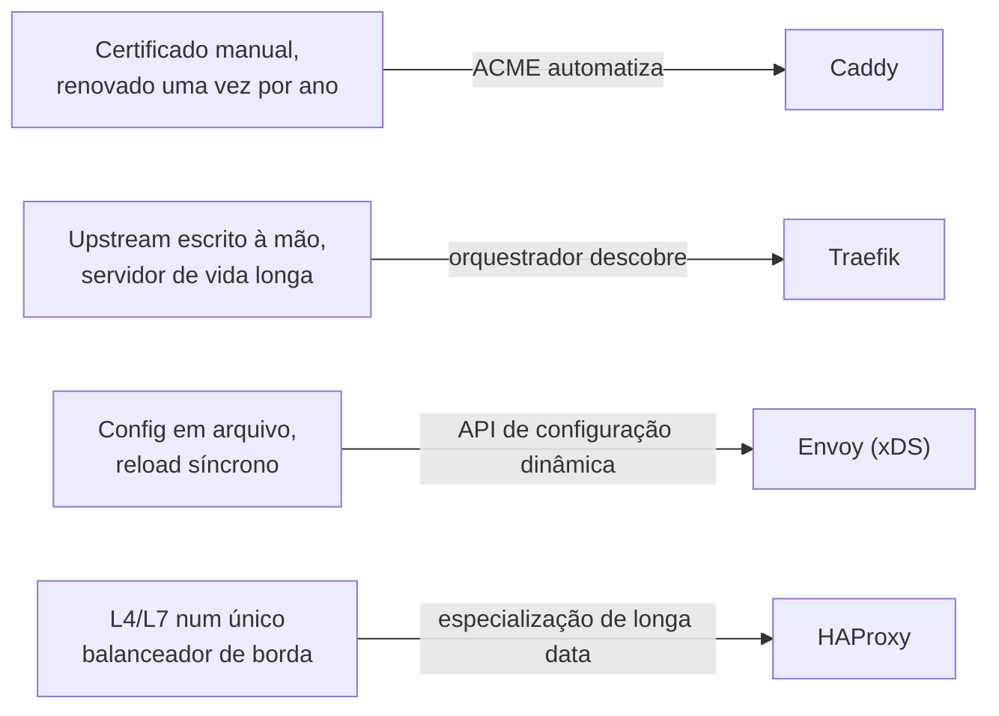
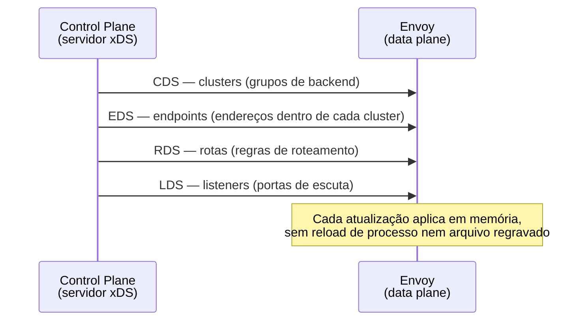
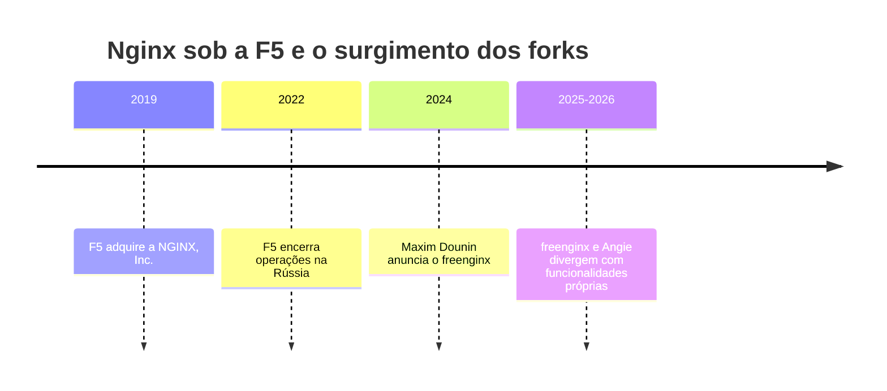

# 15 — O ecossistema além do Nginx

> [!abstract] TL;DR
> Em 2015, "preciso de um proxy na borda" e "vou usar Nginx" eram quase sinônimos. Em 2026 não são mais, e a razão não é que o Nginx piorou — é que o problema mudou de formato em três eixos que a nota 01 deste galho nunca precisou considerar: certificado deixou de ser artesanal e virou algo que se automatiza por padrão, o alvo do proxy deixou de ser um servidor de vida longa e virou um conjunto de containers que sobem e descem em minutos, e a configuração deixou de ser um arquivo editado à mão e virou um objeto que uma API escreve. Caddy responde ao primeiro eixo, Traefik ao segundo, Envoy ao terceiro — e cada um dos outros nomes deste ecossistema (HAProxy, OpenResty, os forks `freenginx` e Angie) resolve uma variação específica da mesma pergunta. Nada disso é veredito contra o Nginx: para a borda simples e para servir estático, ele continua sendo, hoje, a resposta mais razoável na maioria dos casos — o que mudou é que "a maioria dos casos" deixou de ser "todos os casos".

Um time vai colocar, hoje, uma borda na frente de um serviço novo — um conjunto de Deployments num cluster Kubernetes, expostos por trás de TLS, escalando conforme a carga. A pergunta "qual proxy uso" já não tem resposta automática, e o motivo aparece assim que alguém tenta escrever a receita clássica: provisionar certificado (renovação manual, ou um `certbot` cron, ou um `cert-manager` configurado à parte), escrever um `upstream` com a lista de backends (que muda a cada deploy, a cada scale-up, a cada Pod substituído), e editar um `nginx.conf` cada vez que algum desses dois lados muda. As notas [[03-Dominios/Tecnologia/Infraestrutura/Nginx/09 - TLS no Nginx|09]] e [[03-Dominios/Tecnologia/Infraestrutura/Nginx/14 - Nginx em container e como Ingress Controller|14]] deste galho já mostraram como o Nginx resolve cada uma dessas três coisas — TLS manual, `upstream` estático, config por arquivo reescrito por um controller externo —, e cada uma delas funciona. O que esta nota examina é que, para as três, hoje existe pelo menos uma ferramenta que resolve o mesmo problema assumindo, desde o desenho, que a resposta certa não é mais "arquivo editado à mão".

Vale marcar de antemão o que esta nota não é: não é um catálogo exaustivo de proxies, e não é uma corrida de recursos entre projetos concorrentes. Dezenas de ferramentas fariam parte de um catálogo desses — Apache Traffic Server, Varnish, Kong, Tyk, e a lista continua. O recorte aqui é mais estreito e mais útil: só os projetos que respondem, de forma nítida, a uma das três mudanças estruturais de problema que a seção seguinte nomeia, mais os dois forks diretos do próprio código-fonte do Nginx. Cada seção existe porque resolve uma pergunta concreta, não porque o projeto é popular.

## O eixo da nota: o que mudou no problema, não na ferramenta

O Nginx da nota [[03-Dominios/Tecnologia/Infraestrutura/Nginx/01 - O problema que o Nginx resolve|01]] nasceu para resolver o C10K — milhares de conexões concorrentes, um processo com poucos workers em vez de uma thread por conexão — num mundo onde um servidor rodava dias ou meses sem reiniciar, a configuração vivia num arquivo versionado à mão, e um certificado TLS era um artefato comprado, gerado e instalado manualmente uma vez por ano. Nenhuma dessas três premissas caiu por acidente — cada uma foi substituída por uma tecnologia específica que passou a existir depois, e é essa substituição, não uma falha do Nginx, que abre espaço para cada alternativa que esta nota cobre:

- **Certificado virou commodity automatizável.** O Let's Encrypt, lançado em 2016, tornou a emissão de certificado TLS gratuita e automatizável via ACME — o protocolo que a nota [[03-Dominios/Tecnologia/Infraestrutura/Nginx/09 - TLS no Nginx|09]] deste galho já cita como o que torna possível provisionar TLS sem intervenção manual. Uma ferramenta desenhada depois desse marco pode assumir ACME como comportamento padrão, em vez de tratá-lo como integração externa.
- **O alvo do proxy virou dinâmico.** Um `upstream` do Nginx, como a nota 08 já detalhou, é uma lista de endereços escrita (ou reescrita por template) num arquivo. Num mundo de containers orquestrados, essa lista muda a cada minuto — Pods sobem, caem, escalam — e uma ferramenta desenhada depois da adoção massiva de Docker e Kubernetes pode assumir, desde a raiz, que o alvo do proxy é descoberto em tempo real a partir do orquestrador, não escrito por um humano.
- **A configuração virou objeto de API, não arquivo.** A nota 14 já mostrou como um Ingress Controller resolve isso por fora do Nginx — observando a API do Kubernetes e gerando um `nginx.conf` novo a cada mudança. Uma ferramenta desenhada para esse mundo pode expor esse mecanismo como cidadão de primeira classe, com um protocolo próprio de atualização em tempo real em vez de reload de arquivo.

Vale insistir no porquê desse enquadramento importar mais do que parece à primeira vista: quem aprende "Caddy faz TLS automático, Traefik descobre serviço, Envoy é programável por API" como três fatos soltos memoriza trivia de marketing de produto. Quem entende que os três fatos são respostas a três mudanças específicas e datáveis no problema — Let's Encrypt em 2016, a adoção massiva de containers orquestrados ao longo da década seguinte, e a maturação de um protocolo de configuração dinâmica como o xDS — consegue prever, diante de uma quarta ferramenta ainda não coberta aqui, a que eixo ela provavelmente responde, só olhando para o problema que ela anuncia resolver. É a mesma disciplina de leitura que este galho inteiro já cultivou: entender o mecanismo, não decorar o catálogo.



Nenhuma dessas quatro respostas invalida o Nginx como arquitetura — cada uma resolve, de forma nativa, um problema que o Nginx também resolve, mas por outro caminho (arquivo estático, template reescrito por processo externo, `upstream` fixo). A pergunta que orienta cada seção seguinte não é "essa ferramenta é melhor" — é "qual dos três eixos acima pesa mais no cenário concreto em análise".

## Caddy: TLS automático por padrão

O Caddy responde diretamente ao primeiro eixo. A própria documentação declara o comportamento padrão sem ressalva: *"By default, Caddy automatically obtains and renews TLS certificates for all your sites."* Não é um plugin, não é uma flag opcional que alguém precisa lembrar de ativar — é o comportamento padrão do binário assim que um `Caddyfile` declara um domínio. Um bloco de configuração inteiro, no Caddy, pode se resumir a isto:

```
exemplo.com {
    reverse_proxy localhost:3000
}
```

O que essas duas linhas escondem, comparado ao equivalente em Nginx, é todo o ciclo de vida de certificado que as notas 09 e a seção de reload da nota 13 já detalharam para o Nginx: obter o certificado via ACME, armazená-lo, configurar o `listen 443 ssl`, agendar a renovação antes do vencimento, e recarregar o processo para servir o certificado renovado sem downtime — o Caddy faz as cinco coisas sozinho, sem exigir um `certbot` externo, um cron job de renovação, nem um script de reload disparado por fora. O que isso elimina de operação, na prática, é uma classe inteira de incidente que qualquer time que já operou TLS manual reconhece: o certificado que expira porque o cron de renovação falhou silenciosamente, ou porque alguém esqueceu de configurar o alerta de expiração — o mesmo tipo de erro operacional silencioso que a nota 13 já catalogou para reload malfeito, agora deslocado para o domínio de certificado.

O trade-off é simétrico ao ganho: um Caddy em produção depende de conseguir alcançar a infraestrutura ACME (validação HTTP-01 ou TLS-ALPN-01 contra a porta 80/443 pública, ou DNS-01 via um provedor de DNS suportado) no momento certo, e qualquer ambiente que bloqueie essa validação — uma rede interna sem saída para a internet, um firewall restritivo — exige configuração adicional para um certificado interno ou uma autoridade certificadora própria, o mesmo tipo de exceção que qualquer automação de certificado carrega. Para o caso comum — um serviço público, DNS já resolvendo para o IP do servidor — a automação funciona sem essa fricção.

Vale registrar, sem aprofundar, um segundo eixo de comparação que costuma aparecer numa avaliação lado a lado: o `Caddyfile` é deliberadamente mais compacto que um `nginx.conf` equivalente, porque assume convenções sensatas como padrão em vez de exigir que cada diretiva seja declarada — o bloco de duas linhas da seção anterior já embute proxy reverso, TLS automático, e um `listen` implícito nas portas 80 e 443. O preço dessa compacidade é menos controle explícito por diretiva individual: um `nginx.conf` complexo, com dezenas de `location` e regras de `map` condicionais (a nota 12 deste galho já detalhou esse vocabulário), tem um poder de expressão fina que o `Caddyfile` também alcança, mas via uma sintaxe mais verbosa ou via a API JSON nativa do Caddy — o formato de configuração completo e programático que o `Caddyfile` compila por baixo, e que ferramentas de automação preferem manipular diretamente em vez do formato textual pensado para humanos.

## Traefik: descoberta dinâmica de serviço

O Traefik responde ao segundo eixo. A documentação descreve o comportamento central do projeto como descoberta de serviço em tempo real: o Traefik "usa service discovery para configurar roteamento dinamicamente" e "se configura automática e dinamicamente" a partir da infraestrutura que já existe — Docker, Kubernetes, Consul, ou outro provedor suportado —, sem exigir que um humano mantenha um arquivo de rota sincronizado manualmente com o que está de fato rodando.

A diferença estrutural em relação ao Nginx (e ao Ingress Controller da nota 14) não é "o Traefik também observa a API do Kubernetes" — o `ingress-nginx` já fazia exatamente isso. A diferença é onde a fonte da verdade mora: o Nginx, mesmo dentro de um Ingress Controller, sempre tem, em algum momento do ciclo, um `nginx.conf` gerado e escrito em disco, que precisa ser recarregado — o mecanismo de "observar, gerar, recarregar" que a nota 14 já detalhou, com o custo de reload em escala que aquela nota também expôs. O Traefik nunca materializa esse arquivo intermediário: o roteamento vive como estrutura de dados em memória, atualizada incrementalmente a cada evento do provedor de descoberta, sem um passo equivalente a "gerar arquivo novo, sinalizar processo, esperar reload". Um container Docker novo, com os *labels* certos no próprio `docker run` ou `docker-compose.yml`, aparece roteável no Traefik sem nenhum arquivo de configuração adicional:

```yaml
services:
  api:
    image: minha-empresa/api:1.0
    labels:
      - "traefik.enable=true"
      - "traefik.http.routers.api.rule=Host(`api.exemplo.com`)"
```

A configuração, neste modelo, não é mais um arquivo separado que alguém escreve e mantém sincronizado com a realidade — é uma anotação no próprio manifesto que já declara o serviço, a mesma ideia de configuração-como-metadado-do-objeto que a nota 14 já mostrou para as *annotations* de um `Ingress`, só que aplicada nativamente, sem depender de tradução por um segundo processo.

Dentro de um cluster Kubernetes, o Traefik pode ser instalado tanto como implementação de Gateway API — a mesma tabela de implementações que a nota 14 já listou — quanto usando seu próprio `CustomResourceDefinition`, o `IngressRoute`, anterior à própria Gateway API e ainda amplamente usado por quem já tinha investimento nele antes da API padronizada existir:

```yaml
apiVersion: traefik.io/v1alpha1
kind: IngressRoute
metadata:
  name: api-route
spec:
  entryPoints:
    - websecure
  routes:
    - match: Host(`api.exemplo.com`) && PathPrefix(`/v1`)
      kind: Rule
      services:
        - name: api-service
          port: 80
  tls:
    certResolver: letsencrypt
```

O campo `certResolver: letsencrypt` amarra os dois eixos que esta nota já separou em seções distintas — o Traefik também resolve certificado via ACME automaticamente, herdando parte da mesma vantagem que a seção do Caddy descreveu, só que combinada, aqui, com a descoberta dinâmica de serviço que é o argumento central desta seção. É esse acúmulo de capacidades — descoberta dinâmica mais TLS automático mais um painel de observabilidade embutido (o *dashboard* do Traefik, que expõe rotas e certificados ativos numa interface web) — que faz o projeto ser adotado, com frequência, como substituto único para o que antes exigiria Nginx mais `cert-manager` mais uma ferramenta de observabilidade à parte.

## HAProxy: o veterano de L4/L7

O HAProxy não responde a nenhum dos três eixos da abertura desta nota — ele é anterior a todos eles, e continua relevante justamente por não precisar deles. A própria descrição do projeto o resume como um proxy reverso "livre, muito rápido e confiável, oferecendo alta disponibilidade, balanceamento de carga, e proxy para aplicações TCP e HTTP" — um resumo que já entrega o que diferencia o HAProxy do resto desta nota: ele opera com a mesma naturalidade tanto na camada 4 (TCP puro, sem entender HTTP) quanto na camada 7 (HTTP, com roteamento por header, cookie, path), a mesma distinção L4×L7 que a nota [[03-Dominios/Ciência/Redes e Protocolos/13 - Load balancing e CDN|Load balancing e CDN]] já formalizou como eixo central de qualquer discussão de balanceamento.

O Nginx também faz proxy L4 (via o módulo `stream`, que a nota 08 deste galho não detalhou por não ser o recorte do galho) e L7 — mas o HAProxy tem décadas de refinamento específico nessa fronteira, com algoritmos de balanceamento, health checks ativos configuráveis com granularidade fina, e um modelo de sessão TCP que times de infraestrutura de alto volume tratam como referência de mercado havia muito antes de container e orquestrador existirem como preocupação corrente. Onde o HAProxy ainda ganha, na prática, é exatamente onde o problema é balanceamento de tráfego puro — sem TLS automático a gerenciar, sem descoberta dinâmica de serviço como requisito central, sem necessidade de um plano de controle programável por API —, e o volume e a previsibilidade de latência importam mais do que qualquer conveniência de configuração declarativa. Um balanceador de banco de dados, um `keepalived` de camada 4 na frente de um cluster com requisito de baixíssima latência, ou uma borda de altíssimo volume que já tem processo de deploy maduro para configuração estática são cenários em que o HAProxy segue sendo, para muitos times, a escolha de menor risco — não por ser mais moderno, mas por ser o mais testado em exatamente esse tipo de carga.

A sintaxe do `haproxy.cfg` deixa visível uma separação estrutural que o Nginx expressa de forma menos explícit — `frontend` (o que escuta a conexão de entrada) e `backend` (o pool de servidores que a recebe) são blocos distintos, ligados por regras de roteamento (`use_backend`), em vez de misturados dentro do mesmo `server`/`location` que o Nginx usa para os dois papéis:

```
frontend borda_http
    bind *:443 ssl crt /etc/ssl/certs/exemplo.pem
    acl eh_api path_beg /api
    use_backend api_backend if eh_api
    default_backend web_backend

backend api_backend
    balance leastconn
    option httpchk GET /healthz
    server api1 10.0.1.10:3000 check
    server api2 10.0.1.11:3000 check

backend web_backend
    balance roundrobin
    server web1 10.0.2.10:8080 check
```

O `option httpchk` e o `check` em cada linha de `server` são health checks ativos — o HAProxy sonda cada backend periodicamente por conta própria, independente de qualquer requisição de cliente, e remove da rotação um servidor que pare de responder. O health check do Nginx OSS, coberto pela nota 08 deste galho, é passivo por padrão — reage a falhas observadas em requisições reais de cliente, não sonda proativamente sem que uma requisição real dispare a observação —, uma diferença de comportamento que pesa exatamente nos cenários de altíssimo volume onde o HAProxy costuma ser escolhido: detectar um backend degradado antes que ele afete uma fração perceptível do tráfego real, não depois.

## Envoy: o data plane programável por API

O Envoy é a resposta mais direta ao terceiro eixo — e o que mais se afasta do modelo de arquivo-e-reload que o Nginx (e até o `ingress-nginx` da nota 14) ainda carrega em algum ponto do ciclo. A própria documentação descreve o projeto como "um proxy L7 e um barramento de comunicação desenhado para arquiteturas de serviço modernas em larga escala", formando "uma malha de comunicação transparente" entre os serviços que ele intermedia — e o ponto técnico central por trás dessa descrição é que o Envoy "consome, opcionalmente, um conjunto de APIs de configuração dinâmica para gestão centralizada", que fornecem atualizações sobre hosts, clusters, roteamento, sockets de escuta e material criptográfico, todas em tempo real, sem reiniciar nem recarregar o processo.

Esse conjunto de APIs é o que o ecossistema chama de **xDS** — Discovery Service, com um `x` que varia conforme o que está sendo descoberto: `CDS` (Cluster Discovery Service, os grupos de backends), `EDS` (Endpoint Discovery Service, os endereços dentro de cada cluster), `LDS` (Listener Discovery Service, as portas de escuta), `RDS` (Route Discovery Service, as regras de roteamento), `SDS` (Secret Discovery Service, os certificados). Onde o Nginx precisa de um `nginx.conf` inteiro regravado e um `HUP` para trocar até uma única regra de rota, um Envoy conectado a um servidor xDS recebe a atualização como uma chamada de API — normalmente gRPC — e aplica a mudança em memória, sem o custo de reload que a nota 14 já detalhou como o gargalo de escala de qualquer Ingress Controller baseado em arquivo.



É essa separação explícita entre **control plane** (quem decide o que a configuração deveria ser — um serviço externo, escrito por quem opera a malha) e **data plane** (o Envoy, que só aplica o que o control plane manda, e efetivamente move os bytes) que torna o Envoy a peça de infraestrutura por trás de tanta coisa que este galho e o de [[03-Dominios/Tecnologia/Infraestrutura/Kubernetes/15 - Ingress e a borda do cluster|Kubernetes]] já mencionaram: é o motor de tráfego mais comum atrás de implementações de *service mesh*, e a nota 14 já listou, na tabela de implementações de Gateway API, duas linhas cujo *data plane* é Envoy — Envoy Gateway e Contour — mais uma terceira, Cilium, que o embute como parte do próprio CNI. Operar essa malha de comunicação em produção — divisão de responsabilidade entre plano de controle e plano de dados, como isso se combina com o resto da borda — é o assunto que [[03-Dominios/Engenharia/Operação/3 - Rodar em produção/05 - Rede e borda em produção|Rede e borda em produção]] trata sob a ótica de quem já está operando, não construindo, essa peça.

Vale ver como o mesmo alvo da nota 14 — um `Ingress` reescrito por um controlador Nginx — se expressa no vocabulário de Gateway API que uma implementação baseada em Envoy (Envoy Gateway ou Contour) consome, para deixar concreto o que "config vira objeto de API" significa na prática:

```yaml
apiVersion: gateway.networking.k8s.io/v1
kind: HTTPRoute
metadata:
  name: api-route
spec:
  parentRefs:
    - name: borda-publica
  hostnames:
    - "api.exemplo.com"
  rules:
    - matches:
        - path:
            type: PathPrefix
            value: /v1
      backendRefs:
        - name: api-service
          port: 80
```

Note o que não existe neste manifesto: nenhuma referência a `nginx.conf`, a `location`, a template Go, a processo de reload. O `HTTPRoute` é consumido diretamente pelo control plane da implementação escolhida, que traduz o objeto em atualização xDS (no caso de uma implementação Envoy) ou em configuração equivalente (no caso do NGINX Gateway Fabric, que ainda internamente gera e recarrega um Nginx, herdando o mesmo mecanismo que a nota 14 já detalhou). A API é a mesma para as duas famílias de implementação — o que muda, por baixo, é só como cada uma converte a declaração em tráfego de fato roteado.

O preço dessa flexibilidade é complexidade operacional real: rodar Envoy sozinho, sem um control plane que fale xDS, é possível (configuração estática, como qualquer outro proxy), mas descarta exatamente a vantagem que motiva escolhê-lo em primeiro lugar. Um bootstrap estático mínimo — o ponto de partida antes de qualquer control plane entrar em cena — já expõe a mesma separação de vocabulário (`listeners`, `clusters`) que as mensagens xDS depois atualizam dinamicamente:

```yaml
static_resources:
  listeners:
    - name: listener_0
      address:
        socket_address: { address: 0.0.0.0, port_value: 8080 }
      filter_chains:
        - filters:
            - name: envoy.filters.network.http_connection_manager
              typed_config:
                "@type": type.googleapis.com/envoy.extensions.filters.network.http_connection_manager.v3.HttpConnectionManager
                route_config:
                  virtual_hosts:
                    - name: local_route
                      domains: ["*"]
                      routes:
                        - match: { prefix: "/" }
                          route: { cluster: api_cluster }
  clusters:
    - name: api_cluster
      connect_timeout: 1s
      type: STRICT_DNS
      load_assignment:
        cluster_name: api_cluster
        endpoints:
          - lb_endpoints:
              - endpoint:
                  address:
                    socket_address: { address: minha-api, port_value: 3000 }
```

Essa configuração estática funciona sozinha, sem nenhum control plane — mas é exatamente o ponto de partida que qualquer distribuição madura substitui por atualização dinâmica: no Istio, o componente `istiod` fala xDS com cada Envoy do *sidecar* injetado em cada Pod da malha; no Envoy Gateway e no Contour, listados na tabela de implementações de Gateway API da nota 14, é o próprio controlador que traduz `Gateway`/`HTTPRoute` em atualizações xDS, o mesmo padrão observar-traduzir-aplicar que a nota 14 já descreveu para o `ingress-nginx`, só que aplicando o resultado via chamada de API em memória em vez de arquivo regravado. A maior parte de quem adota Envoy não escreve o control plane do zero — adota uma dessas distribuições já prontas. É um investimento de arquitetura proporcional ao problema: uma malha de dezenas de serviços com requisitos finos de roteamento, observabilidade e segurança de tráfego lateral justifica esse investimento; um proxy simples na frente de um monólito, normalmente não.

## OpenResty: a via de extensão que este galho não cobre

O OpenResty foi criado por Yichun Zhang (conhecido pelo identificador `agentzh`) em 2007, e desde 2017 é mantido principalmente pela OpenResty Software Foundation e pela OpenResty Inc., que dão suporte institucional ao trabalho que antes dependia mais diretamente de uma única pessoa — o mesmo tipo de amadurecimento de governança que a seção sobre quem mantém cada projeto, adiante nesta nota, também documenta para os outros seis nomes.

O OpenResty parte de uma pergunta diferente das quatro anteriores — não "que problema o Nginx resolve mal", mas "e se o Nginx pudesse ser programado por dentro". O projeto empacota o Nginx com o LuaJIT embutido, expondo *hooks* em cada fase do ciclo de vida de uma request — a mesma sequência de fases que a nota [[03-Dominios/Tecnologia/Infraestrutura/Nginx/05 - O ciclo de vida de uma request|05]] deste galho já formalizou como o eixo central do galho inteiro — para código Lua arbitrário rodar em qualquer uma delas: decidir um `rewrite` com lógica de negócio completa, consultar um banco de dados antes de decidir o `upstream`, validar um JWT sem depender de um módulo compilado à parte. Onde o Nginx puro expõe um conjunto fixo de diretivas, o OpenResty expõe uma linguagem de programação completa dentro do mesmo processo master/worker — uma diretiva como `access_by_lua_block` amarra código Lua diretamente à fase de acesso que a nota 05 já nomeou, o mesmo lugar onde `allow`/`deny` decide se uma requisição segue adiante, só que agora com lógica arbitrária em vez de uma lista estática de IPs:

```nginx
location /api/ {
    access_by_lua_block {
        local token = ngx.req.get_headers()["Authorization"]
        if not token or not valida_jwt(token) then
            ngx.exit(ngx.HTTP_UNAUTHORIZED)
        end
    }
    proxy_pass http://backend;
}
```

O roadmap deste galho já registrou essa fronteira como corte consciente, não como lacuna esquecida: escrever extensão para o Nginx — seja via `njs` (o motor de scripting nativo do próprio Nginx, mais restrito), seja via Lua sobre OpenResty (mais completo) — é autoria de módulo, um ofício diferente de operar o Nginx como caixa configurável, e um tutorial de autoria duplicaria a documentação oficial sem acrescentar leitura própria a este vault. O que fica registrado aqui é só a existência da via e o motivo de ela ficar de fora: qualquer cenário em que a resposta certa é "preciso de lógica de programação de verdade dentro do ciclo de request, não mais uma diretiva declarativa" é o sinal de que o problema saiu do escopo de configuração e entrou no escopo de extensão — e esse é exatamente o ponto em que este galho para, por decisão, não por limite de espaço.

## Os forks: freenginx e Angie

Duas ramificações diretas do código-fonte do Nginx merecem nome próprio nesta nota, porque não são "alternativas inspiradas no Nginx" como as cinco anteriores — são o próprio código, divergindo.

### freenginx: divergência declarada, não espelho

Em 14 de fevereiro de 2024, Maxim Dounin — desenvolvedor que já fazia parte do núcleo histórico do Nginx — anunciou, na lista de e-mails de desenvolvimento do próprio projeto Nginx, a criação do `freenginx`. O anúncio original declara o objetivo sem rodeio: manter o desenvolvimento do Nginx livre de ações corporativas arbitrárias — *"The goal of the project is to keep nginx development free from arbitrary corporate actions"* —, e descreve o `freenginx` como um projeto alternativo, conduzido por desenvolvedores, não por uma entidade corporativa, com convite explícito à participação da comunidade. O motivo declarado no próprio anúncio foi uma divergência específica de política de segurança: segundo Dounin, uma gestão não-técnica recente na F5 decidiu, sem discussão com os desenvolvedores, forçar um lançamento de segurança para bugs em código HTTP/3 então experimental — contrariando a própria política de segurança que o projeto já tinha e que os desenvolvedores endossavam.

O `freenginx` não é um espelho estático do repositório original — é um projeto vivo, com releases regulares e funcionalidades próprias que o Nginx mantido pela F5 não tem. A numeração de versão corre em paralelo à do Nginx, o que facilita confundir os dois: a mainline do `freenginx` estava em 1.31.3 em 7 de julho de 2026, e a stable em 1.30.1 em 2 de junho de 2026 — coincidindo, na mainline, com o mesmo número 1.31.3 que a baseline deste galho já usa para o Nginx da F5. O changelog do próprio projeto documenta divergências concretas de funcionalidade, resumidas na tabela abaixo, cada uma ausente do Nginx equivalente da F5 na mesma janela de tempo:

| Funcionalidade do `freenginx` | O que resolve |
|---|---|
| Suporte à extensão *Encrypted Client Hello* (ECH) do TLS 1.3 | Cifra o próprio `ClientHello`, incluindo o SNI, contra observação de rede |
| Diretivas `send_min_rate` e `client_body_min_rate` | Taxa mínima obrigatória de envio/recebimento, uma proteção adicional contra conexões deliberadamente lentas |
| `limit_rate` com algoritmo de balde furado | Tratamento mais preciso de limite de banda por conexão — o mesmo conceito de balde furado que a nota 11 deste galho já explicou para `limit_req` |
| Limitação de conexão e `limit_rate` no módulo de proxy de mail | Estende ao proxy de e-mail um controle que antes só existia para HTTP |
| GeoIP2 em formato MaxMind DB (MMDB) e diretiva `geoip_set` | Suporte ao formato atual de banco de geolocalização, sucessor do formato legado que o módulo GeoIP original da F5 ainda usa |

Nenhuma dessas cinco linhas é reversível numa simples troca de binário sem custo — um time que já roda Nginx da F5 e quer essas funcionalidades específicas precisa avaliar migrar para o `freenginx` como um todo, não importar só a funcionalidade isolada, porque o projeto não distribui essas mudanças como patch aplicável sobre o Nginx oficial.



### Angie: origem em ex-desenvolvedores do núcleo, hoje projeto ativo

O Angie tem origem diferente do `freenginx`: não é o trabalho de uma única pessoa em desacordo com uma decisão específica, é um produto de uma empresa, a Web Server LLC, fundada por parte da equipe que historicamente desenvolvia o núcleo do Nginx. O fechamento do escritório da F5 em Moscou, em 2022, é fato confirmado em fonte primária — é o próprio Maxim Dounin quem o menciona, de passagem, no anúncio do `freenginx` citado acima. Já a ligação entre esse fechamento e a formação da Web Server LLC vem de cobertura jornalística secundária, não de declaração do próprio projeto: **segundo o Linuxiac**, a empresa foi formada por parte da equipe sênior de engenharia que trabalhava na filial russa. O grau de certeza aqui é menor do que no caso do `freenginx`, cujo anúncio é público e assinado, e vale registrar a diferença em vez de nivelar as duas histórias. O que não depende de fonte secundária nenhuma é o produto: o Angie é um fork do Nginx, distribuído sob licença BSD, mantido como substituto direto (*drop-in replacement*) que preserva compatibilidade de configuração e de módulos com o Nginx original.

O repositório do projeto no GitHub, sob o nome `webserver-llc/angie`, mostra um histórico de mais de onze mil commits, cerca de 2,5 mil estrelas, e a própria documentação declara um ritmo de release trimestral, com correções urgentes publicadas entre uma versão trimestral e outra. A versão mais recente publicada até a escrita desta nota, 1.12.1, saiu em 17 de julho de 2026. A documentação do projeto também declara que o Angie inclui a maior parte das capacidades do Nginx 1.31.2 mais um conjunto de recursos adicionais — um padrão de divergência análogo ao do `freenginx`, mas motivado por continuidade de equipe e de mercado em vez de por uma disputa pontual de política de segurança.

A tabela abaixo resume, lado a lado, as três origens — não como comparação de qual é "melhor", mas como registro do que de fato diferencia cada uma, para quem precisar decidir entre elas com base em fato e não em rumor:

| | Nginx (F5) | freenginx | Angie |
|---|---|---|---|
| Origem | Código original, mantido pela F5 desde a aquisição de 2019 | Bifurcação anunciada por Maxim Dounin em fev. 2024, em desacordo com uma decisão de política de segurança da F5 | Fork mantido pela Web Server LLC, fundada por parte da equipe sênior que ficou na Rússia após a F5 encerrar operações ali em 2022 |
| Modelo de manutenção | Corporativo, dentro da F5 | Conduzido por desenvolvedores, sem entidade corporativa por trás, segundo o próprio anúncio | Empresa dedicada (Web Server LLC), com produto comercial associado (Angie PRO) |
| Compatibilidade de configuração | Referência — é o formato original | Compatível — parte do mesmo código-base | Compatível — declarado como substituto direto (*drop-in replacement*) |
| Última versão citada nesta nota | mainline 1.31.3 (15 jul 2026) / stable 1.30.4 | mainline 1.31.3 (7 jul 2026) / stable 1.30.1 (2 jun 2026) | 1.12.1 (17 jul 2026) |
| Licença | 2-clause BSD | 2-clause BSD (herdada do código original) | BSD |

## O que aconteceu com o Nginx sob a F5

Os fatos públicos e datados, sem inferência sobre motivação corporativa: a F5 adquiriu a NGINX, Inc. em 2019, tornando-se a entidade responsável pelo desenvolvimento do Nginx open source e pelo produto comercial NGINX Plus. Em agosto de 2022, a F5 encerrou operações na Rússia — evento que a seção anterior já registrou como pano de fundo direto da fundação da Web Server LLC e, por extensão, do Angie. Em fevereiro de 2024, Maxim Dounin anunciou o `freenginx`, citando publicamente uma divergência de política de segurança com a gestão da F5 como motivo — a citação já reproduzida na seção anterior é o que o próprio anúncio declara como objetivo, não uma leitura externa sobre intenção da empresa. O Nginx continua sendo desenvolvido sob a F5 até esta escrita, com releases mainline e stable regulares — a baseline deste galho inteiro, mainline 1.31.3 e stable 1.30.4, é evidência direta disso —, e a existência dos dois forks não significa que o Nginx da F5 parou: significa que, pela primeira vez desde o lançamento original em 2004 (nota [[03-Dominios/Tecnologia/Infraestrutura/Nginx/01 - O problema que o Nginx resolve|01]] deste galho), o código-fonte do Nginx tem mais de um caminho de desenvolvimento ativo e público, cada um respondendo a uma pressão diferente.

O que esta nota deliberadamente não faz é especular sobre a motivação da F5 como empresa, nem sobre qualquer disputa pessoal entre indivíduos — nenhuma dessas duas coisas é um fato verificável em fonte pública datada, e afirmar qualquer uma delas seria opinião disfarçada de reportagem. O que é verificável, e é o que esta seção registra, é a sequência de eventos e o que cada parte envolvida declarou publicamente sobre si mesma: a F5 segue publicando releases do Nginx; o anúncio do `freenginx` declara seu próprio objetivo nas palavras já citadas; a Web Server LLC declara, na própria documentação do Angie, a continuidade de equipe como razão de existir. Três fatos, três fontes primárias, sem terceira leitura sobreposta.

Vale amarrar essa história ao restante do galho, porque ela reforça um ponto que já apareceu na nota 14: a aposentadoria do `ingress-nginx` pelo Kubernetes SIG Network, anunciada em novembro de 2025, foi uma decisão de manutenção comunitária insuficiente — sem relação alguma com a divisão entre Nginx-F5, `freenginx` e Angie que esta nota acabou de descrever. São dois eventos independentes, em duas partes diferentes do ecossistema (o servidor em si versus um controller externo que o embute), que aconteceram na mesma janela de tempo por coincidência de calendário, não por causa comum — e é fácil, numa leitura apressada, confundir os dois como sintoma de um único problema estrutural do "mundo Nginx". Não são.

## Exemplo trabalhado: o mesmo cenário, três respostas de arquitetura

Para tornar os três eixos da abertura desta nota concretos em vez de abstratos, vale seguir um único cenário — uma API atrás de TLS, com dois backends que podem escalar — por três caminhos de configuração diferentes, cada um representando a resposta natural de uma ferramenta a um dos três eixos.

Com **Nginx**, o caminho é o que as notas 07, 08 e 09 deste galho já ensinaram: um `upstream` estático, TLS configurado manualmente (ou via um `cert-manager` externo que grava o `Secret` que a nota 14 já mostrou sendo montado no Pod), e qualquer mudança de backend exige editar o arquivo e recarregar:

```nginx
upstream api_backend {
    server 10.0.1.10:3000;
    server 10.0.1.11:3000;
}

server {
    listen 443 ssl;
    server_name api.exemplo.com;
    ssl_certificate     /etc/nginx/certs/api.exemplo.com.crt;
    ssl_certificate_key /etc/nginx/certs/api.exemplo.com.key;

    location / {
        proxy_pass http://api_backend;
    }
}
```

Com **Caddy**, o certificado desaparece da configuração — não porque foi omitido, mas porque deixou de ser uma preocupação de configuração:

```
api.exemplo.com {
    reverse_proxy 10.0.1.10:3000 10.0.1.11:3000
}
```

Com **Traefik**, dentro de Kubernetes, é o alvo do proxy que deixa de ser escrito à mão — o `IngressRoute` já mostrado na seção do Traefik referencia um `Service` do Kubernetes, e o próprio Traefik consulta o `Endpoints`/`EndpointSlice` daquele Service em tempo real para saber quais Pods estão de pé naquele instante, sem que ninguém precise editar uma lista de IPs quando o Deployment escala de dois para cinco réplicas.

O que os três exemplos deixam visível, lado a lado, é exatamente o argumento da abertura desta nota: nenhuma das três configurações é "mais avançada" que as outras em abstrato — cada uma otimiza para o eixo que pesa mais no cenário que a motivou. O Nginx exige mais linhas porque assume, corretamente para o seu caso de uso histórico, que certificado e lista de backends mudam raramente o bastante para justificar edição manual; o Caddy e o Traefik exigem menos linhas porque assumem, cada um à sua maneira, que uma dessas duas coisas muda com frequência o bastante para merecer automação nativa.

## Quem mantém cada projeto

A pergunta "quem está por trás disso, e o que acontece se essa entidade desaparecer" é parte legítima de qualquer avaliação de infraestrutura de borda — a mesma pergunta que a nota 16 do galho de [[03-Dominios/Tecnologia/Infraestrutura/Docker/16 - O ecossistema além do Docker|Docker]] já levantou ao comparar o suporte comercial único da Docker Inc. contra o ecossistema federado de Podman/Buildah/nerdctl. Vale responder essa pergunta aqui com a mesma disciplina de fonte datada, em vez de assumir que "é open source" já responde tudo:

| Projeto | Origem | Quem mantém hoje |
|---|---|---|
| Caddy | Criado por Matt Holt | Dyanim, LLC (empresa de Matt Holt) mais patrocínio de empresas que dependem do projeto; ZeroSSL é o patrocinador executivo e provê uma segunda autoridade certificadora além do Let's Encrypt |
| Traefik | Criado em 2016 | Traefik Labs, empresa fundada para o projeto, com produto comercial (Traefik Hub) por cima da base open source |
| HAProxy | Criado por Willy Tarreau em 2001 | HAProxy Technologies, empresa fundada pelo autor original, que segue como CTO liderando o time de desenvolvimento central |
| Envoy | Criado na Lyft em 2015, OSS desde 2016 | Projeto graduado da Cloud Native Computing Foundation (CNCF) desde novembro de 2018 — governança de fundação, não de uma única empresa |
| OpenResty | Criado por Yichun Zhang (agentzh) em 2007 | Mantido principalmente pelo próprio autor, com suporte institucional da OpenResty Software Foundation e da OpenResty Inc. desde 2017 |
| freenginx | Anunciado por Maxim Dounin em 2024 | Conduzido por desenvolvedores, sem entidade corporativa declarada, segundo o próprio anúncio |
| Angie | Fork da Web Server LLC | Empresa dedicada, com produto comercial associado (Angie PRO) |

O padrão que emerge dessa tabela é heterogêneo de propósito: Envoy tem a governança mais distribuída de todo o grupo, por estar sob uma fundação com múltiplos membros pagantes em vez de uma única empresa; HAProxy e Traefik têm o modelo mais parecido com o do Nginx pré-F5 — empresa fundada pelos próprios criadores, com produto comercial por cima do núcleo aberto; Caddy e OpenResty dependem mais diretamente do trabalho de uma pessoa específica, ainda que com suporte institucional por trás. Nenhum desses modelos é "mais seguro" em abstrato — cada um carrega um risco de continuidade diferente, e a régua para avaliar esse risco é sempre a mesma pergunta concreta: se a organização ou pessoa por trás do projeto sumisse amanhã, o que aconteceria com o código já em produção? A resposta, para qualquer um dos sete projetos desta nota, é a mesma que vale para o próprio Nginx: o código já publicado continua funcionando, mas para de receber correção — o mesmo destino que a nota 14 já descreveu, em detalhe, para o `ingress-nginx` depois de março de 2026.

## O custo de trocar: o que continua pesando a favor do Nginx

Nada do que esta nota descreveu até aqui é argumento para trocar o Nginx por padrão. A honestidade que esta nota deve ao leitor é a mesma que a nota 14 já cobrou de si mesma sobre a aposentadoria do `ingress-nginx`: critério de decisão, não propaganda de alternativa. Três eixos concretos pesam a favor de continuar com o Nginx na maior parte dos casos, independente de qual eixo da abertura desta nota pareça, à primeira vista, tentador de resolver de outra forma:

**Onipresença em documentação, exemplos e runbooks já escritos.** A esmagadora maioria dos tutoriais, respostas de fórum, templates de infraestrutura como código e runbooks de incidente que já existem — inclusive as quinze notas anteriores deste próprio galho — assumem o vocabulário do Nginx: `location`, `upstream`, `proxy_pass`, o modelo de fases da nota 05. Trocar de ferramenta não é só trocar um binário — é reescrever conhecimento operacional acumulado, e esse custo raramente se paga só pelos ganhos arquiteturais de uma alternativa, a menos que o problema específico que a motiva esteja, de fato, presente.

**Maturidade testada em produção por duas décadas.** O Nginx original foi lançado em 2004 (nota 01), e passou por praticamente todo padrão de carga, ataque e caso de borda que a internet pública já produziu nesse intervalo. Caddy, Traefik e Envoy são projetos mais jovens — maduros o bastante para produção séria, mas com décadas a menos de exposição acumulada a tráfego adversarial real. Isso não é garantia de bug em nenhum dos três; é, simplesmente, menos tempo de mercado testando os limites de cada um.

**Simplicidade operacional quando o problema é, de fato, simples.** Um `nginx.conf` de trinta linhas servindo um site institucional com certificado renovado uma vez por ano via `cron` não ganha nada em confiabilidade trocando para uma ferramenta desenhada para descoberta dinâmica de centenas de backends — ganha, na verdade, uma superfície de configuração nova para aprender, sem nenhum dos três eixos da abertura desta nota realmente pesando naquele cenário. A pergunta certa nunca é "essa alternativa é tecnicamente superior" — é "o problema que motivou essa alternativa a existir está presente aqui, ou é hipotético".

Juntando os três eixos com os da abertura desta nota: a régua de decisão não é sobre qual ferramenta vence numa comparação abstrata de recursos — é sobre qual delas resolve, sem fricção adicional, o problema concreto que está na mesa. Para a maioria dos times, na maioria dos dias, esse problema continua sendo exatamente o que o Nginx já resolve bem.

> [!tip] Vídeo — um time que de fato pagou o custo da troca, lido com ceticismo
> [**Dropbox migrates to Envoy from NginX — Let us discuss**](https://www.youtube.com/watch?v=ckraiZ_qa2o) (Hussein Nasser, ~36 min, EN) é o contrapeso empírico do que esta nota argumenta em princípio: uma leitura comentada, parágrafo a parágrafo, do relato de engenharia em que o Dropbox migrou sua borda de Nginx para Envoy. Os motivos que eles mediram são concretos e nomeáveis — HTTP/2 fim a fim com gRPC atravessando o proxy, cauda de latência crescendo sob carga, e I/O de disco ainda bloqueando mesmo depois de ligar `reuseport` (o mesmo mecanismo da nota 01, aqui aparecendo com seu limite prático). O valor de assistir com o autor, e não só ler o artigo original, é que ele marca onde o relato passa de engenharia a propaganda — e nota que, no eixo de **segurança**, o próprio artigo pende para o Nginx, por superfície de código menor e menos dependências de terceiros. **O que ele não cobre:** Caddy, Traefik, o xDS em detalhe e a questão da governança sob a F5 — nada do que as outras seções desta nota tratam; é um estudo de caso de um par específico, não um panorama. Trecho de destaque [11:15]: *"let's discuss security — so this is a prop for nginx, surprisingly: the balance goes towards nginx. This article says nginx actually has a smaller code surface, and that means they don't have as much dependence."*
>
> 🎬 [Assistir no YouTube](https://www.youtube.com/watch?v=ckraiZ_qa2o)

## Uma tabela de decisão honesta

| Se o problema concreto é... | A escolha razoável é... | Por quê |
|---|---|---|
| Borda simples, poucos domínios, sem time dedicado a operar TLS | **Nginx** | Configuração estável, documentação madura, o modelo que este galho inteiro já ensinou |
| Servir arquivos estáticos, com ou sem cache de borda | **Nginx** | `sendfile`, `try_files`, controle fino de cache — nota 06 e nota 10 deste galho |
| TLS automático sem equipe dedicada a gerenciar certificado | **Caddy** | ACME embutido, renovação automática, sem cron externo |
| Alvo do proxy muda com frequência (containers subindo/descendo) sem cluster completo | **Traefik** | Descoberta dinâmica direto do Docker/orquestrador, sem arquivo intermediário |
| Balanceamento L4/L7 de altíssimo volume, com processo de deploy maduro para config estática | **HAProxy** | Décadas de refinamento específico nessa fronteira |
| Malha de serviços com roteamento, observabilidade e segurança de tráfego lateral finos | **Envoy** (via uma distribuição de control plane) | Plano de controle programável por API, sem reload de processo |
| Borda de cluster Kubernetes, hoje | **Uma implementação de Gateway API** (nota 14) | `ingress-nginx` aposentado; NGINX Gateway Fabric mantém o Nginx como *data plane* dentro desse modelo |
| Lógica de programação real dentro do ciclo de request (validação custom, consulta externa antes de rotear) | **OpenResty** | Fora do recorte deste galho — é autoria de módulo, ofício diferente |
| Continuidade de código Nginx fora do controle da F5, com funcionalidades próprias | **freenginx** ou **Angie** | Cada um diverge por um motivo diferente — política de segurança versus continuidade de equipe |

A leitura correta desta tabela não é "identifique a linha certa e troque de ferramenta" — é notar que a primeira e a segunda linha, de longe as mais comuns em produção real, continuam apontando para o Nginx. As linhas seguintes só pesam quando o problema específico que motivou cada alternativa está, de fato, presente — a mesma régua de decisão que a nota [[03-Dominios/Tecnologia/Infraestrutura/Docker/16 - O ecossistema além do Docker|16 do galho de Docker]] já aplicou ao comparar Podman, Buildah e nerdctl contra o próprio Docker: nenhuma alternativa nova invalida a ferramenta original, cada uma resolve um recorte mais estreito do mesmo espaço de problema.

### Diagnóstico rápido: qual ferramenta para qual cenário

Reunindo os critérios espalhados pela nota inteira num guia direto, para consultar quando a pergunta concreta aparecer:

- **Site institucional ou blog, poucos domínios, sem time dedicado à borda.** Nginx ou Caddy — Nginx se já existe familiaridade e infraestrutura de deploy prontas; Caddy se o time quer eliminar de vez o ciclo manual de certificado.
- **Ambiente de desenvolvimento local com múltiplos serviços em containers Docker, precisando de roteamento por hostname sem configuração manual.** Traefik, pela descoberta automática direto do Docker — o cenário em que o `docker-compose.yml` com *labels* já citado nesta nota resolve o problema inteiro sem nenhum arquivo de configuração adicional.
- **Borda de altíssimo volume, latência crítica, com processo de deploy já maduro para configuração estática.** HAProxy — o cenário em que a previsibilidade de comportamento sob carga pesa mais do que qualquer conveniência de configuração dinâmica.
- **Malha de dezenas de microsserviços com necessidade de observabilidade e política de tráfego lateral fina.** Envoy, via uma distribuição de *service mesh* já pronta (Istio é a mais adotada) — nunca Envoy cru sem control plane, pelo motivo já detalhado na seção do Envoy.
- **Borda de um cluster Kubernetes, hoje, começando do zero.** Uma implementação de Gateway API (nota [[03-Dominios/Tecnologia/Infraestrutura/Kubernetes/15 - Ingress e a borda do cluster|Ingress e a borda do cluster]], que lista as opções) — nunca `ingress-nginx`, que está aposentado desde março de 2026.
- **Time que já opera Nginx com investimento profundo em configuração e quer só sair do controle da F5.** `freenginx` se a prioridade é política de segurança conduzida por desenvolvedores; Angie se a prioridade é continuidade de equipe com produto comercial por trás.
- **Necessidade de lógica de programação real dentro do ciclo de request — validação customizada, consulta a serviço externo antes de rotear.** OpenResty — fora do recorte deste galho, mas o caminho correto quando a resposta certa deixou de ser uma diretiva declarativa.
- **Servir estático com cache de borda agressivo, sem necessidade de descoberta dinâmica nem TLS automatizado.** Nginx — o caso de uso onde as notas 06 e 10 deste galho já entregam tudo que é necessário, sem nenhuma vantagem real de trocar de ferramenta.
- **Auditoria de segurança exigindo continuidade de correção rápida, fora do calendário de release de uma única empresa.** `freenginx`, pela declaração explícita de prioridade a política de segurança conduzida por desenvolvedores — mas só depois de avaliar o custo de trocar já catalogado nesta nota, não como resposta automática a qualquer preocupação de segurança.

> [!info] Caducidade deste assunto
> Esta é a nota do galho que envelhece mais depressa, junto com a nota 14 — o estado de cada projeto (maturidade, ritmo de release, qual implementação de Gateway API tem mais tração) muda em meses, não em anos. Baseline desta nota: Nginx mainline 1.31.3 (15 jul 2026) e stable 1.30.4; freenginx mainline 1.31.3 (7 jul 2026) e stable 1.30.1 (2 jun 2026); Angie 1.12.1 (17 jul 2026); nota escrita em 8 de agosto de 2026. Releia com ceticismo passado um ano ou dois — em particular, verifique se algum dos forks ganhou ou perdeu tração, e se a lista de implementações de Gateway API da nota 14 ainda reflete o estado do ecossistema.

## Migrar sem perder o que a configuração já expressa

Um `nginx.conf` de produção madura carrega, quase sempre, mais lógica do que aparenta à primeira leitura — regras de `rewrite` condicionais, cabeçalhos customizados por rota, limites de taxa específicos por cliente. Migrar para qualquer uma das ferramentas desta nota não é encontrar o comando equivalente linha a linha — é reler a intenção por trás de cada diretiva e expressá-la no vocabulário novo, exatamente o mesmo aviso que a nota 14 já fez sobre *annotations* de `Ingress` específicas de controlador não migrarem automaticamente para `HTTPRoute`. A tabela abaixo cobre o mapeamento das operações mais comuns, útil como ponto de partida — não como tradução automática:

| Conceito | Nginx | Caddy | Traefik |
|---|---|---|---|
| Proxy reverso simples | `location / { proxy_pass http://backend; }` | `reverse_proxy backend` | `IngressRoute` com `services` apontando para o `Service` |
| TLS | `ssl_certificate` + `ssl_certificate_key` manuais (nota 09) | Automático por padrão, sem diretiva | `certResolver` referenciando um `CertificateResolver` configurado uma vez |
| Cabeçalho customizado | `add_header X-Custom valor;` | `header X-Custom valor` | *Middleware* `headers` referenciado na rota |
| Redirecionamento | `return 301 https://...;` (nota 12) | `redir https://...` | *Middleware* `redirectScheme` ou `redirectRegex` |
| Limite de taxa | `limit_req_zone` + `limit_req` (nota 11) | Diretiva `rate_limit` (plugin) | *Middleware* `rateLimit` |
| Balanceamento entre backends | `upstream` com múltiplos `server` (nota 08) | Múltiplos alvos na mesma linha de `reverse_proxy` | Múltiplos `services` no mesmo `Service` do Kubernetes, com `Endpoints` descoberto automaticamente |
| Fallback de SPA (rota inexistente cai no `index.html`) | `try_files $uri $uri/ /index.html;` (nota 06) | `try_files {path} /index.html` | Não nativo — normalmente resolvido no próprio servidor de arquivos estáticos atrás do Traefik, não no proxy |

Repare no padrão que atravessa a tabela inteira: no Nginx, cada capacidade é uma diretiva dentro de um arquivo; no Caddy, muitas dessas capacidades continuam como diretiva, só que com um padrão mais enxuto; no Traefik, boa parte migra para o conceito de **middleware** — uma peça de processamento nomeada e reutilizável, aplicada a uma ou mais rotas por referência, em vez de repetida em cada bloco de configuração. Essa diferença de modelo — diretiva inline versus middleware referenciado — é, sozinha, o motivo pelo qual uma migração de configuração grande nunca é mecânica: um `nginx.conf` com a mesma regra de `add_header` repetida em doze blocos `location` diferentes vira, no Traefik, um único middleware referenciado doze vezes — uma oportunidade de simplificação real, mas que exige reler a configuração original para perceber a repetição em primeiro lugar, não só traduzir cada bloco isoladamente.

## Armadilhas comuns

> [!warning] Tratar "Nginx está velho" como argumento técnico
> Nenhuma das alternativas desta nota resolve um problema que o Nginx resolve mal por deficiência técnica — cada uma assume, desde o desenho, uma premissa diferente sobre onde a configuração mora (arquivo versus API) ou sobre como o certificado é gerenciado (manual versus automático). "Está velho" não é razão de troca; "o problema específico que motivou essa alternativa está presente aqui" é.

> [!warning] Confundir a numeração de versão do freenginx com a do Nginx da F5
> Os dois projetos correm numeração em paralelo — ambos passaram por 1.31.3 em julho de 2026 — o que torna fácil, numa conversa ou numa busca rápida, tratar changelog de um como se fosse do outro. São binários diferentes, mantidos por equipes diferentes, com funcionalidades que divergem (a lista de recursos exclusivos do `freenginx` na seção anterior é a prova mais direta disso). Sempre confirmar qual dos dois projetos um changelog ou uma CVE está de fato descrevendo.

> [!warning] Adotar Envoy sozinho, sem um control plane, esperando a vantagem do xDS
> O Envoy sem um servidor xDS por trás roda com configuração estática — funcional, mas sem nenhuma das vantagens de atualização em tempo real que motivam escolhê-lo em primeiro lugar. A complexidade real do Envoy não está no proxy em si, está no control plane (escrito à mão, ou adotado de uma distribuição como Istio, Envoy Gateway ou Contour) que decide o que a configuração deveria ser. Avaliar "Envoy" sem já ter escolhido o control plane é avaliar metade do sistema.

> [!warning] Tratar Caddy, Traefik ou Angie como substitutos completos de Nginx sem revisar módulos e ecossistema
> Compatibilidade de conceito não é compatibilidade de superfície. Um `nginx.conf` elaborado, cheio de `map`, de lógica de `rewrite` condicional (nota 12 deste galho) e de módulos de terceiros específicos, não migra linha a linha para o `Caddyfile` do Caddy nem para os *labels* do Traefik — cada ferramenta tem seu próprio vocabulário de configuração, e a tradução exige reler a lógica original, não só trocar sintaxe.

> [!warning] Migrar *annotations* de `ingress-nginx` para outra implementação de Gateway API como se fossem transferíveis
> A nota 14 já alertou que *annotations* como `nginx.ingress.kubernetes.io/rewrite-target` são específicas do controlador — nenhuma outra implementação de Gateway API (Traefik, Envoy Gateway, o próprio NGINX Gateway Fabric) reconhece esse vocabulário sem tradução. Uma migração de `ingress-nginx` para qualquer alternativa listada nesta nota exige reler cada *annotation* em uso e encontrar o equivalente no modelo novo — `HTTPRoute` mais filtros, no caso de Gateway API, ou *middleware* nomeado, no caso do Traefik standalone —, nunca copiar o manifesto e trocar só o `IngressClass`.

## Como explicar em inglês

| Português | English |
| --- | --- |
| O Caddy obtém e renova certificados TLS automaticamente por padrão | Caddy automatically obtains and renews TLS certificates by default |
| O Traefik descobre serviços dinamicamente a partir do orquestrador | Traefik discovers services dynamically from the orchestrator |
| O HAProxy opera tanto em L4 quanto em L7 com décadas de refinamento | HAProxy operates at both L4 and L7 with decades of refinement |
| O Envoy separa o control plane do data plane via as APIs xDS | Envoy separates the control plane from the data plane via the xDS APIs |
| O freenginx é uma bifurcação viva, não um espelho do Nginx original | freenginx is a living fork, not a mirror of upstream nginx |
| O Angie é mantido por ex-desenvolvedores do núcleo do Nginx | Angie is maintained by former core nginx developers |
| Para borda simples e conteúdo estático, o Nginx continua sendo a resposta certa | For simple edges and static content, nginx is still the right answer |
| A escolha certa depende de qual eixo do problema pesa mais neste cenário | The right choice depends on which axis of the problem matters most here |
| Trocar de ferramenta tem um custo de conhecimento acumulado, não só de configuração | Switching tools has a cost in accumulated knowledge, not just configuration |

## Fronteira: onde este ecossistema encaixa no resto do vault

O MOC deste galho, [[03-Dominios/Tecnologia/Infraestrutura/Nginx/index|Nginx]], já estabeleceu o sanduíche de quatro camadas que organiza todo o domínio [[03-Dominios/Tecnologia/Infraestrutura/index|Infraestrutura]]: mecanismo (protocolo, em Ciência/Redes e Protocolos), a ferramenta (este galho), o ofício (Engenharia/Operação) e a plataforma (quando um provedor de nuvem opera a borda). Esta nota inteira vive na segunda camada, mas toca as outras três em cada seção: o eixo L4×L7 do HAProxy remete direto ao mecanismo que a nota [[03-Dominios/Ciência/Redes e Protocolos/13 - Load balancing e CDN|Load balancing e CDN]] já formalizou; a decisão entre manter Nginx, migrar para Caddy/Traefik ou adotar uma malha baseada em Envoy é, em última instância, uma decisão de ofício, e é [[03-Dominios/Engenharia/Operação/3 - Rodar em produção/05 - Rede e borda em produção|Rede e borda em produção]] quem trata como esse tipo de decisão se desenha em produção, com todos os fatores organizacionais que uma nota de ferramenta como esta não cobre — orçamento de time, curva de aprendizado coletiva, política de mudança. Nenhuma dessas notas compete com esta — cada uma responde a uma pergunta de camada diferente sobre o mesmo espaço de problema.

Essa mesma fronteira explica por que esta nota não entrou em detalhe sobre o quarto lado do sanduíche — a plataforma. Um API Gateway gerenciado por um provedor de nuvem resolve, comercialmente, boa parte dos mesmos três eixos da abertura desta nota (certificado automático, alvo dinâmico, configuração via API), mas troca a pergunta "qual ferramenta operar" pela pergunta "quanto controle abrir mão em troca de não operar nada" — um eixo de decisão inteiramente diferente, tratado por outro domínio deste vault, fora do escopo de uma nota sobre ferramentas que rodam sob o controle direto de quem as opera.

## O que vem a seguir

Esta nota subiu um nível de abstração acima do Nginx como processo — não mais "como esta ferramenta específica avalia uma request", mas "quando essa ferramenta específica é a peça certa para o problema". A nota [[03-Dominios/Tecnologia/Infraestrutura/Nginx/16 - Capstone - a borda de uma aplicação|16 — Capstone: a borda de uma aplicação]], que fecha o galho, volta ao terreno concreto: um caso trabalhado, da aplicação nua até uma borda defensável, cada decisão de configuração citando a nota específica deste galho que a fundamenta — o modelo mental inteiro, da nota 01 até aqui, aplicado de uma vez. Vale reler, antes dessa última nota, o fio que atravessou o galho inteiro: cada uma das quinze notas anteriores ensinou um mecanismo — fases de request, precedência de `location`, TLS, cache, reload — que sobrevive à ferramenta específica. Um time que escolher Caddy, Traefik ou Envoy amanhã, por qualquer motivo concreto que esta nota já catalogou, ainda vai precisar entender ordem de avaliação, ciclo de vida de request e trade-off de cache — só que expressos noutro vocabulário. É esse modelo mental, não a sintaxe de um `nginx.conf` específico, que este galho realmente ensinou.

## Fontes

- [freenginx.org](https://freenginx.org/en/)
- [freenginx — CHANGES](https://freenginx.org/en/CHANGES)
- [nginx.org — CHANGES](https://nginx.org/en/CHANGES)
- [Anúncio original do freenginx — nginx-devel mailing list](https://mailman.nginx.org/pipermail/nginx-devel/2024-February/K5IC6VYO2PB7N4HRP2FUQIBIBCGP4WAU.html)
- [Angie — GitHub (webserver-llc/angie)](https://github.com/webserver-llc/angie)
- [Angie — releases](https://github.com/webserver-llc/angie/releases)
- [Linuxiac — Angie Web Server Is a New NGINX Fork](https://linuxiac.com/angie-web-server-is-a-new-nginx-fork/)
- [angie.software](https://angie.software/)
- [Caddy — site oficial](https://caddyserver.com/)
- [Traefik — site oficial](https://traefik.io/traefik)
- [HAProxy — site oficial](https://www.haproxy.org/)
- [Envoy — What is Envoy?](https://www.envoyproxy.io/docs/envoy/latest/intro/what_is_envoy)
- [Envoy — site oficial](https://www.envoyproxy.io/)
- [OpenResty — site oficial](https://openresty.org/en/)
- [Caddy — GitHub](https://github.com/caddyserver/caddy)
- [Traefik — GitHub](https://github.com/traefik/traefik)
- [Envoy — GitHub](https://github.com/envoyproxy/envoy)
- [Gateway API — documentação](https://gateway-api.sigs.k8s.io/)
- [Traefik Labs — About Us](https://traefik.io/about-us)
- [HAProxy Technologies — What is HAProxy?](https://www.haproxy.com/glossary/what-is-haproxy)
- [OpenResty — About](https://openresty.org/en/about.html)
- [Caddy — Sponsor](https://caddyserver.com/sponsor)
- [CNCF — Cloud Native Computing Foundation announces Envoy Graduation](https://www.cncf.io/announcements/2018/11/28/cncf-announces-envoy-graduation/)
- [mholt/caddy-ratelimit — GitHub](https://github.com/mholt/caddy-ratelimit)
- [nginx.org — LICENSE](https://nginx.org/LICENSE)
- [Caddy — try_files directive](https://caddyserver.com/docs/caddyfile/directives/try_files)
