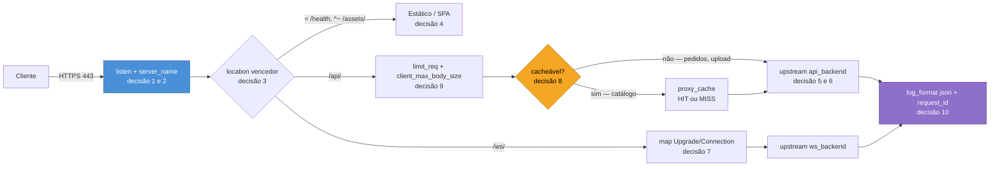

# 16 — Capstone: a borda de uma aplicação

> [!abstract] TL;DR
> Este capstone é um caso hipotético, construído decisão por decisão, não um resumo do galho: uma aplicação com três componentes — um frontend SPA já compilado em arquivos estáticos, uma API HTTP com mais de uma réplica, e um endpoint de WebSocket — precisa ser exposta num domínio único, sob HTTPS, com cache seletivo, proteção contra abuso e diagnóstico possível quando algo quebra. Doze decisões levam o `nginx.conf` de um arquivo vazio a uma borda defensável, cada uma citando a nota do galho que a fundamenta, terminando num bloco único e consolidado que o leitor leva embora. A lição que atravessa as doze decisões é sempre a mesma, só que aplicada a um problema concreto: o Nginx nunca é uma caixa-preta que "faz a coisa certa" por padrão — cada comportamento que parece óbvio (o `location` que vence, o path que chega ao backend, se uma resposta é comprimida ou cacheada) é o resultado de um algoritmo específico que este galho já desmontou nota por nota, e que agora precisa ser montado de volta, junto, numa configuração que sustenta produção de verdade.

## O cenário

A aplicação hipotética se chama `vitrine` — um catálogo de produtos com painel de acompanhamento em tempo real, o tipo de sistema comum o bastante para aparecer em qualquer stack que combine SPA, API e WebSocket na mesma borda, sem que isso remeta a nenhum projeto real do autor nem a nenhum cliente específico. Três componentes, três formas diferentes de servir tráfego: um frontend React já compilado (`dist/index.html`, `dist/assets/*.js`, `dist/assets/*.css`), publicado como arquivos estáticos sem nenhum servidor de aplicação por trás; uma API HTTP em `/api/`, rodando em três réplicas idênticas atrás de um `proxy_pass`, responsável tanto por rotas de leitura pública (um catálogo cacheável) quanto por rotas autenticadas (pedidos, upload de imagem de produto); e um endpoint de WebSocket em `/ws/`, que empurra atualizações de estoque em tempo real para o painel aberto no navegador. Tudo isso precisa aparecer sob um único domínio, `vitrine.exemplo.com`, servido em HTTPS, com HTTP redirecionando para a versão cifrada, cache só onde faz sentido, proteção contra rajada e upload grande demais, e log suficiente para reconstruir o que aconteceu quando um cliente reportar um erro. Nenhum manifesto de Kubernetes, nenhuma política de produção, nenhuma teoria de protocolo entra nesta nota — cada uma dessas fronteiras é nomeada explicitamente na decisão 12, ao final.

O `nginx.conf` cresce em doze passos. Cada decisão enuncia o problema concreto daquele passo, mostra a configuração resultante, explica por que essa escolha venceu a alternativa óbvia, e cita a nota do galho que sustenta essa escolha — a mesma disciplina que o capstone de Kubernetes já aplicou ao conjunto de manifestos daquele galho, agora aplicada ao arquivo de configuração de uma borda.



> [!tip] Vídeo — que peça faz o quê na borda, antes de configurar qualquer uma
> [**Load Balancer, Reverse Proxy e API Gateway: qual a diferença?**](https://www.youtube.com/watch?v=0frGo7vJV30) (Giuliana Bezerra, ~17 min, **PT-BR**) responde à pergunta que antecede este capstone inteiro: quando o problema pede cada um dos três componentes. Ela separa por **motivação**, não por ferramenta, que é o corte certo. O balanceador aparece quando o gargalo é carga — distribuir entre réplicas — e ela acrescenta o efeito lateral que costuma ser esquecido: ele também é a camada onde proteção contra negação de serviço faz sentido. O proxy reverso aparece quando o problema é **atravessar fronteira de rede** — a requisição vem da internet e o serviço vive na rede interna —, e é dali que decorrem os ganhos de cache e de manutenibilidade. O gateway de API aparece quando o tratamento passa a ser **por cliente**: cota por plano contratado, latência acordada, registro do catálogo de APIs. E ela deixa explícito que os papéis se acumulam — o gateway costuma fazer balanceamento também. **O que ele não cobre:** qualquer configuração de Nginx. É o mapa conceitual que justifica as nove decisões deste capstone, não a implementação delas.

## Decisão 1 — como o domínio chega até aqui

**Situação.** Antes de qualquer `location`, o Nginx precisa saber a que conexão TCP este arquivo responde, e o que fazer com uma request que chegue com um `Host` que ninguém esperava — um scanner automatizado, um IP direto sem domínio nenhum, um certificado testado contra o endereço puro.

**Configuração.**

```nginx
server {
    listen 80 default_server;
    listen [::]:80 default_server;
    server_name _;
    return 404;
}

server {
    listen 443 ssl default_server;
    listen [::]:443 ssl default_server;
    http2 on;
    server_name _;
    ssl_reject_handshake on;
}
```

**Por quê.** A etapa 1 da seleção de `server` block — qual socket escuta este `IP:porta` — é anterior a qualquer comparação de `Host`, e é justamente por isso que um bloco `default_server` explícito, com `server_name _;`, fecha a lacuna do cliente que nunca declarou um domínio conhecido: sem esse bloco, o Nginx cairia no primeiro `server` declarado no arquivo para aquele `listen`, um comportamento implícito e frágil a reordenação, exatamente o tipo de suposição por herança cultural que a nota [[03-Dominios/Tecnologia/Infraestrutura/Nginx/03 - Como o Nginx escolhe o server block|03 — Como o Nginx escolhe o server block]] nomeia como armadilha. `ssl_reject_handshake on;` recusa o handshake TLS inteiro para quem bate direto no IP sem SNI válido, antes mesmo de qualquer certificado real ser exposto a um scanner — uma defesa que só faz sentido porque o handshake acontece numa camada anterior à escolha por `Host`, a mesma intromissão entre as duas etapas que aquela nota já descreveu. O bloco HTTP puro devolve `404` seco: não há razão para dar a um cliente sem `Host` reconhecido nenhuma pista sobre os domínios reais hospedados ali.

## Decisão 2 — HTTPS e o redirect do HTTP

**Situação.** O domínio real, `vitrine.exemplo.com`, precisa responder em HTTPS, com o tráfego HTTP redirecionado para a versão cifrada — sem quebrar o desafio ACME que renova o certificado.

**Configuração.**

```nginx
server {
    listen 80;
    listen [::]:80;
    server_name vitrine.exemplo.com;

    location /.well-known/acme-challenge/ {
        root /var/www/acme-challenge;
    }

    location / {
        return 301 https://$host$request_uri;
    }
}

server {
    listen 443 ssl;
    listen [::]:443 ssl;
    http2 on;
    server_name vitrine.exemplo.com;

    ssl_certificate      /etc/nginx/ssl/vitrine.exemplo.com.fullchain.crt;
    ssl_certificate_key  /etc/nginx/ssl/vitrine.exemplo.com.key;
    ssl_session_cache    shared:SSL:10m;
    ssl_session_timeout  10m;
    ssl_stapling         on;
    ssl_stapling_verify  on;
    ssl_trusted_certificate /etc/nginx/ssl/intermediate.crt;
    resolver              1.1.1.1 8.8.8.8 valid=300s;
    add_header Strict-Transport-Security "max-age=31536000" always;
    # ... locations das decisões 3 a 9 entram aqui dentro
}
```

**Por quê.** O redirect usa `return 301`, nunca `rewrite` nem `if`, pela mesma razão que a nota [[03-Dominios/Tecnologia/Infraestrutura/Nginx/09 - TLS no Nginx|09 — TLS no Nginx]] documenta: `return` resolve na fase mais barata, sem participar do laço de reescrita que pode rodar mais de uma vez por request. `ssl_certificate` carrega o certificado seguido dos intermediários, na ordem — a cadeia incompleta é o sintoma clássico daquela nota, invisível a `nginx -t` e visível só num `openssl s_client -showcerts`. `ssl_stapling` mais `resolver` evitam que o cliente precise perguntar diretamente à CA se o certificado ainda vale, poupando uma consulta externa a cada handshake. O `location /.well-known/acme-challenge/` fica antes do redirect geral no mesmo `server` block, porque o validador ACME bate na porta 80 em texto puro e nunca segue redirecionamento antes de validar — a mesma armadilha que a nota 09 nomeia para quem só lembra do redirect e esquece do desafio.

## Decisão 3 — o mapa de rotas

**Situação.** Cinco tipos de conteúdo — health check, assets estáticos versionados, API, WebSocket, e o fallback da SPA — precisam de cinco `location` diferentes, e a ordem em que eles aparecem no arquivo não é o que decide qual vence.

**Configuração.**

```nginx
location = /health {
    return 200 "ok\n";
}

location ^~ /assets/ {
    alias /var/www/vitrine/dist/assets/;
    expires 30d;
    add_header Cache-Control "public, immutable";
}

location /api/ {
    # decisões 5, 6, 8, 9
}

location /ws/ {
    # decisão 7
}

location / {
    root /var/www/vitrine/dist;
    try_files $uri $uri/ /index.html;
}
```

**Por quê.** A escolha de qual `location` atende cada request roda em duas fases — prefixo mais longo memorizado, depois regex na ordem do arquivo —, e nenhuma delas lê a posição do bloco no arquivo como critério, exceto entre regexes concorrentes, exatamente como a nota [[03-Dominios/Tecnologia/Infraestrutura/Nginx/04 - location e a tabela de precedência|04 — location e a tabela de precedência]] estabelece. `= /health` resolve no passo mais barato do algoritmo, sem tocar prefixo nem regex — apropriado para um endpoint de alto volume consultado por qualquer monitor externo. `^~ /assets/` corta a fase de regex por completo: mesmo que esta configuração não declare nenhuma regex hoje, um `location` estático que serve conteúdo por hash de build nunca deveria depender de "nenhuma regex existir ainda" para ficar protegido — o `^~` torna essa garantia estrutural, não acidental. `/api/` e `/ws/` são prefixos puros, mais específicos que o catch-all `/`, e por isso vencem para qualquer request que comece com esses prefixos, sem precisar de `^~` porque nenhuma regex nesta configuração compete com eles. `/` é o catch-all de última instância — o candidato memorizado quando nenhum dos quatro anteriores casa.

## Decisão 4 — o SPA: `root`, `try_files` e o fallback

**Situação.** A SPA precisa responder com `200` e o mesmo `index.html` para qualquer rota client-side (`/produtos/42`, `/painel/estoque`) que não corresponda a um arquivo físico — mas essa mesma generosidade não pode capturar um `404` legítimo vindo da API.

**Configuração.** (já mostrada na decisão 3, `location /`)

```nginx
location / {
    root /var/www/vitrine/dist;
    try_files $uri $uri/ /index.html;
}
```

**Por quê.** `try_files` testa o arquivo literal, depois o diretório, e cai no redirecionamento interno para `/index.html` quando nenhum dos dois existe — o padrão canônico de SPA que a nota [[03-Dominios/Tecnologia/Infraestrutura/Nginx/06 - Servir arquivos estáticos|06 — Servir arquivos estáticos]] descreve, e que produz `200`, não `404`, para qualquer rota que o roteador client-side reconheça. A armadilha gêmea que essa mesma nota nomeia — deixar o fallback de SPA capturar `404`s legítimos de API — é evitada aqui por construção, não por sorte: como `/api/` é um prefixo mais específico que `/`, uma request para `/api/pedidos/99999` nunca alcança o `try_files` do bloco `/`, porque a fase de escolha de `location` já resolveu o destino antes de qualquer fallback entrar em jogo. O erro que esta configuração evita deliberadamente é declarar `error_page 404 /index.html;` no nível de `server` — isso mascararia todo `404` de API como sucesso de SPA, independentemente de qual `location` gerou o erro; o fallback vive só dentro do `try_files` do bloco que de fato serve a SPA, nunca como diretiva de escopo mais largo.

## Decisão 5 — a API: `proxy_pass`, os `X-Forwarded-*`, timeouts

**Situação.** O backend da API monta suas próprias rotas a partir da raiz (`/pedidos`, `/catalogo`, não `/api/pedidos`), então o prefixo `/api/` que o cliente usa para chegar até ela precisa ser removido antes de sair pelo `proxy_pass` — e o backend precisa saber o domínio, o IP e o protocolo originais, porque nenhum deles chega por padrão.

**Configuração.**

```nginx
location /api/ {
    proxy_pass http://api_backend/;

    proxy_set_header Host $host;
    proxy_set_header X-Real-IP $remote_addr;
    proxy_set_header X-Forwarded-For $proxy_add_x_forwarded_for;
    proxy_set_header X-Forwarded-Proto $scheme;

    proxy_connect_timeout 5s;
    proxy_read_timeout 30s;
    # ...decisões 8 e 9 entram aqui dentro
}
```

**Por quê.** A barra final em `proxy_pass http://api_backend/;` carrega uma URI — mesmo sendo só uma barra —, e a regra da nota [[03-Dominios/Tecnologia/Infraestrutura/Nginx/07 - Proxy reverso|07 — Proxy reverso]] é precisa: o prefixo do `location` que casou, `/api/`, é substituído por essa barra, o que remove o prefixo antes de repassar — uma request para `/api/catalogo` chega ao backend como `/catalogo`, o que ele de fato espera. A alternativa óbvia, `proxy_pass http://api_backend;` sem barra, repassaria `/api/catalogo` inteiro, produzindo `404` do lado do backend porque a rota `/api/catalogo` não existe ali — o sintoma de path duplicado que abre aquela nota. Os quatro `proxy_set_header` não têm default equivalente: sem eles, o backend enxergaria `Host: api_backend:80` (o endereço do upstream, nunca o domínio público) e nenhuma informação sobre o IP ou o protocolo original — os três sintomas de abertura da nota 07. `proxy_read_timeout 30s`, abaixo do default de 60s, reflete um SLA mais apertado para esta rota específica; `proxy_connect_timeout 5s` reduz o tempo que uma tentativa de conexão recusada leva para desistir, já que o handshake TCP entre Nginx e um backend na mesma rede interna nunca deveria demorar perto de 60 segundos para completar ou falhar.

## Decisão 6 — as réplicas: bloco `upstream`

**Situação.** Três réplicas da API rodam atrás do `proxy_pass` da decisão anterior. Sem um bloco `upstream`, `api_backend` não é nada — precisa ser declarado, com um comportamento explícito para quando uma réplica trava sem cair de fato.

**Configuração.**

```nginx
upstream api_backend {
    server 10.0.2.10:8080 max_fails=2 fail_timeout=10s;
    server 10.0.2.11:8080 max_fails=2 fail_timeout=10s;
    server 10.0.2.12:8080 max_fails=2 fail_timeout=10s;
    keepalive 32;
}
```

**Por quê.** `upstream` é o bloco que nomeia o pool que `proxy_pass http://api_backend/;` referencia — sem ele, `api_backend` não resolveria a lugar nenhum. `max_fails=2` mais `fail_timeout=10s` são a diferença entre o cenário de abertura da nota [[03-Dominios/Tecnologia/Infraestrutura/Nginx/08 - upstream e balanceamento|08 — upstream e balanceamento]] — um backend que trava sem cair, continuando a receber tráfego por minutos porque `max_fails` ficou no default de 1 sem revisão — e um pool que de fato reage: depois de duas falhas dentro da janela de 10 segundos, aquela réplica sai do rodízio por 10 segundos, sem nenhum probe ativo disparado por fora, só a observação do tráfego real que o Nginx OSS entrega de graça. Nenhum método de balanceamento é declarado explicitamente: o default round-robin serve bem uma frota homogênea de três réplicas idênticas, sem exigir a decisão adicional de `least_conn` ou `hash` que só se justificaria com requisições de custo muito desigual entre si. `keepalive 32;` reserva até 32 conexões ociosas por worker para reaproveitar contra o upstream — desde a versão 1.29.7 isso já convive com `proxy_http_version` padrão `1.1` e sem `Connection: close` forçado, então esta configuração não repete as duas linhas `proxy_http_version 1.1;`/`proxy_set_header Connection "";` que praticamente todo tutorial ainda carrega; num Nginx rodando a stable 1.30.4 (anterior à 1.29.7), essas duas linhas legadas continuariam necessárias para que `keepalive` de fato funcionasse.

## Decisão 7 — o WebSocket: por que ele precisa de tratamento próprio

**Situação.** `/ws/` nasce como uma request HTTP comum que pede troca de protocolo via os headers `Upgrade` e `Connection` — e esses dois são headers hop-by-hop, que o Nginx não repassa por padrão a um backend proxiado.

**Configuração.**

```nginx
map $http_upgrade $connection_upgrade {
    default upgrade;
    ''      close;
}

upstream ws_backend {
    server 10.0.2.20:8090;
}
```

```nginx
location /ws/ {
    proxy_pass http://ws_backend/;

    proxy_http_version 1.1;
    proxy_set_header Upgrade $http_upgrade;
    proxy_set_header Connection $connection_upgrade;

    proxy_set_header Host $host;
    proxy_set_header X-Real-IP $remote_addr;

    proxy_read_timeout 3600s;
}
```

**Por quê.** Sem repassar `Upgrade` e `Connection` explicitamente, a tentativa de troca de protocolo nunca alcança o backend, e a nota [[03-Dominios/Tecnologia/Infraestrutura/Nginx/07 - Proxy reverso|07 — Proxy reverso]] é explícita sobre o motivo: qualquer header hop-by-hop segue a mesma regra de "não repassado por padrão" que já vale para `Host`. Forçar `Connection: upgrade` de forma incondicional quebraria qualquer request HTTP comum que porventura chegasse ao mesmo `location` — por isso o `map` da nota [[03-Dominios/Tecnologia/Infraestrutura/Nginx/12 - Variáveis, map, rewrite e logging|12 — Variáveis, map, rewrite e logging]] decide o valor de `Connection` a partir da presença real de `Upgrade` na request: quando o cliente pede upgrade, `$http_upgrade` não é vazio e o `map` produz `upgrade`; quando não pede, produz `close`, e a request segue como HTTP comum. `proxy_read_timeout 3600s`, bem acima do default de 60s, evita que uma conexão de painel legitimamente ociosa entre atualizações de estoque seja fechada só por falta de tráfego — o mesmo raciocínio que a nota 07 aplica a streaming, aqui esticado ainda mais porque um WebSocket de painel pode ficar minutos sem nenhuma mensagem nova. `ws_backend` é um `upstream` separado de `api_backend`: as conexões de WebSocket são de longa duração, e misturá-las no mesmo pool da API tornaria o `keepalive` daquele pool menos previsível para as duas cargas ao mesmo tempo.

## Decisão 8 — o que cachear e o que não

**Situação.** O catálogo de produtos, servido por `/api/catalogo/`, é público, idêntico para qualquer visitante, e caro de gerar a cada request; `/api/pedidos/` e `/api/upload/` são personalizados por usuário e nunca deveriam ser reaproveitados entre clientes diferentes.

**Configuração.**

```nginx
proxy_cache_path /data/nginx/cache levels=1:2 keys_zone=vitrine_cache:10m max_size=1g inactive=30m use_temp_path=off;
```

```nginx
location /api/catalogo/ {
    proxy_pass http://api_backend/catalogo/;
    proxy_set_header Host $host;

    proxy_cache vitrine_cache;
    proxy_cache_key "$scheme$host$request_uri";
    proxy_cache_valid 200 10m;
    proxy_cache_use_stale error timeout updating http_500 http_502 http_503;
    proxy_cache_lock on;

    add_header X-Cache-Status $upstream_cache_status always;
}
```

**Por quê.** A chave de cache padrão do Nginx, `$scheme$proxy_host$request_uri`, olha para o endereço do upstream, nunca para o `Host` que o cliente usou — inofensivo aqui porque existe um único domínio, mas incluir `$host` explicitamente na chave, como a nota [[03-Dominios/Tecnologia/Infraestrutura/Nginx/10 - Cache no Nginx|10 — Cache no Nginx]] recomenda, é a diferença entre uma configuração que continua correta no dia em que um segundo domínio passar a apontar para o mesmo `api_backend` e uma que vaza dado de um domínio para o outro silenciosamente — a armadilha mais cara descrita naquela nota, e a razão para adotar o hábito mesmo quando ele parece redundante hoje. `/api/pedidos/` e `/api/upload/` nunca declaram `proxy_cache`: cache não é opt-out por diretiva ausente por acidente, é omissão deliberada, porque cachear uma resposta de pedido pessoal seria o mesmo vazamento entre usuários que a nota 10 descreve para multi-tenant, só que entre clientes da mesma API. `proxy_cache_use_stale` sai do padrão `off` de propósito: se o `api_backend` cair por alguns segundos durante um deploy, o catálogo continua servível a partir da última resposta boa, em vez do `502` que a mesma nota descreve como sintoma de um cache configurado sem essa rede de segurança. `proxy_cache_lock on;` evita que um pico de tráfego batendo no catálogo no instante exato em que a entrada expira dispare múltiplas chamadas idênticas e simultâneas ao backend — o problema do rebanho que a nota 10 nomeia.

## Decisão 9 — proteger: `limit_req` com `burst`, `client_max_body_size`

**Situação.** A API precisa resistir a uma rajada de cliques legítima sem devolver `503` para metade dos usuários, e o endpoint de upload de imagem de produto precisa de um teto de tamanho de corpo maior do que o resto da API, sem abrir a porta para um upload arbitrariamente grande em toda rota.

**Configuração.**

```nginx
limit_req_zone $binary_remote_addr zone=api_rate:10m rate=10r/s;
```

```nginx
location /api/ {
    limit_req zone=api_rate burst=20 nodelay;
    client_max_body_size 1m;
    # ... decisões 5, 6 e 8 já declaradas acima
}

location /api/upload/ {
    limit_req zone=api_rate burst=20 nodelay;
    client_max_body_size 15m;
    proxy_pass http://api_backend/upload/;
    proxy_set_header Host $host;
}
```

**Por quê.** `rate=10r/s` não é uma cota de dez requests distribuídas livremente ao longo de um segundo — é um vazamento constante de uma vaga a cada 100 milissegundos, e a nota [[03-Dominios/Tecnologia/Infraestrutura/Nginx/11 - Limitar e comprimir|11 — Limitar e comprimir]] mostra que, sem `burst`, um cliente disparando três chamadas paralelas para montar uma página (comum em qualquer SPA moderna) já esbarraria em `503` mesmo estando bem abaixo do limite nominal medido em volume por segundo. `burst=20` compra vinte vagas extras acima da corrente; `nodelay` gasta essas vagas na hora, sem enfileirar, porque uma API não deveria impor atraso artificial a uma rajada curta e legítima só para suavizar o ritmo — o trade-off nomeado é que o balde fica mais consumido depois, com menos folga para a próxima rajada próxima no tempo. `client_max_body_size 1m` no `location /api/` geral segue o default documentado, generoso o bastante para corpos de JSON comuns; `/api/upload/` sobrescreve para `15m`, isolando o limite maior só na rota que de fato recebe arquivo, em vez de abrir `15m` para toda a API — a recomendação direta da mesma nota, porque o valor precisa bater entre Nginx e aplicação, e generalizar o teto maior para rotas que nunca recebem upload só amplia a superfície sem ganho nenhum.

## Decisão 10 — enxergar: `log_format` em JSON, `$request_id` propagado

**Situação.** Um cliente reporta um erro específico; sem um identificador que atravesse o Nginx e a aplicação, correlacionar a linha certa do log de acesso com a linha certa do log da API é adivinhação.

**Configuração.**

```nginx
log_format vitrine_json escape=json
    '{'
    '"time":"$time_iso8601",'
    '"request_id":"$request_id",'
    '"remote_addr":"$remote_addr",'
    '"method":"$request_method",'
    '"uri":"$request_uri",'
    '"status":$status,'
    '"request_time":$request_time,'
    '"upstream_response_time":"$upstream_response_time",'
    '"upstream_cache_status":"$upstream_cache_status"'
    '}';

access_log /var/log/nginx/vitrine.access.log vitrine_json;
error_log  /var/log/nginx/vitrine.error.log warn;
```

```nginx
location /api/ {
    proxy_set_header X-Request-Id $request_id;
    # ... resto da decisão 5
}
```

**Por quê.** `access_log` com o parâmetro `escape=json` é open source desde a versão 1.11.8, e produz uma linha estruturada que uma consulta programática (Logstash, Fluent Bit, ou um simples `jq`) lê sem precisar de `grep`/`awk` frágil contra texto livre — o argumento que a nota [[03-Dominios/Tecnologia/Infraestrutura/Nginx/12 - Variáveis, map, rewrite e logging|12 — Variáveis, map, rewrite e logging]] desenvolve. `$request_id`, um identificador de 16 bytes aleatórios gerado pelo próprio Nginx a cada request, entra tanto no log quanto no header `X-Request-Id` repassado ao backend — a mesma requisição que aparece numa linha do `access_log` do Nginx aparece, com o mesmo identificador, em qualquer log estruturado que a API já produza, fechando a correlação entre as duas camadas sem exigir nenhuma inferência por timestamp aproximado. `$upstream_response_time` ao lado de `$request_time` separa quanto do tempo total foi gasto esperando o backend, de qualquer overhead do próprio Nginx — a distinção que a nota 13 usa para separar "o Nginx está lento" de "o upstream está lento". O log de erro em JSON estruturado (`error_log ... json;`), disponível desde a 1.29.8, fica de fora desta configuração de propósito: é recurso da assinatura comercial, não do build open source que este capstone assume — a mesma ressalva que a nota 12 nomeia.

## Decisão 11 — o teste de fogo: três sintomas hipotéticos

**Situação.** Três incidentes hipotéticos, cada um plausível contra a configuração construída até aqui, e o roteiro de diagnóstico que a nota 13 ensina para cada um.

**Sintoma 1 — 502 em `/api/pedidos`.** O `error_log` mostra `connect() failed (111: Connection refused) while connecting to upstream, upstream: "http://10.0.2.11:8080/pedidos"` — não timeout, recusa de conexão. Seguindo o método da nota [[03-Dominios/Tecnologia/Infraestrutura/Nginx/13 - Tuning e diagnóstico|13 — Tuning e diagnóstico]], um `curl -v http://10.0.2.11:8080/pedidos` disparado do próprio host do Nginx confirma se de fato não há nada escutando naquela porta, isolando o problema do lado do backend antes de suspeitar de qualquer diretiva de `proxy_pass`. Com `max_fails=2` e `fail_timeout=10s` já declarados na decisão 6, essa réplica específica sai do pool depois de duas falhas, e o tráfego novo passa a ir só para as outras duas — o sintoma vira intermitente e menos severo em vez de derrubar um terço das requests indefinidamente.

**Sintoma 2 — 504 em `/api/upload/`.** O log mostra `upstream timed out (110: Connection timed out) while reading response header from upstream`. `proxy_read_timeout` para `/api/upload/` herda os 30s da decisão 5 — curto demais para um processamento de imagem que legitimamente leva mais tempo. A causa mais provável não é o Nginx: é um timeout ajustado para o SLA da API comum, aplicado sem revisão a uma rota que faz um trabalho mais pesado — a correção é declarar `proxy_read_timeout` maior especificamente dentro de `/api/upload/`, não subir o timeout global e mascarar uma rota lenta de verdade em todo o resto da API.

**Sintoma 3 — 413 num upload de 20 MB.** O cliente recebe `413 Request Entity Too Large` sem nenhuma mensagem contextual, porque a conexão é cortada antes de o corpo chegar à aplicação — a API nunca vê a tentativa, nunca loga nada sobre ela. `client_max_body_size 15m` na decisão 9 é, de fato, menor que os 20 MB que o cliente tentou enviar; o teste rápido é confirmar, com `curl -v`, que a resposta chega direto do Nginx (sem passar pela aplicação) e então decidir se o teto de 15 MB precisa subir, ou se a mensagem de erro do frontend precisa avisar o limite antes do upload começar — o mesmo alinhamento entre Nginx e aplicação que a nota 11 exige.

## Decisão 12 — o que não fica aqui

**Situação.** Fechar a configuração exige nomear, com a mesma honestidade que qualquer fronteira deste vault pede, o que este `nginx.conf` deliberadamente não resolve.

**Por quê.** A política de produção — quando um `503` de `limit_req` deveria disparar um alerta, como rotacionar o certificado sem downtime observável, o runbook de um pico real de tráfego — vive em [[03-Dominios/Engenharia/Operação/3 - Rodar em produção/05 - Rede e borda em produção|Rede e borda em produção]], não neste arquivo: esta nota decide como a borda se comporta, aquela decide como alguém a opera. Se esta mesma aplicação rodasse dentro de um cluster Kubernetes, o objeto que traduziria intenção declarativa (`host: vitrine.exemplo.com`, `path: /api`) neste mesmo `nginx.conf` seria um Ingress, cujo controlador é, com frequência, um Nginx quase idêntico a este por dentro — o objeto e a tradução ficam em [[03-Dominios/Tecnologia/Infraestrutura/Kubernetes/15 - Ingress e a borda do cluster|Ingress e a borda do cluster]]. E a teoria que sustenta cada mecanismo usado aqui — por que TLS 1.3 é mais seguro que TLS 1.2, o que `Cache-Control` significa como protocolo independente de qual software o interpreta — mora em [[03-Dominios/Ciência/Redes e Protocolos/05 - TLS e HTTPS|TLS e HTTPS]] e em [[03-Dominios/Ciência/Redes e Protocolos/08 - Caching HTTP|Caching HTTP]]; este capstone usou as diretivas, não reexplicou o protocolo por trás delas.

## A configuração completa, consolidada

```nginx
# vitrine.exemplo.com — mainline 1.31.3

http {
    # decisão 6 — pool de réplicas da API
    upstream api_backend {
        server 10.0.2.10:8080 max_fails=2 fail_timeout=10s;
        server 10.0.2.11:8080 max_fails=2 fail_timeout=10s;
        server 10.0.2.12:8080 max_fails=2 fail_timeout=10s;
        keepalive 32;
    }

    # decisão 7 — pool do WebSocket, separado da API
    upstream ws_backend {
        server 10.0.2.20:8090;
    }

    # decisão 7 — Connection correto só quando há upgrade de verdade
    map $http_upgrade $connection_upgrade {
        default upgrade;
        ''      close;
    }

    # decisão 8 — zona de cache do catálogo público
    proxy_cache_path /data/nginx/cache levels=1:2 keys_zone=vitrine_cache:10m max_size=1g inactive=30m use_temp_path=off;

    # decisão 9 — balde furado por IP
    limit_req_zone $binary_remote_addr zone=api_rate:10m rate=10r/s;

    # decisão 10 — log estruturado, correlacionável por request_id
    log_format vitrine_json escape=json
        '{'
        '"time":"$time_iso8601",'
        '"request_id":"$request_id",'
        '"remote_addr":"$remote_addr",'
        '"method":"$request_method",'
        '"uri":"$request_uri",'
        '"status":$status,'
        '"request_time":$request_time,'
        '"upstream_response_time":"$upstream_response_time",'
        '"upstream_cache_status":"$upstream_cache_status"'
        '}';
    access_log /var/log/nginx/vitrine.access.log vitrine_json;
    error_log  /var/log/nginx/vitrine.error.log warn;

    # decisão 1 — catch-all para Host desconhecido
    server {
        listen 80 default_server;
        listen [::]:80 default_server;
        server_name _;
        return 404;
    }

    server {
        listen 443 ssl default_server;
        listen [::]:443 ssl default_server;
        http2 on;
        server_name _;
        ssl_reject_handshake on;
    }

    # decisão 2 — redirect HTTP → HTTPS, com o desafio ACME preservado
    server {
        listen 80;
        listen [::]:80;
        server_name vitrine.exemplo.com;

        location /.well-known/acme-challenge/ {
            root /var/www/acme-challenge;
        }

        location / {
            return 301 https://$host$request_uri;
        }
    }

    # decisão 2 — o server block HTTPS real
    server {
        listen 443 ssl;
        listen [::]:443 ssl;
        http2 on;
        server_name vitrine.exemplo.com;

        ssl_certificate      /etc/nginx/ssl/vitrine.exemplo.com.fullchain.crt;
        ssl_certificate_key  /etc/nginx/ssl/vitrine.exemplo.com.key;
        ssl_session_cache    shared:SSL:10m;
        ssl_session_timeout  10m;
        ssl_stapling         on;
        ssl_stapling_verify  on;
        ssl_trusted_certificate /etc/nginx/ssl/intermediate.crt;
        resolver              1.1.1.1 8.8.8.8 valid=300s;
        add_header Strict-Transport-Security "max-age=31536000" always;

        # decisão 3 — health check, resolvido no passo mais barato
        location = /health {
            return 200 "ok\n";
        }

        # decisão 3 — assets versionados, protegidos de qualquer regex futura
        location ^~ /assets/ {
            alias /var/www/vitrine/dist/assets/;
            expires 30d;
            add_header Cache-Control "public, immutable";
        }

        # decisão 8 — catálogo público, cacheável
        location /api/catalogo/ {
            limit_req zone=api_rate burst=20 nodelay;
            client_max_body_size 1m;

            proxy_pass http://api_backend/catalogo/;
            proxy_set_header Host $host;
            proxy_set_header X-Real-IP $remote_addr;
            proxy_set_header X-Forwarded-For $proxy_add_x_forwarded_for;
            proxy_set_header X-Forwarded-Proto $scheme;
            proxy_set_header X-Request-Id $request_id;
            proxy_connect_timeout 5s;
            proxy_read_timeout 30s;

            proxy_cache vitrine_cache;
            proxy_cache_key "$scheme$host$request_uri";
            proxy_cache_valid 200 10m;
            proxy_cache_use_stale error timeout updating http_500 http_502 http_503;
            proxy_cache_lock on;
            add_header X-Cache-Status $upstream_cache_status always;
        }

        # decisão 9 — upload, teto de corpo maior, isolado nesta rota
        location /api/upload/ {
            limit_req zone=api_rate burst=20 nodelay;
            client_max_body_size 15m;

            proxy_pass http://api_backend/upload/;
            proxy_set_header Host $host;
            proxy_set_header X-Real-IP $remote_addr;
            proxy_set_header X-Forwarded-For $proxy_add_x_forwarded_for;
            proxy_set_header X-Forwarded-Proto $scheme;
            proxy_set_header X-Request-Id $request_id;
            proxy_connect_timeout 5s;
            proxy_read_timeout 60s;
        }

        # decisão 5 — resto da API, sem cache, sem teto de corpo alargado
        location /api/ {
            limit_req zone=api_rate burst=20 nodelay;
            client_max_body_size 1m;

            proxy_pass http://api_backend/;
            proxy_set_header Host $host;
            proxy_set_header X-Real-IP $remote_addr;
            proxy_set_header X-Forwarded-For $proxy_add_x_forwarded_for;
            proxy_set_header X-Forwarded-Proto $scheme;
            proxy_set_header X-Request-Id $request_id;
            proxy_connect_timeout 5s;
            proxy_read_timeout 30s;
        }

        # decisão 7 — WebSocket, tratamento próprio
        location /ws/ {
            proxy_pass http://ws_backend/;
            proxy_http_version 1.1;
            proxy_set_header Upgrade $http_upgrade;
            proxy_set_header Connection $connection_upgrade;
            proxy_set_header Host $host;
            proxy_set_header X-Real-IP $remote_addr;
            proxy_read_timeout 3600s;
        }

        # decisão 4 — o catch-all da SPA
        location / {
            root /var/www/vitrine/dist;
            try_files $uri $uri/ /index.html;
        }
    }
}
```

## Armadilhas comuns

> [!warning] Copiar a proteção de uma rota para todas as rotas
> `client_max_body_size 15m` faz sentido em `/api/upload/`, não no resto da API — generalizar o teto maior para toda a configuração, "só para não esquecer", abre uma superfície de corpo grande em rotas que nunca precisam disso, sem ganho nenhum. A mesma disciplina vale para `proxy_read_timeout`: alargar o timeout global para acomodar uma única rota lenta mascara um problema de backend em toda a API, não só onde ele de fato existe.

> [!warning] Esquecer que `location /api/` mais específico precisa vir antes do catch-all na leitura, mesmo sem decidir a ordem
> A posição no arquivo não decide qual prefixo vence — mas escrever `/api/catalogo/`, `/api/upload/` e `/api/` antes de `/` no arquivo continua sendo a prática saudável, porque é assim que um humano relendo a configuração entende a hierarquia pretendida sem precisar recalcular o algoritmo de precedência de cabeça toda vez. O algoritmo não lê a ordem; a próxima pessoa que herdar este arquivo, sim.

> [!warning] Deixar o `upstream` do WebSocket compartilhar zona de `limit_req` com a API sem pensar na duração da conexão
> Uma conexão WebSocket fica aberta por minutos ou horas; se o mesmo `limit_req_zone` que protege `/api/` fosse aplicado ao `/ws/`, uma única reconexão de rede do cliente (comum em redes móveis) poderia, em teoria, ser tratada como abuso de taxa. Esta configuração deliberadamente não aplica `limit_req` a `/ws/` — a proteção de conexões de longa duração é assunto de `limit_conn`, não de `limit_req`, e entrar nessa decisão faz parte do que fica para a prática de produção, não deste capstone.

## Como explicar em inglês

*"Bringing this app to a real edge is twelve decisions, not one config file. The controller for routing is the location precedence algorithm — prefix versus regex, never file order — so I write the most specific prefixes first for readability, but I never rely on that order to actually decide anything. The trailing slash on proxy_pass is the single most consequential character in the whole file: it's what strips the /api/ prefix before the request reaches a backend that mounts its routes at the root. Caching is opt-in per route, not per app — the public catalog gets a cache key that includes the Host header explicitly, because the default key only looks at the upstream address, and that default is exactly how a multi-tenant setup leaks one customer's response to another. WebSocket needs its own location because Upgrade and Connection are hop-by-hop headers nginx won't forward unless you tell it to, and a map decides Connection dynamically so the same location can still serve plain HTTP requests without forcing an upgrade on them. And the request_id that goes into the JSON access log is the same one forwarded to the backend as a header — that's what makes a support ticket traceable across both layers instead of guessing by timestamp."*

> | PT-BR | EN | Nuance de uso |
> |---|---|---|
> | borda | edge | Termo padrão para a camada mais externa antes da aplicação |
> | cabeçalho hop-by-hop | hop-by-hop header | Especificamente `Upgrade`/`Connection`, nunca repassados por padrão em proxy |
> | vazamento entre inquilinos | cross-tenant leak | Usado para o risco da chave de cache padrão, não só para multi-tenant literal |
> | balde furado | leaky bucket | O modelo real de `limit_req`, não "N requests por segundo" |
> | catch-all | catch-all | Mantido em inglês mesmo em texto em PT-BR, termo já naturalizado |
> | rede de segurança (cache velho) | safety net (stale cache) | Descreve `proxy_cache_use_stale`, não o cache em si |
> | correlação de log | log correlation | O propósito de propagar `$request_id` como header |
> | fronteira de escopo | scope boundary | Usado para nomear o que a decisão 12 deixa de fora, de propósito |

## O que vem a seguir

Este capstone fecha o galho [[03-Dominios/Tecnologia/Infraestrutura/Nginx/index|Nginx]] — dezesseis notas, três fases, uma lente única atravessando todas elas: a ordem em que o Nginx avalia uma configuração nunca é a ordem em que ela está escrita no arquivo, e prever o comportamento exige seguir a request pelas fases, não ler o arquivo de cima para baixo. Nenhuma das doze decisões desta nota inventou um mecanismo novo — cada uma aplicou, a um problema concreto, um algoritmo que alguma nota anterior já tinha desmontado peça por peça: a tabela de precedência de `location`, o mapa de onze fases, a regra da barra final de `proxy_pass`, a chave de cache que esquece o domínio, o balde furado de `limit_req`. É essa composição — não nenhuma diretiva isolada — que separa uma borda que "parece funcionar" em teste manual de uma que sustenta produção real.

A continuação natural do que esta nota construiu não é mais nenhuma diretiva do Nginx: é a disciplina de operar essa borda com seriedade, que vive inteira em [[03-Dominios/Engenharia/Operação/3 - Rodar em produção/05 - Rede e borda em produção|Rede e borda em produção]] — a mesma nota que este galho citou, decisão após decisão, como quem sabe exatamente onde a própria fronteira termina. O domínio [[03-Dominios/Tecnologia/Infraestrutura/index|Infraestrutura]] segue, depois deste galho, para Linux — o sistema operacional que sustenta, por baixo, tudo que Docker, Kubernetes e Nginx já pressupõem funcionando.

## Fontes

- [Nginx Docs — Module ngx_http_core_module (`location`, `try_files`, `client_max_body_size`)](https://nginx.org/en/docs/http/ngx_http_core_module.html)
- [Nginx Docs — Module ngx_http_proxy_module (`proxy_pass`, `proxy_set_header`, timeouts, `proxy_cache_*`)](https://nginx.org/en/docs/http/ngx_http_proxy_module.html)
- [Nginx Docs — Module ngx_http_upstream_module (`upstream`, `keepalive`, `max_fails`/`fail_timeout`)](https://nginx.org/en/docs/http/ngx_http_upstream_module.html)
- [Nginx Docs — Module ngx_http_ssl_module (`ssl_certificate`, `ssl_stapling`, `ssl_reject_handshake`)](https://nginx.org/en/docs/http/ngx_http_ssl_module.html)
- [Nginx Docs — Module ngx_http_limit_req_module (`limit_req_zone`, `burst`, `nodelay`)](https://nginx.org/en/docs/http/ngx_http_limit_req_module.html)
- [Nginx Docs — Module ngx_http_map_module](https://nginx.org/en/docs/http/ngx_http_map_module.html)
- [Nginx Docs — Module ngx_http_log_module (`log_format`, `escape=json`)](https://nginx.org/en/docs/http/ngx_http_log_module.html)
- [Nginx Docs — WebSocket proxying](https://nginx.org/en/docs/http/websocket.html)
- [Nginx Docs — Changes (baseline de versão, mainline 1.31.3)](https://nginx.org/en/CHANGES)
