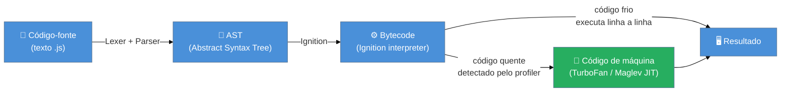

> [!abstract] TL;DR
> JavaScript é uma linguagem de programação dinamicamente tipada, de thread única, que roda em uma **engine** — um software que lê, compila e executa o código. A especificação que define o que a engine deve fazer chama-se **ECMAScript** (mantida pelo TC39 e publicada anualmente). As três grandes engines são **V8** (Chrome, Node.js, Deno, Edge), **SpiderMonkey** (Firefox) e **JavaScriptCore** (Safari, Bun). Toda engine segue o mesmo ciclo: parse → AST → bytecode → JIT. JavaScript é single-thread, mas lida com código assíncrono via event loop — não por ter múltiplas threads, mas por adiar e reagendar trabalho.

---

## O problema que gerou a linguagem

Imagine uma página HTML estática dos anos 90: você preenchia um formulário, clicava em "Enviar", o servidor processava, devolvia uma nova página inteira — mesmo que só um campo estivesse errado. Era como mandar uma carta para corrigir uma palavra.

Em 1995, Brendan Eich criou em **dez dias** um script que rodava diretamente no navegador Netscape, capaz de validar campos, mostrar alertas e modificar a página *antes* de qualquer ida ao servidor. Esse script se tornou o que hoje chamamos de JavaScript.

O nome é, em boa parte, marketing — Java era popular na época e a Netscape quis aproveitar o hype. As linguagens têm pouca relação. O nome gerou confusão por décadas.

---

## ECMAScript: o contrato da linguagem

Quando vários navegadores começaram a implementar JavaScript do jeito que quiseram, o caos instalou-se: o mesmo código funcionava no Internet Explorer e quebrava no Netscape. Era preciso um padrão.

Em 1997, a linguagem foi entregue à **Ecma International**, uma organização de padronização, que publicou a primeira versão do padrão sob o nome **ECMAScript** — abreviado **ES**.

> [!question]- Então "JavaScript" e "ECMAScript" são a mesma coisa?
> Quase. **ECMAScript** é a *especificação* — o documento que diz o que a linguagem deve fazer, como tipos funcionam, como closures se comportam, o que `typeof null` deve retornar. **JavaScript** é a *implementação* dessa spec pelas engines de cada navegador/runtime. É como a diferença entre a receita (ECMAScript) e o prato (JavaScript que roda no Chrome). O [[Dicionário de JavaScript#ECMAScript|verbete ECMAScript]] explica a distinção em uma frase.

O órgão que cuida da evolução do ECMAScript é o **TC39** — Technical Committee 39. É um grupo de representantes de empresas de tecnologia (Google, Mozilla, Apple, Microsoft, Meta, entre outras) que propõe, debate e aprova novas funcionalidades da linguagem.

### O processo de evolução: stages do TC39

Toda feature nova passa por cinco estágios antes de entrar na spec:

```
Stage 0 — Strawperson: ideia informal, sem comprometimento
Stage 1 — Proposal:    proposta formal com champion e motivação
Stage 2 — Draft:       spec inicial escrita, API em revisão
Stage 3 — Candidate:   spec completa, implementações-piloto ocorrendo
Stage 4 — Finished:    aprovada, entra no próximo ES anual
```

Desde 2015 (ES6/ES2015), o TC39 publica uma nova edição **todo mês de junho**. A edição mais recente é o **ECMAScript 2025** (ES16, aprovada em junho de 2025), que adicionou métodos de iterador, operações em `Set`, `Promise.try`, `RegExp.escape` e `Float16Array`, entre outros.

> JavaScript em uma frase: é a implementação, pelas engines, de um contrato chamado ECMAScript — e esse contrato evolui publicamente, feature a feature, stage a stage.

---

## As engines: quem realmente executa seu código

Você escreve `console.log("olá")`. O que acontece? Não é mágica — existe um programa, escrito em C++ ou Rust, que lê esse texto e o executa. Esse programa é a **engine**.

As três engines que dominam a web:

| Engine | Criada por | Onde roda |
|---|---|---|
| **V8** | Google | Chrome, Edge, Node.js, Deno, Opera |
| **SpiderMonkey** | Mozilla | Firefox |
| **JavaScriptCore (JSC)** | Apple | Safari, Bun |

Toda engine segue a mesma spec (ECMAScript), mas cada uma toma decisões próprias de implementação — daí diferenças de performance e, raramente, de comportamento em edge cases.

### O ciclo parse → bytecode → JIT

Quando a engine recebe código JavaScript, ela passa por quatro fases. Abaixo, o fluxo simplificado usando V8 como exemplo:



**Fase 1 — Parse:** a engine lê o texto do arquivo e converte em uma estrutura chamada **AST** (Abstract Syntax Tree — Árvore Sintática Abstrata). É como converter "Maria comeu a maçã" em uma árvore onde "comer" é o verbo, "Maria" é o sujeito, "maçã" é o objeto. Erros de sintaxe são descobertos aqui.

**Fase 2 — Bytecode:** o AST é transformado em **bytecode**, um conjunto de instruções intermediárias — mais simples que código-fonte, mas ainda não específico para a CPU do usuário. No V8, o interpretador responsável chama-se **Ignition**.

**Fase 3 — Execução (interpretada):** código novo ou raramente executado roda direto no interpretador, instrução por instrução. É mais lento, mas começa *imediatamente*, sem esperar compilação.

**Fase 4 — JIT (Just-In-Time):** o profiler monitora quais funções são chamadas frequentemente ("código quente"). Esses caminhos são compilados para **código de máquina nativo** pelo compilador JIT (TurboFan/Maglev no V8, Warp no SpiderMonkey, DFG+B3 no JSC). O resultado é código otimizado que roda na velocidade do hardware. O verbete [[Dicionário de JavaScript#JIT (Just-In-Time)|JIT no dicionário]] detalha a definição formal.

> [!question]- Por que não compilar tudo de uma vez, como Java ou C?
> Porque JavaScript é carregado *na hora da visita* — o usuário não pode esperar segundos para compilar o site inteiro. O JIT é o meio-termo: começa rápido (interpretando) e acelera onde importa (compilando os caminhos quentes). É o mesmo princípio de aquecer só o que você vai comer, não o freezer inteiro.

> [!info]- O V8 tem 4 camadas, não 2: Ignition → Sparkplug → Maglev → TurboFan
> O diagrama acima simplifica o V8 em duas camadas (interpretador + JIT). Na prática, o pipeline tem quatro:
>
> | Camada | Tipo | Velocidade de compilação | Qualidade do código |
> |--------|------|--------------------------|---------------------|
> | **Ignition** | Interpretador de bytecode | Imediata | Básica (interpreta) |
> | **Sparkplug** | Compilador baseline | ~1µs por função | Rápido, sem otimizações |
> | **Maglev** | Compilador otimizador médio | ~10x mais rápido que TurboFan | Bom — suficiente para 90% dos casos |
> | **TurboFan** | Compilador de alta otimização | Mais lento | Máxima — para os caminhos super-quentes |
>
> A lógica é: começar imediatamente com Ignition, promover funções frequentes para Sparkplug, promover funções muito quentes para Maglev, e reservar TurboFan apenas para os caminhos absolutamente críticos. Isso é por que apps JS "aceleram" nos primeiros segundos — as camadas superiores do pipeline vão sendo ativadas progressivamente. A progressão Maglev → TurboFan responde pela sensação de que "JS ficou rápido de verdade nos últimos anos".

> [!info]- [[Dicionário de JavaScript#hidden class\|Hidden classes]]: o segredo do JIT rápido (e como quebrá-lo)
> Quando o JIT compila uma função que acessa `obj.x`, ele não quer fazer uma busca dinâmica em hash toda vez — isso seria lento. Em vez disso, o V8 cria uma *hidden class* (também chamada de *shape* ou *map*) para cada formato de objeto: se dois objetos têm as mesmas propriedades na mesma ordem, compartilham a mesma hidden class. Com ela, o JIT sabe que `x` está *sempre* no offset 8 bytes — acesso direto como em C.
>
> O problema surge quando você quebra essa estabilidade:
>
> ```javascript
> // ✓ Boa prática — mesmo shape, hidden class compartilhada
> const p1 = { x: 1, y: 2 };
> const p2 = { x: 3, y: 4 };
>
> // ✗ Shapes diferentes — hidden classes separadas, JIT não otimiza
> const p3 = { x: 1, y: 2 };
> const p4 = { y: 4, x: 3 };  // ordem diferente!
>
> // ✗ delete força "modo dicionário" — abandona a hidden class
> delete p1.y;  // p1 vira um hash map lento
> ```
>
> Quando o JIT detecta que um site de chamada recebe objetos com *shapes* demais (megamorphic), ele desiste de otimizar e reverte para o interpretador — *deoptimização* silenciosa. Por isso, a regra prática é: inicialize todas as propriedades do objeto no construtor, na mesma ordem, e evite `delete` em caminhos quentes.

---

## Single-thread e assíncrono: a aparente contradição

JavaScript tem **uma única thread de execução**. Isso significa que só uma coisa roda por vez — não há execução paralela de código JS como em Java com threads.

Mas então como funciona uma requisição de rede que não trava a página? Como o `setTimeout` "espera" sem bloquear tudo?

A resposta está no **[[Dicionário de JavaScript#event loop\|event loop]]** — um mecanismo que permite adiar trabalho, delegá-lo ao ambiente (browser ou runtime) e retomar quando estiver pronto. Em vez de bloquear esperando a resposta do servidor, a engine registra "me avise quando terminar" e segue executando outro código. Quando a resposta chega, o callback vai para a fila e o event loop o executa na próxima oportunidade.

```
┌─────────────────────────────────────────────────────────┐
│  Call Stack  │  Web APIs / OS  │   Queue   │  Event Loop │
│─────────────────────────────────────────────────────────│
│  Seu código  │  fetch(), I/O   │ callbacks │  orquestra  │
│  executa aqui│  esperam aqui   │ esperam   │  a retomada │
└─────────────────────────────────────────────────────────┘
```

> [!info] Seam: internals do event loop
> Os detalhes de call stack, heap, filas de microtasks e macrotasks, e as fases do event loop no Node.js estão em [[03-Dominios/Tecnologia/Node/Runtime e Event Loop/index|Node / Runtime e Event Loop]]. Aqui o importante é o modelo mental: *single-thread não significa bloqueante*; significa que só um callback executa por vez, mas o ambiente cuida de aguardar o resto.

---

## Dinâmica, interpretada ou compilada?

JavaScript é frequentemente chamada de "linguagem interpretada" — e isso é parcialmente verdade e parcialmente desatualizado.

**Dinâmica:** tipos são resolvidos em tempo de execução, não de compilação. `let x = 1; x = "texto"` é válido — a variável muda de tipo. Isso contrasta com Java ou C, onde o tipo é fixo em compilação.

**Interpretada (origem):** nos anos 90, JS era lida e executada linha a linha, sem compilação prévia. Daí o rótulo.

**Compilada (hoje):** engines modernas compilam o código JS para código de máquina via JIT. Seu código não é simplesmente "lido" — é otimizado ativamente em runtime. O rótulo correto hoje seria **"compilada dinamicamente"** ou **"JIT-compilada"**.

> [!info] Tipagem estática: TypeScript
> Se você quer os benefícios de tipos detectados em tempo de compilação (antes de rodar), a resposta é [[03-Dominios/Tecnologia/TypeScript/index|TypeScript]] — um superconjunto do JavaScript que adiciona anotações de tipo e um compilador que checa esses tipos antes de gerar JS puro.

---

## Onde JavaScript roda

JavaScript nasceu no navegador, mas hoje roda em muitos ambientes:

| Ambiente | Runtime / Engine | Casos de uso |
|---|---|---|
| **Navegador** | V8, SpiderMonkey, JSC | Front-end, SPAs, Web APIs |
| **Servidor** | Node.js (V8) | APIs REST, CLI, scripts |
| **Servidor** | Deno (V8) | APIs com TypeScript nativo, permissões granulares |
| **Servidor** | Bun (JSC) | Alta performance, drop-in para Node |
| **Edge/CDN** | Cloudflare Workers (V8) | Funções near-user, latência mínima |
| **Desktop** | Electron (V8) | VS Code, Slack, Discord |
| **Mobile** | React Native (Hermes) | Apps iOS/Android |

Todos eles compartilham o **núcleo da linguagem** (ECMAScript), mas cada ambiente expõe APIs diferentes: o browser tem `document`, `window`, `fetch`; o Node tem `fs`, `process`, `http`. A spec não define essas APIs — elas são acréscimos de cada runtime.

> [!info] Hermes: a engine que não faz JIT (de propósito)
> A tabela lista **Hermes** para React Native — e vale entender por que a Meta não usou V8 ou JSC. Em um smartphone com memória limitada, o JIT consome RAM e tempo de CPU exatamente no momento mais crítico: a inicialização do app. A solução da Meta foi inverter o modelo: o Hermes compila o JavaScript para bytecode **durante o build do app** (AOT — Ahead-of-Time), antes de chegar no dispositivo. Em runtime, não há parse, não há compilação — a engine executa o bytecode diretamente.
>
> O resultado: apps React Native com Hermes iniciam 30–50% mais rápido que com V8/JSC, e o bytecode Hermes é tipicamente 10–30% menor que o JavaScript minificado equivalente. No React Native 0.70+, Hermes é o padrão — você pode verificar com `HermesInternal` no console. A Meta está desenvolvendo o *Static Hermes*, que vai um passo além: compila JS direto para código de máquina nativo, como um compilador AOT tradicional.

---

## Armadilhas comuns

> [!warning] "JavaScript é Java simplifado"
> **O que acontece:** iniciantes assumem que as duas linguagens são relacionadas ou que conhecer uma transfere automaticamente para a outra. **Por quê:** o nome foi estratégia de marketing da Netscape em 1995 para aproveitar a popularidade do Java. A relação entre as linguagens é praticamente nenhuma — herança, tipos, compilação e modelo de execução são completamente diferentes. **Como evitar:** tratar JavaScript como uma linguagem independente. A única coisa que compartilham com Java é parte do nome.

> [!warning] "JavaScript não compila, só interpreta"
> **O que acontece:** o desenvolvedor subestima a sofisticação das engines e supõe que JS será sempre lento para tarefas computacionais intensas. **Por quê:** o rótulo "linguagem interpretada" ficou colado na linguagem desde os anos 90, mas não reflete a realidade das engines modernas com JIT multi-tier. **Como evitar:** lembrar que V8 (e demais engines) compilam código quente para código de máquina nativo. JS pode ser muito rápido — o gargalo costuma ser I/O ou algoritmos ruins, não a linguagem em si.

> [!warning] "Single-thread significa que JS não pode fazer nada em paralelo"
> **O que acontece:** o desenvolvedor evita operações assíncronas ou acha que uma requisição HTTP necessariamente trava o programa. **Por quê:** single-thread descreve a thread JS, mas o runtime (browser ou Node) usa outras threads para I/O, timers e operações do sistema operacional. **Como evitar:** entender o event loop: a thread JS não bloqueia — ela delega, espera na fila e retoma. É concorrência cooperativa, não paralelismo de memória compartilhada.

> [!warning] "ECMAScript 6 é a versão mais nova"
> **O que acontece:** documentação desatualizada e tutoriais antigos fixam "ES6" como referência, levando iniciantes a achar que a linguagem parou de evoluir em 2015. **Por quê:** ES2015 (ES6) foi uma atualização massiva que atraiu muita atenção. Desde então, atualizações anuais menores não geraram o mesmo buzz. **Como evitar:** saber que o TC39 publica uma nova edição todo junho. Em 2026, a spec vigente é ES2025 (16ª edição), e ES2026 está em draft.

---

## Casos práticos

### O mesmo código, dois ambientes

Imagine que você escreveu o seguinte snippet para exibir a URL atual da página:

```javascript
console.log(window.location.href);
```

No browser, isso funciona perfeitamente — `window` é o objeto global que o ambiente do navegador expõe. Agora copie e cole o mesmo código em um script Node.js e execute:

```
ReferenceError: window is not defined
```

O Node não tem `window`. Ele não tem `document`. Não há página, não há DOM. O que o Node expõe é diferente:

```javascript
// No Node.js — funciona
console.log(process.env.NODE_ENV);   // variável de ambiente
console.log(process.argv);           // argumentos da linha de comando
console.log(__dirname);              // caminho do diretório atual

// No browser — não existe
// process.env → ReferenceError
// __dirname   → ReferenceError
```

O que isso ensina? **JavaScript é a linguagem. O ambiente fornece as APIs.**

A especificação ECMAScript define `Array`, `Promise`, `Map`, `typeof`, `let`, `const` — o núcleo da linguagem. Mas `window`, `document`, `fetch` (no browser), `fs`, `http`, `process` (no Node) são APIs fornecidas pelo *runtime*, não pela spec.

```
┌─────────────────────────────────────────────────────────────┐
│                    Spec ECMAScript                          │
│  Array · Promise · Map · Set · Error · typeof · closures   │
│─────────────────────────────────────────────────────────────│
│  Browser Runtime          │  Node.js Runtime               │
│  window · document · DOM  │  process · fs · http · Buffer  │
│  fetch · localStorage     │  require · __dirname · streams │
└─────────────────────────────────────────────────────────────┘
```

Isso é por que código que funciona no browser pode quebrar no Node e vice-versa — não porque a linguagem mudou, mas porque cada runtime expõe APIs diferentes além do núcleo comum.

> [!tip] Regra prática
> Antes de usar qualquer global (além das definidas na spec), verifique se ela existe no ambiente-alvo. `typeof window !== "undefined"` é o idioma clássico para testar se você está no browser. Em ambientes modernos, `globalThis` é o global padronizado pela spec ES2020 que funciona em qualquer ambiente.

---

### Por que `console.log(0.1 + 0.2)` te assusta

Abra o console do browser e execute:

```javascript
console.log(0.1 + 0.2);
// → 0.30000000000000004
```

Não é bug do JavaScript. É matemática de ponto flutuante seguindo o padrão **IEEE 754** — o mesmo padrão que C, Java, Python e praticamente toda linguagem moderna usam para representar números decimais.

O problema: computadores armazenam números em binário. `0.1` não tem representação exata em binário (assim como `1/3` não tem representação exata em decimal — você pode escrever `0.333...` para sempre). A engine faz o melhor que pode, mas a soma acumula o erro de arredondamento.

```javascript
// A engine seguiu a spec — o resultado é "correto" em IEEE 754
console.log(0.1 + 0.2 === 0.3);  // false
console.log(0.1 + 0.2);          // 0.30000000000000004

// Alternativas para comparação com tolerância
const EPSILON = Number.EPSILON;
console.log(Math.abs(0.1 + 0.2 - 0.3) < EPSILON);  // true

// Para moeda e aritmética exata: use inteiros (centavos) ou bibliotecas
const valorEmCentavos = 10 + 20;  // 30 — sem erro
```

Em JavaScript, `number` é um tipo único que cobre inteiros e decimais — ambos representados como float de 64 bits (double-precision IEEE 754). Isso contrasta com linguagens que têm tipos separados (`int`, `float`, `double`). As consequências e como lidar com elas estão em [[03-Dominios/Tecnologia/JavaScript/02 - Tipos em runtime|Tipos em runtime]].

> [!question]- Então como fazer operações financeiras em JS?
> Nunca usando ponto flutuante direto para valores monetários. A abordagem canônica é trabalhar com **inteiros em centavos** (R$ 1,99 → `199`) e só formatar para exibição. Para casos complexos, bibliotecas como `decimal.js` ou `big.js` implementam aritmética de precisão arbitrária. Esse é um problema da representação binária, não da linguagem — mas é JavaScript que muita gente encontra pela primeira vez.

---

## Engine vs. Runtime: a distinção que clarifica tudo

Esses dois termos aparecem juntos e são frequentemente confundidos. A distinção é simples e vale gravar:

**Engine** é o motor que executa JavaScript — o software que recebe código-fonte, o compila e o roda. É o V8, o SpiderMonkey, o JavaScriptCore. A engine implementa a spec ECMAScript: sabe o que é uma [[Dicionário de JavaScript#closure\|closure]], como funciona o [[Dicionário de JavaScript#prototype chain\|prototype chain]], o que `typeof` deve retornar.

**Runtime** é o ambiente completo em volta da engine. O runtime pega a engine e acrescenta APIs, abstrações de sistema operacional, protocolos de rede, APIs de arquivo, timers, e tudo mais que um programa real precisa para funcionar.

```
┌─────────────────────────────────────────────────────────────┐
│                         RUNTIME                             │
│                                                             │
│   ┌─────────────────┐     ┌──────────────────────────────┐ │
│   │     ENGINE      │  +  │    APIs do Ambiente          │ │
│   │  V8 / JSC /     │     │  DOM, fetch, fs, process,    │ │
│   │  SpiderMonkey   │     │  timers, crypto, WebSockets  │ │
│   └─────────────────┘     └──────────────────────────────┘ │
└─────────────────────────────────────────────────────────────┘
     Node.js = V8 + libuv + APIs de SO (fs, http, streams)
     Browser = V8/JSC/SM + DOM + Web APIs + renderer
     Bun     = JSC + runtime próprio de alta performance
```

Quando alguém diz "JavaScript roda no Node", está dizendo: o runtime Node.js (que usa V8 internamente) executa seu código. A engine lida com a linguagem; o runtime lida com o mundo externo.

**`globalThis` — o global portável da spec:** por muito tempo, acessar o objeto global de forma portável era um problema: no browser era `window`, no Node era `global`, em Web Workers era `self`. O ES2020 adicionou `globalThis` à especificação ECMAScript como o ponto de acesso unificado ao objeto global em qualquer ambiente. É o exemplo mais concreto de como a spec evoluiu para cobrir lacunas que antes eram responsabilidade (e inconsistência) de cada runtime.

```javascript
// Antes do ES2020 — frágil e verboso
const globalObj = (typeof window !== 'undefined') ? window
                : (typeof global !== 'undefined') ? global
                : self;

// A partir do ES2020 — funciona em qualquer runtime
console.log(globalThis === window);  // true no browser
console.log(globalThis === global);  // true no Node
```

---

## Como explicar em inglês

JavaScript is a dynamically typed, single-threaded language defined by the ECMAScript specification, maintained by the TC39 committee. Modern engines like V8 don't simply interpret the code — they parse it into an AST, generate bytecode, and JIT-compile hot paths into native machine code for performance. Being single-threaded doesn't mean blocking: the event loop lets JavaScript defer I/O work to the runtime and resume when results are ready, enabling async behavior without multiple threads.

| PT | EN |
|---|---|
| especificação | specification |
| thread única | single thread |
| compilação JIT | JIT compilation (Just-In-Time) |
| código de máquina | machine code |
| interpretado | interpreted |
| código quente | hot code / hot path |
| árvore sintática abstrata | abstract syntax tree (AST) |
| bytecode | bytecode |
| proposta (TC39) | proposal |
| dinamicamente tipado | dynamically typed |

---

## O que vem a seguir

Agora que você entende o que é JavaScript, de onde vem, e o que a engine faz com seu código, o próximo passo é entender **como valores e tipos funcionam** — porque JavaScript tem regras de tipo que diferem radicalmente de linguagens estaticamente tipadas. Surpresas como `typeof null === "object"` e coerção implícita fazem muito mais sentido quando você entende o modelo de tipos da linguagem.

- [[03-Dominios/Tecnologia/JavaScript/index|JavaScript (MOC)]] — visão geral da trilha
- [[03-Dominios/Tecnologia/Node/Runtime e Event Loop/index|Node / Runtime e Event Loop]] — internals do event loop, call stack, filas e fases
- [[03-Dominios/Tecnologia/JavaScript/19 - Modelo de execução a fundo|Modelo de execução a fundo]] — call stack, heap, microtasks, event loop em detalhe
- [[03-Dominios/Tecnologia/JavaScript/25 - Armadilhas e quirks|Armadilhas e quirks]] — catálogo completo de gotchas da linguagem
- [[03-Dominios/Tecnologia/JavaScript/13 - Números, BigInt e precisão|Números, BigInt e precisão]] — IEEE 754 em profundidade, BigInt e aritmética de precisão

---

> [!tip] Vídeo: como o V8 realmente executa seu código
> **[How Does JavaScript Work? The V8 Engine, Ignition, Sparkplug and TurboFan](https://www.youtube.com/watch?v=pzMj_r8jFdk)** (~30 min, legendas disponíveis) Walkthrough visual do pipeline completo do V8 — desde o parse do texto até o TurboFan gerar código de máquina — usando os mesmos termos e conceitos desta nota (Ignition, Sparkplug, Maglev, TurboFan). Bom para fixar o modelo mental antes de ir para [[03-Dominios/Tecnologia/JavaScript/19 - Modelo de execução a fundo|Modelo de execução a fundo]].

---

## Fontes

- **Ecma International** — [*ECMAScript 2025 Language Specification (ECMA-262, 16ª edição)*](https://262.ecma-international.org/) — spec oficial; aprovada em junho de 2025
- **TC39** — [*tc39.es — Specifying JavaScript*](https://tc39.es/) — página oficial do comitê, com proposals em todos os stages
- **TC39 GitHub** — [*tc39/proposals*](https://github.com/tc39/proposals) — rastreamento público de todas as proposals por stage
- **qwirey.com** — [*Understanding JavaScript Engines: V8, SpiderMonkey, JavaScriptCore & More (2025)*](https://qwirey.com/javascript/javascript-engines.html) — comparação atualizada das três engines principais
- **DEV Community / Artem Turlenko** — [*Inside the V8 JavaScript Engine: A Comprehensive Exploration*](https://dev.to/artem_turlenko/inside-the-v8-javascript-engine-a-comprehensive-exploration-5g1p) — detalhamento do pipeline Ignition → Sparkplug → Maglev → TurboFan
- **Frontend Dogma** — [*JavaScript Engines Explained — Comparing V8, SpiderMonkey, JavaScriptCore, and More*](https://frontenddogma.com/posts/2025/javascript-engines-explained/) — análise comparativa de engines em 2025
- **daily.dev** — [*Bun vs Node.js vs Deno: Which Runtime in 2026?*](https://daily.dev/blog/javascript-runtimes-bun-vs-node-js-vs-deno-comparison/) — comparativo de runtimes JS modernos
- **V8 Blog** — [*Maglev — V8's Fastest Optimizing JIT*](https://v8.dev/blog/maglev) — detalhes da camada Maglev e do pipeline 4-tier do V8
- **The Node Book** — [*V8 JavaScript Engine in Node.js: Architecture, Tiers, Shapes, and Deoptimization*](https://www.thenodebook.com/node-arch/v8-engine-intro) — hidden classes, inline caches e deoptimização
- **React Native Docs** — [*Using Hermes*](https://reactnative.dev/docs/hermes) — compilação AOT e integração padrão desde RN 0.70
- **MDN Web Docs** — [*globalThis*](https://developer.mozilla.org/en-US/docs/Web/JavaScript/Reference/Global_Objects/globalThis) — padronização do objeto global em ES2020
