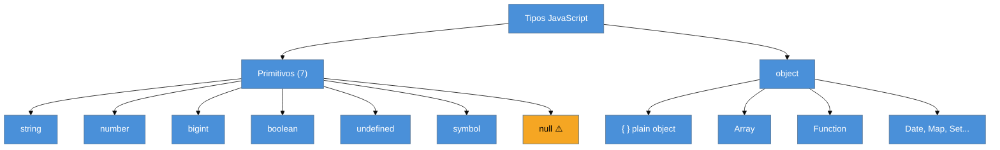
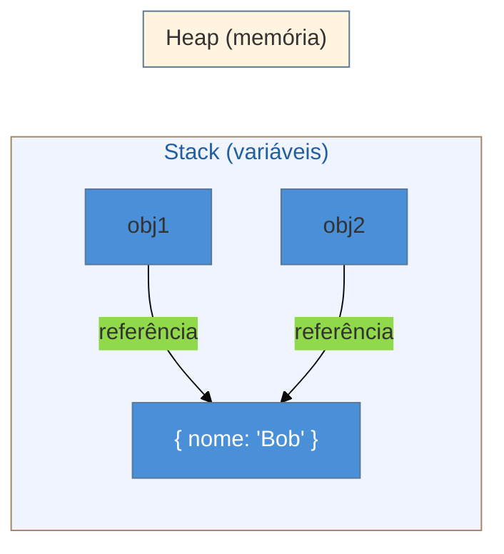

# Tipos em runtime

> [!abstract] TL;DR
> JavaScript tem 8 tipos: 7 **primitivos** (string, number, bigint, boolean, undefined, symbol, null) + **object**. Primitivos são imutáveis e passados por valor; objetos são mutáveis e passados por referência. O operador `typeof` revela o tipo de qualquer valor — exceto `null`, que retorna `"object"` por um bug histórico que não pode ser corrigido. Wrappers como `String` e `Number` existem, mas o JS cria e descarta esses objetos automaticamente (autoboxing) — você quase nunca os instancia diretamente.

---

Imagine que você está depurando um bug clássico: você passa um objeto para uma função, ela modifica uma propriedade, e ao voltar para o código original o valor está diferente do que você esperou. Mas quando faz a mesma coisa com um número, o original não muda. O que aconteceu?

A resposta está em como o JavaScript organiza seus tipos em tempo de execução (*runtime*). Não é uma questão de TypeScript, não é uma questão de frameworks — é o comportamento fundamental da linguagem, e entendê-lo é a diferença entre depurar por intuição e depurar com certeza.

---

## Os 8 tipos do JavaScript

O JavaScript não tem uma hierarquia de tipos complexa. Ele tem exatamente 8 tipos, e tudo que você cria em código cabe em um deles:

```
string · number · bigint · boolean · undefined · symbol · null  →  primitivos (7)
object                                                           →  o "resto" (1)
```

Funções, arrays, datas, mapas — tudo isso é `object`. A distinção real está entre os 7 [[Dicionário de JavaScript#primitivo|primitivos]] e o `object`.



> [!question]- Por que `null` está marcado com ⚠️?
> Porque `null` é um primitivo na especificação, mas `typeof null` retorna `"object"` — um bug histórico que veremos em detalhes adiante.

---

## Os 7 primitivos em detalhe

### string

Sequência de caracteres Unicode. Em JavaScript, strings são **imutáveis**: uma vez criada, você não modifica a string — você cria uma nova.

```js
let nome = "Alice";
nome[0] = "B";   // silenciosamente ignorado em modo não-strict
console.log(nome); // ainda "Alice"
```

### number

Representa **todos** os números de ponto flutuante de 64 bits (IEEE 754). Não existe um tipo inteiro separado — `1` e `1.0` são o mesmo valor. Isso traz consequências:

```js
0.1 + 0.2 === 0.3  // false — 0.30000000000000004
Number.MAX_SAFE_INTEGER  // 9007199254740991 (2^53 - 1)
```

Acima de `MAX_SAFE_INTEGER`, inteiros não são representados com precisão exata. Para isso existe o `bigint`.

> [!warning] Números em dinheiro: nunca use `number` diretamente
> **O que acontece:** `0.1 + 0.2 === 0.30000000000000004` — erro imperceptível em tela, mas catastrófico em finanças. **Padrão de produção:** trabalhar em **centavos** (inteiros) em vez de reais/dólares. Multiplique antes de operar, divida só para exibir:
> ```js
> // ❌ Arriscado em sistemas financeiros
> const total = 19.9 * 3; // 59.699999999999996
>
> // ✅ Em centavos — cálculo exato
> const totalCents = 1990 * 3; // 5970
> const display = (totalCents / 100).toFixed(2); // "59.70"
> ```
> Para sistemas mais complexos, use `dinero.js` ou `big.js`, que implementam aritmética de precisão sobre inteiros.

### bigint

Inteiros de precisão arbitrária, sem limite de tamanho. Criado com o sufixo `n`:

```js
const grande = 9007199254740992n;  // além do MAX_SAFE_INTEGER
const resultado = grande + 1n;     // 9007199254740993n — correto
```

Não mistura com `number` — a soma `1 + 1n` lança `TypeError`.

### boolean

Apenas dois valores: `true` e `false`. Simples, mas importante entender como valores de outros tipos se comportam em contexto booleano ([[Dicionário de JavaScript#truthy/falsy\|truthy/falsy]]) — tema da nota de [[03-Dominios/Tecnologia/JavaScript/03 - Coerção e igualdade|coerção]].

### undefined

O valor que o JavaScript usa para "ainda não definido". É o valor padrão de:
- Variáveis declaradas mas não inicializadas: `let x; // x === undefined`
- Parâmetros de função não fornecidos
- Propriedades inexistentes: `obj.naoExiste === undefined`
- Funções sem `return` explícito

### symbol

Um valor único e irrepetível, criado com `Symbol()`:

```js
const id1 = Symbol("id");
const id2 = Symbol("id");
id1 === id2  // false — mesmo rótulo, valores diferentes
```

O uso principal é criar **chaves de propriedade que não colidem** com outras. Símbolos não aparecem em iterações normais (`for...in`, `Object.keys`), o que os torna úteis para metadados "invisíveis".

Mas símbolos têm um papel mais profundo: os **well-known symbols** são pontos de extensão que permitem sobrescrever o comportamento nativo da linguagem. Imagine que você quer que um objeto seu "saiba" como se converter para número ou como se comportar num `for...of`. É exatamente para isso que existem:

- `Symbol.iterator` — torna qualquer objeto iterável com `for...of` e spread
- `Symbol.toPrimitive` — controla como o objeto se converte para primitivo (número, string ou padrão)
- `Symbol.hasInstance` — redefine o comportamento de `instanceof`

```js
class Temperatura {
    constructor(celsius) { this.celsius = celsius; }
    [Symbol.toPrimitive](hint) {
        if (hint === "number") return this.celsius;
        if (hint === "string") return `${this.celsius}°C`;
        return this.celsius;
    }
}

const t = new Temperatura(22);
console.log(+t);      // 22      — hint: number
console.log(`${t}`);  // "22°C" — hint: string
```

Well-known symbols aparecem com mais frequência em nota de [[03-Dominios/Tecnologia/JavaScript/22 - Metaprogramação|Metaprogramação]], mas é importante saber que `Symbol` não é só "chave privada".

### null

O valor "nenhum objeto aqui, intencionalmente". Enquanto `undefined` é "ainda não definido" (frequentemente pelo runtime), `null` é "explicitamente vazio" (sempre pelo programador).

---

## `typeof`: radiografando valores em runtime

`typeof` é o operador para inspecionar o tipo de um valor. Ele retorna uma string:

| Valor | `typeof` |
|-------|----------|
| `"olá"` | `"string"` |
| `42` | `"number"` |
| `9n` | `"bigint"` |
| `true` | `"boolean"` |
| `undefined` | `"undefined"` |
| `Symbol()` | `"symbol"` |
| `{}` | `"object"` |
| `[]` | `"object"` |
| `function(){}` | `"function"` |
| `null` | `"object"` ⚠️ |

> [!warning] `typeof` lança `ReferenceError` em variáveis na TDZ
> **O que acontece:** `typeof` tem reputação de operador seguro — retorna `"undefined"` para variáveis não declaradas. Mas com `let`/`const` na [[Dicionário de JavaScript#TDZ (Temporal Dead Zone)\|Temporal Dead Zone]], ele quebra essa promessa:
> ```js
> console.log(typeof foo);  // "undefined" — variável não declarada, seguro
> console.log(typeof bar);  // ReferenceError! — bar existe mas está na TDZ
> let bar = 42;
> ```
> **Por quê:** O motor sabe que `bar` existe (foi hoisted), mas a TDZ proíbe qualquer acesso antes da inicialização — inclusive `typeof`. É uma quebra deliberada: `foo` é verdadeiramente inexistente; `bar` existe mas está "bloqueado". **Como evitar:** Declare variáveis `let`/`const` antes de qualquer acesso — inclusive antes de testes de tipo.

> [!warning] A pegadinha histórica: `typeof null === "object"`
> **O que acontece:** `typeof null` retorna `"object"`, mas `null` é um primitivo — não é um objeto. **Por quê:** Na implementação original do JavaScript em 1995, valores eram armazenados com uma tag de tipo nos bits menos significativos. A tag `000` significava "object". `null` era representado internamente como o ponteiro nulo (todos os bits zero) — então a tag de tipo `000` era lida erroneamente como "object". **Como evitar:** Para checar `null`, sempre use `=== null` explicitamente:
> ```js
> // ❌ Não funciona:
> typeof null === "object"  // true, mas enganoso
>
> // ✅ Funciona:
> valor === null
> ```

`typeof` tem um comportamento especial para `function`: apesar de funções serem objetos (`typeof function(){} === "function"` é a única exceção na qual `typeof` retorna algo que não é o nome do tipo real), elas são identificadas como `"function"` por conveniência.

> [!info] `Object.is()` — quando `===` não é preciso o suficiente
> O operador `===` tem duas inconsistências que surpreendem: trata `NaN` como diferente de si mesmo e trata `-0` como igual a `+0`. `Object.is(a, b)` usa o algoritmo **SameValue** e acerta os dois casos:
> ```js
> // NaN
> NaN === NaN           // false — comportamento de IEEE 754
> Object.is(NaN, NaN)  // true ✓
>
> // -0 vs +0
> -0 === +0             // true (igualdade matemática)
> Object.is(-0, +0)    // false (bits realmente diferentes)
> ```
> Isso explica por que `NaN` funciona corretamente como chave de `Map` — o `Map` usa **SameValueZero** (variante de `Object.is` que trata `-0 === +0`). Raro no código de aplicação, mas entender isso responde a uma pergunta frequente de entrevista: "Como `NaN` pode ser chave de Map se `NaN !== NaN`?"

---

## Valores vs. referências: o bug de passagem de objeto

Aqui está a causa raiz do bug da abertura. Primitivos e objetos se comportam de maneira radicalmente diferente quando você os atribui ou passa para funções.

### Primitivos: cópia do valor

```js
let a = 42;
let b = a;      // b recebe uma CÓPIA do valor 42
b = 100;

console.log(a); // 42 — a não foi afetado
```

Cada variável tem sua própria cópia do valor. Modificar `b` não toca `a`.

### Objetos: cópia da referência

```js
let obj1 = { nome: "Alice" };
let obj2 = obj1;   // obj2 recebe uma CÓPIA da referência — aponta para o MESMO objeto

obj2.nome = "Bob";

console.log(obj1.nome); // "Bob" — ambas as variáveis apontam para o mesmo objeto
```



O mesmo acontece em funções:

```js
function renomeia(pessoa) {
    pessoa.nome = "Bob";  // modifica o OBJETO ORIGINAL
}

const alice = { nome: "Alice" };
renomeia(alice);
console.log(alice.nome); // "Bob" — foi modificado!
```

> [!question]- Então JavaScript passa objetos "por referência"?
> Tecnicamente, a linguagem passa *sempre por valor* — mas no caso de objetos, o valor que é passado é a **referência** (o endereço de memória). Então a função recebe uma cópia da referência, não uma cópia do objeto. Isso significa que você pode modificar o objeto apontado, mas não pode redirecionar a variável original para outro objeto:
> ```js
> function tentaSubstituir(obj) {
>     obj = { novo: true };  // só redireciona a cópia local da referência
> }
> const meu = { antigo: true };
> tentaSubstituir(meu);
> console.log(meu); // { antigo: true } — não foi substituído
> ```

---

## Wrappers e autoboxing

Se `"hello"` é um primitivo imutável, como `"hello".toUpperCase()` funciona? Primitivos não têm métodos.

A resposta é o **[[Dicionário de JavaScript#autoboxing\|autoboxing]]**: quando você acessa uma propriedade ou chama um método em um primitivo, o JavaScript cria automaticamente um objeto wrapper temporário, usa o método, e descarta o objeto:

```
"hello".toUpperCase()
  ↓ engine faz internamente:
new String("hello").toUpperCase()  → "HELLO"
  ↓ wrapper é descartado imediatamente
```

Os três wrappers são `String`, `Number` e `Boolean`. Eles existem principalmente para que os primitivos tenham acesso a métodos.

> [!warning] Nunca use `new String()`, `new Number()`, `new Boolean()`
> **O que acontece:** Você cria um **objeto**, não um primitivo. Isso quebra comparações de igualdade de formas inesperadas. **Por quê:**
> ```js
> const a = "hello";
> const b = new String("hello");
>
> typeof a // "string"
> typeof b // "object" — é um objeto!
>
> a === b  // false — tipos diferentes
> if (b) { /* SEMPRE entra aqui */ } // objeto vazio é truthy!
> ```
> **Como evitar:** Use literais — `"texto"`, `42`, `true`. O autoboxing cuida do resto automaticamente.

> [!warning] Wrappers `Boolean` com valor falso são truthy
> ```js
> const falso = new Boolean(false); // objeto wrapper
> if (falso) {
>     console.log("Isso executa!"); // executa! objeto é truthy
> }
> ```
> Um `new Boolean(false)` é um objeto não-nulo — e objetos são sempre truthy, independente do valor que carregam.

---

## `null` vs. `undefined`: a distinção que importa

Ambos representam "ausência de valor", mas com intenções diferentes:

| | `undefined` | `null` |
|--|-------------|--------|
| **Quem define** | O runtime (JS) | O programador |
| **Significa** | Ainda não atribuído | Intencionalmente vazio |
| **`typeof`** | `"undefined"` | `"object"` ⚠️ |
| **`== null`** | `true` | `true` |
| **`=== null`** | `false` | `true` |
| **JSON** | omitido | preservado como `null` |

```js
// undefined: ausência não-intencional
let variavel;          // undefined — JS não inicializou
function f(x) { return x; } f(); // undefined — param não fornecido

// null: ausência intencional
let usuario = null;   // "ainda não tenho um usuário, mas sei que serei"
```

```js
// Comparação frouxa (==): null e undefined são iguais entre si
null == undefined  // true

// Comparação estrita (===): são diferentes
null === undefined  // false
```

A convenção prática: **deixe o runtime usar `undefined`; use `null` quando você quer sinalizar explicitamente "nenhum valor aqui"**.

> [!warning] Acessar propriedade em `null` ou `undefined` lança TypeError
> **O que acontece:** `Cannot read properties of null (reading 'nome')` — provavelmente o erro mais frequente em JavaScript. **Por quê:** `null` e `undefined` não têm propriedades. Autoboxing não se aplica a eles. **Como evitar:** Use optional chaining:
> ```js
> const nome = usuario?.nome; // undefined se usuario for null/undefined
> ```

---

## Imutabilidade de primitivos vs. mutabilidade de objetos

Primitivos são **imutáveis**: não existe operação que mude o valor de uma string ou number existente. Toda operação cria um novo valor:

```js
let texto = "hello";
texto.toUpperCase();    // retorna "HELLO" — um valor NOVO
console.log(texto);     // "hello" — o original não mudou

// Isso parece mudar o texto, mas na verdade cria uma nova string:
texto = texto + " world";  // texto aponta agora para "hello world"
```

Objetos são **mutáveis**: você pode adicionar, remover e alterar propriedades de um objeto existente:

```js
const pessoa = { nome: "Alice" };
pessoa.nome = "Bob";       // modifica o objeto existente
pessoa.idade = 30;         // adiciona propriedade nova
delete pessoa.nome;        // remove propriedade

console.log(pessoa);       // { idade: 30 }
```

> [!info] `const` não significa imutável
> `const` impede que a *variável* seja reatribuída — não impede que o *objeto* seja mutado:
> ```js
> const config = { debug: false };
> config.debug = true;    // funciona! o objeto foi mutado
> config = {};            // TypeError: Assignment to constant variable
> ```
> Para objetos verdadeiramente imutáveis, use `Object.freeze()`.

---

## Armadilhas comuns

> [!warning] `NaN` não é igual a si mesmo
> **O que acontece:** `NaN === NaN` retorna `false` — é a única coisa em JavaScript que não é igual a si mesma. **Por quê:** É assim definido no padrão IEEE 754: "not a number" não é um valor específico, é uma categoria de resultados inválidos. **Como evitar:** Use `Number.isNaN(valor)` em vez de `valor === NaN`:
> ```js
> Number.isNaN(NaN)       // true
> Number.isNaN("texto")   // false (não converte, ao contrário de isNaN global)
> ```

> [!warning] Comparação de objetos nunca é por valor
> **O que acontece:** Dois objetos com o mesmo conteúdo não são iguais via `===`. **Por quê:** `===` compara referências (endereços de memória), não conteúdo. **Como evitar:**
> ```js
> { a: 1 } === { a: 1 }  // false — objetos diferentes na memória
>
> // Para comparar conteúdo, use:
> JSON.stringify(obj1) === JSON.stringify(obj2)  // simples, mas frágil
> // Ou uma lib: lodash.isEqual, fast-deep-equal
> ```

> [!warning] `typeof` não distingue `null` de objetos
> **O que acontece:** `typeof null === "object"` retorna `true`, confundindo quem testa o tipo para decidir se algo é um objeto. **Por quê:** Bug histórico (ver seção de `typeof`). **Como evitar:**
> ```js
> // Padrão para checar "é um objeto real (não null)":
> function isObject(val) {
>     return typeof val === "object" && val !== null;
> }
> ```

> [!warning] Spread não faz cópia profunda de objetos aninhados
> **O que acontece:** `{ ...obj }` copia apenas o primeiro nível — objetos aninhados ainda são referências compartilhadas. **Por quê:** Spread copia as referências das propriedades, não os valores dos objetos aninhados. **Como evitar:**
> ```js
> const original = { a: 1, nested: { b: 2 } };
> const copia = { ...original };
>
> copia.nested.b = 99;
> console.log(original.nested.b); // 99 — nested foi mutado!
>
> // Cópia profunda: structuredClone (nativo desde Node 17 / browsers modernos)
> const copiaProfunda = structuredClone(original);
> ```

> [!warning] `structuredClone` não clona funções nem nós do DOM
> **O que acontece:** `structuredClone` lida bem com `Date`, `Map`, `Set` e referências circulares — mas lança `DataCloneError` para funções e elementos DOM.
> ```js
> structuredClone({ fn: () => {} }) // DataCloneError: () => {} could not be cloned
> structuredClone(document.body)    // DataCloneError: HTMLBodyElement
> ```
> **Benchmark:** `JSON.stringify` é ~2-3× mais rápido para objetos simples, mas perde `Date` (vira string), `undefined`, `Map` e `Set`. `structuredClone` é a escolha correta para estado rico; `JSON.stringify` para payloads simples de serialização/cache. **Alternativa para funções:** `lodash.cloneDeep` ou serialização manual campo a campo.

---

## Casos práticos

### Detectar o tipo real de um valor em runtime

`typeof` é insuficiente para distinguir `null`, arrays e objetos comuns — todos retornam `"object"`. Em produção, você precisa de verificações compostas:

```js
function tipoReal(val) {
    if (val === null) return "null";
    if (Array.isArray(val)) return "array";
    return typeof val;
}

tipoReal(null);       // "null"
tipoReal([1, 2, 3]);  // "array"
tipoReal({});         // "object"
tipoReal(42);         // "number"
```

Essa função aparece frequentemente em utilitários de serialização, validadores de API e funções de log diagnóstico.

### Cópia segura de estado em React/Redux

Modificar objeto aninhado sem clonar corretamente quebra a detecção de mudança por referência — o `===` no `shouldComponentUpdate` (ou no Redux selector) compara referências, não conteúdo:

```js
// ❌ Mutação direta — React/Redux não detecta mudança
const novoEstado = estado;
novoEstado.usuario.nome = "Bob"; // mutou a referência original

// ✅ Cópia profunda nativa (Node 17+ / browsers modernos)
const novoEstado = structuredClone(estado);
novoEstado.usuario.nome = "Bob"; // original intacto
```

### Guarda de nullabilidade em dados de API

Dados externos chegam com `null` ou propriedades ausentes. Acessar sem guarda lança o TypeError mais frequente de JS:

```js
// ❌ TypeError se usuario for null ou undefined
const nome = usuario.nome;

// ✅ Optional chaining + nullish coalescing
const nome = usuario?.nome ?? "Anônimo";

// ✅ Também funciona em cadeia longa
const cidade = perfil?.endereco?.cidade ?? "Não informado";
```

---

## Como explicar em inglês

In JavaScript, there are seven primitive types — string, number, bigint, boolean, undefined, symbol, and null — plus the object type. Primitives are immutable and copied by value, while objects are mutable and passed by reference. The `typeof` operator reveals a value's type at runtime, but watch out: `typeof null` returns `"object"` due to a historical bug that was never fixed for backward compatibility reasons.

| PT | EN |
|----|----|
| primitivo | primitive |
| tipo em runtime | runtime type |
| por valor / por referência | by value / by reference |
| imutável | immutable |
| mutável | mutable |
| autoboxing | autoboxing |
| wrapper | wrapper object |
| pegadinha | gotcha / quirk |
| operador | operator |
| referência | reference |

---

## O que vem a seguir

Saber que os tipos existem é o primeiro passo — mas o JavaScript não para por aí. Quando você mistura tipos em operações (`"5" + 3`, `null == 0`, `[] == false`), a linguagem aplica **coerção**: conversão implícita de tipo. Essa mecânica explica grande parte das "esquisitices" famosas do JS e é essencial para entender o operador `==` vs. `===`.

- [[03-Dominios/Tecnologia/JavaScript/03 - Coerção e igualdade|03 - Coerção e igualdade]] — como o JS converte tipos implicitamente, `==` vs `===`, e as armadilhas de truthy/falsy em comparações
- [[03-Dominios/Tecnologia/JavaScript/13 - Números, BigInt e precisão|13 - Números, BigInt e precisão]] — detalhes de IEEE 754, `bigint`, aritmética de precisão e casos de uso em produção
- [[03-Dominios/Tecnologia/JavaScript/20 - Cópia, serialização e imutabilidade|20 - Cópia, serialização e imutabilidade]] — spread, `structuredClone`, `Object.freeze` e imutabilidade defensiva
- [[03-Dominios/Tecnologia/TypeScript/index|TypeScript]] — como adicionar tipagem **estática** sobre esse sistema dinâmico de runtime; o TS não muda o comportamento em runtime, só adiciona verificações em tempo de compilação

---

## Fontes

- **MDN Web Docs** — [*JavaScript data types and data structures*](https://developer.mozilla.org/en-US/docs/Web/JavaScript/Guide/Data_structures) — referência canônica do sistema de tipos do JS, mantida pela Mozilla
- **MDN Web Docs** — [*`typeof` operator*](https://developer.mozilla.org/en-US/docs/Web/JavaScript/Reference/Operators/typeof) — documentação completa do operador, incluindo o caso especial de `null`
- **MDN Web Docs** — [*`null`*](https://developer.mozilla.org/en-US/docs/Web/JavaScript/Reference/Operators/null) — distinção oficial entre `null` e `undefined`
- **Dmitri Pavlutin** — [*The Difference Between Values and References in JavaScript*](https://dmitripavlutin.com/value-vs-reference-javascript/) — explicação clara e visual de valor vs. referência com exemplos práticos
- **Alexander Obregon / Medium** — [*The Real Reason JavaScript typeof Null Returns Object*](https://medium.com/@AlexanderObregon/the-real-reason-javascript-typeof-null-returns-object-f41d39c9fe5b) — história e mecânica interna do bug do `typeof null`
- **FreeCodeCamp** — [*JavaScript Primitive Values vs Reference Values*](https://www.freecodecamp.org/news/javascript-assigning-values-vs-assigning-references/) — exemplos práticos de passagem por valor e referência
- **MDN Web Docs** — [*`let` — Temporal Dead Zone*](https://developer.mozilla.org/en-US/docs/Web/JavaScript/Reference/Statements/let) — comportamento de `typeof` em variáveis na TDZ
- **MDN Web Docs** — [*`Object.is()`*](https://developer.mozilla.org/en-US/docs/Web/JavaScript/Reference/Global_Objects/Object/is) — algoritmo SameValue vs `===`, casos de NaN e -0
- **Dmitri Pavlutin** — [*Detailed Overview of Well-Known Symbols*](https://dmitripavlutin.com/detailed-overview-of-well-known-symbols/) — Symbol.iterator, Symbol.toPrimitive e outros pontos de extensão da linguagem
- **Benjamin Renoux / DEV** — [*Financial Precision in JavaScript: Handle Money Without Losing a Cent*](https://dev.to/benjamin_renoux/financial-precision-in-javascript-handle-money-without-losing-a-cent-1chc) — padrão centavos e libs para aritmética financeira
- **BounDev** — [*JavaScript Deep Cloning: structuredClone vs JSON.stringify*](https://www.boundev.com/blog/javascript-deep-cloning-structured-clone-2026) — limites do `structuredClone` e benchmark de performance

> [!tip] Vídeo recomendado
> **[JavaScript Types Explained: Primitive vs. Reference](https://www.youtube.com/watch?v=ZmoLbxd_41E)** (2024) — explica visualmente a diferença entre primitivos e objetos, passagem por valor vs. referência, e como a memória (stack/heap) entra no jogo. Bom ponto de partida antes de ler sobre coerção.
