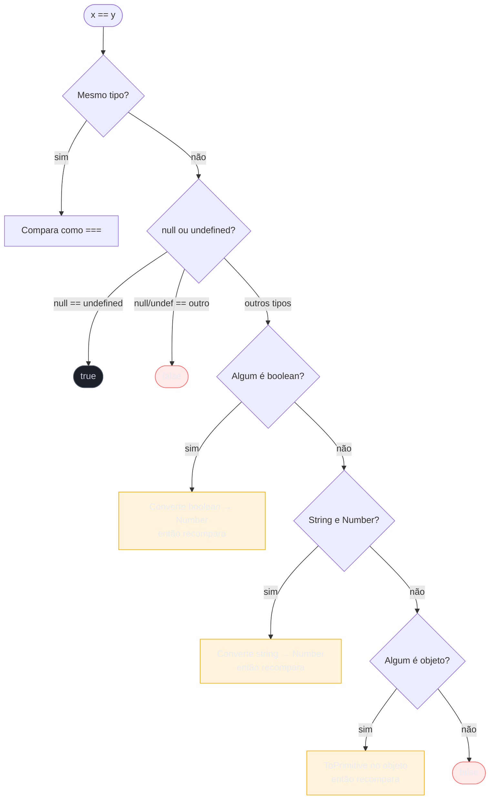

# Coerção e igualdade

> [!abstract] TL;DR
> JavaScript converte valores entre tipos automaticamente — isso se chama **[[Dicionário de JavaScript#coerção\|coerção implícita]]**. O operador `==` aplica o algoritmo de *Abstract Equality* antes de comparar, o que gera resultados contraintuitivos. `===` compara sem converter. Os únicos **8 valores [[Dicionário de JavaScript#truthy/falsy\|falsy]]** da linguagem são `false`, `0`, `-0`, `0n`, `""`, `null`, `undefined`, `NaN` — todo o resto é truthy, incluindo `[]` e `{}`. Use sempre `===`, com a única exceção deliberada do idiom `== null`.

---

Imagine que você está em uma entrevista de emprego e o entrevistador pergunta: "Quanto vale `[] == ![]` em JavaScript?" Você pisca. Como um array vazio pode ser igual ao *negativo* de si mesmo? A resposta é `true`, e entender por quê é entender o coração de uma das partes mais traiçoeiras da linguagem.

Coerção não é um bug — é uma *feature* intencional do design original do JavaScript, pensada para ser conveniente numa web dos anos 1990. Com o tempo, revelou ser fonte de bugs sutis. Dominar as regras de coerção é, hoje, diferencial em entrevistas e proteção real no dia a dia.

---

## O que é coerção

Coerção é a conversão de um valor de um tipo para outro — disparada *pela linguagem*, não por você.

Existem dois sabores:

- **Explícita**: você pede a conversão — `Number("42")`, `String(true)`, `Boolean(0)`.
- **Implícita**: a linguagem converte por você, silenciosamente, ao avaliar expressões como `"5" + 3` ou `if (valor)`.

É a coerção implícita que surpreende. Ela aparece em três contextos principais:

| Contexto | Exemplo | O que acontece |
|---|---|---|
| Operador `+` com string | `"5" + 3` | Número vira string → `"53"` |
| Operadores aritméticos | `"5" - 3` | String vira número → `2` |
| Contexto booleano | `if ([])` | Valor vira booleano → `true` |
| Operador `==` | `0 == false` | Ambos viram número → `true` |

> [!info] Coerção no [[Dicionário de JavaScript]]
> O Dicionário define **coerção** como "a conversão implícita de um valor de um tipo para outro, disparada por operadores (`+`, `==`) ou contextos (condições)." **truthy/falsy** também está lá definido — consulte para a definição canônica do vault.

---

## ToPrimitive: o algoritmo por trás das conversões de objeto

Quando o JavaScript precisa converter um **objeto** para um [[Dicionário de JavaScript#primitivo|primitivo]] — ao usar `+`, `==`, template literals ou operações aritméticas — ele chama internamente o algoritmo **[[Dicionário de JavaScript#ToPrimitive\|ToPrimitive]](input, hint)**. O `hint` pode ser `"default"`, `"string"` ou `"number"`, e muda a ordem em que os métodos são tentados:

| Hint | Tenta primeiro | Tenta depois |
|---|---|---|
| `"number"` | `valueOf()` | `toString()` |
| `"string"` | `toString()` | `valueOf()` |
| `"default"` | `valueOf()` | `toString()` |

Por que `[].valueOf()` não resolve? Porque `valueOf()` de um array retorna o próprio array — um objeto, não um primitivo. Quando o resultado não é primitivo, o algoritmo tenta o segundo método. `[].toString()` retorna `""`, que é primitivo — e é por isso que `[] + ""` vira `""`.

Você pode sobrescrever esse comportamento via `Symbol.toPrimitive`:

```js
const obj = {
  [Symbol.toPrimitive](hint) {
    if (hint === "number") return 42;
    if (hint === "string") return "quarenta e dois";
    return true; // hint === "default"
  }
};

+obj          // 42            — hint: number
`${obj}`      // "quarenta e dois" — hint: string
obj + ""      // "true"        — hint: default → true → "true"
obj == 42     // false         — hint: default → true → Number(true) → 1 ≠ 42
```

> [!question]- Quando o hint é "default" e quando é "number"?
> O hint `"default"` aparece no operador `==` e no operador `+` binário quando um dos lados é objeto. O hint `"number"` aparece em operadores aritméticos puros (`-`, `*`, `/`, `**`). A distinção só importa quando você implementa `Symbol.toPrimitive` — para objetos comuns, `"default"` e `"number"` têm o mesmo comportamento (valorOf primeiro).

---

## O operador `+`: o camaleão

O `+` é o único operador aritmético que também serve para concatenar strings. Essa dualidade é a fonte de muita confusão.

**Regra:** se *qualquer* operando for `string`, o `+` concatena. Caso contrário, converte tudo para `number` e soma.

```js
"5" + 3       // "53"   — 3 vira string, concatena
5 + "3"       // "53"   — 5 vira string, concatena
5 + 3         // 8      — ambos são número, soma
5 - "3"       // 2      — "-" não concatena, "3" vira número
true + 1      // 2      — true vira 1
false + 1     // 1      — false vira 0
null + 1      // 1      — null vira 0
undefined + 1 // NaN    — undefined vira NaN
```

> [!question]- Por que `"5" + 3` é `"53"` mas `"5" - 3` é `2`?
> O `+` tem dupla personalidade: soma números *e* concatena strings. Quando vê uma string, assume papel de concatenador. Já `-`, `*` e `/` são *exclusivamente* aritméticos — não há semântica de string, então convertem tudo para número antes de operar.

### A exceção do `Date`: hint "default" age como "string"

A maioria dos objetos trata o hint `"default"` igual ao `"number"` — mas `Date` é a exceção notável da spec. `Date[Symbol.toPrimitive]("default")` retorna string (o mesmo que hint `"string"`), não número.

```js
new Date() + 1       // "Wed Jun 25 2026...1"  — Date usa toString(), concatena
new Date() - 1       // número em ms           — "-" força hint "number", usa getTime()
new Date() * 1       // número em ms           — mesmo motivo
```

> [!warning] Armadilha: `new Date() + new Date()` concatena strings
> Em cálculos de data, `new Date() - new Date()` dá a diferença em milissegundos (correto). Mas `new Date() + new Date()` concatena duas strings de data — uma armadilha silenciosa em código real. Se precisar somar timestamps, use `date.getTime()` ou `+date` (unário) para forçar conversão numérica explícita.

---

## Truthy e falsy: a lista que você precisa decorar

Toda vez que JavaScript precisa de um `boolean` — em `if`, `while`, `? :`, `||`, `&&` — ele converte o valor. Esse processo é chamado de **coerção booleana**.

Os valores que se tornam `false` são chamados de **falsy**. São exatamente **8**:

```js
false
0
-0
0n        // BigInt zero
""        // string vazia (aspas simples ou duplas ou template)
null
undefined
NaN
```

**Todo o resto é truthy.** Isso inclui:

```js
[]         // array vazio — TRUTHY
{}         // objeto vazio — TRUTHY
"0"        // string "zero" — TRUTHY (não é vazia!)
"false"    // string com texto — TRUTHY
-1         // qualquer número não-zero — TRUTHY
Infinity   // TRUTHY
```

> [!warning] Armadilha: array vazio é truthy
> `if ([])` entra no bloco — `[]` é truthy. Mas `[] == false` é `true` (via coerção numérica). Os dois comportamentos parecem contradizer um ao outro. A diferença: coerção booleana (`if`) e algoritmo `==` são mecanismos distintos.

---

## `==` vs `===`: dois algoritmos diferentes

### Igualdade estrita `===`

Simples: compara **tipo** e **valor**. Se os tipos forem diferentes, retorna `false` sem mais conversa.

```js
1 === "1"    // false — tipos diferentes
1 === 1      // true
null === undefined  // false — tipos diferentes
```

### Igualdade abstrata `==` (Abstract Equality Comparison)

Aqui entra a coerção. O algoritmo da spec (ECMAScript §7.2.14) é:

```
Dados x e y:
1. Se Type(x) === Type(y): compare como === (com regras especiais para NaN)
2. null == undefined → true (e undefined == null → true)
3. null ou undefined == qualquer outra coisa → false
4. Se um é número e o outro é string: converte a string para número, recompara
5. Se um é boolean: converte o boolean para número, recompara
6. Se um é objeto e o outro é string, número ou symbol: converte o objeto via ToPrimitive(), recompara
```

Visualizando as conversões prioritárias:



---

## A tabela de coerção do `==`

As comparações que mais aparecem em entrevistas:

| Comparação | Resultado | Por quê |
|---|---|---|
| `null == undefined` | `true` | Regra especial da spec |
| `null == false` | `false` | null só iguala undefined |
| `null == 0` | `false` | null só iguala undefined |
| `0 == false` | `true` | false → 0; 0 == 0 |
| `"" == false` | `true` | false → 0; "" → 0; 0 == 0 |
| `"1" == 1` | `true` | "1" → 1; 1 == 1 |
| `"0" == false` | `true` | false → 0; "0" → 0; 0 == 0 |
| `[] == false` | `true` | false → 0; [] → "" → 0; 0 == 0 |
| `[] == 0` | `true` | [] → "" → 0; 0 == 0 |
| `{} == false` | `false` | {} → "[object Object]" → NaN; NaN ≠ 0 |

---

## As pegadinhas clássicas — passo a passo

### `[] + []`

```
Passo 1: + com dois objetos → tenta concatenar (nenhum é string ainda)
Passo 2: ToPrimitive([]) → toString([]) → ""
Passo 3: ToPrimitive([]) → ""
Passo 4: "" + "" → ""
Resultado: "" (string vazia)
```

### `[] + {}`

```
Passo 1: ToPrimitive([]) → ""
Passo 2: ToPrimitive({}) → "[object Object]"
Passo 3: "" + "[object Object]" → "[object Object]"
Resultado: "[object Object]"
```

> [!warning] Armadilha: `{} + []` parece diferente no console
> No console do navegador, `{} + []` pode retornar `0` porque o `{}` é interpretado como **bloco vazio**, não objeto literal. O `+[]` vira `+""` vira `0`. Mas numa expressão `({}) + []`, com o objeto entre parênteses, retorna `"[object Object]"`.

### `[] == ![]`

Esta é a mais famosa. Vamos devagar:

```
Passo 1: Avalia o lado direito primeiro — ![]
  ![] → !true → false   ([] é truthy, ! nega → false)

Passo 2: Agora a comparação é [] == false

Passo 3: Regra 5 — um dos lados é boolean
  false → Number(false) → 0
  Agora: [] == 0

Passo 4: Regra 6 — um lado é objeto
  ToPrimitive([]) → [].toString() → ""
  Agora: "" == 0

Passo 5: Regra 4 — string e número
  Number("") → 0
  Agora: 0 == 0 → true

Resultado: true
```

> [!question]- Por que `ToPrimitive([])` vira `""`?
> Arrays têm um método `toString()` que junta os elementos com vírgula. Um array vazio não tem elementos, então `[].toString()` retorna `""`. Um array `[1, 2, 3].toString()` retorna `"1,2,3"`. É por isso que `[1] == 1` também é `true`: `"1"` → `1`.

---

## `Object.is`: igualdade sem surpresas

O ECMAScript 2015 introduziu `Object.is()` para cobrir os dois edge cases onde `===` se comporta estranhamente:

| Comparação | `===` | `Object.is()` |
|---|---|---|
| `NaN === NaN` | `false` | `true` |
| `0 === -0` | `true` | `false` |
| `1 === 1` | `true` | `true` |
| `null === null` | `true` | `true` |

### Por que `NaN !== NaN`?

`NaN` significa *Not a Number* — o resultado de operações matemáticas inválidas. A pergunta "esse resultado inválido é igual àquele resultado inválido?" não faz sentido semântico: `0/0` e `Math.sqrt(-1)` são ambos `NaN`, mas representam erros diferentes. A spec IEEE 754 (que define ponto flutuante) manda que NaN != NaN.

```js
NaN === NaN        // false — por definição
Object.is(NaN, NaN) // true — quando você PRECISA verificar se é NaN
Number.isNaN(NaN)  // true — a forma correta de checar NaN
isNaN("hello")     // true — CUIDADO: converte antes de checar (evite)
```

### Por que `-0`?

`-0` existe por causa do ponto flutuante IEEE 754. Representa a direção de aproximação ao zero (vindo de negativo). Na maioria dos casos não importa, mas em cálculos de direção/ângulo pode ser relevante.

```js
0 === -0            // true — === ignora o sinal
Object.is(0, -0)   // false — Object.is preserva o sinal
1 / 0              // Infinity
1 / -0             // -Infinity — aqui a diferença aparece
```

## Os quatro algoritmos de igualdade do JavaScript

A spec define não um, mas **quatro algoritmos** de igualdade, cada um com características diferentes:

| Algoritmo | Onde é usado | `NaN == NaN`? | `0 == -0`? |
|---|---|---|---|
| Abstract Equality (`==`) | operador `==` | `false` | `true` |
| Strict Equality (`===`) | operador `===`, `switch/case`, `Array.indexOf` | `false` | `true` |
| SameValue (`Object.is`) | `Object.is()`, `Object.defineProperty` | `true` | `false` |
| SameValueZero | `Map`, `Set`, `Array.includes`, `Array.findIndex` | `true` | `true` |

**[[Dicionário de JavaScript#SameValueZero\|SameValueZero]]** é o que `Map` e `Set` usam internamente. É idêntico a `Object.is` exceto que trata `0` e `-0` como iguais — por isso `new Set([0, -0]).size === 1`, mas `Object.is(0, -0) === false`.

```js
// SameValueZero em ação
new Set([NaN, NaN]).size      // 1 — NaN é deduplicado (SameValueZero trata NaN == NaN)
new Map([[NaN, "ok"]]).get(NaN)  // "ok" — NaN funciona como chave de Map
new Set([0, -0]).size         // 1 — SameValueZero: 0 e -0 são iguais
[NaN].includes(NaN)           // true — Array.includes usa SameValueZero
[NaN].indexOf(NaN)            // -1  — Array.indexOf usa ===, que diz NaN ≠ NaN
```

> [!question]- Por que `indexOf` e `includes` se comportam diferente com `NaN`?
> `indexOf` foi especificado antes do ES2015, usando `===`. `includes` foi introduzido no ES2016 com o algoritmo SameValueZero, que foi considerado mais útil na prática. O resultado: para verificar se um array contém `NaN`, use sempre `includes`, não `indexOf`.

---

## Boas práticas

**Regra de ouro: sempre use `===`.**

A única exceção deliberada aceita pela comunidade é o idiom de checagem de nulo:

```js
// Idiom == null: captura tanto null quanto undefined com um só teste
if (valor == null) {
  // entra aqui se valor for null OU undefined
}

// Equivalente verboso:
if (valor === null || valor === undefined) {
  // mesmo comportamento
}
```

Por quê esse é o único `==` tolerado? Porque `null == undefined` é uma das poucas regras do algoritmo que é *intuitiva* e *estável* — nunca muda, não envolve conversão numérica, e a semântica ("não tenho valor algum") faz sentido.

```js
// Exemplos concretos de boas práticas

// ✗ evite
if (x == 0)       // "" também passa, false também passa
if (x == false)   // "" e 0 também passam

// ✓ prefira
if (x === 0)      // só zero exato
if (x === false)  // só false
if (!x)           // se você quer falsy explicitamente (documente o motivo)
if (x == null)    // único == tolerado — null ou undefined
```

### Linting: deixe a ferramenta guardar as regras por você

O ESLint tem duas regras específicas para coerção que valem ativar em projetos sérios:

- **`eqeqeq`** — proíbe `==`, com a opção `"smart"` para permitir somente o idiom `== null`.
- **`no-implicit-coercion`** — proíbe atalhos como `+x`, `!!x`, `"" + x` em favor de `Number(x)`, `Boolean(x)`, `String(x)` explícitos. Reduz surpresas em code review e deixa a intenção clara.

```json
// .eslintrc
{
  "rules": {
    "eqeqeq": ["error", "smart"],
    "no-implicit-coercion": ["warn", { "boolean": true, "number": true }]
  }
}
```

A vantagem prática: você para de depender de memória para as 8+ regras do `==` e deixa o linter fazer o trabalho mecânico. Reserve a atenção mental para as decisões que realmente importam.

---

## Armadilhas comuns

> [!warning] Armadilha 1: `typeof NaN === "number"`
> `NaN` é do tipo `"number"` — é um valor numérico especial que representa "não é um número válido". Para verificar NaN, use `Number.isNaN(valor)`, não `valor === NaN` (que sempre é `false`) e não `isNaN(valor)` (que converte antes de checar).

> [!warning] Armadilha 2: `"0"` é truthy, mas `"0" == false` é `true`
> A coerção booleana (`if ("0")`) e o algoritmo `==` são mecanismos independentes. `"0"` não é string vazia, então é truthy em contexto booleano. Mas `"0" == false` passa por: `false → 0`, depois `"0" → 0`, e `0 == 0` é `true`. Dois sistemas, dois resultados — daí a importância de usar `===`.

> [!warning] Armadilha 3: `null + 1` vs `undefined + 1`
> `null` em contexto numérico vira `0` — então `null + 1 === 1`. `undefined` vira `NaN` — então `undefined + 1 === NaN`. Isso afeta loops e acumuladores que partem de valor padrão: inicialize sempre com `0`, não com `null`.

> [!warning] Armadilha 4: `parseInt` e coerção de string
> `parseInt("10px")` retorna `10` — para de converter no primeiro caractere não-numérico. `Number("10px")` retorna `NaN`. Em validação de inputs, `Number()` é mais seguro porque rejeita strings parcialmente numéricas.

> [!warning] Armadilha 5: `switch/case` usa `===`, não `==`
> `switch` compara os cases com **igualdade estrita** (`===`), não com `==`. Isso significa que `switch("1")` não entra no `case 1:` — o tipo importa. O erro é sutil porque visualmente `switch(x) { case 1: }` parece que pode aplicar coerção, mas não aplica.
>
> ```js
> switch ("1") {
>   case 1:   console.log("número"); break;  // não entra — tipo diferente
>   case "1": console.log("string"); break;  // entra aqui
> }
> ```

> [!warning] Armadilha 6: `+` unário converte para número — não é soma
> O `+` unário (sem operando à esquerda) é um atalho para `Number()`. Parece inócuo, mas aparece em código minificado e em padrões como `+new Date()`:
>
> ```js
> +"42"        // 42   — string → número
> +true        // 1
> +null        // 0
> +undefined   // NaN
> +[]          // 0    — [] → "" → 0
> +{}          // NaN  — {} → "[object Object]" → NaN
> +"0x10"      // 16   — parsing hexadecimal!
> ```
>
> Diferente de `parseInt`, o `+` unário não para no primeiro caractere inválido — converte tudo ou retorna `NaN`. Para código legível, prefira `Number(x)` explícito.

---

## Como explicar em inglês

In JavaScript, **type coercion** is the automatic conversion of values between types. The loose equality operator (`==`) triggers the *Abstract Equality Comparison* algorithm, which converts operands before comparing — this is why `[] == ![]` evaluates to `true`. Strict equality (`===`) compares type and value without any conversion, making it the safe default. The eight **falsy values** are `false`, `0`, `-0`, `0n`, `""`, `null`, `undefined`, and `NaN` — everything else, including empty arrays and objects, is **truthy**. `Object.is()` is the most precise equality check, correctly handling `NaN` (equal to itself) and `-0` (distinct from `+0`).

| PT | EN |
|---|---|
| coerção implícita | implicit coercion / type coercion |
| coerção explícita | explicit coercion / type casting |
| igualdade estrita | strict equality |
| igualdade abstrata | abstract equality / loose equality |
| valor falsy | falsy value |
| valor truthy | truthy value |
| conversão de tipo | type conversion |
| primitivo | primitive |
| algoritmo de comparação | comparison algorithm |

---

## O que vem a seguir

Coerção e tipos caminham juntos — entender *quais* tipos existem em JavaScript e como eles se comportam em memória é o passo natural antes (ou imediatamente depois) de dominar as regras de coerção.

- [[02 - Tipos em runtime]] — os 8 tipos primitivos e o tipo `object`: como são representados, como verificar com `typeof`/`instanceof`, e por que isso importa para coerção
- [[Dicionário de JavaScript]] — definições canônicas de coerção, truthy/falsy e primitivo no contexto do vault
- [[25 - Armadilhas e quirks]] — catálogo amplo das pegadinhas da linguagem, incluindo coerção em contextos menos óbvios

---

## Veja também

- [[03-Dominios/Ciência/Paradigmas/13 - Sistemas de tipos|Paradigmas — Sistemas de tipos]] — a dimensão ortogonal que explica *por que* JavaScript é dinamicamente tipado e quais garantias isso sacrifica em troca de flexibilidade; entender tipagem dinâmica vs. estática dá contexto para as regras de coerção

---

## Fontes

- **MDN Web Docs** — [*Equality comparisons and sameness*](https://developer.mozilla.org/en-US/docs/Web/JavaScript/Guide/Equality_comparisons_and_sameness) — referência canônica para `==`, `===` e `Object.is()`, com a tabela completa de sameness
- **MDN Web Docs** — [*Equality (==)*](https://developer.mozilla.org/en-US/docs/Web/JavaScript/Reference/Operators/Equality) — documentação do operador `==` com exemplos e o algoritmo Abstract Equality Comparison
- **Dr. Axel Rauschmayer / ExploringJS** — [*Type coercion in JavaScript*](https://exploringjs.com/deep-js/ch_type-coercion.html) — análise profunda das regras de coerção, com foco em ToPrimitive e Abstract Equality; fonte autoritativa
- **FreeCodeCamp** — [*JavaScript type coercion explained*](https://www.freecodecamp.org/news/js-type-coercion-explained-27ba3d9a2839/) — exemplos práticos das pegadinhas clássicas (`[] + []`, `[] == ![]`) com passo a passo
- **Stefan Judis** — [*+-0, NaN and Object.is in JavaScript*](https://www.stefanjudis.com/today-i-learned/0-nan-and-object-is-in-javascript/) — explicação concisa dos edge cases de `Object.is()` vs `===`
- **TC39 / ECMAScript spec** — [*ToPrimitive (§7.1.1)*](https://tc39.es/ecma262/#sec-toprimitive) — algoritmo canônico com as regras de hint e Symbol.toPrimitive
- **TC39 / ECMAScript spec** — [*SameValueZero (§7.2.11)*](https://tc39.es/ecma262/#sec-samevaluezero) — o algoritmo usado por Map, Set e Array.includes; difere de Object.is apenas no tratamento de ±0
- **TC39 / ECMAScript spec** — [*Date[@@toPrimitive] (§21.4.4.45)*](https://tc39.es/ecma262/#sec-date.prototype-@@toprimitive) — a exceção do Date no hint "default" (age como "string")
- **ESLint** — [*eqeqeq rule*](https://eslint.org/docs/latest/rules/eqeqeq) — documentação da regra com a opção "smart" para permitir o idiom `== null`
