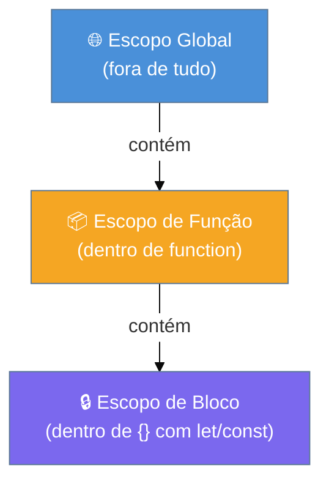
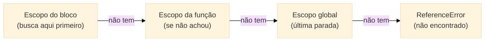
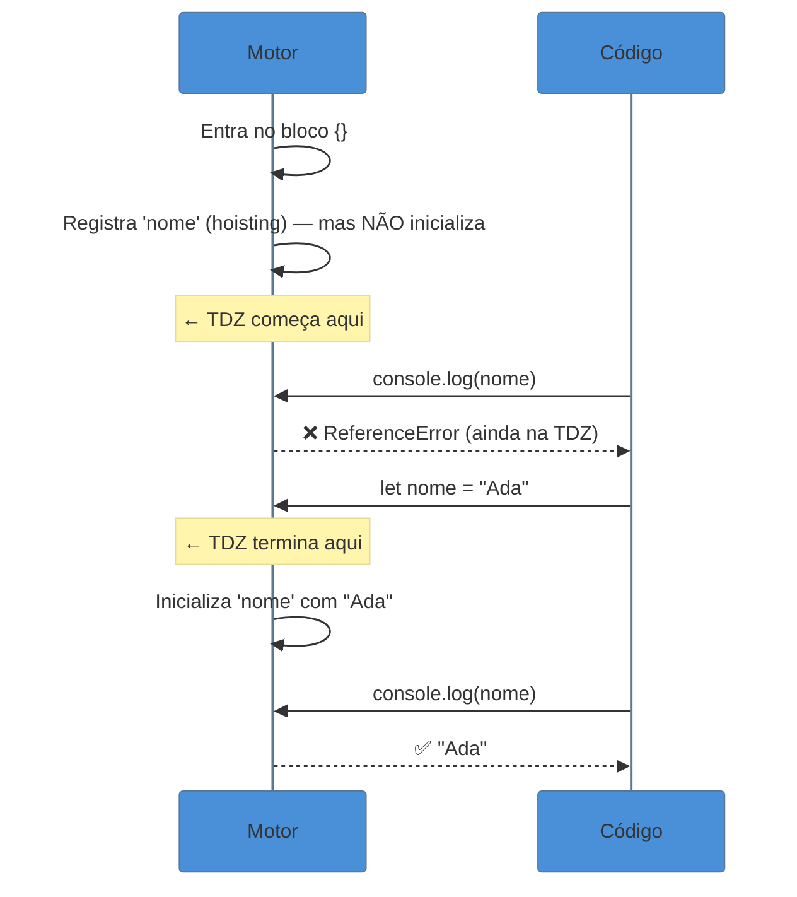

# Variáveis e escopo

> [!abstract] TL;DR
> JavaScript tem três formas de declarar variáveis — `var`, `let` e `const` — e cada uma tem regras diferentes de escopo e hoisting. `var` é escopo de função e "sobe" ao topo inicializado como `undefined`. `let` e `const` são escopo de bloco e também sofrem hoisting, mas ficam numa zona morta (TDZ) até a linha de declaração. O escopo é sempre léxico: determinado pelo lugar onde o código foi escrito, não de onde é chamado. Use `const` por padrão, `let` quando precisar reatribuir, e evite `var`.

---

Imagine que você está escrevendo seu primeiro script JavaScript e faz o seguinte:

```javascript
console.log(nome); // undefined — sem erro!
var nome = "Ada";
console.log(nome); // "Ada"
```

Espera — como pode usar `nome` antes de declará-la sem dar erro? E agora troque por `let`:

```javascript
console.log(nome); // ReferenceError!
let nome = "Ada";
```

O comportamento muda completamente. E se você já caiu nessa armadilha — ou vai cair em entrevista — esse é exatamente o motivo pelo qual vale entender o que JavaScript faz nos bastidores quando declara variáveis.

---

## As três formas de declarar variáveis

JavaScript evoluiu ao longo do tempo, e isso deixou três formas de declarar variáveis convivendo na linguagem:

| Keyword | Escopo | Hoisting | Reatribuição | Redeclaração |
|---------|--------|----------|--------------|--------------|
| `var`   | função (ou global) | sim — inicializado como `undefined` | sim | sim |
| `let`   | bloco | sim — mas entra na TDZ | sim | não |
| `const` | bloco | sim — mas entra na TDZ | não | não |

A regra prática: **use `const` por padrão. Use `let` quando precisar reatribuir. Evite `var`.**

---

## Escopo: onde uma variável vive

**Escopo** é a região do código onde uma variável pode ser acessada. JavaScript tem três zonas de escopo:



### Escopo global

Variáveis declaradas fora de qualquer função ou bloco vivem no escopo global. No browser, `var` declarada no nível de módulo fica pendurada no objeto `window`; no Node, vai no objeto `global`. Código de qualquer lugar pode acessá-las — o que parece conveniente, mas é uma armadilha de manutenção.

```javascript
var cor = "azul";
console.log(window.cor); // "azul" — só no browser

// Modern: globalThis unifica browser, Node e workers
console.log(globalThis.cor); // "azul" em qualquer ambiente
```

> [!info] `globalThis` — o objeto global portável (ES2020)
> Antes, cada ambiente tinha seu nome: `window` no browser, `global` no Node, `self` em workers. `globalThis` resolve isso: funciona em todos os ambientes sem `typeof` defensivo. Ver [[23 - Recursos modernos (ES2020 a ES2025)]] para outros recursos do ES2020.

Note que `let` e `const` no nível global **não** criam propriedades no `globalThis`, mesmo que vivam no escopo global — são ligadas ao módulo/script, mas inacessíveis via objeto global.

### Escopo de função

`var` segue escopo de função. Isso significa que uma variável declarada dentro de uma função não existe fora dela — mas existe em qualquer bloco `if`, `for` ou `while` dentro dessa mesma função:

```javascript
function exemplo() {
  if (true) {
    var dentro = "existo na função inteira";
  }
  console.log(dentro); // "existo na função inteira" — sem erro!
}
exemplo();
console.log(dentro); // ReferenceError — fora da função
```

Esse comportamento surpreende quem vem de linguagens como Java ou C, onde variáveis de bloco ficam no bloco.

### Escopo de bloco

`let` e `const` seguem escopo de bloco — qualquer par de `{}` cria uma barreira:

```javascript
function exemplo() {
  if (true) {
    let dentro = "só vivo aqui";
    const fixo = 42;
  }
  console.log(dentro); // ReferenceError
  console.log(fixo);   // ReferenceError
}
```

Loops se beneficiam muito disso:

```javascript
// com var: todos os callbacks compartilham a mesma variável i
for (var i = 0; i < 3; i++) {
  setTimeout(() => console.log(i), 100);
}
// imprime: 3, 3, 3  ← surpresa!

// com let: cada iteração tem sua própria cópia de i
for (let i = 0; i < 3; i++) {
  setTimeout(() => console.log(i), 100);
}
// imprime: 0, 1, 2  ← correto
```

---

## Escopo léxico: onde você escreve define onde você lê

JavaScript usa **escopo léxico** (também chamado de escopo estático): o escopo de uma variável é determinado pelo lugar onde ela foi **escrita no código**, não pelo lugar de onde a função é **chamada**.

Isso é o que torna o comportamento previsível:

```javascript
const mensagem = "olá do escopo externo";

function interna() {
  console.log(mensagem); // acessa mensagem do escopo onde foi DEFINIDA
}

function externa() {
  const mensagem = "olá do escopo de externa";
  interna(); // interna() não enxerga o mensagem daqui
}

externa(); // imprime: "olá do escopo externo"
```

`interna()` foi definida no escopo global, então ela enxerga o `mensagem` global — não o local de `externa()`. O local de chamada não importa.

Esse conceito é a base das [[Dicionário de JavaScript#closure|closures]] — quando uma função "lembra" o escopo onde foi criada. A nota [[10 - Closures]] detalha isso com exemplos práticos de module pattern e memoização.

---

## Shadowing: quando escopos internos cobrem os externos

**Shadowing** (sombreamento — ver [[Dicionário de JavaScript#shadowing (sombreamento)|Dicionário]]) acontece quando uma variável em um escopo interno tem o mesmo nome que outra em um escopo externo. A variável interna "cobre" a externa enquanto o escopo interno está ativo:

```javascript
const x = "global";

function externa() {
  const x = "função"; // shadowing de x global

  function interna() {
    const x = "bloco"; // shadowing de x de externa
    console.log(x);    // "bloco"
  }

  interna();
  console.log(x); // "função" — x global ainda intacto
}

externa();
console.log(x); // "global" — nunca foi tocado
```

O shadowing não modifica a variável do escopo externo — cria uma nova variável local com o mesmo nome. Quando o escopo interno encerra, a variável interna desaparece e a externa volta a ser visível.

> [!warning] Shadowing acidental com parâmetros
> Um parâmetro de função faz shadowing de qualquer variável do escopo externo com o mesmo nome:
> ```javascript
> const nome = "Ada";
>
> function saudar(nome) { // parâmetro faz shadow do 'nome' global
>   console.log(`Olá, ${nome}!`);
> }
>
> saudar("Alan"); // "Olá, Alan!" — usa o parâmetro
> console.log(nome); // "Ada" — global intacto
> ```
> Isso é útil — permite funções independentes do estado externo — mas nomear parâmetros igual a variáveis externas pode causar confusão em bases de código maiores.

### Como o motor resolve nomes: a scope chain

Quando o JavaScript precisa resolver um nome de variável, percorre a **scope chain** (cadeia de escopos — ver [[Dicionário de JavaScript#scope chain (cadeia de escopos)|Dicionário]]) do escopo mais interno para o mais externo até encontrar a declaração — ou lançar `ReferenceError` se chegar ao global sem encontrar.



Isso é implementado internamente via **Environment Records** (registros de ambiente) encadeados. Cada função ou bloco cria um novo Environment Record com referência ao externo — formando a cadeia. É essa estrutura que closures mantêm viva: guardam a referência ao Environment Record do escopo onde foram criadas.

> [!tip] Para o nível de detalhe dos Environment Records e como o motor cria e destrói escopos durante a execução, ver [[19 - Modelo de execução a fundo]].

---

## Hoisting: o que JavaScript faz antes de executar

Antes de rodar qualquer linha, o motor JavaScript faz uma passagem rápida pelo código para registrar todas as declarações. Esse processo se chama **hoisting** (elevação).

> [!info] O hoisting não move código
> O código não é fisicamente movido. O que acontece é que o motor registra as declarações numa fase de preparação antes da execução. Mas o efeito prático é como se as declarações "subissem" ao topo do escopo.

### Hoisting de `var`: sobe e já vale `undefined`

```javascript
console.log(x); // undefined — sem erro!
var x = 10;
console.log(x); // 10
```

O que o motor "vê" internamente:

```javascript
var x; // declaração elevada, inicializada como undefined
console.log(x); // undefined
x = 10;         // atribuição fica no lugar
console.log(x); // 10
```

### Hoisting de funções: sobe completa

Funções declaradas com `function` sobem **inteiras** — nome e corpo:

```javascript
saudar(); // "Olá!" — funciona antes da declaração!

function saudar() {
  console.log("Olá!");
}
```

Isso é útil: você pode organizar o código com as funções principais no topo e as auxiliares abaixo, e tudo funciona.

> [!warning] Function expression não sofre hoisting completo
> ```javascript
> saudar(); // TypeError: saudar is not a function
> var saudar = function() { console.log("Olá!"); };
> ```
> Aqui, `var saudar` sobe como `undefined`, e chamar `undefined` como função dá `TypeError`.

### Hoisting de `let` e `const`: sobem, mas entram na TDZ

`let` e `const` também sofrem hoisting — o motor sabe que eles existem — mas não são inicializados. Ficam numa zona de espera chamada TDZ.

---

## TDZ — Temporal Dead Zone

A **TDZ** (Zona Morta Temporal) é o período entre o início do bloco e a linha de declaração de uma variável `let` ou `const`. Nesse intervalo, a variável existe para o motor (hoisting), mas qualquer acesso lança `ReferenceError`.

Veja o fluxo:



Na prática:

```javascript
{
  // TDZ começa aqui para 'nome'
  console.log(nome); // ReferenceError: Cannot access 'nome' before initialization
  let nome = "Ada";  // TDZ termina aqui
  console.log(nome); // "Ada"
}
```

O nome "Temporal Dead Zone" foi cunhado pela comunidade para descrever esse limbo — o motor sabe que a variável vai existir, mas ainda não pode usá-la.

Consulte [[Dicionário de JavaScript#TDZ (Temporal Dead Zone)|TDZ no Dicionário]] e [[Dicionário de JavaScript#hoisting|hoisting no Dicionário]] para definições rápidas.

---

## `const` não é imutabilidade

Esse é um dos mal-entendidos mais comuns: `const` **proíbe reatribuição**, não mutação.

```javascript
const pessoa = { nome: "Ada", idade: 30 };

// ❌ Isso falha — reatribuição
pessoa = { nome: "Alan" }; // TypeError: Assignment to constant variable

// ✅ Isso funciona — mutação do objeto
pessoa.nome = "Alan";
pessoa.idade = 31;
console.log(pessoa); // { nome: "Alan", idade: 31 }
```

O mesmo vale para arrays:

```javascript
const numeros = [1, 2, 3];
numeros.push(4);   // ✅ funciona
numeros[0] = 99;   // ✅ funciona
numeros = [5, 6];  // ❌ TypeError
```

`const` garante que a **referência** (o ponteiro para o objeto na memória) não muda. O objeto em si pode ser modificado livremente.

> [!info] Quando precisar de imutabilidade real
> Use `Object.freeze()` para congelar um objeto superficialmente, ou bibliotecas como Immer para imutabilidade profunda em estruturas complexas.

`Object.freeze()` é a solução imediata, mas tem um limite importante: é **rasa** (shallow). Congela o objeto em si, mas objetos aninhados continuam mutáveis:

```javascript
const config = Object.freeze({
  porta: 3000,
  db: { host: "localhost" }, // objeto aninhado NÃO está congelado
});

config.porta = 9000;         // ❌ silenciosamente ignorado em strict mode, TypeError em strict
config.db.host = "remoto";   // ✅ funciona — freeze não é profundo
console.log(config.db.host); // "remoto"
```

Para imutabilidade profunda em produção, use `structuredClone` + freeze recursivo, ou a biblioteca Immer (que usa Proxy para simular imutabilidade com sintaxe mutável). Ver [[20 - Cópia, serialização e imutabilidade]] para o panorama completo.

---

## Novidade: `using` — uma quarta forma de declarar (ES2026)

O **Explicit Resource Management** (Stage 4, ES2026) introduz `using` e `await using` para declarar recursos que precisam ser limpos automaticamente ao sair do escopo — arquivos, conexões, locks:

```javascript
// 'using' garante que dispose() é chamado ao sair do bloco
{
  using arquivo = abrirArquivoSync('dados.csv');
  processarDados(arquivo.ler());
} // arquivo.dispose() é chamado automaticamente aqui — mesmo se lançar exceção

// 'await using' para recursos assíncronos
async function query() {
  await using conn = await pool.getConnection();
  return conn.executar('SELECT ...');
} // conn[Symbol.asyncDispose]() chamado ao sair
```

`using` segue escopo de bloco como `let`/`const`, mas com a semântica adicional de cleanup garantido. O objeto precisa implementar `[Symbol.dispose]()` (ou `[Symbol.asyncDispose]()` para a versão async).

> [!info] Fonte
> TC39 Proposal: [Explicit Resource Management](https://github.com/tc39/proposal-explicit-resource-management) — Stage 4 (junho/2025, incluído no ES2026). Ver [[24 - ES2026 e o futuro]] para o contexto completo da proposta.

---

## Perigos do escopo global

Variáveis globais contaminam o ambiente inteiro da aplicação. Os riscos:

1. **Colisão de nomes**: dois scripts usam a mesma variável global e um sobrescreve o outro
2. **Memória nunca liberada**: variáveis globais vivem pelo tempo todo da página
3. **Bugs difíceis de rastrear**: qualquer função pode alterar uma global silenciosamente

```javascript
// ❌ Padrão problemático
var contador = 0; // global — qualquer código pode bagunçar

// ✅ Padrão seguro — encapsulado em escopo de função ou módulo
function criarContador() {
  let valor = 0; // escopo de função
  return {
    incrementar: () => ++valor,
    obter: () => valor,
  };
}
```

---

## Armadilhas comuns

> [!warning] `var` em loops não cria escopo por iteração
> **O que acontece:** callbacks dentro de um loop com `var` todos compartilham a mesma variável.
> **Por quê:** `var` tem escopo de função, não de bloco — o loop não cria escopos separados.
> **Como evitar:** use `let` em loops. Ou, em código legado, use IIFE: `(function(i) { ... })(i)`.
> ```javascript
> // Bug clássico
> for (var i = 0; i < 3; i++) {
>   setTimeout(() => console.log(i), 0); // 3, 3, 3
> }
> // Correção
> for (let i = 0; i < 3; i++) {
>   setTimeout(() => console.log(i), 0); // 0, 1, 2
> }
> ```

> [!warning] Usar variável `let`/`const` antes da declaração no mesmo bloco
> **O que acontece:** `ReferenceError` mesmo que a variável apareça depois no código.
> **Por quê:** o hoisting registra a variável, mas a TDZ impede qualquer acesso antes da linha de declaração.
> **Como evitar:** declare `let`/`const` sempre antes do primeiro uso — é boa prática independente da regra.
> ```javascript
> function exemplo() {
>   console.log(valor); // ReferenceError!
>   let valor = 42;
> }
> ```

> [!warning] Assumir que `const` torna objetos imutáveis
> **O que acontece:** código assume que um objeto `const` não pode mudar, mas propriedades são alteradas livremente.
> **Por quê:** `const` protege a referência, não o conteúdo do objeto.
> **Como evitar:** diferencie "não posso reatribuir" de "não posso mutar". Use `Object.freeze()` se precisar de imutabilidade real.

> [!warning] `var` vaza do bloco para a função
> **O que acontece:** uma variável declarada com `var` dentro de um `if` ou `for` fica acessível fora do bloco.
> **Por quê:** `var` ignora fronteiras de bloco — seu escopo é a função (ou global).
> **Como evitar:** use sempre `let` ou `const`. Não existe caso moderno onde `var` seja a escolha certa.
> ```javascript
> function teste() {
>   if (true) {
>     var vazou = "aqui estou";
>   }
>   console.log(vazou); // "aqui estou" — vazou do bloco!
> }
> ```

---

## Como explicar em inglês

In JavaScript, `var` is function-scoped and gets hoisted with an initial value of `undefined`, which means you can reference it before its declaration without a crash — but you'll get `undefined`. `let` and `const` are block-scoped and also hoisted, but they sit in the Temporal Dead Zone until the declaration line is reached, so accessing them early throws a `ReferenceError`. Use `const` by default and `let` when you need reassignment — avoid `var` in modern code.

| PT | EN |
|----|----|
| escopo léxico | lexical scope |
| escopo de bloco | block scope |
| escopo de função | function scope |
| elevação | hoisting |
| zona morta temporal | temporal dead zone (TDZ) |
| reatribuição | reassignment |
| imutabilidade | immutability |
| referência | reference |
| declaração | declaration |
| inicialização | initialization |

---

> [!tip] Vídeo recomendado
> **JavaScript Visualized - Scope (Chains)** — Lydia Hallie explica scope chain com animações que tornam visível como o motor percorre os escopos. [youtube.com/watch?v=QyUFheng6J0](https://www.youtube.com/watch?v=QyUFheng6J0)

---

## O que vem a seguir

Com escopo bem entendido, você está pronto para o conceito que o transforma em superpoder: funções que lembram o escopo onde foram criadas, mesmo depois que esse escopo fechou.

- **[[10 - Closures]]** — quando uma função carrega o escopo léxico consigo; base de currying, memoização e module pattern
- **[[19 - Modelo de execução a fundo]]** — Environment Records, call stack e como o motor gerencia escopos em tempo de execução
- **[[20 - Cópia, serialização e imutabilidade]]** — imutabilidade profunda, `structuredClone` e alternativas ao `Object.freeze()`

---

## Resumo em 1 linha

`var` vaza pro escopo da função e sobe como `undefined`; `let` e `const` ficam no bloco e lançam `ReferenceError` se acessados antes da declaração (TDZ); o escopo é sempre definido pelo lugar onde você escreve o código, não de onde o chama.

---

## Referências

- **MDN Web Docs** — [*let — JavaScript*](https://developer.mozilla.org/en-US/docs/Web/JavaScript/Reference/Statements/let) — documentação oficial com exemplos de TDZ e escopo de bloco
- **freeCodeCamp** — [*Temporal Dead Zone and Hoisting in JavaScript*](https://www.freecodecamp.org/news/javascript-temporal-dead-zone-and-hoisting-explained/) — explicação didática com diagramas e exemplos práticos
- **Perficient Blog** — [*Scoping, Hoisting and Temporal Dead Zone in JavaScript*](https://blogs.perficient.com/2025/04/17/scoping-hoisting-and-temporal-dead-zone-in-javascript/) — análise prática com casos de uso reais (2025)
- **GeeksforGeeks** — [*Temporal Dead Zone in JavaScript*](https://www.geeksforgeeks.org/javascript/temporal-dead-zone-in-javascript/) — referência rápida com tabela comparativa var/let/const
- **Codesmith Blog** — [*JavaScript Scope: Lexical, Block, and Hoisting Basics*](https://www.codesmith.io/blog/understanding-javascript-scope) — foco em escopo léxico e closures como fundação
- **TC39 Proposal** — [*Explicit Resource Management (`using`)*](https://github.com/tc39/proposal-explicit-resource-manager) — spec da proposta Stage 4 (ES2026)
- **ECMA-262** — [*Environment Records*](https://tc39.es/ecma262/#sec-environment-records) — especificação formal de como o motor implementa escopos via registros de ambiente
- **Lydia Hallie** — [*JavaScript Visualized: Scope (Chains)*](https://www.youtube.com/watch?v=QyUFheng6J0) — animação visual da scope chain e resolução de nomes (2024)
