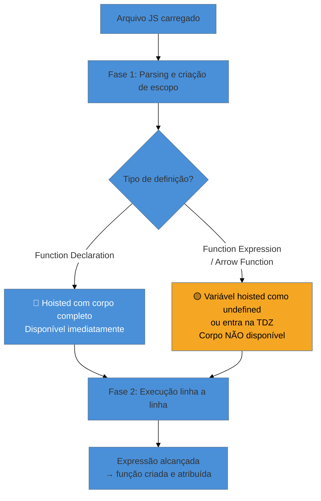
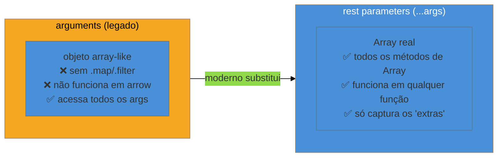

# Funções

> [!abstract] TL;DR
> Funções em JavaScript são **cidadãs de primeira classe**: podem ser atribuídas a variáveis, passadas como argumentos e retornadas como valores — exatamente como números ou strings. Existem três formas de defini-las (declaration, expression, arrow function), e cada uma tem comportamentos distintos em relação a **hoisting**, **`this`** e ao objeto **`arguments`**. Dominar esses detalhes é o que separa quem usa funções de quem as entende de verdade — e é tema certo em entrevistas.

---

Imagine que você está organizando uma cozinha. Ingredientes (dados) ficam em prateleiras. Mas você também precisa de **procedimentos** — picadas, frituras, temperos. O que você faz? Escreve receitas. Em JavaScript, funções são exatamente isso: blocos de código reutilizáveis que empacotam um procedimento para ser executado quando chamado.

Mas JS vai além: uma receita aqui pode ser guardada em uma gaveta (variável), entregue a outro cozinheiro como instrução (passada como argumento) ou devolvida como resultado de outra receita (retornada como valor). Isso é o que "cidadão de primeira classe" significa na prática — e é o que torna JavaScript tão poderoso e expressivo.

---

## Três formas de criar uma função

JavaScript oferece três sintaxes principais para definir funções. À primeira vista parecem intercambiáveis. Não são.

### Function Declaration (declaração de função)

```js
function saudar(nome) {
  return `Olá, ${nome}!`;
}

console.log(saudar("Ana")); // "Olá, Ana!"
```

A declaração de função tem uma característica peculiar: ela é **hoisted** — o JavaScript a "eleva" para o topo do escopo antes de executar qualquer linha de código. Isso significa que você pode chamar `saudar()` antes de escrever a função no arquivo, e vai funcionar.

```js
// Isso funciona!
console.log(saudar("Bruno")); // "Olá, Bruno!"

function saudar(nome) {
  return `Olá, ${nome}!`;
}
```

Por quê? Durante a fase de parsing, antes de executar qualquer código, o mecanismo JavaScript varre o arquivo, encontra declarações de função, e as coloca na memória inteiras — com o corpo completo, não só o nome.

> [!question]- Por que só declarações de função são hoisted assim?
> Porque a especificação ECMAScript trata declarações de função como parte da fase de *binding* do escopo (também chamada de criação de ambiente léxico), que acontece antes da execução. Expressões de função e arrow functions, por outro lado, são **valores atribuídos a variáveis** — e variáveis com `let`/`const` ficam na TDZ até sua declaração; com `var`, a variável é hoisted mas como `undefined` (o valor ainda não foi atribuído). Ver [[04 - Variáveis e escopo]].

### Function Expression (expressão de função)

```js
const saudar = function(nome) {
  return `Olá, ${nome}!`;
};

console.log(saudar("Carla")); // "Olá, Carla!"
```

Aqui a função é um **valor** atribuído à variável `saudar`. Como é um valor, ela segue as regras normais de escopo: não há hoisting do corpo. Tentar chamar `saudar()` antes dessa linha lança um `ReferenceError` (com `const`/`let`) ou retorna `TypeError: saudar is not a function` (com `var`, já que `var saudar` é hoisted como `undefined`).

Function expressions podem ter nome (útil para depuração no stack trace):

```js
const calcular = function calcularTotal(a, b) {
  return a + b;
};
```

O nome só é visível dentro do corpo da função — serve para recursão e para aparecer em mensagens de erro.

### Arrow Function (função de seta)

Introduzida no ES6 (2015), a arrow function é a variante mais compacta:

```js
const saudar = (nome) => `Olá, ${nome}!`;

// Com um só parâmetro, o parêntese é opcional
const dobrar = n => n * 2;

// Com corpo em bloco (quando precisa de mais de uma linha)
const somar = (a, b) => {
  const resultado = a + b;
  return resultado;
};
```

[[Dicionário de JavaScript#arrow function\|Arrow functions]] têm **duas diferenças cruciais** em relação às outras formas — e ambas são tema frequente de entrevista:

1. **Não têm `this` próprio** — herdam o `this` do escopo léxico onde foram criadas.
2. **Não têm o objeto `arguments`** — mas podem usar rest parameters (veremos adiante).

Além disso, arrow functions **não podem ser usadas como construtoras** (chamar com `new` lança `TypeError`) e **não têm `prototype`**.

---

## Tabela comparativa: as três formas

| Característica | Declaration | Expression | Arrow Function |
|---|---|---|---|
| Hoisting completo | ✅ Sim | ❌ Não | ❌ Não |
| `this` próprio | ✅ Sim | ✅ Sim | ❌ Não (herda léxico) |
| Objeto `arguments` | ✅ Sim | ✅ Sim | ❌ Não |
| Pode usar `new` | ✅ Sim | ✅ Sim | ❌ Não |
| Pode ser generator | ✅ Sim | ✅ Sim | ❌ Não |
| Sintaxe concisa | ❌ Verbosa | ❌ Verbosa | ✅ Sim |

> [!info] A propriedade `name` — o nome da função no stack trace
> Toda função em JavaScript tem uma propriedade `name` (somente leitura) que aparece no stack trace quando algo dá errado. Funções anônimas aparecem como `(anonymous)` — inútil em produção.
>
> ```js
> // Arrow anônima: stack trace inútil
> const calcular = () => { throw new Error("ops"); };
> calcular(); // Error at (anonymous)
>
> // Expression nomeada: trace legível
> const calcular = function calcularTotal() { throw new Error("ops"); };
> calcular(); // Error at calcularTotal
> ```
>
> Motores modernos **inferem** o nome quando você atribui a função a uma variável: `const fn = () => {}` resulta em `fn.name === "fn"`. Mas o nome inferido desaparece quando a função é passada diretamente como argumento: `arr.map(() => {})` fica `(anonymous)`. Prefira sempre nomear callbacks passados diretamente.

---

## O diagrama do hoisting



---

## Parâmetros: três superpoderes modernos

### Parâmetros com valor default

Antes do ES6, verificar parâmetros ausentes era assim:

```js
// Jeito antigo — cheio de armadilhas
function saudar(nome) {
  nome = nome || "Visitante"; // e se nome for 0 ou false?
  return `Olá, ${nome}!`;
}
```

O ES6 trouxe default parameters, que são declarados diretamente na assinatura:

```js
function saudar(nome = "Visitante") {
  return `Olá, ${nome}!`;
}

saudar();          // "Olá, Visitante!"
saudar("Diana");   // "Olá, Diana!"
saudar(undefined); // "Olá, Visitante!" — undefined aciona o default
saudar(null);      // "Olá, null!"       — null não aciona o default
```

> [!warning] `null` não aciona o valor default
> Só `undefined` (ou ausência do argumento) aciona o default. Passar `null` explicitamente significa "eu sei que quero null aqui". Armadilha frequente quando você recebe dados de uma API que usa `null` para campos opcionais.

O default pode ser qualquer expressão — inclusive chamar outra função:

```js
function gerarId() { return Math.random().toString(36).slice(2); }

function criarUsuario(nome, id = gerarId()) {
  return { nome, id };
}
```

### Rest parameters (`...args`)

Quando você não sabe quantos argumentos virão, o [[Dicionário de JavaScript#rest parameter (parâmetro rest)\|rest parameter]] coleta todos os extras em um **array real**:

```js
function somar(...numeros) {
  return numeros.reduce((acc, n) => acc + n, 0);
}

somar(1, 2, 3);       // 6
somar(10, 20, 30, 40); // 100
```

O rest parameter deve ser o **último** na lista de parâmetros:

```js
function logar(nivel, ...mensagens) {
  mensagens.forEach(msg => console.log(`[${nivel}] ${msg}`));
}

logar("INFO", "Servidor iniciado", "Porta 3000");
// [INFO] Servidor iniciado
// [INFO] Porta 3000
```

### Destructuring de parâmetros

Você pode desestruturar objetos e arrays diretamente na assinatura da função:

```js
// Sem destructuring — acessa propriedades manualmente
function exibirPerfil(usuario) {
  console.log(usuario.nome, usuario.idade);
}

// Com destructuring — mais claro, sem repetição
function exibirPerfil({ nome, idade = 0 }) {
  console.log(nome, idade);
}

exibirPerfil({ nome: "Eduardo", idade: 28 }); // "Eduardo 28"
exibirPerfil({ nome: "Fernanda" });            // "Fernanda 0"
```

Combinar destructuring com defaults é particularmente útil em funções de configuração:

```js
function criarConexao({ host = "localhost", porta = 5432, ssl = false } = {}) {
  return { host, porta, ssl };
}

criarConexao({ host: "db.prod.example.com", ssl: true });
// { host: "db.prod.example.com", porta: 5432, ssl: true }

criarConexao(); // usa todos os defaults
```

> [!info] O `= {}` no final é importante
> Sem ele, chamar `criarConexao()` sem nenhum argumento tentaria desestruturar `undefined` e lançaria um `TypeError`. Com `= {}`, o parâmetro usa um objeto vazio como padrão quando nada é passado.

---

## `arguments` vs rest parameters

Funções regulares (declaration e expression) têm acesso a um objeto especial chamado `arguments`:

```js
function somaTudo() {
  let total = 0;
  for (let i = 0; i < arguments.length; i++) {
    total += arguments[i];
  }
  return total;
}

somaTudo(1, 2, 3); // 6
```

O problema: `arguments` parece um array mas **não é um array**. Ele é um objeto array-like, sem os métodos de `Array.prototype` (`map`, `filter`, `reduce`, etc.).

```js
function problemático() {
  return arguments.map(x => x * 2); // TypeError: arguments.map is not a function
}
```

Antes do ES6, a solução era `Array.from(arguments)` ou `[].slice.call(arguments)`. Hoje, use **rest parameters**:

```js
function dobrarTodos(...valores) {
  return valores.map(x => x * 2); // valores é um Array real
}

dobrarTodos(1, 2, 3); // [2, 4, 6]
```



> [!warning] Arrow functions não têm `arguments`
> Em uma arrow function, `arguments` se refere ao `arguments` do escopo pai (se existir). Este comportamento surpreende quem vem de outras linguagens. Use rest parameters sempre — é a forma moderna e não tem essa surpresa.

---

## Valor de retorno

Toda função JavaScript retorna um valor. Se você não escreve `return`, a função retorna `undefined` implicitamente.

```js
function semRetorno() {
  const x = 42;
  // sem return
}

console.log(semRetorno()); // undefined
```

`return` encerra a execução da função imediatamente — código após ele não é executado:

```js
function classificar(nota) {
  if (nota >= 7) return "aprovado";
  return "reprovado";
  console.log("isso nunca executa"); // dead code
}
```

Arrow functions com corpo conciso (sem `{}`) têm **retorno implícito**:

```js
const dobrar = n => n * 2;   // retorna n * 2 implicitamente
const vazio  = n => {};       // retorna undefined — {} é bloco, não objeto!
const objeto = n => ({ x: n }); // parênteses forçam interpretação como objeto
```

> [!warning] `() => {}` retorna `undefined`, não um objeto vazio
> As chaves depois de `=>` são interpretadas como o início de um bloco de código, não como um objeto literal. Para retornar um objeto literal de forma concisa, envolva-o em parênteses: `() => ({ chave: valor })`. Erro silencioso e difícil de detectar.

---

## IIFE — Immediately Invoked Function Expression

Uma [[Dicionário de JavaScript#IIFE (Immediately Invoked Function Expression)\|IIFE]] é uma função que se define e se executa imediatamente:

```js
(function() {
  const segredo = "valor privado";
  console.log("executou agora!");
})();

// segredo não existe aqui fora — está encapsulado
console.log(typeof segredo); // "undefined"
```

A anatomia: `(function() { ... })()` — a função em parênteses (para ser parseada como expressão, não declaração) seguida de `()` para invocação imediata.

**Por que usar?** Para criar um escopo privado imediatamente — antes do ES6, era o padrão para não "vazar" variáveis no escopo global. Hoje, módulos ESM e `let`/`const` resolvem isso com mais elegância, mas IIFEs ainda aparecem em código legado e em alguns casos de inicialização.

```js
// IIFE moderna com arrow function
const resultado = (() => {
  const base = 10;
  return base * 2;
})();

console.log(resultado); // 20
```

> [!example] IIFE no mundo real
> Antes dos módulos JS, bibliotecas como jQuery e Underscore eram inteiramente embrulhadas em IIFEs para não poluir o escopo global com variáveis internas. O padrão `(function(global) { ... })(window)` passava o objeto global explicitamente, tornando o código independente do ambiente.

---

## Funções de primeira classe e higher-order functions

"[[Dicionário de JavaScript#first-class function (função de primeira classe)\|Primeira classe]]" (first-class) significa que funções são **valores** — podem ir para qualquer lugar que um valor pode ir.

```js
// 1. Atribuída a uma variável
const saudar = function(nome) { return `Olá, ${nome}!`; };

// 2. Armazenada em uma estrutura de dados
const acoes = {
  saudar: saudar,
  despedir: (nome) => `Até logo, ${nome}!`,
};

// 3. Passada como argumento
["Ana", "Bruno"].forEach(nome => console.log(saudar(nome)));

// 4. Retornada de outra função
function criarSaudacao(prefixo) {
  return (nome) => `${prefixo}, ${nome}!`;
}

const cumprimentar = criarSaudacao("Bom dia");
cumprimentar("Carlos"); // "Bom dia, Carlos!"
```

Uma [[Dicionário de JavaScript#higher-order function (função de ordem superior)\|**higher-order function**]] é qualquer função que recebe outra função como argumento ou retorna uma função. Os exemplos mais conhecidos:

```js
const numeros = [1, 2, 3, 4, 5];

// map: transforma cada elemento
const dobrados = numeros.map(n => n * 2); // [2, 4, 6, 8, 10]

// filter: seleciona elementos
const pares = numeros.filter(n => n % 2 === 0); // [2, 4]

// reduce: acumula em um único valor
const soma = numeros.reduce((acc, n) => acc + n, 0); // 15
```

> [!question]- Qual a diferença entre função de primeira classe e higher-order function?
> São conceitos relacionados mas distintos: **primeira classe** é uma propriedade da linguagem (funções podem ser usadas como valores). **Higher-order** é uma propriedade de uma função específica (ela opera sobre outras funções). Em linguagens com funções de primeira classe, higher-order functions emergem naturalmente — JS é um exemplo.

Higher-order functions são a porta de entrada para closures (como `criarSaudacao` acima captura `prefixo`) — tema da [[10 - Closures]].

---

## Casos práticos

Higher-order functions aparecem em todo código JavaScript moderno. Três padrões são especialmente comuns no dia a dia:

**1. Pipeline de transformação**

Você pode compor funções em sequência para transformar dados passo a passo — o mesmo princípio de `map().filter().reduce()`:

```js
const pipeline = (...fns) => (x) => fns.reduce((v, f) => f(v), x);

const processarSlug = pipeline(
  s => s.trim(),
  s => s.toLowerCase(),
  s => s.replace(/\s+/g, '-')
);

processarSlug("  Olá Mundo  "); // "olá-mundo"
```

**2. Fábricas de validadores**

Ao invés de repetir lógica de validação, você cria uma função que retorna uma função de validação especializada:

```js
const criarValidador = (min, max) => (valor) => {
  if (valor < min) return `Mínimo é ${min}`;
  if (valor > max) return `Máximo é ${max}`;
  return null; // sem erro
};

const validarIdade = criarValidador(0, 120);
const validarPercentual = criarValidador(0, 100);

validarIdade(25);      // null (válido)
validarIdade(200);     // "Máximo é 120"
validarPercentual(75); // null
```

**3. Event handlers com referência nomeada**

Arrow functions anônimas passadas para `addEventListener` não podem ser removidas depois — a referência se perde:

```js
// Armadilha: cria uma nova função a cada vez; removeEventListener não funciona
button.addEventListener('click', () => contadorCliques++);
button.removeEventListener('click', () => contadorCliques++); // ❌ não remove!

// Correto: salvar a referência
const aoClicar = () => contadorCliques++;
button.addEventListener('click', aoClicar);
button.removeEventListener('click', aoClicar); // ✅ funciona
```

> [!tip] Regra de produção
> Se você precisa remover um listener depois, sempre armazene a referência da função em uma variável. Callbacks anônimos inline são convenientes para listeners permanentes — problemáticos para listeners temporários.

---

## Como explicar em inglês

In JavaScript, functions are **first-class citizens** — they can be assigned to variables, passed as arguments, and returned from other functions. There are three ways to define them: **function declarations** (hoisted, have their own `this`), **function expressions** (not hoisted, assigned as values), and **arrow functions** (not hoisted, no own `this`, no `arguments` object). For variadic functions, modern JS uses **rest parameters** (`...args`) instead of the legacy `arguments` object — rest gives you a real Array with all methods available.

| PT | EN |
|----|-----|
| cidadão de primeira classe | first-class citizen |
| função de ordem superior | higher-order function |
| declaração de função | function declaration |
| expressão de função | function expression |
| função de seta | arrow function |
| parâmetros rest | rest parameters |
| parâmetros com default | default parameters |
| desestruturação de parâmetros | parameter destructuring |
| função imediatamente invocada | immediately invoked function expression (IIFE) |
| valor de retorno | return value |
| hoisting | hoisting (sem tradução consagrada) |

---

## Armadilhas comuns

> [!warning] Chamar uma function expression antes da declaração
> **O que acontece:** `TypeError: saudar is not a function` (com `var`) ou `ReferenceError` (com `let`/`const`).
> **Por quê:** Function expressions não são hoisted com o corpo. Com `var`, a variável existe mas vale `undefined`; com `let`/`const`, está na TDZ.
> **Como evitar:** Sempre declare function expressions antes de chamá-las, ou use function declarations quando precisar de hoisting.

> [!warning] Arrow function que deveria retornar objeto literal
> **O que acontece:** `const fn = () => { x: 1 }` retorna `undefined` silenciosamente.
> **Por quê:** As chaves são interpretadas como bloco de código, não objeto literal; `x: 1` é uma instrução com label `x`, não uma propriedade.
> **Como evitar:** Envolva o objeto em parênteses: `const fn = () => ({ x: 1 })`.

> [!warning] Usar `arguments` em arrow function
> **O que acontece:** `arguments` não se refere aos argumentos da arrow — captura o `arguments` do escopo pai (se existir) ou lança `ReferenceError`.
> **Por quê:** Arrow functions não têm binding próprio para `arguments`, assim como não têm para `this`.
> **Como evitar:** Use rest parameters (`...args`) em qualquer função onde precise capturar argumentos variádicos.

> [!warning] Passar `null` esperando acionar o valor default
> **O que acontece:** `function fn(x = 10) {}` chamada com `fn(null)` recebe `x === null`, não `x === 10`.
> **Por quê:** Apenas `undefined` (ou ausência do argumento) aciona o default. `null` é um valor explícito válido.
> **Como evitar:** Se `null` deve ser tratado como "sem valor", adicione verificação explícita: `const valor = x ?? 10`.

> [!warning] Confundir rest parameter com spread operator
> **O que acontece:** A sintaxe `...` serve dois propósitos opostos que confundem iniciantes.
> **Por quê:** `function fn(...args)` — rest (coleta múltiplos valores em um array); `fn(...array)` — spread (expande um array em múltiplos argumentos).
> **Como evitar:** Regra mnemônica: rest está na **definição** da função (recolhe), spread está na **chamada** (espalha).

---

## Funções em uma frase

> Funções em JavaScript são valores que encapsulam comportamento, podendo ser passadas, retornadas e atribuídas como qualquer outro dado — e as três formas de criá-las diferem em hoisting, `this` e acesso ao objeto `arguments`.

---

## O que vem a seguir

Entender funções abre duas portas imediatamente. A primeira é o `this` — um mecanismo que funções regulares e arrow functions tratam de formas completamente diferentes, e que é fonte de bugs históricos no JavaScript. A segunda são as closures, que surgem naturalmente quando uma função "lembra" o escopo onde foi criada.

- [[06 - this]] — as quatro regras de binding do `this` e por que arrow functions não têm o seu próprio
- [[10 - Closures]] — quando uma função captura variáveis do escopo exterior e o que isso significa para estado e encapsulamento
- [[Dicionário de JavaScript]] — glossário de termos da linguagem: closure, escopo léxico, hoisting, this e mais

---

## Referências

- **MDN Web Docs** — [*Functions — JavaScript*](https://developer.mozilla.org/en-US/docs/Web/JavaScript/Guide/Functions) — documentação de referência canônica: declarações, expressões, parâmetros, closures
- **MDN Web Docs** — [*Arrow function expressions*](https://developer.mozilla.org/en-US/docs/Web/JavaScript/Reference/Functions/Arrow_functions) — especificação completa de arrow functions: semântica de `this`, `arguments`, `new`, generators
- **MDN Web Docs** — [*Rest parameters*](https://developer.mozilla.org/en-US/docs/Web/JavaScript/Reference/Functions/rest_parameters) — diferenças entre rest e `arguments`, combinação com destructuring
- **MDN Web Docs** — [*IIFE*](https://developer.mozilla.org/en-US/docs/Glossary/IIFE) — definição e padrões de uso de funções imediatamente invocadas
- **James Sinclair** — [*What's the difference between ordinary functions and arrow functions in JavaScript?*](https://jrsinclair.com/articles/2025/whats-the-difference-between-named-functions-and-arrow-functions/) (2025) — análise aprofundada das diferenças práticas e de semântica
- **Axel Rauschmayer** — [*Exploring ES6 — Parameter handling*](https://exploringjs.com/es6/ch_parameter-handling.html) — cobertura completa de default params, rest e destructuring de parâmetros no ES6
- **GeeksforGeeks** — [*Difference between First-Class and Higher-Order Functions*](https://www.geeksforgeeks.org/javascript/difference-between-first-class-and-higher-order-functions-in-javascript/) — distinção conceitual clara para entrevistas
- **MDN Web Docs** — [*Function: name*](https://developer.mozilla.org/en-US/docs/Web/JavaScript/Reference/Global_Objects/Function/name) — comportamento da propriedade `name`, inferência em arrow functions e function expressions, impacto em stack traces
