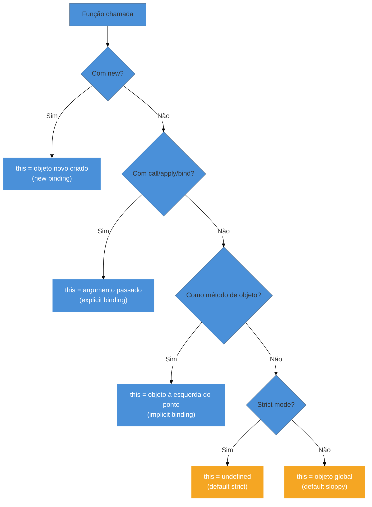

# `this` em JavaScript

> [!abstract] TL;DR
> `this` é uma referência ao **contexto de execução** de uma função — e o seu valor é determinado por **como** a função é chamada, não por onde ela foi definida.
> Existem quatro regras de binding em ordem de precedência: `new` > explícito (`call`/`apply`/`bind`) > implícito (método) > default (global ou `undefined` em strict mode).
> Arrow functions não têm `this` próprio: elas herdam o `this` do escopo léxico onde foram criadas.
> A maior fonte de bugs é "perda de `this`": passar um método como callback faz com que ele perca o vínculo com o objeto original.

---

Imagine que você está num restaurante. O garçom trabalha no restaurante inteiro — ele é o mesmo "objeto" independente de onde estiver — mas o **contexto** do que ele faz muda: quando está no salão, "o cliente" significa quem está sentado à mesa; quando está na cozinha, "o cliente" é o chef que pediu um prato. O garçom não mudou. O contexto de quem é "o cliente" mudou.

`this` em JavaScript funciona assim. A palavra `this` dentro de uma função é sempre uma referência ao **contexto de execução atual**, e esse contexto muda dependendo de **como** a função foi chamada.

Essa distinção — "como chamada" vs. "onde definida" — é a raiz de boa parte dos erros mais clássicos em entrevistas e em produção.

---

## O problema central: `this` não é quem você pensa

```js
const pessoa = {
  nome: "Alice",
  saudar: function () {
    console.log("Olá, eu sou " + this.nome);
  },
};

pessoa.saudar(); // "Olá, eu sou Alice"

const fn = pessoa.saudar;
fn(); // "Olá, eu sou undefined"  ← por quê?
```

`pessoa.saudar` e `fn` apontam para a mesma função. Mas o resultado é diferente porque o contexto de chamada mudou. Na segunda linha, `fn()` é uma chamada direta — sem objeto na frente — e por isso `this` perdeu o vínculo com `pessoa`.

Para entender por que isso acontece, precisamos conhecer as quatro regras de binding.

---

## As quatro regras de binding

### Regra 1 — Default binding (binding padrão)

Quando uma função é chamada de forma simples, sem nenhum objeto à esquerda do ponto, sem `new`, sem `call`/`apply`/`bind`, aplica-se o binding padrão:

- **Fora de strict mode:** `this` aponta para o objeto global (`window` no browser, `globalThis` no Node).
- **Em strict mode (`"use strict"`):** `this` é `undefined`.

```js
function quemSouEu() {
  console.log(this);
}

quemSouEu(); // window (browser) ou globalThis (Node) — fora de strict mode

"use strict";
function quemSouEuStrict() {
  console.log(this);
}

quemSouEuStrict(); // undefined
```

> [!info] Por que [[03-Dominios/Tecnologia/JavaScript/Dicionário de JavaScript#strict mode (modo estrito)\|strict mode]] muda isso?
> Em JavaScript pré-strict, o motor "embrulhava" `this` no objeto global quando nenhum contexto era fornecido. O strict mode aboliu esse embrulho automático porque ele causava bugs silenciosos: ao invés de um erro claro, o código mutava variáveis globais sem querer.

> [!question]- O que acontece quando você passa `null` ou `undefined` para `call` ou `apply`?
> É uma armadilha sutil do binding explícito. Em **sloppy mode**, o motor ignora o argumento e cai no default binding — `this` vira o objeto global. Em **strict mode**, `this` é literalmente `null` ou `undefined`, sem embrulho.
>
> ```js
> function quem() { return this; }
>
> quem.call(null);      // window (sloppy) ou null (strict)
> quem.call(undefined); // window (sloppy) ou undefined (strict)
> ```
>
> Você vai ver esse padrão em código como `Math.max.apply(null, arr)`: o `null` é passado como placeholder proposital, porque `Math.max` não usa `this` de jeito nenhum. Para essas situações, a recomendação moderna é usar spread: `Math.max(...arr)`.

---

### Regra 2 — Implicit binding (binding implícito / método)

Quando a função é chamada como **método de um objeto** — ou seja, com um objeto à esquerda do ponto — `this` aponta para **aquele objeto**.

```js
const gato = {
  nome: "Whiskers",
  miar: function () {
    console.log(this.nome + ": miau!");
  },
};

gato.miar(); // "Whiskers: miau!"
// this = gato, porque gato está à esquerda do ponto
```

A regra é simples: **olhe para o objeto imediatamente à esquerda do ponto** no momento da chamada.

```js
const cachorro = { nome: "Rex" };
cachorro.miar = gato.miar; // mesmo método, objeto diferente

cachorro.miar(); // "Rex: miau!"
// this = cachorro agora
```

O método viajou de um objeto para outro — e `this` viajou junto, porque o que importa é quem está à esquerda do ponto **no momento da chamada**.

---

### Regra 3 — Explicit binding (call, apply, bind)

Às vezes você quer chamar uma função com um contexto específico, independente de como ela seria chamada normalmente. Para isso existem três métodos nativos de Function:

#### `call(thisArg, arg1, arg2, ...)`

Chama a função imediatamente, com `this` = `thisArg`. Argumentos passados individualmente.

```js
function apresentar(profissao) {
  console.log(`${this.nome} é ${profissao}`);
}

const joao = { nome: "João" };
apresentar.call(joao, "desenvolvedor"); // "João é desenvolvedor"
```

#### `apply(thisArg, [args])`

Igual ao `call`, mas argumentos passados como array. Útil quando você já tem os argumentos numa lista.

```js
apresentar.apply(joao, ["designer"]); // "João é designer"
```

#### `bind(thisArg, ...args)` — cria uma função nova

`bind` não chama a função imediatamente. Ele retorna uma **nova função** com `this` permanentemente fixado. Argumentos pré-fixados são opcionais (currying parcial).

```js
const apresentarJoao = apresentar.bind(joao);
apresentarJoao("gerente"); // "João é gerente"
// this sempre será joao, não importa como apresentarJoao for chamada
```

> [!question]- Quando usar `call` vs `apply` vs `bind`?
> - **`call`**: quando você sabe os argumentos na hora e quer chamar agora.
> - **`apply`**: quando os argumentos já estão num array (ex: `Math.max.apply(null, [1,2,3])`).
> - **`bind`**: quando você vai passar o método como callback e quer garantir o `this` correto — ou quando quer criar uma versão especializada de uma função.

---

### Regra 4 — `new` binding

Quando você chama uma função com `new`, o JavaScript executa quatro passos internamente:

1. Cria um objeto vazio `{}`.
2. Define o protótipo desse objeto.
3. Executa a função com `this` apontando para esse objeto novo.
4. Retorna o objeto (a menos que a função retorne explicitamente outro objeto).

```js
function Carro(modelo) {
  this.modelo = modelo; // this = o objeto recém-criado
  this.ligar = function () {
    console.log(this.modelo + " ligado.");
  };
}

const fusca = new Carro("Fusca");
fusca.ligar(); // "Fusca ligado."
```

`new` tem a maior precedência de todas as regras: mesmo que você tente usar `call`/`apply`/`bind` junto com `new`, o `new` vence.

> [!question]- Mas `bind` não fixa o `this` permanentemente? Como `new` consegue sobrepor?
> Boa pergunta — essa é a ressalva que a MDN chama de *bound functions used as constructors*.
> Quando você usa `bind` para criar uma *hardbound function* e depois a chama com `new`, a spec ECMAScript define que construtores invocados com `new` **sempre** recebem um objeto recém-alocado como `this`, ignorando qualquer bind anterior.
>
> ```js
> function Carro(modelo) { this.modelo = modelo; }
>
> const CarroFixo = Carro.bind({ marca: "Toyota" }); // bind "fixa" o this
> const c = new CarroFixo("Corolla");
>
> console.log(c.modelo); // "Corolla"  ← new criou um objeto novo
> console.log(c.marca);  // undefined  ← { marca: "Toyota" } foi ignorado
> ```
>
> Na prática, criar uma classe com `bind` e depois usar `new` é um padrão incomum — mas entender por que `new` vence explica a precedência da tabela acima de forma sólida.

---

## Tabela de precedência

```
                      ┌─────────────────────────────────────────────┐
                      │       ORDEM DE PRECEDÊNCIA DO this          │
                      └─────────────────────────────────────────────┘

  MAIOR ──────────────────────────────────────────────────────► MENOR

  new binding   >  explicit binding  >  implicit binding  >  default
  (new Fn())       (call/apply/bind)    (obj.método())       (fn())
```

Quando você se perguntar "o que é `this` aqui?", percorra esta lista de cima para baixo e use a primeira regra que se aplicar.



---

## Arrow functions: `this` léxico

Arrow functions são a exceção a todas as quatro regras acima. Elas **não têm `this` próprio**. Quando você escreve `() => {}`, o motor não cria um binding de `this` para essa função — ele simplesmente captura o `this` do [[03-Dominios/Tecnologia/JavaScript/Dicionário de JavaScript#escopo léxico|escopo léxico]] onde a [[03-Dominios/Tecnologia/JavaScript/Dicionário de JavaScript#arrow function|arrow function]] foi **definida**.

```js
const obj = {
  nome: "Bob",
  saudar: function () {
    // Esta função tem seu próprio this (= obj, pelo binding implícito)

    const arrow = () => {
      // Esta arrow não tem this próprio.
      // Ela usa o this do escopo onde foi definida: a função saudar
      console.log(this.nome); // "Bob"
    };

    arrow();
  },
};

obj.saudar(); // "Bob"
```

Compare com uma função regular no mesmo lugar:

```js
const obj2 = {
  nome: "Carol",
  saudar: function () {
    function regular() {
      console.log(this.nome); // undefined (ou erro em strict mode)
    }
    regular(); // chamada sem objeto → default binding
  },
};

obj2.saudar(); // undefined
```

> [!info] Arrow functions e `call`/`apply`/`bind`
> Você **não pode mudar** o `this` de uma arrow function com `call`, `apply` ou `bind`. Esses métodos são ignorados para arrows — o `this` léxico permanece fixo.
> ```js
> const arrow = () => console.log(this);
> arrow.call({ x: 42 }); // ainda imprime o this léxico, ignora o argumento
> ```

> [!warning] `this` no nível de módulo ESM é sempre `undefined`
> Em módulos ESM (arquivos `.mjs` ou `<script type="module">`), o `this` no **topo do arquivo** é sempre `undefined` — não `window`, não `globalThis`. Isso surpreende quem migra código de `<script>` comum para módulo.
>
> ```js
> // script comum (sloppy mode)
> console.log(this); // window
>
> // módulo ESM (strict mode implícito)
> console.log(this); // undefined
> ```
>
> O motivo: módulos ESM executam em [strict mode](https://developer.mozilla.org/en-US/docs/Web/JavaScript/Reference/Strict_mode) por padrão — e no nível superior de um módulo não há objeto de chamada, então o default binding retorna `undefined`. Arrow functions no topo de um módulo capturam esse `undefined` léxico. Se você precisa do objeto global, use `globalThis` explicitamente.

---

## `this` em classes

Classes JavaScript são `"use strict"` por padrão — o corpo inteiro de uma classe executa em strict mode. Isso tem implicações diretas para `this`:

```js
class Contador {
  constructor() {
    this.valor = 0;
  }

  incrementar() {
    this.valor++;
    console.log(this.valor);
  }
}

const c = new Contador();
c.incrementar(); // 1 — this = c (implicit binding)

const inc = c.incrementar;
inc(); // TypeError: Cannot read properties of undefined (reading 'valor')
// this é undefined em strict mode!
```

A mesma perda de `this` do exemplo inicial — agora com um erro explícito porque classes são strict por padrão.

### Soluções para métodos de classe

**1. Bind no construtor** (padrão clássico React):

```js
class Contador {
  constructor() {
    this.valor = 0;
    this.incrementar = this.incrementar.bind(this); // fixa o this
  }

  incrementar() {
    this.valor++;
  }
}
```

**2. Class field com arrow function** (padrão moderno):

```js
class Contador {
  valor = 0;

  incrementar = () => {
    // Arrow: herda this léxico do construtor
    this.valor++;
  };
}

const c = new Contador();
const inc = c.incrementar;
inc(); // funciona! this ainda é c
```

---

## Casos práticos

### Cenário 1: handler de evento perdendo `this`

Um erro clássico ao usar `addEventListener` com métodos de objeto:

```js
class Botao {
  constructor(label) {
    this.label = label;
    this.elemento = document.createElement("button");

    // ❌ ERRADO: passa a referência da função sem o contexto
    this.elemento.addEventListener("click", this.handleClick);
  }

  handleClick() {
    // Quando o evento dispara, this = elemento do DOM (ou undefined em strict)
    console.log("Clicou em: " + this.label); // undefined!
  }
}
```

```js
class Botao {
  constructor(label) {
    this.label = label;
    this.elemento = document.createElement("button");

    // ✅ CORRETO: arrow function captura o this léxico (a instância)
    this.elemento.addEventListener("click", () => this.handleClick());

    // ✅ TAMBÉM CORRETO: bind explícito
    this.elemento.addEventListener("click", this.handleClick.bind(this));
  }

  handleClick() {
    console.log("Clicou em: " + this.label); // funciona!
  }
}
```

---

### Cenário 2: método passado como callback para array/timer

```js
const relogio = {
  hora: 0,
  tick: function () {
    console.log("Hora atual:", this.hora);
  },
};

// ❌ ERRADO: setInterval chama tick sem objeto na frente → default binding
setInterval(relogio.tick, 1000); // "Hora atual: undefined"

// ✅ CORRETO com arrow:
setInterval(() => relogio.tick(), 1000); // "Hora atual: 0"

// ✅ CORRETO com bind:
setInterval(relogio.tick.bind(relogio), 1000); // "Hora atual: 0"
```

O mesmo problema ocorre com `Array.prototype.forEach`, `map`, `filter` e qualquer função de alta ordem que receba um callback:

```js
const listagem = {
  prefixo: "item",
  itens: [1, 2, 3],
  imprimir: function () {
    // ❌ function regular: this dentro do forEach = undefined (strict) ou global
    this.itens.forEach(function (item) {
      console.log(this.prefixo + item); // TypeError ou "undefinedX"
    });

    // ✅ arrow: herda this do método imprimir (= o objeto listagem)
    this.itens.forEach((item) => {
      console.log(this.prefixo + item); // "item1", "item2", "item3"
    });
  },
};

listagem.imprimir();
```

---

### Cenário 3: desestruturação quebra o método

```js
const usuario = {
  nome: "Diana",
  cumprimentar() {
    return `Olá, ${this.nome}!`;
  },
};

// ❌ Desestruturar o método arranca a função do objeto
const { cumprimentar } = usuario;
cumprimentar(); // "Olá, undefined!" (ou TypeError em strict)

// ✅ Solução: chamar sempre com o objeto
usuario.cumprimentar(); // "Olá, Diana!"

// ✅ Ou: bind antes de desestruturar
const cumprimentar2 = usuario.cumprimentar.bind(usuario);
cumprimentar2(); // "Olá, Diana!"
```

---

## `this` em uma frase

`this` é um parâmetro implícito que toda função recebe no momento da chamada, e seu valor é determinado por quem chamou a função — não por quem a escreveu.

---

## Armadilhas comuns

> [!warning] Perda de `this` ao passar método como argumento
> **O que acontece:** `obj.metodo` passado como callback imprime `undefined` ou acessa o global.
> **Por quê:** Ao separar a função do objeto (`const fn = obj.metodo`), você perde o vínculo. A função existe, mas o contexto desapareceu.
> **Como evitar:** Use `() => obj.metodo()` (arrow wrapper) ou `obj.metodo.bind(obj)` para preservar o contexto.

> [!warning] Arrow function como método de objeto não funciona como esperado
> **O que acontece:** Você define `{ saudar: () => this.nome }` esperando que `this` seja o objeto — mas não é.
> **Por quê:** Arrow captura o `this` léxico do escopo onde foi **criada**. Se o objeto foi criado no escopo global, `this` dentro da arrow é `window`/`undefined`, não o objeto.
> **Como evitar:** Métodos de objeto devem ser funções normais (`function`) ou métodos de classe. Reserve arrow functions para callbacks dentro desses métodos.

> [!warning] `this` em setTimeout e setInterval é o global
> **O que acontece:** Código dentro de `setTimeout(function() { this.x }, ms)` acessa `this` global.
> **Por quê:** `setTimeout` chama o callback como função standalone — default binding.
> **Como evitar:** Use arrow function: `setTimeout(() => { this.x }, ms)` captura o `this` léxico correto.

> [!warning] Classes são strict por padrão — erros aparecem mais cedo
> **O que acontece:** Método de classe chamado sem objeto lança `TypeError` em vez de acessar silenciosamente o global.
> **Por quê:** O corpo de uma classe executa em strict mode automaticamente, onde `this` sem binding é `undefined`.
> **Como evitar:** Sempre chame métodos via instância, ou use `bind` / arrow fields no construtor.

---

## Como explicar em inglês

`this` refers to the execution context of a function — it's determined by **how** the function is called, not where it was defined. There are four binding rules in order of precedence: `new`, explicit (call/apply/bind), implicit (method call), and default (standalone call). Arrow functions don't have their own `this`; they inherit it lexically from the surrounding scope.

| PT | EN |
|----|----|
| `this` | `this` / execution context |
| binding de `this` | `this` binding |
| binding padrão | default binding |
| binding implícito | implicit binding |
| binding explícito | explicit binding |
| binding por `new` | new binding |
| perda de `this` | losing `this` / `this` detachment |
| escopo léxico | lexical scope |
| função flecha | arrow function |
| modo estrito | strict mode |
| vincular | bind |

---

## O que vem a seguir

Agora que você entende como `this` se comporta, o próximo território natural é entender **[[03-Dominios/Tecnologia/JavaScript/Dicionário de JavaScript#closure|closures]]**: funções que capturam variáveis do escopo onde foram criadas. A relação entre `this` léxico das arrows e closures é mais próxima do que parece — as duas exploram o conceito de [[03-Dominios/Tecnologia/JavaScript/Dicionário de JavaScript#escopo léxico|escopo léxico]].

- [[03-Dominios/Tecnologia/JavaScript/05 - Funções|05 - Funções]] — tudo sobre como funções funcionam por dentro: declaração, expressão, first-class functions e mais
- [[03-Dominios/Tecnologia/JavaScript/10 - Closures|10 - Closures]] — o mecanismo de captura léxica que se relaciona diretamente com o `this` das arrow functions
- [[03-Dominios/Tecnologia/JavaScript/Dicionário de JavaScript|Dicionário de JavaScript]] — verbetes de `this`, binding e contexto de execução

---

## Referências

- **MDN Web Docs** — [*`this` — JavaScript*](https://developer.mozilla.org/en-US/docs/Web/JavaScript/Reference/Operators/this) — documentação de referência oficial, cobre todos os contextos de `this`
- **MDN Web Docs** — [*Arrow function expressions*](https://developer.mozilla.org/en-US/docs/Web/JavaScript/Reference/Functions/Arrow_functions) — comportamento léxico de `this` em arrows
- **MDN Web Docs** — [*Function.prototype.bind()*](https://developer.mozilla.org/en-US/docs/Web/JavaScript/Reference/Global_Objects/Function/bind) — semântica e casos de uso do `bind`
- **MDN Web Docs** — [*Classes*](https://developer.mozilla.org/en-US/docs/Web/JavaScript/Reference/Classes) — strict mode implícito em classes e impacto no `this`
- **Fireship** — [*Understanding the this keyword, call, apply, and bind in JavaScript*](https://fireship.io/this-keyword-call-apply-bind-javascript) — explicação visual das 4 regras de binding
- **FreeCodeCamp** — [*The JavaScript `this` Keyword + 5 Key Binding Rules*](https://www.freecodecamp.org/news/javascript-this-keyword-binding-rules/) — guia completo de binding com exemplos para iniciantes
- **DigitalOcean** — [*Understanding This, Bind, Call, and Apply in JavaScript*](https://www.digitalocean.com/community/conceptual-articles/understanding-this-bind-call-and-apply-in-javascript) — visão prática de `call`, `apply` e `bind`
- **MDN Web Docs** — [*Function.prototype.call() — thisArg*](https://developer.mozilla.org/en-US/docs/Web/JavaScript/Reference/Global_Objects/Function/call) — comportamento de `null`/`undefined` como `thisArg` em sloppy vs strict mode
- **MDN Web Docs** — [*Bound functions used as constructors*](https://developer.mozilla.org/en-US/docs/Web/JavaScript/Reference/Global_Objects/Function/bind#bound_functions_used_as_constructors) — como `new` sobrepõe o `this` fixado por `bind`
- **MDN Web Docs** — [*`this` in modules*](https://developer.mozilla.org/en-US/docs/Web/JavaScript/Reference/Operators/this#this_in_modules) — por que `this` é `undefined` no topo de um módulo ESM
