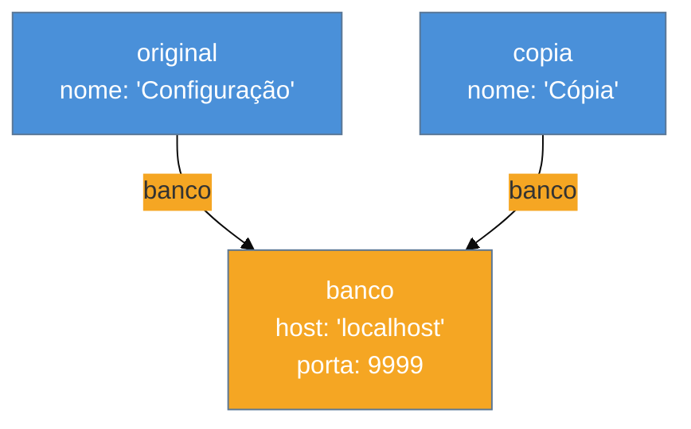

# Objetos

> [!abstract] TL;DR
> Objetos são a estrutura de dados central do JavaScript — pares chave/valor onde os valores podem ser qualquer coisa, inclusive funções. Você os cria com literal `{}`, `new`, ou `Object.create`. Cada propriedade tem um **descriptor** que controla se pode ser escrita, iterada ou deletada. Spread `...` e destructuring deixam o código mais limpo, mas a cópia gerada é **rasa**: objetos aninhados ainda apontam para a mesma referência. Congelar com `Object.freeze` protege só a camada de cima.

---

Imagine que você tem um dicionário de papel. Cada entrada tem um nome (chave) e uma definição (valor). Agora pense que o dicionário pode guardar não só texto, mas também listas, outros dicionários inteiros, e até instruções de ação. Isso é um objeto JavaScript.

Se arrays organizam dados em **posição** (índice 0, 1, 2…), objetos organizam por **nome**. São o mapa, não a fila.

---

## Criando objetos

Há três formas principais de criar um objeto — cada uma com uso diferente.

### 1. Literal `{}`

A mais comum. Você descreve o objeto diretamente:

```js
const livro = {
  titulo: "O Senhor dos Anéis",
  autor: "Tolkien",
  ano: 1954,
  resumir() {
    return `${this.titulo} (${this.ano})`;
  }
};
```

O método `resumir()` usa a sintaxe **shorthand** — equivale a `resumir: function() {...}`, mas mais curta. A palavra `this` dentro do método se refere ao próprio objeto.

### 2. Operador `new` com função construtora

Antes das classes ES6, a convenção era usar funções construtoras com `new`:

```js
function Livro(titulo, autor, ano) {
  this.titulo = titulo;
  this.autor = autor;
  this.ano = ano;
}

const hobbit = new Livro("O Hobbit", "Tolkien", 1937);
```

Quando você chama `new`, o JavaScript: (1) cria um objeto vazio, (2) aponta o protótipo, (3) executa a função com `this` sendo esse objeto novo, (4) retorna o objeto.

### 3. `Object.create(proto)`

Cria um objeto com um protótipo específico. Útil para herança manual sem `class`:

```js
const base = {
  tipo: "livro",
  catalogar() {
    return `[${this.tipo}] ${this.titulo}`;
  }
};

const romance = Object.create(base);
romance.titulo = "Dom Casmurro";
romance.catalogar(); // "[livro] Dom Casmurro"
```

`romance` herda `catalogar` de `base`. Esse mecanismo é o coração do sistema de **protótipos** — vamos aprofundar em `[[11 - Prototypes e herança]]`.

---

## Acessando propriedades: dot vs. bracket

Duas sintaxes, mesma função, regras diferentes:

```js
const config = {
  "timeout-ms": 5000,
  host: "localhost"
};

config.host;          // "localhost" — dot: nome válido como identificador
config["timeout-ms"]; // 5000       — bracket: qualquer string, inclusive com hífen
```

**Dot notation** funciona quando a chave é um identificador JavaScript válido (sem espaços, hífens, começa com letra ou `_`).

**Bracket notation** aceita qualquer string — inclusive chaves com caracteres especiais ou nomes em variáveis:

```js
const campo = "host";
config[campo]; // "localhost" — chave dinâmica!
```

### Computed keys (chaves computadas)

Você também pode usar expressões como chave no literal:

```js
const prefixo = "btn";

const estilo = {
  [`${prefixo}-color`]: "blue",   // "btn-color"
  [`${prefixo}-size`]: "16px"     // "btn-size"
};
```

Útil quando os nomes das propriedades vêm de variáveis ou são gerados dinamicamente.

---

## Property Descriptors — o que está por baixo

Toda propriedade de um objeto tem mais do que apenas um valor. Ela carrega um **descriptor** invisível com três flags:

| Flag | Padrão | Significado |
|---|---|---|
| `writable` | `true` | Pode alterar o valor? |
| `enumerable` | `true` | Aparece em `for...in` e `Object.keys`? |
| `configurable` | `true` | Pode deletar ou redefinir o descriptor? |

Para ler o descriptor de uma propriedade:

```js
const obj = { nome: "João" };

Object.getOwnPropertyDescriptor(obj, "nome");
// { value: "João", writable: true, enumerable: true, configurable: true }
```

> [!question]- Por que isso importa para mim, iniciante?
> Porque quando você congela um objeto, adiciona uma propriedade somente-leitura em uma biblioteca, ou usa `for...in` e recebe mais propriedades do que esperava — são esses flags que controlam o comportamento. Entender o descriptor explica o "porquê" desses comportamentos.

### `Object.defineProperty`

Para criar ou modificar uma propriedade com controle total:

```js
const usuario = {};

Object.defineProperty(usuario, "id", {
  value: 42,
  writable: false,      // somente leitura
  enumerable: false,    // não aparece em Object.keys
  configurable: false   // não pode ser deletada ou redefinida
});

usuario.id = 99; // silencioso no modo normal; erro no strict mode
console.log(usuario.id); // 42
Object.keys(usuario);    // [] — "id" não é enumerável
```

> [!warning] Modo silencioso vs. strict mode
> **O que acontece:** Tentar escrever em uma propriedade `writable: false` não lança erro por padrão — só ignora silenciosamente. **Por quê:** Herança do JavaScript antigo onde exceções eram raras. **Como evitar:** Use `"use strict"` ou módulos ES (que já são strict) para que violações de descriptor lancem `TypeError`.

### Dois tipos de descriptor: data vs. accessor

Existe uma regra que a maioria dos iniciantes não encontra nos tutoriais: um descriptor não pode ser **data** e **accessor** ao mesmo tempo.

- **[[Dicionário de JavaScript#data descriptor (descriptor de dado)\|Data descriptor]]** carrega `value` e `writable`.
- **[[Dicionário de JavaScript#accessor descriptor (descriptor acessor)\|Accessor descriptor]]** carrega `get` e/ou `set`.

Propriedades compartilhadas pelos dois tipos são `enumerable` e `configurable`. Mas misturar `value` (ou `writable`) com `get`/`set` no mesmo `Object.defineProperty` lança `TypeError` imediatamente — mesmo fora do strict mode:

```js
const obj = {};
Object.defineProperty(obj, "x", {
  value: 42,
  get() { return 0; } // TypeError: descriptor cannot be both data and accessor!
});
```

Isso explica um comportamento que confunde: getters e setters criados no literal `{}` usam automaticamente um accessor descriptor — sem `value` nem `writable`.

> [!info] Como verificar o tipo de um descriptor
> `Object.getOwnPropertyDescriptor(obj, "prop")` mostra o que existe: se o resultado tiver `value`/`writable`, é data; se tiver `get`/`set`, é accessor.

### `configurable: false` é (quase) permanente

Uma vez que você define `configurable: false`, não há como desfazer com `Object.defineProperty`. A única exceção permitida pela spec é mudar `writable` de `true` para `false` (uma transição unidirecional). Qualquer outra tentativa de redefinir o descriptor lança `TypeError`.

```js
const obj = {};
Object.defineProperty(obj, "id", { value: 1, configurable: false, writable: true });

// Ainda permitido: true → false
Object.defineProperty(obj, "id", { writable: false }); // ok

// Proibido: tentar mudar qualquer outra coisa
Object.defineProperty(obj, "id", { value: 2 }); // TypeError!
```

> [!warning] Armadilha de biblioteca
> Se uma biblioteca de terceiros usar `Object.defineProperty` com `configurable: false` em um objeto que você recebeu, você não pode reconfigurar nem deletar essa propriedade — mesmo que o objeto em si não esteja congelado.

---

## Getters e setters

Você pode definir propriedades que **parecem** valores mas na verdade **executam funções** quando acessadas ou atribuídas:

```js
const temperatura = {
  _celsius: 20,

  get fahrenheit() {
    return this._celsius * 9/5 + 32;
  },

  set fahrenheit(valor) {
    this._celsius = (valor - 32) * 5/9;
  }
};

temperatura.fahrenheit;       // 68 (getter chamado)
temperatura.fahrenheit = 32;  // setter chamado
console.log(temperatura._celsius); // 0
```

`fahrenheit` parece uma propriedade normal, mas por baixo há lógica de conversão. O getter executa ao ler; o setter executa ao escrever.

**Quando usar:** validação na atribuição, propriedades derivadas (calculadas a partir de outras), compatibilidade de API (expor `fullName` derivado de `firstName + lastName`).

```js
const pessoa = {
  primeiroNome: "Maria",
  sobrenome: "Silva",

  get nomeCompleto() {
    return `${this.primeiroNome} ${this.sobrenome}`;
  },

  set nomeCompleto(valor) {
    const partes = valor.split(" ");
    this.primeiroNome = partes[0];
    this.sobrenome = partes.slice(1).join(" ");
  }
};

pessoa.nomeCompleto = "Ana Costa";
console.log(pessoa.primeiroNome); // "Ana"
console.log(pessoa.sobrenome);    // "Costa"
```

---

## Spread `...` e rest em objetos

### Spread — expandir um objeto dentro de outro

```js
const padrao = { timeout: 3000, retries: 3, verbose: false };
const customizado = { retries: 5, endpoint: "/api" };

const config = { ...padrao, ...customizado };
// { timeout: 3000, retries: 5, verbose: false, endpoint: "/api" }
```

Ordem importa: propriedades mais à direita sobrescrevem as da esquerda. No exemplo, `retries` de `customizado` vence o `padrao`.

### Rest — coletar o restante

```js
const { timeout, ...resto } = config;
// timeout = 3000
// resto = { retries: 5, verbose: false, endpoint: "/api" }
```

`...resto` coleta tudo que não foi explicitamente extraído. Útil para separar propriedades conhecidas do "tudo o mais".

---

## Destructuring de objetos

Destructuring é uma sintaxe para extrair valores de objetos (ou arrays) em variáveis locais, com menos código:

### Básico

```js
const produto = { nome: "Notebook", preco: 3500, estoque: 12 };

const { nome, preco } = produto;
console.log(nome);  // "Notebook"
console.log(preco); // 3500
```

### Com rename (renomear variável)

```js
const { nome: nomeProduto, preco: valor } = produto;
console.log(nomeProduto); // "Notebook"
// "nome" e "preco" não existem como variáveis locais
```

### Com default (valor padrão)

```js
const { nome, desconto = 0 } = produto;
console.log(desconto); // 0 — produto não tem "desconto", usa o default
```

O default só entra quando a propriedade é `undefined`. Se for `null`, o default **não** é usado.

> [!warning] Default não cobre `null`
> **O que acontece:** `const { x = 10 } = { x: null }` resulta em `x === null`, não `10`. **Por quê:** O default só substitui `undefined`. `null` é um valor explícito e diferente. **Como evitar:** Use `valor ?? 10` após o destructuring quando precisar tratar `null` também.

### Nested (aninhado)

```js
const pedido = {
  id: 1,
  cliente: {
    nome: "Ana",
    cidade: "SP"
  }
};

const { cliente: { nome, cidade } } = pedido;
console.log(nome);   // "Ana"
console.log(cidade); // "SP"
// "cliente" não existe como variável local
```

### Em parâmetros de função

```js
function exibirProduto({ nome, preco = 0, estoque = 0 }) {
  return `${nome}: R$${preco} (${estoque} em estoque)`;
}

exibirProduto(produto);
```

---

## `Object.keys`, `values`, `entries`, `assign`, `freeze`

### Iterando sobre propriedades

```js
const fruta = { nome: "Maçã", cor: "vermelha", doce: true };

Object.keys(fruta);    // ["nome", "cor", "doce"]
Object.values(fruta);  // ["Maçã", "vermelha", true]
Object.entries(fruta); // [["nome","Maçã"], ["cor","vermelha"], ["doce",true]]
```

`Object.entries` é especialmente útil com `for...of` e `map`:

```js
Object.entries(fruta).forEach(([chave, valor]) => {
  console.log(`${chave}: ${valor}`);
});
```

> [!info] Só propriedades próprias e enumeráveis
> `Object.keys/values/entries` listam apenas propriedades **do próprio objeto** que sejam enumeráveis. Propriedades herdadas do protótipo não aparecem. Para incluir herdadas, use `for...in`.

### `Object.assign`

Copia propriedades de um ou mais objetos **fonte** para um objeto **destino**:

```js
const destino = { a: 1 };
const fonte = { b: 2, c: 3 };

Object.assign(destino, fonte);
// destino agora é { a: 1, b: 2, c: 3 }
```

Muito usado para merge de configurações antes do spread existir. O spread `{ ...a, ...b }` é geralmente preferido hoje por ser mais legível e por não mutar o primeiro argumento.

### `Object.freeze`

Congela um objeto: nenhuma propriedade pode ser adicionada, removida ou modificada:

```js
const CONFIG = Object.freeze({
  api: "https://api.exemplo.com",
  timeout: 5000
});

CONFIG.timeout = 9000; // silencioso (ou TypeError em strict mode)
console.log(CONFIG.timeout); // 5000 — não mudou
```

`Object.isFrozen(CONFIG)` retorna `true`.

### `Object.hasOwn` — substituto seguro de `hasOwnProperty` (ES2022)

Verificar se um objeto tem uma propriedade própria com `obj.hasOwnProperty(key)` parece inofensivo, mas tem dois pontos cegos silenciosos:

1. **Objetos sem protótipo** (criados com `Object.create(null)`) não herdam `hasOwnProperty`. Chamá-lo lança `TypeError`.
2. **Shadowing**: se alguém definiu `hasOwnProperty` como propriedade do próprio objeto, o método herdado fica encoberto — e a resposta retornada é errada.

Desde ES2022, [[Dicionário de JavaScript#Object.hasOwn|`Object.hasOwn(obj, key)`]] resolve os dois casos sem gambiarras:

```js
// Caso 1: objeto sem protótipo
const semProto = Object.create(null);
semProto.nome = "João";
// semProto.hasOwnProperty("nome"); // TypeError!
Object.hasOwn(semProto, "nome"); // true ✅

// Caso 2: hasOwnProperty encoberto
const armadilha = { hasOwnProperty: () => false, x: 1 };
armadilha.hasOwnProperty("x"); // false — errado!
Object.hasOwn(armadilha, "x"); // true ✅
```

ESLint inclui a regra `prefer-object-has-own` para migrar o código existente. Se precisar suportar ambientes pré-ES2022, o padrão seguro é `Object.prototype.hasOwnProperty.call(obj, key)`.

### `Object.groupBy` — agrupamento nativo (ES2024)

Agrupar objetos de um array por uma propriedade é um padrão recorrente. Antes do ES2024, isso exigia um `reduce` manual. Agora há `Object.groupBy`:

```js
const produtos = [
  { nome: "Notebook", categoria: "tech" },
  { nome: "Mouse",    categoria: "tech" },
  { nome: "Caderno",  categoria: "papelaria" }
];

const grupos = Object.groupBy(produtos, ({ categoria }) => categoria);
// {
//   tech:      [{ nome: "Notebook" }, { nome: "Mouse" }],
//   papelaria: [{ nome: "Caderno" }]
// }
```

O callback deve retornar uma string (ou symbol) que vira a chave do grupo. Se as chaves precisam ser de tipos arbitrários (objetos, números), use `Map.groupBy` — que devolve um `Map` em vez de um objeto puro.

> [!info] Suporte e disponibilidade
> `Object.groupBy` foi padronizado no ES2024 e está disponível em todos os browsers modernos e Node.js 21+. Verifique o suporte antes de usar em projetos que precisam de compatibilidade com ambientes mais antigos.

---

## Shallow copy — a pegadinha de referência aninhada

Toda cópia feita com spread ou `Object.assign` é **rasa** (shallow): copia os valores do primeiro nível, mas objetos aninhados continuam sendo o **mesmo** objeto em memória.

```js
const original = {
  nome: "Configuração",
  banco: { host: "localhost", porta: 5432 }
};

const copia = { ...original };

copia.nome = "Cópia"; // ok, só afeta "copia"
copia.banco.porta = 9999; // PERIGO: afeta também "original"!

console.log(original.banco.porta); // 9999 — vazou!
```

**Por quê?** `banco` é um objeto — o spread copia a *referência* para esse objeto, não o objeto em si. Tanto `original.banco` quanto `copia.banco` apontam para o mesmo endereço de memória.



Para uma cópia verdadeiramente independente, você precisa de **cópia profunda** — tema tratado em `[[20 - Cópia, serialização e imutabilidade]]`.

### `structuredClone` — cópia profunda nativa (desde 2022)

Antes de mergulhar nos detalhes da nota 20, vale saber que a solução nativa existe e tem nome: [[Dicionário de JavaScript#structuredClone|`structuredClone(obj)`]].

Ela percorre todos os níveis aninhados e cria cópias independentes de cada um — incluindo `Map`, `Set`, `Date` e referências circulares. Ao contrário de `JSON.parse(JSON.stringify(obj))`, não corrompe tipos: `Date` continua sendo `Date`, `undefined` não desaparece.

```js
const original = {
  nome: "Config",
  banco: { host: "localhost", porta: 5432 },
  criado: new Date("2026-01-01")
};

const copia = structuredClone(original);
copia.banco.porta = 9999;
copia.criado.setFullYear(2099);

console.log(original.banco.porta); // 5432 — intacto!
console.log(original.criado.getFullYear()); // 2026 — intacto!
```

**Limitação importante:** `structuredClone` lança `TypeError` se o objeto contiver funções. Para objetos com métodos, a nota 20 apresenta as alternativas completas.

> [!tip] `structuredClone` vs `JSON.parse(JSON.stringify())`
> O `JSON.stringify` é ~2-3x mais rápido para objetos simples, mas perde tipos: `Date` vira string, `undefined` e funções desaparecem, `NaN` vira `null`, e referências circulares travam. Use `structuredClone` como padrão; migre para JSON só se profiling mostrar que importa.

> [!warning] `Object.freeze` também é shallow
> **O que acontece:** `Object.freeze` congela só o primeiro nível. Objetos aninhados continuam mutáveis. **Por quê:** `freeze` marca cada propriedade como `writable: false`, mas não percorre recursivamente. **Como evitar:** Para congelar fundo, implemente um `deepFreeze` recursivo ou use uma biblioteca de imutabilidade.

---

## Casos práticos

### Cenário 1 — Merge de configuração com spread

Um padrão clássico: você tem uma configuração padrão e quer que o usuário possa sobrescrever partes sem perder os defaults.

```js
const defaultConfig = {
  timeout: 5000,
  retries: 3,
  log: false,
  headers: { "Content-Type": "application/json" }
};

function criarCliente(opcoes = {}) {
  const config = {
    ...defaultConfig,
    ...opcoes,
    // garante que headers sempre inclui Content-Type
    headers: {
      ...defaultConfig.headers,
      ...(opcoes.headers ?? {})
    }
  };

  return config;
}

const cliente = criarCliente({ timeout: 10000, headers: { Authorization: "Bearer xyz" } });
// {
//   timeout: 10000,      — sobrescrito pelo usuário
//   retries: 3,          — mantido do default
//   log: false,          — mantido do default
//   headers: {
//     "Content-Type": "application/json", — mantido
//     "Authorization": "Bearer xyz"       — adicionado
//   }
// }
```

Note que `headers` precisou de merge manual — caso contrário, o spread de `opcoes` teria substituído o objeto `headers` inteiro, perdendo o `Content-Type`.

### Cenário 2 — Congelar configuração de ambiente

Em aplicações Node.js ou front-end, é comum ter constantes de ambiente que nunca devem mudar em runtime. `Object.freeze` garante isso explicitamente:

```js
const ENV = Object.freeze({
  NODE_ENV: process.env.NODE_ENV ?? "development",
  API_URL: process.env.API_URL ?? "http://localhost:3000",
  FEATURE_FLAGS: Object.freeze({
    darkMode: true,
    betaUI: false
  })
});

// Em qualquer lugar do código:
ENV.API_URL = "https://hacker.com"; // falha silenciosamente (ou TypeError em strict)
// ENV.API_URL ainda é "http://localhost:3000"

// ATENÇÃO: sem o freeze interno:
// ENV.FEATURE_FLAGS.darkMode = false; // isso funcionaria!
```

Note o `Object.freeze` aninhado em `FEATURE_FLAGS` — necessário porque o freeze de `ENV` não penetra nos objetos internos.

---

## Armadilhas comuns

> [!warning] `this` se perde em arrow functions como método
> **O que acontece:** `const obj = { nome: "X", dizer: () => this.nome }` — `this` não é `obj`. **Por quê:** Arrow functions capturam o `this` do escopo onde foram **definidas**, não do objeto que as contém. No módulo, `this` é `undefined` (strict mode) ou o objeto global. **Como evitar:** Use funções regulares para métodos de objeto: `dizer() { return this.nome; }`.

> [!warning] Spread não copia métodos de protótipo
> **O que acontece:** `const copia = { ...instancia }` — métodos da classe (prototype) não aparecem em `copia`. **Por quê:** Spread copia só propriedades **próprias** e enumeráveis. Métodos de classe vivem no protótipo, não no objeto. **Como evitar:** Para clonar instâncias, use o construtor ou `Object.create` + `Object.assign`. Ou avalie se spread realmente é o que você quer.

> [!warning] Destructuring de `undefined` lança erro
> **O que acontece:** `const { nome } = obterUsuario()` — se a função retornar `undefined`, você leva um `TypeError: Cannot destructure property 'nome' of undefined`. **Por quê:** Você está tentando acessar uma propriedade de `undefined`. **Como evitar:** `const { nome } = obterUsuario() ?? {}` — o `?? {}` garante um objeto vazio como fallback.

> [!warning] `delete` em objeto congelado falha silenciosamente
> **O que acontece:** `delete CONFIG.timeout` retorna `false` sem lançar erro (em modo normal). **Por quê:** Propriedades de objetos congelados têm `configurable: false`. **Como evitar:** Use strict mode para que a tentativa lance `TypeError` imediatamente, em vez de falhar silenciosamente.

---

## Como explicar em inglês

**Para entrevistas:** "In JavaScript, objects are collections of key-value pairs. Every property has a descriptor that controls whether it's writable, enumerable, or configurable. Spread syntax creates shallow copies, meaning nested objects still share the same reference — a common source of bugs when you expect full isolation."

**Para daily standup:** "I used `Object.freeze` on the config object to prevent accidental mutations downstream, and restructured the merge logic with spread to handle nested header overrides properly."

| PT | EN |
|---|---|
| objeto | object |
| propriedade | property |
| descritor de propriedade | property descriptor |
| cópia rasa | shallow copy |
| cópia profunda | deep copy |
| congelar | freeze |
| desestruturação | destructuring |
| espalhamento | spread |
| captura do restante | rest |
| enumerável | enumerable |
| acessor (getter/setter) | accessor |

---

## Objetos em uma frase

> Um objeto JavaScript é um mapa de chave → valor cujas propriedades carregam metadados invisíveis (descriptors) que controlam mutabilidade, visibilidade e reconfiguração.

---

## O que vem a seguir

Objetos armazenam dados e comportamento — mas como um objeto herda comportamento de outro sem copiar código? Isso é a cadeia de protótipos, e é o próximo grande salto. E se você estiver usando TypeScript, verá que objetos ganham uma camada extra de expressividade com `interface` vs `type`.

- `[[11 - Prototypes e herança]]` — como o `[[Prototype]]` interno liga objetos em cadeia, e como `class` é açúcar sintático sobre esse mecanismo
- `[[Dicionário de JavaScript]]` — referência rápida de termos: descriptor, shallow copy, accessor, enumerable
- `[[03-Dominios/Tecnologia/TypeScript/06 - Objetos - interface vs type|TypeScript: Objetos — interface vs type]]` — como descrever a forma de objetos com tipagem estática, contraponto direto ao que vimos aqui

---

## Referências

- **MDN Web Docs** — [Object.defineProperty()](https://developer.mozilla.org/en-US/docs/Web/JavaScript/Reference/Global_Objects/Object/defineProperty) — especificação completa dos descriptors e flags, incluindo a restrição data vs. accessor
- **MDN Web Docs** — [Destructuring assignment](https://developer.mozilla.org/en-US/docs/Web/JavaScript/Reference/Operators/Destructuring) — sintaxe completa com defaults, renomear e nested
- **javascript.info** — [Property getters and setters](https://javascript.info/property-accessors) — tutorial aprofundado de accessors com exemplos práticos
- **FreeCodeCamp** — [JavaScript Object Destructuring, Spread Syntax, and the Rest Parameter](https://www.freecodecamp.org/news/javascript-object-destructuring-spread-operator-rest-parameter/) — guia prático com casos de uso reais
- **DigitalOcean** — [Copying Objects in JavaScript](https://www.digitalocean.com/community/tutorials/copying-objects-in-javascript) — explica shallow vs. deep copy com exemplos de referência aninhada
- **MDN Web Docs** — [Object.getOwnPropertyDescriptors()](https://developer.mozilla.org/en-US/docs/Web/JavaScript/Reference/Global_Objects/Object/getOwnPropertyDescriptors) — inspecionar todos os descriptors de uma vez
- **MDN Web Docs** — [Object.hasOwn()](https://developer.mozilla.org/en-US/docs/Web/JavaScript/Reference/Global_Objects/Object/hasOwn) — substituto seguro de `hasOwnProperty` (ES2022), inclui casos com `Object.create(null)` e shadowing
- **MDN Web Docs** — [Object.groupBy()](https://developer.mozilla.org/en-US/docs/Web/JavaScript/Reference/Global_Objects/Object/groupBy) — agrupamento nativo de iteráveis por categoria (ES2024)
- **web.dev** — [Deep-copying in JavaScript using structuredClone](https://web.dev/articles/structured-clone) — guia completo de `structuredClone` com comparação a `JSON.parse/stringify`, tipos suportados e limitações
