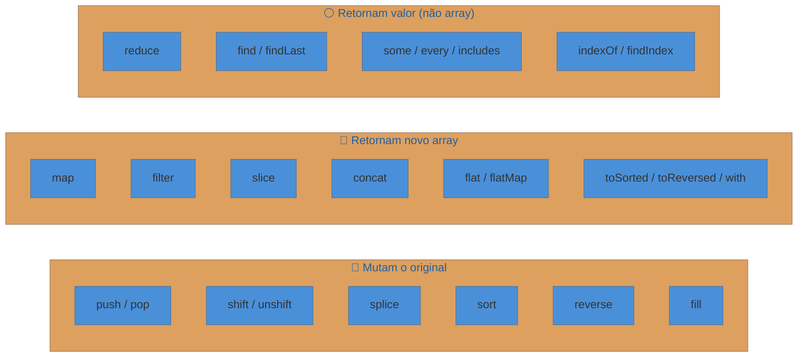

# Arrays e métodos

> [!abstract] TL;DR
> Arrays em JavaScript são **objetos** disfarçados de listas — isso explica muitas das suas pegadinhas. Eles têm dois tipos de métodos: os que **mutam** o original (`push`, `pop`, `sort`, `reverse`, `splice`) e os que retornam uma cópia nova (`map`, `filter`, `reduce`, `slice`, `toSorted`, `toReversed`). `reduce` é o canivete suíço: consegue implementar qualquer outro método de iteração. A armadilha mais clássica do setor: `sort` sem comparador ordena números **como string** — `[10, 2, 1]` vira `[1, 10, 2]`.

---

Você está construindo um filtro de produtos numa loja online. Do servidor chegam 500 produtos em JSON. Você precisa filtrar apenas os disponíveis, calcular o preço médio e ordenar do mais barato ao mais caro — tudo isso sem tocar nos dados originais, porque outro componente ainda vai precisar da lista completa.

Você poderia escrever três loops `for` com variáveis intermediárias. Ou poderia encadear `filter`, `map` e `reduce` em uma linha legível. Entender arrays em JavaScript é entender por que a segunda opção não é só mais bonita — é mais segura.

---

## Arrays são objetos (e isso importa)

Em JavaScript, um array não é uma estrutura de dados primitiva. É um **objeto especial** cujas chaves são índices numéricos começando em zero.

```js
const frutas = ["maçã", "banana", "laranja"];

console.log(typeof frutas);       // "object" — não "array"!
console.log(Array.isArray(frutas)); // true — use isso para verificar
console.log(frutas[0]);           // "maçã"
console.log(frutas.length);       // 3
```

Por que isso importa? Porque arrays herdam de `Object.prototype`. Isso significa que você pode fazer coisas estranhas como adicionar propriedades com chave de string a um array — e elas **não contam no `length`**:

```js
const lista = [1, 2, 3];
lista.descricao = "minha lista";

console.log(lista.length);      // 3 — não 4
console.log(lista.descricao);   // "minha lista"
```

Isso raramente é intencional. Se você precisa de propriedades nomeadas junto com uma lista, use um objeto. Arrays são para dados indexados.

---

## Criação e acesso

Há três formas comuns de criar arrays:

```js
// 1. Literal — a mais usada
const nums = [1, 2, 3];

// 2. Array.from — quando você tem algo "iterável" mas não é array
const letras = Array.from("abc");         // ["a", "b", "c"]
const range = Array.from({ length: 5 }, (_, i) => i + 1); // [1, 2, 3, 4, 5]

// 3. Spread — para combinar ou copiar
const copia = [...nums];                  // [1, 2, 3] — cópia rasa
const combinado = [...nums, 4, 5];       // [1, 2, 3, 4, 5]
```

`Array.from` é especialmente útil para converter **NodeLists** (resultado de `querySelectorAll`), **Sets**, **Maps** e qualquer outro iterável em array de verdade.

### Acesso e modificação direta

```js
const cores = ["vermelho", "verde", "azul"];

console.log(cores[0]);   // "vermelho"
console.log(cores.at(-1)); // "azul" — índice negativo conta do fim (ES2022)

cores[1] = "amarelo";
console.log(cores);      // ["vermelho", "amarelo", "azul"]
```

`at(-1)` é o substituto moderno de `arr[arr.length - 1]` — mais legível e menos propenso a erro.

---

## O mapa mental: métodos que mutam vs. métodos imutáveis

Aqui está a distinção que mais causa bugs em JavaScript:



| Categoria | Exemplos | O original muda? |
|-----------|----------|-----------------|
| **Mutação** | `push`, `pop`, `splice`, `sort`, `reverse` | Sim |
| **Imutável** | `map`, `filter`, `slice`, `concat`, `toSorted` | Não |
| **Agregação** | `reduce`, `find`, `some`, `every` | Não |

A regra prática: se você precisar do original depois, use os métodos imutáveis ou faça uma cópia antes de mutar.

---

## Métodos que mutam o original

### push e pop — adicionar e remover do fim

```js
const fila = ["primeiro", "segundo"];

fila.push("terceiro");  // retorna o novo length: 3
console.log(fila);      // ["primeiro", "segundo", "terceiro"]

const ultimo = fila.pop();  // retorna o elemento removido
console.log(ultimo);         // "terceiro"
console.log(fila);           // ["primeiro", "segundo"]
```

### shift e unshift — adicionar e remover do início

```js
const fila = ["b", "c"];
fila.unshift("a");   // adiciona no início → ["a", "b", "c"]
fila.shift();        // remove do início → "a", fila fica ["b", "c"]
```

> [!info] Performance
> `push`/`pop` são O(1) — operam no fim, sem mover nada. `shift`/`unshift` são O(n) — precisam re-indexar todos os elementos. Para filas de alto volume, prefira estruturas apropriadas ou manipule o índice manualmente.

### splice — cirurgia de array

`splice` é o método mais cirúrgico: remove, insere ou substitui elementos em qualquer posição.

```js
const letras = ["a", "b", "c", "d", "e"];

// splice(início, quantos remover, ...o que inserir)
const removidos = letras.splice(1, 2, "X", "Y");
console.log(removidos); // ["b", "c"] — o que foi removido
console.log(letras);    // ["a", "X", "Y", "d", "e"] — original mutado
```

### sort — o traidor silencioso

```js
const nums = [10, 2, 1, 21, 3];
nums.sort();
console.log(nums); // [1, 10, 2, 21, 3] — ERRADO!
```

Por que? Porque sem comparador, `sort` converte tudo para string e ordena **lexicograficamente**. "10" vem antes de "2" porque "1" < "2" na tabela Unicode.

```js
// Correto: passe um comparador numérico
nums.sort((a, b) => a - b);
console.log(nums); // [1, 2, 3, 10, 21] — crescente

nums.sort((a, b) => b - a);
console.log(nums); // [21, 10, 3, 2, 1] — decrescente
```

O comparador retorna:
- negativo → `a` vem antes de `b`
- positivo → `b` vem antes de `a`
- zero → mantém a ordem entre eles

### reverse — inverte no lugar

```js
const arr = [1, 2, 3];
arr.reverse();
console.log(arr); // [3, 2, 1] — original mutado
```

---

## Métodos imutáveis — os favoritos do código funcional

### map — transforma cada elemento

```js
const precos = [10, 20, 30];
const comDesconto = precos.map(p => p * 0.9);
console.log(precos);       // [10, 20, 30] — intacto
console.log(comDesconto);  // [9, 18, 27] — novo array
```

`map` recebe um callback com três argumentos: `(elemento, índice, arrayCompleto)`. O mais comum é usar só o primeiro.

### filter — mantém quem passa no teste

```js
const produtos = [
  { nome: "Tênis", disponivel: true },
  { nome: "Camisa", disponivel: false },
  { nome: "Boné", disponivel: true },
];

const disponiveis = produtos.filter(p => p.disponivel);
// [{ nome: "Tênis", ... }, { nome: "Boné", ... }]
```

### slice — recorta sem tocar no original

```js
const arr = [0, 1, 2, 3, 4];
const meio = arr.slice(1, 4); // [1, 2, 3] — não inclui índice 4
const fim   = arr.slice(-2);  // [3, 4] — últimos 2
console.log(arr); // [0, 1, 2, 3, 4] — intacto
```

### concat e spread — juntar arrays

```js
const a = [1, 2];
const b = [3, 4];

const ab1 = a.concat(b);    // [1, 2, 3, 4]
const ab2 = [...a, ...b];   // [1, 2, 3, 4] — equivalente

console.log(a); // [1, 2] — intacto
```

### flat e flatMap — achatar arrays aninhados

```js
const aninhado = [1, [2, 3], [4, [5, 6]]];
aninhado.flat();     // [1, 2, 3, 4, [5, 6]] — 1 nível
aninhado.flat(2);    // [1, 2, 3, 4, 5, 6]   — 2 níveis
aninhado.flat(Infinity); // sempre achata tudo

// flatMap = map + flat(1) combinados
const frases = ["olá mundo", "bom dia"];
frases.flatMap(f => f.split(" ")); // ["olá", "mundo", "bom", "dia"]
```

---

## Métodos imutáveis ES2023 — a versão "segura" dos mutadores

ES2023 introduziu versões imutáveis dos métodos que antes só existiam na forma mutante:

```js
const nums = [3, 1, 2];

// toSorted — equivalente imutável de sort
const ordenado = nums.toSorted((a, b) => a - b);
console.log(nums);     // [3, 1, 2] — intacto!
console.log(ordenado); // [1, 2, 3]

// toReversed — equivalente imutável de reverse
const invertido = nums.toReversed();
console.log(nums);     // [3, 1, 2] — intacto!
console.log(invertido);// [2, 1, 3]

// with — substitui um elemento sem mutar
const comTres = nums.with(0, 99);
console.log(nums);      // [3, 1, 2] — intacto!
console.log(comTres);   // [99, 1, 2]

// toSpliced — equivalente imutável de splice
const semPrimeiro = nums.toSpliced(0, 1);
console.log(nums);         // [3, 1, 2] — intacto!
console.log(semPrimeiro);  // [1, 2]
```

> [!info] Compatibilidade
> `toSorted`, `toReversed`, `with` e `toSpliced` são ES2023 — Node 20+ e todos os browsers modernos. Se precisar de suporte a ambientes antigos, use polyfill ou cópia manual + método mutante.

---

## reduce — o canivete suíço

`reduce` é o método mais poderoso e o que mais assusta iniciantes. Vale a pena destrinchar passo a passo.

### A analogia: a caixa acumuladora

Imagine uma esteira de fábrica. Cada produto passa pela esteira, e você tem uma **caixa** que começa vazia (ou com um valor inicial). Para cada produto, você decide como atualizar a caixa. No fim, a caixa contém o resultado final.

Essa "caixa" é o **acumulador**.

```js
array.reduce((acumulador, elementoAtual) => {
  // retorna o novo valor do acumulador
}, valorInicial)
```

### Passo a passo: somando números

```js
const nums = [1, 2, 3, 4, 5];

const soma = nums.reduce((acc, num) => {
  console.log(`acc=${acc}, num=${num}, resultado=${acc + num}`);
  return acc + num;
}, 0);
// acc=0, num=1, resultado=1
// acc=1, num=2, resultado=3
// acc=3, num=3, resultado=6
// acc=6, num=4, resultado=10
// acc=10, num=5, resultado=15

console.log(soma); // 15
```

O valor inicial (`0`) é o "ponto de partida" da caixa. Se você omitir o valor inicial, o `reduce` usa o **primeiro elemento** como acumulador inicial e começa do segundo. Isso é fonte de muitos bugs — especialmente com arrays vazios.

> [!warning] reduce sem valor inicial em array vazio
> `[].reduce((acc, v) => acc + v)` lança `TypeError`. Sempre passe o valor inicial quando o array pode estar vazio.

### reduce como fábrica de outros métodos

Entender `reduce` significa entender que todos os outros métodos de iteração são casos especiais dele:

```js
const nums = [1, 2, 3, 4, 5];

// Reimplementando filter com reduce
const pares = nums.reduce((acc, n) => {
  if (n % 2 === 0) acc.push(n);
  return acc;
}, []);
// [2, 4]

// Reimplementando map com reduce
const dobros = nums.reduce((acc, n) => {
  acc.push(n * 2);
  return acc;
}, []);
// [2, 4, 6, 8, 10]
```

### Casos de uso reais do reduce

```js
// Contar ocorrências de cada item
const frutas = ["maçã", "banana", "maçã", "laranja", "banana", "maçã"];
const contagem = frutas.reduce((acc, fruta) => {
  acc[fruta] = (acc[fruta] || 0) + 1;
  return acc;
}, {});
// { maçã: 3, banana: 2, laranja: 1 }

// Achatar array aninhado (antes de flat existir)
const aninhado = [[1, 2], [3, 4], [5]];
const plano = aninhado.reduce((acc, sub) => acc.concat(sub), []);
// [1, 2, 3, 4, 5]

// Agrupar por propriedade
const pessoas = [
  { nome: "Ana", cidade: "SP" },
  { nome: "Bob", cidade: "RJ" },
  { nome: "Cia", cidade: "SP" },
];
const porCidade = pessoas.reduce((acc, p) => {
  if (!acc[p.cidade]) acc[p.cidade] = [];
  acc[p.cidade].push(p);
  return acc;
}, {});
// { SP: [{Ana}, {Cia}], RJ: [{Bob}] }
```

> [!info] Object.groupBy — alternativa moderna
> Em ambientes ES2024+, `Object.groupBy(pessoas, p => p.cidade)` faz o mesmo que o `reduce` de agrupamento acima. Mais legível, menos boilerplate. Disponível em Node 21+ e browsers modernos desde 2024.

---

## Busca e teste: find, findLast, some, every, includes

### find e findLast

```js
const usuarios = [
  { id: 1, nome: "Ana", ativo: true },
  { id: 2, nome: "Bob", ativo: false },
  { id: 3, nome: "Cia", ativo: true },
];

const primeiroAtivo = usuarios.find(u => u.ativo);
// { id: 1, nome: "Ana", ativo: true }

const ultimoAtivo = usuarios.findLast(u => u.ativo); // ES2023
// { id: 3, nome: "Cia", ativo: true }

// Retorna undefined se não encontrar — nunca lança erro
const inexistente = usuarios.find(u => u.id === 99); // undefined
```

`findIndex` e `findLastIndex` funcionam igual, mas retornam o índice (-1 se não encontrar) em vez do elemento.

### some e every — perguntas de sim/não

```js
const notas = [7, 8, 4, 9, 6];

// some: algum passa no teste?
console.log(notas.some(n => n < 5));   // true — há uma nota abaixo de 5

// every: todos passam no teste?
console.log(notas.every(n => n >= 5)); // false — nem todos passam

// Atalho de performance: ambos param assim que têm a resposta
// some para no primeiro true, every para no primeiro false
```

### includes — verificação simples de existência

```js
const cores = ["vermelho", "verde", "azul"];
console.log(cores.includes("verde")); // true
console.log(cores.includes("roxo"));  // false

// includes usa igualdade estrita (===), mas trata NaN corretamente
[NaN].includes(NaN); // true — diferente de indexOf
[NaN].indexOf(NaN);  // -1 — bug histórico do indexOf
```

---

## Iteração: for, for-of e forEach

Três formas de percorrer um array, com diferenças importantes:

```js
const nums = [10, 20, 30];

// 1. for clássico — controle total, pode break/continue, pode modificar índice
for (let i = 0; i < nums.length; i++) {
  console.log(nums[i]);
}

// 2. for-of — sintaxe limpa, pode break/continue, só o valor
for (const n of nums) {
  console.log(n);
  if (n === 20) break; // funciona!
}

// 3. forEach — não retorna nada, não pode break, callback por elemento
nums.forEach((n, i) => {
  console.log(`[${i}] = ${n}`);
});
```

| Situação | Melhor opção |
|----------|-------------|
| Precisa de `break` ou `continue` | `for` ou `for-of` |
| Quer o índice junto com o valor | `for` ou `forEach(callback(v, i))` |
| Transformação de dados | `map` / `filter` / `reduce` |
| Apenas efeito colateral | `forEach` |

> [!question]- Por que não usar forEach se preciso de break?
> `forEach` não tem como ser interrompido — não existe `return false` que funcione como `break`. Se você precisar parar cedo, use `for-of` ou `some`/`every` (que retornam booleano e param quando têm a resposta).

---

## Casos práticos

### Caso 1: pipeline map → filter → reduce em dados de produtos

Você recebe dados brutos de uma API e precisa calcular o ticket médio dos produtos com estoque.

```js
const produtos = [
  { nome: "Tênis", preco: 199.90, estoque: 5 },
  { nome: "Camisa", preco: 59.90, estoque: 0 },
  { nome: "Boné", preco: 89.90, estoque: 3 },
  { nome: "Meia", preco: 19.90, estoque: 0 },
  { nome: "Jaqueta", preco: 349.90, estoque: 2 },
];

const ticketMedio = produtos
  .filter(p => p.estoque > 0)              // só com estoque
  .map(p => p.preco)                        // extrai só o preço
  .reduce((soma, preco, _, arr) => {
    // no último elemento, divide pela quantidade
    return soma + preco / arr.length;
  }, 0);

console.log(ticketMedio.toFixed(2)); // "213.23"
```

O truque: passar `arr` como quarto argumento do `reduce` para ter acesso ao comprimento do array filtrado — sem criar variáveis externas.

Versão alternativa mais legível:

```js
const disponiveis = produtos.filter(p => p.estoque > 0);
const soma = disponiveis.reduce((acc, p) => acc + p.preco, 0);
const media = soma / disponiveis.length;
```

### Caso 2: o bug clássico de sort numérico

Uma das mais frequentes armadilhas em produção — um array de IDs ou notas que parece estar ordenado mas está totalmente errado.

```js
// Situação: ordenar rankings de usuários por pontuação
const ranking = [
  { usuario: "Ana", pontos: 1200 },
  { usuario: "Bob", pontos: 200 },
  { usuario: "Cia", pontos: 1050 },
  { usuario: "Dan", pontos: 80 },
];

// BUG: sort sem comparador numérico
ranking.sort((a, b) => a.pontos - b.pontos); // correto!

// O bug acontece quando alguém extrai os números e ordena diretamente:
const pontos = ranking.map(r => r.pontos); // [80, 200, 1050, 1200]
pontos.sort(); // [1050, 1200, 200, 80] — ERRADO! Ordem lexicográfica

// Correto:
pontos.sort((a, b) => a - b); // [80, 200, 1050, 1200]
```

### Caso 3: mutação acidental — o bug de referência

```js
// Você tem uma lista de compras e quer uma versão modificada
const original = ["pão", "leite", "ovos"];
const modificado = original; // ERRO: isso não cria cópia!

modificado.push("manteiga");

console.log(original); // ["pão", "leite", "ovos", "manteiga"] — oops!

// Correto: copie antes de mutar
const copia = [...original]; // ou original.slice()
copia.push("manteiga");

console.log(original); // ["pão", "leite", "ovos"] — intacto
console.log(copia);    // ["pão", "leite", "ovos", "manteiga"]
```

Arrays são objetos — atribuição copia a **referência**, não o valor. Esse é um dos erros mais comuns em código JavaScript, especialmente em React onde o estado não deve ser mutado diretamente.

---

## Armadilhas comuns

> [!warning] sort sem comparador ordena como string
> `[10, 2, 1].sort()` retorna `[1, 10, 2]`. Sempre passe `(a, b) => a - b` para ordenação numérica crescente. Para strings com acentos, use `(a, b) => a.localeCompare(b, 'pt-BR')` em vez de comparação direta.

> [!warning] Atribuição de array não é cópia
> `const b = a` não copia o array — faz `b` apontar para o mesmo objeto. Mutações em `b` afetam `a`. Para cópia rasa, use `[...a]`, `a.slice()` ou `Array.from(a)`. Para cópia profunda de arrays aninhados, use `structuredClone(a)` (ES2022).

> [!warning] reduce sem valor inicial com array vazio lança TypeError
> `[].reduce((acc, v) => acc + v)` lança `TypeError: Reduce of empty array with no initial value`. Sempre passe o segundo argumento quando o array pode estar vazio.

> [!warning] forEach não pode ser interrompido
> Não há `break` dentro de `forEach`. Se precisar parar cedo, use `for-of`, `some` (para quando encontrar `true`) ou `every` (para quando encontrar `false`).

> [!warning] indexOf não detecta NaN
> `[NaN].indexOf(NaN)` retorna `-1`. Use `includes` para verificar presença de `NaN`.

---

## Como explicar em inglês

Arrays in JavaScript are objects indexed by integers. The key distinction to understand is between **mutating methods** — like `sort`, `reverse`, and `splice` — which modify the original array in place, and **non-mutating methods** — like `map`, `filter`, and `slice` — which return a new array and leave the original untouched. The `reduce` method is the most powerful of all: given an initial value, it iterates over every element and accumulates a result, which can be a number, string, object, or even another array.

| PT | EN |
|----|-----|
| método que muta | mutating method |
| método imutável / sem efeito colateral | non-mutating / pure method |
| acumulador | accumulator |
| achatar array | flatten an array |
| cópia rasa | shallow copy |
| cópia profunda | deep copy |
| iteração | iteration |
| índice | index |
| comprimento | length |
| encadear métodos | method chaining |

---

## Resumo em 1 linha

**Arrays em JS são objetos indexados por inteiros — conheça quais métodos mutam o original e quais retornam cópia nova para evitar os bugs mais comuns da linguagem.**

---

## O que vem a seguir

Agora que você domina arrays e seus métodos, dois temas importantes se abrem. O primeiro é entender como JS lida com cópias de objetos e arrays aninhados — um `[...arr]` só copia o primeiro nível, e isso causa bugs sutis. O segundo é entender o mecanismo por trás de `for-of`: os **iterators**, que são o protocolo que qualquer objeto pode implementar para se tornar iterável.

- [[20 - Cópia, serialização e imutabilidade]] — entender a diferença entre cópia rasa e profunda é a extensão natural de trabalhar com arrays de objetos
- [[16 - Iterators e generators]] — o protocolo que faz `for-of` funcionar com arrays, Maps, Sets e qualquer objeto customizado
- [[Dicionário de JavaScript]] — glossário de termos do ecossistema JS

---

## Referências

- **MDN Web Docs** — [*Array — JavaScript Reference*](https://developer.mozilla.org/en-US/docs/Web/JavaScript/Reference/Global_Objects/Array) — documentação canônica de todos os métodos com exemplos e compatibilidade de browsers
- **MDN Web Docs** — [*Array.prototype.toSorted()*](https://developer.mozilla.org/en-US/docs/Web/JavaScript/Reference/Global_Objects/Array/toSorted) — especificação e exemplos dos métodos imutáveis ES2023
- **MDN Web Docs** — [*Object.groupBy()*](https://developer.mozilla.org/en-US/docs/Web/JavaScript/Reference/Global_Objects/Object/groupBy) — agrupamento ES2024, substituto moderno do reduce de agrupamento
- **InfoWorld** — [*All the new features in ECMAScript 2023 (ES14)*](https://www.infoworld.com/article/2338840/all-the-new-features-in-ecmascript-2023-es14.html) — visão geral de toSorted, toReversed, with, findLast e findLastIndex
- **ECMA International** — [*ECMAScript 2025 Language Specification*](https://262.ecma-international.org/) — especificação oficial da linguagem
- **LogRocket Blog** — [*A guide to the 4 new Array.prototype methods in JavaScript*](https://blog.logrocket.com/guide-four-new-array-prototype-methods-javascript/) — exemplos práticos dos métodos ES2023
