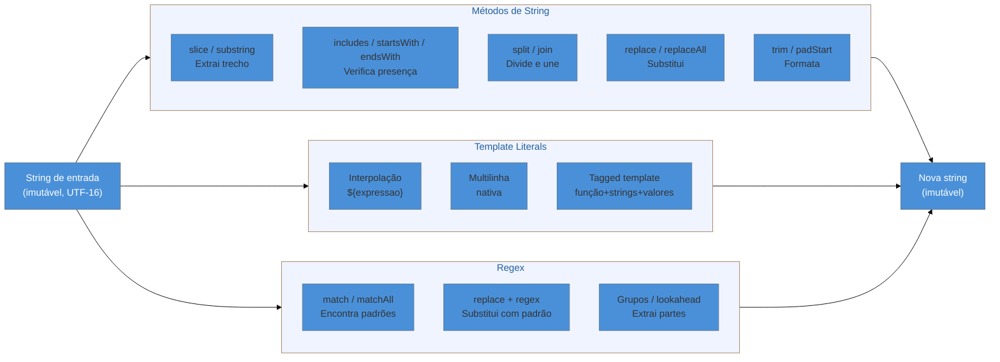

# Strings, template literals e regex

> [!abstract] TL;DR
> Strings em JavaScript são imutáveis e codificadas em UTF-16 — o que faz `"😀".length` retornar `2`, não `1`. Você manipula texto com métodos como `slice`, `includes`, `split/join`, `replace/replaceAll` e `padStart`. Template literals eliminam concatenação manual com interpolação e suporte nativo a multilinha; tagged templates permitem processar strings como um programador, não como um usuário. Expressões regulares são a ferramenta certa para padrões — mas precisam de respeito: `replace` sem a flag `g` silenciosamente substitui só a primeira ocorrência, e padrões com `*` aninhados podem travar o navegador por segundos.

---

Você está construindo um formulário de cadastro. O usuário digita o CPF como `"123.456.789-09"` e você precisa validar o formato, extrair os dígitos, e apresentar uma mensagem de erro personalizada se algo estiver errado. Ou imagine que você recebe um CSV e precisa separar os campos, limpar espaços em branco e remontar a string em outro formato.

Esses cenários surgem o tempo todo. E em JavaScript, a ferramenta para resolvê-los tem três camadas: os **métodos de string** para manipulação cotidiana, os **template literals** para montar texto de forma legível, e as **expressões regulares** para padrões que strings simples não conseguem descrever.

Vamos do mais simples ao mais poderoso — nessa ordem, porque cada camada ilumina a próxima.

---

## Strings são imutáveis — e codificadas em UTF-16

Antes dos métodos, um fato fundamental: strings em JavaScript são **valores imutáveis**. Quando você chama `str.toUpperCase()`, o método não altera `str` — ele devolve uma *nova* string. Isso significa que toda manipulação produz um novo valor; a original fica intacta.

```js
const nome = "alice";
nome.toUpperCase(); // "ALICE" — string nova
console.log(nome);  // "alice" — original inalterada
```

Internamente, o JavaScript armazena strings em **UTF-16**. Para entender por que isso importa, você precisa saber que o Unicode tem mais de 140.000 caracteres — muito mais do que 16 bits conseguem representar. A solução foi reservar um par de "substitutos" (surrogate pairs): dois blocos de 16 bits que juntos representam um caractere fora do plano básico.

Praticamente todo emoji vive fora do plano básico. Isso cria a armadilha mais famosa de strings em JavaScript:

```js
"A".length    // 1 — esperado
"😀".length   // 2 — não 1! São dois code units UTF-16
"café".length // 4 — mas espera...
```

A propriedade `length` conta **code units UTF-16**, não caracteres visíveis. Um emoji simples como `😀` ocupa 2 code units; um emoji composto como `👨‍👩‍👧` pode ocupar 8 ou mais.

> [!question]- Mas como contar os caracteres que o usuário realmente vê?
> A resposta moderna é `Intl.Segmenter`, uma API nativa do JavaScript que opera em **grafemas** — as unidades visuais que os humanos percebem como "um caractere". Veja na seção de casos práticos.

```js
// Contando grafemas corretamente
const segmenter = new Intl.Segmenter("pt", { granularity: "grapheme" });
const grafemas = [...segmenter.segment("👨‍👩‍👧")];
console.log(grafemas.length); // 1 — um grafema composto
```

---

## Métodos essenciais de string

Strings em JavaScript têm dezenas de métodos, mas você vai usar uns dez com frequência. Veja os mais importantes organizados por propósito:

### Extraindo pedaços: `slice` e `substring`

`slice(inicio, fim)` extrai um trecho da string do índice `inicio` (inclusivo) até `fim` (exclusivo). Índices negativos contam do final.

```js
const texto = "JavaScript";
texto.slice(0, 4);   // "Java"
texto.slice(-6);     // "Script" — 6 caracteres do final
texto.slice(4, -6);  // "" — nada entre posição 4 e -6
```

`substring` é similar, mas ignora índices negativos (trata como 0) e troca os argumentos se o primeiro for maior que o segundo. Na prática, `slice` é mais previsível — prefira-o.

### Verificando presença: `includes`, `startsWith`, `endsWith`

```js
const url = "https://exemplo.com/pagina";

url.includes("exemplo");    // true
url.startsWith("https");    // true
url.endsWith(".com/pagina"); // true

// Segundo argumento é a posição de início da busca
url.includes("http", 5);    // false — busca a partir da posição 5
url.startsWith("exemplo", 8); // true — começa a comparar na posição 8
```

Esses três métodos retornam booleano e são muito mais legíveis do que `indexOf(x) !== -1` — prefira-os quando você só quer saber "está lá ou não".

### Dividindo e reconstituindo: `split` e `join`

`split(separador)` divide a string em um array. `join(separador)` é o inverso — pertence a Array, não a String.

```js
const csv = "Alice,30,Engenheira";
const campos = csv.split(",");
// ["Alice", "30", "Engenheira"]

campos.join(" | ");
// "Alice | 30 | Engenheira"
```

`split("")` divide em caracteres individuais — mas lembre-se da armadilha UTF-16 com emojis.

### Limpando espaços: `trim`, `trimStart`, `trimEnd`

```js
const entrada = "  olá mundo  ";
entrada.trim();      // "olá mundo"
entrada.trimStart(); // "olá mundo  "
entrada.trimEnd();   // "  olá mundo"
```

Sempre aplique `trim()` em inputs do usuário antes de validar. Um campo que parece vazio pode ser `"  "` — e `"  " === ""` é `false`.

### Substituindo conteúdo: `replace` e `replaceAll`

```js
const frase = "O gato viu o gato no telhado";

frase.replace("gato", "cachorro");
// "O cachorro viu o gato no telhado" — só o PRIMEIRO!

frase.replaceAll("gato", "cachorro");
// "O cachorro viu o cachorro no telhado" — todos
```

`replace` com string substitui apenas a primeira ocorrência. `replaceAll` veio no ES2021 para resolver exatamente isso. Com regex, você usa a flag `g` — veja na seção de regex.

### Preenchendo: `padStart` e `padEnd`

Muito útil para formatar números com zeros à esquerda ou alinhar colunas:

```js
"5".padStart(3, "0");    // "005"
"42".padStart(5, "0");   // "00042"
"ok".padEnd(10, ".");    // "ok........"

// Exemplo real: formatar horas
const hora = 9;
`${String(hora).padStart(2, "0")}:00`; // "09:00"
```

### Outros métodos úteis

| Método | O que faz | Exemplo |
|--------|-----------|---------|
| `toUpperCase()` / `toLowerCase()` | Muda a caixa | `"Alice".toLowerCase()` → `"alice"` |
| `indexOf(substr)` | Posição da primeira ocorrência (ou -1) | `"abc".indexOf("b")` → `1` |
| `repeat(n)` | Repete a string n vezes | `"ha".repeat(3)` → `"hahaha"` |
| `at(i)` | Acessa caractere (aceita índice negativo) | `"abc".at(-1)` → `"c"` |
| `charCodeAt(i)` | Code unit UTF-16 na posição i | `"A".charCodeAt(0)` → `65` |
| `codePointAt(i)` | Code point Unicode na posição i | `"😀".codePointAt(0)` → `128512` |

---

## Template literals: interpolação e multilinha

Antes dos template literals (ES2015), montar strings dinamicamente em JavaScript era doloroso:

```js
// Estilo antigo — concatenação
var msg = "Olá, " + nome + "! Você tem " + mensagens + " mensagens novas.";
```

Com template literals, você usa crases (`` ` ``) e coloca expressões dentro de `${}`:

```js
// Estilo moderno — template literal
const msg = `Olá, ${nome}! Você tem ${mensagens} mensagens novas.`;
```

Dentro de `${}` pode ir qualquer expressão JavaScript — não só variáveis:

```js
const preco = 19.9;
const desconto = 0.1;

const etiqueta = `Preço: R$ ${(preco * (1 - desconto)).toFixed(2)}`;
// "Preço: R$ 17.91"

const status = `Usuário ${ativo ? "ativo" : "inativo"}`;
```

### Multilinha nativa

Strings convencionais com aspas não suportam quebras de linha diretamente. Template literals sim:

```js
// Antes: gambiarras com \n
var html = "<div>\n  <p>Olá</p>\n</div>";

// Agora: natural e legível
const html = `
  <div>
    <p>Olá</p>
  </div>
`;
```

> [!info] Indentação real
> Cuidado: as quebras de linha e espaços dentro do template literal fazem parte da string. `html` no exemplo acima começa com `\n  `, não com `<div>`. Isso raramente é problema em HTML, mas pode importar em outros contextos.

### Tagged templates: templates programáveis

Um *tagged template* é a forma mais poderosa — e menos conhecida — de template literal. A sintaxe é colocar uma função antes das crases:

```js
tag`Olá, ${nome}! Você tem ${n} mensagens.`
```

A função `tag` recebe dois tipos de argumento:
- **strings**: array com as partes estáticas do template (`["Olá, ", "! Você tem ", " mensagens."]`)
- **valores**: os resultados das expressões interpoladas (`[nome, n]`)

A função pode fazer qualquer coisa com esses pedaços e retornar qualquer valor — não precisa ser string.

```js
function tag(strings, ...valores) {
  console.log(strings); // ["Olá, ", "! Você tem ", " mensagens."]
  console.log(valores); // ["Alice", 3]
  
  // Reconstrói a string (comportamento padrão)
  return strings.reduce((acc, str, i) => acc + str + (valores[i] ?? ""), "");
}
```

Um caso de uso clássico é sanitização de HTML para prevenir XSS:

```js
function safe(strings, ...valores) {
  const escapar = (str) =>
    String(str)
      .replace(/&/g, "&amp;")
      .replace(/</g, "&lt;")
      .replace(/>/g, "&gt;")
      .replace(/"/g, "&quot;");

  return strings.reduce(
    (acc, str, i) => acc + str + (valores[i] !== undefined ? escapar(valores[i]) : ""),
    ""
  );
}

const nomeUsuario = '<script>alert("xss")</script>';
const mensagem = safe`Bem-vindo, ${nomeUsuario}!`;
// "Bem-vindo, &lt;script&gt;alert(&quot;xss&quot;)&lt;/script&gt;!"
```

Bibliotecas como `graphql-tag` (para queries GraphQL) e `sql` (para queries SQL parametrizadas) usam tagged templates para oferecer uma DSL limpa dentro de JavaScript.

---

## Expressões regulares essenciais

Uma expressão regular (*regex* ou *regexp*) é um padrão para encontrar correspondências em texto. Pense nela como um "template de busca" — em vez de procurar a palavra exata `"gato"`, você pode procurar "qualquer palavra que começa com g e termina com o".

### Criando uma regex

Duas formas:

```js
// Literal — compile em tempo de parse, reutilizável
const padrao = /\d+/;

// Construtor — para padrões dinâmicos (construídos em runtime)
const termo = "gato";
const padraoDinamico = new RegExp(termo, "gi");
```

Use literal quando o padrão é fixo; use `new RegExp()` quando o padrão vem de uma variável ou configuração.

### Flags essenciais

As flags modificam o comportamento da regex:

| Flag | Nome | O que faz |
|------|------|-----------|
| `g` | global | Encontra *todas* as ocorrências, não só a primeira |
| `i` | insensitive | Ignora maiúsculas/minúsculas |
| `m` | multiline | `^` e `$` correspondem ao início/fim de cada linha |
| `s` | dotAll | `.` passa a corresponder também a `\n` |
| `u` | unicode | Habilita modo Unicode completo |
| `v` | unicodeSets | Upgrade do modo `u`: set notation, propriedades de strings (ES2024+) |

```js
const texto = "O Gato viu o gato no telhado";

/gato/g.exec(texto);    // só a primeira (exec sem loop)
texto.match(/gato/g);   // ["gato"] — sem i, não pega "Gato"
texto.match(/gato/gi);  // ["Gato", "gato"] — com i e g
```

### Sintaxe básica de padrões

```js
// Caracteres especiais
.       // qualquer caractere exceto \n
\d      // dígito [0-9]
\w      // letra, dígito ou _ [a-zA-Z0-9_]
\s      // espaço em branco (space, tab, newline)
\D, \W, \S // negação dos anteriores

// Quantificadores
*       // 0 ou mais
+       // 1 ou mais
?       // 0 ou 1 (torna opcional)
{3}     // exatamente 3
{2,5}   // entre 2 e 5
{2,}    // 2 ou mais

// Âncoras
^       // início da string (ou linha com flag m)
$       // fim da string (ou linha com flag m)

// Classes de caracteres
[abc]   // a, b ou c
[^abc]  // qualquer coisa exceto a, b, c
[a-z]   // de a até z
```

### Grupos e capturas

Parênteses criam **grupos de captura** — partes do match que você pode extrair separadamente:

```js
const data = "2026-06-25";
const match = data.match(/(\d{4})-(\d{2})-(\d{2})/);

if (match) {
  console.log(match[0]); // "2026-06-25" — match completo
  console.log(match[1]); // "2026" — primeiro grupo
  console.log(match[2]); // "06" — segundo grupo
  console.log(match[3]); // "25" — terceiro grupo
}
```

**Grupos nomeados** (ES2018) tornam o código muito mais legível:

```js
const match = data.match(/(?<ano>\d{4})-(?<mes>\d{2})-(?<dia>\d{2})/);
console.log(match.groups.ano); // "2026"
console.log(match.groups.mes); // "06"
```

### `match`, `matchAll` e `replace` com regex

```js
const frase = "Telefones: (11) 9999-0000 e (21) 8888-1111";
const regexTel = /\(\d{2}\)\s\d{4,5}-\d{4}/g;

// match com g retorna array de todas as correspondências (sem grupos)
frase.match(regexTel);
// ["(11) 9999-0000", "(21) 8888-1111"]

// matchAll retorna iterador com detalhes de cada match (incluindo grupos)
for (const m of frase.matchAll(regexTel)) {
  console.log(m[0], "na posição", m.index);
}
```

`replace` aceita regex e pode usar uma função como segundo argumento:

```js
// Referência a grupo por $1, $2 etc.
"2026-06-25".replace(/(\d{4})-(\d{2})-(\d{2})/, "$3/$2/$1");
// "25/06/2026"

// Função de transformação
"olá mundo".replace(/\b\w/g, (letra) => letra.toUpperCase());
// "Olá Mundo"
```

### Lookahead básico

Lookahead verifica se um padrão existe *após* a posição atual, sem consumir os caracteres:

```js
// Lookahead positivo: \d+ seguido de " reais"
"150 reais".match(/\d+(?= reais)/);
// ["150"]

// Lookahead negativo: \d+ não seguido de " reais"
"150 dólares".match(/\d+(?! reais)/);
// ["150"]
```

---

## Diagrama: do texto ao resultado



---

## Casos práticos

### Caso 1: parse de linha CSV com split + trim + padStart

Você recebe dados de um relatório como string CSV e precisa reformatar para exibição:

```js
function parseLinhaCsv(linha) {
  // "  Alice  , 30 , Engenheira  "
  const campos = linha.split(",").map((c) => c.trim());
  return campos;
}

function formatarRelatorio(linhas) {
  return linhas
    .map(parseLinhaCsv)
    .map(([nome, idade, cargo]) => {
      const idadeFormatada = String(idade).padStart(3, " ");
      return `${nome.padEnd(15)} | ${idadeFormatada} | ${cargo}`;
    })
    .join("\n");
}

const csv = [
  "  Alice  , 30 , Engenheira  ",
  "  Bob    ,  9 , Estagiário  ",
  "  Carol  ,  45, Gerente     ",
];

console.log(formatarRelatorio(csv));
// Alice           |  30 | Engenheira
// Bob             |   9 | Estagiário
// Carol           |  45 | Gerente
```

O detalhe importante: `trim()` antes de usar qualquer campo do CSV. Espaços extras são a causa número 1 de bugs silenciosos em dados de formulários e imports.

### Caso 2: validação de CPF com regex

CPF brasileiro tem o formato `XXX.XXX.XXX-XX`. Validar apenas o formato (não o dígito verificador) com regex:

```js
function validarFormatoCpf(cpf) {
  // Remove espaços acidentais nas bordas
  const limpo = cpf.trim();

  // Padrão: 3 dígitos, ponto, 3 dígitos, ponto, 3 dígitos, hífen, 2 dígitos
  const formato = /^\d{3}\.\d{3}\.\d{3}-\d{2}$/;

  if (!formato.test(limpo)) {
    return { valido: false, erro: "Formato inválido. Use: XXX.XXX.XXX-XX" };
  }

  // Extrai só os dígitos para processamento posterior
  const digitos = limpo.replace(/\D/g, "");
  return { valido: true, digitos };
}

validarFormatoCpf("123.456.789-09");
// { valido: true, digitos: "12345678909" }

validarFormatoCpf("12345678909");
// { valido: false, erro: "Formato inválido. Use: XXX.XXX.XXX-XX" }
```

Note o `\D` (negação de `\d`) com flag `g` para remover *todos* os não-dígitos de uma vez — mais robusto do que listar `.`, `-` individualmente.

### Caso 3: tagged template para sanitização HTML

Em aplicações que geram HTML dinamicamente, interpolar dados do usuário sem sanitizar abre vulnerabilidades XSS. Um tagged template resolve isso de forma transparente:

```js
function html(strings, ...valores) {
  const escapar = (valor) =>
    String(valor)
      .replace(/&/g, "&amp;")
      .replace(/</g, "&lt;")
      .replace(/>/g, "&gt;")
      .replace(/"/g, "&quot;")
      .replace(/'/g, "&#39;");

  return strings.reduce((resultado, str, i) => {
    const valor = valores[i];
    return resultado + str + (valor !== undefined ? escapar(valor) : "");
  }, "");
}

// Uso: idêntico ao template literal normal, mas seguro
const usuario = '';
const card = html`
  <div class="card">
    <h2>${usuario}</h2>
    <p>Bem-vindo ao sistema!</p>
  </div>
`;

// <h2> terá o texto escapado, não o HTML malicioso
console.log(card);
// <div class="card">
//   <h2>&lt;img src=x onerror=&quot;alert(1)&quot;&gt;</h2>
//   <p>Bem-vindo ao sistema!</p>
// </div>
```

A biblioteca `lit-html` (usada pelo framework Lit) usa exatamente esse padrão para renderização eficiente de HTML.

---

## Armadilhas comuns

> [!warning] `length` mente para emojis
> **O que acontece:** `"😀".length` retorna `2`, não `1`. Qualquer lógica de "máximo N caracteres" que usa `length` diretamente vai permitir metade dos caracteres se o usuário digitar emojis. **Por quê:** `length` conta code units UTF-16. Emojis e caracteres fora do Plano Básico Multilíngue usam dois code units (surrogate pair). **Como evitar:** Para contar caracteres visíveis (grafemas), use `Intl.Segmenter` com `granularity: "grapheme"`. Para iteração segura com code points, use `for...of` ou spread `[...str]` — ambos respeitam pares surrogate.

> [!warning] `replace` com string substitui só a primeira ocorrência
> **O que acontece:** `"a-b-c".replace("-", "_")` retorna `"a_b-c"`, não `"a_b_c"`. O segundo e terceiro `-` permanecem. **Por quê:** `replace` com string como primeiro argumento é definido pela spec como "substituir a primeira ocorrência". Isso não é um bug — é o comportamento documentado. **Como evitar:** Use `replaceAll("-", "_")` (ES2021) ou `replace(/-/g, "_")` com regex e flag `g`.

> [!warning] Regex sem flag `g` em `match` retorna objeto, não array
> **O que acontece:** `"abc abc".match(/abc/)` retorna um objeto com detalhes do *primeiro* match. `"abc abc".match(/abc/g)` retorna `["abc", "abc"]`. Comportamentos completamente diferentes com a mesma regex. **Por quê:** Sem `g`, `match` delega para `RegExp.prototype.exec`, que retorna o objeto completo do primeiro resultado (incluindo índice e grupos). Com `g`, retorna array simples de strings. **Como evitar:** Se precisar de todos os matches *com* detalhes de grupos, use `matchAll` (que exige `g`). Se precisar só dos textos, use `match` com `g`. Nunca misture.

> [!warning] Backtracking catastrófico pode travar o navegador
> **O que acontece:** Uma regex como `/^(\d+)*$/` testada contra `"12345678901234567890z"` pode demorar segundos — ou travar o processo indefinidamente. **Por quê:** O motor de regex tenta *todas as combinações possíveis* de como o padrão pode corresponder à string. Com quantificadores aninhados (`(\d+)*`), o número de combinações cresce exponencialmente. **Como evitar:** Evite quantificadores dentro de quantificadores. Para entrada de usuário, prefira padrões simples e concretos (ex: `/^\d{11}$/` para CPF sem formatação). Se precisar de padrões complexos, teste com ferramentas como regex101.com para identificar backtracking antes de ir para produção.

> [!warning] `new RegExp()` com caracteres especiais não escapados
> **O que acontece:** `new RegExp(str)` onde `str` contém `.`, `+`, `*` etc. vai tratar esses caracteres como metacaracteres da regex, não como literais. **Por quê:** A string passada ao construtor é interpretada como padrão regex, não como texto literal. **Como evitar:** Se a string é entrada do usuário e deve ser buscada literalmente, escape os metacaracteres: `str.replace(/[.*+?^${}()|[\]\\]/g, "\\$&")`. A proposta `RegExp.escape()` está no TC39 Stage 2 e deve resolver isso nativamente no futuro.

---

## Como explicar em inglês

Se em uma entrevista alguém perguntar sobre strings em JavaScript, você pode dizer:

> "JavaScript strings are immutable sequences of UTF-16 code units. This means that `.length` counts code units, not user-visible characters — so a single emoji can have a length of 2 or more. For modern text manipulation, we have template literals for string interpolation and multiline support, and tagged templates for programmatic string processing like sanitization or DSLs. Regular expressions come in when we need pattern matching — flags like `g` for global and `i` for case-insensitive are the most common. One key gotcha: `replace` with a string only replaces the first occurrence; you need `replaceAll` or the `g` flag for all."

| PT | EN |
|----|-----|
| par substituto | surrogate pair |
| plano básico multilíngue | Basic Multilingual Plane (BMP) |
| grafema | grapheme |
| template literal marcado | tagged template literal |
| expressão regular | regular expression / regex |
| grupo de captura | capture group |
| grupo nomeado | named capture group |
| lookahead positivo | positive lookahead |
| backtracking catastrófico | catastrophic backtracking |
| flag | flag (mesmo em PT no contexto técnico) |

---

## O que vem a seguir

Com strings bem dominadas, o próximo passo natural é entender os números — e as surpresas que eles guardam. JavaScript usa ponto flutuante de 64 bits para todos os números, o que cria comportamentos contraintuitivos como `0.1 + 0.2 !== 0.3`. Saber quando usar `BigInt` para inteiros grandes também se torna importante em sistemas financeiros.

- `[[13 - Números, BigInt e precisão]]` — por que `0.1 + 0.2` não é `0.3` e quando BigInt resolve o problema
- `[[Dicionário de JavaScript]]` — glossário de termos da linguagem com definições rápidas

---

## Referências

- **MDN Web Docs** — [*String — JavaScript*](https://developer.mozilla.org/en-US/docs/Web/JavaScript/Reference/Global_Objects/String) — referência completa de todos os métodos de string com exemplos e compatibilidade de browser
- **MDN Web Docs** — [*Template literals*](https://developer.mozilla.org/en-US/docs/Web/JavaScript/Reference/Template_literals) — cobertura completa de template literals e tagged templates, incluindo raw strings
- **MDN Web Docs** — [*Intl.Segmenter*](https://developer.mozilla.org/en-US/docs/Web/JavaScript/Reference/Global_Objects/Intl/Segmenter/Segmenter) — API para segmentação de texto em grafemas, palavras e sentenças
- **MDN Web Docs** — [*Regular expressions*](https://developer.mozilla.org/en-US/docs/Web/JavaScript/Guide/Regular_expressions) — guia completo de regex em JavaScript com flags, grupos e exemplos
- **V8 Dev Blog** — [*RegExp v flag with set notation and properties of strings*](https://v8.dev/features/regexp-v-flag) — detalhes da flag `v` (ES2024), extensão do modo unicode
- **javascript.info** — [*Catastrophic backtracking*](https://javascript.info/regexp-catastrophic-backtracking) — explicação clara do problema com exemplos práticos e estratégias de mitigação
- **Axel Rauschmayer** — [*Exploring JS: Template literals*](https://exploringjs.com/impatient-js/ch_template-literals.html) — cobertura aprofundada de tagged templates com casos de uso reais
