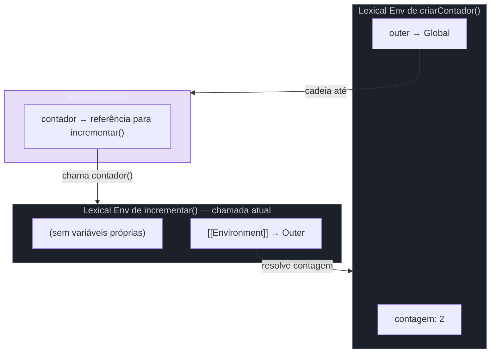
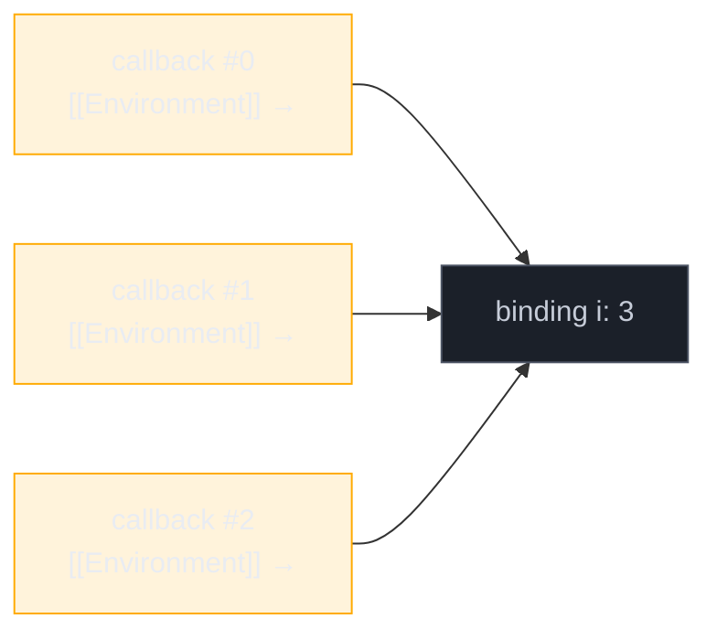

# Closures

> [!abstract] TL;DR
> Uma closure é uma função que "carrega consigo" o ambiente léxico onde foi criada — ela mantém acesso às variáveis daquele escopo mesmo depois que o escopo externo terminou de executar. Isso acontece porque a engine JavaScript não descarta o Lexical Environment enquanto alguma função ainda referencia ele. Closures são a base de module pattern, factory functions, currying, memoização e debounce. O principal perigo é manter referências vivas sem querer, impedindo o garbage collector de liberar memória.

---

Imagine que você está escrevendo uma função que precisa "lembrar" de um valor entre chamadas — por exemplo, um contador que incrementa cada vez que é chamado. Sem closures, você precisaria de uma variável global (perigosa, acessível por qualquer código) ou de um objeto externo (verboso). Com closures, a função carrega seu próprio estado encapsulado, invisível para o resto do código.

É exatamente isso que closures tornam possível. E entender como elas funcionam por dentro — não só a sintaxe — é o que separa quem "usa closures" de quem "entende JavaScript".

---

## O que é uma closure: função + ambiente capturado

Para entender closures, você precisa entender o que a engine guarda quando uma função é criada.

Quando o motor JavaScript cria uma função, ele não guarda só o código dela. Ele guarda também uma referência ao **Lexical Environment** do escopo onde ela foi definida. Esse ambiente contém todas as variáveis e bindings visíveis naquele ponto do código.

> [!info] Lexical Environment
> É a estrutura interna que a engine usa para rastrear variáveis em tempo de execução. Cada função, bloco `{}`, ou módulo cria seu próprio Lexical Environment. Cada ambiente tem dois componentes: o **Environment Record** (as variáveis daquele escopo) e uma referência ao **ambiente externo** (o escopo pai). Essa cadeia de referências forma o **scope chain**.

A **closure** surge quando uma função referencia variáveis do ambiente externo e esse ambiente seria normalmente descartado quando a função externa termina de executar. Mas como a função interna ainda referencia o ambiente, a engine o mantém vivo — na memória, acessível apenas pela função interna.

```javascript
function criarContador() {
  let contagem = 0; // variável no Lexical Environment de criarContador

  return function incrementar() {
    contagem++; // incrementar "fecha sobre" contagem
    return contagem;
  };
}

const contador = criarContador();
console.log(contador()); // 1
console.log(contador()); // 2
console.log(contador()); // 3
```

Quando `criarContador()` retorna, sua execução termina — mas `contagem` **não é descartada**. A função `incrementar` ainda a referencia, então o Lexical Environment de `criarContador` continua vivo. Cada chamada a `contador()` lê e modifica o mesmo binding de `contagem`.

> [!question]- Por que a engine não descarta `contagem` quando `criarContador` termina?
> O Lexical Environment só é elegível para garbage collection quando nenhuma referência ativa aponta para ele. `incrementar` mantém uma referência interna (`[[Environment]]`) ao ambiente de `criarContador`. Enquanto `contador` existir, esse ambiente existe.

---

## Como a engine mantém o escopo vivo: scope chain em detalhe

A analogia da mochila ajuda aqui: quando uma função é criada, ela "empacota" na mochila todas as variáveis que consegue enxergar no escopo onde foi escrita. Quando a função é chamada em outro lugar — mesmo depois que o escopo original sumiu — ela abre a mochila e encontra tudo lá.

O diagrama abaixo mostra a cadeia de escopos (scope chain) formada pelo exemplo do contador:



Quando `incrementar()` executa `contagem++`:
1. A engine busca `contagem` no Environment Record de `incrementar` — não encontra.
2. Sobe pela referência `[[Environment]]` até o Environment Record de `criarContador` — encontra.
3. Lê e modifica o binding diretamente.

O escopo léxico garante que essa resolução seja **determinística**: o que `incrementar` vê depende de onde ela foi **escrita**, não de onde ela é **chamada**.

---

## Padrões reais com closures

### Module pattern — encapsulamento sem classes

Antes de ES modules, closures eram a única forma de encapsular estado privado em JavaScript. O padrão IIFE (Immediately Invoked Function Expression) cria um escopo que vive apenas uma vez, expondo só o que for necessário.

```javascript
const banco = (function () {
  // privado — inacessível de fora
  let saldo = 0;
  const historico = [];

  function registrar(tipo, valor) {
    historico.push({ tipo, valor, data: new Date() });
  }

  // público — exposto via objeto retornado
  return {
    depositar(valor) {
      saldo += valor;
      registrar("depósito", valor);
    },
    sacar(valor) {
      if (valor > saldo) throw new Error("Saldo insuficiente");
      saldo -= valor;
      registrar("saque", valor);
    },
    extrato() {
      return { saldo, historico: [...historico] }; // cópia defensiva
    },
  };
})();

banco.depositar(100);
banco.sacar(30);
console.log(banco.extrato()); // { saldo: 70, historico: [...] }
console.log(banco.saldo);     // undefined — privado!
```

`saldo` e `historico` vivem no Lexical Environment da IIFE. Os três métodos retornados formam closures sobre esse ambiente — cada um pode lê-lo e modificá-lo, mas código externo não tem acesso direto.

### Factory functions — configuração via closure

Uma factory function retorna funções com comportamento personalizado, injetando configuração via closure em vez de parâmetros repetitivos.

```javascript
function criarMultiplicador(fator) {
  return (numero) => numero * fator; // fator é capturado
}

const dobrar = criarMultiplicador(2);
const triplicar = criarMultiplicador(3);

console.log(dobrar(5));    // 10
console.log(triplicar(5)); // 15
```

Cada chamada a `criarMultiplicador` cria um **novo** Lexical Environment com seu próprio `fator`. `dobrar` e `triplicar` são closures independentes — não compartilham estado.

### Currying — aplicação parcial de argumentos

Currying transforma `f(a, b, c)` em `f(a)(b)(c)`. Cada chamada cria uma closure que "lembra" os argumentos anteriores.

```javascript
function curry(fn) {
  return function curried(...args) {
    if (args.length >= fn.length) {
      return fn(...args);
    }
    return function (...maisArgs) {
      return curried(...args, ...maisArgs);
    };
  };
}

const somar = curry((a, b, c) => a + b + c);

const somarCom10 = somar(10);        // closure: args = [10]
const somarCom10e5 = somarCom10(5);  // closure: args = [10, 5]
console.log(somarCom10e5(3));        // 18
```

### Função `once` — executar só uma vez

Um padrão clássico de closure para garantir que uma função de inicialização seja chamada no máximo uma vez — útil para setup de SDK, conexão de banco, etc.

```javascript
function once(fn) {
  let chamada = false;
  let resultado;

  return function (...args) {
    if (!chamada) {
      chamada = true;
      resultado = fn(...args);
    }
    return resultado;
  };
}

const inicializarSDK = once(() => {
  console.log("SDK inicializado");
  return { status: "ok" };
});

inicializarSDK(); // "SDK inicializado" → { status: "ok" }
inicializarSDK(); // silencioso → { status: "ok" } (mesmo resultado)
```

---

## O pitfall clássico: `for` + `var` + callback

Este é um dos problemas de closure mais cobrados em entrevistas. Entender o mecanismo é mais importante que memorizar a solução.

```javascript
// Comportamento INESPERADO com var
for (var i = 0; i < 3; i++) {
  setTimeout(() => console.log(i), 0);
}
// Imprime: 3, 3, 3 — não 0, 1, 2
```

Por quê? `var` é **function-scoped**, não block-scoped. O loop inteiro compartilha **um único binding** de `i`. Quando os callbacks do `setTimeout` executam (após o loop terminar, pois são macrotasks), o único `i` que existe vale `3`.

Cada closure captura a **referência** ao binding, não uma **cópia** do valor — e como todas apontam para o mesmo `i`, todas veem `3`.



### Solução 1: `let` (recomendada — ES6+)

```javascript
for (let i = 0; i < 3; i++) {
  setTimeout(() => console.log(i), 0);
}
// Imprime: 0, 1, 2 ✅
```

`let` cria um **novo binding** por iteração. Cada callback fecha sobre um `i` diferente.

### Solução 2: IIFE por iteração

```javascript
for (var i = 0; i < 3; i++) {
  (function (indice) {
    setTimeout(() => console.log(indice), 0);
  })(i);
}
// Imprime: 0, 1, 2 ✅
```

A IIFE cria um escopo novo por iteração. `indice` recebe o valor atual de `i` como argumento — uma cópia, não uma referência ao binding.

### Solução 3: `.bind()` com o valor atual

```javascript
for (var i = 0; i < 3; i++) {
  setTimeout(console.log.bind(null, i), 0);
}
// Imprime: 0, 1, 2 ✅
```

`.bind()` cria uma nova função com `i` capturado **por valor** no momento da chamada. Menos idiomático que `let`, mas aparece em código legado.

---

## Casos práticos

### Caso 1: Contador encapsulado com reset

Um contador com estado completamente privado — sem variável global, sem classe, sem objeto exposto.

```javascript
function criarContadorAvancado(inicio = 0) {
  let contagem = inicio;

  return {
    incrementar: (passo = 1) => (contagem += passo),
    decrementar: (passo = 1) => (contagem -= passo),
    valor: () => contagem,
    resetar: () => {
      contagem = inicio; // closure sobre 'inicio' também!
    },
  };
}

const c = criarContadorAvancado(10);
c.incrementar();    // 11
c.incrementar(4);   // 15
c.decrementar(2);   // 13
c.resetar();
console.log(c.valor()); // 10 — volta para o início original
```

Note que `resetar` usa `inicio` — outro binding capturado pela closure. `inicio` é imutável (parâmetro), então o reset é confiável.

### Caso 2: Memoização de função cara

Memoização é uma otimização que armazena resultados de chamadas anteriores para evitar recálculo. Closures são perfeitas para isso: o cache vive no ambiente capturado, invisível ao chamador.

```javascript
function memoizar(fn) {
  const cache = new Map(); // capturado pela closure

  return function (...args) {
    const chave = JSON.stringify(args);

    if (cache.has(chave)) {
      console.log("[cache hit]");
      return cache.get(chave);
    }

    const resultado = fn(...args);
    cache.set(chave, resultado);
    return resultado;
  };
}

// Fibonacci ingênuo: O(2^n) sem memoização
const fib = memoizar(function fibonacci(n) {
  if (n <= 1) return n;
  return fib(n - 1) + fib(n - 2); // usa a versão memoizada recursivamente
});

console.log(fib(40)); // calculado uma vez
console.log(fib(40)); // [cache hit] — instantâneo
```

O `cache` não é global e não é exposto para o chamador. Vive exatamente onde precisa: dentro da closure.

> [!warning] Cuidado com chaves de cache por JSON.stringify
> `JSON.stringify` não lida bem com objetos circulares, `undefined`, funções ou `Symbol`. Para funções memoizadas com argumentos complexos, use uma estratégia de chave mais robusta (WeakMap para objetos, ou uma biblioteca como `fast-memoize`).

### Caso 3: Debounce — atrasar execução até o usuário parar

[[Dicionário de JavaScript#debounce\|Debounce]] é um padrão essencial para lidar com eventos de alta frequência (digitação, scroll, resize). A closure mantém o `timer` entre chamadas.

```javascript
function debounce(fn, espera) {
  let timer; // capturado — persiste entre chamadas

  return function (...args) {
    clearTimeout(timer); // cancela o agendamento anterior
    timer = setTimeout(() => {
      fn(...args);
    }, espera);
  };
}

const buscarAPI = debounce(async (termo) => {
  const res = await fetch(`/api/busca?q=${termo}`);
  return res.json();
}, 300);

// Usuário digita "JavaScript" rápido:
// buscarAPI("J")       → agenda, depois cancela
// buscarAPI("Ja")      → cancela o anterior, agenda novo
// ...
// buscarAPI("JavaScript") → aguarda 300ms sem nova chamada → executa
```

Sem a closure sobre `timer`, cada chamada criaria um timer independente e a função dispararia para cada keystroke.

---

## Armadilhas comuns

> [!warning] Closure captura referência, não valor
> **O que acontece:** Você espera que a função "lembre" um valor, mas ela lembra o binding — e o binding pode mudar. **Por quê:** `let x = 1; const fn = () => x; x = 2; fn(); // 2` — a closure não tirou uma fotografia de `x`, ela guarda o endereço de memória onde `x` vive. **Como evitar:** Se precisar capturar um snapshot, passe como argumento ou use uma variável local imutável: `const snapshot = x; const fn = () => snapshot;`

> [!warning] `for` + `var` + callbacks assíncronos
> **O que acontece:** Todos os callbacks imprimem o mesmo valor (o final do loop), não o esperado por iteração. **Por quê:** `var` tem escopo de função, então todas as iterações compartilham o mesmo binding. **Como evitar:** Use `let` (preferido em código moderno), IIFE por iteração, ou `.bind()`. Nunca use `var` em código novo.

> [!warning] Closures e vazamento de memória
> **O que acontece:** Um objeto grande fica preso na memória mais tempo do que deveria. **Por quê:** Enquanto uma closure referencia o Lexical Environment, **todos** os bindings daquele ambiente ficam vivos — não só os que a closure usa explicitamente. Se o ambiente contém uma referência a um DOM node removido ou um array grande, eles não serão coletados. **Como evitar:** Ao terminar de usar uma closure de longa duração, atribua `null` à variável que a referencia: `contador = null;`. Para `EventListener`, sempre remova com `removeEventListener`. Ver nota sobre Memory management (nota 21).

> [!warning] Closures não são mágica — têm custo
> **O que acontece:** Em loops muito apertados, criar closures por iteração pode gerar pressão de alocação. **Por quê:** Cada closure cria um novo objeto de ambiente. Em JavaScript moderno, engines como V8 otimizam closures de forma agressiva (escape analysis, stack allocation), mas o custo existe em casos extremos. **Como evitar:** Em código de performance crítica (tight loops, rendering), prefira passar estado por argumento em vez de capturar por closure. Meça antes de otimizar.

> [!warning] `using` + closure: recurso descartado ainda capturado
> **O que acontece:** O keyword `using` (Explicit Resource Management, TC39 Stage 4 — disponível no Chrome 127+, Node.js recente e Deno) garante que `Symbol.dispose()` seja chamado ao sair do bloco. A armadilha: retornar uma closure que captura um recurso `using` faz com que a closure continue viva apontando para um objeto **já descartado**.
>
> ```javascript
> function criarHandler() {
>   using resource = openResource(); // Symbol.dispose chamado ao sair
>   return () => resource.read();    // ❌ closure captura resource descartado
> }
> const fn = criarHandler(); // fn() vai falhar — resource foi disposed
> ```
>
> **Por quê:** O `Symbol.dispose()` é chamado quando `criarHandler` encerra, mas a closure retornada mantém o `[[Environment]]` vivo — com o objeto em estado inválido. Diferente de `null`, o ponteiro existe; o objeto, não. **Como evitar:** Nunca retorne closures que capturam objetos `using` além do escopo do bloco que os declarou. Se precisar do resultado, extraia-o antes de retornar: `const result = resource.read(); return () => result;`

> [!info] V8 e a localização física do contexto de closure
> O V8 aplica **escape analysis** para decidir onde alocar o contexto léxico de uma closure. Se a engine prova que a closure **não escapa** da função que a criou (não é retornada, não é passada para outro contexto), ela pode manter o contexto na stack — custo zero de GC. Quando a closure **escapa** (o caso mais comum: callbacks, event listeners, módulos), o contexto vai para o heap e fica sob gestão do garbage collector. Isso explica por que closures de longa duração e closures em cadeias de callbacks de streaming custam mais do que parecem: cada contexto é um objeto heap distinto com referências que o GC precisa rastrear. Ver também: [[03-Dominios/Tecnologia/Node/Runtime e Event Loop/03 - Call stack, heap e queues|Node · Call stack, heap e queues]].

---

## Closures e `this`: a armadilha do contexto perdido

Closures capturam o **escopo léxico** (variáveis), mas `this` em funções regulares depende de **como a função é chamada** — não de onde foi escrita. São dois mecanismos independentes. Confundir os dois é uma das fontes de bug mais frequentes em código orientado a objetos com callbacks.

> [!question]- Por que `this` não funciona dentro de um callback regular?
> Porque `this` é atribuído dinamicamente: quem chama a função decide o valor. Quando `setTimeout` ou `addEventListener` chama seu callback, eles geralmente chamam sem contexto (`this === undefined` em strict mode ou `window` em sloppy mode) — não com a instância que você esperava.

```javascript
class Timer {
  constructor() {
    this.ticks = 0;
  }

  iniciar() {
    // ❌ função regular: this é undefined (strict mode) ou window (sloppy)
    setInterval(function () {
      this.ticks++; // TypeError: Cannot set property 'ticks' of undefined
    }, 1000);

    // ✅ arrow function: captura o this léxico do método iniciar()
    setInterval(() => {
      this.ticks++; // funciona — this é a instância do Timer
    }, 1000);
  }
}
```

A regra prática: use **arrow function** quando o callback precisa herdar o `this` do contexto externo (métodos de classe, event handlers de componentes). Use **função regular** quando o chamador precisa determinar o `this` (ex: métodos de protótipo acessados via `element.addEventListener` onde você quer `event.currentTarget`).

> [!summary] Closure captura variáveis; arrow function captura `this`. São duas capturas distintas.

---

## Como explicar em inglês

> A closure is a function that retains access to its lexical environment — the variables in scope where it was defined — even after that outer scope has finished executing. The JavaScript engine keeps the outer scope's Lexical Environment alive as long as any inner function holds a reference to it. Closures are the foundation of encapsulation patterns in JavaScript: module pattern, memoization, currying, and event debouncing all rely on this mechanism.

| PT | EN |
|----|-----|
| ambiente léxico | lexical environment |
| cadeia de escopos | scope chain |
| referência viva | live reference |
| encapsulamento | encapsulation |
| vazamento de memória | memory leak |
| função de fábrica | factory function |
| executa imediatamente | immediately invoked (IIFE) |
| aplicação parcial | partial application |
| memorização / cache | memoization |
| postergação de execução | debounce / throttle |

---

## Veja também

- [[04 - Variáveis e escopo]] — escopo léxico, `var`/`let`/`const`, hoisting; a fundação conceitual que torna closures previsíveis
- [[05 - Funções]] — funções de primeira classe, higher-order functions e o ponto de entrada para closures
- [[21 - Memory management]] — como o GC trata referências de closures; WeakRef, WeakMap e detecção de leaks com DevTools
- [[Dicionário de JavaScript#closure]] — definição rápida de referência
- [[03-Dominios/Tecnologia/Node/Runtime e Event Loop/03 - Call stack, heap e queues|Node · Call stack, heap e queues]] — onde o Lexical Environment das closures vive fisicamente: heap vs. stack no V8

---

## O que vem a seguir

Agora que você entende como funções carregam seu ambiente léxico, o próximo passo natural é entender como JavaScript lida com operações que levam tempo — e por que o modelo assíncrono da linguagem depende, também, de closures para funcionar.

- **11 - Callbacks e event loop** — callbacks são closures; entender o event loop explica por que o pitfall do `for+var` acontece
- **12 - Promises** — o encadeamento de `.then()` usa closures para manter contexto entre etapas assíncronas

---

## Resumo em 1 linha

Closure em uma frase: uma função que carrega consigo o ambiente léxico onde foi criada, mantendo acesso às variáveis daquele escopo mesmo após ele ter encerrado — o que possibilita encapsulamento, estado persistente e todos os padrões funcionais do JavaScript.

---

## Fontes

- **MDN Web Docs** — [*Closures*](https://developer.mozilla.org/en-US/docs/Web/JavaScript/Closures) — referência canônica da linguagem; define closure, Lexical Environment e os exemplos de module pattern
- **greatfrontend.com** — [*What is a closure in JavaScript?*](https://www.greatfrontend.com/questions/quiz/what-is-a-closure-and-how-why-would-you-use-one) — cobre os casos de uso e o pitfall do loop; orientado a entrevistas
- **Amandeep Singh / Medium** — [*Lexical Environment — The hidden part to understand Closures*](https://amnsingh.medium.com/lexical-environment-the-hidden-part-to-understand-closures-71d60efac0e0) — detalha Environment Record e scope chain
- **DigitalOcean** — [*An Introduction to Closures and Currying in JavaScript*](https://www.digitalocean.com/community/tutorials/an-introduction-to-closures-and-currying-in-javascript) — currying e aplicação parcial com closures
- **jsdev.space** — [*Mastering JavaScript Closures*](https://jsdev.space/howto/mastering-js-closures/) — padrões práticos: module, factory, memoization, debounce
- **TC39 / GitHub** — [*Explicit Resource Management proposal*](https://github.com/tc39/proposal-explicit-resource-management) (Stage 4, 2025) — spec do `using` keyword e `Symbol.dispose`; Chrome 127+, Node.js
- **V8 Blog** — [*Disabling escape analysis*](https://v8.dev/blog/disabling-escape-analysis) — contexto sobre como o V8 decide alocar contextos de closure no heap vs. stack via escape analysis
