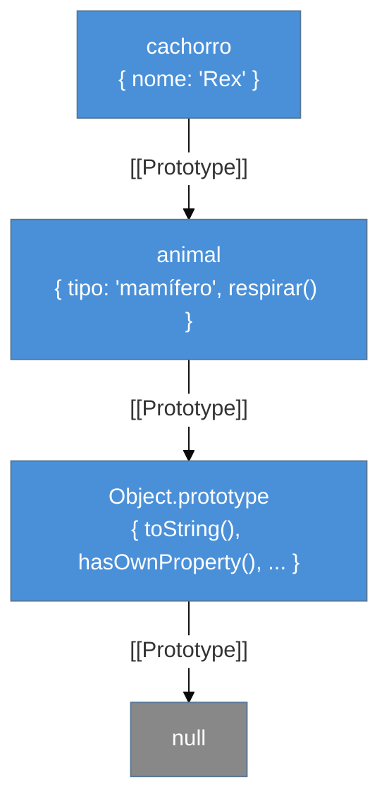
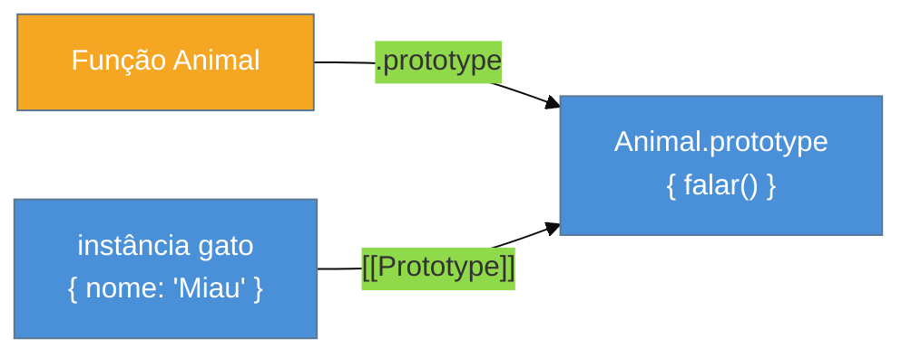

# Prototypes e herança

> [!abstract] TL;DR
> JavaScript não tem herança clássica — tem **herança por protótipos**. Cada objeto carrega um ponteiro interno `[[Prototype]]` que aponta para outro objeto, formando uma cadeia. Quando você acessa uma propriedade que o objeto não tem, o motor escala a cadeia até encontrá-la ou chegar em `null`. Funções construtoras + `new` e a sintaxe `class` são formas de montar essa cadeia — mas a cadeia é sempre a mesma coisa por baixo. Entender a diferença entre `[[Prototype]]` (do objeto) e `prototype` (da função) é o divisor de águas entre quem briga com herança em JS e quem a usa com confiança.

---

Você acabou de entrar numa entrevista técnica. O entrevistador pergunta: "Como herança funciona em JavaScript?". Se você responde "com `class extends`", está certo — mas só na superfície. A resposta que impressiona vai um nível abaixo: *JavaScript não tem herança de classes. Tem delegação por protótipos.* A sintaxe `class` é açúcar. O mecanismo real é a prototype chain.

Mas por que isso importa na prática? Porque quando você estende um built-in errado, ou perde um método ao reassignar um `prototype`, ou se pergunta por que `instanceof` retornou `false` de forma inesperada — a resposta está sempre na cadeia de protótipos. Entender o mecanismo te dá a bússola.

---

## O problema que protótipos resolvem

Imagine que você tem mil objetos representando usuários. Cada usuário precisa de um método `saudacao()`. A abordagem mais ingênua:

```js
const user1 = {
  nome: "Ana",
  saudacao() { return `Olá, ${this.nome}!`; }
};
const user2 = {
  nome: "Bruno",
  saudacao() { return `Olá, ${this.nome}!`; }  // cópia idêntica
};
```

Você acabou de criar mil cópias da mesma função em memória. Desperdício. Protótipos resolvem isso: você coloca o método **uma vez** num objeto compartilhado (o protótipo), e todos os usuários delegam a busca para ele.

---

## `[[Prototype]]`: o ponteiro interno

Todo objeto JavaScript tem um slot interno chamado `[[Prototype]]`. Você não acessa esse slot diretamente — ele é parte do spec. O que você pode fazer:

- **Ler com segurança:** `Object.getPrototypeOf(obj)`
- **Definir na criação:** `Object.create(proto)`
- **Legado (evitar em produção):** `obj.__proto__` — existe por compatibilidade, mas não use em código novo

```js
const animal = { tipo: "mamífero" };
const cachorro = Object.create(animal);

console.log(cachorro.tipo);                          // "mamífero" — subiu a cadeia
console.log(Object.getPrototypeOf(cachorro) === animal); // true
console.log(cachorro.hasOwnProperty("tipo"));        // false — é do protótipo
```

> [!question]- Por que `__proto__` é legado se funciona?
> `__proto__` foi originalmente um hack não-padrão do Firefox que todos os browsers acabaram implementando. A spec o formalizou no ES2015 apenas para compatibilidade retroativa. Em código novo, use `Object.getPrototypeOf` / `Object.create` / `Object.setPrototypeOf` — a semântica é explícita e o runtime pode otimizar melhor.

---

## A prototype chain: resolução de propriedades

Quando você faz `obj.prop`, o motor segue um algoritmo preciso:

1. O objeto `obj` tem a propriedade `prop` diretamente (own property)? → retorna.
2. Não tem? Sobe para `obj.[[Prototype]]` e tenta de novo.
3. Repete até encontrar ou chegar em `null` → retorna `undefined`.



Pense numa cadeia de postos de trabalho: você pergunta algo ao seu líder imediato; se ele não sabe, ele pergunta ao dele, e assim por diante. A resposta vem do primeiro que sabe. Se ninguém sabe (`null`), você recebe `undefined`.

---

## `prototype` da função: não confunda com `[[Prototype]]`

Aqui está a confusão mais comum. Quando você cria uma função, o JavaScript automaticamente cria um objeto chamado `NomeDaFuncao.prototype`. Esse objeto vai se tornar o `[[Prototype]]` de qualquer instância criada com `new NomeDaFuncao()`.

Portanto:
- `[[Prototype]]`: slot interno do **objeto** (toda instância)
- `.prototype`: propriedade da **função** construtora (não da instância)

```js
function Animal(nome) {
  this.nome = nome;
}
Animal.prototype.falar = function() {
  return `${this.nome} faz um som.`;
};

const gato = new Animal("Miau");

// [[Prototype]] do gato aponta para Animal.prototype
console.log(Object.getPrototypeOf(gato) === Animal.prototype); // true

// Mas gato não tem .prototype — isso é coisa de função
console.log(gato.prototype); // undefined
```

O diagrama mental:



---

## `new`: os quatro passos que você precisa saber

Quando você faz `new Animal("Rex")`, o motor executa exatamente quatro etapas:

1. **Cria** um objeto vazio: `const obj = {}`.
2. **Liga o protótipo:** `obj.[[Prototype]] = Animal.prototype`.
3. **Executa** a função construtora com `this = obj`: preenche as propriedades próprias.
4. **Retorna** `obj` (ou o valor retornado, se a função retornar um objeto explicitamente).

```js
// Simulando `new` manualmente
function meuNew(Construtora, ...args) {
  const obj = Object.create(Construtora.prototype); // passos 1 e 2
  const resultado = Construtora.apply(obj, args);   // passo 3
  return typeof resultado === "object" && resultado !== null
    ? resultado
    : obj;                                           // passo 4
}

const dog = meuNew(Animal, "Rex");
console.log(dog.nome);   // "Rex"
console.log(dog.falar()); // "Rex faz um som."
```

Saber os quatro passos responde perguntas como: "por que esquecer `new` quebra tudo?" (sem `new`, `this` vira o objeto global), e "o que acontece se o construtor retornar um objeto?" (esse objeto substitui a instância).

---

## `Object.create`: herança sem construtora

`Object.create(proto)` cria um objeto cujo `[[Prototype]]` é `proto`. É a forma mais direta de expressar herança sem funções construtoras.

```js
const veiculoBase = {
  ligar() { return `${this.modelo} ligando...`; },
  desligar() { return `${this.modelo} desligando.`; }
};

const carro = Object.create(veiculoBase);
carro.modelo = "Fusca";

console.log(carro.ligar());   // "Fusca ligando..."
console.log(carro.hasOwnProperty("ligar")); // false — veio do proto
```

`Object.create(null)` cria um objeto sem nenhum protótipo — sem `toString`, sem `hasOwnProperty`. Útil para mapas de dados puros onde você não quer poluição da cadeia.

---

## `class`: açúcar sintático sobre protótipos

A sintaxe `class` foi introduzida no ES2015. Ela não muda o modelo de herança — reescreve a cadeia de protótipos com uma sintaxe mais familiar para quem vem de Java ou Python.

```js
class Animal {
  constructor(nome) {
    this.nome = nome;     // own property — direto na instância
  }

  falar() {               // vai para Animal.prototype
    return `${this.nome} faz um som.`;
  }
}

class Cachorro extends Animal {
  constructor(nome, raca) {
    super(nome);          // chama Animal.constructor — obrigatório antes de this
    this.raca = raca;
  }

  falar() {               // shadowing: sobrescreve Animal.prototype.falar
    return `${this.nome} late!`;
  }
}

const d = new Cachorro("Rex", "Labrador");
console.log(d.falar());  // "Rex late!" — shadow local
console.log(d instanceof Cachorro); // true
console.log(d instanceof Animal);   // true — cadeia inclui ambos
```

### Desugarização manual

O que o `class Cachorro extends Animal` faz por baixo:

```js
// Equivalente sem class — didático, não copie em produção
function Cachorro(nome, raca) {
  Animal.call(this, nome);   // super(nome)
  this.raca = raca;
}

// Liga a cadeia de protótipos
Object.setPrototypeOf(Cachorro.prototype, Animal.prototype);

// Método override — shadow em Cachorro.prototype
Cachorro.prototype.falar = function() {
  return `${this.nome} late!`;
};
```

> [!info] `class` vs. função construtora — o que realmente muda
> 1. `class` sempre opera em strict mode.
> 2. Não sofre hoisting como `function` — não pode usar antes de declarar.
> 3. Não pode ser chamada sem `new` (lança TypeError).
> 4. `super` só existe dentro de `class` — não tem equivalente fácil sem ela.

---

## Campos de classe, privados e blocos estáticos (ES2022+)

Campos de classe declarados no corpo vão **diretamente na instância**, não no protótipo:

```js
class Contador {
  // Campo público — vai para cada instância (own property)
  contagem = 0;

  // Campo privado — só acessível dentro da classe
  #segredo = 42;

  // Bloco estático — executado uma vez quando a classe é avaliada
  static {
    console.log("Classe Contador carregada!");
  }

  incrementar() { this.contagem++; }
  revelar() { return this.#segredo; }
}

const c = new Contador();
c.incrementar();
console.log(c.contagem);   // 1
console.log(c.#segredo);   // SyntaxError — privado!
```

> [!warning] Campos de classe quebram a cadeia em um ponto sutil
> Campos declarados no corpo (`contagem = 0`) são **own properties da instância**, não estão no protótipo. Isso significa que `Object.keys(instancia)` os lista, mas `instancia.hasOwnProperty("contagem")` retorna `true`. Se você esperava que todos os métodos viessem do protótipo, os campos são a exceção.

---

## Shadowing: quando o filho oculta o pai

Se uma instância (ou um protótipo filho) tem uma propriedade com o mesmo nome que um ancestral, o motor para na primeira ocorrência — nunca sobe a cadeia para aquele nome:

```js
Animal.prototype.tipo = "animal";
const d = new Cachorro("Rex", "Labrador");

d.tipo = "cachorro domesticado"; // cria own property em d
console.log(d.tipo);                   // "cachorro domesticado" — shadow
console.log(Animal.prototype.tipo);    // "animal" — intacto

delete d.tipo;
console.log(d.tipo); // "animal" — voltou a subir a cadeia
```

Shadowing é poderoso mas silencioso — você nunca recebe erro ao criar uma propriedade que obscurece um ancestral.

---

## `instanceof` e `hasOwnProperty`

`instanceof` verifica se o `prototype` da construtora aparece em algum lugar da cadeia do objeto:

```js
console.log(d instanceof Cachorro); // true
console.log(d instanceof Animal);   // true
console.log(d instanceof Array);    // false
```

`hasOwnProperty` verifica se a propriedade é **própria** do objeto, sem subir a cadeia:

```js
console.log(d.hasOwnProperty("nome")); // true — own property
console.log(d.hasOwnProperty("falar")); // false — está no prototype
```

> [!question]- Por que `"falar" in d` retorna `true` mas `hasOwnProperty` retorna `false`?
> O operador `in` sobe a cadeia inteira — verifica se a propriedade existe em qualquer ponto. `hasOwnProperty` olha só a camada imediata do objeto. Para saber se algo é herdado, combine os dois: `"prop" in obj && !obj.hasOwnProperty("prop")`.

---

## `Object.setPrototypeOf`: mutação perigosa de protótipo

`Object.setPrototypeOf(obj, proto)` redefine o `[[Prototype]]` de um objeto **depois** de ele ter sido criado. É o equivalente ao operador `extends` em tempo de execução — mas com uma diferença crítica: o motor JavaScript otimiza objetos assumindo que sua cadeia de protótipos não muda. Quando você muta um protótipo existente, você **invalida todas as otimizações de JIT** feitas para aquele objeto.

```js
const a = { falar() { return "A"; } };
const b = { falar() { return "B"; } };

const obj = Object.create(a);
console.log(obj.falar()); // "A"

Object.setPrototypeOf(obj, b);  // ⚠️ muta o [[Prototype]]
console.log(obj.falar()); // "B"
```

O V8 classifica objetos em **hidden classes** (shapes): dois objetos com a mesma estrutura compartilham a mesma hidden class, o que permite acesso a propriedades via offset fixo (rápido como C++). Mutar o protótipo força a engine a **deoptimizar** o objeto, que passa a usar o caminho lento de lookup em dicionário. Para toda uma base de código que escala a cadeia com frequência, o impacto é mensurável.

> [!warning] Regra prática: use `Object.create` na criação, nunca `setPrototypeOf` em loop
> `Object.setPrototypeOf` tem dois usos legítimos: (1) a desugarização manual de `extends` (como na seção acima — uma vez, na inicialização da classe), e (2) testes/debugging. Fora desses contextos, evite. A MDN categoriza explicitamente a operação como de **"muito baixa performance"** por seu impacto nas hidden classes do V8, SpiderMonkey e JavaScriptCore.

### `new.target`: saber quem chamou o construtor

`new.target` é uma meta-propriedade disponível dentro de funções construtoras e classes. Ela aponta para a **função/classe que foi diretamente chamada com `new`** — não para o protótipo, não para a classe pai.

```js
class Forma {
  constructor() {
    if (new.target === Forma) {
      throw new Error("Forma é uma classe abstrata — instancie uma subclasse.");
    }
    console.log("Criando:", new.target.name);
  }
}

class Circulo extends Forma {
  constructor(raio) {
    super();           // new.target aqui dentro ainda é Circulo
    this.raio = raio;
  }
}

new Forma();           // Error: Forma é uma classe abstrata
new Circulo(5);        // "Criando: Circulo" — correto
```

Dois padrões clássicos com `new.target`:

1. **Classes abstratas em runtime** — lance erro se `new.target` for a própria classe base (como acima).
2. **Funções construtoras seguras** — detecte chamada sem `new`:

```js
function Usuario(nome) {
  if (!new.target) {
    // Chamado sem new: corrige silenciosamente ou lança
    return new Usuario(nome);
  }
  this.nome = nome;
}

const u = Usuario("Ana"); // funciona mesmo sem new
console.log(u.nome); // "Ana"
```

Em ambos os casos, `new.target` é `undefined` se a função foi chamada normalmente (sem `new`). Isso é diferente de `this`, que pode ser o objeto global ou `undefined` (strict mode).

### Brand check com campos privados `#`

Antes dos campos privados, não havia forma nativa de verificar se um objeto era *genuinamente* uma instância de uma classe — você podia criar um objeto com a mesma estrutura e enganar o `instanceof`. Com campos `#` (privados), surgiu o **brand check**: a única forma de verificar se um objeto tem o `#campo` é tentar acessá-lo e capturar o erro — ou usar `#campo in obj` (ES2022+).

```js
class Token {
  #valor;

  constructor(v) {
    this.#valor = v;
  }

  // Brand check: só instâncias reais de Token têm #valor
  static isToken(obj) {
    try {
      obj.#valor;       // acessa o privado
      return true;
    } catch {
      return false;     // TypeError: obj não é instância de Token
    }
  }

  // Forma idiomática (ES2022): operador `in` com campos privados
  static isTokenModerno(obj) {
    return #valor in obj;
  }
}

const t = new Token("abc");
console.log(Token.isToken(t));         // true
console.log(Token.isToken({ }));       // false
console.log(Token.isTokenModerno(t));  // true

// Nem mesmo um objeto idêntico na estrutura passa:
const fake = { valueOf() { return "abc"; } };
console.log(Token.isToken(fake));      // false
```

O operador `#campo in obj` (introduzido na proposta *ergonomic brand checks for private fields*, parte do ES2022) é a forma canônica. Ele retorna `true` apenas se o objeto foi **efetivamente construído** pela classe que possui o campo `#campo` — não pode ser forjado via duck typing ou `Object.create`. Isso fecha a lacuna que tornava `instanceof` frágil em cenários de múltiplos realms.

> [!info] Fonte: TC39 Proposal — *Ergonomic Brand Checks for Private Fields* (ES2022)
> A proposta foi editada por Jordan Harband e chegou ao stage 4 em novembro de 2021, entrando na spec formal do ES2022. Referência: [tc39/proposal-private-fields-in-in](https://github.com/tc39/proposal-private-fields-in-in)

### `super` em métodos de objeto literal

`super` não é exclusivo de classes — funciona em **object literals** usando a sintaxe de método abreviada. A restrição é que o objeto deve ter sido atribuído a uma variável ou propriedade, pois `super` resolve o protótipo via o slot interno `[[HomeObject]]` do método, que é configurado no momento da definição.

```js
const base = {
  saudacao() {
    return "Olá do base!";
  }
};

const derivado = {
  __proto__: base,   // liga o protótipo (não recomendado em prod, mas válido aqui)

  saudacao() {
    // super. resolve via [[HomeObject]], não via this
    return super.saudacao() + " (e do derivado!)";
  }
};

console.log(derivado.saudacao());
// "Olá do base! (e do derivado!)"
```

O detalhe técnico importante: `super` usa `[[HomeObject]]` do método — um slot interno configurado em compile-time para o objeto onde o método foi definido. Por isso, *extrair* um método para outra variável **quebra** o `super`:

```js
const metodoExtraido = derivado.saudacao;
metodoExtraido(); // RangeError ou resultado errado — [[HomeObject]] ainda aponta para `derivado`
```

> [!question]- Por que `super` não é apenas `Object.getPrototypeOf(this)`?
> Porque `this` muda com a chamada — se um neto herdar o método, `this` seria o neto, mas `super` ainda deve chamar o método do pai imediato do objeto onde o método foi **definido**. O `[[HomeObject]]` garante isso. Se `super` usasse `this`, haveria recursão infinita em cadeias de herança de três níveis.

---

## Casos práticos

### Cenário 1: Mixin — composição em vez de herança profunda

Herança de classe cria cadeias rígidas: `A → B → C`. Quando você precisa de comportamento de múltiplas fontes, use **mixins** — funções que copiam métodos para um target:

```js
// Mixin de serialização
const Serializavel = (Base) => class extends Base {
  toJSON() {
    return JSON.stringify(this);
  }
  toString() {
    return JSON.stringify(this, null, 2);
  }
};

// Mixin de validação
const Validavel = (Base) => class extends Base {
  validar(schema) {
    return Object.keys(schema).every(k => schema[k](this[k]));
  }
};

class Produto {
  constructor(nome, preco) {
    this.nome = nome;
    this.preco = preco;
  }
}

// Composição: Produto + serialização + validação
class ProdutoRico extends Serializavel(Validavel(Produto)) {}

const p = new ProdutoRico("Teclado", 199.90);
console.log(p.toJSON()); // '{"nome":"Teclado","preco":199.9}'

const schema = { nome: v => typeof v === "string", preco: v => v > 0 };
console.log(p.validar(schema)); // true
```

Mixins com funções de ordem superior (`(Base) => class extends Base`) funcionam porque `extends` aceita qualquer expressão que resulte em uma função construtora, não apenas um nome de classe literal.

#### Mixins avançados: deduplificação e preservação de metadados

O padrão acima tem uma limitação: se dois mixins definem o mesmo método, o mais externo vence silenciosamente. Uma versão mais robusta inclui deduplificação de nomes e preservação do `name` da classe original:

```js
// Aplicar múltiplos mixins com nome preservado
function applyMixins(Base, ...mixins) {
  const Mixed = mixins.reduce((Acc, mixin) => mixin(Acc), Base);
  Object.defineProperty(Mixed, "name", { value: Base.name });
  return Mixed;
}

// Verificação de conflito (opcional, dev-only)
function safeMixin(mixin) {
  return (Base) => {
    const Mixed = mixin(Base);
    const mixinKeys = Object.getOwnPropertyNames(mixin.prototype ?? {});
    const baseKeys  = Object.getOwnPropertyNames(Base.prototype);
    const conflicts = mixinKeys.filter(k => baseKeys.includes(k) && k !== "constructor");
    if (conflicts.length) console.warn(`Mixin conflito: ${conflicts.join(", ")}`);
    return Mixed;
  };
}

class Animal {
  constructor(nome) { this.nome = nome; }
  falar() { return `${this.nome} faz um som.`; }
}

const ComLog     = safeMixin((Base) => class extends Base {
  falar() { console.log(`[LOG] ${this.nome}`); return super.falar(); }
});
const ComHistorico = safeMixin((Base) => class extends Base {
  historico = [];
  falar() { const r = super.falar(); this.historico.push(r); return r; }
});

class AnimalComLog extends applyMixins(Animal, ComLog, ComHistorico) {}

const a = new AnimalComLog("Leão");
a.falar(); // log + registro no histórico
console.log(a.historico); // ["Leão faz um som."]
```

A cadeia de protótipos final é: `AnimalComLog → (ComHistorico(ComLog(Animal))) → Object.prototype`. Cada mixin adiciona uma camada, então a cadeia cresce com o número de mixins — mantenha o número razoável (até 4-5) para não degradar lookup.

### Cenário 2: Estender built-ins com cuidado

Estender `Array`, `Error` ou `Map` tem armadilhas históricas — principalmente porque esses built-ins criam instâncias do tipo original internamente, não do subtipo. A partir do ES2015, `class extends` resolve isso corretamente:

```js
class ListaOrdenada extends Array {
  ordenar() {
    return [...this].sort((a, b) => a - b);
  }

  somente(predicado) {
    return this.filter(predicado); // retorna ListaOrdenada, não Array
  }
}

const lista = new ListaOrdenada();
lista.push(3, 1, 4, 1, 5);

console.log(lista.ordenar());            // [1, 1, 3, 4, 5]
console.log(lista.somente(n => n > 2));  // ListaOrdenada [3, 4, 5]
console.log(lista.somente(n => n > 2) instanceof ListaOrdenada); // true
```

O motivo de `filter` retornar `ListaOrdenada` e não `Array` é o `Symbol.species`. Por padrão, `Array` usa `this.constructor` para criar resultados de métodos derivados. Como `ListaOrdenada` estende `Array`, `this.constructor` é `ListaOrdenada`.

#### `Symbol.species`: controlar o tipo do resultado derivado

`Symbol.species` é um well-known symbol que define qual construtor usar ao criar objetos "derivados" dentro de métodos como `map`, `filter`, `slice`, `Promise.then`, etc. Quando você quer que esses métodos retornem um `Array` simples em vez de uma subclasse, sobreponha `Symbol.species`:

```js
class ListaComLog extends Array {
  log(msg) { console.log(msg, [...this]); return this; }

  // Força retorno de Array puro em métodos derivados
  static get [Symbol.species]() { return Array; }
}

const lista = ListaComLog.from([1, 2, 3]);
const filtrada = lista.filter(n => n > 1); // retorna Array, não ListaComLog

console.log(filtrada instanceof ListaComLog); // false
console.log(filtrada instanceof Array);       // true
lista.log("original");  // funciona — ainda é ListaComLog
filtrada.log("filtrada"); // TypeError: filtrada.log is not a function
```

> [!warning] `Symbol.species` foi **removido** de `Array`, `RegExp` e `Map` no ES2023
> A proposta [tc39/proposal-rm-builtin-subclassing](https://github.com/tc39/proposal-rm-builtin-subclassing) removeu o suporte a `Symbol.species` dos built-ins padrão a partir do ES2023 (implementado no V8 v11.3, Chrome 113, Node.js 20+). Para novas extensões de built-ins, o comportamento de retorno agora é sempre o tipo original — `filter` em `ListaComLog` retorna `Array` independente de `Symbol.species`. O symbol ainda existe no spec para outros usos (como `Promise`), mas a semântica mudou. Sempre teste em Node 20+.

Para **`Promise`**, o `Symbol.species` ainda é relevante e funciona:

```js
class MeuPromise extends Promise {
  static get [Symbol.species]() { return Promise; }
}

MeuPromise.resolve(42)
  .then(v => v * 2)   // retorna Promise nativo, não MeuPromise
  .then(v => console.log(v)); // 84
```

> [!warning] Estender built-ins com funções construtoras (pré-ES6) é quebrado
> Com funções construtoras clássicas, `extends` equivalente não funciona para built-ins: `Array.call(this)` não inicializa o array corretamente porque `Array` ignora o `this` passado por `call`. Com `class extends`, o motor usa o mecanismo interno correto via `Reflect.construct`. Se você ainda suporta ambientes muito antigos e usa transpilação, verifique: Babel e TypeScript em alvos ES5 podem quebrar `extends Array`.

---

## Para visualizar

> [!tip] Vídeo recomendado — Prototype chain na prática
> **"JavaScript Prototype Explained"** — canal Fireship (YouTube). Em ~8 minutos cobre `[[Prototype]]`, `__proto__`, `Object.create`, o que `new` faz e como `class` é açúcar. Ideal para fixar visualmente a cadeia antes de mergulhar em `setPrototypeOf` e `Symbol.species`. Busque diretamente: [youtube.com/watch?v=wstwjQ1yqWQ](https://www.youtube.com/watch?v=wstwjQ1yqWQ)
>
> **"The Prototype Chain in Depth"** — Kyle Simpson (You Don't Know JS - Objects & Classes), capítulo disponível gratuitamente em [github.com/getify/You-Dont-Know-JS](https://github.com/getify/You-Dont-Know-JS/blob/2nd-ed/objects-classes/README.md). Abordagem mais rigorosa sobre delegação vs. herança.

---

## Armadilhas comuns

> [!warning] Confundir `.prototype` com `[[Prototype]]`
> **O que acontece:** `instancia.prototype` retorna `undefined`; você esperava os métodos. **Por quê:** `.prototype` é propriedade da *função construtora*, não da instância. A instância tem `[[Prototype]]`, acessado via `Object.getPrototypeOf(instancia)`. **Como evitar:** Memorize: funções têm `.prototype`; objetos/instâncias têm `[[Prototype]]`. Nunca mexa em `.prototype` de arrow functions (são `undefined`).

> [!warning] Mutação de `prototype` após instâncias já criadas
> **O que acontece:** Você adiciona método ao `prototype` depois de criar objetos — e funciona. Você *reassigna* o prototype inteiro — e instâncias antigas param de herdar. **Por quê:** Adicionar propriedade ao objeto apontado por `.prototype` propaga para todas as instâncias, pois a referência é viva. Reassignar `Animal.prototype = { ... }` cria um novo objeto e rompe a referência das instâncias antigas. **Como evitar:** Sempre *adicione* ao prototype existente em vez de substituí-lo: `Animal.prototype.novoMetodo = fn` em vez de `Animal.prototype = { novoMetodo: fn }`.

> [!warning] `instanceof` falha com múltiplos realms (iframes, workers)
> **O que acontece:** `array instanceof Array` retorna `false` quando o `array` veio de um `iframe`. **Por quê:** Cada realm (contexto de execução) tem seu próprio `Array.prototype`. O `instanceof` compara ponteiros — os `Array.prototype` de realms diferentes não são o mesmo objeto. **Como evitar:** Use `Array.isArray(valor)` para arrays; `Object.prototype.toString.call(valor)` para verificação de tipo universal.

> [!warning] Esquecendo `super()` antes de `this` em subclasses
> **O que acontece:** `ReferenceError: Must call super constructor in derived class before accessing 'this'`. **Por quê:** Em uma subclasse (`extends`), o objeto `this` é criado pelo construtor pai (`super()`). Até essa chamada, `this` não existe no escopo da subclasse. **Como evitar:** Sempre coloque `super(args)` como primeira linha do `constructor` de uma subclasse. Se você não declarar `constructor`, isso acontece implicitamente.

> [!warning] Campos privados `#` não são herdados pelo prototype
> **O que acontece:** Um método do filho tenta acessar `this.#campo` definido no pai — SyntaxError. **Por quê:** Campos privados `#` são ligados lexicalmente à classe onde foram declarados. Eles *existem* na instância (são own properties), mas só são acessíveis no corpo da classe que os declara. **Como evitar:** Se o filho precisar de acesso, use campos `protected` via convenção (`_campo`) ou exposição explícita por método getter/setter na classe pai.

---

## Como explicar em inglês

JavaScript inheritance is **prototype-based, not class-based**. Every object has an internal `[[Prototype]]` link that forms a chain — when you access a property, the engine walks up the chain until it finds it or hits `null`. The `class` syntax introduced in ES2015 is purely syntactic sugar: it rewires the prototype chain for you, but the underlying delegation model is the same. Private fields (`#`) are a genuine language-level addition — they live in the instance but are lexically scoped to the declaring class.

| PT | EN |
|----|-----|
| cadeia de protótipos | prototype chain |
| herança por protótipos | prototypal inheritance |
| função construtora | constructor function |
| propriedade própria | own property |
| sombreamento | shadowing / property shadowing |
| açúcar sintático | syntactic sugar |
| campo privado | private field |
| bloco estático | static initialization block |
| delegação | delegation |
| instanciar | to instantiate |

---

## Prototype em uma frase

Herança em JavaScript é **delegação por cadeia de objetos**: propriedades que o objeto não tem são buscadas em seus ancestrais, e `class` é apenas uma forma mais legível de montar essa cadeia.

---

## O que vem a seguir

Agora que você entende como os objetos se ligam via prototype, o próximo passo é lidar com código assíncrono — onde objetos, closures e o event loop se encontram num mesmo fluxo de execução.

- [[03-Dominios/Tecnologia/JavaScript/06 - this|06 - this]] — como o `this` de um método se comporta ao longo da cadeia de herança; por que arrow functions em métodos de classe mudam o binding
- [[03-Dominios/Tecnologia/JavaScript/07 - Objetos|07 - Objetos]] — fundamentos de criação e descriptores que alimentam a cadeia de protótipos
- [[22 - Metaprogramação]] — `Symbol.species` e os well-known symbols que integram sua classe ao protocolo da linguagem; interceptar e customizar operações da prototype chain com `Proxy` e `Reflect`
- [[10 - Closures]] — campos privados `#` são escopo léxico por dentro; closures e privacidade têm fundamentos relacionados

---

## Veja também

- [[03-Dominios/Tecnologia/JavaScript/Dicionário de JavaScript#prototype chain|Dicionário de JavaScript · prototype chain]] — definição concisa do mecanismo
- [[03-Dominios/Tecnologia/JavaScript/Dicionário de JavaScript#Object.hasOwn|Dicionário de JavaScript · Object.hasOwn]] — alternativa moderna a `hasOwnProperty` para brand checks seguros

---

## Referências

- **MDN Web Docs** — [*Inheritance and the prototype chain*](https://developer.mozilla.org/en-US/docs/Web/JavaScript/Guide/Inheritance_and_the_prototype_chain) — referência canônica do spec, atualizada até novembro de 2025
- **MDN Web Docs** — [*Object prototypes*](https://developer.mozilla.org/en-US/docs/Learn_web_development/Extensions/Advanced_JavaScript_objects/Object_prototypes) — tutorial com exemplos de `Object.create` e cadeia
- **Dr. Axel Rauschmayer** — [*Classes ES6 · Exploring JavaScript (ES2025 Edition)*](https://exploringjs.com/js/book/ch_classes.html) — cobertura completa de `class`, desugarização, private fields e static blocks
- **MDN Web Docs** — [*Object.setPrototypeOf()*](https://developer.mozilla.org/en-US/docs/Web/JavaScript/Reference/Global_Objects/Object/setPrototypeOf) — cuidados de performance e equivalência com `extends`
- **TC39 Proposal** — [*Ergonomic Brand Checks for Private Fields*](https://github.com/tc39/proposal-private-fields-in-in) — operador `#campo in obj` (ES2022), Jordan Harband
- **TC39 Proposal** — [*Remove @@species*](https://github.com/tc39/proposal-rm-builtin-subclassing) — remoção de `Symbol.species` dos built-ins (ES2023), implementado em Chrome 113 / Node 20
- **MDN Web Docs** — [*new.target*](https://developer.mozilla.org/en-US/docs/Web/JavaScript/Reference/Operators/new.target) — meta-propriedade para classes abstratas e construtores seguros
- **Kyle Simpson** — [*You Don't Know JS: Objects & Classes (2ª ed.)*](https://github.com/getify/You-Dont-Know-JS/blob/2nd-ed/objects-classes/README.md) — delegação vs. herança, leitura gratuita no GitHub
- **Dr. Axel Rauschmayer** — [*JavaScript for Impatient Programmers · Mixins*](https://exploringjs.com/impatient-js/ch_proto-chains.html) — mixins funcionais com `extends`
