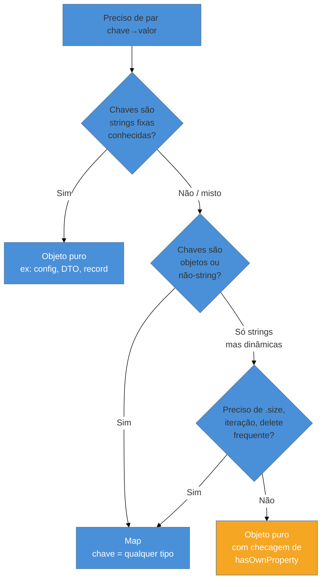
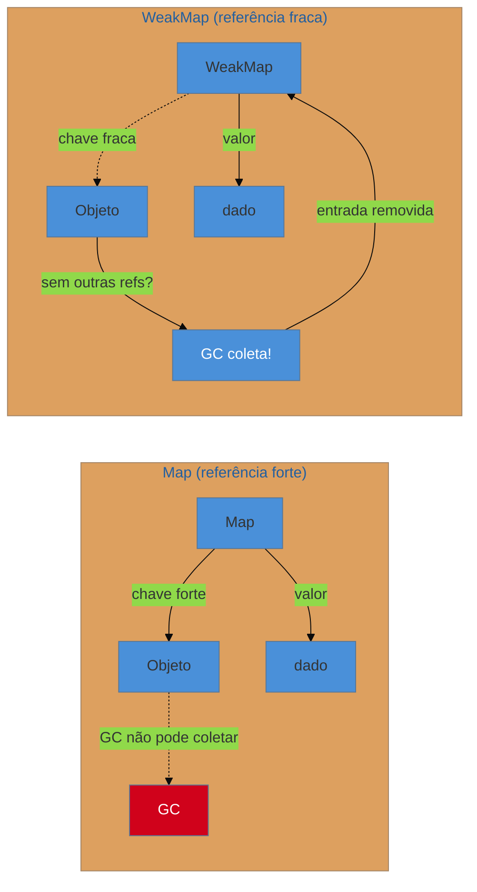

# Map, Set, WeakMap, WeakSet

> [!abstract] TL;DR
> `Map` e `Set` são coleções de primeira classe do JavaScript: `Map` guarda pares chave→valor onde a chave pode ser qualquer tipo (inclusive objetos e funções), `Set` guarda valores únicos. Ambos preservam ordem de inserção e são nativamente iteráveis. `WeakMap` e `WeakSet` são variantes com chaves "fracas" — o GC pode coletar o objeto-chave quando não houver mais nenhuma referência fora da coleção, evitando memory leaks. O trade-off é não serem iteráveis. Use `Map` quando as chaves não são strings simples ou quando você precisa de `.size`; use `Set` para dedupe e operações de conjunto; use `WeakMap`/`WeakSet` para metadados ou caches atrelados ao ciclo de vida de objetos externos.

---

Você já se pegou usando um objeto JavaScript puro como dicionário — `{}` — guardando dados com chaves dinâmicas? Provavelmente sim. E provavelmente já encontrou um dos bugs clássicos que isso cria: `obj["constructor"]` ou `obj["__proto__"]` retornam coisas inesperadas, `.length` não existe, você precisa de `Object.keys()` só para iterar, e deletar propriedades com o operador `delete` é notoriamente lento.

O ES6 resolveu esses problemas com estruturas de dados dedicadas. `Map` e `Set` são coleções de propósito específico, sem os acidentes históricos do objeto puro. `WeakMap` e `WeakSet` vão além: eles não impedem o garbage collector de limpar objetos que não são mais necessários — uma propriedade crucial quando você quer caches ou metadados que "desaparecem" automaticamente junto com o objeto ao qual estavam ligados.

---

## Map — o dicionário sem surpresas

Imagine uma agenda de contatos. Com um objeto puro, a chave é sempre uma string — mesmo se você escrever `obj[42] = "fulano"`, o JavaScript converte `42` para `"42"` silenciosamente. Com `Map`, a chave é o valor exato que você passou. Um número é um número. Um objeto é aquele objeto específico — identidade por referência.

```js
const mapa = new Map();

// Qualquer tipo como chave
mapa.set("nome", "Alice");
mapa.set(42, "a resposta");
mapa.set(true, "booleano como chave");

const chaveObjeto = { id: 1 };
mapa.set(chaveObjeto, "metadata do objeto");

console.log(mapa.get(42));           // "a resposta"
console.log(mapa.get(chaveObjeto));  // "metadata do objeto"
console.log(mapa.size);              // 4
```

A API completa do `Map`:

```js
const m = new Map([["a", 1], ["b", 2]]);  // inicialização com array de pares

m.set("c", 3);          // adiciona/atualiza
m.get("a");             // 1
m.has("b");             // true
m.delete("b");          // remove; retorna true se existia
m.size;                 // 2

// Iteração — preserva ordem de inserção
for (const [chave, valor] of m) { /* ... */ }
m.forEach((valor, chave) => { /* ... */ });

// Extraindo iteradores separados
[...m.keys()]    // ["a", "c"]
[...m.values()]  // [1, 3]
[...m.entries()] // [["a",1], ["c",3]]

m.clear();  // remove tudo
```

### Como a igualdade de chaves funciona

Map usa o algoritmo **SameValueZero** para comparar chaves — quase idêntico a `===`, com uma diferença: `NaN === NaN` é `false` no JS normal, mas no SameValueZero `NaN` é igual a `NaN`. Isso significa que você pode usar `NaN` como chave de Map de forma confiável.

```js
const m = new Map();
m.set(NaN, "sim");
console.log(m.get(NaN));  // "sim" — funciona!
console.log(NaN === NaN); // false — mas Map não usa ===
```

Para objetos, a comparação é por **identidade de referência**: dois objetos `{x: 1}` e `{x: 1}` são chaves diferentes mesmo com conteúdo igual.

```js
m.set({x: 1}, "primeiro");
m.set({x: 1}, "segundo");
console.log(m.size);  // 2 — são objetos diferentes!
```

### Map.groupBy — ES2024

O ES2024 trouxe `Map.groupBy()` (e seu irmão `Object.groupBy()`), um utilitário estático para agrupar elementos de um iterável:

```js
const pessoas = [
  { nome: "Alice", depto: "Eng" },
  { nome: "Bob",   depto: "Design" },
  { nome: "Carol", depto: "Eng" },
];

const porDepto = Map.groupBy(pessoas, p => p.depto);
// Map { "Eng" => [Alice, Carol], "Design" => [Bob] }

// Diferença de Object.groupBy: as chaves do Map podem ser objetos
const objKey = { tipo: "senior" };
const porNivel = Map.groupBy(pessoas, p => objKey);  // chave objeto, não string
```

Use `Map.groupBy` quando a chave de agrupamento pode ser um objeto (não apenas string); use `Object.groupBy` quando strings são suficientes e você quer o resultado como objeto puro.

---

## Map vs Objeto — quando usar cada um

Essa é a dúvida prática que aparece todo dia. A regra geral: use objeto quando os campos são conhecidos em tempo de design (estrutura fixa, tipo `{ nome, email, idade }`); use `Map` quando os dados são dinâmicos (chaves desconhecidas em tempo de compilação, ou chaves não-string).



| Aspecto | Objeto puro | Map |
|---------|-------------|-----|
| Tipo das chaves | Somente string/Symbol | Qualquer tipo |
| Tamanho | Manual (`Object.keys().length`) | `.size` nativo |
| Ordem das chaves | Não garantida (exceto inteiros) | Inserção garantida |
| Iteração | `Object.entries()`, `for...in` | `for...of`, `.forEach()` |
| `delete` performance | Lento (deoptimiza a engine) | `m.delete(k)` rápido |
| Prototype pollution | Risco real (`__proto__`, `constructor`) | Nenhum |
| JSON | `JSON.stringify()` nativo | Requer serialização manual |
| Casos de uso ideais | Config, DTOs, records, estado React | Cache, índices, contagem de frequência |

---

## Set — a lista sem duplicatas

Se você já escreveu `[...new Set(arr)]` para dedupe um array, você já usou `Set` de forma intuitiva. A ideia central: um `Set` é uma coleção que garante que cada valor aparece no máximo uma vez. Tentar adicionar um valor que já existe é simplesmente ignorado.

```js
const s = new Set([1, 2, 3, 2, 1]);
console.log(s.size);          // 3 — duplicatas removidas
console.log([...s]);          // [1, 2, 3]

s.add(4);
s.has(3);   // true
s.delete(2);
s.size;     // 3

// Iteração
for (const v of s) { /* ... */ }
[...s.values()]   // [1, 3, 4]
```

Como o `Map`, o `Set` usa SameValueZero para comparação — e os objetos são comparados por referência:

```js
const s = new Set();
s.add({x: 1});
s.add({x: 1});
console.log(s.size);  // 2 — objetos diferentes mesmo com conteúdo igual
```

### Novos métodos de conjunto — ES2025

O ES2025 adicionou métodos nativos para operações de teoria dos conjuntos. Antes você precisava implementar essas operações manualmente com loops; agora são métodos de primeira classe:

```js
const a = new Set([1, 2, 3, 4]);
const b = new Set([3, 4, 5, 6]);

// União: todos os elementos de ambos
a.union(b);               // Set {1, 2, 3, 4, 5, 6}

// Interseção: apenas os que aparecem nos dois
a.intersection(b);        // Set {3, 4}

// Diferença: em 'a' mas não em 'b'
a.difference(b);          // Set {1, 2}

// Diferença simétrica: em um OU outro, mas não em ambos
a.symmetricDifference(b); // Set {1, 2, 5, 6}

// Predicados booleanos
a.isSubsetOf(b);          // false
a.isSupersetOf(b);        // false
a.isDisjointFrom(b);      // false (têm 3 e 4 em comum)
```

Detalhe importante: esses métodos aceitam qualquer **iterável** como argumento — não precisa ser outro `Set`. Você pode passar um array diretamente:

```js
a.union([5, 6, 7]);  // Set {1, 2, 3, 4, 5, 6, 7} — array funciona!
```

Todos retornam um novo `Set`; nenhum modifica o original.

---

## WeakMap e WeakSet — memória que se libera sozinha

Aqui a analogia com o mundo físico ajuda: imagine um post-it colado num documento. Enquanto o documento existe, o post-it faz sentido. Mas se o documento é destruído (jogado fora), o post-it não precisa mais existir — ele não *segura* o documento no mundo.

`WeakMap` e `WeakSet` funcionam assim. As chaves (no `WeakMap`) ou os valores (no `WeakSet`) são referências **fracas** — elas não contam como "alguém está usando este objeto" do ponto de vista do garbage collector. Se o único lugar que mantém um objeto vivo é um `WeakMap`, o GC pode (e vai) coletar esse objeto.

```js
const cache = new WeakMap();

function processarDom(elemento) {
  if (cache.has(elemento)) {
    return cache.get(elemento);
  }
  const resultado = /* computação cara */ elemento.innerHTML.toUpperCase();
  cache.set(elemento, resultado);  // chave = objeto DOM
  return resultado;
}

// Quando o elemento é removido do DOM e não tem mais referências,
// o GC coleta o elemento E a entrada correspondente no cache.
// Sem WeakMap, o cache seguraria o elemento vivo para sempre.
```

A diferença fundamental em relação à memória — explicada com a tipologia de referência:



### Por que WeakMap/WeakSet não são iteráveis

Essa é uma das perguntas de entrevista clássicas sobre o tema — e a resposta revela o design elegante dessas estruturas.

> [!question]- Por que você não pode iterar um WeakMap?
> Porque o estado interno de um `WeakMap` é **não-determinístico do ponto de vista do programa**. O GC pode coletar uma chave e remover a entrada correspondente a qualquer momento, entre duas linhas do seu código. Se `WeakMap` fosse iterável, você poderia observar esse estado intermediário — o que quebraria a garantia de consistência do GC. A não-iterabilidade não é uma limitação acidental; é o contrato que torna possível a coleta fraca.

Consequências práticas:
- `WeakMap` não tem `.size`, `.keys()`, `.values()`, `.entries()`, `.forEach()` ou `.clear()`
- `WeakSet` não tem `.size`, `.values()`, `.forEach()` ou `.clear()`
- As únicas operações disponíveis são `.get()/.set()/.has()/.delete()` (WeakMap) e `.add()/.has()/.delete()` (WeakSet)

### WeakRef e FinalizationRegistry (ES2021)

Para casos onde você precisa de mais controle (saber quando um objeto foi coletado), o ES2021 adicionou `WeakRef` e `FinalizationRegistry`. Eles ficam fora do escopo desta nota — mas o princípio é o mesmo: referência fraca que não impede o GC. Detalhes em `[[21 - Memory management]]` quando disponível.

---

## Comparação geral: as quatro estruturas

| | `Map` | `Set` | `WeakMap` | `WeakSet` |
|--|-------|-------|-----------|-----------|
| Armazena | pares chave→valor | valores únicos | pares chave→valor | objetos únicos |
| Tipo das chaves/valores | qualquer | qualquer | apenas objetos | apenas objetos |
| Referência | forte | forte | fraca | fraca |
| Iterável? | Sim | Sim | **Não** | **Não** |
| `.size` | Sim | Sim | **Não** | **Não** |
| GC pode coletar? | Não | Não | **Sim** | **Sim** |
| Caso de uso típico | dicionário dinâmico | conjunto único | cache/metadados | rastrear objetos |

---

## Casos práticos

### Cenário 1 — Dedupe de tags com Set

Imagine um sistema de CMS onde o usuário pode adicionar tags a um post, mas a API recebe tags de múltiplas fontes (seleção manual, sugestão automática, importação de legado). Duplicatas são comuns e precisam ser eliminadas antes de salvar:

```js
function normalizarTags(tagsManuais, tagsAutomaticas, tagsLegado) {
  // Cada fonte pode ter duplicatas internas e entre fontes
  const todas = new Set([
    ...tagsManuais.map(t => t.toLowerCase().trim()),
    ...tagsAutomaticas.map(t => t.toLowerCase().trim()),
    ...tagsLegado.map(t => t.toLowerCase().trim()),
  ]);

  return [...todas];  // Array limpo, sem duplicatas
}

const resultado = normalizarTags(
  ["JavaScript", "javascript", " Node "],
  ["Node", "React"],
  ["javascript", "React"]
);
// ["javascript", "node", "react"]
```

Com ES2025, operações de conjunto ficam ainda mais expressivas:

```js
const tagsObrigatorias = new Set(["javascript", "tutorial"]);
const tagsDoUsuario = new Set(["javascript", "react", "avancado"]);

// Tags que o usuário adicionou além das obrigatórias
const tagsExtras = tagsDoUsuario.difference(tagsObrigatorias);
// Set {"react", "avancado"}

// Todas as tags para salvar
const tagsFinal = tagsDoUsuario.union(tagsObrigatorias);
// Set {"javascript", "react", "avancado", "tutorial"}
```

### Cenário 2 — Cache de computação com WeakMap

Você tem uma função que faz cálculos caros sobre objetos DOM (ou qualquer objeto JS de ciclo de vida externo). Quer memoizar os resultados sem correr o risco de segurar os elementos DOM na memória após eles serem removidos do documento:

```js
const resultadosCache = new WeakMap();

function analisarElemento(el) {
  if (resultadosCache.has(el)) {
    return resultadosCache.get(el);
  }

  // Computação cara: mede dimensões, calcula estilos computados, etc.
  const analise = {
    area: el.offsetWidth * el.offsetHeight,
    visivel: el.getBoundingClientRect().top < window.innerHeight,
    classesParsed: [...el.classList].reduce((acc, c) => {
      acc[c] = true;
      return acc;
    }, {}),
  };

  resultadosCache.set(el, analise);
  return analise;
}

// Quando el é removido do DOM:
// document.querySelector("#card").remove();
// → sem mais referências → GC coleta `el` → entrada some do WeakMap
// → sem leak de memória, mesmo com muitos elementos passando pelo cache
```

Com `Map` em vez de `WeakMap`, cada elemento removido do DOM permaneceria preso na memória enquanto o cache existisse — uma fonte clássica de memory leak em SPAs que re-renderizam listas.

### Cenário 3 — Metadados privados com WeakMap

Antes das classes suportarem campos privados (`#campo`), `WeakMap` era a técnica canônica para encapsular estado privado:

```js
const _privado = new WeakMap();

class Contador {
  constructor(inicio = 0) {
    _privado.set(this, { valor: inicio, historico: [] });
  }

  incrementar(n = 1) {
    const estado = _privado.get(this);
    estado.historico.push(estado.valor);
    estado.valor += n;
  }

  get valor() {
    return _privado.get(this).valor;
  }

  get historico() {
    return [..._privado.get(this).historico];  // cópia defensiva
  }
}

const c = new Contador(10);
c.incrementar(5);
console.log(c.valor);     // 15
console.log(c.historico); // [10]
// c._privado → undefined; não acessível externamente
```

Hoje em dia, `#campos` privados nativos são preferíveis para essa finalidade. `WeakMap` ainda é relevante quando o estado precisa ser gerenciado fora da classe (ex.: bibliotecas que instrumentam objetos de terceiros sem acesso ao código-fonte).

---

## Performance: Map vs objeto em hot paths

> [!tip] Regra prática
> Para leituras/escritas simples com chaves string em código que roda uma vez, a diferença é negligenciável. Em hot paths — loops de milhares de iterações, processamento de streams, algoritmos de grafos — `Map` costuma vencer por duas razões: estrutura interna dedicada e ausência de prototype chain.

Engines modernas como V8 otimizam objetos "monomorph" (forma fixa) de forma agressiva usando inline caches. Quando você usa um objeto como dicionário dinâmico — adicionando e removendo propriedades em runtime — a engine precisa fazer transições de forma ("hidden class transitions"), o que deoptimiza o inline cache e gera overhead.

`Map` não tem esse problema: sua estrutura interna é uma hash table dedicada, sem o maquinário de prototype e sem transições de forma.

```js
// Benchmark ilustrativo: inserção + leitura em 100k operações
// (números aproximados, variam por engine e carga do sistema)

// Objeto como dicionário dinâmico
const obj = {};
for (let i = 0; i < 100_000; i++) {
  obj[`key_${i}`] = i;       // hidden class transition a cada inserção
}
for (let i = 0; i < 100_000; i++) {
  const v = obj[`key_${i}`]; // prototype chain lookup
}

// Map
const m = new Map();
for (let i = 0; i < 100_000; i++) {
  m.set(`key_${i}`, i);       // hash table insert, sem transições
}
for (let i = 0; i < 100_000; i++) {
  const v = m.get(`key_${i}`); // hash table lookup direto
}
```

Em benchmarks do V8 (Node.js 20+), `Map` é ~20-40% mais rápido que objeto para dicionários dinâmicos com muitas inserções e deleções. Para objetos com forma fixa conhecida em tempo de compilação, objetos são mais rápidos — a engine os especializa como structs.

O operador `delete` em objetos é especialmente problemático: ele causa deoptimização permanente da hidden class, degradando leituras subsequentes. `Map.delete()` nunca tem esse efeito.

```js
// Padrão anti-performance com objetos
const cache = {};
cache["key1"] = computar();
delete cache["key1"];  // ⚠️ deoptimiza o objeto permanentemente
cache["key2"] = computar();  // mais lento agora

// Alternativa correta
const cache = new Map();
cache.set("key1", computar());
cache.delete("key1");  // sem deoptimização
cache.set("key2", computar());
```

### Map como cache LRU

Um padrão sênior relevante: `Map` preserva **ordem de inserção**, o que o torna a base perfeita para uma LRU (Least Recently Used) cache com API mínima. A técnica consiste em mover a chave acessada para o fim do Map (deletar e reinserir) para que o início sempre represente o elemento menos recentemente usado:

```js
class LRUCache {
  #cache;
  #capacidade;

  constructor(capacidade) {
    this.#cache = new Map();
    this.#capacidade = capacidade;
  }

  get(chave) {
    if (!this.#cache.has(chave)) return undefined;
    const valor = this.#cache.get(chave);
    // Mover para o fim = marcar como "mais recentemente usado"
    this.#cache.delete(chave);
    this.#cache.set(chave, valor);
    return valor;
  }

  set(chave, valor) {
    if (this.#cache.has(chave)) {
      this.#cache.delete(chave);  // remove posição antiga
    } else if (this.#cache.size >= this.#capacidade) {
      // O primeiro elemento é o menos recente (LRU) — expira
      const chaveAntiga = this.#cache.keys().next().value;
      this.#cache.delete(chaveAntiga);
    }
    this.#cache.set(chave, valor);
  }

  get size() { return this.#cache.size; }
}

const lru = new LRUCache(3);
lru.set("a", 1);
lru.set("b", 2);
lru.set("c", 3);
lru.get("a");     // acessa "a" → move para o fim
lru.set("d", 4);  // capacidade cheia → expira "b" (LRU, primeiro do Map)
console.log(lru.get("b")); // undefined — foi expirado
console.log(lru.get("a")); // 1 — ainda presente
```

Essa implementação é O(1) para `get` e `set` porque `Map.delete` + `Map.set` são ambas operações constantes, e `Map.keys().next()` acessa o primeiro elemento em O(1) também.

---

## Serialização de Map e Set: o que JSON não vê

> [!warning] `JSON.stringify` ignora Map e Set silenciosamente
> `JSON.stringify(new Map([["a", 1]]))` retorna `"{}"` — o objeto vazio. Não lança erro, não avisa, simplesmente descarta tudo. O mesmo vale para `Set`: `JSON.stringify(new Set([1,2,3]))` retorna `"{}"`.

### Por que JSON não suporta Map e Set

`JSON.stringify` serializa objetos percorrendo suas propriedades enumeráveis. `Map` e `Set` não armazenam dados como propriedades enumeráveis — eles usam estruturas internas da engine. Do ponto de vista do JSON, são objetos vazios com um prototype especial.

```js
// Armadilha silenciosa
const dados = new Map([["usuario", "Alice"], ["pontos", 42]]);
const json = JSON.stringify(dados);
console.log(json);         // "{}"  ← dados perdidos!
JSON.parse(json);          // {}    ← Map não foi restaurado

// Set igualmente problemático
const tags = new Set(["js", "node", "ts"]);
JSON.stringify(tags);      // "{}"  ← silêncio total
```

### structuredClone: a alternativa correta para cópia profunda

`structuredClone()` (ES2022, disponível em Node 17+ e todos os browsers modernos) usa o algoritmo Structured Clone — o mesmo que o browser usa para `postMessage` e Web Workers. Ele entende `Map`, `Set`, `Date`, `ArrayBuffer`, `RegExp` e muitos outros tipos que JSON não suporta:

```js
const original = new Map([
  ["config", new Set(["debug", "verbose"])],
  ["data", [1, 2, 3]],
]);

// JSON falha silenciosamente
const perdido = JSON.parse(JSON.stringify(original)); // {}

// structuredClone funciona corretamente
const copia = structuredClone(original);
console.log(copia.get("config")); // Set {"debug", "verbose"}
console.log(copia.get("data"));   // [1, 2, 3]

// Cópia PROFUNDA: modificar a cópia não afeta o original
copia.get("data").push(4);
original.get("data"); // [1, 2, 3] — original intacto
```

### Serialização manual quando JSON é obrigatório

Quando você precisa serializar Map/Set para JSON (API externa, localStorage, etc.), a abordagem padrão é converter para estruturas que JSON entende:

```js
// Map → JSON
function serializarMap(m) {
  return JSON.stringify([...m.entries()]); // array de pares [chave, valor]
}
function deserializarMap(json) {
  return new Map(JSON.parse(json));
}

// Set → JSON
function serializarSet(s) {
  return JSON.stringify([...s]); // array de valores
}
function deserializarSet(json) {
  return new Set(JSON.parse(json));
}

// Uso
const m = new Map([["a", 1], ["b", 2]]);
const json = serializarMap(m);           // '[["a",1],["b",2]]'
const restaurado = deserializarMap(json); // Map {"a" => 1, "b" => 2}
```

Para estruturas aninhadas (Map dentro de Map, Map com valores Set), use o replacer/reviver do JSON:

```js
// Serialização com tipo explícito para estruturas complexas
function replacer(chave, valor) {
  if (valor instanceof Map) {
    return { __tipo__: "Map", dados: [...valor.entries()] };
  }
  if (valor instanceof Set) {
    return { __tipo__: "Set", dados: [...valor] };
  }
  return valor;
}

function reviver(chave, valor) {
  if (valor?.__tipo__ === "Map") return new Map(valor.dados);
  if (valor?.__tipo__ === "Set") return new Set(valor.dados);
  return valor;
}

const complexo = new Map([
  ["tags", new Set(["js", "ts"])],
  ["config", new Map([["debug", true]])],
]);

const json = JSON.stringify(complexo, replacer);
const restaurado = JSON.parse(json, reviver);
console.log(restaurado.get("tags")); // Set {"js", "ts"}
```

> [!tip] Quando usar cada abordagem
> - **structuredClone**: cópia profunda interna (mesma aba/worker, sem rede)
> - **Serialização manual com array de entries**: API REST ou localStorage com Map simples
> - **replacer/reviver**: estruturas aninhadas complexas que precisam sobreviver ao JSON

---

## Armadilhas comuns

> [!warning] Comparar objetos por valor no Map/Set
> **O que acontece:** `mapa.get({id: 1})` retorna `undefined` mesmo que você tenha feito `mapa.set({id: 1}, "dado")` antes.
> **Por quê:** Map e Set usam identidade de referência para objetos. `{id: 1}` e `{id: 1}` são dois objetos diferentes na memória — SameValueZero retorna `false` para eles.
> **Como evitar:** Use primitivos como chaves quando quiser comparação por valor. Para chaves compostas, serialize para string (`JSON.stringify({id: 1})`) ou use uma biblioteca de estruturas imutáveis que forneça igualdade por valor.

> [!warning] Tentar guardar primitivos no WeakMap/WeakSet
> **O que acontece:** `weakMap.set("chave", valor)` lança `TypeError: Invalid value used as weak map key`.
> **Por quê:** A semântica de chave fraca pressupõe que a chave é um objeto com identidade de referência rastreável pelo GC. Primitivos são imutáveis e não têm identidade rastreável — não há "destruição" de uma string para o GC notificar.
> **Como evitar:** Use apenas objetos (incluindo funções, arrays, instâncias de classe) como chaves de `WeakMap`/valores de `WeakSet`. Para primitivos, use `Map`/`Set`.

> [!warning] Assumir que WeakMap é só "Map mais leve"
> **O que acontece:** Código que depende de `.size`, iteração ou `Object.keys()` em um `WeakMap` quebra — essas APIs simplesmente não existem.
> **Por quê:** Não é uma questão de performance — é um design intencional que garante a não-observabilidade do estado do GC. `WeakMap` não é um `Map` com features removidas; é uma estrutura com semântica fundamentalmente diferente.
> **Como evitar:** Entenda o uso antes de escolher: WeakMap é para ciclo de vida atrelado, não para dicionários comuns. Se precisar de `.size` ou iteração, use `Map`.

> [!warning] Usar Set para deduplicar objetos por conteúdo
> **O que acontece:** `new Set([{x:1}, {x:1}])` retorna um Set com dois elementos, não um.
> **Por quê:** Mesma razão do aviso anterior — objetos são comparados por referência.
> **Como evitar:** Para deduplicar objetos por conteúdo, serialize para string antes: `new Set(arr.map(JSON.stringify))` — e desserialize depois se necessário. Para estruturas complexas, considere uma chave composta (ex.: `obj.id`).

> [!warning] Esquecer que Map.groupBy e Set methods são ES2024/2025
> **O que acontece:** `TypeError: a.union is not a function` em ambientes com Node.js antigo (< 22) ou browsers não atualizados.
> **Por quê:** `Set.prototype.union/intersection/difference` são ES2025; `Map.groupBy` é ES2024. V8 implementou Set methods no Chrome 122 / Node 22; Safari 17 também suporta.
> **Como evitar:** Verifique o target de compilação do seu projeto. Para Node < 22 ou ambientes legados, use polyfill do `core-js`. Para TypeScript, garanta `lib: ["ES2025"]` no tsconfig.

---

## Como explicar em inglês

`Map` gives you a key-value collection where any value — object, number, function — can be a key, unlike plain objects which coerce everything to strings. `Set` enforces uniqueness: adding a duplicate is simply ignored, and as of ES2025, it has native union, intersection, and difference methods. `WeakMap` and `WeakSet` hold their references weakly, meaning the garbage collector can reclaim those objects when nothing else points to them — that's what makes them non-iterable, since their contents can change at any GC cycle.

| PT | EN |
|----|----|
| coleção de chave-valor | key-value collection |
| chave de qualquer tipo | key of any type |
| valores únicos | unique values |
| deduplificação | deduplication |
| referência fraca | weak reference |
| coleta de lixo / GC | garbage collection |
| tamanho / cardinalidade | size / cardinality |
| ordem de inserção | insertion order |
| identidade por referência | reference identity |
| algoritmo SameValueZero | SameValueZero algorithm |
| metadados privados | private metadata |
| vazamento de memória | memory leak |
| interseção de conjuntos | set intersection |
| união de conjuntos | set union |
| diferença de conjuntos | set difference |

---

## Map em uma frase

`Map` é um `Object` sem acidentes históricos: chaves de qualquer tipo, ordem de inserção garantida, `.size` nativo e `delete` rápido.

`Set` em uma frase: uma lista que rejeita duplicatas por design — com ES2025, ela também faz teoria dos conjuntos nativamente.

`WeakMap` em uma frase: um cache que não segura objetos na memória, porque sua referência às chaves não conta para o garbage collector.

---

## O que vem a seguir

Você agora tem as ferramentas de coleção do JavaScript moderno. O próximo passo natural é entender **como essas coleções se comportam na fronteira assíncrona** — quando Map e Set precisam ser atualizados de forma concorrente, ou quando WeakMap é usado em generators e iteradores lazy.

- `[[07 - Objetos]]` — a base que antecede Map: prototype chain, property descriptors, como objetos puros funcionam internamente e por que Map os supera em casos dinâmicos
- `[[20 - Cópia, serialização e imutabilidade]]` — aprofunda structuredClone, JSON replacer/reviver, e o espectro cópia-rasa vs cópia-profunda em todo o ecossistema JS
- `[[21 - Memory management]]` — WeakRef, FinalizationRegistry e como o GC do V8 trata referências fracas na prática
- `[[08 - Arrays e métodos]]` — complemento natural: Arrays são a estrutura iterável mais próxima de Set, e a interação Array↔Map é frequente em pipelines de dados
- `[[Dicionário de JavaScript]]` — glossário com termos-chave da linguagem usados nesta nota: SameValueZero, structuredClone, referência fraca

---

## Referências

- **MDN Web Docs** — [*Map*](https://developer.mozilla.org/en-US/docs/Web/JavaScript/Reference/Global_Objects/Map) — documentação de referência completa com exemplos e compatibilidade
- **MDN Web Docs** — [*WeakMap*](https://developer.mozilla.org/en-US/docs/Web/JavaScript/Reference/Global_Objects/WeakMap) — explica a semântica de chave fraca e casos de uso
- **MDN Web Docs** — [*Map.groupBy()*](https://developer.mozilla.org/en-US/docs/Web/JavaScript/Reference/Global_Objects/Map/groupBy) — ES2024, agrupamento com chaves de qualquer tipo
- **TC39** — [*proposal-set-methods*](https://github.com/tc39/proposal-set-methods) — proposta original dos métodos de conjunto (ES2025, Stage 4)
- **Sonar** — [*Union, intersection, difference are coming to JavaScript Sets*](https://www.sonarsource.com/blog/union-intersection-difference-javascript-sets/) — análise prática dos novos métodos com exemplos
- **Builder.io (Steve Sewell)** — [*Use Maps More and Objects Less*](https://www.builder.io/blog/maps) — argumentos práticos para preferir Map em código de produção
- **javascript.info** — [*WeakMap and WeakSet*](https://javascript.info/weakmap-weakset) — explicação com analogias e casos de uso canônicos
- **MDN Web Docs** — [*structuredClone()*](https://developer.mozilla.org/en-US/docs/Web/API/structuredClone) — API de cópia profunda que suporta Map, Set e outros tipos não cobertos pelo JSON
- **V8 Blog** — [*Elements kinds in V8*](https://v8.dev/blog/elements-kinds) — explica hidden class transitions e por que deleção de propriedades em objetos degrada performance
- **Jake Archibald / web.dev** — [*Structured clone*](https://web.dev/articles/structured-clone) — guia sobre o algoritmo Structured Clone e diferenças com JSON e outros métodos de cópia
