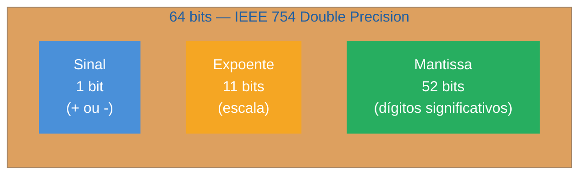

# 13 - Números, BigInt e precisão

> [!abstract] TL;DR
> JavaScript tem **um único tipo numérico** (`number`) baseado em IEEE 754 de 64 bits — o que significa que `0.1 + 0.2` não é `0.3`, e que inteiros acima de `2⁵³ − 1` perdem precisão silenciosamente. Para aritmética monetária, use centavos (inteiros) ou bibliotecas como `decimal.js`. Para IDs grandes e criptografia, use `BigInt` — mas lembre: `BigInt` e `number` não se misturam em operações. `NaN`, `Infinity` e `-0` são valores válidos com comportamentos contraintuitivos que exigem atenção especial.

---

Você está escrevendo o backend de um e-commerce. O carrinho soma os preços, arredonda e exibe. Tudo parece funcionar. Então um cliente se queixa: adicionou três itens de R$0,10 cada e o sistema cobra R$0,30000000000000004. O bug não está na sua lógica — está nos alicerces matemáticos da linguagem.

Esse é o bug mais famoso do JavaScript, e ele não é um erro: é uma consequência direta da decisão de representar todos os números usando o padrão IEEE 754 de precisão dupla. Entender por que isso acontece — e como evitar — é o que separa código que funciona em produção de código que surpreende no pior momento.

---

## Como o JavaScript armazena números

Antes de corrigir o problema, vale entender o mecanismo. JavaScript usa **um único tipo numérico** para tudo: inteiros, decimais, `Infinity`, `NaN`. Todos são armazenados no mesmo formato de 64 bits definido pelo padrão [[Dicionário de JavaScript#IEEE 754|IEEE 754]].

Esses 64 bits são divididos em três campos:



A fórmula é: `valor = (-1)^sinal × 2^(expoente-1023) × 1.mantissa`

O campo de mantissa tem 52 bits explícitos (mais 1 bit implícito), dando ~15–17 dígitos decimais significativos. O problema? **Nem todo decimal base-10 tem representação exata em base-2.**

### Por que 0.1 não existe em binário

Pense em 1/3 em decimal: `0.333...` — nunca termina. O mesmo acontece com 0.1 em binário:

```
0.1 (base 10) = 0.0001100110011001100110011... (base 2, infinito)
```

O IEEE 754 **trunca** essa sequência infinita nos 52 bits disponíveis. O valor armazenado é o número mais próximo representável, não exatamente 0.1. Quando você soma dois valores com erros de truncamento distintos, os erros se acumulam:

```javascript
console.log(0.1 + 0.2);       // 0.30000000000000004
console.log(0.1 + 0.2 === 0.3); // false
```

> [!question]- Mas `0.5 + 0.5 === 1.0`... por que alguns decimais funcionam?
> Porque `0.5` em binário é `0.1` — uma potência de 2 exata (`2⁻¹`). O IEEE 754 representa potências de 2 e suas somas exatamente. `0.25` (2⁻²), `0.125` (2⁻³), e combinações desses também são exatas. O problema ocorre apenas com frações cujo denominador em mínima expressão tem fatores primos além de 2 — como 10 = 2 × 5.

---

## Lidando com precisão em ponto flutuante

### Estratégia 1: comparar com epsilon

`Number.EPSILON` é a menor diferença representável entre 1.0 e o próximo número maior. Você pode usá-lo como tolerância em comparações:

```javascript
function isEqual(a, b, epsilon = Number.EPSILON) {
  return Math.abs(a - b) <= epsilon * Math.max(Math.abs(a), Math.abs(b));
}

isEqual(0.1 + 0.2, 0.3); // true
```

Cuidado: `Number.EPSILON` é precisamente `2^-52 ≈ 2.220446049250313e-16` — a diferença entre `1.0` e o próximo float64 acima de `1.0`. O equívoco mais comum é usar comparação absoluta bruta (`Math.abs(a - b) < Number.EPSILON`) para qualquer par de floats, mas isso só funciona para números próximos de 1. Na faixa de 1000, o gap entre floats adjacentes já é ~10^-13, maior que EPSILON — então valores que "deveriam ser iguais" falham na comparação. A função `isEqual` acima usa **epsilon relativo** (escala com `Math.max(|a|, |b|)`), que é o padrão correto para qualquer magnitude.

### Estratégia 2: aritmética em inteiros (centavos)

A estratégia mais robusta para dinheiro: armazene e opere sempre em centavos (inteiros), converta apenas na exibição:

```javascript
// ERRADO: float
const preco = 0.10; // R$0,10
const quantidade = 3;
const total = preco * quantidade; // 0.30000000000000004

// CORRETO: centavos
const precoCentavos = 10; // 10 centavos
const totalCentavos = precoCentavos * quantidade; // 30 (exato)
const totalReais = totalCentavos / 100; // 0.30 (só para exibição)
```

### Estratégia 3: bibliotecas de decimal

Para cálculos financeiros complexos (juros compostos, porcentagens, arredondamentos bancários), use uma biblioteca:

- **`decimal.js`** — implementação completa de Decimal128, imutável, 28 dígitos significativos
- **`big.js`** — mais leve, foco em aritmética de ponto fixo
- **`dinero.js`** — especializada em moedas, inclui localização

```javascript
import Decimal from 'decimal.js';

const a = new Decimal('0.1');
const b = new Decimal('0.2');
console.log(a.plus(b).toString()); // "0.3" — exato
```

> [!info] Proposta TC39: Decimal nativo
> O TC39 mantém a proposta **`proposal-decimal`** (Stage 1 — confirmado até a plenária de maio/2025), baseada em IEEE 754-2019 Decimal128 (34 dígitos significativos). Três decisões arquiteturais importantes foram consolidadas em 2025: (1) **BigDecimal foi explicitamente rejeitado** em favor de Decimal128 por questões de interop e hardware; (2) o **sufixo literal `1.5m` foi abandonado** pelos implementadores de engines — aritmética usará métodos explícitos (`.add()`, `.multiply()`); (3) o companion proposal **`proposal-amount`** (Decimal com metadados de precisão para i18n) chegou a Stage 2 em 2025, mas as propostas foram mantidas separadas. Não dependa de Decimal nativo para código de produção.

---

## Number.MAX_SAFE_INTEGER e a perda silenciosa

O campo de mantissa de 52 bits (+ 1 implícito) permite representar inteiros exatamente até `2⁵³ − 1`:

```javascript
console.log(Number.MAX_SAFE_INTEGER);  // 9007199254740991
console.log(Number.MIN_SAFE_INTEGER);  // -9007199254740991

// Dentro do safe range: exato
9007199254740991 + 1 === 9007199254740992; // true

// Fora do safe range: perde precisão SILENCIOSAMENTE
9007199254740992 + 1 === 9007199254740992; // true — o +1 desapareceu!
9007199254740993 === 9007199254740992;      // true — dois números "iguais" distintos
```

Para verificar se um número está no range seguro:

```javascript
Number.isSafeInteger(9007199254740991); // true
Number.isSafeInteger(9007199254740992); // false
```

Cenários onde isso é crítico: IDs de banco de dados (especialmente IDs de sistemas legados ou snowflake), timestamps em microsegundos, cálculos criptográficos. Em todos esses casos, use `BigInt`.

---

## [[Dicionário de JavaScript#BigInt|BigInt]] — inteiros sem limite de precisão

`BigInt` (introduzido no ES2020) resolve exatamente o problema de precisão em inteiros grandes. Ele representa inteiros com precisão arbitrária, sem teto.

```javascript
// Criação
const grande = 9007199254740993n;          // literal com sufixo n
const outra  = BigInt("9007199254740993"); // via construtor (útil com strings da API)

// Aritmética exata
9007199254740991n + 2n === 9007199254740993n; // true — exato!
```

### Limites e restrições

```javascript
// BigInt NÃO suporta decimais
3n / 2n; // 1n — trunca, não arredonda

// NÃO mistura com number em operações
3n + 2;   // TypeError: Cannot mix BigInt and other types
3n + 2n;  // 5n — correto

// Comparação com == funciona (coerção), === não
3n == 3;  // true  (coerção implícita)
3n === 3; // false (tipos diferentes)

// JSON não suporta BigInt
JSON.stringify(3n); // TypeError: Do not know how to serialize a BigInt
```

> [!question]- Quando usar BigInt vs number?
> Regra prática: use `number` para tudo que envolve cálculo com decimais ou que está dentro de `2⁵³ − 1`. Use `BigInt` quando precisar de inteiros maiores que `MAX_SAFE_INTEGER`, IDs de sistemas externos (Twitter Snowflake IDs, UUIDs numéricos), criptografia (RSA, ECDSA, primos grandes) ou timestamps em nanossegundos.

---

## NaN, Infinity e -0

Esses três valores especiais fazem parte do padrão IEEE 754 e têm comportamentos que surpreendem quem os encontra pela primeira vez.

### [[Dicionário de JavaScript#NaN|NaN]] — Not a Number

```javascript
// Quando surge NaN
0 / 0;              // NaN
Math.sqrt(-1);      // NaN
Number("abc");      // NaN
undefined + 1;      // NaN

// A peculiaridade mais famosa: NaN !== NaN
NaN === NaN;        // false — único valor JS não igual a si mesmo
NaN !== NaN;        // true

// Como detectar corretamente
Number.isNaN(NaN);     // true  — correto, sem coerção
Number.isNaN("abc");   // false — string não é NaN
isNaN("abc");          // true  — PERIGOSO: coerce para number antes de testar
```

`NaN` é "contagioso": qualquer operação com `NaN` produz `NaN`. Se um cálculo retorna `NaN` inesperadamente, a causa pode estar muitas operações atrás. Curiosidade: `Map` e `Set` usam o algoritmo [[Dicionário de JavaScript#SameValueZero\|SameValueZero]], que considera `NaN === NaN` verdadeiro — então `NaN` funciona como chave de `Map` de forma previsível, ao contrário do `===` comum.

### Infinity

```javascript
1 / 0;              // Infinity
-1 / 0;             // -Infinity
Infinity + 1;       // Infinity
Infinity - Infinity; // NaN — indeterminação

Number.isFinite(Infinity);  // false
Number.isFinite(42);        // true
isFinite("42");             // true — PERIGOSO: coerce strings
```

### -0 (zero negativo)

```javascript
-0 === 0;           // true  — igualdade ignora o sinal
-0 > 0;             // false
-0 < 0;             // false
Object.is(-0, 0);   // false — única forma de distinguir

// O sinal do zero aparece em divisão
1 / -0;             // -Infinity
1 / 0;              // Infinity

// JSON apaga o sinal
JSON.stringify(-0); // "0"
```

`-0` surge naturalmente em física (velocidade aproximando-se de zero pelo lado negativo), animações e transformações de coordenadas. Na maioria dos casos é inofensivo, mas pode causar bugs em código que depende do sinal para detectar direção.

> [!info] Object.is() como comparador preciso
> `Object.is(a, b)` resolve duas anomalias do `===`: distingue `NaN` de si mesmo (`Object.is(NaN, NaN)` → `true`) e distingue `-0` de `+0` (`Object.is(-0, 0)` → `false`). Use em algoritmos que precisam de igualdade exata, sem coerção.

---

## Parsing de números

JavaScript oferece três funções para converter strings em números, com comportamentos distintos:

```javascript
// Number() — converte o valor inteiro
Number("42");       // 42
Number("3.14");     // 3.14
Number("");         // 0  — pegadinha!
Number("  ");       // 0  — espaços viram 0
Number("42px");     // NaN — falha se sobrar texto
Number(null);       // 0
Number(undefined);  // NaN
Number(true);       // 1
Number(false);      // 0

// parseInt() — lê até o primeiro caractere inválido; ignora resto
parseInt("42px");   // 42  — permissivo
parseInt("3.14");   // 3   — trunca decimal
parseInt("0xFF");   // 255 — lê hex automaticamente
parseInt("10", 2);  // 2   — segundo argumento é a base (radix)
parseInt("010");    // 10  — NÃO é octal em modo estrito (mas era em ES3!)

// parseFloat() — análogo ao parseInt para decimais
parseFloat("3.14px"); // 3.14
parseFloat("  3.14"); // 3.14 — ignora espaços iniciais
```

> [!question]- Quando usar `Number()` vs `parseInt()`/`parseFloat()`?
> Use `Number()` quando a string inteira deveria ser um número (validação rigorosa). Use `parseInt` / `parseFloat` quando quer extrair o prefixo numérico de uma string com unidades CSS, coordenadas de texto, etc. Sempre passe a radix para `parseInt` — `parseInt("08", 10)` — para evitar surpresas com interpretação octal em ambientes legados.

---

## Math

O objeto `Math` é um namespace estático com constantes e funções matemáticas:

```javascript
// Constantes
Math.PI;        // 3.141592653589793
Math.E;         // 2.718281828459045
Math.SQRT2;     // 1.4142135623730951
Math.LN2;       // 0.6931471805599453

// Arredondamento — quatro variantes que confundem
Math.round(4.5);  // 5  — arredonda para o inteiro mais próximo (metade para cima)
Math.floor(4.9);  // 4  — sempre para baixo (floor = chão)
Math.ceil(4.1);   // 5  — sempre para cima (ceil = teto)
Math.trunc(4.9);  // 4  — descarta a parte decimal (igual a floor para positivos)
Math.trunc(-4.9); // -4 — diferente de floor para negativos! floor(-4.9) === -5
```

> [!question]- `Math.round(-1.5)` é `-1` ou `-2`?
> É **`-1`**. O JavaScript usa *"round half toward +∞"* (em direção ao infinito positivo), não *"round half away from zero"* como Java, Python e Ruby. A spec ECMA-262 define: quando a parte fracionária é exatamente 0.5, retorne `floor(x) + 1`. Para `-1.5`: `floor(-1.5) + 1 = -2 + 1 = -1`. Consequência extra: `Math.round(-0.5)` retorna `-0` — a interação com zero negativo aparece aqui. Se você precisar de "round half away from zero" (o comportamento intuitivo): `Math.sign(x) * Math.round(Math.abs(x))`.

```javascript
// Outros úteis
Math.abs(-7);          // 7
Math.max(1, 2, 3);     // 3
Math.min(1, 2, 3);     // 1
Math.pow(2, 10);       // 1024 (prefira o operador ** em código moderno)
2 ** 10;               // 1024
Math.sqrt(9);          // 3
Math.cbrt(27);         // 3 (raiz cúbica)
Math.hypot(3, 4);      // 5 (hipotenusa — mais preciso que sqrt(a²+b²))
Math.log(Math.E);      // 1 (log natural)
Math.log2(8);          // 3
Math.log10(1000);      // 3
Math.random();         // [0, 1) — não criptograficamente seguro
```

Para random criptograficamente seguro, use `crypto.getRandomValues()` (Node.js e browsers).

> [!warning] `Math.random()` não é seguro para tokens ou IDs
> O V8 implementa `Math.random()` com o algoritmo **xorshift128+**: estado de 128 bits, algebricamente invertível. Com ~5 outputs consecutivos é possível reconstruir o estado completo e prever **todos os valores futuros** — e retrospectivamente os passados. Não use `Math.random()` para tokens de sessão, IDs de uso único, códigos de redefinição de senha ou qualquer coisa com implicação de segurança.
>
> Para floats uniformes em `[0, 1)` criptograficamente seguros:
> ```javascript
> // 32 bits — suficiente para a maioria dos casos não-criptográficos
> function secureRandom() {
>   const buf = new Uint32Array(1);
>   crypto.getRandomValues(buf);
>   return buf[0] / 0x100000000; // divide por 2^32
> }
>
> // 53 bits — mesma precisão que o V8 gera internamente
> function secureRandomFloat53() {
>   const buf = new Uint32Array(2);
>   crypto.getRandomValues(buf);
>   return (buf[0] * 2 ** 21 + (buf[1] >>> 11)) / 2 ** 53;
> }
> ```

---

## Formatação com [[Dicionário de JavaScript#Intl.NumberFormat|Intl.NumberFormat]]

Exibir números para usuários é diferente de calcular com eles. O objeto `Intl.NumberFormat` formata números conforme as convenções de um locale, eliminando a necessidade de manipulação manual de strings:

```javascript
// Número básico com locale
new Intl.NumberFormat('pt-BR').format(1234567.89);
// "1.234.567,89" — ponto como separador de milhar, vírgula como decimal

new Intl.NumberFormat('en-US').format(1234567.89);
// "1,234,567.89"

// Moeda
new Intl.NumberFormat('pt-BR', {
  style: 'currency',
  currency: 'BRL',
}).format(1234.56);
// "R$ 1.234,56"

new Intl.NumberFormat('de-DE', {
  style: 'currency',
  currency: 'EUR',
}).format(1234.56);
// "1.234,56 €" — símbolo vem depois em alemão

// Porcentagem
new Intl.NumberFormat('pt-BR', {
  style: 'percent',
  minimumFractionDigits: 1,
}).format(0.1523);
// "15,2%"

// Unidades (ES2020+)
new Intl.NumberFormat('pt-BR', {
  style: 'unit',
  unit: 'kilometer-per-hour',
}).format(120);
// "120 km/h"

// Controle de dígitos
new Intl.NumberFormat('pt-BR', {
  minimumFractionDigits: 2,
  maximumFractionDigits: 2,
}).format(3.1);
// "3,10"
```

> [!info] Cache o formatter
> Criar um `Intl.NumberFormat` é relativamente custoso (carrega tabelas de locale). Em laços ou renderização de listas, crie o formatter fora do laço e reutilize:
> ```javascript
> const fmt = new Intl.NumberFormat('pt-BR', { style: 'currency', currency: 'BRL' });
> precos.map(p => fmt.format(p)); // reutiliza o mesmo formatter
> ```

---

## Casos práticos

### Caso 1: sistema de pagamento sem bug de float

Imagine um checkout que soma múltiplos itens com preços em reais. A abordagem ingênua acumula erros de ponto flutuante. A solução correta opera em centavos:

```javascript
// Dados do carrinho (preços em reais, como vêm da API)
const itens = [
  { nome: "Café", preco: 5.50 },
  { nome: "Pão", preco: 3.25 },
  { nome: "Manteiga", preco: 7.99 },
];

// ERRADO: soma direta em float
const totalErrado = itens.reduce((acc, item) => acc + item.preco, 0);
// Pode ser 16.740000000000002

// CORRETO: converte para centavos na entrada, soma inteiros, converte na saída
function toCentavos(reais) {
  return Math.round(reais * 100); // Math.round evita 5.50 * 100 = 549.9999...
}

const totalCentavos = itens.reduce(
  (acc, item) => acc + toCentavos(item.preco),
  0
);
// 550 + 325 + 799 = 1674 centavos — exato

// Exibição
const fmt = new Intl.NumberFormat('pt-BR', { style: 'currency', currency: 'BRL' });
fmt.format(totalCentavos / 100); // "R$ 16,74"
```

Regra de ouro: **centavos são inteiros; inteiros são seguros no range de MAX_SAFE_INTEGER**. Para a maioria dos preços de varejo, isso é suficiente. Se você precisar de arredondamentos bancários complexos (ABNT NBR 5891), use `decimal.js`.

### Caso 2: trabalhando com IDs grandes (BigInt + API)

APIs REST modernas e bancos de dados como PostgreSQL (BIGINT) retornam IDs que podem ultrapassar `MAX_SAFE_INTEGER`. Um Snowflake ID do Twitter/X, por exemplo, tem 63 bits — bem acima do safe range.

```javascript
// ID que vem da API como string (prática correta das APIs REST)
const resposta = await fetch('/api/posts/9007199254740993');
const dados = await resposta.json();
// { "id": "9007199254740993", "titulo": "..." }
// Note: a API retorna string, não number — justamente para evitar perda

// Converter para BigInt para operações
const id = BigInt(dados.id);

// Operação segura
const proximoId = id + 1n; // 9007199254740994n — exato

// Ao enviar de volta, converter para string
const payload = {
  id: proximoId.toString(), // "9007199254740994"
};

// Nunca converter para number — perde precisão silenciosamente
Number(proximoId); // pode ser diferente do valor real!
```

Uma gotcha comum: ao usar `JSON.parse`, IDs grandes já chegam como `number` truncado se você não tomar cuidado. Bibliotecas como `json-bigint` podem parsear automaticamente números grandes como `BigInt`.

---

## Armadilhas comuns

> [!warning] parseInt sem radix pode surpreender em ambientes legados
> **O que acontece:** `parseInt("08")` retorna `0` em engines antigas (modo não-estrito, pré-ES5), porque `08` é interpretado como octal inválido.
> **Por quê:** O padrão ES3 usava o prefixo `0` para indicar octal; dígitos `8` e `9` são inválidos em octal, então o resultado era `0` ou `NaN`.
> **Como evitar:** Sempre passe o segundo argumento: `parseInt("08", 10)`. Em código moderno (ES5+) o problema não ocorre, mas a prática de passar radix explicitamente é boa higiene de código.

> [!warning] NaN nunca é igual a si mesmo — nem com ===
> **O que acontece:** Código que verifica `if (resultado === NaN)` nunca funciona — a condição é sempre `false`.
> **Por quê:** O padrão IEEE 754 define que NaN não é igual a nada, incluindo ele mesmo. É o único valor no universo JavaScript com essa propriedade.
> **Como evitar:** Use sempre `Number.isNaN(valor)`. Nunca compare diretamente com `NaN`. Em TypeScript, o linter `strict-nan` pode detectar isso automaticamente.

> [!warning] Misturar BigInt e number lança TypeError silencioso em produção
> **O que acontece:** `5n + 2` lança `TypeError: Cannot mix BigInt and other types`. Se o tipo vier de uma API, o erro pode aparecer muito depois da origem do dado.
> **Por quê:** O JavaScript não faz coerção automática entre `BigInt` e `number` para evitar perda silenciosa de precisão — o design é intencional.
> **Como evitar:** Seja explícito na conversão: `5n + BigInt(2)` ou `Number(5n) + 2`. Em TypeScript, o tipo `bigint` é distinto e o compilador pega a mistura em tempo de compilação.

> [!warning] JSON.stringify e os valores especiais
> **O que acontece:** `JSON.stringify(NaN)` retorna `"null"`; `JSON.stringify(Infinity)` retorna `"null"`; `JSON.stringify(-0)` retorna `"0"`; `JSON.stringify(1n)` lança `TypeError`.
> **Por quê:** JSON não tem representação para esses valores IEEE 754 especiais. A spec do JSON.stringify converte silenciosamente os inválidos para `null`.
> **Como evitar:** Sanitize valores numéricos antes de serializar. Se precisar preservar `BigInt`, serialize como string: `{ id: valor.toString() }`.

> [!warning] Number.toFixed() opera sobre o valor armazenado, não o literal
> **O que acontece:** `(1.005).toFixed(2)` retorna `"1.00"` em vez de `"1.01"` em todos os engines modernos (V8, SpiderMonkey, JavaScriptCore).
> **Por quê:** `1.005` não é representável exatamente em float64 — é armazenado como `1.00499999999999989...`. A ECMA-262 §21.1.3.3 especifica que `toFixed` opera sobre o *valor matemático exato do double armazenado*, então vê a terceira casa como `4` e arredonda para baixo. Esse é comportamento normativo, não um bug.
> **Como evitar:** Use o padrão de notação exponencial para arredondamento confiável: `+(Math.round(+(num + 'e+' + places)) + 'e-' + places)`. Ao usar `decimal.js`, sempre passe o valor como **string**, não como float: `new Decimal('1.005').toFixed(2)` → `"1.01"` ✓; `new Decimal(1.005).toFixed(2)` → pode ser `"1.00"` ✗ (o float já chegou danificado).

> [!warning] Number("") e Number(null) são 0, não NaN
> **O que acontece:** `Number("")` retorna `0`; `Number(null)` retorna `0`. Isso pode mascarar ausência de valor como zero válido.
> **Por quê:** A especificação define que string vazia e `null` convertem para `0` — um legado da era em que JavaScript precisava ser tolerante com formulários HTML.
> **Como evitar:** Valide o dado antes de converter: `if (valor == null || valor === '') throw new Error('valor ausente')`. Em TypeScript, `strictNullChecks` ajuda a evitar esse caminho.

---

## Como explicar em inglês

In JavaScript, all numbers use IEEE 754 double-precision floating-point format, which means decimals like `0.1` can't be represented exactly in binary — they're rounded. This is why `0.1 + 0.2` equals `0.30000000000000004`, not `0.3`. For financial math, the safest approach is to work in integers (cents) and only convert back to decimals for display. For integers larger than `2⁵³ − 1`, JavaScript's `BigInt` type provides arbitrary-precision arithmetic, though it can't be mixed with regular numbers in arithmetic operations.

| PT | EN |
|----|-----|
| número de ponto flutuante | floating-point number |
| precisão dupla | double precision |
| mantissa | mantissa / significand |
| expoente | exponent |
| inteiro seguro | safe integer |
| perda de precisão | precision loss / rounding error |
| aritmética de centavos | integer-based / cents-based arithmetic |
| inteiro arbitrariamente grande | arbitrary-precision integer |
| não é um número | Not a Number (NaN) |
| infinito | Infinity |
| zero negativo | negative zero (-0) |
| análise / conversão de string | parsing |
| formatação de número | number formatting |
| locale / configuração regional | locale |

---

## Resumo em 1 linha

`number` em JavaScript é um float de 64 bits — para dinheiro use centavos, para IDs grandes use `BigInt`, e para exibição use `Intl.NumberFormat`.

---

> [!tip] Vídeos recomendados
> - [**⚖️ JavaScript Floating-Point Numbers: Fix Precision Errors (2024 Guide)**](https://www.youtube.com/watch?v=ICuCcdYLpZo) — cobre o `0.1 + 0.2` com soluções profissionais (bibliotecas, centavos, toFixed caveats). Ótimo complemento visual para a seção de estratégias deste capítulo.
> - [**JavaScript Big Integers: Represent Very Large Integers With Precision**](https://www.youtube.com/watch?v=JEKS4qOIooo) — explora `BigInt` na prática, casos de uso com IDs e APIs (abr/2025).

## O que vem a seguir

Agora que você entende como os valores numéricos se comportam internamente, o próximo passo natural é entender como eles interagem com outros tipos — o que acontece quando você some um `number` com uma `string`, ou compara um `BigInt` com `undefined`. Esse comportamento é governado pelas regras de coerção.

- [[03 - Coerção e igualdade]] — como o JavaScript converte tipos automaticamente e por que `0 == ""` é `true`
- [[09 - Strings, template literals e regex]] — formatação de texto e como `Intl` se integra com `String`
- [[Dicionário de JavaScript]] — referência rápida de termos como `NaN`, `BigInt`, `primitivo`

---

## Referências

- **MDN Web Docs** — [*Number*](https://developer.mozilla.org/en-US/docs/Web/JavaScript/Reference/Global_Objects/Number) — documentação canônica do tipo `number` e seus métodos
- **MDN Web Docs** — [*BigInt*](https://developer.mozilla.org/en-US/docs/Web/JavaScript/Reference/Global_Objects/BigInt) — documentação de BigInt com casos de uso e limitações
- **MDN Web Docs** — [*Intl.NumberFormat*](https://developer.mozilla.org/en-US/docs/Web/JavaScript/Reference/Global_Objects/Intl/NumberFormat) — API de formatação de números com locale
- **V8 Blog** — [*BigInt: arbitrary-precision integers in JavaScript*](https://v8.dev/features/bigint) — implementação e performance de BigInt na engine V8
- **TC39** — [*proposal-decimal*](https://github.com/tc39/proposal-decimal) — proposta de decimal nativo (Stage 1 em 2026)
- **Sergio Lema** — [*Why JavaScript Floating Point Math Breaks Your App*](https://sergiolema.dev/2026/04/06/why-javascript-floating-point-math-breaks-your-app-and-how-to-fix-it/) — análise prática das implicações de produção do IEEE 754
- **Frido Verweij** — [*Floating points in JavaScript*](https://library.fridoverweij.com/docs/floating_points_in_js/) — explicação detalhada da representação binária de decimais
- **Stefan Judis** — [*+/-0, NaN and Object.is in JavaScript*](https://www.stefanjudis.com/today-i-learned/0-nan-and-object-is-in-javascript/) — comportamento de zero negativo e NaN
- **MDN Web Docs** — [*Number.prototype.toFixed()*](https://developer.mozilla.org/en-US/docs/Web/JavaScript/Reference/Global_Objects/Number/toFixed) (2025) — especificação e comportamento de toFixed com valores IEEE 754
- **MDN Web Docs** — [*Math.round()*](https://developer.mozilla.org/en-US/docs/Web/JavaScript/Reference/Global_Objects/Math/round) (2025) — semântica "round half toward +∞" e divergência de outras linguagens
- **MDN Web Docs** — [*Number.EPSILON*](https://developer.mozilla.org/en-US/docs/Web/JavaScript/Reference/Global_Objects/Number/EPSILON) (2025) — definição de machine epsilon e uso correto em comparações
- **V8 Blog** — [*There's Math.random(), and then there's Math.random()*](https://v8.dev/blog/math-random) (2015) — internals do xorshift128+ e por que Math.random() é previsível
- **Igalia Compilers** — [*Summary of the April 2025 TC39 Plenary*](https://blogs.igalia.com/compilers/2025/05/20/summary-of-the-april-2025-tc39-plenary/) (2025) — decisões arquiteturais de proposal-decimal e status de proposal-amount
