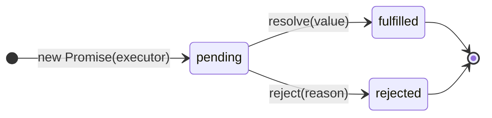
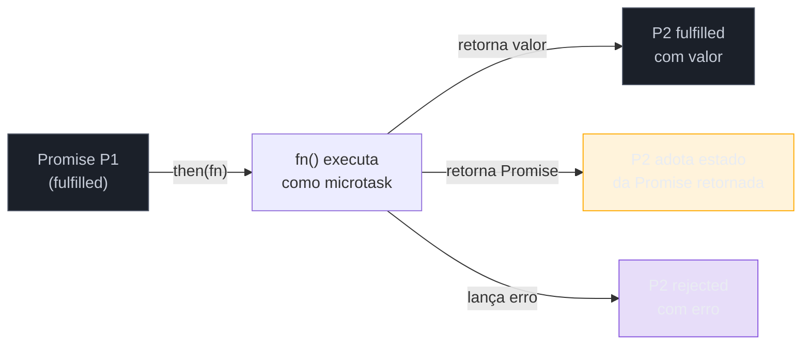
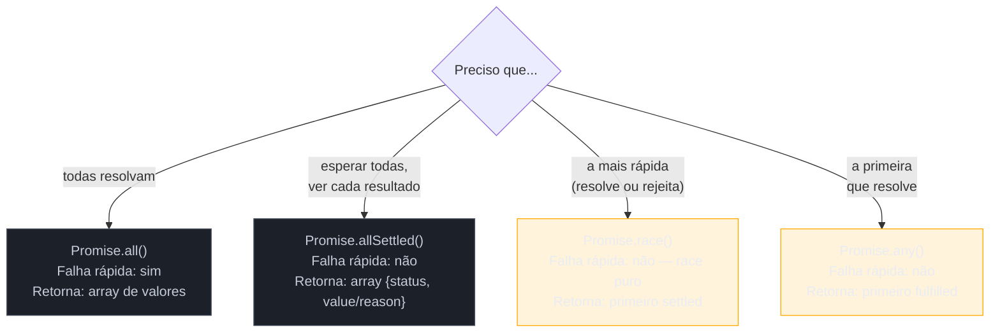

# Promises

> [!abstract] TL;DR
> Uma Promise é um objeto que representa o resultado *eventual* de uma operação assíncrona — pending enquanto aguarda, fulfilled quando resolve, rejected quando falha, e nunca mais volta atrás. O encadeamento com `.then`/`.catch`/`.finally` elimina o callback hell sem sair do estilo funcional. Os combinadores (`all`, `allSettled`, `race`, `any`) permitem orquestrar N operações paralelas com semânticas distintas. Em 2024, `Promise.withResolvers()` (ES2024) simplifica a criação quando precisamos controlar a resolução de fora do executor.

---

## O problema que as Promises resolvem

Imagine carregar um perfil de usuário, depois os pedidos daquele usuário, depois os detalhes de cada produto em cada pedido. Três operações assíncronas, cada uma dependendo do resultado da anterior. Com callbacks simples, o código vai crescendo para dentro como um funil:

```javascript
// Callback hell clássico
getUser(userId, function(err, user) {
  if (err) return handleError(err);
  getOrders(user.id, function(err, orders) {
    if (err) return handleError(err);
    getProductDetails(orders[0].productId, function(err, product) {
      if (err) return handleError(err);
      // aqui finalmente temos os dados...
      // ...enterrados em 3 níveis de indentação
    });
  });
});
```

Isso é o **callback hell** (ou *pirâmide da perdição*): cada callback abre outro nível de aninhamento, o tratamento de erro precisa ser repetido em cada nível, e o fluxo linear de "primeiro A, depois B, depois C" está invertido no código — o passo C é o mais profundo, não o último que você lê.

O problema não é estético. Callback hell gera bugs reais: é difícil propagar erros corretamente, impossível abortar a cadeia no meio, e qualquer refactor quebra a pirâmide inteira.

Promises flattam essa estrutura. O mesmo fluxo acima vira:

```javascript
getUser(userId)
  .then(user => getOrders(user.id))
  .then(orders => getProductDetails(orders[0].productId))
  .then(product => { /* usa o produto */ })
  .catch(err => handleError(err)); // um handler, qualquer passo
```

Lê-se de cima para baixo, na ordem real de execução. O erro "sobe" pela cadeia automaticamente.

---

## Os três estados de uma Promise

Uma Promise nasce **pending** e termina em um de dois estados finais — e uma vez que settle, não muda mais.



| Estado | Descrição | Imutável? |
|--------|-----------|-----------|
| `pending` | Operação ainda em andamento | — aguarda |
| `fulfilled` | Operação concluída com valor | ✓ settle |
| `rejected` | Operação falhou com motivo | ✓ settle |

"**Settle**" é o verbo para quando uma Promise sai de `pending` para qualquer dos dois finais. Uma Promise que settled não pode mais mudar — tentar chamar `resolve()` de novo não tem efeito.

> [!info] Por que imutabilidade importa
> Sistemas baseados em callbacks sofrem de "chamado duas vezes" — o callback pode ser invocado de forma reentrante por bugs na biblioteca. Promises garantem que o valor só é entregue uma vez, simplificando o raciocínio sobre o estado.

---

## Criando uma Promise com `new Promise(executor)`

O modo mais explícito de criar uma Promise é passando uma função **[[Dicionário de JavaScript#executor\|executor]]** que recebe `resolve` e `reject`:

```javascript
function delay(ms) {
  return new Promise((resolve, reject) => {
    if (ms < 0) {
      reject(new Error("Delay não pode ser negativo"));
      return;
    }
    setTimeout(() => resolve(ms), ms);
  });
}

delay(500)
  .then(ms => console.log(`Resolveu após ${ms}ms`))
  .catch(err => console.error(err.message));
```

O executor roda **sincronamente** ao criar a Promise — é o único trecho síncrono. Os callbacks `resolve` e `reject` são chamados de dentro dele (possivelmente de forma assíncrona, como no `setTimeout` acima).

### Promise.withResolvers() — ES2024

Quando precisamos expor `resolve` e `reject` *fora* do executor (por exemplo, para resolver uma Promise em resposta a um evento externo), o idioma clássico era poluir o escopo com variáveis:

```javascript
// Antes do ES2024 — feio e frágil
let resolve, reject;
const promise = new Promise((res, rej) => {
  resolve = res;
  reject = rej;
});
// usa `resolve` e `reject` mais tarde...
```

ES2024 canonizou isso com `Promise.withResolvers()`:

```javascript
const { promise, resolve, reject } = Promise.withResolvers();

// Em algum event listener:
button.addEventListener("click", () => resolve("clicado"));

promise.then(v => console.log(`Recebido: ${v}`));
```

`resolve` e `reject` ficam no mesmo escopo que `promise`, sem gambiarra. Útil em streams, filas de eventos e quando integramos com APIs baseadas em eventos.

### Promise.try() — ES2025

Há uma armadilha sutil que plenos frequentemente ignoram: e se você quer iniciar uma cadeia de Promises a partir de uma função que *pode* ser síncrona ou assíncrona?

O impulso natural é usar `Promise.resolve(fn())`:

```javascript
// Parece razoável — mas tem uma armadilha
Promise.resolve(getUserById(id))
  .then(user => processUser(user))
  .catch(err => handleError(err)); // NÃO captura erros síncronos de getUserById
```

O problema: se `getUserById` lança sincronamente (validação de `id`, acesso a propriedade `undefined`), o erro **estoura na call stack antes de `Promise.resolve` ser chamado**. O `.catch` nunca vê esse erro — ele vira uma exceção não-tratada.

> [!question]- Por que o .catch não captura o erro síncrono?
> `Promise.resolve(fn())` avalia `fn()` **antes** de criar a Promise. Se `fn()` lança, a exceção sai para o chamador imediatamente — não há contexto de Promise ainda para capturá-la. O `.catch` só intercepta rejeições que ocorrem *dentro* de uma Promise já criada.

`Promise.try()` (ES2025, Stage 4 — disponível em Node 22+ e browsers modernos) resolve isso envolvendo toda a chamada no contexto de Promise:

```javascript
// Promise.try() — captura sync throw e async reject no mesmo .catch
Promise.try(() => getUserById(id))
  .then(user => processUser(user))
  .catch(err => handleError(err)); // captura TUDO: sync throw E rejeição async
```

A função passada para `Promise.try` é chamada **dentro** do contexto da Promise — qualquer exceção síncrona é convertida em rejeição. Semântica unificada: um `.catch` para governar todos os erros.

```javascript
// Antes do ES2025 — workaround verboso
function safeChain(fn) {
  return new Promise(resolve => resolve(fn())); // executor captura o sync throw
}

// Com ES2025
Promise.try(fn)          // limpo, canônico, mesma semântica
  .then(process)
  .catch(handle);
```

Use `Promise.try` sempre que a função inicial puder ser síncrona — é mais seguro que `Promise.resolve(fn())` e mais legível que envolver em `new Promise`.

---

## `.then`, `.catch`, `.finally`

Esses três métodos são a interface principal de consumo de uma Promise.

### `.then(onFulfilled, onRejected)`

`.then()` recebe até dois callbacks: um para o caso feliz (fulfilled) e um opcional para o caso de erro (rejected). **Retorna uma nova Promise** — esse é o segredo do encadeamento.

```javascript
fetchUser(1)
  .then(
    user => console.log("Usuário:", user),    // fulfilled
    err  => console.error("Erro:", err.message) // rejected (raro usar assim)
  );
```

Na prática, o segundo argumento de `.then` quase nunca é usado diretamente — `.catch` é mais expressivo.

### `.catch(onRejected)`

É açúcar para `.then(undefined, onRejected)`. Captura qualquer rejeição que não foi tratada antes na cadeia:

```javascript
fetchUser(1)
  .then(user => JSON.parse(user.meta))  // pode lançar SyntaxError
  .catch(err => {
    // captura rejeição do fetch E o SyntaxError do parse
    console.error(err);
  });
```

### `.finally(onFinally)`

Roda **independente do resultado** — ideal para limpeza (fechar loading spinner, liberar recurso). Não recebe o valor nem o erro; apenas passa adiante o que veio antes:

```javascript
showSpinner();
fetchUser(1)
  .then(user => renderUser(user))
  .catch(err => showError(err))
  .finally(() => hideSpinner()); // roda sempre
```

> [!question]- O que `.finally` retorna?
> `.finally()` retorna uma Promise que adota o estado da Promise anterior, a menos que a callback lance um erro ou retorne uma Promise rejeitada. Ou seja: `.finally(() => {})` é transparente — não engole nem o valor nem o erro.

---

## Encadeamento e como cada `.then` retorna uma nova Promise

O encadeamento é o mecanismo mais importante para entender e também o mais rico em armadilhas.

Quando você chama `.then(fn)`:
1. A runtime registra `fn` como callback para quando a Promise atual settle.
2. **Imediatamente** retorna uma **nova** Promise — chamemos de P2.
3. Quando a Promise original settle, `fn` é executado como microtask.
4. O retorno de `fn` determina o estado de P2:
   - Se `fn` retorna um **valor não-Promise**: P2 fica fulfilled com esse valor.
   - Se `fn` retorna uma **Promise**: P2 "adota" o estado dessa Promise (espera ela também settle).
   - Se `fn` **lança** um erro: P2 fica rejected com esse erro.



Isso explica o flattening automático — se você retorna um `fetch(url)` dentro de `.then`, a próxima `.then` na cadeia recebe a resposta HTTP, não o objeto Promise.

```javascript
fetch("/api/users")
  .then(response => response.json())   // retorna Promise<data>
  .then(data => data.filter(u => u.active)) // recebe data (array), não Promise
  .then(active => renderList(active));
```

### Propagação de erro pela cadeia

Um erro lançado em qualquer ponto da cadeia "cai" direto para o próximo `.catch`:

```javascript
fetch("/api/users")
  .then(r => r.json())         // se falhar, pula os dois .then abaixo
  .then(data => processData(data))  // se falhar aqui, pula o próximo
  .then(result => save(result))
  .catch(err => logError(err));     // captura qualquer falha acima
```

`.catch` em si também retorna uma Promise. Se o callback de `.catch` não lançar, a cadeia **retoma** no estado fulfilled — comportamento útil para recuperação de erro:

```javascript
fetchConfig()
  .catch(() => defaultConfig)    // se falhar, usa config padrão
  .then(config => start(config)); // continua normalmente
```

---

## `Promise.resolve` e `Promise.reject`

Atalhos para criar Promises já settled:

```javascript
// Equivalentes
Promise.resolve(42);
// é aproximadamente:
new Promise(resolve => resolve(42));

// Útil para wrapping de valores síncronos em APIs que esperam Promise
function getConfig() {
  if (cachedConfig) return Promise.resolve(cachedConfig);
  return fetchConfig();
}
```

> [!info] `Promise.resolve(thenable)`
> Se você passar um objeto que tem um método `.then` (um *[[Dicionário de JavaScript#thenable\|thenable]]*), `Promise.resolve` irá "assimilá-lo" — chama `.then(resolve, reject)` e adota o estado resultante. Isso garante interop com bibliotecas Promise de terceiros.

---

## Combinadores: quando usar cada um

Quatro combinadores para quatro semânticas distintas de "esperar N Promises":



### `Promise.all(promises)`

Resolve quando **todas** as Promises resolvem; rejeita na **primeira** rejeição (fail-fast). Os valores chegam na mesma ordem do array de entrada, independente de qual resolveu primeiro.

```javascript
const [user, settings, permissions] = await Promise.all([
  fetchUser(id),
  fetchSettings(id),
  fetchPermissions(id)
]);
```

Use quando: todas as operações são obrigatórias e independentes entre si.  
Cuidado: se qualquer uma falhar, você não recebe nenhum dos resultados.

### `Promise.allSettled(promises)`

Espera **todas** as Promises settled, sem abortar. Retorna um array de descritores:
- `{ status: "fulfilled", value: ... }` para as que resolveram
- `{ status: "rejected", reason: ... }` para as que rejeitaram

```javascript
const results = await Promise.allSettled([
  syncUser(userId),
  syncOrders(userId),
  syncHistory(userId)
]);

results.forEach(r => {
  if (r.status === "fulfilled") log("ok", r.value);
  else log("falhou", r.reason);
});
```

Use quando: você precisa do resultado de todas as operações independentemente, ou quer saber quais falharam sem abortar as outras.

### `Promise.race(promises)`

Resolve ou rejeita com o **primeiro** settled, seja fulfilled ou rejected. É uma corrida pura — o vencedor pode ser uma rejeição.

```javascript
// Timeout pattern clássico
function withTimeout(promise, ms) {
  const timeout = new Promise((_, reject) =>
    setTimeout(() => reject(new Error(`Timeout após ${ms}ms`)), ms)
  );
  return Promise.race([promise, timeout]);
}
```

Use quando: você quer o resultado mais rápido e é tolerante a rejeições; ou para implementar timeouts.

### `Promise.any(promises)`

Resolve com o **primeiro fulfilled**, ignorando rejeições. Só rejeita se **todas** rejeitarem (com `AggregateError` contendo todas as razões).

```javascript
// Tenta múltiplos endpoints; usa o primeiro que responder
const data = await Promise.any([
  fetch("https://api1.example.com/data"),
  fetch("https://api2.example.com/data"),
  fetch("https://api3.example.com/data")
]).then(r => r.json());
```

Use quando: você tem múltiplos provedores/endpoints alternativos e qualquer um serve.

| Combinador | Fail-fast? | Resolve quando | Rejeita quando |
|------------|-----------|----------------|----------------|
| `all` | ✓ sim | todas fulfilled | primeira rejeição |
| `allSettled` | não | todas settled | nunca rejeita |
| `race` | não (race puro) | primeira settled | primeira settled (se rejeitada) |
| `any` | não | primeira fulfilled | todas rejeitaram |

---

## Microtask timing

Quando uma Promise settle e você tem callbacks registrados via `.then`, esses callbacks **não rodam imediatamente**. Eles entram na **[[Dicionário de JavaScript#microtask\|fila de microtasks]]** (também chamada de PromiseJobs na spec).

```javascript
console.log("1");

Promise.resolve().then(() => console.log("3"));

console.log("2");

// Saída: 1, 2, 3
```

A runtime esvazia a call stack primeiro (imprime "1" e "2"), depois processa toda a fila de microtasks (imprime "3"), antes de pegar a próxima macrotask (timer, I/O, etc).

Isso tem implicações práticas:

```javascript
let value = "original";
const p = Promise.resolve("novo");

p.then(v => { value = v; });

console.log(value); // "original" — o .then ainda não rodou
// Somente após a call stack esvaziar: value === "novo"
```

Os internals completos — fases do event loop, diferença entre microtasks e macrotasks, `process.nextTick` no Node — ficam em [[03-Dominios/Tecnologia/Node/Runtime e Event Loop/index|Node/Runtime e Event Loop]]. Aqui o que importa: callbacks de Promise sempre rodam antes do próximo timer ou evento de I/O, mas depois do código síncrono atual.

> [!info] Nota 19 — Modelo de execução a fundo
> [[03-Dominios/Tecnologia/JavaScript/19 - Modelo de execução a fundo|19 - Modelo de execução a fundo]] detalha a interação entre microtask queue, task queue e rendering pipeline no browser. Por ora, o modelo mental acima é suficiente.

---

## Casos práticos

### Caso 1: paralelizar N fetches com `Promise.all`

Um dashboard precisa exibir métricas de 5 endpoints simultaneamente. Buscar um por um seria lento; `Promise.all` dispara todos em paralelo e aguarda o mais lento:

```javascript
async function loadDashboard(userId) {
  const endpoints = [
    `/api/users/${userId}/profile`,
    `/api/users/${userId}/stats`,
    `/api/users/${userId}/notifications`,
    `/api/users/${userId}/recent-orders`,
    `/api/users/${userId}/recommendations`,
  ];

  // Todos os fetches disparam ao mesmo tempo
  const responses = await Promise.all(
    endpoints.map(url => fetch(url))
  );

  // Agora deserializamos em paralelo também
  const [profile, stats, notifs, orders, recs] = await Promise.all(
    responses.map(r => {
      if (!r.ok) throw new Error(`HTTP ${r.status}: ${r.url}`);
      return r.json();
    })
  );

  return { profile, stats, notifs, orders, recs };
}
```

Se qualquer endpoint retornar erro HTTP, o `throw` dentro do `.map` vai rejeitar essa Promise, e `Promise.all` vai rejeitar o conjunto todo — comportamento correto para um dashboard que precisa de todos os dados.

### Caso 2: timeout com `Promise.race`

Uma operação de busca no banco pode demorar indefinidamente em condições ruins. Queremos falhar rápido se ultrapassar 3 segundos:

```javascript
function createTimeout(ms, message) {
  return new Promise((_, reject) =>
    setTimeout(() => reject(new Error(message ?? `Timeout: ${ms}ms`)), ms)
  );
}

function withTimeout(promise, ms) {
  return Promise.race([promise, createTimeout(ms)]);
}

// Uso
try {
  const results = await withTimeout(
    db.query("SELECT * FROM events WHERE date > $1", [lastWeek]),
    3000
  );
  return results;
} catch (err) {
  if (err.message.startsWith("Timeout")) {
    return { error: "query_timeout", fallback: [] };
  }
  throw err;
}
```

> [!question]- E se o banco responder *depois* do timeout?
> A query do banco continua executando em background — `Promise.race` não cancela a Promise perdedora, apenas ignora o resultado. Para cancelamento real, use `AbortController` com `fetch` ou um mecanismo específico do seu driver de banco.

### Caso 3: operações de sincronização com `Promise.allSettled`

Ao sincronizar dados de 10 usuários para um serviço externo, queremos registrar quais falharam sem abortar a sincronização dos outros:

```javascript
async function syncUsers(userIds) {
  const results = await Promise.allSettled(
    userIds.map(id => syncUser(id))
  );

  const succeeded = results.filter(r => r.status === "fulfilled").length;
  const failures  = results
    .filter(r => r.status === "rejected")
    .map((r, i) => ({ userId: userIds[i], reason: r.reason?.message }));

  if (failures.length > 0) {
    logger.warn("Sincronização parcial", { failures });
  }

  return { total: userIds.length, succeeded, failures };
}
```

### Caso 4: concorrência limitada — quando `Promise.all` demais derruba tudo

`Promise.all` dispara **todas** as Promises simultaneamente. Para arrays pequenos, ótimo. Para arrays de 100, 500 ou 10.000 itens, você acabou de abrir um thundering herd: conexões simultâneas que esgotam o pool do banco, requisições que excedem o rate-limit da API externa, ou alocação de memória que trava o processo.

O modelo mental correto: `Promise.all` é paralelismo irrestrito, não um pool de workers. Pense num restaurante onde todos os 500 pedidos chegam ao mesmo tempo na cozinha — a cozinha entra em colapso antes de preparar qualquer prato.

```javascript
// PROBLEMA: dispara todas as 500 requisições ao mesmo tempo
const results = await Promise.all(
  userIds.map(id => callExternalApi(id)) // 500 simultâneas → rate-limit ou crash do DB
);
```

**Solução 1 — lotes manuais** (sem dependência externa):

```javascript
async function processBatch(items, batchSize, fn) {
  const results = [];
  for (let i = 0; i < items.length; i += batchSize) {
    const batch = items.slice(i, i + batchSize);
    // Cada lote roda em paralelo; próximo lote só começa após o atual terminar
    const batchResults = await Promise.all(batch.map(fn));
    results.push(...batchResults);
  }
  return results;
}

// Processa 500 usuários em lotes de 10
const results = await processBatch(userIds, 10, id => callExternalApi(id));
```

**Solução 2 — `p-limit`** (semáforo: nunca mais de N simultâneos):

```javascript
import pLimit from "p-limit";

const limit = pLimit(10); // máximo 10 simultâneos em qualquer momento

const results = await Promise.all(
  userIds.map(id => limit(() => callExternalApi(id)))
);
// Cada slot abre assim que uma tarefa termina — sem esperar o lote inteiro
```

> [!info] Lotes vs semáforo
> Com lotes manuais, o lote 2 só começa quando **todos** do lote 1 terminaram — o mais lento segura o grupo. Com `p-limit`, cada slot abre tão logo uma tarefa termina, independente das outras: throughput mais suave e sem starvation por um item lento.

---

## Armadilhas comuns

> [!warning] Esquecer o `return` no callback do `.then`
> **O que acontece:** a Promise da cadeia seguinte resolve com `undefined`, não com o resultado da operação interna. **Por quê:** se `fn` não retorna nada, `.then(fn)` cria uma P2 fulfilled com `undefined`. O próximo `.then` recebe `undefined`. **Como evitar:** sempre retorne explicitamente do callback. Com arrow functions de uma linha, o retorno é implícito — cuidado ao adicionar chaves `{}` e esquecer o `return`.
>
> ```javascript
> // BUG: retorna undefined
> .then(user => { fetchOrders(user.id); })
>
> // Correto
> .then(user => fetchOrders(user.id))
> // ou
> .then(user => { return fetchOrders(user.id); })
> ```

> [!warning] `.then` sem `.catch` — rejeição silenciosa
> **O que acontece:** erros são engolidos silenciosamente. Em Node.js antigo, gerava warning; em browsers modernos, dispara `unhandledrejection`. **Por quê:** sem um handler de rejeição na cadeia, a Promise simplesmente fica rejeitada e ninguém é notificado. **Como evitar:** toda cadeia de Promises deve terminar com `.catch` ou ser `await`-ada dentro de um `try/catch`. Em módulos de aplicação, registre um handler global: `process.on("unhandledRejection", ...)`.

> [!warning] `Promise.all` com fail-fast inesperado
> **O que acontece:** um único erro cancela todo o lote; os outros resultados são perdidos. **Por quê:** `Promise.all` rejeita na primeira rejeição — se 9 de 10 operações deram certo mas uma falhou, você não recebe nenhuma. **Como evitar:** para operações independentes onde falha parcial é tolerável, use `Promise.allSettled`. Reserve `Promise.all` para quando você realmente precisa de todas as operações para prosseguir.

> [!warning] Criar Promise desnecessariamente (Promise constructor anti-pattern)
> **O que acontece:** código mais complexo, maior risco de rejeição silenciosa. **Por quê:** wrapping uma operação já assíncrona em `new Promise` duplica a camada de Promise sem ganho. **Como evitar:** se a função já retorna Promise (como `fetch`), não envolva em `new Promise`. Retorne diretamente.
>
> ```javascript
> // Anti-pattern
> function getData(url) {
>   return new Promise((resolve, reject) => {
>     fetch(url).then(resolve).catch(reject); // inútil
>   });
> }
>
> // Correto
> function getData(url) {
>   return fetch(url);
> }
> ```

> [!warning] Confundir `Promise.race` e `Promise.any`
> **O que acontece:** usar `race` quando se quer o "primeiro sucesso" resulta em rejeição quando o mais rápido é um erro. **Por quê:** `race` resolve/rejeita com o primeiro *settled* (qualquer estado). `any` aguarda o primeiro *fulfilled*. **Como evitar:** use `race` para timeouts e corridas onde o "mais rápido" inclui falhas. Use `any` para fallbacks e redundância onde você quer ignorar rejeições.

> [!warning] `Promise.race` não cancela a Promise perdedora — e isso vaza recursos
> **O que acontece:** ao usar `Promise.race` para timeout, a operação "perdida" (ex: query ao banco) continua rodando em background, consumindo conexão, memória e CPU. **Por quê:** `Promise.race` apenas ignora o resultado da Promise perdedora — não há mecanismo de cancelamento embutido. A operação segue até concluir, mesmo que você não use mais o resultado. **Como evitar:** use `AbortController` para cancelar operações que suportam `signal`. O padrão correto combina `Promise.race` com `AbortController`:
>
> ```javascript
> async function withCancellableTimeout(asyncFn, ms) {
>   const controller = new AbortController();
>   const timeout = new Promise((_, reject) =>
>     setTimeout(() => {
>       controller.abort();           // cancela a operação real
>       reject(new Error(`Timeout: ${ms}ms`));
>     }, ms)
>   );
>   try {
>     return await Promise.race([asyncFn(controller.signal), timeout]);
>   } finally {
>     clearTimeout; // boas práticas: limpar timer se asyncFn venceu
>   }
> }
>
> // Uso com fetch (suporta AbortSignal nativamente)
> const data = await withCancellableTimeout(
>   signal => fetch("/api/data", { signal }).then(r => r.json()),
>   3000
> );
> ```
>
> `AbortSignal.any([signal1, signal2])` (ES2023, suporte amplo em 2024+) permite combinar múltiplos sinais: timeout E cancelamento manual pelo usuário, por exemplo.

---

## Como explicar em inglês

Promises are a built-in mechanism for managing asynchronous operations in JavaScript. A Promise represents a value that may not be available yet — it starts *pending*, and eventually *settles* as either *fulfilled* with a value or *rejected* with an error. You chain operations using `.then()` and handle errors with `.catch()`. For parallelism, `Promise.all` waits for everything to succeed, `allSettled` waits for everything regardless of outcome, `race` returns the first to settle, and `any` returns the first to succeed.

| PT | EN |
|----|----|
| pendente | pending |
| resolvida / cumprida | fulfilled / resolved |
| rejeitada | rejected |
| settled / liquidada | settled |
| encadeamento | chaining |
| propagação de erro | error propagation |
| callback hell | callback hell / pyramid of doom |
| fila de microtasks | microtask queue |
| combinator | combinator |
| executor | executor function |

---

## Resumo em uma linha

Promise em uma frase: um contrato que representa um valor *futuro* — você encadeia o que fazer com ele via `.then`, cuida de erros via `.catch`, e coordena múltiplos contratos via combinadores.

---

## O que vem a seguir

Promises são a fundação — mas escrever `.then().then().then()` ainda pode ficar verboso. `async/await` é açúcar sintático sobre Promises: por baixo, tudo continua sendo `.then` e `.catch`, só que o código parece síncrono. Entender Promises a fundo é o que torna o comportamento do `async/await` previsível — especialmente nos casos de erro e de paralelismo.

- [[03-Dominios/Tecnologia/JavaScript/15 - async-await|15 - async-await]] — como `async/await` desaçucara para Promises e onde o modelo mental diverge
- [[03-Dominios/Tecnologia/Node/Runtime e Event Loop/index|Node/Runtime e Event Loop]] — internals do event loop, fases de execução e onde microtasks se encaixam no ciclo completo
- [[Dicionário de JavaScript#Promise]] — verbete de referência rápida

---

## Fontes

- **MDN Web Docs** — [*Promise*](https://developer.mozilla.org/en-US/docs/Web/JavaScript/Reference/Global_Objects/Promise) — referência canônica da API, estados, métodos e especificação
- **MDN Web Docs** — [*Using Promises*](https://developer.mozilla.org/en-US/docs/Web/JavaScript/Guide/Using_promises) — guia de uso com ênfase em encadeamento e tratamento de erros
- **Dr. Axel Rauschmayer** — [*Promises for asynchronous programming (Exploring JS)*](https://exploringjs.com/js/book/ch_promises.html) — cobertura profunda da spec ES, incluindo thenable assimilation e timing
- **Dr. Axel Rauschmayer** — [*ECMAScript 2024: Promise.withResolvers()*](https://2ality.com/2024/05/proposal-promise-with-resolvers.html) — motivação e uso da adição ES2024
- **MDN Web Docs** — [*Promise.withResolvers()*](https://developer.mozilla.org/en-US/docs/Web/JavaScript/Reference/Global_Objects/Promise/withResolvers) — documentação do método ES2024
- **LogRocket Blog** — [*JavaScript Promises: race, all, allSettled, and then*](https://blog.logrocket.com/javascript-promises-race-all-allsettled-then/) — comparação prática dos combinadores com exemplos de produção
- **javascript.info** — [*Microtasks*](https://javascript.info/microtask-queue) — explicação clara da fila de microtasks e seu papel no event loop
- **MDN Web Docs** — [*Promise.try()*](https://developer.mozilla.org/en-US/docs/Web/JavaScript/Reference/Global_Objects/Promise/try) — documentação do método ES2025 com suporte a erros síncronos e assíncronos
- **AppSignal Blog** — [*Managing Asynchronous Operations in Node.js with AbortController*](https://blog.appsignal.com/2025/02/12/managing-asynchronous-operations-in-nodejs-with-abortcontroller.html) (2025) — padrões de cancelamento com AbortController, incluindo vazamento de recursos e boas práticas
- **MDN Web Docs** — [*AbortSignal.any()*](https://developer.mozilla.org/en-US/docs/Web/API/AbortSignal/any_static) — combinação de múltiplos sinais de cancelamento (ES2023+)
