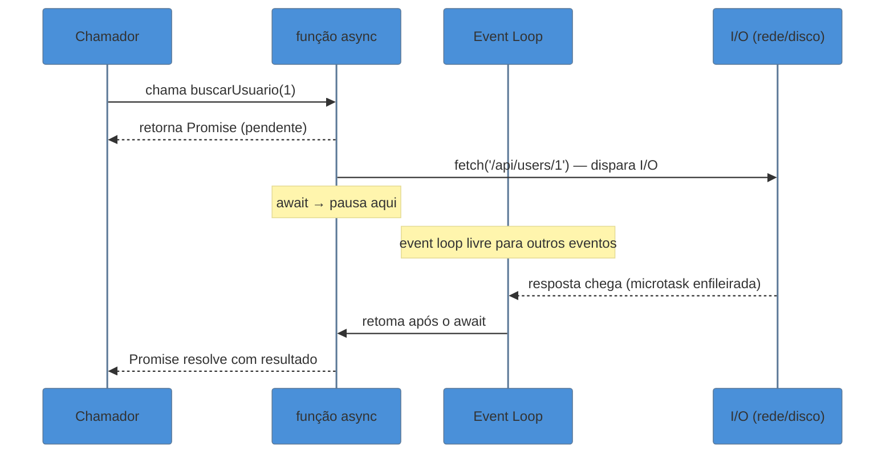

# async/await

> [!abstract] TL;DR
> `async/await` é açúcar sintático sobre Promises: uma função `async` sempre retorna uma Promise, e `await` pausa a execução da função (sem bloquear a thread) até a Promise se liquidar. O erro mais comum é usar `await` sequencialmente quando as operações são independentes — o correto é soltar as promises antes e depois `await Promise.all`. `for await...of` itera sobre async iterables. Top-level await funciona em ES Modules (ES2022), mas com cautela: bloqueia a avaliação dos módulos que importam o seu. O event loop continua processando outros eventos durante qualquer `await`.

---

## O problema que `async/await` resolve

Você já escreveu uma cadeia `.then` que precisou de tratamento de erro em cada nível? Algo assim:

```javascript
function carregarDashboard(userId) {
  return getUser(userId)
    .then(user => getOrders(user.id))
    .then(orders => getProducts(orders.map(o => o.productId)))
    .then(products => renderDashboard(products))
    .catch(err => {
      console.error('Falhou em algum ponto:', err);
      // Mas em qual ponto? Não é fácil saber.
    });
}
```

O código funciona, mas a leitura exige um exercício mental: você precisa rastrear o que cada `.then` recebe, o que retorna, e imaginar onde o `.catch` vai capturar. Conforme a cadeia cresce, o fluxo lógico — "primeiro busco o usuário, depois os pedidos, depois os produtos" — fica obscurecido pela mecânica do encadeamento.

`async/await` foi criado precisamente para isso: deixar código assíncrono lido como código síncrono, mantendo toda a semântica de Promises por baixo.

---

## A mecânica: o que `async` e `await` fazem de verdade

### `async`: toda função vira Promise

A palavra-chave `async` antes de uma função tem um efeito simples e preciso: **a função sempre retorna uma Promise**, independente do que estiver dentro.

```javascript
async function saudacao() {
  return 'olá';
}

saudacao();           // Promise { 'olá' }
saudacao().then(console.log); // 'olá'
```

Não é que a função "pode retornar uma Promise" — ela *sempre* retorna uma Promise. O valor que você escreve no `return` é o valor com que a Promise resolve.

| O que acontece dentro da função | O que a Promise faz |
|---|---|
| `return valor` | resolve com `valor` |
| `throw erro` | rejeita com `erro` |
| Função termina sem `return` | resolve com `undefined` |
| `return outraPromise` | adota `outraPromise` (não aninha) |

O último caso merece atenção: se você retornar uma Promise de dentro de uma função `async`, o motor não cria uma Promise dentro de outra — ele adota a promise interna diretamente.

```javascript
async function f() {
  return Promise.resolve(42); // equivale a: return 42
}

f().then(console.log); // 42, não Promise { 42 }
```

### `await`: pausa sem bloquear

`await` só pode ser usado dentro de uma função `async` (ou no nível de módulo ES). Ele pausa a execução da função até que a Promise à sua direita se **liquide** (settle) — seja resolvida ou rejeitada.

```javascript
async function buscarUsuario(id) {
  console.log('antes');
  const usuario = await fetch(`/api/users/${id}`); // pausa aqui
  console.log('depois');                            // retoma quando fetch resolver
  return usuario.json();
}
```

Durante essa pausa, **a thread JavaScript não fica bloqueada**. O controle retorna ao event loop, que continua processando callbacks, timers e eventos de I/O. Quando a Promise liquida, a continuação da função é enfileirada como **microtask** e retoma na próxima oportunidade.

A analogia útil: pense em `await` como um "pino de pausa" que diz ao event loop "quando essa promise resolver, volte aqui e continue". Enquanto isso, a thread é livre para fazer outra coisa. Para o mecanismo detalhado de microtasks e event loop, ver [[03-Dominios/Tecnologia/Node/Runtime e Event Loop/index|Node — Runtime e Event Loop]].

> [!question]- O que acontece se eu der `await` em algo que não é Promise?
> `await` envolve o valor em `Promise.resolve()` automaticamente. `await 42` é equivalente a `await Promise.resolve(42)` — resolve imediatamente. Funciona, mas é desnecessário para valores síncronos.

---

## Diagrama: fluxo de execução



O chamador recebe a Promise antes mesmo de a função terminar. A função pausa no `await`, a thread processa outros eventos, e a função retoma quando o I/O conclui.

---

## Error handling: `try/catch` é obrigatório

Com `.then`, erros vão para o `.catch` ao fim da cadeia. Com `async/await`, você usa `try/catch` — e se esquecer, a rejeição vira uma **unhandled rejection**.

```javascript
// Sem try/catch — rejeição silenciosa (ou crash em Node.js)
async function buscarDados() {
  const resp = await fetch('/api/dados'); // e se falhar?
  return resp.json();
}

// Com try/catch — tratamento explícito
async function buscarDados() {
  try {
    const resp = await fetch('/api/dados');
    if (!resp.ok) throw new Error(`HTTP ${resp.status}`);
    return resp.json();
  } catch (err) {
    console.error('Falhou ao buscar dados:', err);
    throw err; // re-throw para o chamador poder tratar
  }
}
```

O `try/catch` captura tanto erros de rede quanto exceções lançadas dentro do bloco — unifica o tratamento que antes requeria `catch` no final da cadeia `.then`.

### Granularidade do `try/catch`

Você decide o escopo: um único `try/catch` para toda a função, ou um por operação crítica.

```javascript
async function processarPedido(pedidoId) {
  let pedido;

  try {
    pedido = await buscarPedido(pedidoId);
  } catch (err) {
    // falha isolada — pode retornar fallback
    return { erro: 'Pedido não encontrado', pedidoId };
  }

  // aqui pedido existe com certeza
  const pagamento = await processarPagamento(pedido);
  return pagamento;
}
```

---

## O padrão mais importante: sequencial vs paralelo

Este é o ponto onde `async/await` engana mais programadores.

### O erro clássico: `await` em série

```javascript
// RUIM — sequencial desnecessário
// Tempo total: tempo(A) + tempo(B) + tempo(C)
async function carregarPerfil(userId) {
  const usuario  = await getUser(userId);      // 200ms
  const pedidos  = await getOrders(userId);    // 150ms
  const favoritos = await getFavorites(userId); // 100ms

  return { usuario, pedidos, favoritos };
}
// Total: ~450ms
```

Cada `await` espera o anterior terminar antes de disparar o próximo. As três requisições não têm dependência entre si — `pedidos` não precisa de `usuario` para ser buscado. Mas o código as força a rodar em fila.

### A correção: soltar as Promises antes

```javascript
// BOM — paralelo com Promise.all
// Tempo total: max(tempo(A), tempo(B), tempo(C))
async function carregarPerfil(userId) {
  const [usuario, pedidos, favoritos] = await Promise.all([
    getUser(userId),      // disparado imediatamente
    getOrders(userId),    // disparado imediatamente
    getFavorites(userId), // disparado imediatamente
  ]);

  return { usuario, pedidos, favoritos };
}
// Total: ~200ms (a mais lenta das três)
```

`Promise.all` recebe um array de Promises já em andamento e aguarda que todas liquidem. O tempo total é o da operação mais lenta — não a soma.

> [!tip] Regra de ouro
> Use `await` em série apenas quando cada operação **depende do resultado da anterior**. Quando as operações são independentes, dispare todas as Promises primeiro e `await Promise.all` depois.

### Visualizando a diferença

```mermaid
%%{init: {"theme": "base", "themeVariables": {"primaryColor": "#4A90D9"}}}%%
gantt
    title Sequencial vs Paralelo (3 requests independentes)
    dateFormat  X
    axisFormat %s

    section Sequencial (await em série)
    getUser   :a1, 0, 200
    getOrders :a2, after a1, 150
    getFavorites :a3, after a2, 100
    Total: 450ms :crit, milestone, 450, 0

    section Paralelo (Promise.all)
    getUser   :b1, 0, 200
    getOrders :b2, 0, 150
    getFavorites :b3, 0, 100
    Total: 200ms :crit, milestone, 200, 0
```

---

## `await` em loop: o armadilho do `forEach`

O `Array.forEach` não é `async`-aware. Se você passar uma callback `async` para ele, vai disparar as promises mas não vai esperar por elas:

```javascript
// QUEBRADO — forEach ignora as promises
async function processarLote(ids) {
  ids.forEach(async (id) => {
    await processarItem(id); // await funciona DENTRO da callback,
  });                        // mas forEach não aguarda a callback
  console.log('pronto'); // imprime ANTES de qualquer processarItem terminar
}
```

### Opção 1: `for...of` sequencial

```javascript
// Sequencial — processa um por vez
async function processarLote(ids) {
  for (const id of ids) {
    await processarItem(id); // aguarda cada um antes do próximo
  }
  console.log('todos processados');
}
```

Útil quando a ordem importa ou quando o rate limiting exige throttle.

### Opção 2: `Promise.all` com `.map` (paralelo)

```javascript
// Paralelo — processa todos ao mesmo tempo
async function processarLote(ids) {
  await Promise.all(ids.map(id => processarItem(id)));
  console.log('todos processados');
}
```

`.map` é síncrono — cria o array de Promises. `Promise.all` então aguarda todas. Muito mais rápido para operações independentes.

---

## `for await...of`: iterando sobre async iterables

`for await...of` é a versão assíncrona do `for...of`. Funciona com qualquer objeto que implemente o protocolo de **async iterator** — incluindo Readable streams, generators assíncronos, e APIs que expõem dados em páginas.

```javascript
// Iterando sobre um stream (Node.js)
async function lerArquivo(filePath) {
  const stream = fs.createReadStream(filePath);

  for await (const chunk of stream) {
    processar(chunk);
  }

  console.log('stream encerrado');
}
```

```javascript
// Paginação: consumindo API que retorna dados em páginas
async function* paginarResultados(url) {
  let nextUrl = url;

  while (nextUrl) {
    const resp = await fetch(nextUrl);
    const { data, next } = await resp.json();
    yield* data;         // emite cada item individualmente
    nextUrl = next;
  }
}

async function mostrarTodos() {
  for await (const item of paginarResultados('/api/itens')) {
    console.log(item.nome);
  }
}
```

O loop chama `.next()` na promise do iterator a cada iteração, aguardando cada resultado antes de avançar. Para entender async generators em profundidade, ver [[16 - Iterators e generators]] — que ainda não existe no galho, mas será criado em breve.

> [!info] `for await...of` vs `for...of`
> `for...of` funciona com iterables síncronos (arrays, strings, Maps, Sets). `for await...of` funciona com ambos: async iterables *e* iterables síncronos — é um superset.

---

## Top-level await (ES2022)

Antes do ES2022, `await` era proibido fora de funções `async`. Para usar `await` no nível de módulo, era preciso um wrapper:

```javascript
// Pré-ES2022: wrapper IIFE async
(async () => {
  const config = await carregarConfig();
  inicializar(config);
})();
```

ES2022 introduziu **top-level await**: em módulos ES (`.mjs` ou `"type": "module"` no `package.json`), `await` pode ser usado diretamente no corpo do módulo:

```javascript
// config.mjs — top-level await
const config = await fetch('/api/config').then(r => r.json());

export { config };
```

```javascript
// app.mjs — espera config.mjs antes de avaliar
import { config } from './config.mjs'; // espera o await de config.mjs
console.log(config.apiUrl); // config já está disponível
```

> [!warning] Top-level await bloqueia módulos dependentes
> Quando um módulo usa top-level await, **todo módulo que o importa espera** até que as Promises do módulo resolvam. Uma cadeia de módulos com top-level await pode atrasar significativamente o startup da aplicação. Use com moderação.

Top-level await **não funciona em CommonJS** (`.cjs` ou Node sem `"type": "module"`).

---

## Casos práticos

### Caso 1: refatorando uma cadeia `.then` para `async/await`

Ponto de partida — código legado com cadeia `.then`:

```javascript
// Antes: cadeia .then
function carregarDashboard(userId) {
  return getUser(userId)
    .then(user => {
      return getOrders(user.id).then(orders => ({
        user,
        orders,
      }));
    })
    .then(({ user, orders }) => {
      return getProductDetails(orders.map(o => o.productId))
        .then(products => ({ user, orders, products }));
    })
    .catch(err => {
      reportError(err);
      return null;
    });
}
```

O que torna isso difícil: cada `.then` precisa retornar explicitamente o estado acumulado, os aninhamentos aparecem quando precisamos de variáveis de contexto, e o `.catch` não deixa claro onde o erro ocorreu.

```javascript
// Depois: async/await
async function carregarDashboard(userId) {
  try {
    const user = await getUser(userId);
    const orders = await getOrders(user.id);
    const products = await getProductDetails(orders.map(o => o.productId));

    return { user, orders, products };
  } catch (err) {
    reportError(err);
    return null;
  }
}
```

O fluxo lógico — buscar usuário, depois pedidos, depois produtos — agora está explícito na ordem das linhas. As variáveis ficam no mesmo escopo. O `catch` cobre tudo.

Mas espera: `orders` depende de `user.id`, então a sequência é necessária. Mas `products` só depende dos ids de `orders` — poderíamos otimizar? Não neste caso, porque cada chamada depende da anterior. O `await` em série aqui é correto.

### Caso 2: paralelizando requests independentes

Cenário real: uma página de produto precisa de dados do produto, avaliações, e estoque — três endpoints independentes.

```javascript
// Versão ruim — 3 requests em série (~900ms se cada levar 300ms)
async function carregarPaginaProduto(productId) {
  const produto    = await getProduto(productId);    // 300ms
  const avaliacoes = await getAvaliacoes(productId); // 300ms
  const estoque    = await getEstoque(productId);    // 300ms
  return { produto, avaliacoes, estoque };
}

// Versão boa — 3 requests em paralelo (~300ms)
async function carregarPaginaProduto(productId) {
  const [produto, avaliacoes, estoque] = await Promise.all([
    getProduto(productId),
    getAvaliacoes(productId),
    getEstoque(productId),
  ]);
  return { produto, avaliacoes, estoque };
}
```

Se qualquer um dos três falhar, `Promise.all` rejeita com o primeiro erro — o comportamento "fail-fast". Se você precisa que todos terminem mesmo com erros individuais (ex: um endpoint sendo opcional), use `Promise.allSettled`:

```javascript
async function carregarComFallback(productId) {
  const resultados = await Promise.allSettled([
    getProduto(productId),
    getAvaliacoes(productId),
    getEstoque(productId),
  ]);

  const [produtoResult, avaliacoesResult, estoqueResult] = resultados;

  return {
    produto: produtoResult.status === 'fulfilled' ? produtoResult.value : null,
    avaliacoes: avaliacoesResult.status === 'fulfilled' ? avaliacoesResult.value : [],
    estoque: estoqueResult.status === 'fulfilled' ? estoqueResult.value : 0,
  };
}
```

---

## Armadilhas comuns

> [!warning] `await` serial sem querer
> **O que acontece:** código com múltiplos `await` um abaixo do outro executa operações independentes em sequência, desperdiçando tempo.
> **Por quê:** cada `await` pausa a função — o próximo `await` só dispara depois que o anterior resolve.
> **Como evitar:** identifique se as operações têm dependência. Se não tiverem, agrupe em `Promise.all`. Regra: se você pode mover duas linhas `await` para um array sem mudar a lógica, você deveria fazer isso.

> [!warning] `try/catch` ausente
> **O que acontece:** uma Promise rejeitada vira `UnhandledPromiseRejection` — warning em Node.js antigo, crash em versões modernas (Node 15+).
> **Por quê:** sem `try/catch`, a rejeição sobe a cadeia de chamadas sem ser capturada.
> **Como evitar:** toda função `async` que pode falhar deve ter `try/catch`, ou o chamador deve tratar a Promise retornada com `.catch()`. Não misture: se você vai usar `await`, use `try/catch`; se vai usar `.then`, use `.catch`.

> [!warning] `forEach` com callback `async`
> **O que acontece:** o código parece aguardar, mas `console.log('feito')` imprime antes das operações terminarem.
> **Por quê:** `forEach` não tem conhecimento de Promises — ele invoca a callback e ignora o retorno (que é a Promise).
> **Como evitar:** use `for...of` (sequencial) ou `Promise.all` + `.map` (paralelo). Nunca use `forEach` com callbacks `async` que precisam de sequenciamento.

> [!warning] Esquecer o `await`
> **O que acontece:** em vez do valor, você opera sobre a Promise em si — e o TypeScript não garante pegar isso se os tipos não estiverem corretos.
> **Por quê:** sem `await`, a expressão retorna a Promise não resolvida.
> **Como evitar:** se uma função é `async`, você quase sempre precisa de `await` ao chamá-la. Um linter com `no-floating-promises` (TypeScript-ESLint) captura esses casos.

> [!warning] Top-level await em módulo crítico de startup
> **O que acontece:** o startup da aplicação fica lento de forma difícil de diagnosticar.
> **Por quê:** todo módulo que importa um módulo com top-level await fica bloqueado até que as Promises desse módulo resolvam. Módulos de inicialização são importados por muita coisa.
> **Como evitar:** limite top-level await a módulos de carregamento lento/configuração que são importados depois do startup principal. Prefira inicialização lazy ou um `init()` explícito.

---

## Como explicar em inglês

**In an interview:** "`async/await` is syntactic sugar over Promises. An `async` function always returns a Promise, and `await` suspends the function's execution until the awaited Promise settles — but without blocking the JavaScript thread. The event loop remains free to handle other tasks during that pause. The most common mistake is using sequential `await` for independent operations when `Promise.all` would be significantly faster."

**On the sequential vs. parallel trap:** "The anti-pattern is inadvertently serializing independent async operations with sequential `await` calls. The fix is to kick off all the Promises first and then `await Promise.all(promises)` — the total time becomes the slowest operation rather than the sum of all operations."

| PT | EN |
|---|---|
| função assíncrona | async function |
| aguardar / esperar | await |
| Promise pendente | pending Promise |
| Promise liquidada | settled Promise |
| execução sequencial | sequential execution |
| execução paralela / concorrente | parallel / concurrent execution |
| tratar erro | handle error / catch error |
| cadeia de promises | promise chain |
| açúcar sintático | syntactic sugar |
| top-level await | top-level await (sem tradução) |
| iterável assíncrono | async iterable |

---

## O que vem a seguir

Com `async/await`, você domina como escrever e consumir operações assíncronas. O próximo passo natural é entender os **mecanismos** que tornam isso possível: como o event loop processa microtasks, o que acontece por dentro quando uma Promise resolve, e por que código síncrono pesado ainda bloqueia mesmo com `async`.

- [[03-Dominios/Tecnologia/Node/Runtime e Event Loop/index|Node — Runtime e Event Loop]] — como o event loop e as microtasks funcionam; por que `await` não bloqueia a thread e o que acontece quando algo síncrono bloqueia
- [[14 - Promises]] — a base: estados, encadeamento, combinadores; `async/await` é construído sobre isso
- [[Dicionário de JavaScript#Promise]] — definição rápida do conceito

---

## Fontes

- **MDN Web Docs** — [*async function*](https://developer.mozilla.org/en-US/docs/Web/JavaScript/Reference/Statements/async_function) — referência canônica da especificação com exemplos de borda
- **MDN Web Docs** — [*await operator*](https://developer.mozilla.org/en-US/docs/Web/JavaScript/Reference/Operators/await) — semântica detalhada, comportamento com thenables, top-level await
- **MDN Web Docs** — [*for await...of*](https://developer.mozilla.org/en-US/docs/Web/JavaScript/Reference/Statements/for-await...of) — sintaxe, async iterables, integração com streams
- **javascript.info** — [*Async/await*](https://javascript.info/async-await) — explicação didática com exemplos progressivos; excelente para o padrão try/catch
- **V8 Blog** — [*Top-level await*](https://v8.dev/features/top-level-await) — como o motor implementa top-level await e os trade-offs de carregamento de módulos
- **LogRocket Blog** — [*Is Promise.all still relevant in 2025?*](https://blog.logrocket.com/promise-all-modern-async-patterns/) — padrões modernos de paralelismo com `async/await`
- **The Code Barbarian** — [*Async Await Error Handling in JavaScript*](https://thecodebarbarian.com/async-await-error-handling-in-javascript.html) — análise aprofundada de patterns de tratamento de erro
