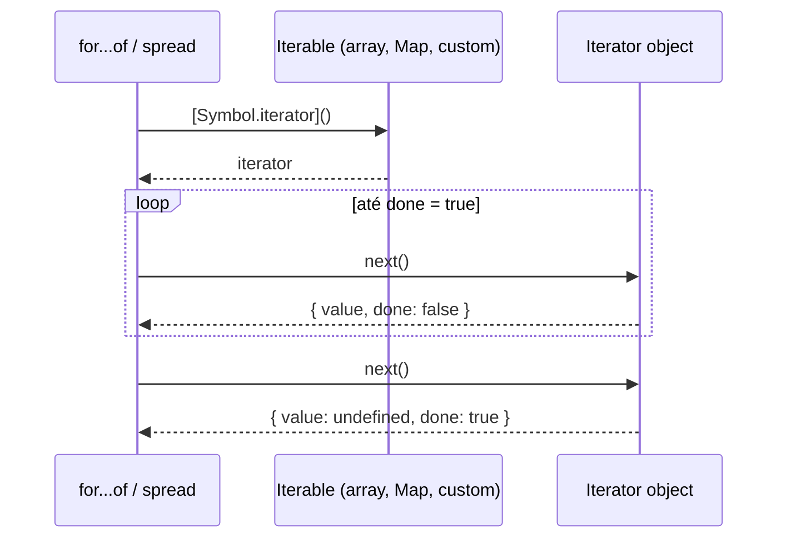

# Iterators e generators

> [!abstract] TL;DR
> O protocolo de iteração (`Symbol.iterator` + `next()`) define como qualquer objeto pode ser percorrido sequencialmente — é o que faz `for...of`, spread e destructuring funcionarem com arrays, strings, Maps e objetos customizados. Generators (`function*` + `yield`) são a forma mais ergonômica de implementar esse protocolo com **avaliação lazy**: valores são produzidos sob demanda, um por vez, sem materializar toda a coleção na memória. Async generators (`async function*` + `for await...of`) estendem isso para fontes assíncronas como streams e paginação de API. No ES2025, a classe `Iterator` ganhou helpers nativos (`.map()`, `.filter()`, `.take()`) que compõem transformações sem criar arrays intermediários.

---

Imagine que você tem uma lista de 50 milhões de registros num banco de dados. Se você transformar isso num array antes de processar, vai explodir a memória. Mas e se você pudesse processar um item por vez, sob demanda, como uma esteira rolante que só avança quando você pede? Esse é exatamente o problema que iterators e generators resolvem.

---

## O protocolo de iteração

Antes do ES2015, percorrer coleções em JavaScript era inconsistente: arrays tinham `forEach`, NodeLists do DOM exigiam conversão manual, e objetos precisavam de `Object.keys()`. ES2015 unificou tudo com um contrato formal.

O protocolo tem duas partes:

**Iterable** — qualquer objeto que implemente `[Symbol.iterator]()` retornando um iterator. Arrays, strings, Maps, Sets e geradores são iterables nativos.

**Iterator** — qualquer objeto com um método `next()` que retorna `{ value, done }`. Quando `done` é `false`, `value` contém o próximo elemento. Quando `done` é `true`, a sequência terminou e `value` costuma ser `undefined`.

```js
// Criando um iterator manualmente
const arr = [10, 20, 30];
const iter = arr[Symbol.iterator](); // iterator

iter.next(); // { value: 10, done: false }
iter.next(); // { value: 20, done: false }
iter.next(); // { value: 30, done: false }
iter.next(); // { value: undefined, done: true }
```

O diagrama abaixo mostra como os consumidores (`for...of`, spread) interagem com o protocolo:



### O que consome iterables?

Qualquer construção que "percorre uma sequência" usa o protocolo por baixo dos panos:

```js
// for...of
for (const x of [1, 2, 3]) console.log(x);

// spread
const copia = [...minhaColecao];

// destructuring
const [primeiro, segundo] = minhaColecao;

// Array.from
const arr = Array.from(minhaColecao);

// Promise.all / Promise.race
await Promise.all(minhaColecao);
```

Nenhuma dessas construções sabe que tipo de coleção está consumindo — elas só chamam `[Symbol.iterator]()` e depois `next()` repetidamente.

### Criando um iterable customizado

Um objeto normal não é iterable. Para torná-lo, implemente `[Symbol.iterator]`:

```js
const range = {
  from: 1,
  to: 5,
  [Symbol.iterator]() {
    let current = this.from;
    const last = this.to;
    return {
      next() {
        if (current <= last) {
          return { value: current++, done: false };
        }
        return { value: undefined, done: true };
      }
    };
  }
};

console.log([...range]); // [1, 2, 3, 4, 5]
for (const n of range) console.log(n); // 1, 2, 3, 4, 5
```

Funciona — mas perceba o quanto de boilerplate há aqui: o objeto externo, o objeto interno retornado, o `next()`, o estado `current`. Generators resolvem exatamente isso.

---

## Generators: iteradores sem boilerplate

Um generator é uma função que pode pausar a própria execução e retomá-la depois. O `yield` marca o ponto de pausa; cada chamada a `next()` resume o generator até o próximo `yield`.

```js
function* meuGenerator() {
  yield 1;
  yield 2;
  yield 3;
}

const gen = meuGenerator(); // não executa ainda!
gen.next(); // { value: 1, done: false }
gen.next(); // { value: 2, done: false }
gen.next(); // { value: 3, done: false }
gen.next(); // { value: undefined, done: true }
```

> [!question]- Por que `meuGenerator()` não executa imediatamente?
> Quando você chama `meuGenerator()`, o JavaScript cria o objeto generator e retorna — sem executar nenhuma linha do corpo. A primeira linha só roda quando você chama `.next()` pela primeira vez. Isso é diferente de funções normais, que executam imediatamente na chamada. É esse comportamento que habilita a avaliação lazy.

A beleza dos generators é que eles **automaticamente implementam o protocolo de iteração**: o objeto retornado por um generator tem `[Symbol.iterator]()` que retorna ele mesmo — ou seja, um generator é ao mesmo tempo iterable e iterator.

```js
const gen = meuGenerator();
gen[Symbol.iterator]() === gen; // true
```

### A analogia da esteira

Pense num generator como uma esteira de fábrica com um botão de pausa. Cada `yield` é um item colocado na esteira e um toque no botão de pausa. A esteira só volta a rodar quando alguém (o consumidor) aperta "continuar" — ou seja, chama `next()`. Se ninguém chama `next()`, a esteira fica parada indefinidamente, sem desperdiçar energia.

### Reescrevendo o `range` com generator

```js
function* range(from, to) {
  for (let i = from; i <= to; i++) {
    yield i;
  }
}

console.log([...range(1, 5)]); // [1, 2, 3, 4, 5]
for (const n of range(1, 100_000)) {
  if (n > 3) break; // saiu em 3, o generator nunca chegou ao 4
}
```

O `range(1, 100_000)` acima nunca chega a calcular os 100.000 valores — o `break` interrompe a iteração e o generator é descartado. Isso é lazy evaluation em ação.

### Sequências infinitas

Generators podem representar sequências que nunca terminam — algo impossível com arrays:

```js
function* naturais() {
  let n = 0;
  while (true) { // loop infinito intencional!
    yield n++;
  }
}

function* fibonacci() {
  let [a, b] = [0, 1];
  while (true) {
    yield a;
    [a, b] = [b, a + b];
  }
}

// Pegar só os primeiros 10 fibonacci
const gen = fibonacci();
const dez = Array.from({ length: 10 }, () => gen.next().value);
// [0, 1, 1, 2, 3, 5, 8, 13, 21, 34]
```

> [!info] O generator infinito não trava o processo
> O loop `while(true)` dentro do generator não trava o JavaScript porque o código só avança até o próximo `yield` a cada chamada de `next()`. A suspensão é real — o call stack do generator fica preservado entre chamadas.

### Comunicação bidirecional: `next(valor)` e o yield como receptor

A maioria usa generators como emissores unilaterais de valores — mas o canal vai nos dois sentidos. O valor passado para `next(valor)` é capturado como resultado da expressão `yield` corrente no body do generator.

Pense assim: do ponto de vista do generator, `yield X` é uma operação em dois tempos. Primeiro, ele **emite** `X` para quem chamou `next()`. Depois, quando o próximo `next(Y)` é chamado, o generator **recebe** `Y` como resultado dessa mesma expressão `yield`. É uma pausa com handshake.

```js
function* acumulador() {
  let total = 0;
  while (true) {
    const n = yield total; // emite total, depois recebe n
    total += n ?? 0;
  }
}

const acc = acumulador();
acc.next();    // inicia — { value: 0, done: false }
acc.next(10);  // envia 10 → total = 10 — { value: 10, done: false }
acc.next(5);   // envia 5  → total = 15 — { value: 15, done: false }
```

> [!warning] O primeiro `next()` descarta o argumento
> Não existe `yield` anterior para capturar o valor passado no **primeiro** `next()` — o generator ainda não atingiu nenhum `yield`. Por isso, a convenção é sempre chamar o primeiro `next()` sem argumento, apenas para armar o generator no primeiro `yield`.

Essa característica torna generators úteis para implementar **co-rotinas** e **state machines** — o caller controla o fluxo enviando dados, e o generator reage. Bibliotecas de gerenciamento de efeitos colaterais como `redux-saga` constroem toda a sua arquitetura sobre esse mecanismo.

### O valor de retorno do generator: o detalhe silencioso

Quando um generator termina — seja chegando ao fim do corpo ou executando um `return valor` — o último `next()` retorna `{ value: valor, done: true }`. Mas `for...of` e o spread operator **descartam esse valor** silenciosamente: eles simplesmente param quando `done: true`, sem capturar `value`.

```js
function* gen() {
  yield 1;
  yield 2;
  return 'fim'; // for...of e spread nunca veem isso
}

// Consumidores idiomáticos descartam o return value
for (const x of gen()) console.log(x); // 1, 2  — 'fim' ignorado
console.log([...gen()]);                 // [1, 2] — 'fim' ignorado

// Para capturar, use next() diretamente
const g = gen();
g.next(); // { value: 1, done: false }
g.next(); // { value: 2, done: false }
g.next(); // { value: 'fim', done: true } ← só aqui
```

Isso importa na prática quando você compõe generators com `yield*` — o valor de `return` do sub-generator trafega pelo `yield*` e fica disponível para o pai, mesmo sendo invisível para o consumidor externo. Detalhe da próxima seção.

---

## `yield*`: delegação entre generators

`yield*` delega para outro iterable ou generator, emitindo todos os valores dele em sequência:

```js
function* letras() {
  yield* ['a', 'b', 'c']; // delega para o array
}

function* abc() {
  yield 'início';
  yield* letras(); // delega para outro generator
  yield 'fim';
}

console.log([...abc()]); // ['início', 'a', 'b', 'c', 'fim']
```

Isso é equivalente a um `for...of` interno mais `yield`, mas muito mais conciso. É útil para compor generators em pipelines:

```js
function* flatten(arr) {
  for (const item of arr) {
    if (Array.isArray(item)) {
      yield* flatten(item); // recursão lazy!
    } else {
      yield item;
    }
  }
}

console.log([...flatten([1, [2, [3, 4]], 5])]); // [1, 2, 3, 4, 5]
```

### O valor de retorno do `yield*`

Por que isso importa para um adepto? Porque `yield*` é uma **expressão com valor de retorno** — e isso cria uma assimetria invisível que pega até desenvolvedores experientes.

Quando um sub-generator executa `return valor`, esse valor aparece em `{ done: true, value: valor }`. O `yield*` captura esse `value` e o disponibiliza para o generator pai. Mas o consumidor externo (`for...of`, spread) nunca vê esse valor — ele para assim que `done: true` chega.

```js
function* sub() {
  yield 1;
  yield 2;
  return 'retorno-do-sub'; // não emitido como yield — vai no { done: true, value }
}

function* pai() {
  const resultado = yield* sub(); // captura 'retorno-do-sub'
  console.log(resultado);          // 'retorno-do-sub'
  yield 3;
}

console.log([...pai()]); // [1, 2, 3] — 'retorno-do-sub' não aparece aqui
```

> [!info] A assimetria do `yield*`
> O que o pai vê (o valor de retorno do sub-generator) é diferente do que o consumidor vê (apenas os valores yielded). Isso significa que você pode usar o `return` de um sub-generator como um **canal de comunicação** entre generators compostos — sem expor o dado para fora. Uma forma elegante de implementar protocolos internos.

---

## Iterator Helpers — ES2025

Antes do ES2025, transformar iterators exigia materializar arrays intermediários ou escrever generators manualmente. O ES2025 resolveu isso com [[Dicionário de JavaScript#Iterator Helpers\|Iterator Helpers]] nativos em `Iterator.prototype`:

```js
// ANTES: criava 3 arrays intermediários
const resultado = arr
  .filter(x => x.active)
  .map(x => x.name)
  .slice(0, 10);

// DEPOIS (ES2025): zero arrays intermediários até o .toArray()
const resultado = arr.values()
  .filter(x => x.active)
  .map(x => x.name)
  .take(10)
  .toArray();
```

Os helpers disponíveis:

| Método | Comportamento |
|--------|--------------|
| `.map(fn)` | Transforma cada valor — lazy |
| `.filter(fn)` | Filtra por predicado — lazy |
| `.take(n)` | Limita a n elementos — lazy |
| `.drop(n)` | Pula os primeiros n — lazy |
| `.flatMap(fn)` | Mapeia e achata — lazy |
| `.forEach(fn)` | Consome o iterator (efeito colateral) |
| `.reduce(fn, init)` | Agrega em um valor |
| `.toArray()` | Materializa o iterator num array |
| `Iterator.from(iter)` | Envolve qualquer iterable com os helpers |

**Suporte (2026):** Node 22+ LTS, Node 24, Chrome/Firefox/Safari (Baseline desde março 2025), TypeScript 5.6+ com `lib.es2025.iterator.d.ts`.

```js
// Números primos lazy usando helpers
function* sieve() {
  const primes = [];
  for (const n of naturais()) {
    if (n < 2) continue;
    if (primes.every(p => n % p !== 0)) {
      primes.push(n);
      yield n;
    }
  }
}

Iterator.from(sieve())
  .take(10)
  .toArray(); // [2, 3, 5, 7, 11, 13, 17, 19, 23, 29]
```

### O que vem depois: Async Iterator Helpers (ES2026)

Os helpers do ES2025 são síncronos. Para async iterators, a proposta `AsyncIterator.prototype` (TC39, Stage 2.7 em abril 2026) espelha a mesma API — `.map()`, `.filter()`, `.take()`, etc. — mas com um diferencial arquitetural importante: os métodos produtores podem suportar **concorrência controlada**.

Pense no caso de filtrar 1000 URLs fazendo `fetch()` para checar disponibilidade. Com a versão síncrona, você processa uma por vez. Com concorrência controlada nos async helpers, o runtime pode iniciar N fetches em paralelo, mantendo a ordem de saída. Um trade-off que a API síncrona não tem como oferecer.

Até a proposta ser finalizada, `Iterator.from()` (ES2025) só funciona com iterables síncronos — você precisará de `for await...of` manual ou bibliotecas como `iter-tools` para pipelines async.

---

## Protocolo completo: `return()` e `throw()`

O protocolo de iteração tem dois métodos além de `next()` que raramente aparecem em tutoriais, mas são fundamentais para código robusto: `return(valor)` e `throw(erro)`.

**Por que existem?** Porque o consumidor pode querer encerrar a iteração antes do fim — seja por `break`, exceção ou lógica de negócio. Sem um canal de comunicação de volta, o generator ficaria suspenso para sempre, mantendo recursos (conexões, handles de arquivo) abertos.

```js
function* comRecurso() {
  const conn = abrirConexao();
  try {
    while (true) {
      yield conn.lerProximo();
    }
  } finally {
    conn.fechar(); // sempre executa — mesmo com return() externo
  }
}

const gen = comRecurso();
gen.next();          // abre conexão, primeiro valor
gen.return('stop');  // força o generator a executar o finally
// → conn.fechar() é chamado; retorna { value: 'stop', done: true }
```

O ponto crítico: **`for...of` chama `return()` implicitamente** quando você usa `break` ou lança uma exceção dentro do loop. O generator recebe o sinal e executa qualquer bloco `finally` pendente — sem você precisar fazer nada.

```js
for (const item of comRecurso()) {
  if (condicao(item)) break; // ← chama gen.return() automaticamente
  // conn.fechar() executa mesmo com break
}
```

**`gen.throw(erro)`** injeta um erro no ponto de pausa, como se um `throw` fosse inserido ali. O generator pode capturar com `try/catch` e continuar, ou deixar propagar para o caller.

> [!summary]
> Use `try/finally` dentro de generators que gerenciam recursos. O `finally` é a garantia de cleanup — ativado tanto pela conclusão normal quanto por `return()` e `throw()` externos.

## Async iterators e `for await...of`

Tudo o que vimos até aqui é síncrono: `next()` retorna o valor imediatamente. Mas e quando cada valor envolve uma operação assíncrona — buscar uma página de API, ler um chunk de arquivo, consumir um stream?

A versão async do protocolo:
- **Async iterable**: objeto com `[Symbol.asyncIterator]()` retornando um [[Dicionário de JavaScript#async iterator\|async iterator]]
- **Async iterator**: `next()` retorna uma **Promise** de `{ value, done }`
- **Async generator**: `async function*` com `yield` e `await` no mesmo corpo

```js
// Async generator básico
async function* contador() {
  let n = 0;
  while (true) {
    await new Promise(res => setTimeout(res, 100)); // simula I/O
    yield n++;
  }
}

// Consumindo com for await...of
for await (const valor of contador()) {
  console.log(valor); // 0, 1, 2... a cada 100ms
  if (valor >= 4) break;
}
```

O `for await...of` é o consumidor canônico de async iterables. Ele chama `[Symbol.asyncIterator]()`, e depois `await iter.next()` a cada iteração — sem callback hell, sem chains de `.then()`.

---

## Casos práticos

### Caso 1: Range lazy com ES2025 Iterator Helpers

O caso de uso mais direto: gerar sequências numéricas sem alocar arrays, compostos com helpers.

```js
function* range(start, end, step = 1) {
  for (let i = start; i < end; i += step) {
    yield i;
  }
}

// Soma dos quadrados dos números pares de 0 a 1000
// Nenhum array intermediário é criado
const resultado = Iterator.from(range(0, 1000))
  .filter(n => n % 2 === 0)
  .map(n => n * n)
  .reduce((acc, n) => acc + n, 0);

console.log(resultado); // 332833000

// Comparação com abordagem array (3x mais memória):
// Array.from({length: 1000}, (_, i) => i)
//   .filter(...)  // array intermediário
//   .map(...)     // array intermediário
//   .reduce(...)
```

**Quando usar**: processamento de listas grandes onde você não precisa do array completo; pipelines de transformação onde só o resultado final importa.

### Caso 2: Paginação de API com async generator

APIs REST geralmente paginate os resultados. A abordagem ingênua — acumular todas as páginas num array antes de processar — desperdiça memória e atrasa o primeiro resultado. Um async generator resolve isso de forma elegante:

```js
async function* paginasDeUsuarios(baseUrl, pageSize = 100) {
  let page = 1;
  let hasMore = true;

  while (hasMore) {
    const response = await fetch(
      `${baseUrl}/users?page=${page}&limit=${pageSize}`
    );
    const { data, meta } = await response.json();

    for (const user of data) {
      yield user; // entrega um usuário por vez
    }

    hasMore = meta.hasNextPage;
    page++;
  }
}

// Processamento: começa assim que a primeira página chega
for await (const user of paginasDeUsuarios('https://api.example.com')) {
  await processarUsuario(user); // processa enquanto busca as próximas páginas
  if (user.id > 500) break;    // pode parar no meio sem buscar o restante
}
```

**Por que isso é melhor**: com o async generator, você começa a processar os usuários da primeira página enquanto a segunda ainda está sendo buscada. E se precisar parar no meio (ex: encontrou o que buscava), o `break` descarta o generator sem buscar as páginas restantes.

O mesmo padrão funciona para:
- Leitura linha a linha de arquivos grandes com Node.js `readline`
- Consumo de WebSockets ou Server-Sent Events
- Cursores de banco de dados
- Streams do Node.js (que são async iterables nativos desde Node 10)

```js
// Node.js: ler arquivo linha a linha sem carregar tudo na memória
import { createReadStream } from 'fs';
import { createInterface } from 'readline';

async function* linhasDoArquivo(path) {
  const rl = createInterface({
    input: createReadStream(path),
    crlfDelay: Infinity
  });
  yield* rl; // readline interface é async iterable!
}

let count = 0;
for await (const linha of linhasDoArquivo('/var/log/app.log')) {
  if (linha.includes('ERROR')) count++;
}
console.log(`Total de erros: ${count}`);
```

---

## Armadilhas comuns

> [!warning] Generator não é reiniciável
> **O que acontece:** você tenta reutilizar um generator que já foi exaurido e `next()` sempre retorna `{ value: undefined, done: true }`. **Por quê:** o estado interno de um generator (posição de execução, variáveis locais) é preservado entre chamadas de `next()`, mas uma vez que `done: true` é retornado, o generator está permanentemente esgotado. **Como evitar:** se precisar iterar mais de uma vez, guarde a **factory** (a função generator), não o objeto generator. Chame `meuGen()` novamente para uma nova instância. Ou, se for um objeto iterable customizado, certifique-se de que `[Symbol.iterator]()` cria um novo iterator a cada chamada.

```js
// ❌ Reutilizando o mesmo generator
const gen = range(1, 3);
console.log([...gen]); // [1, 2, 3]
console.log([...gen]); // [] — já exauriu!

// ✅ Chamando a factory novamente
console.log([...range(1, 3)]); // [1, 2, 3]
console.log([...range(1, 3)]); // [1, 2, 3]
```

> [!warning] `for...of` não funciona em objetos simples
> **O que acontece:** tentar usar `for (const x of meuObjeto)` em um POJO (Plain Old JavaScript Object) lança `TypeError: meuObjeto is not iterable`. **Por quê:** objetos `{}` não implementam `[Symbol.iterator]` por design — a iteração seria ambígua (chaves? valores? entries?). **Como evitar:** use `Object.keys()`, `Object.values()` ou `Object.entries()` explicitamente, ou implemente `[Symbol.iterator]` no objeto se ele tem semântica de coleção.

```js
const obj = { a: 1, b: 2 };

// ❌ Lança TypeError
for (const v of obj) { ... }

// ✅ Correto
for (const [k, v] of Object.entries(obj)) { ... }
```

> [!warning] `yield` só pausa o generator, não funções internas
> **O que acontece:** usar `yield` dentro de um callback passado ao generator não funciona — o `yield` tem que estar diretamente no corpo do `function*`. **Por quê:** `yield` é uma expressão léxica do `function*` mais próximo. Um callback é uma função separada — não compartilha o contexto do generator. **Como evitar:** substituir `.forEach` por `for...of` dentro do generator, ou usar `yield*` com um iterable.

```js
function* errado(arr) {
  arr.forEach(item => {
    yield item; // ❌ SyntaxError: yield não está em generator function
  });
}

function* correto(arr) {
  for (const item of arr) {
    yield item; // ✅
  }
  // ou simplesmente:
  // yield* arr;
}
```

> [!warning] Async generator precisa de `for await`, não `for...of`
> **O que acontece:** usar `for...of` num async generator retorna Promises, não os valores resolvidos. **Por quê:** async iterators retornam `Promise<{value, done}>` de `next()`. O `for...of` síncrono não aguarda essas Promises. **Como evitar:** sempre use `for await...of` para consumir async generators e async iterables.

```js
async function* ticks() {
  yield 1; yield 2;
}

// ❌ Errado — itera sobre Promises
for (const tick of ticks()) {
  console.log(tick); // Promise { ... }
}

// ✅ Correto
for await (const tick of ticks()) {
  console.log(tick); // 1, 2
}
```

---

## Como explicar em inglês

Iterators and generators come up frequently in system design and JavaScript interviews. Here are natural phrasings:

> "The iterable protocol lets any object participate in `for...of` and spread by implementing `Symbol.iterator`, which returns an iterator — an object with a `next()` method that produces `{ value, done }` pairs one at a time."

> "Generators are a syntactic sugar over the iterator protocol: `function*` and `yield` let you write lazy sequences without managing state manually. The engine suspends execution at each `yield` and resumes it on the next `next()` call."

> "Async generators extend this to asynchronous data sources — think paginated APIs or Node.js streams — letting you process items as they arrive with `for await...of`, without loading everything into memory first."

| PT | EN |
|----|----|
| protocolo de iteração | iteration protocol |
| iterável | iterable |
| iterador | iterator |
| gerador | generator |
| avaliação lazy (preguiçosa) | lazy evaluation |
| produção sob demanda | on-demand production |
| sequência infinita | infinite sequence |
| delegação (`yield*`) | generator delegation |
| iterador assíncrono | async iterator |
| helpers de iterator | iterator helpers |

---

## Resumo em 1 linha

Iterators e generators são o contrato pelo qual qualquer objeto em JavaScript pode expor uma sequência consumível passo a passo, com generators tornando esse contrato trivial de implementar e lazy por natureza.

---

## O que vem a seguir

O protocolo de iteração foi projetado para funcionar tanto em contextos síncronos quanto assíncronos — e a peça que une os dois lados é `async/await`. Generators assíncronos são apenas async functions que podem pausar com `yield`, e para entender como o JavaScript coordena essas suspensões e retomadas na event loop, o próximo passo natural é aprofundar o modelo de concorrência assíncrona da linguagem.

- [[03-Dominios/Tecnologia/JavaScript/14 - Promises|14 - Promises]] — a primitiva sobre a qual async/await e async generators são construídos
- [[03-Dominios/Tecnologia/JavaScript/08 - Arrays e métodos|08 - Arrays e métodos]] — os métodos de array que inspiraram os Iterator Helpers do ES2025, e quando preferir um ao outro
- [[03-Dominios/Tecnologia/JavaScript/Dicionário de JavaScript|Dicionário de JavaScript]] — termos de iteração e protocolo
- [[03-Dominios/Tecnologia/Node/Streams/08 - Async iteration de streams|Node/Streams 08 — Async iteration de streams]] — como `Readable` implementa `Symbol.asyncIterator` e por que `Readable.from(asyncGen())` une o protocolo de generators com streams do Node

---

## Fontes

- **MDN Web Docs** — [*Iteration protocols*](https://developer.mozilla.org/en-US/docs/Web/JavaScript/Reference/Iteration_protocols) — referência canônica do protocolo iterable/iterator com exemplos de implementação
- **MDN Web Docs** — [*Iterators and Generators*](https://developer.mozilla.org/en-US/docs/Web/JavaScript/Guide/Iterators_and_generators) — guia completo cobrindo generators, `yield*` e async generators
- **MDN Web Docs** — [*Generator.prototype.next()*](https://developer.mozilla.org/en-US/docs/Web/JavaScript/Reference/Global_Objects/Generator/next) — documentação da comunicação bidirecional via `next(valor)` e expressão `yield`
- **MDN Web Docs** — [*Generator.prototype.return()*](https://developer.mozilla.org/en-US/docs/Web/JavaScript/Reference/Global_Objects/Generator/return) — protocolo de limpeza com `return()` e `finally`
- **MDN Web Docs** — [*Generator.prototype.throw()*](https://developer.mozilla.org/en-US/docs/Web/JavaScript/Reference/Global_Objects/Generator/throw) — injeção de erros em generators com `throw()`
- **LogRocket Blog** — [*Iterator helpers: The most underrated feature in ES2025*](https://blog.logrocket.com/iterator-helpers-es2025/) — cobertura detalhada dos helpers, casos de uso e comparação de performance
- **Axel Rauschmayer (exploringjs.com)** — [*Synchronous iteration ES6 (ES2025 Edition)*](https://exploringjs.com/js/book/ch_sync-iteration.html) — análise aprofundada do protocolo com especificação formal
- **MDN Web Docs** — [*async function\**](https://developer.mozilla.org/en-US/docs/Web/JavaScript/Reference/Statements/async_function*) — referência de async generators com exemplos de streaming
- **DEV Community** — [*Native Iterator Helpers Just Shipped*](https://dev.to/gabrielanhaia/native-iterator-helpers-just-shipped-heres-what-you-stop-doing-2i0m) — comparações práticas antes/depois dos helpers nativos
- **TC39** — [*proposal-async-iterator-helpers*](https://github.com/tc39/proposal-async-iterator-helpers) — proposta Stage 2.7 (abril 2026) de async iterator helpers com concorrência controlada
